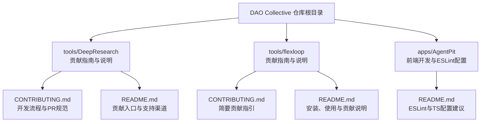
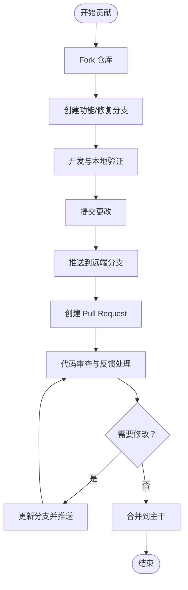
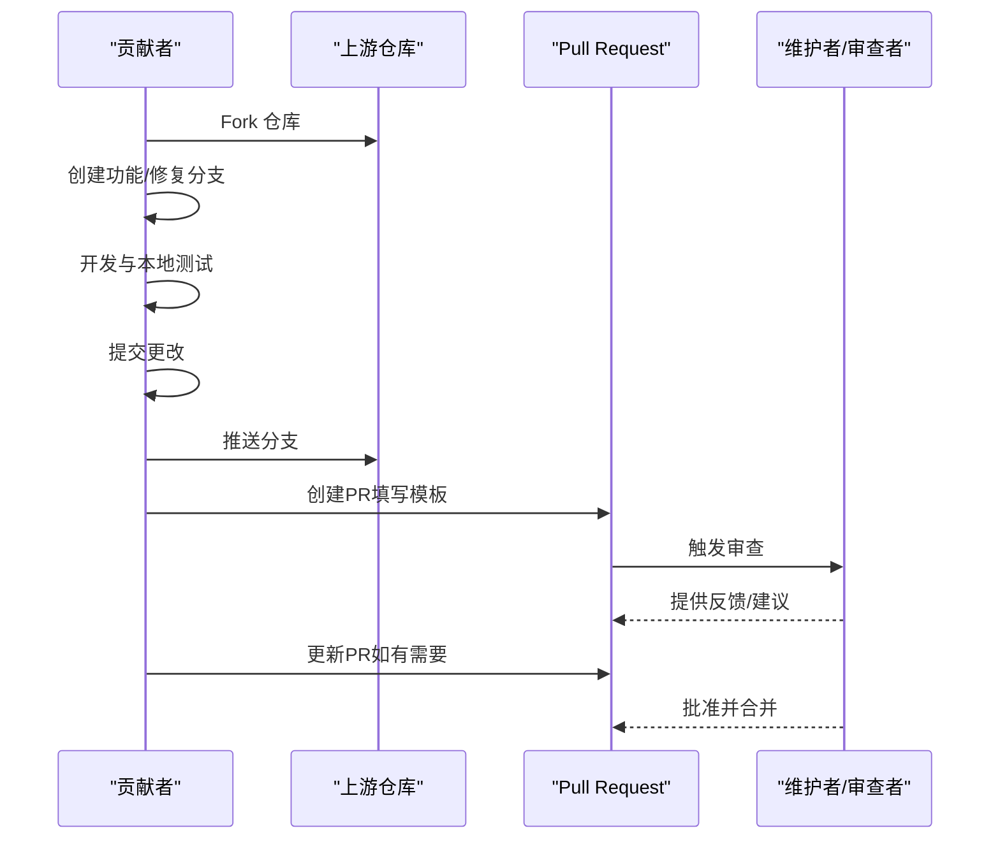
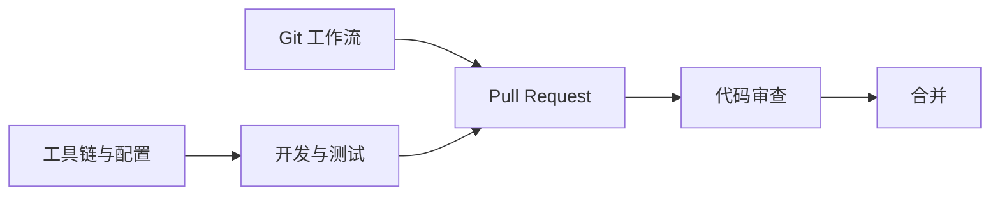

# 贡献流程

<cite>
**本文引用的文件**
- [tools/DeepResearch/CONTRIBUTING.md](file://tools/DeepResearch/CONTRIBUTING.md)
- [tools/DeepResearch/README.md](file://tools/DeepResearch/README.md)
- [tools/flexloop/CONTRIBUTING.md](file://tools/flexloop/CONTRIBUTING.md)
- [tools/flexloop/README.md](file://tools/flexloop/README.md)
- [apps/AgentPit/README.md](file://apps/AgentPit/README.md)
</cite>

## 目录
1. [引言](#引言)
2. [项目结构](#项目结构)
3. [核心组件](#核心组件)
4. [架构总览](#架构总览)
5. [详细组件分析](#详细组件分析)
6. [依赖分析](#依赖分析)
7. [性能考虑](#性能考虑)
8. [故障排查指南](#故障排查指南)
9. [结论](#结论)
10. [附录](#附录)

## 引言
本指南面向DAO Collective生态中的贡献者，覆盖从Fork到合并的完整贡献流程，涵盖Pull Request审查与合并、Issue报告标准、代码审查与反馈处理、文档与翻译贡献、社区行为准则与沟通规范，以及新贡献者的入门与常见问题解答。不同子项目可能采用不同的贡献模板与工作流，本文将以仓库内现有的贡献与说明文件为基础，给出统一的实践建议与流程图示。

## 项目结构
DAO Collective包含多个子项目与工具模块，贡献流程在各子项目中略有差异。当前仓库中明确提供了两份贡献指南与说明文档，分别来自DeepResearch与flexloop两个工具模块；同时，AgentPit应用的README中包含ESLint配置与TypeScript/React开发相关说明，有助于前端贡献者的环境准备。

图表来源
- [tools/DeepResearch/README.md:57-59](file://tools/DeepResearch/README.md#L57-L59)
- [tools/DeepResearch/CONTRIBUTING.md:1-150](file://tools/DeepResearch/CONTRIBUTING.md#L1-L150)
- [tools/flexloop/README.md:87-92](file://tools/flexloop/README.md#L87-L92)
- [tools/flexloop/CONTRIBUTING.md:1-3](file://tools/flexloop/CONTRIBUTING.md#L1-L3)
- [apps/AgentPit/README.md:14-44](file://apps/AgentPit/README.md#L14-L44)

章节来源
- [tools/DeepResearch/README.md:57-59](file://tools/DeepResearch/README.md#L57-L59)
- [tools/DeepResearch/CONTRIBUTING.md:1-150](file://tools/DeepResearch/CONTRIBUTING.md#L1-L150)
- [tools/flexloop/README.md:87-92](file://tools/flexloop/README.md#L87-L92)
- [tools/flexloop/CONTRIBUTING.md:1-3](file://tools/flexloop/CONTRIBUTING.md#L1-L3)
- [apps/AgentPit/README.md:14-44](file://apps/AgentPit/README.md#L14-L44)

## 核心组件
- 贡献指南与模板
  - DeepResearch提供完整的中文贡献指南，包含开发环境设置、分支命名、提交与PR规范、代码风格、测试与社区准则等。
  - flexloop提供简要贡献指引，强调Fork与分支命名、代码风格与类型检查、PR说明要点。
- 项目说明与支持
  - 各子项目README提供贡献入口、问题反馈与讨论渠道，便于贡献者快速定位支持路径。
- 前端开发参考
  - AgentPit的README包含ESLint与TypeScript配置建议，帮助前端贡献者统一代码风格与开发体验。

章节来源
- [tools/DeepResearch/CONTRIBUTING.md:15-118](file://tools/DeepResearch/CONTRIBUTING.md#L15-L118)
- [tools/flexloop/CONTRIBUTING.md:1-3](file://tools/flexloop/CONTRIBUTING.md#L1-L3)
- [tools/DeepResearch/README.md:57-59](file://tools/DeepResearch/README.md#L57-L59)
- [tools/flexloop/README.md:82-92](file://tools/flexloop/README.md#L82-L92)
- [apps/AgentPit/README.md:14-44](file://apps/AgentPit/README.md#L14-L44)

## 架构总览
下图展示贡献者从发现到完成贡献的总体流程，包括Fork、分支、提交、PR、审查与合并的关键节点，并映射到仓库内的现有贡献与说明文件。

图表来源
- [tools/DeepResearch/CONTRIBUTING.md:74-104](file://tools/DeepResearch/CONTRIBUTING.md#L74-L104)
- [tools/flexloop/CONTRIBUTING.md:1-3](file://tools/flexloop/CONTRIBUTING.md#L1-L3)
- [tools/DeepResearch/README.md:57-59](file://tools/DeepResearch/README.md#L57-L59)
- [tools/flexloop/README.md:82-92](file://tools/flexloop/README.md#L82-L92)

## 详细组件分析

### 贡献流程（Fork、分支、提交与PR）
- Fork与克隆
  - 建议先Fork目标仓库，再克隆到本地进行开发。
- 分支策略
  - 使用清晰的功能/修复命名，遵循“feature/...”或“fix/...”等约定，便于追踪与审查。
- 提交与推送
  - 提交信息应简洁明确，描述变更动机与影响范围；推送后即可创建PR。
- PR规范
  - 填写PR模板（如存在），完整描述背景、改动点、影响范围与验证方式；关联相关Issue。

图表来源
- [tools/DeepResearch/CONTRIBUTING.md:74-104](file://tools/DeepResearch/CONTRIBUTING.md#L74-L104)
- [tools/flexloop/CONTRIBUTING.md:1-3](file://tools/flexloop/CONTRIBUTING.md#L1-L3)

章节来源
- [tools/DeepResearch/CONTRIBUTING.md:74-104](file://tools/DeepResearch/CONTRIBUTING.md#L74-L104)
- [tools/flexloop/CONTRIBUTING.md:1-3](file://tools/flexloop/CONTRIBUTING.md#L1-L3)

### Issue 报告标准与最佳实践
- 明确标题：简洁描述问题或需求。
- 详细描述：包含复现步骤、期望结果与实际结果、环境信息（操作系统、浏览器/Node版本、依赖版本等）。
- 标签与分类：按模板选择合适的标签（如bug、enhancement、help wanted等）。
- 关联与跟踪：关联相关PR或讨论，避免重复提交。
- 行为准则：保持尊重与建设性，遵守社区规范。

章节来源
- [tools/DeepResearch/README.md:61-64](file://tools/DeepResearch/README.md#L61-L64)
- [tools/flexloop/README.md:82-85](file://tools/flexloop/README.md#L82-L85)

### 代码审查流程与反馈处理
- 审查清单
  - 功能正确性、边界条件、错误处理、性能与安全、可读性与注释、测试覆盖、文档更新。
- 反馈处理
  - 对每条评论逐项回复，说明修改原因或提供替代方案；必要时更新PR并推送。
- 合并策略
  - 通常需至少一位维护者批准；确保CI通过、无冲突、符合风格与规范。

章节来源
- [tools/DeepResearch/CONTRIBUTING.md:106-118](file://tools/DeepResearch/CONTRIBUTING.md#L106-L118)
- [tools/DeepResearch/CONTRIBUTING.md:133-139](file://tools/DeepResearch/CONTRIBUTING.md#L133-L139)

### 文档贡献与翻译
- 文档类型
  - 用户文档、开发者指南、API参考、架构说明、FAQ与最佳实践。
- 质量要求
  - 结构清晰、语言准确、示例完整、链接有效；遵循项目既有的文档风格与模板。
- 翻译规范
  - 保持术语一致，避免直译导致歧义；必要时提供双语对照说明。
- 提交流程
  - 与代码贡献相同，创建分支、提交、PR审查、合并。

章节来源
- [tools/DeepResearch/CONTRIBUTING.md:10-13](file://tools/DeepResearch/CONTRIBUTING.md#L10-L13)
- [tools/DeepResearch/CONTRIBUTING.md:113-118](file://tools/DeepResearch/CONTRIBUTING.md#L113-L118)

### 社区行为准则与沟通规范
- 尊重与包容：对不同背景的贡献者保持尊重，营造开放友好的氛围。
- 建设性反馈：指出问题的同时提供改进建议，避免人身攻击。
- 专注改进：将讨论聚焦于提升项目质量与用户体验。
- 渠道使用：使用Issue进行问题与需求管理，使用Discussion进行讨论与头脑风暴。

章节来源
- [tools/DeepResearch/CONTRIBUTING.md:133-139](file://tools/DeepResearch/CONTRIBUTING.md#L133-L139)
- [tools/DeepResearch/README.md:61-64](file://tools/DeepResearch/README.md#L61-L64)
- [tools/flexloop/README.md:82-85](file://tools/flexloop/README.md#L82-L85)

### 新贡献者入门与常见问题
- 入门步骤
  - 阅读对应子项目的README与贡献指南，准备开发环境，从简单Issue入手。
- 常见问题
  - 如何查找适合新手的任务？可在Issue中标注“good first issue”或“beginner friendly”。
  - 如何避免频繁冲突？保持分支与上游同步，小步提交，及时更新。
  - 如何加速审查？确保PR描述完整、测试通过、风格一致、文档更新。

章节来源
- [tools/DeepResearch/README.md:57-59](file://tools/DeepResearch/README.md#L57-L59)
- [tools/DeepResearch/CONTRIBUTING.md:140-149](file://tools/DeepResearch/CONTRIBUTING.md#L140-L149)
- [tools/flexloop/README.md:82-92](file://tools/flexloop/README.md#L82-L92)

## 依赖分析
- 贡献流程依赖关系
  - Fork与分支命名依赖于Git工作流；PR模板与审查依赖于GitHub/GitLab等平台能力；测试与格式化工具依赖于项目脚本与配置。
- 工具链与配置
  - 不同子项目采用不同工具链（如Python构建系统、Node/Vite等），需按各自README与贡献指南准备环境。

图表来源
- [tools/DeepResearch/CONTRIBUTING.md:74-104](file://tools/DeepResearch/CONTRIBUTING.md#L74-L104)
- [tools/flexloop/CONTRIBUTING.md:1-3](file://tools/flexloop/CONTRIBUTING.md#L1-L3)

章节来源
- [tools/DeepResearch/CONTRIBUTING.md:74-104](file://tools/DeepResearch/CONTRIBUTING.md#L74-L104)
- [tools/flexloop/CONTRIBUTING.md:1-3](file://tools/flexloop/CONTRIBUTING.md#L1-L3)

## 性能考虑
- 提交粒度：小而聚焦的提交更易审查与回滚，减少审查成本。
- 测试效率：在本地先行运行测试与格式化，降低CI失败率与等待时间。
- 分支管理：定期与上游同步，避免长时间偏离主干导致合并复杂度上升。

## 故障排查指南
- CI失败
  - 检查日志中的语法/类型/格式化错误；在本地执行相同的检查命令复现并修复。
- 冲突解决
  - 在本地将上游变更rebase到你的分支，解决冲突后再强制推送。
- 审查反馈未响应
  - 及时回复评论并更新PR；如暂时无法处理，可在PR中说明进度与预计时间。

章节来源
- [tools/DeepResearch/CONTRIBUTING.md:120-131](file://tools/DeepResearch/CONTRIBUTING.md#L120-L131)
- [tools/DeepResearch/CONTRIBUTING.md:106-118](file://tools/DeepResearch/CONTRIBUTING.md#L106-L118)

## 结论
DAO Collective鼓励多样的贡献形式，无论是代码、文档、测试还是社区支持。遵循统一的流程与规范，有助于提升协作效率与项目质量。建议贡献者优先阅读对应子项目的贡献指南与说明文档，按流程执行并保持开放、尊重与建设性的沟通。

## 附录
- 快速参考
  - Fork → 创建功能/修复分支 → 本地开发与测试 → 提交与推送 → 创建PR → 处理审查反馈 → 合并
- 参考文件
  - [tools/DeepResearch/CONTRIBUTING.md:1-150](file://tools/DeepResearch/CONTRIBUTING.md#L1-L150)
  - [tools/DeepResearch/README.md:57-59](file://tools/DeepResearch/README.md#L57-L59)
  - [tools/flexloop/CONTRIBUTING.md:1-3](file://tools/flexloop/CONTRIBUTING.md#L1-L3)
  - [tools/flexloop/README.md:82-92](file://tools/flexloop/README.md#L82-L92)
  - [apps/AgentPit/README.md:14-44](file://apps/AgentPit/README.md#L14-L44)