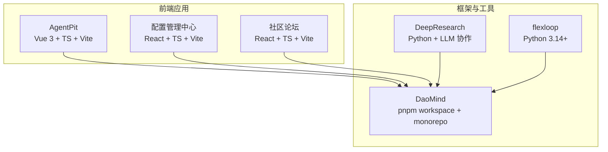
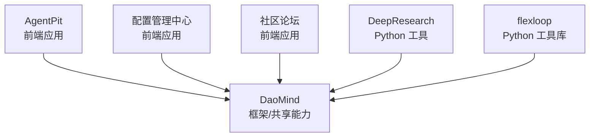
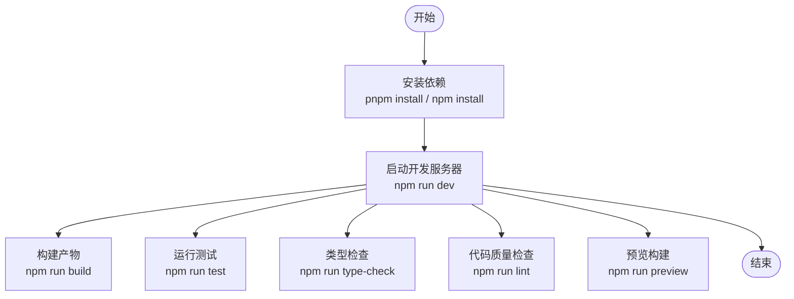
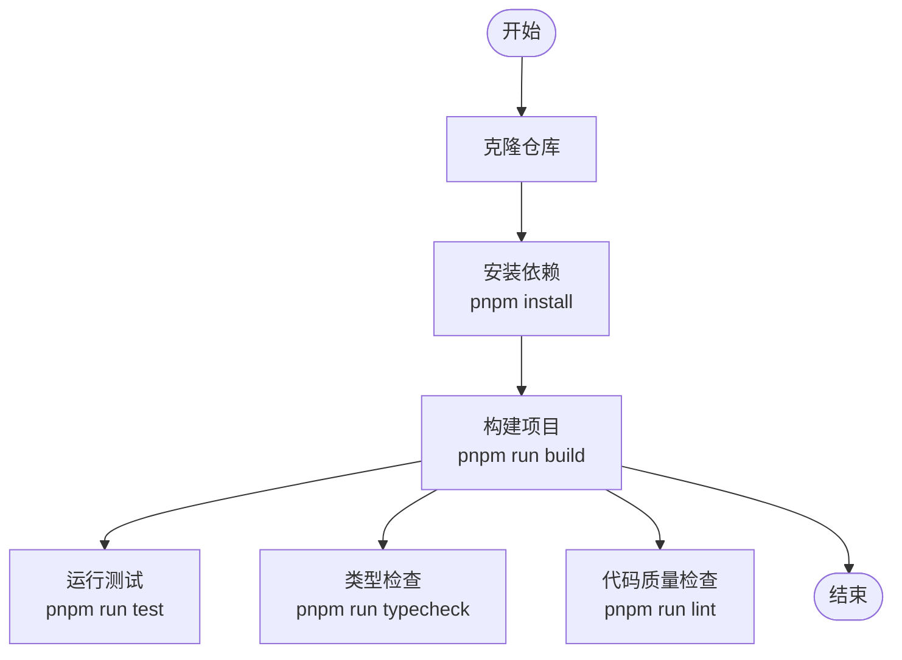
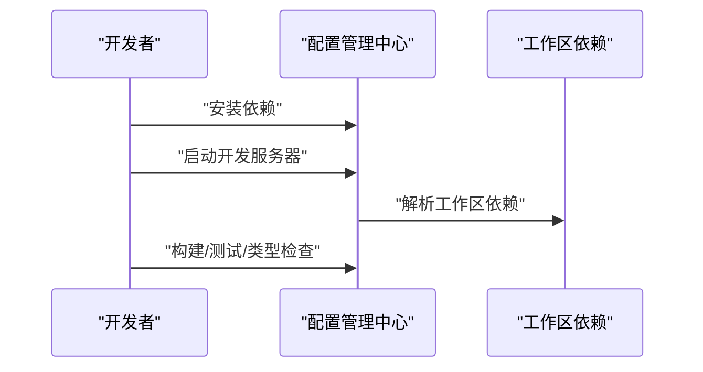
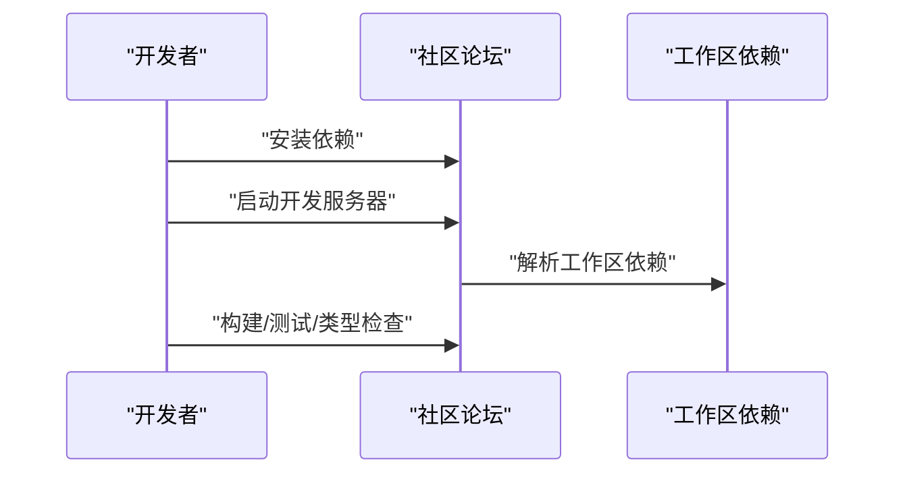
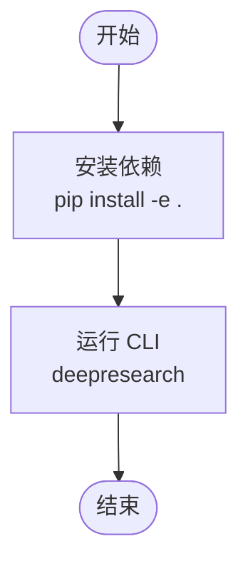
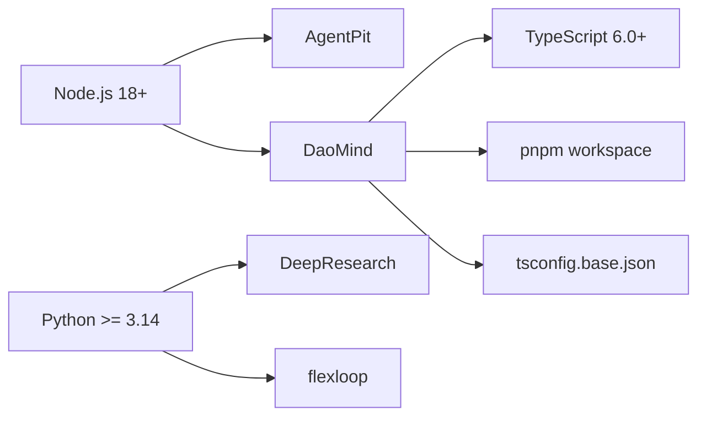

# 快速开始

<cite>
**本文引用的文件**
- [apps/AgentPit/package.json](file://apps/AgentPit/package.json)
- [apps/AgentPit/README.md](file://apps/AgentPit/README.md)
- [apps/AgentPit/vite.config.ts](file://apps/AgentPit/vite.config.ts)
- [apps/AgentPit/tailwind.config.ts](file://apps/AgentPit/tailwind.config.ts)
- [apps/AgentPit/tsconfig.json](file://apps/AgentPit/tsconfig.json)
- [apps/DaoMind/README.md](file://apps/DaoMind/README.md)
- [apps/DaoMind/package.json](file://apps/DaoMind/package.json)
- [apps/DaoMind/pnpm-workspace.yaml](file://apps/DaoMind/pnpm-workspace.yaml)
- [apps/DaoMind/tsconfig.base.json](file://apps/DaoMind/tsconfig.base.json)
- [apps/config-center/package.json](file://apps/config-center/package.json)
- [apps/forum/package.json](file://apps/forum/package.json)
- [tools/DeepResearch/pyproject.toml](file://tools/DeepResearch/pyproject.toml)
- [tools/DeepResearch/README.md](file://tools/DeepResearch/README.md)
- [tools/flexloop/pyproject.toml](file://tools/flexloop/pyproject.toml)
- [tools/flexloop/README.md](file://tools/flexloop/README.md)
</cite>

## 目录
1. [引言](#引言)
2. [项目结构](#项目结构)
3. [核心组件](#核心组件)
4. [架构总览](#架构总览)
5. [详细组件分析](#详细组件分析)
6. [依赖分析](#依赖分析)
7. [性能考虑](#性能考虑)
8. [故障排除指南](#故障排除指南)
9. [结论](#结论)
10. [附录](#附录)

## 引言
本指南面向新加入 DAO Collective 的开发者，帮助你在最短时间内完成环境准备与项目启动，覆盖以下模块：
- AgentPit 智能体平台（Vue 3 + TypeScript + Vite）
- DaoMind 开发框架（monorepo + pnpm workspace）
- 配置管理中心（React + TypeScript + Vite）
- 社区论坛（React + TypeScript + Vite）
- 工具链：DeepResearch（Python + 多 LLM 协作研究框架）、flexloop（Python 3.14+）

你将获得环境要求、依赖安装、启动流程、常见问题排查与最佳实践。

## 项目结构
本仓库采用多应用与工具并行的组织方式，核心应用位于 apps/ 下，工具链位于 tools/ 下。DaoMind 采用 pnpm workspace 管理子包；其他应用分别使用各自包管理器或脚手架。



图表来源
- [apps/AgentPit/package.json:1-73](file://apps/AgentPit/package.json#L1-L73)
- [apps/config-center/package.json:1-41](file://apps/config-center/package.json#L1-L41)
- [apps/forum/package.json:1-36](file://apps/forum/package.json#L1-L36)
- [apps/DaoMind/package.json:1-1](file://apps/DaoMind/package.json#L1-L1)
- [tools/DeepResearch/pyproject.toml:1-93](file://tools/DeepResearch/pyproject.toml#L1-L93)
- [tools/flexloop/pyproject.toml:1-318](file://tools/flexloop/pyproject.toml#L1-L318)

章节来源
- [apps/AgentPit/package.json:1-73](file://apps/AgentPit/package.json#L1-L73)
- [apps/DaoMind/pnpm-workspace.yaml:1-3](file://apps/DaoMind/pnpm-workspace.yaml#L1-L3)

## 核心组件
- AgentPit：基于 Vue 3 + TypeScript + Vite 的前端应用，使用 TailwindCSS 作为样式工具，提供智能体协作与工作区等功能。
- DaoMind：基于 pnpm workspace 的 monorepo，包含多个子包（agents、apps、monitor、qi 等），提供系统框架与组件库。
- 配置管理中心：基于 React + TypeScript + Vite 的管理后台，使用工作区依赖与状态管理。
- 社区论坛：基于 React + TypeScript + Vite 的论坛前端，提供主题、回复、用户认证等页面。
- DeepResearch：Python 工具，支持多 LLM 协作、搜索与可视化报告生成。
- flexloop：Python 3.14+ 工具库，提供认证、配置中心、数据同步、日志、限流、任务队列、邮件、OAuth、二维码、审计、多智能体等子系统能力。

章节来源
- [apps/AgentPit/README.md:1-6](file://apps/AgentPit/README.md#L1-L6)
- [apps/DaoMind/README.md:1-552](file://apps/DaoMind/README.md#L1-L552)
- [apps/config-center/package.json:1-41](file://apps/config-center/package.json#L1-L41)
- [apps/forum/package.json:1-36](file://apps/forum/package.json#L1-L36)
- [tools/DeepResearch/README.md:1-69](file://tools/DeepResearch/README.md#L1-L69)
- [tools/flexloop/README.md:1-100](file://tools/flexloop/README.md#L1-L100)

## 架构总览
下图展示各模块间的关系与职责边界：AgentPit、配置管理中心、社区论坛作为前端应用，依赖 DaoMind 的共享能力；DeepResearch 与 flexloop 作为后端/工具链支撑。



图表来源
- [apps/AgentPit/package.json:1-73](file://apps/AgentPit/package.json#L1-L73)
- [apps/config-center/package.json:1-41](file://apps/config-center/package.json#L1-L41)
- [apps/forum/package.json:1-36](file://apps/forum/package.json#L1-L36)
- [apps/DaoMind/package.json:1-1](file://apps/DaoMind/package.json#L1-L1)
- [tools/DeepResearch/pyproject.toml:1-93](file://tools/DeepResearch/pyproject.toml#L1-L93)
- [tools/flexloop/pyproject.toml:1-318](file://tools/flexloop/pyproject.toml#L1-L318)

## 详细组件分析

### AgentPit 智能体平台
- 环境与依赖
  - Node.js 与包管理：Vite + Vue 3 + TypeScript
  - 样式：TailwindCSS
  - 状态与路由：Pinia + Vue Router
  - 开发工具：ESLint + Prettier + Vitest
- 启动流程
  - 安装依赖后，使用 Vite 启动开发服务器
  - 支持构建、预览、类型检查、测试等脚本
- 关键配置
  - 别名与插件：Vite 插件、TailwindCSS、路径别名
  - TypeScript 分层配置（app/node）
  - Tailwind 内容扫描与主题扩展



图表来源
- [apps/AgentPit/package.json:6-18](file://apps/AgentPit/package.json#L6-L18)
- [apps/AgentPit/vite.config.ts:1-15](file://apps/AgentPit/vite.config.ts#L1-L15)
- [apps/AgentPit/tailwind.config.ts:1-27](file://apps/AgentPit/tailwind.config.ts#L1-L27)
- [apps/AgentPit/tsconfig.json:1-8](file://apps/AgentPit/tsconfig.json#L1-L8)

章节来源
- [apps/AgentPit/README.md:1-6](file://apps/AgentPit/README.md#L1-L6)
- [apps/AgentPit/package.json:1-73](file://apps/AgentPit/package.json#L1-L73)
- [apps/AgentPit/vite.config.ts:1-15](file://apps/AgentPit/vite.config.ts#L1-L15)
- [apps/AgentPit/tailwind.config.ts:1-27](file://apps/AgentPit/tailwind.config.ts#L1-L27)
- [apps/AgentPit/tsconfig.json:1-8](file://apps/AgentPit/tsconfig.json#L1-L8)

### DaoMind 开发框架（monorepo）
- 环境与依赖
  - Node.js 18+、pnpm workspace
  - TypeScript 6.0+
  - Jest 测试框架
- 启动流程
  - 在根目录安装依赖并构建
  - 运行测试与类型检查
  - 使用子包时需先构建
- 工作区与路径映射
  - 通过 tsconfig.base.json 的路径映射访问子包
  - pnpm-workspace.yaml 指定工作区范围



图表来源
- [apps/DaoMind/README.md:42-72](file://apps/DaoMind/README.md#L42-L72)
- [apps/DaoMind/package.json:1-1](file://apps/DaoMind/package.json#L1-L1)
- [apps/DaoMind/pnpm-workspace.yaml:1-3](file://apps/DaoMind/pnpm-workspace.yaml#L1-L3)
- [apps/DaoMind/tsconfig.base.json:1-1](file://apps/DaoMind/tsconfig.base.json#L1-L1)

章节来源
- [apps/DaoMind/README.md:1-552](file://apps/DaoMind/README.md#L1-L552)
- [apps/DaoMind/package.json:1-1](file://apps/DaoMind/package.json#L1-L1)
- [apps/DaoMind/pnpm-workspace.yaml:1-3](file://apps/DaoMind/pnpm-workspace.yaml#L1-L3)
- [apps/DaoMind/tsconfig.base.json:1-1](file://apps/DaoMind/tsconfig.base.json#L1-L1)

### 配置管理中心
- 技术栈：React + TypeScript + Vite
- 依赖：工作区依赖（@tao/shared、@tao/ui、@tao/api-client）、状态与表单工具
- 启动流程：安装依赖后启动开发服务器，支持构建、类型检查、测试



图表来源
- [apps/config-center/package.json:1-41](file://apps/config-center/package.json#L1-L41)

章节来源
- [apps/config-center/package.json:1-41](file://apps/config-center/package.json#L1-L41)

### 社区论坛
- 技术栈：React + TypeScript + Vite
- 依赖：工作区依赖、路由与动画工具
- 启动流程：安装依赖后启动开发服务器，支持构建、类型检查、测试



图表来源
- [apps/forum/package.json:1-36](file://apps/forum/package.json#L1-L36)

章节来源
- [apps/forum/package.json:1-36](file://apps/forum/package.json#L1-L36)

### DeepResearch（Python 工具）
- Python 环境：3.14+
- 依赖：HTTP 客户端、MCP、LangChain/LangGraph、Tavily、BeautifulSoup、lxml、mistune 等
- 启动流程：安装可编辑模式后运行命令行工具



图表来源
- [tools/DeepResearch/pyproject.toml:1-93](file://tools/DeepResearch/pyproject.toml#L1-L93)
- [tools/DeepResearch/README.md:39-51](file://tools/DeepResearch/README.md#L39-L51)

章节来源
- [tools/DeepResearch/pyproject.toml:1-93](file://tools/DeepResearch/pyproject.toml#L1-L93)
- [tools/DeepResearch/README.md:1-69](file://tools/DeepResearch/README.md#L1-L69)

### flexloop（Python 工具库）
- Python 环境：3.14+
- 功能：认证、配置中心、数据同步、日志、限流、任务队列、邮件、OAuth、二维码、审计、多智能体等子系统
- 启动流程：安装可编辑模式后按需启用对应功能集

```mermaid
flowchart TD
Start(["开始"]) --> Install["安装依赖<br/>pip install -e ."]
Install --> Optional["可选依赖<br/>pip install -e \"[doc,dev]\""]
Optional --> Use["按需启用功能集"]
Use --> End(["结束"])
```

图表来源
- [tools/flexloop/pyproject.toml:1-318](file://tools/flexloop/pyproject.toml#L1-L318)
- [tools/flexloop/README.md:45-79](file://tools/flexloop/README.md#L45-L79)

章节来源
- [tools/flexloop/pyproject.toml:1-318](file://tools/flexloop/pyproject.toml#L1-L318)
- [tools/flexloop/README.md:1-100](file://tools/flexloop/README.md#L1-L100)

## 依赖分析
- Node.js 与包管理
  - AgentPit：Vite + Vue 3 + TypeScript
  - DaoMind：pnpm workspace + monorepo
- Python 环境
  - DeepResearch：Python >= 3.14
  - flexloop：Python >= 3.14
- 工作区与路径映射
  - DaoMind 通过 tsconfig.base.json 的路径映射访问子包
  - 各应用通过工作区依赖共享 UI/SDK



图表来源
- [apps/AgentPit/package.json:1-73](file://apps/AgentPit/package.json#L1-L73)
- [apps/DaoMind/package.json:1-1](file://apps/DaoMind/package.json#L1-L1)
- [apps/DaoMind/tsconfig.base.json:1-1](file://apps/DaoMind/tsconfig.base.json#L1-L1)
- [tools/DeepResearch/pyproject.toml:9-26](file://tools/DeepResearch/pyproject.toml#L9-L26)
- [tools/flexloop/pyproject.toml:14-7](file://tools/flexloop/pyproject.toml#L14-L7)

章节来源
- [apps/AgentPit/package.json:1-73](file://apps/AgentPit/package.json#L1-L73)
- [apps/DaoMind/package.json:1-1](file://apps/DaoMind/package.json#L1-L1)
- [apps/DaoMind/tsconfig.base.json:1-1](file://apps/DaoMind/tsconfig.base.json#L1-L1)
- [tools/DeepResearch/pyproject.toml:1-93](file://tools/DeepResearch/pyproject.toml#L1-L93)
- [tools/flexloop/pyproject.toml:1-318](file://tools/flexloop/pyproject.toml#L1-L318)

## 性能考虑
- 前端应用
  - 使用 Vite 的快速冷启动与热更新
  - TailwindCSS 按需扫描内容，避免打包冗余样式
  - Pinia 状态持久化插件用于提升用户体验
- monorepo
  - pnpm workspace 减少重复安装，提升安装速度
  - 子包路径映射减少运行时查找成本
- Python 工具
  - DeepResearch 与 flexloop 通过模块化依赖与可选功能集降低安装与运行负担

## 故障排除指南
- AgentPit
  - 启动失败：检查 Node.js 与包管理器版本，确保依赖完整安装
  - 样式异常：确认 Tailwind 内容扫描路径与主题扩展配置
  - 类型错误：运行类型检查修复问题
- DaoMind
  - 安装失败：确保 pnpm 版本满足要求，清理缓存后重试
  - 构建失败：先运行类型检查，修复错误后再构建
  - 子包导入失败：先构建项目，检查路径映射配置
- 配置管理中心/社区论坛
  - 启动失败：确认工作区依赖已安装，路径别名解析正常
  - 测试失败：检查测试环境与断言逻辑
- DeepResearch
  - 安装失败：确保 Python 版本满足要求，使用可编辑安装
  - 运行失败：检查 CLI 命令与配置文件
- flexloop
  - 安装失败：确保 Python 版本满足要求，按需安装可选依赖

章节来源
- [apps/AgentPit/package.json:6-18](file://apps/AgentPit/package.json#L6-L18)
- [apps/DaoMind/README.md:398-444](file://apps/DaoMind/README.md#L398-L444)
- [apps/config-center/package.json:1-41](file://apps/config-center/package.json#L1-L41)
- [apps/forum/package.json:1-36](file://apps/forum/package.json#L1-L36)
- [tools/DeepResearch/README.md:39-51](file://tools/DeepResearch/README.md#L39-L51)
- [tools/flexloop/README.md:45-79](file://tools/flexloop/README.md#L45-L79)

## 结论
通过本指南，你可以完成环境准备与各模块的启动。建议先从 DaoMind 的安装与构建入手，再依次启动 AgentPit、配置管理中心、社区论坛，并根据需要安装与运行 DeepResearch 与 flexloop。遇到问题时，优先参考各模块的 README 与脚本配置，结合故障排除指南定位原因。

## 附录
- 快速命令摘要
  - AgentPit：安装依赖、启动开发、构建、测试、类型检查、代码质量检查
  - DaoMind：安装依赖、构建、测试、类型检查、代码质量检查
  - 配置管理中心：安装依赖、启动开发、构建、类型检查、测试
  - 社区论坛：安装依赖、启动开发、构建、类型检查、测试
  - DeepResearch：安装可编辑、运行 CLI
  - flexloop：安装可编辑、按需安装可选依赖

章节来源
- [apps/AgentPit/package.json:6-18](file://apps/AgentPit/package.json#L6-L18)
- [apps/DaoMind/README.md:74-91](file://apps/DaoMind/README.md#L74-L91)
- [apps/config-center/package.json:6-13](file://apps/config-center/package.json#L6-L13)
- [apps/forum/package.json:6-13](file://apps/forum/package.json#L6-L13)
- [tools/DeepResearch/README.md:39-51](file://tools/DeepResearch/README.md#L39-L51)
- [tools/flexloop/README.md:45-79](file://tools/flexloop/README.md#L45-L79)