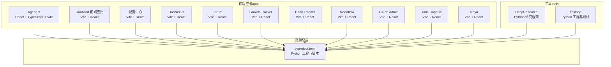
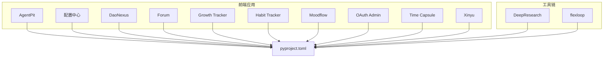
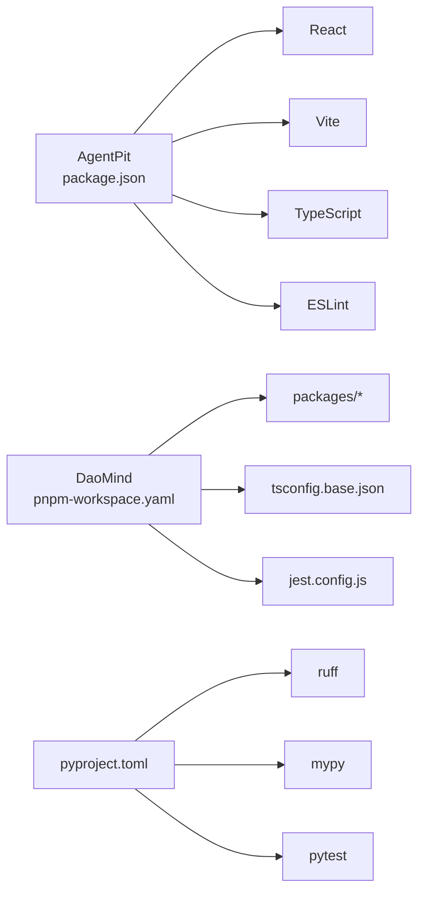

# 快速开始

<cite>
**本文引用的文件**
- [apps/DaoMind/README.md](file://apps/DaoMind/README.md)
- [apps/AgentPit/README.md](file://apps/AgentPit/README.md)
- [apps/AgentPit/package.json](file://apps/AgentPit/package.json)
- [apps/DaoMind/package.json](file://apps/DaoMind/package.json)
- [apps/DaoMind/pnpm-workspace.yaml](file://apps/DaoMind/pnpm-workspace.yaml)
- [apps/DaoMind/tsconfig.base.json](file://apps/DaoMind/tsconfig.base.json)
- [apps/DaoMind/tsconfig.json](file://apps/DaoMind/tsconfig.json)
- [apps/DaoMind/jest.config.js](file://apps/DaoMind/jest.config.js)
- [apps/DaoMind/eslint.config.js](file://apps/DaoMind/eslint.config.js)
- [pyproject.toml](file://pyproject.toml)
- [tools/DeepResearch/README.md](file://tools/DeepResearch/README.md)
</cite>

## 目录
1. [引言](#引言)
2. [项目结构](#项目结构)
3. [核心组件](#核心组件)
4. [架构概览](#架构概览)
5. [详细组件分析](#详细组件分析)
6. [依赖分析](#依赖分析)
7. [性能考虑](#性能考虑)
8. [故障排除指南](#故障排除指南)
9. [结论](#结论)
10. [附录](#附录)

## 引言
本指南面向首次接触 DAO Collective 生态的开发者，帮助你在最短时间内完成环境准备、项目安装与基础使用。你将了解：
- 环境要求：操作系统、Node.js、TypeScript、pnpm 的最低版本与兼容性
- 安装步骤：从克隆仓库、安装依赖到环境验证的全流程
- 基础使用：构建、测试、代码质量检查等常用命令
- 常见问题与排错：针对安装、构建、测试、导入等典型问题的解决方案

## 项目结构
DAO Collective 采用多应用与多包混合的组织方式：
- apps 目录包含多个前端应用（如 AgentPit、DaoMind 对应的前端子项目、配置中心、Nexus 等），以及若干独立应用（如 forum、growth-tracker、habit-tracker、moodflow、oauth-admin、time-capsule、xinyu 等）
- tools 目录包含 Python 工具链与研究框架（如 DeepResearch、flexloop）
- 顶层 pyproject.toml 提供 Python 工程与脚本配置

图表来源
- [apps/DaoMind/README.md:42-72](file://apps/DaoMind/README.md#L42-L72)
- [apps/AgentPit/README.md:1-74](file://apps/AgentPit/README.md#L1-L74)
- [pyproject.toml:1-161](file://pyproject.toml#L1-L161)

章节来源
- [apps/DaoMind/README.md:42-72](file://apps/DaoMind/README.md#L42-L72)
- [apps/AgentPit/README.md:1-74](file://apps/AgentPit/README.md#L1-L74)
- [pyproject.toml:1-161](file://pyproject.toml#L1-L161)

## 核心组件
- 前端应用（React + TypeScript + Vite）
  - AgentPit：最小化 React + Vite + ESLint 配置模板，包含 React Router 与 Zustand 状态管理
  - 其他应用（如 DaoMind 前端、配置中心、Nexus 等）均采用 Vite + React 架构
- 多包 Monorepo（DaoMind）
  - 使用 pnpm 工作区管理子包，根 package.json 定义统一构建、测试、lint 脚本
  - tsconfig.base.json 提供路径映射与编译选项，tsconfig.json 作为复合项目引用
  - jest.config.js 配置跨包测试与模块映射
  - eslint.config.js 提供 TypeScript 代码质量规则
- Python 工具链
  - pyproject.toml 定义 Python 3.14+ 要求、开发与测试依赖、脚本与 linter 配置
  - tools/DeepResearch 提供 Python 研究框架的安装与使用说明

章节来源
- [apps/AgentPit/package.json:1-36](file://apps/AgentPit/package.json#L1-L36)
- [apps/DaoMind/package.json:1-1](file://apps/DaoMind/package.json#L1-L1)
- [apps/DaoMind/pnpm-workspace.yaml:1-3](file://apps/DaoMind/pnpm-workspace.yaml#L1-L3)
- [apps/DaoMind/tsconfig.base.json:1-1](file://apps/DaoMind/tsconfig.base.json#L1-L1)
- [apps/DaoMind/tsconfig.json:1-1](file://apps/DaoMind/tsconfig.json#L1-L1)
- [apps/DaoMind/jest.config.js:1-59](file://apps/DaoMind/jest.config.js#L1-L59)
- [apps/DaoMind/eslint.config.js:1-27](file://apps/DaoMind/eslint.config.js#L1-L27)
- [pyproject.toml:1-161](file://pyproject.toml#L1-L161)
- [tools/DeepResearch/README.md:1-69](file://tools/DeepResearch/README.md#L1-L69)

## 架构概览
下图展示了前端应用与工具链的整体关系，以及与顶层 Python 工程的关联。

图表来源
- [apps/AgentPit/README.md:1-74](file://apps/AgentPit/README.md#L1-L74)
- [apps/DaoMind/README.md:42-72](file://apps/DaoMind/README.md#L42-L72)
- [pyproject.toml:1-161](file://pyproject.toml#L1-L161)
- [tools/DeepResearch/README.md:1-69](file://tools/DeepResearch/README.md#L1-L69)

## 详细组件分析

### 环境要求
- 操作系统
  - Windows 10 或更高版本
  - macOS 10.15 或更高版本
  - Linux 发行版（Ubuntu 20.04 或更高版本）
- Node.js
  - 最低版本：18.0 或更高
- TypeScript
  - 最低版本：6.0 或更高
- 包管理器
  - pnpm 6.0 或更高版本（推荐）
- Python（工具链）
  - Python 3.14 或更高版本

章节来源
- [apps/DaoMind/README.md:27-41](file://apps/DaoMind/README.md#L27-L41)
- [apps/DaoMind/package.json:1-1](file://apps/DaoMind/package.json#L1-L1)
- [pyproject.toml:14-14](file://pyproject.toml#L14-L14)

### 安装步骤
- 步骤 1：克隆项目
  - 使用 Git 克隆仓库后进入项目根目录
- 步骤 2：安装依赖
  - 使用 pnpm 安装根工作区依赖
- 步骤 3：环境验证
  - 验证 Node.js、pnpm、TypeScript 版本
  - 运行类型检查以确保类型安全

章节来源
- [apps/DaoMind/README.md:42-72](file://apps/DaoMind/README.md#L42-L72)

### 基础使用流程
- 构建项目
  - 前端应用：使用 Vite 进行构建
  - DaoMind 多包：使用 pnpm 并行构建所有包
- 运行测试
  - 使用 Jest 运行测试，支持覆盖率与超时配置
- 代码质量检查
  - 使用 ESLint 进行 TypeScript 代码质量检查

章节来源
- [apps/AgentPit/package.json:6-11](file://apps/AgentPit/package.json#L6-L11)
- [apps/DaoMind/package.json:1-1](file://apps/DaoMind/package.json#L1-L1)
- [apps/DaoMind/jest.config.js:1-59](file://apps/DaoMind/jest.config.js#L1-L59)
- [apps/DaoMind/eslint.config.js:1-27](file://apps/DaoMind/eslint.config.js#L1-L27)

### TypeScript 与路径映射
- 基础配置
  - tsconfig.base.json 提供编译目标、模块解析、严格模式、声明与源码映射等
  - tsconfig.json 作为复合项目引用，声明各子包的引用关系
- 路径映射
  - 通过 tsconfig.base.json 的 paths 字段，为 @daomind/* 与 @modulux/* 提供别名映射，简化导入路径

章节来源
- [apps/DaoMind/tsconfig.base.json:1-1](file://apps/DaoMind/tsconfig.base.json#L1-L1)
- [apps/DaoMind/tsconfig.json:1-1](file://apps/DaoMind/tsconfig.json#L1-L1)

### Monorepo 工作区与测试配置
- 工作区
  - pnpm-workspace.yaml 指定 packages/* 为工作区范围
- 测试
  - jest.config.js 支持跨包测试、模块映射、覆盖率与超时设置

章节来源
- [apps/DaoMind/pnpm-workspace.yaml:1-3](file://apps/DaoMind/pnpm-workspace.yaml#L1-L3)
- [apps/DaoMind/jest.config.js:1-59](file://apps/DaoMind/jest.config.js#L1-L59)

### Python 工具链与脚本
- Python 版本与依赖
  - 要求 Python 3.14+
  - 开发与测试依赖通过 pyproject.toml 管理
- 常用脚本
  - 测试：pytest
  - 代码检查：ruff
  - 格式化：ruff format
  - 类型检查：mypy
  - 清理：删除缓存与产物目录

章节来源
- [pyproject.toml:14-14](file://pyproject.toml#L14-L14)
- [pyproject.toml:49-58](file://pyproject.toml#L49-L58)
- [pyproject.toml:71-79](file://pyproject.toml#L71-L79)

## 依赖分析
- 前端应用依赖
  - React、React Router、Zustand 等用于构建用户界面与状态管理
  - Vite、TypeScript、ESLint 等用于构建、类型与代码质量
- DaoMind 多包依赖
  - 通过 pnpm 工作区统一管理子包
  - tsconfig.base.json 提供路径映射，简化跨包导入
- Python 工具链依赖
  - pytest、ruff、mypy 等用于测试、检查与类型检查

图表来源
- [apps/AgentPit/package.json:1-36](file://apps/AgentPit/package.json#L1-L36)
- [apps/DaoMind/pnpm-workspace.yaml:1-3](file://apps/DaoMind/pnpm-workspace.yaml#L1-L3)
- [apps/DaoMind/tsconfig.base.json:1-1](file://apps/DaoMind/tsconfig.base.json#L1-L1)
- [apps/DaoMind/jest.config.js:1-59](file://apps/DaoMind/jest.config.js#L1-L59)
- [pyproject.toml:49-58](file://pyproject.toml#L49-L58)
- [pyproject.toml:71-79](file://pyproject.toml#L71-L79)

章节来源
- [apps/AgentPit/package.json:1-36](file://apps/AgentPit/package.json#L1-L36)
- [apps/DaoMind/pnpm-workspace.yaml:1-3](file://apps/DaoMind/pnpm-workspace.yaml#L1-L3)
- [apps/DaoMind/tsconfig.base.json:1-1](file://apps/DaoMind/tsconfig.base.json#L1-L1)
- [apps/DaoMind/jest.config.js:1-59](file://apps/DaoMind/jest.config.js#L1-L59)
- [pyproject.toml:49-58](file://pyproject.toml#L49-L58)
- [pyproject.toml:71-79](file://pyproject.toml#L71-L79)

## 性能考虑
- 构建性能
  - 使用 Vite 进行快速开发与构建
  - 在 DaoMind 中使用 pnpm 并行构建，提升多包构建效率
- 类型检查与代码质量
  - TypeScript 严格模式与 ESLint 规则有助于早期发现潜在问题
  - Python 工程中使用 ruff 与 mypy 提升代码质量与稳定性

[本节为通用建议，无需具体文件分析]

## 故障排除指南
- 安装依赖失败
  - 确认 pnpm 版本满足 6.0+ 要求
  - 检查网络连接，必要时清理 pnpm 缓存
- 构建失败
  - 运行类型检查，修复 TypeScript 错误
  - 确保依赖安装完整，检查语法与路径映射
- 测试失败
  - 查看测试错误输出，确认测试环境与模块映射配置
  - 检查测试超时与覆盖率阈值设置
- 子包导入失败
  - 确保已完成构建
  - 检查 tsconfig.json 中的路径映射与复合项目配置
- 性能问题
  - 运行基准测试与监控工具，定位性能瓶颈

章节来源
- [apps/DaoMind/README.md:398-444](file://apps/DaoMind/README.md#L398-L444)

## 结论
通过本快速开始指南，你可以完成环境准备、安装与验证，并掌握构建、测试与代码质量检查的基础流程。若遇到问题，请参考“故障排除指南”逐步排查。随着对项目结构与配置的深入理解，你将能够更高效地参与开发与贡献。

[本节为总结，无需具体文件分析]

## 附录
- Python 工具链快速开始
  - 安装：pip 安装可编辑模式
  - 运行：使用命令行工具进行分析与研究

章节来源
- [tools/DeepResearch/README.md:39-51](file://tools/DeepResearch/README.md#L39-L51)