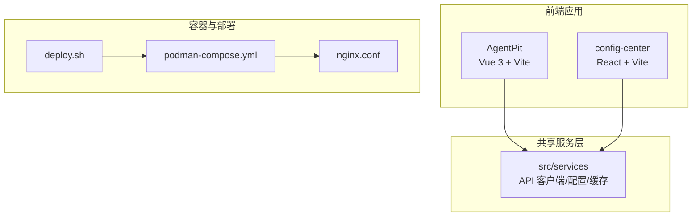
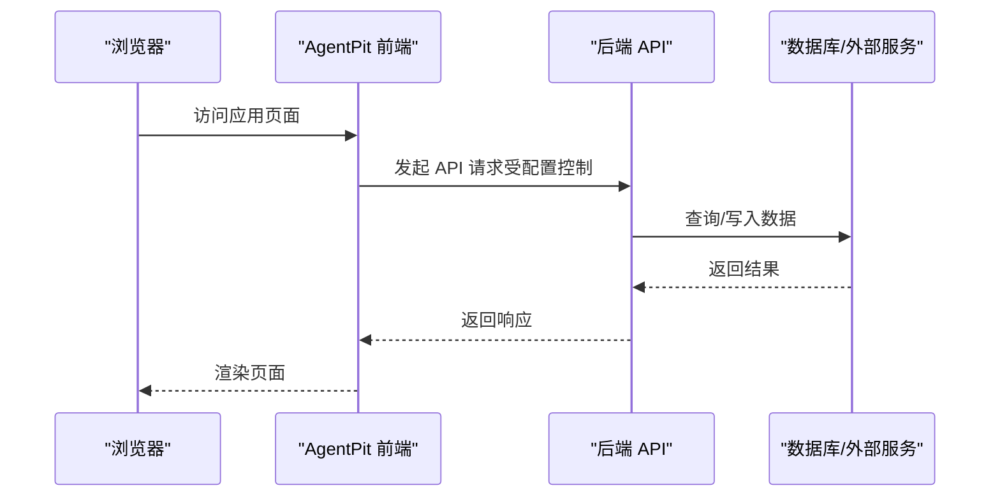
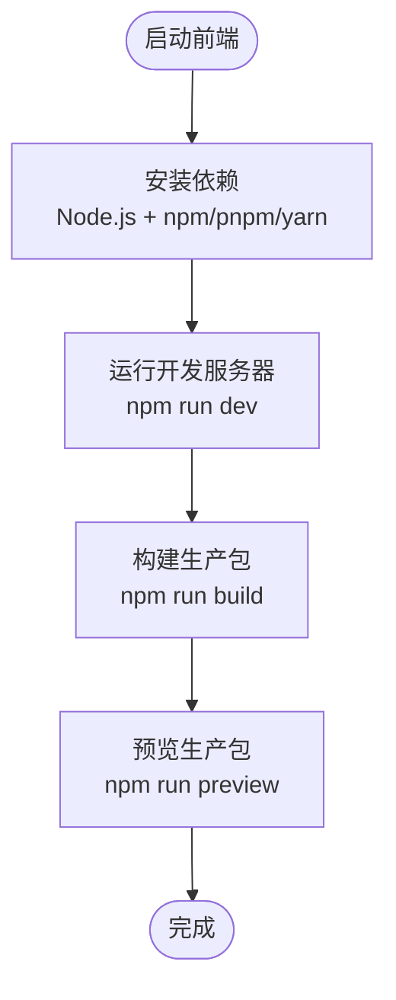
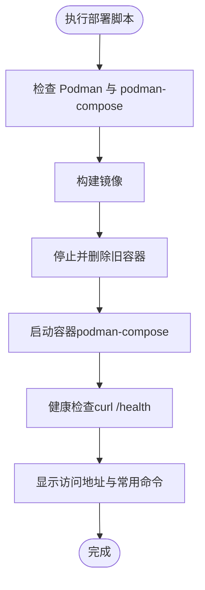
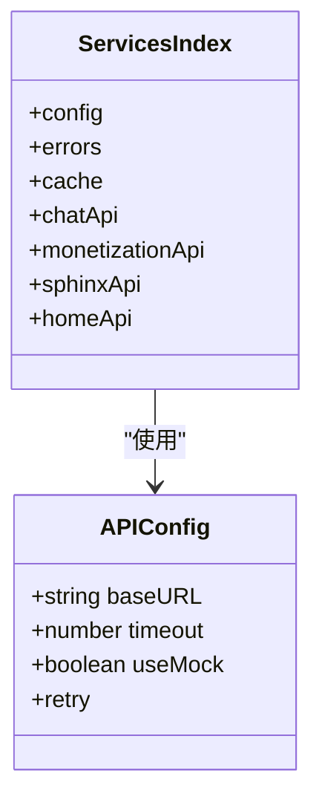
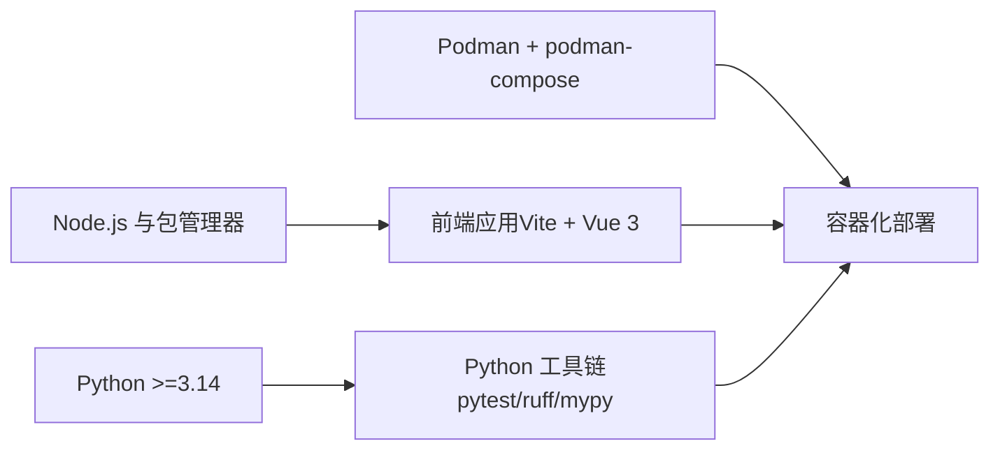

# 快速开始

<cite>
**本文引用的文件**
- [pyproject.toml](file://pyproject.toml)
- [apps/AgentPit/package.json](file://apps/AgentPit/package.json)
- [apps/AgentPit/README.md](file://apps/AgentPit/README.md)
- [apps/AgentPit/deploy.sh](file://apps/AgentPit/deploy.sh)
- [apps/AgentPit/.dockerignore](file://apps/AgentPit/.dockerignore)
- [apps/AgentPit/podman-compose.yml](file://apps/AgentPit/podman-compose.yml)
- [apps/AgentPit/nginx.conf](file://apps/AgentPit/nginx.conf)
- [apps/AgentPit/src/main.ts](file://apps/AgentPit/src/main.ts)
- [src/services/index.ts](file://src/services/index.ts)
- [src/services/config.ts](file://src/services/config.ts)
</cite>

## 目录
1. [简介](#简介)
2. [项目结构](#项目结构)
3. [核心组件](#核心组件)
4. [架构总览](#架构总览)
5. [详细组件分析](#详细组件分析)
6. [依赖分析](#依赖分析)
7. [性能考虑](#性能考虑)
8. [故障排查指南](#故障排查指南)
9. [结论](#结论)
10. [附录](#附录)

## 简介
本指南面向新手开发者，帮助你在最短时间内完成 DAOApps 项目的本地开发与容器化部署。你将学到如何安装 Node.js、Python、Docker/Podman 等必备依赖；如何启动前端与后端服务；如何使用提供的部署脚本与容器编排文件进行一键部署；以及如何理解项目的基本结构与首个功能页面。

## 项目结构
DAOApps 是一个多应用仓库，包含多个前端应用与共享服务层。核心结构概览如下：
- apps：多前端应用与工具包
  - AgentPit：基于 Vue 3 + TypeScript + Vite 的前端应用
  - 其他子应用（如 config-center、DaoMind 等）
- src：共享服务层（API 客户端、配置、缓存等）
- tools：Python 工具链与测试框架（DeepResearch、flexloop 等）
- skills：技能模块与规范文档
- 根级配置：pyproject.toml（Python 包与脚本）、.dockerignore、podman-compose.yml 等

图表来源
- [apps/AgentPit/src/main.ts:1-13](file://apps/AgentPit/src/main.ts#L1-L13)
- [src/services/index.ts:1-10](file://src/services/index.ts#L1-L10)
- [apps/AgentPit/podman-compose.yml:1-70](file://apps/AgentPit/podman-compose.yml#L1-L70)
- [apps/AgentPit/nginx.conf:1-68](file://apps/AgentPit/nginx.conf#L1-L68)
- [apps/AgentPit/deploy.sh:1-184](file://apps/AgentPit/deploy.sh#L1-L184)

章节来源
- [apps/AgentPit/README.md:1-6](file://apps/AgentPit/README.md#L1-L6)
- [apps/AgentPit/package.json:1-74](file://apps/AgentPit/package.json#L1-L74)
- [src/services/index.ts:1-10](file://src/services/index.ts#L1-L10)

## 核心组件
- 前端应用入口：AgentPit 的应用入口在 src/main.ts 中初始化 Vue 应用、Pinia 与路由，并挂载到 DOM。
- 服务层导出：src/services/index.ts 统一导出配置、错误处理与各模块 API 客户端（聊天、货币化、Sphinx、首页等），便于前端按需引入。
- 运行时配置：src/services/config.ts 提供 API 基础地址、超时、是否使用 Mock、重试策略等配置项，支持通过环境变量覆盖。

章节来源
- [apps/AgentPit/src/main.ts:1-13](file://apps/AgentPit/src/main.ts#L1-L13)
- [src/services/index.ts:1-10](file://src/services/index.ts#L1-L10)
- [src/services/config.ts:1-11](file://src/services/config.ts#L1-L11)

## 架构总览
下图展示了从浏览器到后端 API 的典型调用路径，以及容器化部署时的 Nginx 反向代理与健康检查机制。

图表来源
- [src/services/config.ts:1-11](file://src/services/config.ts#L1-L11)
- [src/services/index.ts:1-10](file://src/services/index.ts#L1-L10)

## 详细组件分析

### AgentPit 前端应用
- 技术栈：Vue 3 + TypeScript + Vite，使用 Pinia 状态管理、Vue Router 路由。
- 启动方式：通过 package.json 中的脚本启动开发服务器或构建生产包。
- 入口逻辑：在 src/main.ts 初始化应用并挂载。

图表来源
- [apps/AgentPit/package.json:1-74](file://apps/AgentPit/package.json#L1-L74)
- [apps/AgentPit/src/main.ts:1-13](file://apps/AgentPit/src/main.ts#L1-L13)

章节来源
- [apps/AgentPit/README.md:1-6](file://apps/AgentPit/README.md#L1-L6)
- [apps/AgentPit/package.json:1-74](file://apps/AgentPit/package.json#L1-L74)
- [apps/AgentPit/src/main.ts:1-13](file://apps/AgentPit/src/main.ts#L1-L13)

### 容器化部署与健康检查
- 部署脚本：deploy.sh 自动完成 Podman 安装检查、镜像构建、旧容器清理、容器启动、健康检查与状态展示。
- 编排文件：podman-compose.yml 定义了前端服务、网络、卷、资源限制、重启策略与健康检查。
- 反向代理：nginx.conf 提供静态资源压缩、缓存策略、SPA 路由回退与健康检查端点。
- .dockerignore：排除不必要的构建上下文文件，减少镜像体积。

图表来源
- [apps/AgentPit/deploy.sh:1-184](file://apps/AgentPit/deploy.sh#L1-L184)
- [apps/AgentPit/podman-compose.yml:1-70](file://apps/AgentPit/podman-compose.yml#L1-L70)
- [apps/AgentPit/nginx.conf:1-68](file://apps/AgentPit/nginx.conf#L1-L68)
- [apps/AgentPit/.dockerignore:1-39](file://apps/AgentPit/.dockerignore#L1-L39)

章节来源
- [apps/AgentPit/deploy.sh:1-184](file://apps/AgentPit/deploy.sh#L1-L184)
- [apps/AgentPit/podman-compose.yml:1-70](file://apps/AgentPit/podman-compose.yml#L1-L70)
- [apps/AgentPit/nginx.conf:1-68](file://apps/AgentPit/nginx.conf#L1-L68)
- [apps/AgentPit/.dockerignore:1-39](file://apps/AgentPit/.dockerignore#L1-L39)

### 服务层与 API 客户端
- 统一导出：src/services/index.ts 将配置、错误处理与各模块 API 客户端统一导出，便于前端模块按需引入。
- 运行时配置：src/services/config.ts 通过 import.meta.env 读取环境变量，支持覆盖基础地址、启用 Mock、设置超时与重试。

图表来源
- [src/services/config.ts:1-11](file://src/services/config.ts#L1-L11)
- [src/services/index.ts:1-10](file://src/services/index.ts#L1-L10)

章节来源
- [src/services/index.ts:1-10](file://src/services/index.ts#L1-L10)
- [src/services/config.ts:1-11](file://src/services/config.ts#L1-L11)

## 依赖分析
- Node.js 与包管理器：AgentPit 使用 Vite + Vue 3 + TypeScript，推荐使用 Node.js LTS 版本与现代包管理器（如 pnpm 或 npm）。
- Python：根级 pyproject.toml 指定 Python >=3.14，提供测试、格式化、类型检查等脚本，适合在 Python 工具链中运行相关任务。
- Docker/Podman：提供完整的容器化部署方案，包含镜像构建、编排、健康检查与安全加固。

图表来源
- [apps/AgentPit/package.json:1-74](file://apps/AgentPit/package.json#L1-L74)
- [pyproject.toml:1-161](file://pyproject.toml#L1-L161)
- [apps/AgentPit/podman-compose.yml:1-70](file://apps/AgentPit/podman-compose.yml#L1-L70)

章节来源
- [apps/AgentPit/package.json:1-74](file://apps/AgentPit/package.json#L1-L74)
- [pyproject.toml:1-161](file://pyproject.toml#L1-L161)
- [apps/AgentPit/podman-compose.yml:1-70](file://apps/AgentPit/podman-compose.yml#L1-L70)

## 性能考虑
- 前端构建：使用 Vite 的快速冷启动与热更新能力，生产构建开启 Tree-shaking 与代码分割。
- 静态资源优化：Nginx 配置启用 Gzip 压缩与长期缓存策略，提升首屏加载速度。
- 资源限制：容器编排中对内存与 CPU 进行限制，避免资源争用。
- 健康检查：定期健康检查可及时发现异常并触发重启，保障可用性。

## 故障排查指南
- 健康检查失败
  - 现象：部署脚本提示健康检查超时。
  - 排查：查看容器日志、确认 Nginx 配置与端口映射、检查容器健康检查端点。
  - 参考：部署脚本中的健康检查与日志输出、Nginx 配置中的 /health 端点。
- 端口冲突
  - 现象：容器启动后无法访问或端口被占用。
  - 排查：修改 podman-compose.yml 中的端口映射或释放主机端口。
- 构建失败
  - 现象：镜像构建或前端构建报错。
  - 排查：检查 .dockerignore 排除规则、构建上下文、依赖安装与 Node/Python 环境版本。

章节来源
- [apps/AgentPit/deploy.sh:118-141](file://apps/AgentPit/deploy.sh#L118-L141)
- [apps/AgentPit/nginx.conf:27-32](file://apps/AgentPit/nginx.conf#L27-L32)
- [apps/AgentPit/podman-compose.yml:24-26](file://apps/AgentPit/podman-compose.yml#L24-L26)
- [apps/AgentPit/.dockerignore:1-39](file://apps/AgentPit/.dockerignore#L1-L39)

## 结论
通过本指南，你可以完成从环境准备到本地开发与容器化部署的全流程。建议优先在本地使用 Vite 开发服务器进行调试，确认功能正常后再使用部署脚本与容器编排进行生产级部署。后续可结合服务层 API 客户端与配置项扩展更多功能模块。

## 附录

### 环境搭建步骤
- 安装 Node.js（推荐使用当前 LTS 版本）与包管理器（如 pnpm/npm/yarn）。
- 安装 Python >=3.14，以便运行根级工具链与脚本。
- 安装 Podman 与 podman-compose，用于容器化部署。
- 准备 .env.production 文件（参考容器编排中的 env_file 配置）。

章节来源
- [apps/AgentPit/package.json:1-74](file://apps/AgentPit/package.json#L1-L74)
- [pyproject.toml:1-161](file://pyproject.toml#L1-L161)
- [apps/AgentPit/podman-compose.yml:36-37](file://apps/AgentPit/podman-compose.yml#L36-L37)

### 本地开发环境设置
- 进入 AgentPit 目录，安装依赖并启动开发服务器。
- 在浏览器中访问开发服务器地址，查看默认首页。
- 如需切换后端 API 地址或启用 Mock，可在运行时通过环境变量覆盖配置。

章节来源
- [apps/AgentPit/package.json:6-18](file://apps/AgentPit/package.json#L6-L18)
- [apps/AgentPit/src/main.ts:1-13](file://apps/AgentPit/src/main.ts#L1-L13)
- [src/services/config.ts:1-11](file://src/services/config.ts#L1-L11)

### Docker 容器化部署
- 使用部署脚本一键完成镜像构建、容器启动与健康检查。
- 通过 podman-compose.yml 与 nginx.conf 完成反向代理、缓存与安全加固。
- 如需调整端口、资源限制或健康检查参数，可在相应配置文件中修改。

章节来源
- [apps/AgentPit/deploy.sh:1-184](file://apps/AgentPit/deploy.sh#L1-L184)
- [apps/AgentPit/podman-compose.yml:1-70](file://apps/AgentPit/podman-compose.yml#L1-L70)
- [apps/AgentPit/nginx.conf:1-68](file://apps/AgentPit/nginx.conf#L1-L68)

### 第一个功能演示
- 默认首页：AgentPit 提供首页视图，作为首个可交互的功能页面。
- 启动方式：使用 Vite 开发服务器启动后，在浏览器中打开首页。
- 扩展思路：结合服务层 API 客户端与配置项，逐步接入聊天、货币化、Sphinx 等模块。

章节来源
- [apps/AgentPit/src/main.ts:1-13](file://apps/AgentPit/src/main.ts#L1-L13)
- [src/services/index.ts:1-10](file://src/services/index.ts#L1-L10)