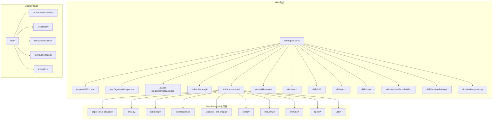
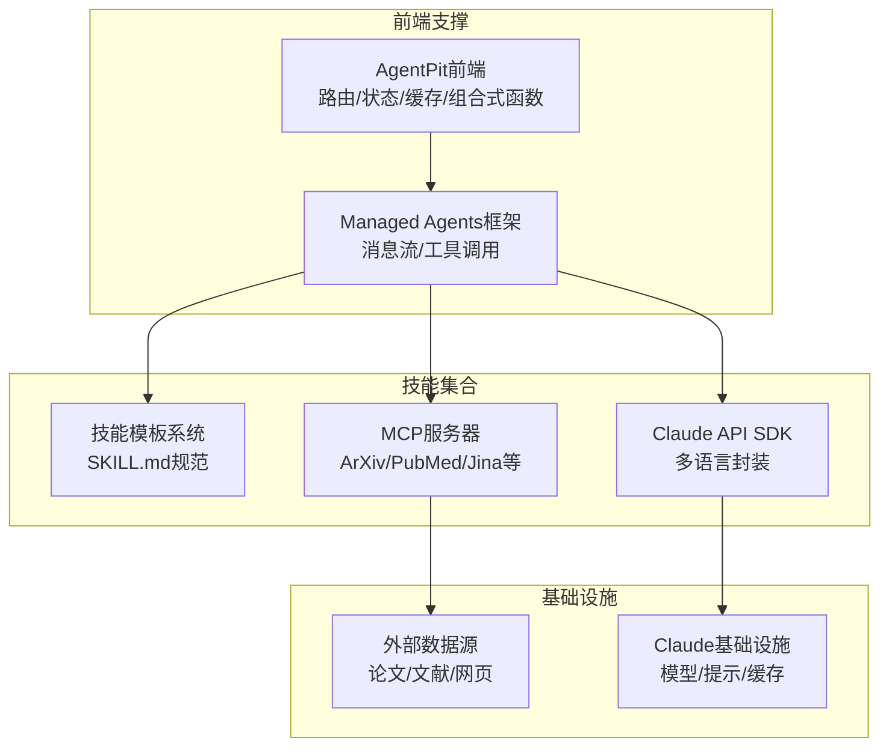
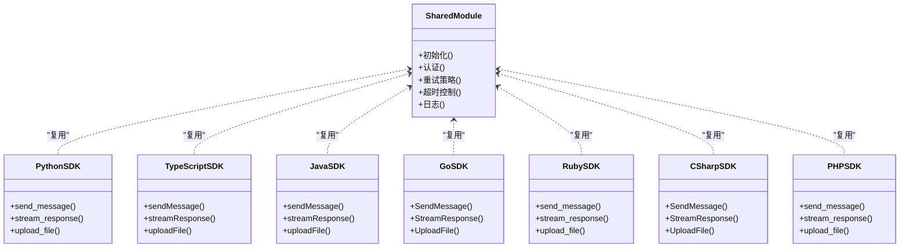
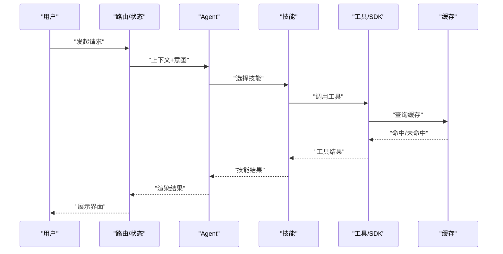
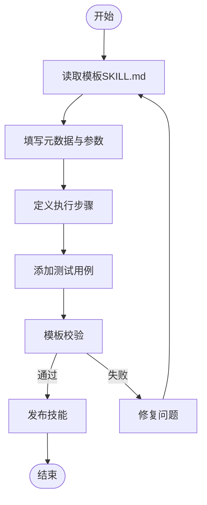
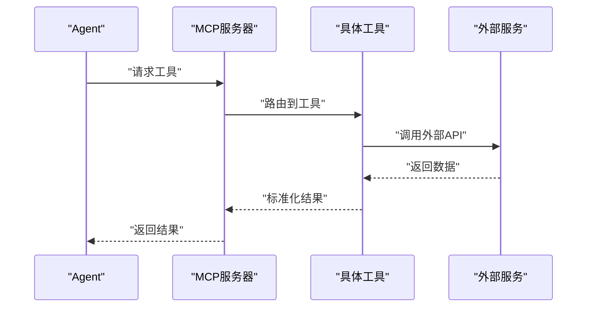
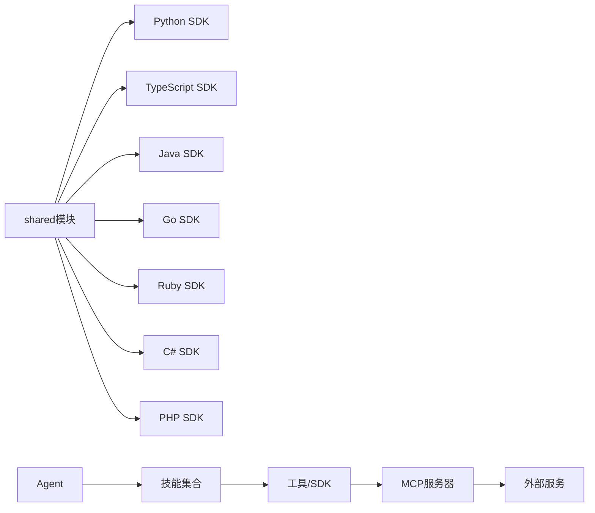

# Anthropic Skills集成

<cite>
**本文档引用的文件**
- [skills/daoSkilLs/skills/anthropics-skills/README.md](file://skills/daoSkilLs/skills/anthropics-skills/README.md)
- [skills/daoSkilLs/skills/anthropics-skills/template/SKILL.md](file://skills/daoSkilLs/skills/anthropics-skills/template/SKILL.md)
- [skills/daoSkilLs/skills/anthropics-skills/spec/agent-skills-spec.md](file://skills/daoSkilLs/skills/anthropics-skills/spec/agent-skills-spec.md)
- [skills/daoSkilLs/skills/anthropics-skills/.claude-plugin/marketplace.json](file://skills/daoSkilLs/skills/anthropics-skills/.claude-plugin/marketplace.json)
- [skills/daoSkilLs/skills/anthropics-skills/skills/claude-api/python/](file://skills/daoSkilLs/skills/anthropics-skills/skills/claude-api/python/)
- [skills/daoSkilLs/skills/anthropics-skills/skills/claude-api/typescript/](file://skills/daoSkilLs/skills/anthropics-skills/skills/claude-api/typescript/)
- [skills/daoSkilLs/skills/anthropics-skills/skills/claude-api/java/](file://skills/daoSkilLs/skills/anthropics-skills/skills/claude-api/java/)
- [skills/daoSkilLs/skills/anthropics-skills/skills/claude-api/go/](file://skills/daoSkilLs/skills/anthropics-skills/skills/claude-api/go/)
- [skills/daoSkilLs/skills/anthropics-skills/skills/claude-api/ruby/](file://skills/daoSkilLs/skills/anthropics-skills/skills/claude-api/ruby/)
- [skills/daoSkilLs/skills/anthropics-skills/skills/claude-api/csharp/](file://skills/daoSkilLs/skills/anthropics-skills/skills/claude-api/csharp/)
- [skills/daoSkilLs/skills/anthropics-skills/skills/claude-api/php/](file://skills/daoSkilLs/skills/anthropics-skills/skills/claude-api/php/)
- [skills/daoSkilLs/skills/anthropics-skills/skills/claude-api/shared/](file://skills/daoSkilLs/skills/anthropics-skills/skills/claude-api/shared/)
- [skills/daoSkilLs/skills/anthropics-skills/skills/mcp-builder/](file://skills/daoSkilLs/skills/anthropics-skills/skills/mcp-builder/)
- [skills/daoSkilLs/skills/anthropics-skills/skills/skill-creator/](file://skills/daoSkilLs/skills/anthropics-skills/skills/skill-creator/)
- [skills/daoSkilLs/skills/anthropics-skills/skills/docx/scripts/](file://skills/daoSkilLs/skills/anthropics-skills/skills/docx/scripts/)
- [skills/daoSkilLs/skills/anthropics-skills/skills/pdf/](file://skills/daoSkilLs/skills/anthropics-skills/skills/pdf/)
- [skills/daoSkilLs/skills/anthropics-skills/skills/pptx/](file://skills/daoSkilLs/skills/anthropics-skills/skills/pptx/)
- [skills/daoSkilLs/skills/anthropics-skills/skills/xlsx/](file://skills/daoSkilLs/skills/anthropics-skills/skills/xlsx/)
- [skills/daoSkilLs/skills/anthropics-skills/skills/web-artifacts-builder/](file://skills/daoSkilLs/skills/anthropics-skills/skills/web-artifacts-builder/)
- [skills/daoSkilLs/skills/anthropics-skills/skills/frontend-design/](file://skills/daoSkilLs/skills/anthropics-skills/skills/frontend-design/)
- [skills/daoSkilLs/skills/anthropics-skills/skills/webapp-testing/](file://skills/daoSkilLs/skills/anthropics-skills/skills/webapp-testing/)
- [tools/DeepResearch/src/deepresearch/mcp_client/paper_mcp_server.py](file://tools/DeepResearch/src/deepresearch/mcp_client/paper_mcp_server.py)
- [tools/DeepResearch/src/deepresearch/mcp_client/arxiv.py](file://tools/DeepResearch/src/deepresearch/mcp_client/arxiv.py)
- [tools/DeepResearch/src/deepresearch/mcp_client/pubmed.py](file://tools/DeepResearch/src/deepresearch/mcp_client/pubmed.py)
- [tools/DeepResearch/src/deepresearch/tools/search.py](file://tools/DeepResearch/src/deepresearch/tools/search.py)
- [tools/DeepResearch/src/deepresearch/tools/_search.py](file://tools/DeepResearch/src/deepresearch/tools/_search.py)
- [tools/DeepResearch/src/deepresearch/tools/_jina.py](file://tools/DeepResearch/src/deepresearch/tools/_jina.py)
- [tools/DeepResearch/src/deepresearch/tools/_jina_mcp.py](file://tools/DeepResearch/src/deepresearch/tools/_jina_mcp.py)
- [tools/DeepResearch/src/deepresearch/cli/utils.py](file://tools/DeepResearch/src/deepresearch/cli/utils.py)
- [tools/DeepResearch/src/deepresearch/cli/exceptions.py](file://tools/DeepResearch/src/deepresearch/cli/exceptions.py)
- [tools/DeepResearch/src/deepresearch/config/workflow_config.py](file://tools/DeepResearch/src/deepresearch/config/workflow_config.py)
- [tools/DeepResearch/src/deepresearch/config/search_config.py](file://tools/DeepResearch/src/deepresearch/config/search_config.py)
- [tools/DeepResearch/src/deepresearch/config/llms_config.py](file://tools/DeepResearch/src/deepresearch/config/llms_config.py)
- [tools/DeepResearch/src/deepresearch/llms/llm.py](file://tools/DeepResearch/src/deepresearch/llms/llm.py)
- [tools/DeepResearch/src/deepresearch/prompts/template.py](file://tools/DeepResearch/src/deepresearch/prompts/template.py)
- [tools/DeepResearch/src/deepresearch/prompts/generate/](file://tools/DeepResearch/src/deepresearch/prompts/generate/)
- [tools/DeepResearch/src/deepresearch/prompts/learning/](file://tools/DeepResearch/src/deepresearch/prompts/learning/)
- [tools/DeepResearch/src/deepresearch/prompts/outline/](file://tools/DeepResearch/src/deepresearch/prompts/outline/)
- [tools/DeepResearch/src/deepresearch/prompts/prep/](file://tools/DeepResearch/src/deepresearch/prompts/prep/)
- [tools/DeepResearch/src/deepresearch/agent/agent.py](file://tools/DeepResearch/src/deepresearch/agent/agent.py)
- [tools/DeepResearch/src/deepresearch/agent/deepsearch.py](file://tools/DeepResearch/src/deepresearch/agent/deepsearch.py)
- [tools/DeepResearch/src/deepresearch/agent/generate.py](file://tools/DeepResearch/src/deepresearch/agent/generate.py)
- [tools/DeepResearch/src/deepresearch/agent/learning.py](file://tools/DeepResearch/src/deepresearch/agent/learning.py)
- [tools/DeepResearch/src/deepresearch/agent/message.py](file://tools/DeepResearch/src/deepresearch/agent/message.py)
- [tools/DeepResearch/src/deepresearch/agent/outline.py](file://tools/DeepResearch/src/deepresearch/agent/outline.py)
- [tools/DeepResearch/src/deepresearch/agent/prep.py](file://tools/DeepResearch/src/deepresearch/agent/prep.py)
- [tools/DeepResearch/src/deepresearch/utils/parse_model_res.py](file://tools/DeepResearch/src/deepresearch/utils/parse_model_res.py)
- [tools/DeepResearch/src/deepresearch/utils/print_util.py](file://tools/DeepResearch/src/deepresearch/utils/print_util.py)
- [tools/DeepResearch/pyproject.toml](file://tools/DeepResearch/pyproject.toml)
- [tools/DeepResearch/CLAUDE.md](file://tools/DeepResearch/CLAUDE.md)
- [apps/AgentPit/docs/API_INTEGRATION_PLAN.md](file://apps/AgentPit/docs/API_INTEGRATION_PLAN.md)
- [apps/AgentPit/docs/COMPONENT_LIBRARY_ARCHITECTURE.md](file://apps/AgentPit/docs/COMPONENT_LIBRARY_ARCHITECTURE.md)
- [apps/AgentPit/docs/VUE3_COMPONENT_GUIDE.md](file://apps/AgentPit/docs/VUE3_COMPONENT_GUIDE.md)
- [apps/AgentPit/docs/REACT_BUSINESS_LOGIC_ANALYSIS.md](file://apps/AgentPit/docs/REACT_BUSINESS_LOGIC_ANALYSIS.md)
- [apps/AgentPit/docs/MIGRATION_MAPPING.md](file://apps/AgentPit/docs/MIGRATION_MAPPING.md)
- [apps/AgentPit/docs/openclaw-hackathon-review.md](file://apps/AgentPit/docs/openclaw-hackathon-review.md)
- [apps/AgentPit/src/services/cache.ts](file://apps/AgentPit/src/services/cache.ts)
- [apps/AgentPit/src/stores/useChatStore.ts](file://apps/AgentPit/src/stores/useChatStore.ts)
- [apps/AgentPit/src/composables/useDeepResearch.ts](file://apps/AgentPit/src/composables/useDeepResearch.ts)
- [apps/AgentPit/src/composables/useSSE.ts](file://apps/AgentPit/src/composables/useSSE.ts)
- [apps/AgentPit/src/composables/useTypewriter.ts](file://apps/AgentPit/src/composables/useTypewriter.ts)
- [apps/AgentPit/src/composables/useRealtimeData.ts](file://apps/AgentPit/src/composables/useRealtimeData.ts)
- [apps/AgentPit/src/composables/useFlexloop.ts](file://apps/AgentPit/src/composables/useFlexloop.ts)
- [apps/AgentPit/src/composables/useLanguageDetection.ts](file://apps/AgentPit/src/composables/useLanguageDetection.ts)
- [apps/AgentPit/src/utils/logger.ts](file://apps/AgentPit/src/utils/logger.ts)
- [apps/AgentPit/src/router/index.ts](file://apps/AgentPit/src/router/index.ts)
- [apps/AgentPit/src/main.ts](file://apps/AgentPit/src/main.ts)
- [apps/AgentPit/src/App.vue](file://apps/AgentPit/src/App.vue)
- [apps/AgentPit/package.json](file://apps/AgentPit/package.json)
- [apps/AgentPit/vite.config.ts](file://apps/AgentPit/vite.config.ts)
- [apps/AgentPit/tsconfig.json](file://apps/AgentPit/tsconfig.json)
- [apps/AgentPit/tailwind.config.ts](file://apps/AgentPit/tailwind.config.ts)
- [apps/AgentPit/eslint.config.js](file://apps/AgentPit/eslint.config.js)
- [apps/AgentPit/.gitignore](file://apps/AgentPit/.gitignore)
- [apps/AgentPit/README.md](file://apps/AgentPit/README.md)
</cite>

## 目录
1. [简介](#简介)
2. [项目结构](#项目结构)
3. [核心组件](#核心组件)
4. [架构总览](#架构总览)
5. [详细组件分析](#详细组件分析)
6. [依赖关系分析](#依赖关系分析)
7. [性能考虑](#性能考虑)
8. [故障排除指南](#故障排除指南)
9. [结论](#结论)
10. [附录](#附录)

## 简介
本技术文档面向“Anthropic Skills集成”，系统性阐述以下能力与架构：
- Claude API 集成架构与多语言SDK支持（Python、TypeScript、Java、Go、Ruby、C#、PHP）
- Managed Agents 开发框架与技能模板系统
- 工具使用模式与提示缓存机制
- Claude 插件开发与 MCP 服务器构建
- 文档处理类技能（docx、pdf、pptx、xlsx）的实现方案
- 技能生命周期管理、性能优化与最佳实践

该仓库包含完整的技能集合与示例，以及基于DeepResearch工具链的MCP客户端与研究代理实现，可作为Skills平台的参考架构与扩展基础。

## 项目结构
该项目采用多包工作区组织方式，核心与技能相关的内容集中在skills/daoSkilLs与tools/DeepResearch中；前端应用AgentPit提供了UI与服务层支撑。

图示来源
- [skills/daoSkilLs/skills/anthropics-skills/README.md](file://skills/daoSkilLs/skills/anthropics-skills/README.md)
- [skills/daoSkilLs/skills/anthropics-skills/spec/agent-skills-spec.md](file://skills/daoSkilLs/skills/anthropics-skills/spec/agent-skills-spec.md)
- [tools/DeepResearch/src/deepresearch/mcp_client/paper_mcp_server.py](file://tools/DeepResearch/src/deepresearch/mcp_client/paper_mcp_server.py)
- [tools/DeepResearch/src/deepresearch/mcp_client/arxiv.py](file://tools/DeepResearch/src/deepresearch/mcp_client/arxiv.py)
- [tools/DeepResearch/src/deepresearch/mcp_client/pubmed.py](file://tools/DeepResearch/src/deepresearch/mcp_client/pubmed.py)
- [tools/DeepResearch/src/deepresearch/tools/search.py](file://tools/DeepResearch/src/deepresearch/tools/search.py)
- [tools/DeepResearch/src/deepresearch/tools/_jina.py](file://tools/DeepResearch/src/deepresearch/tools/_jina.py)
- [tools/DeepResearch/src/deepresearch/tools/_jina_mcp.py](file://tools/DeepResearch/src/deepresearch/tools/_jina_mcp.py)
- [apps/AgentPit/src/services/cache.ts](file://apps/AgentPit/src/services/cache.ts)
- [apps/AgentPit/src/stores/useChatStore.ts](file://apps/AgentPit/src/stores/useChatStore.ts)
- [apps/AgentPit/src/composables/useDeepResearch.ts](file://apps/AgentPit/src/composables/useDeepResearch.ts)

章节来源
- [skills/daoSkilLs/skills/anthropics-skills/README.md](file://skills/daoSkilLs/skills/anthropics-skills/README.md)
- [skills/daoSkilLs/skills/anthropics-skills/spec/agent-skills-spec.md](file://skills/daoSkilLs/skills/anthropics-skills/spec/agent-skills-spec.md)
- [apps/AgentPit/docs/API_INTEGRATION_PLAN.md](file://apps/AgentPit/docs/API_INTEGRATION_PLAN.md)

## 核心组件
- Claude API 多语言SDK：提供Python、TypeScript、Java、Go、Ruby、C#、PHP等语言的调用封装与共享模块，便于在不同运行时环境快速接入Claude API。
- MCP Builder：以DeepResearch为参考，构建MCP服务器，统一工具入口，支持ArXiv、PubMed、Jina等外部数据源与搜索能力。
- 技能模板系统：通过template/SKILL.md标准化技能描述、输入输出、执行流程与测试要求，确保技能的一致性与可维护性。
- Managed Agents 框架：结合AgentPit的前端状态与服务层，抽象Agent生命周期、消息流与工具调用模式，支撑复杂任务编排。
- 文档处理技能：docx、pdf、pptx、xlsx等格式的解析与生成，配合脚本化工作流实现自动化内容处理。
- 前端与工具链集成：AgentPit提供缓存、状态管理、实时通信与组合式函数，DeepResearch提供配置、提示模板、LLM封装与MCP客户端。

章节来源
- [skills/daoSkilLs/skills/anthropics-skills/template/SKILL.md](file://skills/daoSkilLs/skills/anthropics-skills/template/SKILL.md)
- [skills/daoSkilLs/skills/anthropics-skills/skills/claude-api/shared/](file://skills/daoSkilLs/skills/anthropics-skills/skills/claude-api/shared/)
- [skills/daoSkilLs/skills/anthropics-skills/skills/mcp-builder/](file://skills/daoSkilLs/skills/anthropics-skills/skills/mcp-builder/)
- [skills/daoSkilLs/skills/anthropics-skills/skills/docx/scripts/](file://skills/daoSkilLs/skills/anthropics-skills/skills/docx/scripts/)
- [apps/AgentPit/src/services/cache.ts](file://apps/AgentPit/src/services/cache.ts)
- [apps/AgentPit/src/stores/useChatStore.ts](file://apps/AgentPit/src/stores/useChatStore.ts)
- [apps/AgentPit/src/composables/useDeepResearch.ts](file://apps/AgentPit/src/composables/useDeepResearch.ts)

## 架构总览
下图展示从前端到Claude API与MCP工具链的整体交互路径，以及技能模板与Managed Agents框架的协同关系。

图示来源
- [skills/daoSkilLs/skills/anthropics-skills/template/SKILL.md](file://skills/daoSkilLs/skills/anthropics-skills/template/SKILL.md)
- [skills/daoSkilLs/skills/anthropics-skills/skills/claude-api/shared/](file://skills/daoSkilLs/skills/anthropics-skills/skills/claude-api/shared/)
- [skills/daoSkilLs/skills/anthropics-skills/skills/mcp-builder/](file://skills/daoSkilLs/skills/anthropics-skills/skills/mcp-builder/)
- [apps/AgentPit/src/services/cache.ts](file://apps/AgentPit/src/services/cache.ts)
- [apps/AgentPit/src/stores/useChatStore.ts](file://apps/AgentPit/src/stores/useChatStore.ts)

## 详细组件分析

### Claude API 集成架构与多语言SDK
- 设计目标：为不同语言提供一致的API封装，屏蔽底层HTTP细节，统一错误处理与日志记录。
- 共享模块：shared目录提供跨语言复用的通用逻辑（如认证、重试、超时、请求头设置），减少重复实现。
- 多语言实现：python、typescript、java、go、ruby、csharp、php各自提供初始化、会话管理、消息发送、流式响应等接口。
- 插件市场元数据：.claude-plugin/marketplace.json用于技能发布与发现，定义名称、版本、能力声明等。

图示来源
- [skills/daoSkilLs/skills/anthropics-skills/skills/claude-api/shared/](file://skills/daoSkilLs/skills/anthropics-skills/skills/claude-api/shared/)
- [skills/daoSkilLs/skills/anthropics-skills/skills/claude-api/python/](file://skills/daoSkilLs/skills/anthropics-skills/skills/claude-api/python/)
- [skills/daoSkilLs/skills/anthropics-skills/skills/claude-api/typescript/](file://skills/daoSkilLs/skills/anthropics-skills/skills/claude-api/typescript/)
- [skills/daoSkilLs/skills/anthropics-skills/skills/claude-api/java/](file://skills/daoSkilLs/skills/anthropics-skills/skills/claude-api/java/)
- [skills/daoSkilLs/skills/anthropics-skills/skills/claude-api/go/](file://skills/daoSkilLs/skills/anthropics-skills/skills/claude-api/go/)
- [skills/daoSkilLs/skills/anthropics-skills/skills/claude-api/ruby/](file://skills/daoSkilLs/skills/anthropics-skills/skills/claude-api/ruby/)
- [skills/daoSkilLs/skills/anthropics-skills/skills/claude-api/csharp/](file://skills/daoSkilLs/skills/anthropics-skills/skills/claude-api/csharp/)
- [skills/daoSkilLs/skills/anthropics-skills/skills/claude-api/php/](file://skills/daoSkilLs/skills/anthropics-skills/skills/claude-api/php/)

章节来源
- [skills/daoSkilLs/skills/anthropics-skills/skills/claude-api/shared/](file://skills/daoSkilLs/skills/anthropics-skills/skills/claude-api/shared/)
- [skills/daoSkilLs/skills/anthropics-skills/.claude-plugin/marketplace.json](file://skills/daoSkilLs/skills/anthropics-skills/.claude-plugin/marketplace.json)

### Managed Agents 开发框架
- 生命周期：初始化 → 加载技能 → 接收用户输入 → 编排工具调用 → 输出结果 → 清理资源。
- 消息流：前端通过路由与状态管理传递上下文，Agent根据技能选择工具，工具返回结果后回传给前端展示。
- 错误处理：统一异常捕获、重试与降级策略，避免单点失败影响整体流程。
- 缓存与性能：利用前端缓存与工具链缓存减少重复计算与网络请求。

图示来源
- [apps/AgentPit/src/router/index.ts](file://apps/AgentPit/src/router/index.ts)
- [apps/AgentPit/src/stores/useChatStore.ts](file://apps/AgentPit/src/stores/useChatStore.ts)
- [apps/AgentPit/src/services/cache.ts](file://apps/AgentPit/src/services/cache.ts)
- [apps/AgentPit/src/composables/useDeepResearch.ts](file://apps/AgentPit/src/composables/useDeepResearch.ts)

章节来源
- [apps/AgentPit/src/router/index.ts](file://apps/AgentPit/src/router/index.ts)
- [apps/AgentPit/src/stores/useChatStore.ts](file://apps/AgentPit/src/stores/useChatStore.ts)
- [apps/AgentPit/src/services/cache.ts](file://apps/AgentPit/src/services/cache.ts)
- [apps/AgentPit/src/composables/useDeepResearch.ts](file://apps/AgentPit/src/composables/useDeepResearch.ts)

### 技能模板系统
- 规范化描述：通过template/SKILL.md定义技能名称、目标、输入输出、前置条件、执行步骤、错误码与测试用例。
- 可复用性：模板字段统一，便于自动化校验、文档生成与质量评估。
- 扩展性：新增技能只需遵循模板，即可快速融入Managed Agents框架。

图示来源
- [skills/daoSkilLs/skills/anthropics-skills/template/SKILL.md](file://skills/daoSkilLs/skills/anthropics-skills/template/SKILL.md)

章节来源
- [skills/daoSkilLs/skills/anthropics-skills/template/SKILL.md](file://skills/daoSkilLs/skills/anthropics-skills/template/SKILL.md)

### 工具使用模式与提示缓存机制
- 工具使用模式：Agent根据技能选择工具，工具内部可能再次调用Claude API或外部服务；所有调用应具备明确的输入输出契约与错误处理。
- 提示缓存：对重复的提示与上下文进行缓存，减少API调用次数与延迟；缓存键建议包含模型参数、主题与时间窗口。
- 性能优化：批量请求、并发限制、超时与重试策略、流式响应与增量渲染。

章节来源
- [apps/AgentPit/src/services/cache.ts](file://apps/AgentPit/src/services/cache.ts)
- [apps/AgentPit/src/composables/useDeepResearch.ts](file://apps/AgentPit/src/composables/useDeepResearch.ts)

### Claude 插件开发
- 元数据：marketplace.json定义插件标识、能力、版本与权限；用于商店注册与权限校验。
- 能力声明：在模板中明确插件提供的工具集与调用边界，确保安全与可控。
- 发布与分发：遵循插件规范完成打包与发布，接入Skills平台的安装与更新流程。

章节来源
- [skills/daoSkilLs/skills/anthropics-skills/.claude-plugin/marketplace.json](file://skills/daoSkilLs/skills/anthropics-skills/.claude-plugin/marketplace.json)
- [skills/daoSkilLs/skills/anthropics-skills/template/SKILL.md](file://skills/daoSkilLs/skills/anthropics-skills/template/SKILL.md)

### MCP 服务器构建
- 服务器职责：统一暴露工具接口，接收Agent请求，调用具体工具实现，并返回标准化结果。
- 参考实现：paper_mcp_server.py、arxiv.py、pubmed.py、_jina_mcp.py等展示了如何封装外部API为MCP工具。
- 工作流配置：workflow_config.py、search_config.py、llms_config.py提供可配置的执行策略与参数。

图示来源
- [tools/DeepResearch/src/deepresearch/mcp_client/paper_mcp_server.py](file://tools/DeepResearch/src/deepresearch/mcp_client/paper_mcp_server.py)
- [tools/DeepResearch/src/deepresearch/mcp_client/arxiv.py](file://tools/DeepResearch/src/deepresearch/mcp_client/arxiv.py)
- [tools/DeepResearch/src/deepresearch/mcp_client/pubmed.py](file://tools/DeepResearch/src/deepresearch/mcp_client/pubmed.py)
- [tools/DeepResearch/src/deepresearch/tools/_jina_mcp.py](file://tools/DeepResearch/src/deepresearch/tools/_jina_mcp.py)

章节来源
- [tools/DeepResearch/src/deepresearch/mcp_client/paper_mcp_server.py](file://tools/DeepResearch/src/deepresearch/mcp_client/paper_mcp_server.py)
- [tools/DeepResearch/src/deepresearch/mcp_client/arxiv.py](file://tools/DeepResearch/src/deepresearch/mcp_client/arxiv.py)
- [tools/DeepResearch/src/deepresearch/mcp_client/pubmed.py](file://tools/DeepResearch/src/deepresearch/mcp_client/pubmed.py)
- [tools/DeepResearch/src/deepresearch/tools/_jina_mcp.py](file://tools/DeepResearch/src/deepresearch/tools/_jina_mcp.py)
- [tools/DeepResearch/src/deepresearch/config/workflow_config.py](file://tools/DeepResearch/src/deepresearch/config/workflow_config.py)
- [tools/DeepResearch/src/deepresearch/config/search_config.py](file://tools/DeepResearch/src/deepresearch/config/search_config.py)
- [tools/DeepResearch/src/deepresearch/config/llms_config.py](file://tools/DeepResearch/src/deepresearch/config/llms_config.py)

### 文档处理技能（docx/pdf/pptx/xlsx）
- docx：提供脚本化处理流程，支持段落、表格、图片的提取与再生成。
- pdf：支持文本抽取、OCR、水印处理与安全签名等。
- pptx：支持幻灯片结构解析、样式迁移与动态内容生成。
- xlsx：支持公式计算、图表生成与数据可视化导出。

章节来源
- [skills/daoSkilLs/skills/anthropics-skills/skills/docx/scripts/](file://skills/daoSkilLs/skills/anthropics-skills/skills/docx/scripts/)
- [skills/daoSkilLs/skills/anthropics-skills/skills/pdf/](file://skills/daoSkilLs/skills/anthropics-skills/skills/pdf/)
- [skills/daoSkilLs/skills/anthropics-skills/skills/pptx/](file://skills/daoSkilLs/skills/anthropics-skills/skills/pptx/)
- [skills/daoSkilLs/skills/anthropics-skills/skills/xlsx/](file://skills/daoSkilLs/skills/anthropics-skills/skills/xlsx/)

### 前端与工具链集成
- 前端：路由负责页面导航，状态管理承载对话与上下文，缓存提升加载速度，组合式函数封装业务逻辑。
- 工具链：CLI工具、配置模块、提示模板、LLM封装与MCP客户端共同构成研究与工具编排体系。

章节来源
- [apps/AgentPit/src/router/index.ts](file://apps/AgentPit/src/router/index.ts)
- [apps/AgentPit/src/stores/useChatStore.ts](file://apps/AgentPit/src/stores/useChatStore.ts)
- [apps/AgentPit/src/services/cache.ts](file://apps/AgentPit/src/services/cache.ts)
- [apps/AgentPit/src/composables/useDeepResearch.ts](file://apps/AgentPit/src/composables/useDeepResearch.ts)
- [tools/DeepResearch/src/deepresearch/cli/utils.py](file://tools/DeepResearch/src/deepresearch/cli/utils.py)
- [tools/DeepResearch/src/deepresearch/cli/exceptions.py](file://tools/DeepResearch/src/deepresearch/cli/exceptions.py)
- [tools/DeepResearch/src/deepresearch/prompts/template.py](file://tools/DeepResearch/src/deepresearch/prompts/template.py)
- [tools/DeepResearch/src/deepresearch/llms/llm.py](file://tools/DeepResearch/src/deepresearch/llms/llm.py)

## 依赖关系分析
- 组件内聚：Claude API SDK与MCP工具均依赖shared模块，降低重复代码与维护成本。
- 组件耦合：Agent与技能、工具之间通过清晰的接口解耦；前端与后端通过路由与状态管理解耦。
- 外部依赖：MCP工具依赖ArXiv、PubMed、Jina等外部服务；前端依赖浏览器与网络栈。
- 循环依赖：当前结构未见循环依赖迹象，接口契约清晰。

图示来源
- [skills/daoSkilLs/skills/anthropics-skills/skills/claude-api/shared/](file://skills/daoSkilLs/skills/anthropics-skills/skills/claude-api/shared/)
- [skills/daoSkilLs/skills/anthropics-skills/skills/claude-api/python/](file://skills/daoSkilLs/skills/anthropics-skills/skills/claude-api/python/)
- [skills/daoSkilLs/skills/anthropics-skills/skills/claude-api/typescript/](file://skills/daoSkilLs/skills/anthropics-skills/skills/claude-api/typescript/)
- [skills/daoSkilLs/skills/anthropics-skills/skills/claude-api/java/](file://skills/daoSkilLs/skills/anthropics-skills/skills/claude-api/java/)
- [skills/daoSkilLs/skills/anthropics-skills/skills/claude-api/go/](file://skills/daoSkilLs/skills/anthropics-skills/skills/claude-api/go/)
- [skills/daoSkilLs/skills/anthropics-skills/skills/claude-api/ruby/](file://skills/daoSkilLs/skills/anthropics-skills/skills/claude-api/ruby/)
- [skills/daoSkilLs/skills/anthropics-skills/skills/claude-api/csharp/](file://skills/daoSkilLs/skills/anthropics-skills/skills/claude-api/csharp/)
- [skills/daoSkilLs/skills/anthropics-skills/skills/claude-api/php/](file://skills/daoSkilLs/skills/anthropics-skills/skills/claude-api/php/)
- [skills/daoSkilLs/skills/anthropics-skills/skills/mcp-builder/](file://skills/daoSkilLs/skills/anthropics-skills/skills/mcp-builder/)

章节来源
- [skills/daoSkilLs/skills/anthropics-skills/skills/claude-api/shared/](file://skills/daoSkilLs/skills/anthropics-skills/skills/claude-api/shared/)
- [skills/daoSkilLs/skills/anthropics-skills/skills/mcp-builder/](file://skills/daoSkilLs/skills/anthropics-skills/skills/mcp-builder/)

## 性能考虑
- 缓存策略：前端缓存与工具链缓存双层设计，减少重复请求；缓存键应包含模型参数与主题。
- 并发与限流：MCP工具与外部服务需设置并发上限与速率限制，避免触发配额或限流。
- 流式响应：优先采用流式输出，前端按块渲染，提升感知性能。
- 超时与重试：统一超时阈值与指数退避重试，避免长时间阻塞。
- 日志与监控：埋点关键指标（请求耗时、错误率、缓存命中率），持续优化。

## 故障排除指南
- 常见问题
  - 认证失败：检查密钥与权限范围，确认marketplace.json中的能力声明与实际调用一致。
  - 工具调用超时：增加超时阈值，启用重试与熔断；检查外部服务可用性。
  - 缓存不生效：核对缓存键生成规则与上下文一致性；清理脏数据。
- 调试建议
  - 使用CLI异常处理模块定位错误来源。
  - 在Agent与工具间插入日志钩子，记录请求与响应摘要。
  - 对MCP工具进行单元测试与集成测试，覆盖边界场景。

章节来源
- [tools/DeepResearch/src/deepresearch/cli/exceptions.py](file://tools/DeepResearch/src/deepresearch/cli/exceptions.py)
- [apps/AgentPit/src/services/cache.ts](file://apps/AgentPit/src/services/cache.ts)

## 结论
本集成方案以技能模板系统为基础，依托Claude API多语言SDK与MCP工具链，结合AgentPit前端框架，实现了可扩展、可维护的Skills平台。通过标准化的工具使用模式与提示缓存机制，能够有效提升性能与用户体验。建议在生产环境中完善监控与告警、强化安全与权限控制，并持续优化工具链与前端交互体验。

## 附录
- 参考文档
  - [API集成计划](file://apps/AgentPit/docs/API_INTEGRATION_PLAN.md)
  - [组件库架构](file://apps/AgentPit/docs/COMPONENT_LIBRARY_ARCHITECTURE.md)
  - [Vue3组件指南](file://apps/AgentPit/docs/VUE3_COMPONENT_GUIDE.md)
  - [React业务逻辑分析](file://apps/AgentPit/docs/REACT_BUSINESS_LOGIC_ANALYSIS.md)
  - [迁移映射](file://apps/AgentPit/docs/MIGRATION_MAPPING.md)
  - [OpenClaw黑客松综述](file://apps/AgentPit/docs/openclaw-hackathon-review.md)
  - [DeepResearch CLAUDE说明](file://tools/DeepResearch/CLAUDE.md)
- 关键配置
  - [pyproject.toml（DeepResearch）](file://tools/DeepResearch/pyproject.toml)
  - [package.json（AgentPit）](file://apps/AgentPit/package.json)