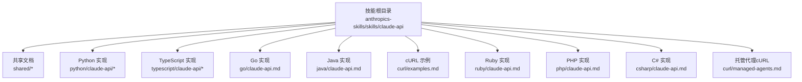
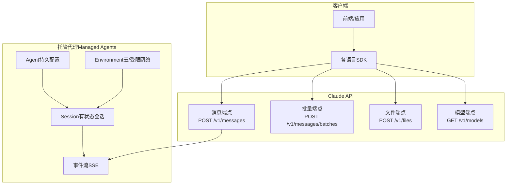
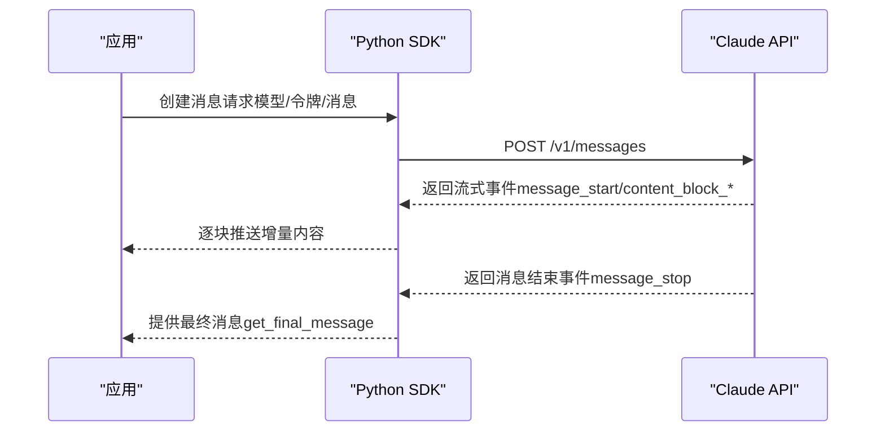
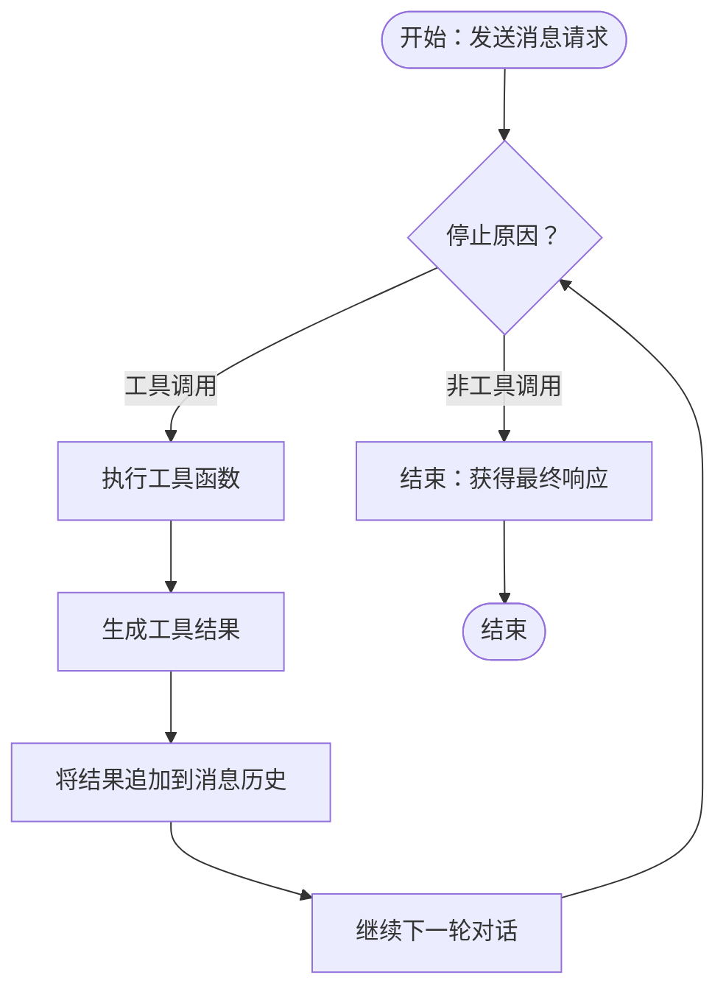
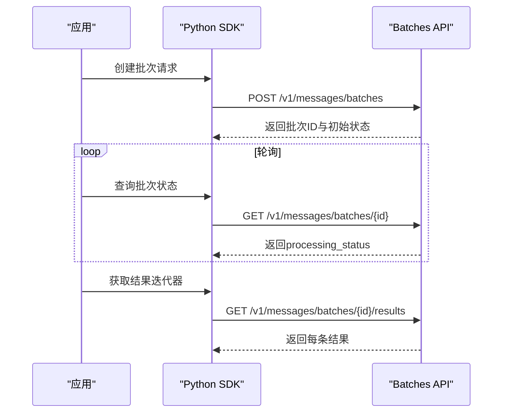
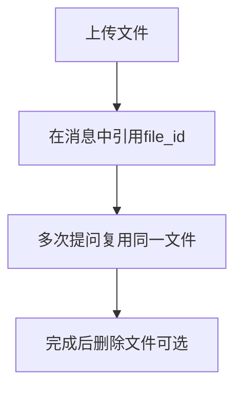
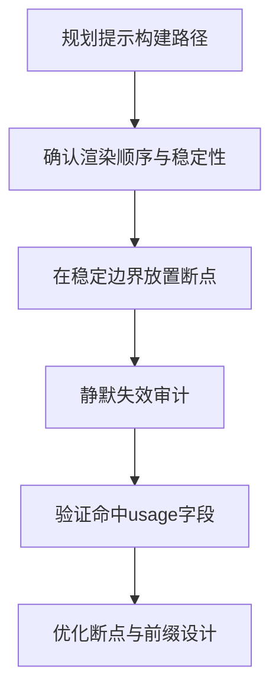
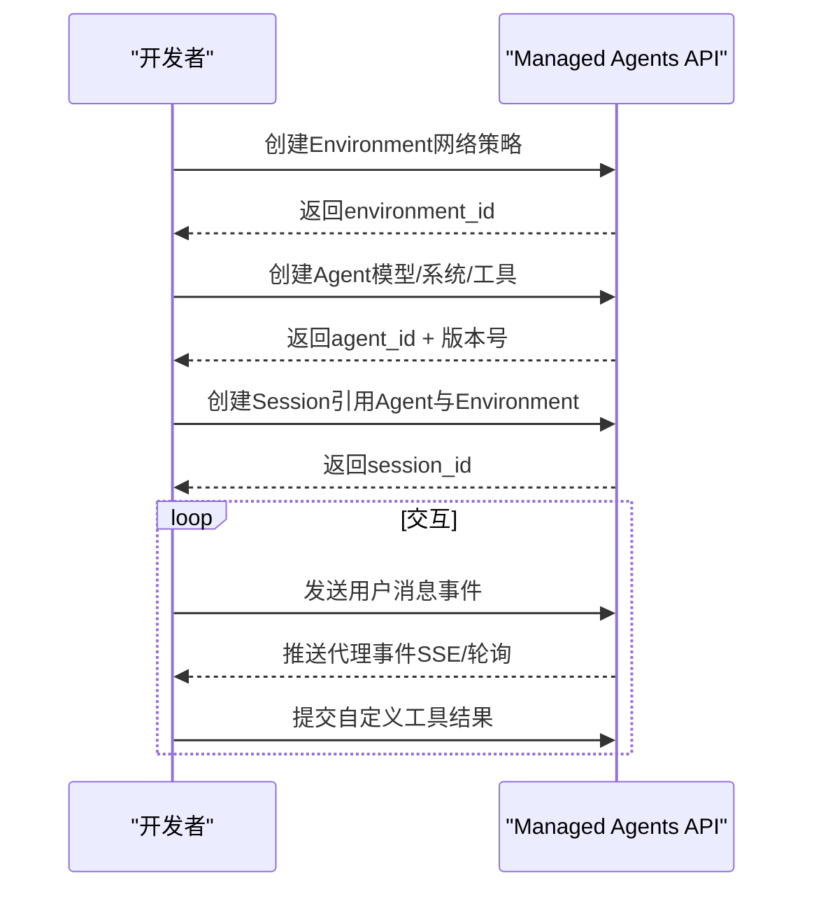
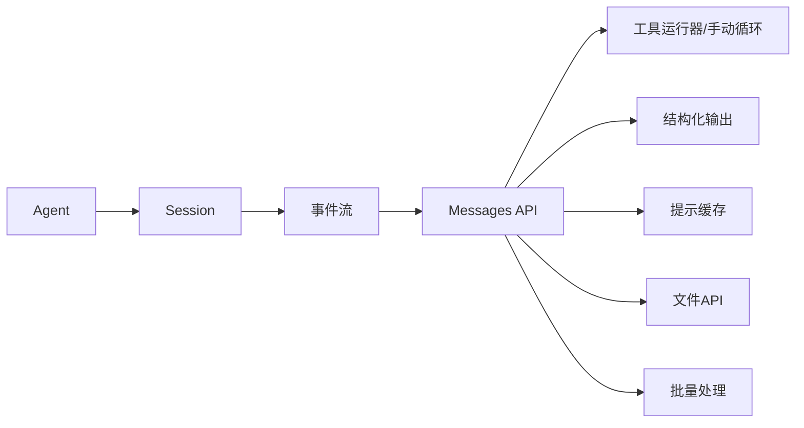

# Claude API集成

<cite>
**本文档引用的文件**
- [SKILL.md](file://skills/daoSkilLs/skills/anthropics-skills/skills/claude-api/SKILL.md)
- [README.md（Python）](file://skills/daoSkilLs/skills/anthropics-skills/skills/claude-api/python/claude-api/README.md)
- [README.md（TypeScript）](file://skills/daoSkilLs/skills/anthropics-skills/skills/claude-api/typescript/claude-api/README.md)
- [README.md（Go）](file://skills/daoSkilLs/skills/anthropics-skills/skills/claude-api/go/claude-api.md)
- [README.md（Java）](file://skills/daoSkilLs/skills/anthropics-skills/skills/claude-api/java/claude-api.md)
- [README.md（cURL）](file://skills/daoSkilLs/skills/anthropics-skills/skills/claude-api/curl/examples.md)
- [README.md（Ruby）](file://skills/daoSkilLs/skills/anthropics-skills/skills/claude-api/ruby/claude-api.md)
- [README.md（PHP）](file://skills/daoSkilLs/skills/anthropics-skills/skills/claude-api/php/claude-api.md)
- [README.md（C#）](file://skills/daoSkilLs/skills/anthropics-skills/skills/claude-api/csharp/claude-api.md)
- [工具使用.md（Python）](file://skills/daoSkilLs/skills/anthropics-skills/skills/claude-api/python/claude-api/tool-use.md)
- [流式传输.md（Python）](file://skills/daoSkilLs/skills/anthropics-skills/skills/claude-api/python/claude-api/streaming.md)
- [批处理.md（Python）](file://skills/daoSkilLs/skills/anthropics-skills/skills/claude-api/python/claude-api/batches.md)
- [文件API.md（Python）](file://skills/daoSkilLs/skills/anthropics-skills/skills/claude-api/python/claude-api/files-api.md)
- [代理设计.md](file://skills/daoSkilLs/skills/anthropics-skills/skills/claude-api/shared/agent-design.md)
- [提示缓存.md](file://skills/daoSkilLs/skills/anthropics-skills/skills/claude-api/shared/prompt-caching.md)
- [托管代理.md（cURL）](file://skills/daoSkilLs/skills/anthropics-skills/skills/claude-api/curl/managed-agents.md)
</cite>

## 目录
1. [简介](#简介)
2. [项目结构](#项目结构)
3. [核心组件](#核心组件)
4. [架构总览](#架构总览)
5. [详细组件分析](#详细组件分析)
6. [依赖关系分析](#依赖关系分析)
7. [性能考量](#性能考量)
8. [故障排查指南](#故障排查指南)
9. [结论](#结论)
10. [附录](#附录)

## 简介
本技术文档面向在DAO应用中集成Claude API的工程团队，系统阐述Claude API的核心架构、请求/响应模式、流式传输机制、工具使用、批量处理、文件API以及提示缓存等关键能力，并覆盖多语言SDK（TypeScript、Python、Java、Go、Ruby、C#、PHP）的实现要点与最佳实践。同时，文档解释Managed Agents API的设计理念与客户端模式，帮助读者在不同场景下做出正确的技术选型与实现决策。

## 项目结构
该仓库包含一套完整的Claude API技能包与多语言实现参考，核心位于skills/daoSkilLs/skills/anthropics-skills/skills/claude-api目录，按语言与主题拆分文档与示例，便于快速定位所需内容。

图表来源
- [SKILL.md:1-318](file://skills/daoSkilLs/skills/anthropics-skills/skills/claude-api/SKILL.md#L1-L318)
- [README.md（Python）:1-421](file://skills/daoSkilLs/skills/anthropics-skills/skills/claude-api/python/claude-api/README.md#L1-L421)
- [README.md（TypeScript）:1-77](file://skills/daoSkilLs/skills/anthropics-skills/skills/claude-api/typescript/claude-api/README.md#L1-L77)
- [README.md（Go）:1-422](file://skills/daoSkilLs/skills/anthropics-skills/skills/claude-api/go/claude-api.md#L1-L422)
- [README.md（Java）:1-433](file://skills/daoSkilLs/skills/anthropics-skills/skills/claude-api/java/claude-api.md#L1-L433)
- [README.md（cURL）:1-217](file://skills/daoSkilLs/skills/anthropics-skills/skills/claude-api/curl/examples.md#L1-L217)
- [README.md（Ruby）](file://skills/daoSkilLs/skills/anthropics-skills/skills/claude-api/ruby/claude-api.md)
- [README.md（PHP）](file://skills/daoSkilLs/skills/anthropics-skills/skills/claude-api/php/claude-api.md)
- [README.md（C#）](file://skills/daoSkilLs/skills/anthropics-skills/skills/claude-api/csharp/claude-api.md)
- [托管代理.md（cURL）:1-334](file://skills/daoSkilLs/skills/anthropics-skills/skills/claude-api/curl/managed-agents.md#L1-L334)

章节来源
- [SKILL.md:1-318](file://skills/daoSkilLs/skills/anthropics-skills/skills/claude-api/SKILL.md#L1-L318)

## 核心组件
- 单次消息调用（Messages API）：所有功能通过POST /v1/messages统一入口，支持工具调用、结构化输出、思维块、思考参数与输出效率控制等。
- 工具运行器（Tool Runner）：自动循环执行工具调用，简化手动轮询逻辑；部分语言提供类型安全与自动模式推断。
- 批量处理（Batches API）：异步批量处理消息请求，成本降低至50%，适合离线任务。
- 文件API（Files API）：上传并复用文件，避免重复上传，支持PDF/图片等多模态输入。
- 提示缓存（Prompt Caching）：前缀匹配缓存，显著降低重复上下文成本；需遵循渲染顺序与断点放置规则。
- 托管代理（Managed Agents）：由Anthropic托管的有状态代理，具备会话、事件流、工具执行沙箱与资源挂载能力。

章节来源
- [SKILL.md:152-163](file://skills/daoSkilLs/skills/anthropics-skills/skills/claude-api/SKILL.md#L152-L163)
- [README.md（Python）:112-168](file://skills/daoSkilLs/skills/anthropics-skills/skills/claude-api/python/claude-api/README.md#L112-L168)
- [README.md（Go）:369-384](file://skills/daoSkilLs/skills/anthropics-skills/skills/claude-api/go/claude-api.md#L369-L384)
- [README.md（Java）:411-433](file://skills/daoSkilLs/skills/anthropics-skills/skills/claude-api/java/claude-api.md#L411-L433)
- [README.md（cURL）:160-180](file://skills/daoSkilLs/skills/anthropics-skills/skills/claude-api/curl/examples.md#L160-L180)

## 架构总览
Claude API采用“单一入口、多特性叠加”的架构设计：所有请求均走Messages API，工具与输出约束作为该端点的功能开关而非独立服务。托管代理在此基础上引入环境、会话与事件流，形成“持久配置 + 沙箱执行 + 流式事件”的服务形态。

图表来源
- [SKILL.md:152-163](file://skills/daoSkilLs/skills/anthropics-skills/skills/claude-api/SKILL.md#L152-L163)
- [托管代理.md（cURL）:54-78](file://skills/daoSkilLs/skills/anthropics-skills/skills/claude-api/curl/managed-agents.md#L54-L78)

## 详细组件分析

### 请求/响应与流式传输（Python）
- 基础消息请求：指定模型、最大输出令牌数与消息数组，返回内容块列表（文本、思维、工具调用等）。
- 流式传输：使用messages.stream以SSE增量推送事件，支持文本增量、思维增量与消息级统计更新；可结合最终消息获取完整结果。
- 错误处理：区分认证、权限、配额、网络与服务端错误，建议结合指数退避重试策略。

图表来源
- [README.md（Python）:28-41](file://skills/daoSkilLs/skills/anthropics-skills/skills/claude-api/python/claude-api/README.md#L28-L41)
- [流式传输.md（Python）:5-92](file://skills/daoSkilLs/skills/anthropics-skills/skills/claude-api/python/claude-api/streaming.md#L5-L92)

章节来源
- [README.md（Python）:28-41](file://skills/daoSkilLs/skills/anthropics-skills/skills/claude-api/python/claude-api/README.md#L28-L41)
- [流式传输.md（Python）:5-92](file://skills/daoSkilLs/skills/anthropics-skills/skills/claude-api/python/claude-api/streaming.md#L5-L92)

### 工具使用（Python）
- 工具运行器：通过装饰器或函数签名生成工具定义，自动处理工具调用循环与结果回传。
- 手动循环：适用于需要细粒度控制的场景，如条件执行、人工审批、日志记录等。
- 结构化输出：结合输出格式约束，确保响应符合预期JSON Schema。
- 代码执行与内存工具：在容器内执行脚本与文件操作，支持结果文件下载与容器复用。

图表来源
- [工具使用.md（Python）:131-184](file://skills/daoSkilLs/skills/anthropics-skills/skills/claude-api/python/claude-api/tool-use.md#L131-L184)

章节来源
- [工具使用.md（Python）:5-49](file://skills/daoSkilLs/skills/anthropics-skills/skills/claude-api/python/claude-api/tool-use.md#L5-L49)
- [工具使用.md（Python）:131-184](file://skills/daoSkilLs/skills/anthropics-skills/skills/claude-api/python/claude-api/tool-use.md#L131-L184)
- [工具使用.md（Python）:461-591](file://skills/daoSkilLs/skills/anthropics-skills/skills/claude-api/python/claude-api/tool-use.md#L461-L591)

### 批量处理（Python）
- 批次创建：提交多个消息请求，支持自定义ID与参数。
- 轮询完成：监控批次处理状态，等待全部完成。
- 结果提取：遍历结果，分别处理成功、失败、取消与过期等情形。
- 成本优化：批量处理价格为标准价格的50%，适合离线任务。

图表来源
- [批处理.md（Python）:15-91](file://skills/daoSkilLs/skills/anthropics-skills/skills/claude-api/python/claude-api/batches.md#L15-L91)

章节来源
- [批处理.md（Python）:1-186](file://skills/daoSkilLs/skills/anthropics-skills/skills/claude-api/python/claude-api/batches.md#L1-L186)

### 文件API（Python）
- 上传：一次性上传文件，获取file_id。
- 复用：在后续消息中通过document/image块引用file_id，避免重复上传。
- 管理：列出、查询元数据、删除与下载（仅限代码执行/技能生成的文件）。
- 最佳实践：先上传后复用，减少输入令牌计费。

图表来源
- [文件API.md（Python）:17-118](file://skills/daoSkilLs/skills/anthropics-skills/skills/claude-api/python/claude-api/files-api.md#L17-L118)

章节来源
- [文件API.md（Python）:1-166](file://skills/daoSkilLs/skills/anthropics-skills/skills/claude-api/python/claude-api/files-api.md#L1-L166)

### 提示缓存（跨语言）
- 前缀匹配：任何前缀字节变化都会使之后的断点失效。
- 渲染顺序：tools → system → messages；在最后一个可缓存块放置断点可同时缓存工具与系统提示。
- 断点数量：每请求最多4个断点；最小可缓存前缀长度因模型而异。
- 验证命中：通过usage字段中的cache_creation_input_tokens与cache_read_input_tokens判断缓存效果。
- 静默失效：时间戳、UUID、未排序JSON、动态工具集等会导致缓存无效，需审计代码路径。

图表来源
- [提示缓存.md:17-31](file://skills/daoSkilLs/skills/anthropics-skills/skills/claude-api/shared/prompt-caching.md#L17-L31)
- [提示缓存.md:83-97](file://skills/daoSkilLs/skills/anthropics-skills/skills/claude-api/shared/prompt-caching.md#L83-L97)

章节来源
- [提示缓存.md:1-172](file://skills/daoSkilLs/skills/anthropics-skills/skills/claude-api/shared/prompt-caching.md#L1-L172)
- [README.md（Python）:112-168](file://skills/daoSkilLs/skills/anthropics-skills/skills/claude-api/python/claude-api/README.md#L112-L168)

### 托管代理（Managed Agents）设计理念与客户端模式（cURL）
- 设计理念：由Anthropic托管代理配置与会话，提供持久化、版本化配置与工作空间，支持SSE事件流、工具执行沙箱与资源挂载。
- 客户端模式：先创建Agent（含模型、系统提示、工具），再创建Environment，最后启动Session；通过事件接口发送用户消息与接收代理事件。
- 事件流：支持SSE长连接与轮询两种方式；可中断会话、上传文件、列出/下载会话产物。
- MCP集成：可在Agent中声明MCP服务器，通过Vault注入凭据，实现远程工具接入。

图表来源
- [托管代理.md（cURL）:54-141](file://skills/daoSkilLs/skills/anthropics-skills/skills/claude-api/curl/managed-agents.md#L54-L141)

章节来源
- [托管代理.md（cURL）:1-334](file://skills/daoSkilLs/skills/anthropics-skills/skills/claude-api/curl/managed-agents.md#L1-L334)

### 多语言SDK支持与差异
- Python：功能最全，支持工具运行器、结构化输出、批处理、文件API、提示缓存、流式传输与编排工具（MCP转换）。
- TypeScript：与Python类似，强调类型安全与Zod模式校验。
- Go：支持工具运行器（Beta）、流式传输、文件API、提示缓存与上下文编辑/压缩（Beta）。
- Java：支持工具运行器（注解类）、结构化输出、文件API、提示缓存与MCP集成（Beta）。
- Ruby/PHP/C#：提供单文件基础文档，覆盖消息、工具、流式传输、提示缓存与文件API的基础用法。

章节来源
- [SKILL.md:77-91](file://skills/daoSkilLs/skills/anthropics-skills/skills/claude-api/SKILL.md#L77-L91)
- [README.md（TypeScript）:1-77](file://skills/daoSkilLs/skills/anthropics-skills/skills/claude-api/typescript/claude-api/README.md#L1-L77)
- [README.md（Go）:1-422](file://skills/daoSkilLs/skills/anthropics-skills/skills/claude-api/go/claude-api.md#L1-L422)
- [README.md（Java）:1-433](file://skills/daoSkilLs/skills/anthropics-skills/skills/claude-api/java/claude-api.md#L1-L433)
- [README.md（cURL）:1-217](file://skills/daoSkilLs/skills/anthropics-skills/skills/claude-api/curl/examples.md#L1-L217)
- [README.md（Ruby）](file://skills/daoSkilLs/skills/anthropics-skills/skills/claude-api/ruby/claude-api.md)
- [README.md（PHP）](file://skills/daoSkilLs/skills/anthropics-skills/skills/claude-api/php/claude-api.md)
- [README.md（C#）](file://skills/daoSkilLs/skills/anthropics-skills/skills/claude-api/csharp/claude-api.md)

## 依赖关系分析
- 组件耦合：所有高级能力（工具、结构化输出、缓存、文件、批处理）均通过Messages API统一暴露，降低耦合复杂度。
- 外部依赖：托管代理依赖环境与会话生命周期管理；文件API依赖存储与下载接口；MCP集成依赖外部服务器与凭据管理。
- 循环依赖：无直接循环；事件流为单向推送，客户端负责状态维护。

图表来源
- [SKILL.md:152-163](file://skills/daoSkilLs/skills/anthropics-skills/skills/claude-api/SKILL.md#L152-L163)
- [托管代理.md（cURL）:54-141](file://skills/daoSkilLs/skills/anthropics-skills/skills/claude-api/curl/managed-agents.md#L54-L141)

章节来源
- [SKILL.md:152-163](file://skills/daoSkilLs/skills/anthropics-skills/skills/claude-api/SKILL.md#L152-L163)

## 性能考量
- 提示缓存：优先设计稳定的前缀与断点，减少重复输入令牌成本；注意最小可缓存前缀阈值与静默失效因素。
- 流式传输：对长输出与高令牌上限请求默认启用流式，结合最终消息获取完整响应，避免超时与截断。
- 批量处理：对离线、低延迟敏感度的任务采用批量API，节省50%成本。
- 工具调用：合理使用工具运行器减少往返次数；对连续工具调用考虑程序化工具调用（PTC）以降低中间结果开销。
- 文件复用：上传一次、多次引用，避免重复上传带来的令牌计费。

## 故障排查指南
- 错误分类与处理：区分认证错误、权限不足、配额限制、网络异常与服务端错误；对429与5xx使用指数退避重试。
- 缓存无效排查：检查是否在系统提示中插入时间戳/UUID、JSON是否未排序、工具集是否动态变化；通过usage字段核对命中情况。
- 工具调用问题：确认工具名称与输入Schema一致；在手动循环中正确构造tool_result并保持tool_use_id一致。
- 托管代理事件：SSE连接中断时采用轮询兜底；确保会话ID与事件类型正确；必要时中断会话并重建。

章节来源
- [README.md（Python）:196-221](file://skills/daoSkilLs/skills/anthropics-skills/skills/claude-api/python/claude-api/README.md#L196-L221)
- [提示缓存.md:124-139](file://skills/daoSkilLs/skills/anthropics-skills/skills/claude-api/shared/prompt-caching.md#L124-L139)
- [托管代理.md（cURL）:145-178](file://skills/daoSkilLs/skills/anthropics-skills/skills/claude-api/curl/managed-agents.md#L145-L178)

## 结论
通过统一的Messages API与丰富的扩展能力（工具、结构化输出、缓存、文件、批量与托管代理），Claude API为从简单问答到复杂代理的多种场景提供了清晰、可扩展且高性能的解决方案。建议在实际工程中优先采用提示缓存与流式传输优化成本与时延，并根据任务复杂度选择合适的表面（单次调用、工具使用、托管代理）。

## 附录
- 代理设计要点：工具表面设计（bash与专用工具）、工具组合（程序化工具调用）、工具集扩展（工具搜索/技能）、长期运行的上下文管理（上下文清理、压缩、记忆）与缓存策略。
- 语言选择建议：若追求类型安全与生态完善，优先Python/TypeScript；若偏向轻量与跨平台，可选Go/Java；对第三方部署受限场景，使用cURL/raw HTTP对接。

章节来源
- [代理设计.md:1-102](file://skills/daoSkilLs/skills/anthropics-skills/skills/claude-api/shared/agent-design.md#L1-L102)