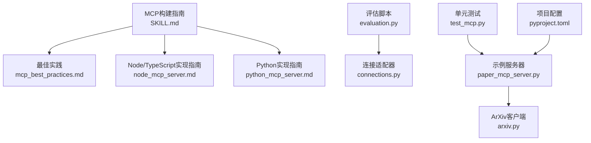
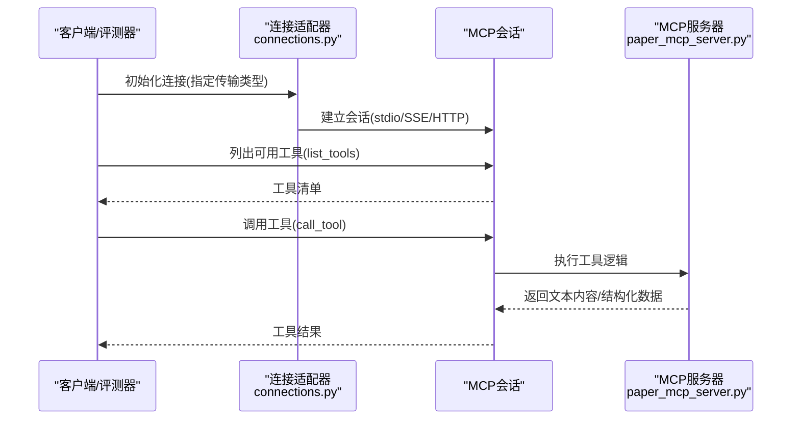
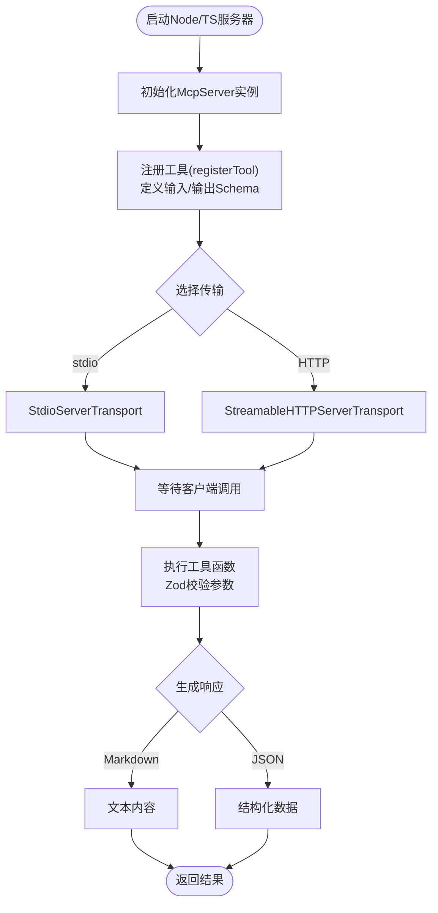
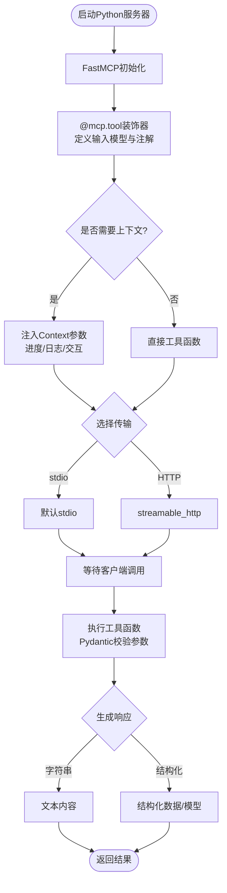
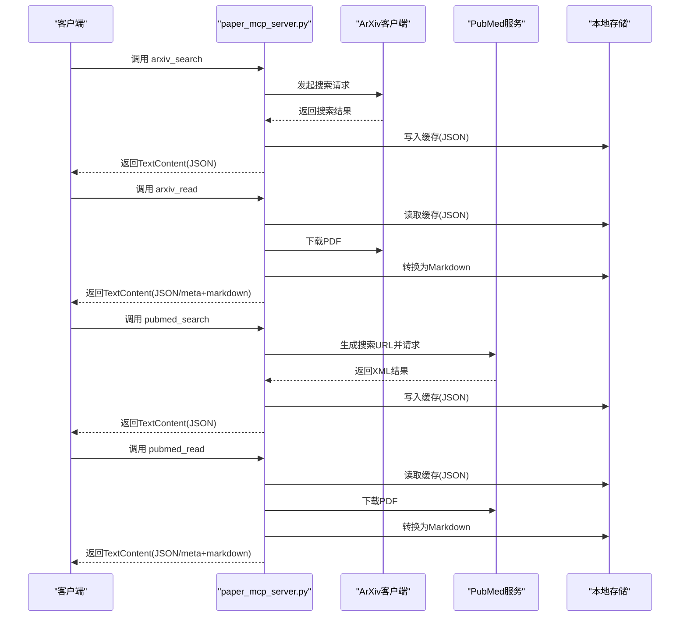
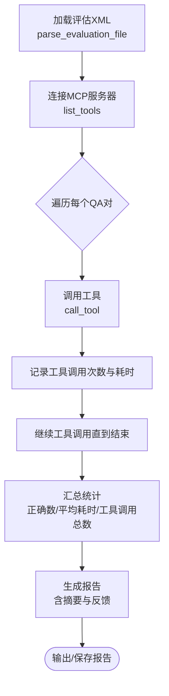
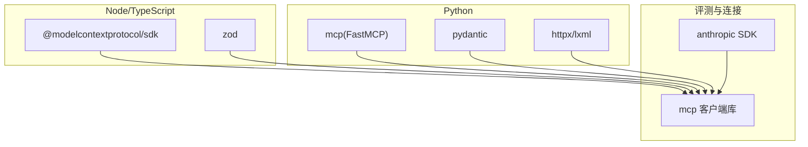

# MCP服务器构建

<cite>
**本文引用的文件**
- [SKILL.md](file://skills/daoSkilLs/skills/anthropics-skills/skills/mcp-builder/SKILL.md)
- [mcp_best_practices.md](file://skills/daoSkilLs/skills/anthropics-skills/skills/mcp-builder/reference/mcp_best_practices.md)
- [node_mcp_server.md](file://skills/daoSkilLs/skills/anthropics-skills/skills/mcp-builder/reference/node_mcp_server.md)
- [python_mcp_server.md](file://skills/daoSkilLs/skills/anthropics-skills/skills/mcp-builder/reference/python_mcp_server.md)
- [evaluation.py](file://skills/daoSkilLs/skills/anthropics-skills/skills/mcp-builder/scripts/evaluation.py)
- [connections.py](file://skills/daoSkilLs/skills/anthropics-skills/skills/mcp-builder/scripts/connections.py)
- [requirements.txt](file://skills/daoSkilLs/skills/anthropics-skills/skills/mcp-builder/scripts/requirements.txt)
- [paper_mcp_server.py](file://tools/DeepResearch/src/deepresearch/mcp_client/paper_mcp_server.py)
- [arxiv.py](file://tools/DeepResearch/src/deepresearch/mcp_client/arxiv.py)
- [test_mcp.py](file://tools/DeepResearch/tests/unit/mcp_client/test_mcp.py)
- [pyproject.toml](file://tools/DeepResearch/pyproject.toml)
</cite>

## 目录
1. [引言](#引言)
2. [项目结构](#项目结构)
3. [核心组件](#核心组件)
4. [架构总览](#架构总览)
5. [详细组件分析](#详细组件分析)
6. [依赖关系分析](#依赖关系分析)
7. [性能考量](#性能考量)
8. [故障排除指南](#故障排除指南)
9. [结论](#结论)
10. [附录](#附录)

## 引言
本技术文档面向希望基于MCP（Model Context Protocol）构建高质量服务器的工程师与研究者，系统阐述MCP协议架构、Node.js与Python两种语言的服务器实现模式、连接管理与评估机制，并提供部署、监控与安全最佳实践。文档以仓库中的MCP构建指南、示例服务器与评估脚本为依据，结合实际代码路径进行深入解析。

## 项目结构
仓库中与MCP服务器构建直接相关的模块主要分布在以下位置：
- MCP构建指南与参考：skills/daoSkilLs/skills/anthropics-skills/skills/mcp-builder
- 深度研究工具链中的MCP示例服务器：tools/DeepResearch/src/deepresearch/mcp_client
- 测试与评估脚本：skills/daoSkilLs/skills/anthropics-skills/skills/mcp-builder/scripts

下图展示与MCP服务器构建相关的目录与文件关系：

图表来源
- [SKILL.md:1-237](file://skills/daoSkilLs/skills/anthropics-skills/skills/mcp-builder/SKILL.md#L1-L237)
- [mcp_best_practices.md:1-250](file://skills/daoSkilLs/skills/anthropics-skills/skills/mcp-builder/reference/mcp_best_practices.md#L1-L250)
- [node_mcp_server.md:1-970](file://skills/daoSkilLs/skills/anthropics-skills/skills/mcp-builder/reference/node_mcp_server.md#L1-L970)
- [python_mcp_server.md:1-719](file://skills/daoSkilLs/skills/anthropics-skills/skills/mcp-builder/reference/python_mcp_server.md#L1-L719)
- [evaluation.py:1-374](file://skills/daoSkilLs/skills/anthropics-skills/skills/mcp-builder/scripts/evaluation.py#L1-L374)
- [connections.py:1-152](file://skills/daoSkilLs/skills/anthropics-skills/skills/mcp-builder/scripts/connections.py#L1-L152)
- [paper_mcp_server.py:1-463](file://tools/DeepResearch/src/deepresearch/mcp_client/paper_mcp_server.py#L1-L463)
- [arxiv.py:1-456](file://tools/DeepResearch/src/deepresearch/mcp_client/arxiv.py#L1-L456)
- [test_mcp.py:1-93](file://tools/DeepResearch/tests/unit/mcp_client/test_mcp.py#L1-L93)
- [pyproject.toml:1-93](file://tools/DeepResearch/pyproject.toml#L1-L93)

章节来源
- [SKILL.md:1-237](file://skills/daoSkilLs/skills/anthropics-skills/skills/mcp-builder/SKILL.md#L1-L237)
- [pyproject.toml:1-93](file://tools/DeepResearch/pyproject.toml#L1-L93)

## 核心组件
- MCP协议与最佳实践：统一命名规范、响应格式、分页策略、传输选择与安全建议。
- Node/TypeScript服务器模板：基于官方SDK的工具注册、输入验证（Zod）、错误处理与多传输支持。
- Python服务器模板：基于FastMCP的装饰器式工具注册、Pydantic模型校验、上下文注入与资源注册。
- 示例服务器：paper_mcp_server.py提供ArXiv与PubMed检索与阅读工具，演示服务端能力与数据缓存。
- 连接与评估：evaluation.py与connections.py提供统一的MCP连接抽象，支持stdio、SSE与HTTP三种传输；并可对服务器进行自动化评估。

章节来源
- [mcp_best_practices.md:1-250](file://skills/daoSkilLs/skills/anthropics-skills/skills/mcp-builder/reference/mcp_best_practices.md#L1-L250)
- [node_mcp_server.md:1-970](file://skills/daoSkilLs/skills/anthropics-skills/skills/mcp-builder/reference/node_mcp_server.md#L1-L970)
- [python_mcp_server.md:1-719](file://skills/daoSkilLs/skills/anthropics-skills/skills/mcp-builder/reference/python_mcp_server.md#L1-L719)
- [paper_mcp_server.py:1-463](file://tools/DeepResearch/src/deepresearch/mcp_client/paper_mcp_server.py#L1-L463)
- [evaluation.py:1-374](file://skills/daoSkilLs/skills/anthropics-skills/skills/mcp-builder/scripts/evaluation.py#L1-L374)
- [connections.py:1-152](file://skills/daoSkilLs/skills/anthropics-skills/skills/mcp-builder/scripts/connections.py#L1-L152)

## 架构总览
下图展示了MCP服务器的典型交互流程：客户端通过不同传输方式连接到服务器，服务器根据工具清单动态执行工具调用并返回内容或结构化数据。

图表来源
- [connections.py:1-152](file://skills/daoSkilLs/skills/anthropics-skills/skills/mcp-builder/scripts/connections.py#L1-L152)
- [evaluation.py:1-374](file://skills/daoSkilLs/skills/anthropics-skills/skills/mcp-builder/scripts/evaluation.py#L1-L374)
- [paper_mcp_server.py:361-463](file://tools/DeepResearch/src/deepresearch/mcp_client/paper_mcp_server.py#L361-L463)

## 详细组件分析

### Node/TypeScript MCP服务器实现要点
- 服务器初始化与命名：遵循“{service}-mcp-server”命名约定，确保描述性与通用性。
- 工具注册与输入验证：使用registerTool注册工具，Zod Schema提供运行时校验与类型安全。
- 错误处理与响应格式：统一错误消息格式，支持Markdown与JSON双格式输出。
- 传输选择：stdio用于本地集成，Streamable HTTP用于远程多客户端场景。
- 资源与提示：可选注册资源与通知，提升数据访问效率与客户端体验。

图表来源
- [node_mcp_server.md:1-970](file://skills/daoSkilLs/skills/anthropics-skills/skills/mcp-builder/reference/node_mcp_server.md#L1-L970)

章节来源
- [node_mcp_server.md:1-970](file://skills/daoSkilLs/skills/anthropics-skills/skills/mcp-builder/reference/node_mcp_server.md#L1-L970)

### Python MCP服务器实现要点
- 服务器初始化与命名：遵循“{service}_mcp”命名约定，使用FastMCP简化开发。
- 工具注册与输入验证：@mcp.tool装饰器自动提取描述与Schema，Pydantic模型约束输入。
- 上下文注入与资源：Context参数支持进度报告、日志与用户交互；资源注册便于静态数据暴露。
- 传输选择：默认stdio，可通过run(transport="streamable_http")切换至HTTP。
- 生命周期管理：支持应用生命周期，集中初始化与清理数据库等资源。

图表来源
- [python_mcp_server.md:1-719](file://skills/daoSkilLs/skills/anthropics-skills/skills/mcp-builder/reference/python_mcp_server.md#L1-L719)

章节来源
- [python_mcp_server.md:1-719](file://skills/daoSkilLs/skills/anthropics-skills/skills/mcp-builder/reference/python_mcp_server.md#L1-L719)

### 示例服务器：paper_mcp_server.py
该服务器提供ArXiv与PubMed的搜索与阅读工具，演示了：
- 工具清单与工具调用：list_tools与call_tool实现。
- 异步网络请求与缓存：使用httpx异步客户端与本地存储缓存元数据与PDF转MD。
- 错误处理与返回格式：统一返回TextContent，包含JSON结构化内容与Markdown文本。

图表来源
- [paper_mcp_server.py:1-463](file://tools/DeepResearch/src/deepresearch/mcp_client/paper_mcp_server.py#L1-L463)
- [arxiv.py:1-456](file://tools/DeepResearch/src/deepresearch/mcp_client/arxiv.py#L1-L456)

章节来源
- [paper_mcp_server.py:1-463](file://tools/DeepResearch/src/deepresearch/mcp_client/paper_mcp_server.py#L1-L463)
- [arxiv.py:1-456](file://tools/DeepResearch/src/deepresearch/mcp_client/arxiv.py#L1-L456)

### 连接与评估：evaluation.py 与 connections.py
- 连接适配器：抽象stdio、SSE与HTTP三类传输，统一封装ClientSession初始化与工具调用。
- 评测流程：从XML加载问题与答案，通过Anthropic模型驱动工具调用，统计准确率、平均耗时与工具调用次数，并输出总结与反馈。

图表来源
- [evaluation.py:1-374](file://skills/daoSkilLs/skills/anthropics-skills/skills/mcp-builder/scripts/evaluation.py#L1-L374)
- [connections.py:1-152](file://skills/daoSkilLs/skills/anthropics-skills/skills/mcp-builder/scripts/connections.py#L1-L152)

章节来源
- [evaluation.py:1-374](file://skills/daoSkilLs/skills/anthropics-skills/skills/mcp-builder/scripts/evaluation.py#L1-L374)
- [connections.py:1-152](file://skills/daoSkilLs/skills/anthropics-skills/skills/mcp-builder/scripts/connections.py#L1-L152)

## 依赖关系分析
- 语言与框架依赖：Node/TypeScript侧依赖MCP SDK与Zod；Python侧依赖FastMCP与Pydantic；示例服务器依赖httpx、lxml与PDF转换库。
- 评测与连接：evaluation.py依赖mcp客户端库与Anthropic SDK；connections.py封装mcp的stdio、sse与http客户端。

图表来源
- [requirements.txt:1-3](file://skills/daoSkilLs/skills/anthropics-skills/skills/mcp-builder/scripts/requirements.txt#L1-L3)
- [pyproject.toml:1-93](file://tools/DeepResearch/pyproject.toml#L1-L93)

章节来源
- [requirements.txt:1-3](file://skills/daoSkilLs/skills/anthropics-skills/skills/mcp-builder/scripts/requirements.txt#L1-L3)
- [pyproject.toml:1-93](file://tools/DeepResearch/pyproject.toml#L1-L93)

## 性能考量
- 分页与限流：工具应尊重limit参数，返回has_more、next_offset与total_count；避免一次性加载全部数据。
- 缓存与I/O：示例服务器采用本地缓存减少重复下载与解析开销；建议在生产环境引入分布式缓存与CDN。
- 传输选择：远程多客户端场景优先选择Streamable HTTP；本地集成可使用stdio降低复杂度。
- 超时与重试：网络请求设置合理超时与指数退避；对第三方API遵守其速率限制与节流策略。
- 并发与资源：控制并发请求数量，避免阻塞；使用连接池与异步I/O提升吞吐。

## 故障排除指南
- 连接失败
  - 确认传输类型与参数：stdio需提供命令与参数；HTTP/SSE需提供URL与必要头部。
  - 检查服务器进程状态与日志输出（Node/TypeScript建议使用stderr输出日志）。
- 工具调用异常
  - 核对工具名称与输入Schema；确保必填字段与范围约束满足要求。
  - 查看服务器端错误信息与网络状态码，定位外部API问题。
- 评测失败
  - 确保评估XML格式正确且包含问题与答案；检查评测器模型与工具清单加载。
  - 关注工具调用耗时与调用次数，识别性能瓶颈或工具设计缺陷。

章节来源
- [connections.py:1-152](file://skills/daoSkilLs/skills/anthropics-skills/skills/mcp-builder/scripts/connections.py#L1-L152)
- [evaluation.py:1-374](file://skills/daoSkilLs/skills/anthropics-skills/skills/mcp-builder/scripts/evaluation.py#L1-L374)
- [mcp_best_practices.md:1-250](file://skills/daoSkilLs/skills/anthropics-skills/skills/mcp-builder/reference/mcp_best_practices.md#L1-L250)

## 结论
通过本仓库提供的MCP构建指南、语言实现模板与示例服务器，开发者可以快速搭建符合MCP协议的高质量服务器。结合统一的连接与评估体系，能够持续验证工具的有效性与用户体验。在生产环境中，建议重点关注安全性、性能与可观测性，确保服务器稳定可靠地服务于各类AI工作负载。

## 附录
- 部署与监控
  - 使用Streamable HTTP部署于云服务，配合负载均衡与健康检查。
  - 在服务器端启用日志与指标上报，关注工具调用成功率、延迟分布与错误分类。
  - 对外部API实施限速与熔断，保障服务稳定性。
- 安全最佳实践
  - 强制输入校验与参数过滤，防止注入与越权访问。
  - 严格认证与授权，避免泄露敏感令牌；DNS重绑定防护仅在本地启用。
  - 错误信息不暴露内部细节，记录审计日志但不包含敏感数据。

章节来源
- [mcp_best_practices.md:1-250](file://skills/daoSkilLs/skills/anthropics-skills/skills/mcp-builder/reference/mcp_best_practices.md#L1-L250)
- [paper_mcp_server.py:1-463](file://tools/DeepResearch/src/deepresearch/mcp_client/paper_mcp_server.py#L1-L463)