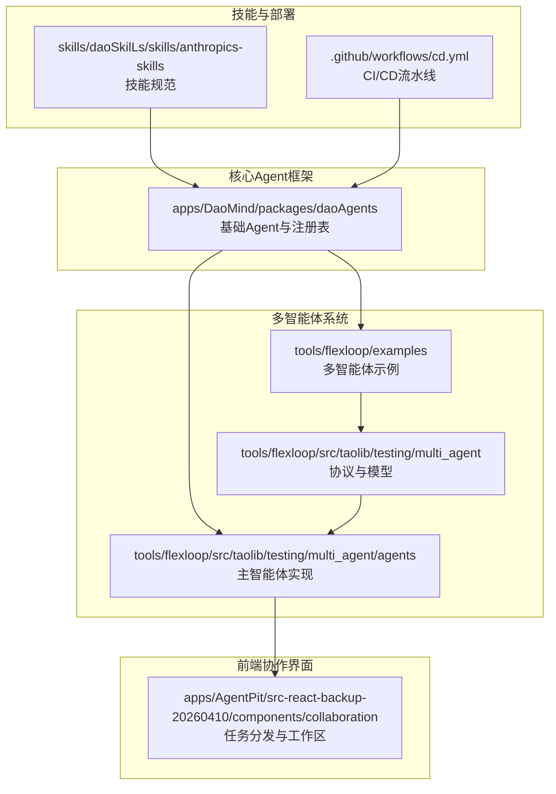
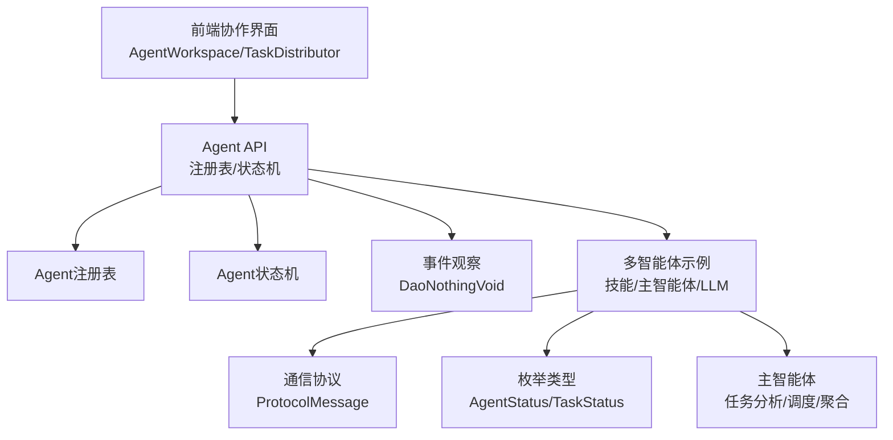
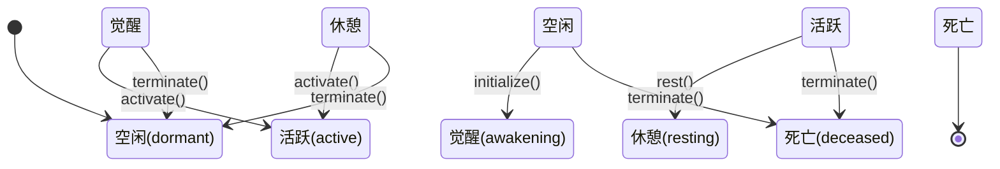
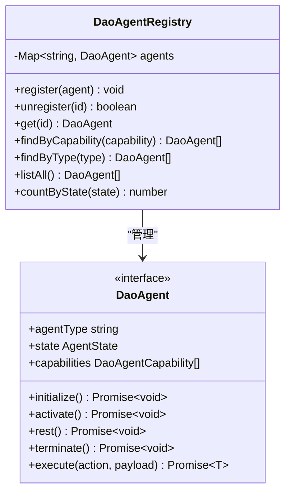
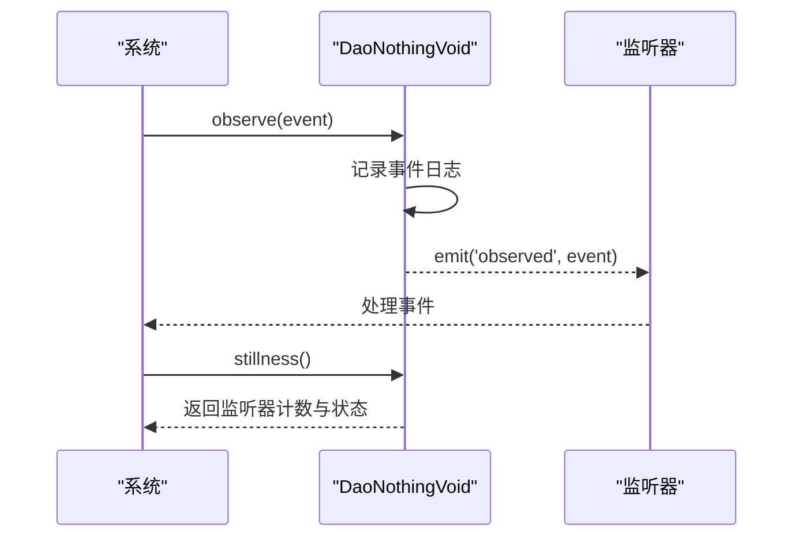
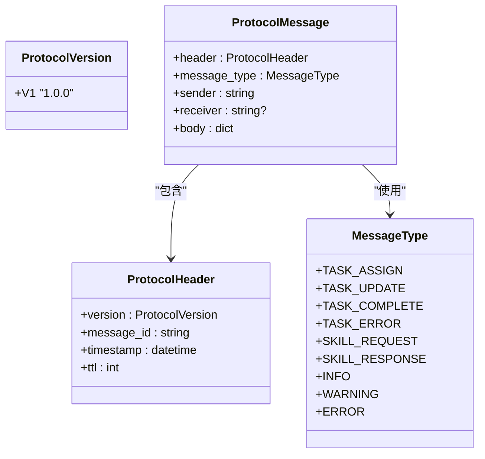
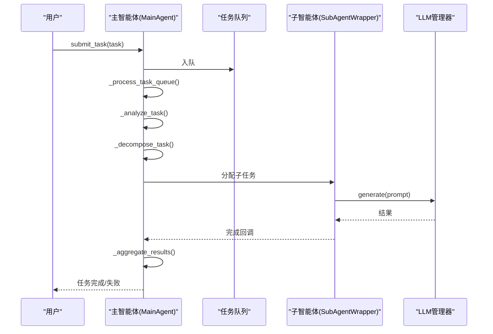
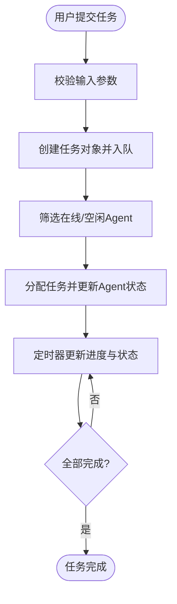
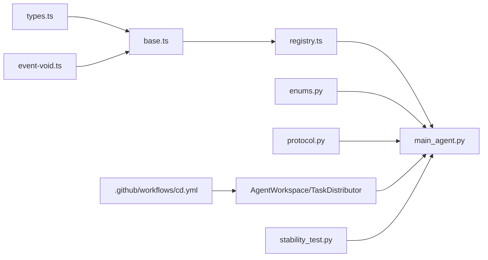

# Managed Agents开发框架

<cite>
**本文档引用的文件**
- [apps/DaoMind/packages/daoAgents/src/base.ts](file://apps/DaoMind/packages/daoAgents/src/base.ts)
- [apps/DaoMind/packages/daoAgents/src/types.ts](file://apps/DaoMind/packages/daoAgents/src/types.ts)
- [apps/DaoMind/packages/daoAgents/src/registry.ts](file://apps/DaoMind/packages/daoAgents/src/registry.ts)
- [apps/DaoMind/packages/daoAgents/src/index.ts](file://apps/DaoMind/packages/daoAgents/src/index.ts)
- [apps/DaoMind/packages/daoAgents/src/__tests__/base.test.ts](file://apps/DaoMind/packages/daoAgents/src/__tests__/base.test.ts)
- [apps/DaoMind/packages/daoNothing/src/event-void.ts](file://apps/DaoMind/packages/daoNothing/src/event-void.ts)
- [apps/DaoMind/packages/daoNothing/src/event-void.js](file://apps/DaoMind/packages/daoNothing/src/event-void.js)
- [apps/DaoMind/test-event-void.js](file://apps/DaoMind/test-event-void.js)
- [tools/flexloop/examples/multi_agent_example.py](file://tools/flexloop/examples/multi_agent_example.py)
- [tools/flexloop/src/taolib/testing/multi_agent/models/protocol.py](file://tools/flexloop/src/taolib/testing/multi_agent/models/protocol.py)
- [tools/flexloop/src/taolib/testing/multi_agent/models/enums.py](file://tools/flexloop/src/taolib/testing/multi_agent/models/enums.py)
- [tools/flexloop/src/taolib/testing/multi_agent/agents/main_agent.py](file://tools/flexloop/src/taolib/testing/multi_agent/agents/main_agent.py)
- [tools/flexloop/tests/testing/test_task_queue/test_service.py](file://tools/flexloop/tests/testing/test_task_queue/test_service.py)
- [tools/DeepResearch/tests/performance/stability_test.py](file://tools/DeepResearch/tests/performance/stability_test.py)
- [.github/workflows/cd.yml](file://.github/workflows/cd.yml)
- [.trae/tasks/开发智能体平台系统.md](file://.trae/tasks/开发智能体平台系统.md)
- [skills/daoSkilLs/skills/anthropics-skills/skills/claude-api/shared/managed-agents-core.md](file://skills/daoSkilLs/skills/anthropics-skills/skills/claude-api/shared/managed-agents-core.md)
- [apps/AgentPit/src-react-backup-20260410/components/collaboration/AgentWorkspace.tsx](file://apps/AgentPit/src-react-backup-20260410/components/collaboration/AgentWorkspace.tsx)
- [apps/AgentPit/src-react-backup-20260410/components/collaboration/TaskDistributor.tsx](file://apps/AgentPit/src-react-backup-20260410/components/collaboration/TaskDistributor.tsx)
- [apps/DaoMind/packages/daoAgents/src/__tests__/base.test.ts](file://apps/DaoMind/packages/daoAgents/src/__tests__/base.test.ts)
</cite>

## 目录
1. [简介](#简介)
2. [项目结构](#项目结构)
3. [核心组件](#核心组件)
4. [架构概览](#架构概览)
5. [详细组件分析](#详细组件分析)
6. [依赖关系分析](#依赖关系分析)
7. [性能考虑](#性能考虑)
8. [故障排除指南](#故障排除指南)
9. [结论](#结论)
10. [附录](#附录)

## 简介
本项目是一个面向多智能体系统的开发框架，旨在提供统一的Agent设计原则、核心架构与环境配置方案。框架支持Agent生命周期管理、状态持久化、任务分配与多Agent协调，同时提供事件处理与通信协议实现细节。文档涵盖Agent配置模板、部署策略、监控方案以及开发环境搭建、调试技巧和性能优化方法。

## 项目结构
项目采用多包与多应用并存的组织方式，核心Agent框架位于 `apps/DaoMind/packages/daoAgents`，多智能体示例与协议定义位于 `tools/flexloop`，前端协作界面位于 `apps/AgentPit`，技能规范与部署流程文档分布在 `skills/daoSkilLs` 和 `.github/workflows`。

**图表来源**
- [apps/DaoMind/packages/daoAgents/src/index.ts:1-9](file://apps/DaoMind/packages/daoAgents/src/index.ts#L1-L9)
- [tools/flexloop/examples/multi_agent_example.py:1-196](file://tools/flexloop/examples/multi_agent_example.py#L1-L196)
- [tools/flexloop/src/taolib/testing/multi_agent/agents/main_agent.py:1-472](file://tools/flexloop/src/taolib/testing/multi_agent/agents/main_agent.py#L1-L472)
- [apps/AgentPit/src-react-backup-20260410/components/collaboration/TaskDistributor.tsx:425-451](file://apps/AgentPit/src-react-backup-20260410/components/collaboration/TaskDistributor.tsx#L425-L451)

**章节来源**
- [apps/DaoMind/packages/daoAgents/src/index.ts:1-9](file://apps/DaoMind/packages/daoAgents/src/index.ts#L1-L9)
- [tools/flexloop/examples/multi_agent_example.py:1-196](file://tools/flexloop/examples/multi_agent_example.py#L1-L196)

## 核心组件
- 基础Agent与状态机：定义Agent抽象接口、状态枚举与状态转换规则，确保生命周期的可控性与一致性。
- 注册表：提供Agent注册、查询、按能力与类型筛选、状态统计等能力，支撑多Agent协调与资源管理。
- 事件观察：通过事件虚空（DaoNothingVoid）实现对系统事件的静默记录与状态查询，便于调试与审计。
- 协作界面：前端组件提供任务提交、分配与状态更新，支持多Agent协同工作流。
- 多智能体示例：展示技能管理、智能体创建、主智能体调度与LLM集成的完整流程。

**章节来源**
- [apps/DaoMind/packages/daoAgents/src/base.ts:1-59](file://apps/DaoMind/packages/daoAgents/src/base.ts#L1-L59)
- [apps/DaoMind/packages/daoAgents/src/types.ts:1-26](file://apps/DaoMind/packages/daoAgents/src/types.ts#L1-L26)
- [apps/DaoMind/packages/daoAgents/src/registry.ts:1-56](file://apps/DaoMind/packages/daoAgents/src/registry.ts#L1-L56)
- [apps/DaoMind/packages/daoNothing/src/event-void.ts:1-68](file://apps/DaoMind/packages/daoNothing/src/event-void.ts#L1-L68)
- [apps/AgentPit/src-react-backup-20260410/components/collaboration/AgentWorkspace.tsx:55-141](file://apps/AgentPit/src-react-backup-20260410/components/collaboration/AgentWorkspace.tsx#L55-L141)

## 架构概览
框架采用分层架构：上层为前端协作界面与外部集成，中间层为核心Agent框架与多智能体调度，底层为事件观察与任务队列/监控体系。多智能体示例展示了从技能到智能体再到任务执行的完整链路。

**图表来源**
- [apps/AgentPit/src-react-backup-20260410/components/collaboration/AgentWorkspace.tsx:55-141](file://apps/AgentPit/src-react-backup-20260410/components/collaboration/AgentWorkspace.tsx#L55-L141)
- [apps/DaoMind/packages/daoAgents/src/registry.ts:1-56](file://apps/DaoMind/packages/daoAgents/src/registry.ts#L1-L56)
- [apps/DaoMind/packages/daoAgents/src/base.ts:1-59](file://apps/DaoMind/packages/daoAgents/src/base.ts#L1-L59)
- [apps/DaoMind/packages/daoNothing/src/event-void.ts:1-68](file://apps/DaoMind/packages/daoNothing/src/event-void.ts#L1-L68)
- [tools/flexloop/examples/multi_agent_example.py:1-196](file://tools/flexloop/examples/multi_agent_example.py#L1-L196)
- [tools/flexloop/src/taolib/testing/multi_agent/models/protocol.py:1-38](file://tools/flexloop/src/taolib/testing/multi_agent/models/protocol.py#L1-L38)
- [tools/flexloop/src/taolib/testing/multi_agent/models/enums.py:1-96](file://tools/flexloop/src/taolib/testing/multi_agent/models/enums.py#L1-L96)
- [tools/flexloop/src/taolib/testing/multi_agent/agents/main_agent.py:1-472](file://tools/flexloop/src/taolib/testing/multi_agent/agents/main_agent.py#L1-L472)

## 详细组件分析

### Agent生命周期与状态机
- 状态定义：dormant → awakening → active → resting → deceased，严格的状态转换规则保证了Agent生命周期的确定性。
- 生命周期操作：initialize/activate/rest/terminate 提供标准状态推进；execute 由具体Agent实现。
- 注册与查询：注册表支持按能力与类型筛选，便于任务匹配与资源调度。

**图表来源**
- [apps/DaoMind/packages/daoAgents/src/base.ts:3-9](file://apps/DaoMind/packages/daoAgents/src/base.ts#L3-L9)
- [apps/DaoMind/packages/daoAgents/src/base.ts:39-53](file://apps/DaoMind/packages/daoAgents/src/base.ts#L39-L53)

**章节来源**
- [apps/DaoMind/packages/daoAgents/src/base.ts:1-59](file://apps/DaoMind/packages/daoAgents/src/base.ts#L1-L59)
- [apps/DaoMind/packages/daoAgents/src/types.ts:9-14](file://apps/DaoMind/packages/daoAgents/src/types.ts#L9-L14)
- [apps/DaoMind/packages/daoAgents/src/registry.ts:21-29](file://apps/DaoMind/packages/daoAgents/src/registry.ts#L21-L29)

### Agent注册表与能力筛选
- 注册与注销：防止重复注册，支持按ID获取与删除。
- 能力筛选：根据能力名称筛选可用Agent，结合状态过滤避免已死亡Agent参与调度。
- 统计查询：按状态统计Agent数量，辅助运维与容量规划。

**图表来源**
- [apps/DaoMind/packages/daoAgents/src/registry.ts:1-56](file://apps/DaoMind/packages/daoAgents/src/registry.ts#L1-L56)
- [apps/DaoMind/packages/daoAgents/src/types.ts:16-25](file://apps/DaoMind/packages/daoAgents/src/types.ts#L16-L25)

**章节来源**
- [apps/DaoMind/packages/daoAgents/src/registry.ts:1-56](file://apps/DaoMind/packages/daoAgents/src/registry.ts#L1-L56)

### 事件观察与静默记录
- DaoNothingVoid 提供 observe/reflect/void/stillness 等方法，用于记录系统事件、查询监听器数量与系统状态。
- 适用于调试、审计与性能监控，不影响系统正常运行。

**图表来源**
- [apps/DaoMind/packages/daoNothing/src/event-void.ts:1-68](file://apps/DaoMind/packages/daoNothing/src/event-void.ts#L1-L68)
- [apps/DaoMind/packages/daoNothing/src/event-void.js:1-42](file://apps/DaoMind/packages/daoNothing/src/event-void.js#L1-L42)
- [apps/DaoMind/test-event-void.js:1-24](file://apps/DaoMind/test-event-void.js#L1-L24)

**章节来源**
- [apps/DaoMind/packages/daoNothing/src/event-void.ts:1-68](file://apps/DaoMind/packages/daoNothing/src/event-void.ts#L1-L68)
- [apps/DaoMind/test-event-void.js:1-24](file://apps/DaoMind/test-event-void.js#L1-L24)

### 多智能体通信协议
- 协议版本与消息头：包含版本号、消息ID、时间戳与TTL，确保消息可追踪与防重放。
- 消息类型：支持任务分配、更新、完成、错误、技能请求/响应及通用信息/警告/错误。
- 发送/接收：支持点对点与广播，sender/receiver字段定义通信范围。

**图表来源**
- [tools/flexloop/src/taolib/testing/multi_agent/models/protocol.py:1-38](file://tools/flexloop/src/taolib/testing/multi_agent/models/protocol.py#L1-L38)
- [tools/flexloop/src/taolib/testing/multi_agent/models/enums.py:58-69](file://tools/flexloop/src/taolib/testing/multi_agent/models/enums.py#L58-L69)

**章节来源**
- [tools/flexloop/src/taolib/testing/multi_agent/models/protocol.py:1-38](file://tools/flexloop/src/taolib/testing/multi_agent/models/protocol.py#L1-L38)
- [tools/flexloop/src/taolib/testing/multi_agent/models/enums.py:1-96](file://tools/flexloop/src/taolib/testing/multi_agent/models/enums.py#L1-L96)

### 主智能体调度与任务执行
- 初始化与默认子智能体：创建默认模板子智能体并启动主循环。
- 任务队列与执行：分析任务、分解子任务、调度子智能体、执行与聚合结果。
- 错误处理：捕获模型不可用与执行异常，设置任务失败状态并记录日志。
- 关闭流程：取消主循环、销毁子智能体并释放资源。

**图表来源**
- [tools/flexloop/src/taolib/testing/multi_agent/agents/main_agent.py:162-282](file://tools/flexloop/src/taolib/testing/multi_agent/agents/main_agent.py#L162-L282)
- [tools/flexloop/src/taolib/testing/multi_agent/agents/main_agent.py:407-422](file://tools/flexloop/src/taolib/testing/multi_agent/agents/main_agent.py#L407-L422)

**章节来源**
- [tools/flexloop/src/taolib/testing/multi_agent/agents/main_agent.py:104-472](file://tools/flexloop/src/taolib/testing/multi_agent/agents/main_agent.py#L104-L472)

### 前端协作与任务分发
- 任务提交：支持批量提交、设置优先级与估算耗时，触发Agent工作状态变化。
- 任务分配：基于Agent在线/空闲状态进行下拉选择，支持依赖关系显示与提示。
- 实时更新：定时器驱动的任务进度更新与完成检测，确保UI与后端状态一致。

**图表来源**
- [apps/AgentPit/src-react-backup-20260410/components/collaboration/AgentWorkspace.tsx:75-119](file://apps/AgentPit/src-react-backup-20260410/components/collaboration/AgentWorkspace.tsx#L75-L119)
- [apps/AgentPit/src-react-backup-20260410/components/collaboration/TaskDistributor.tsx:425-451](file://apps/AgentPit/src-react-backup-20260410/components/collaboration/TaskDistributor.tsx#L425-L451)

**章节来源**
- [apps/AgentPit/src-react-backup-20260410/components/collaboration/AgentWorkspace.tsx:55-141](file://apps/AgentPit/src-react-backup-20260410/components/collaboration/AgentWorkspace.tsx#L55-L141)
- [apps/AgentPit/src-react-backup-20260410/components/collaboration/TaskDistributor.tsx:425-451](file://apps/AgentPit/src-react-backup-20260410/components/collaboration/TaskDistributor.tsx#L425-L451)

## 依赖关系分析
- Agent框架依赖：注册表与状态机为多智能体系统提供基础设施；事件观察为调试与监控提供支持。
- 多智能体示例：依赖技能管理、主智能体与LLM管理器，形成从技能到任务执行的闭环。
- 前端协作：依赖后端API与Agent状态，实现可视化任务分发与进度跟踪。
- 部署与监控：CI/CD流水线负责构建、部署与健康检查；性能测试保障稳定性。

**图表来源**
- [apps/DaoMind/packages/daoAgents/src/types.ts:1-26](file://apps/DaoMind/packages/daoAgents/src/types.ts#L1-L26)
- [apps/DaoMind/packages/daoAgents/src/base.ts:1-59](file://apps/DaoMind/packages/daoAgents/src/base.ts#L1-L59)
- [apps/DaoMind/packages/daoAgents/src/registry.ts:1-56](file://apps/DaoMind/packages/daoAgents/src/registry.ts#L1-L56)
- [tools/flexloop/src/taolib/testing/multi_agent/models/enums.py:1-96](file://tools/flexloop/src/taolib/testing/multi_agent/models/enums.py#L1-L96)
- [tools/flexloop/src/taolib/testing/multi_agent/models/protocol.py:1-38](file://tools/flexloop/src/taolib/testing/multi_agent/models/protocol.py#L1-L38)
- [tools/flexloop/src/taolib/testing/multi_agent/agents/main_agent.py:1-472](file://tools/flexloop/src/taolib/testing/multi_agent/agents/main_agent.py#L1-L472)
- [apps/AgentPit/src-react-backup-20260410/components/collaboration/AgentWorkspace.tsx:55-141](file://apps/AgentPit/src-react-backup-20260410/components/collaboration/AgentWorkspace.tsx#L55-L141)
- [apps/DaoMind/packages/daoNothing/src/event-void.ts:1-68](file://apps/DaoMind/packages/daoNothing/src/event-void.ts#L1-L68)
- [.github/workflows/cd.yml:90-135](file://.github/workflows/cd.yml#L90-L135)
- [tools/DeepResearch/tests/performance/stability_test.py:78-113](file://tools/DeepResearch/tests/performance/stability_test.py#L78-L113)

**章节来源**
- [apps/DaoMind/packages/daoAgents/src/index.ts:1-9](file://apps/DaoMind/packages/daoAgents/src/index.ts#L1-L9)
- [tools/flexloop/examples/multi_agent_example.py:1-196](file://tools/flexloop/examples/multi_agent_example.py#L1-L196)

## 性能考虑
- 任务队列与幂等性：提交任务时支持幂等键，避免重复执行；状态流转遵循预定义枚举，减少无效开销。
- 负载均衡与模型管理：多智能体示例提供负载均衡策略与模型实例管理，有助于提升吞吐量与稳定性。
- 性能监控：稳定性测试持续采集响应时间、CPU/内存使用率等指标，支持性能回归预警。
- 部署性能：CI/CD流水线集成健康检查与部署报告，确保部署质量与可追溯性。

**章节来源**
- [tools/flexloop/tests/testing/test_task_queue/test_service.py:118-148](file://tools/flexloop/tests/testing/test_task_queue/test_service.py#L118-L148)
- [tools/DeepResearch/tests/performance/stability_test.py:78-113](file://tools/DeepResearch/tests/performance/stability_test.py#L78-L113)
- [.github/workflows/cd.yml:90-135](file://.github/workflows/cd.yml#L90-L135)

## 故障排除指南
- 状态转换异常：当尝试非法状态转换时会抛出错误，需检查状态机逻辑与调用顺序。
- 任务取消限制：仅允许取消待处理或重试中的任务，运行中任务取消将抛出异常。
- 事件监听调试：通过 DaoNothingVoid 查询监听器数量与事件名称，定位事件处理问题。
- 多智能体异常：主智能体捕获子任务执行异常并记录日志，检查子智能体状态与LLM可用性。

**章节来源**
- [apps/DaoMind/packages/daoAgents/src/base.ts:32-35](file://apps/DaoMind/packages/daoAgents/src/base.ts#L32-L35)
- [tools/flexloop/tests/testing/test_task_queue/test_service.py:280-293](file://tools/flexloop/tests/testing/test_task_queue/test_service.py#L280-L293)
- [apps/DaoMind/packages/daoNothing/src/event-void.ts:46-63](file://apps/DaoMind/packages/daoNothing/src/event-void.ts#L46-L63)
- [tools/flexloop/src/taolib/testing/multi_agent/agents/main_agent.py:84-98](file://tools/flexloop/src/taolib/testing/multi_agent/agents/main_agent.py#L84-L98)

## 结论
本框架通过统一的Agent设计原则与核心架构，提供了从生命周期管理、状态持久化到多Agent协调与事件处理的完整解决方案。配合完善的部署策略与监控方案，能够支撑复杂场景下的智能体系统开发与运维。

## 附录
- 开发环境搭建：参考各包的package.json与工作区配置，安装依赖并运行示例。
- 调试技巧：利用事件观察与单元测试验证状态机行为，结合前端协作界面进行端到端验证。
- 性能优化：通过任务队列幂等性、负载均衡与稳定性测试持续优化系统性能。