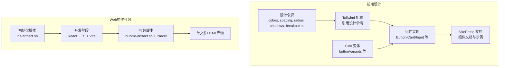
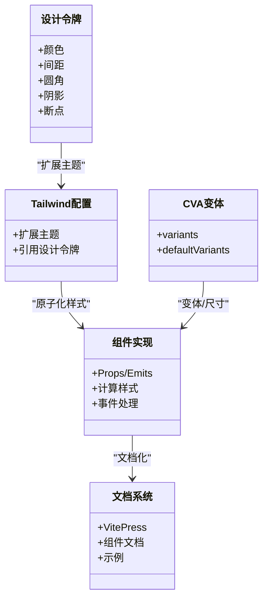
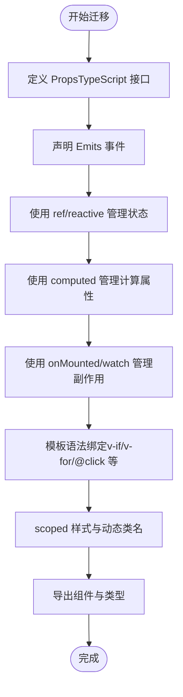
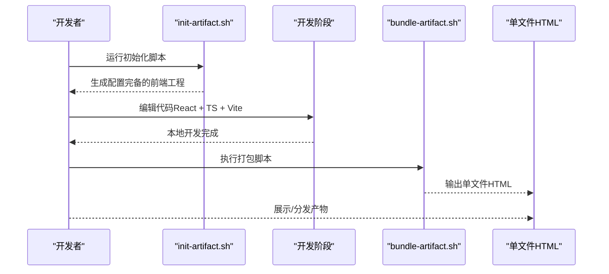
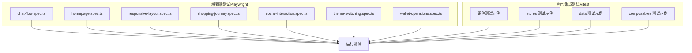
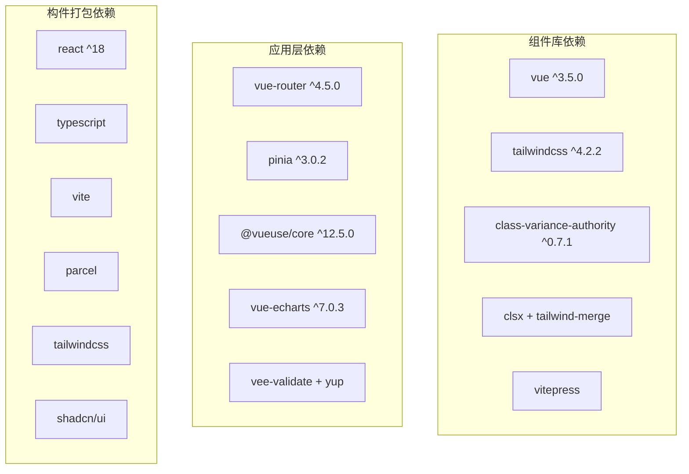

# Web开发技能

<cite>
**本文引用的文件**
- [VUE3组件开发指南.md](file://apps/AgentPit/docs/VUE3_COMPONENT_GUIDE.md)
- [组件库架构设计文档.md](file://apps/AgentPit/docs/COMPONENT_LIBRARY_ARCHITECTURE.md)
- [@agentpit/ui 说明文档.md](file://apps/AgentPit/packages/ui/README.md)
- [AgentPit 项目 package.json](file://apps/AgentPit/package.json)
- [AgentPit 项目 vite.config.ts](file://apps/AgentPit/vite.config.ts)
- [web-artifacts-builder 技能说明.md](file://skills/daoSkilLs/skills/anthropics-skills/skills/web-artifacts-builder/README.md)
- [webapp-testing 技能说明.md](file://skills/daoSkilLs/skills/anthropics-skills/skills/webapp-testing/README.md)
- [前端设计 技能说明.md](file://skills/daoSkilLs/skills/anthropics-skills/skills/frontend-design/README.md)
- [AgentPit e2e 聊天流程测试.spec.ts](file://apps/AgentPit/e2e/chat-flow.spec.ts)
- [AgentPit e2e 主页测试.spec.ts](file://apps/AgentPit/e2e/homepage.spec.ts)
- [AgentPit e2e 响应式布局测试.spec.ts](file://apps/AgentPit/e2e/responsive-layout.spec.ts)
- [AgentPit e2e 购物旅程测试.spec.ts](file://apps/AgentPit/e2e/shopping-journey.spec.ts)
- [AgentPit e2e 社交互动测试.spec.ts](file://apps/AgentPit/e2e/social-interaction.spec.ts)
- [AgentPit e2e 主题切换测试.spec.ts](file://apps/AgentPit/e2e/theme-switching.spec.ts)
- [AgentPit e2e 钱包操作测试.spec.ts](file://apps/AgentPit/e2e/wallet-operations.spec.ts)
- [AgentPit Playwright 配置.ts](file://apps/AgentPit/playwright.config.ts)
- [AgentPit Vitest 配置.ts](file://apps/AgentPit/vitest.config.ts)
- [AgentPit 测试环境设置.ts](file://apps/AgentPit/src/__tests__/integration/setup.ts)
- [AgentPit 单元测试示例（组件）](file://apps/AgentPit/src/__tests__/components/)
- [AgentPit 集成测试示例（store）](file://apps/AgentPit/src/__tests__/stores/)
- [AgentPit 集成测试示例（data）](file://apps/AgentPit/src/__tests__/data/)
- [AgentPit 集成测试示例（composables）](file://apps/AgentPit/src/__tests__/composables/)
- [AgentPit 构建验证报告.md](file://.trae/specs/project-retrospective/retrospective.md)
</cite>

## 目录
1. [简介](#简介)
2. [项目结构](#项目结构)
3. [核心组件](#核心组件)
4. [架构总览](#架构总览)
5. [详细组件分析](#详细组件分析)
6. [依赖关系分析](#依赖关系分析)
7. [性能考量](#性能考量)
8. [故障排查指南](#故障排查指南)
9. [结论](#结论)
10. [附录](#附录)

## 简介
本文件面向Web开发技能，聚焦以下能力域：
- Frontend Design（前端设计）：组件生成机制、设计令牌、样式系统、文档化与主题定制
- Web Artifacts Builder（Web构件打包）：前端构件初始化、打包与单文件输出、Parcel集成
- Web应用测试：端到端测试（Playwright）、单元/集成测试（Vitest）、静态HTML自动化方法
- 实践指南：开发模板、组件库使用、测试套件使用、构建与部署策略、最佳实践

## 项目结构
AgentPit作为多应用与组件库的聚合工程，包含：
- 应用层：AgentPit 主应用、DaoMind、config-center、forum、growth-tracker、habit-tracker、moodflow、oauth-admin、time-capsule、xinyu 等
- 组件库：@agentpit/ui（Vue3 + Tailwind CSS + VitePress 文档）
- 技能工具：frontend-design、web-artifacts-builder、webapp-testing（Anthropics Skills）

```mermaid
graph TB
subgraph "应用层"
AgentPit["AgentPit 应用"]
DaoMind["DaoMind 应用"]
ConfigCenter["Config Center 应用"]
Others["其他应用..."]
end
subgraph "组件库"
UI["@agentpit/ui<br/>Vue3 + Tailwind CSS + VitePress"]
end
subgraph "技能工具"
FD["frontend-design"]
WAB["web-artifacts-builder"]
WAT["webapp-testing"]
end
AgentPit --> UI
Others --> UI
FD --> AgentPit
WAB --> AgentPit
WAT --> AgentPit
```

**章节来源**
- [AgentPit 项目 package.json:1-74](file://apps/AgentPit/package.json#L1-L74)
- [AgentPit 项目 vite.config.ts:1-15](file://apps/AgentPit/vite.config.ts#L1-L15)
- [组件库架构设计文档.md:1-658](file://apps/AgentPit/docs/COMPONENT_LIBRARY_ARCHITECTURE.md#L1-L658)

## 核心组件
- 组件库架构与样式系统：基于设计令牌、Tailwind CSS、class-variance-authority（CVA）与类名合并工具，提供高复用、可维护、可扩展的组件体系
- 组件开发指南：Vue3 SFC 模板、React → Vue3 语法对照、代码规范与最佳实践
- 测试体系：Playwright 端到端测试、Vitest 单元/集成测试、测试环境与覆盖率配置
- 构件打包：React + Vite + Parcel 的单文件HTML输出流程

**章节来源**
- [组件库架构设计文档.md:1-658](file://apps/AgentPit/docs/COMPONENT_LIBRARY_ARCHITECTURE.md#L1-L658)
- [VUE3组件开发指南.md:1-1229](file://apps/AgentPit/docs/VUE3_COMPONENT_GUIDE.md#L1-L1229)
- [AgentPit 项目 package.json:1-74](file://apps/AgentPit/package.json#L1-L74)
- [web-artifacts-builder 技能说明.md:1-43](file://skills/daoSkilLs/skills/anthropics-skills/skills/web-artifacts-builder/README.md#L1-L43)

## 架构总览
前端设计与组件生成机制围绕“设计令牌 → Tailwind 配置 → CVA 变体 → 组件实现 → 文档化”的闭环展开；Web构件打包采用“初始化 → 开发 → 打包为单文件HTML”的流水线。

**图表来源**
- [组件库架构设计文档.md:142-241](file://apps/AgentPit/docs/COMPONENT_LIBRARY_ARCHITECTURE.md#L142-L241)
- [组件库架构设计文档.md:308-384](file://apps/AgentPit/docs/COMPONENT_LIBRARY_ARCHITECTURE.md#L308-L384)
- [web-artifacts-builder 技能说明.md:9-43](file://skills/daoSkilLs/skills/anthropics-skills/skills/web-artifacts-builder/README.md#L9-L43)

**章节来源**
- [组件库架构设计文档.md:142-241](file://apps/AgentPit/docs/COMPONENT_LIBRARY_ARCHITECTURE.md#L142-L241)
- [组件库架构设计文档.md:308-384](file://apps/AgentPit/docs/COMPONENT_LIBRARY_ARCHITECTURE.md#L308-L384)
- [web-artifacts-builder 技能说明.md:9-43](file://skills/daoSkilLs/skills/anthropics-skills/skills/web-artifacts-builder/README.md#L9-L43)

## 详细组件分析

### 组件库架构与样式系统
- 设计令牌：集中管理颜色、间距、圆角、阴影、断点等，统一主题与视觉语言
- Tailwind 配置：将设计令牌扩展到 Tailwind 主题，实现原子化样式
- CVA 变体：通过 class-variance-authority 管理组件变体与尺寸，结合 cn 工具合并类名
- 组件导出：组件、类型、工具、样式统一通过入口导出，支持按需引入与样式注入
- 文档化：VitePress 文档系统，提供安装、主题定制、组件使用与 API 参考

**图表来源**
- [组件库架构设计文档.md:144-241](file://apps/AgentPit/docs/COMPONENT_LIBRARY_ARCHITECTURE.md#L144-L241)
- [组件库架构设计文档.md:308-384](file://apps/AgentPit/docs/COMPONENT_LIBRARY_ARCHITECTURE.md#L308-L384)

**章节来源**
- [组件库架构设计文档.md:142-241](file://apps/AgentPit/docs/COMPONENT_LIBRARY_ARCHITECTURE.md#L142-L241)
- [组件库架构设计文档.md:244-305](file://apps/AgentPit/docs/COMPONENT_LIBRARY_ARCHITECTURE.md#L244-L305)
- [组件库架构设计文档.md:308-384](file://apps/AgentPit/docs/COMPONENT_LIBRARY_ARCHITECTURE.md#L308-L384)
- [@agentpit/ui 说明文档.md:1-31](file://apps/AgentPit/packages/ui/README.md#L1-L31)

### Vue3 组件开发指南
- SFC 模板：标准组件结构（template/script/style），页面级组件模板
- 语法对照：React → Vue3 的状态、副作用、计算属性、路由导航等映射
- 代码规范：文件命名、组件编写、导入路径、目录结构、性能优化与错误处理
- 迁移示例：ModuleCard 组件的 React → Vue3 迁移过程

**图表来源**
- [VUE3组件开发指南.md:21-301](file://apps/AgentPit/docs/VUE3_COMPONENT_GUIDE.md#L21-L301)

**章节来源**
- [VUE3组件开发指南.md:21-301](file://apps/AgentPit/docs/VUE3_COMPONENT_GUIDE.md#L21-L301)
- [VUE3组件开发指南.md:305-490](file://apps/AgentPit/docs/VUE3_COMPONENT_GUIDE.md#L305-L490)
- [VUE3组件开发指南.md:493-667](file://apps/AgentPit/docs/VUE3_COMPONENT_GUIDE.md#L493-L667)
- [VUE3组件开发指南.md:671-800](file://apps/AgentPit/docs/VUE3_COMPONENT_GUIDE.md#L671-L800)

### Web Artifacts Builder（Web构件打包）
- 初始化：使用 init-artifact.sh 创建 React + TypeScript + Vite + Tailwind + shadcn/ui + Parcel 的完整工程
- 开发：在生成的工程中进行状态管理、路由与组件开发
- 打包：使用 bundle-artifact.sh 将代码打包为单文件HTML，便于展示与交付
- 流程：初始化 → 开发 → 打包 → 展示（可选测试）

**图表来源**
- [web-artifacts-builder 技能说明.md:9-43](file://skills/daoSkilLs/skills/anthropics-skills/skills/web-artifacts-builder/README.md#L9-L43)

**章节来源**
- [web-artifacts-builder 技能说明.md:1-43](file://skills/daoSkilLs/skills/anthropics-skills/skills/web-artifacts-builder/README.md#L1-L43)

### Web 应用测试（自动化脚本与静态HTML自动化）
- 端到端测试（Playwright）：覆盖聊天流程、主页、响应式布局、购物旅程、社交互动、主题切换、钱包操作等场景
- 单元/集成测试（Vitest）：组件、composables、stores、data 的测试示例与配置
- 静态HTML自动化：通过 Playwright 驱动浏览器访问静态HTML页面，验证交互与渲染

**图表来源**
- [AgentPit e2e 聊天流程测试.spec.ts](file://apps/AgentPit/e2e/chat-flow.spec.ts)
- [AgentPit e2e 主页测试.spec.ts](file://apps/AgentPit/e2e/homepage.spec.ts)
- [AgentPit e2e 响应式布局测试.spec.ts](file://apps/AgentPit/e2e/responsive-layout.spec.ts)
- [AgentPit e2e 购物旅程测试.spec.ts](file://apps/AgentPit/e2e/shopping-journey.spec.ts)
- [AgentPit e2e 社交互动测试.spec.ts](file://apps/AgentPit/e2e/social-interaction.spec.ts)
- [AgentPit e2e 主题切换测试.spec.ts](file://apps/AgentPit/e2e/theme-switching.spec.ts)
- [AgentPit e2e 钱包操作测试.spec.ts](file://apps/AgentPit/e2e/wallet-operations.spec.ts)
- [AgentPit Vitest 配置.ts](file://apps/AgentPit/vitest.config.ts)
- [AgentPit 测试环境设置.ts](file://apps/AgentPit/src/__tests__/integration/setup.ts)

**章节来源**
- [AgentPit e2e 聊天流程测试.spec.ts](file://apps/AgentPit/e2e/chat-flow.spec.ts)
- [AgentPit e2e 主页测试.spec.ts](file://apps/AgentPit/e2e/homepage.spec.ts)
- [AgentPit e2e 响应式布局测试.spec.ts](file://apps/AgentPit/e2e/responsive-layout.spec.ts)
- [AgentPit e2e 购物旅程测试.spec.ts](file://apps/AgentPit/e2e/shopping-journey.spec.ts)
- [AgentPit e2e 社交互动测试.spec.ts](file://apps/AgentPit/e2e/social-interaction.spec.ts)
- [AgentPit e2e 主题切换测试.spec.ts](file://apps/AgentPit/e2e/theme-switching.spec.ts)
- [AgentPit e2e 钱包操作测试.spec.ts](file://apps/AgentPit/e2e/wallet-operations.spec.ts)
- [AgentPit Playwright 配置.ts](file://apps/AgentPit/playwright.config.ts)
- [AgentPit Vitest 配置.ts](file://apps/AgentPit/vitest.config.ts)
- [AgentPit 测试环境设置.ts](file://apps/AgentPit/src/__tests__/integration/setup.ts)
- [AgentPit 单元测试示例（组件）](file://apps/AgentPit/src/__tests__/components/)
- [AgentPit 集成测试示例（store）](file://apps/AgentPit/src/__tests__/stores/)
- [AgentPit 集成测试示例（data）](file://apps/AgentPit/src/__tests__/data/)
- [AgentPit 集成测试示例（composables）](file://apps/AgentPit/src/__tests__/composables/)

## 依赖关系分析
- 组件库依赖：Vue3、Tailwind CSS 4.x、class-variance-authority、clsx + tailwind-merge、VitePress
- 应用层依赖：Vue3、Vue Router、Pinia、Tailwind CSS 4.x、@vueuse、vee-validate、yup、echarts 等
- 构件打包依赖：React 18 + TypeScript + Vite + Parcel（bundling）+ Tailwind CSS + shadcn/ui

**图表来源**
- [组件库架构设计文档.md:15-25](file://apps/AgentPit/docs/COMPONENT_LIBRARY_ARCHITECTURE.md#L15-L25)
- [AgentPit 项目 package.json:20-40](file://apps/AgentPit/package.json#L20-L40)
- [web-artifacts-builder 技能说明.md:16](file://skills/daoSkilLs/skills/anthropics-skills/skills/web-artifacts-builder/README.md#L16)

**章节来源**
- [组件库架构设计文档.md:15-25](file://apps/AgentPit/docs/COMPONENT_LIBRARY_ARCHITECTURE.md#L15-L25)
- [AgentPit 项目 package.json:20-40](file://apps/AgentPit/package.json#L20-L40)
- [web-artifacts-builder 技能说明.md:16](file://skills/daoSkilLs/skills/anthropics-skills/skills/web-artifacts-builder/README.md#L16)

## 性能考量
- 构建性能：构建耗时主要集中在 Vue 插件与 CSS 处理，建议启用并行与缓存、减少不必要的样式体量
- 样式体积：Tailwind CSS 4.x 与设计令牌扩展带来较大样式体积，建议按需引入与摇树优化
- 组件渲染：使用 computed 缓存计算结果、watch 深度监听控制在必要范围内
- 打包体积：Web 构件打包建议移除开发依赖、压缩静态资源、拆分异步模块

**章节来源**
- [AgentPit 构建验证报告.md:86-160](file://.trae/specs/project-retrospective/retrospective.md#L86-L160)

## 故障排查指南
- 组件样式冲突：确认使用 scoped 样式与动态类名合并工具，避免全局污染
- 类型错误：检查 Props/Emits 的 TypeScript 定义与默认值，确保类型安全
- 测试失败：核对 Vitest/Playwright 配置、测试环境设置与快照差异
- 构件打包异常：检查 Parcel 配置、Node 版本与依赖版本匹配

**章节来源**
- [组件库架构设计文档.md:575-631](file://apps/AgentPit/docs/COMPONENT_LIBRARY_ARCHITECTURE.md#L575-L631)
- [VUE3组件开发指南.md:493-667](file://apps/AgentPit/docs/VUE3_COMPONENT_GUIDE.md#L493-L667)
- [AgentPit Vitest 配置.ts](file://apps/AgentPit/vitest.config.ts)
- [AgentPit 测试环境设置.ts](file://apps/AgentPit/src/__tests__/integration/setup.ts)

## 结论
本技能文档系统性梳理了前端设计工具与组件生成机制、Web构件打包与初始化脚本、以及Web应用测试的自动化方法。通过设计令牌驱动的样式系统、Vue3 组件开发规范、Playwright 与 Vitest 测试体系，以及 React + Parcel 的单文件HTML输出流程，能够支撑复杂前端构件的高效开发与交付。

## 附录
- 使用指南
  - 组件库使用：安装包、导入组件与样式、主题定制与文档查阅
  - 组件开发：遵循 SFC 模板、Props/Emits 类型定义、生命周期与计算属性
  - 测试套件：Playwright 场景覆盖与 Vitest 单元/集成测试
  - 构件打包：初始化工程、开发迭代、打包为单文件HTML
- 最佳实践
  - 高复用性：单一职责、组合式函数抽取、变体与尺寸管理
  - 可维护性：清晰目录结构、完整类型定义、组件文档化
  - 可扩展性：主题定制、插槽扩展、类名覆盖
  - 性能优化：computed 缓存、防抖/节流、按需引入与摇树优化

**章节来源**
- [@agentpit/ui 说明文档.md:1-31](file://apps/AgentPit/packages/ui/README.md#L1-L31)
- [组件库架构设计文档.md:494-583](file://apps/AgentPit/docs/COMPONENT_LIBRARY_ARCHITECTURE.md#L494-L583)
- [VUE3组件开发指南.md:575-667](file://apps/AgentPit/docs/VUE3_COMPONENT_GUIDE.md#L575-L667)
- [web-artifacts-builder 技能说明.md:9-43](file://skills/daoSkilLs/skills/anthropics-skills/skills/web-artifacts-builder/README.md#L9-L43)