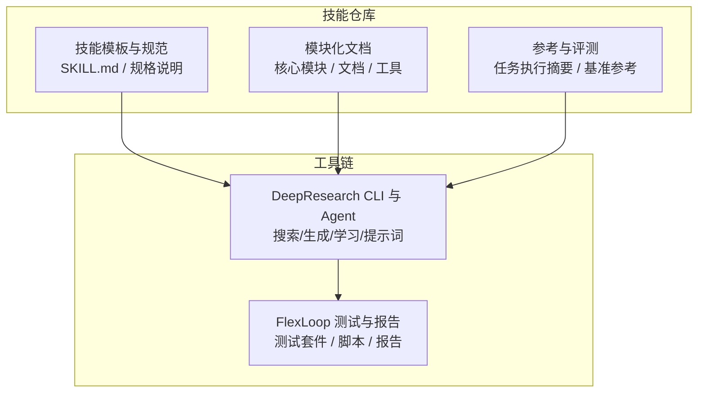
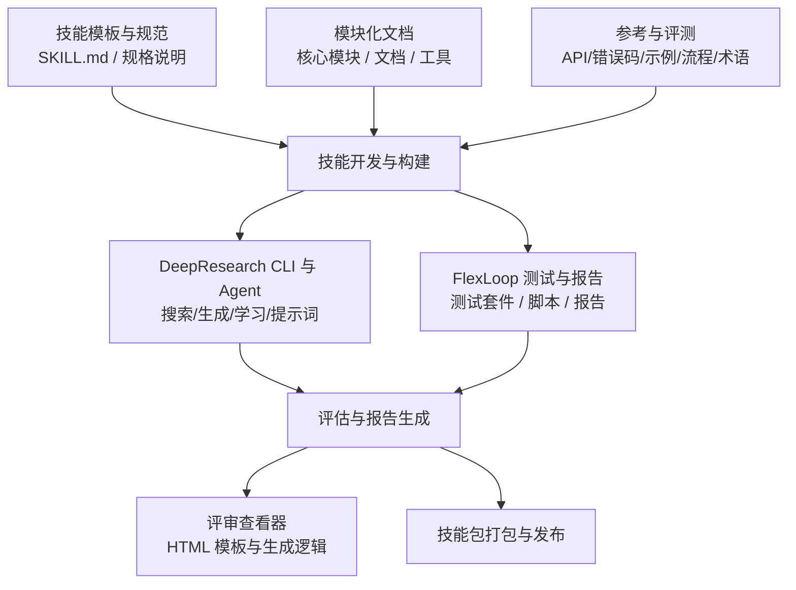
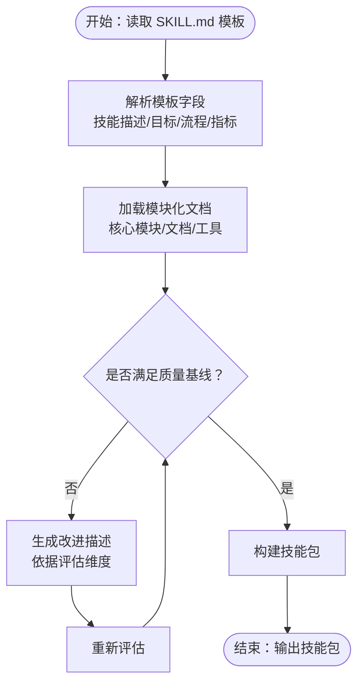
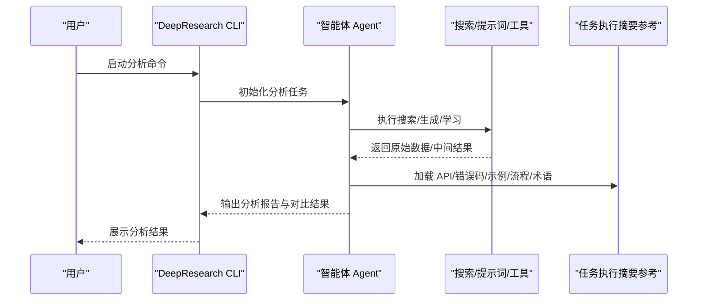
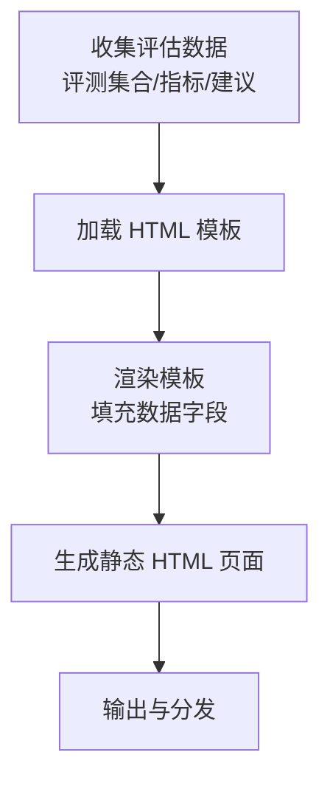
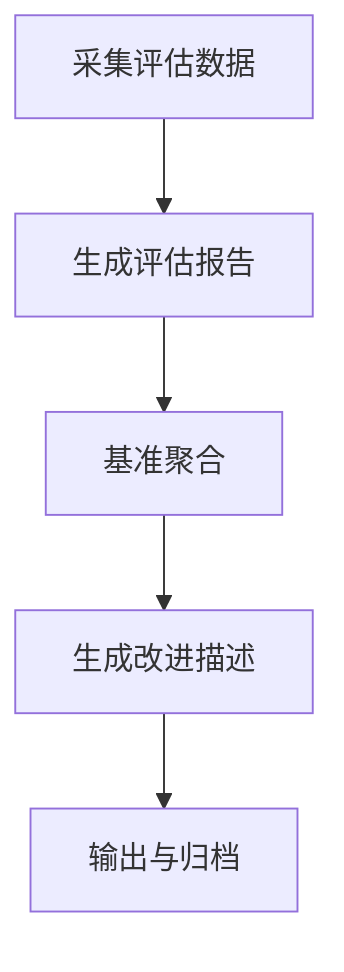
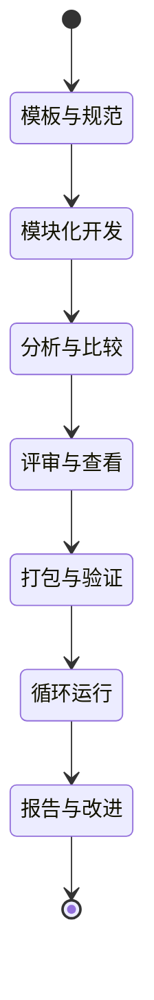
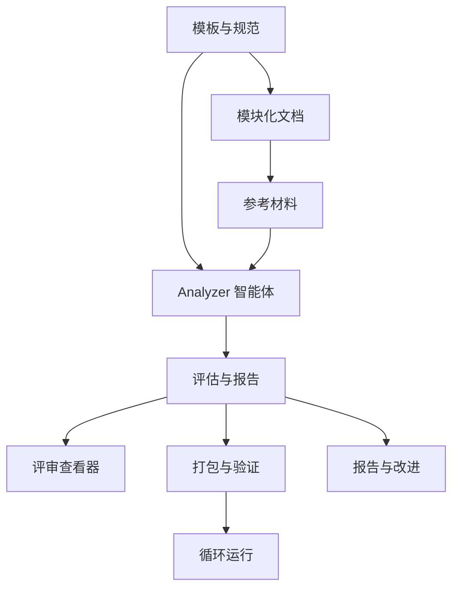

# 技能创建框架

<cite>
**本文档引用的文件**
- [SKILL.md](file://skills/daoSkilLs/skills/anthropics-skills/SKILL.md)
- [README.md](file://skills/daoSkilLs/skills/anthropics-skills/README.md)
- [agent-skills-spec.md](file://skills/daoSkilLs/skills/anthropics-skills/spec/agent-skills-spec.md)
- [SKILL.md](file://skills/daoSkilLs/skills/alipay-payment-integration/SKILL.md)
- [decision-tree.md](file://skills/daoSkilLs/skills/alipay-payment-integration/modules/core/decision-tree.md)
- [environment.md](file://skills/daoSkilLs/skills/alipay-payment-integration/modules/core/environment.md)
- [integration-process.md](file://skills/daoSkilLs/skills/alipay-payment-integration/modules/core/integration-process.md)
- [routing-table.md](file://skills/daoSkilLs/skills/alipay-payment-integration/modules/core/routing-table.md)
- [security-guidelines.md](file://skills/daoSkilLs/skills/alipay-payment-integration/modules/core/security-guidelines.md)
- [optimization-comparison-report.md](file://skills/daoSkilLs/skills/alipay-payment-integration/modules/docs/optimization-comparison-report.md)
- [performance-analysis.md](file://skills/daoSkilLs/skills/alipay-payment-integration/modules/docs/performance-analysis.md)
- [performance-test-report.md](file://skills/daoSkilLs/skills/alipay-payment-integration/modules/docs/performance-test-report.md)
- [testing-plan.md](file://skills/daoSkilLs/skills/alipay-payment-integration/modules/docs/testing-plan.md)
- [cache-implementation.md](file://skills/daoSkilLs/skills/alipay-payment-integration/modules/utils/cache-implementation.md)
- [document-access.md](file://skills/daoSkilLs/skills/alipay-payment-integration/modules/utils/document-access.md)
- [error-handling-implementation.md](file://skills/daoSkilLs/skills/alipay-payment-integration/modules/utils/error-handling-implementation.md)
- [claude-plugin/marketplace.json](file://skills/daoSkilLs/skills/anthropics-skills/.claude-plugin/marketplace.json)
- [task-execution-summary/references/api-reference.md](file://skills/daoSkilLs/skills/task-execution-summary/references/api-reference.md)
- [task-execution-summary/references/error-codes.md](file://skills/daoSkilLs/skills/task-execution-summary/references/error-codes.md)
- [task-execution-summary/references/examples-v2.md](file://skills/daoSkilLs/skills/task-execution-summary/references/examples-v2.md)
- [task-execution-summary/references/execution-flow.md](file://skills/daoSkilLs/skills/task-execution-summary/references/execution-flow.md)
- [task-execution-summary/references/terminology.md](file://skills/daoSkilLs/skills/task-execution-summary/references/terminology.md)
- [task-execution-summary/evals/](file://skills/daoSkilLs/skills/task-execution-summary/evals/)
- [tools/flexloop/scripts/check_file_size.py](file://tools/flexloop/scripts/check_file_size.py)
- [tools/flexloop/tests/testing/test_analytics/](file://tools/flexloop/tests/testing/test_analytics/)
- [tools/flexloop/tests/testing/test_auth/](file://tools/flexloop/tests/testing/test_auth/)
- [tools/flexloop/tests/testing/test_config_center/](file://tools/flexloop/tests/testing/test_config_center/)
- [tools/flexloop/tests/testing/test_data_sync/](file://tools/flexloop/tests/testing/test_data_sync/)
- [tools/flexloop/tests/testing/test_email_service/](file://tools/flexloop/tests/testing/test_email_service/)
- [tools/flexloop/tests/testing/test_file_storage/](file://tools/flexloop/tests/testing/test_file_storage/)
- [tools/flexloop/tests/testing/test_multi_agent/](file://tools/flexloop/tests/testing/test_multi_agent/)
- [tools/flexloop/tests/testing/test_oauth/](file://tools/flexloop/tests/testing/test_oauth/)
- [tools/flexloop/tests/testing/test_rate_limiter/](file://tools/flexloop/tests/testing/test_rate_limiter/)
- [tools/flexloop/tests/testing/test_task_queue/](file://tools/flexloop/tests/testing/test_task_queue/)
- [tools/DeepResearch/src/deepresearch/cli/__main__.py](file://tools/DeepResearch/src/deepresearch/cli/__main__.py)
- [tools/DeepResearch/src/deepresearch/cli/ui.py](file://tools/DeepResearch/src/deepresearch/cli/ui.py)
- [tools/DeepResearch/src/deepresearch/cli/config.py](file://tools/DeepResearch/src/deepresearch/cli/config.py)
- [tools/DeepResearch/src/deepresearch/cli/history.py](file://tools/DeepResearch/src/deepresearch/cli/history.py)
- [tools/DeepResearch/src/deepresearch/cli/utils.py](file://tools/DeepResearch/src/deepresearch/cli/utils.py)
- [tools/DeepResearch/src/deepresearch/agent/agent.py](file://tools/DeepResearch/src/deepresearch/agent/agent.py)
- [tools/DeepResearch/src/deepresearch/agent/deepsearch.py](file://tools/DeepResearch/src/deepresearch/agent/deepsearch.py)
- [tools/DeepResearch/src/deepresearch/agent/generate.py](file://tools/DeepResearch/src/deepresearch/agent/generate.py)
- [tools/DeepResearch/src/deepresearch/agent/learning.py](file://tools/DeepResearch/src/deepresearch/agent/learning.py)
- [tools/DeepResearch/src/deepresearch/agent/message.py](file://tools/DeepResearch/src/deepresearch/agent/message.py)
- [tools/DeepResearch/src/deepresearch/agent/outline.py](file://tools/DeepResearch/src/deepresearch/agent/outline.py)
- [tools/DeepResearch/src/deepresearch/agent/prep.py](file://tools/DeepResearch/src/deepresearch/agent/prep.py)
- [tools/DeepResearch/src/deepresearch/tools/search.py](file://tools/DeepResearch/src/deepresearch/tools/search.py)
- [tools/DeepResearch/src/deepresearch/tools/_search.py](file://tools/DeepResearch/src/deepresearch/tools/_search.py)
- [tools/DeepResearch/src/deepresearch/tools/_jina.py](file://tools/DeepResearch/src/deepresearch/tools/_jina.py)
- [tools/DeepResearch/src/deepresearch/tools/_jina_mcp.py](file://tools/DeepResearch/src/deepresearch/tools/_jina_mcp.py)
- [tools/DeepResearch/src/deepresearch/tools/md2html.py](file://tools/DeepResearch/src/deepresearch/tools/md2html.py)
- [tools/DeepResearch/src/deepresearch/prompts/template.py](file://tools/DeepResearch/src/deepresearch/prompts/template.py)
- [tools/DeepResearch/src/deepresearch/prompts/generate/](file://tools/DeepResearch/src/deepresearch/prompts/generate/)
- [tools/DeepResearch/src/deepresearch/prompts/learning/](file://tools/DeepResearch/src/deepresearch/prompts/learning/)
- [tools/DeepResearch/src/deepresearch/prompts/prep/](file://tools/DeepResearch/src/deepresearch/prompts/prep/)
- [tools/DeepResearch/src/deepresearch/config/workflow_config.py](file://tools/DeepResearch/src/deepresearch/config/workflow_config.py)
- [tools/DeepResearch/src/deepresearch/config/llms_config.py](file://tools/DeepResearch/src/deepresearch/config/llms_config.py)
- [tools/DeepResearch/src/deepresearch/config/search_config.py](file://tools/DeepResearch/src/deepresearch/config/search_config.py)
- [tools/DeepResearch/src/deepresearch/config/base.py](file://tools/DeepResearch/src/deepresearch/config/base.py)
- [tools/DeepResearch/src/deepresearch/data/category.py](file://tools/DeepResearch/src/deepresearch/data/category.py)
- [tools/DeepResearch/src/deepresearch/llms/llm.py](file://tools/DeepResearch/src/deepresearch/llms/llm.py)
- [tools/DeepResearch/src/deepresearch/mcp_client/paper_mcp_server.py](file://tools/DeepResearch/src/deepresearch/mcp_client/paper_mcp_server.py)
- [tools/DeepResearch/src/deepresearch/mcp_client/arxiv.py](file://tools/DeepResearch/src/deepresearch/mcp_client/arxiv.py)
- [tools/DeepResearch/src/deepresearch/mcp_client/pubmed.py](file://tools/DeepResearch/src/deepresearch/mcp_client/pubmed.py)
- [tools/DeepResearch/src/deepresearch/utils/print_util.py](file://tools/DeepResearch/src/deepresearch/utils/print_util.py)
- [tools/DeepResearch/src/deepresearch/utils/parse_model_res.py](file://tools/DeepResearch/src/deepresearch/utils/parse_model_res.py)
- [tools/DeepResearch/doc/assessment_report.md](file://tools/DeepResearch/doc/assessment_report.md)
- [tools/DeepResearch/doc/CONTENT_ANALYSIS_REPORT.md](file://tools/DeepResearch/doc/CONTENT_ANALYSIS_REPORT.md)
- [tools/DeepResearch/doc/index.rst](file://tools/DeepResearch/doc/index.rst)
- [tools/DeepResearch/doc/conf.py](file://tools/DeepResearch/doc/conf.py)
- [tools/DeepResearch/doc/intro.md](file://tools/DeepResearch/doc/intro.md)
- [tools/DeepResearch/doc/api/auto_api.md](file://tools/DeepResearch/doc/api/auto_api.md)
- [tools/DeepResearch/doc/architecture/architecture.md](file://tools/DeepResearch/doc/architecture/architecture.md)
- [tools/DeepResearch/doc/user_guide/user_guide.md](file://tools/DeepResearch/doc/user_guide/user_guide.md)
- [tools/DeepResearch/doc/releases/release_notes.md](file://tools/DeepResearch/doc/releases/release_notes.md)
- [tools/DeepResearch/doc/contributing/documentation_guidelines.md](file://tools/DeepResearch/doc/contributing/documentation_guidelines.md)
- [tools/DeepResearch/doc/deployment/deployment.md](file://tools/DeepResearch/doc/deployment/deployment.md)
- [tools/DeepResearch/pyproject.toml](file://tools/DeepResearch/pyproject.toml)
- [tools/DeepResearch/tasks.py](file://tools/DeepResearch/tasks.py)
- [tools/DeepResearch/CONTRIBUTING.md](file://tools/DeepResearch/CONTRIBUTING.md)
- [tools/DeepResearch/CLAUDE.md](file://tools/DeepResearch/CLAUDE.md)
- [tools/DeepResearch/CMakeLists.txt](file://tools/DeepResearch/CMakeLists.txt)
- [tools/DeepResearch/tests/performance_analysis.py](file://tools/DeepResearch/tests/performance_analysis.py)
- [tools/DeepResearch/tests/e2e/test_e2e.py](file://tools/DeepResearch/tests/e2e/test_e2e.py)
- [tools/DeepResearch/tests/integration/test_cli_integration.py](file://tools/DeepResearch/tests/integration/test_cli_integration.py)
- [tools/DeepResearch/tests/integration/test_integration.py](file://tools/DeepResearch/tests/integration/test_integration.py)
- [tools/DeepResearch/tests/unit/](file://tools/DeepResearch/tests/unit/)
- [tools/DeepResearch/tests/utils/testing_guidelines.md](file://tools/DeepResearch/tests/utils/testing_guidelines.md)
- [tools/flexloop/README.md](file://tools/flexloop/README.md)
- [tools/flexloop/pyproject.toml](file://tools/flexloop/pyproject.toml)
- [tools/flexloop/tasks.py](file://tools/flexloop/tasks.py)
- [tools/flexloop/AGENTS.md](file://tools/flexloop/AGENTS.md)
- [tools/flexloop/pytest.ini](file://tools/flexloop/pytest.ini)
- [tools/flexloop/testing.md](file://tools/flexloop/testing.md)
- [tools/flexloop/doc/conf.py](file://tools/flexloop/doc/conf.py)
- [tools/flexloop/doc/_config.toml](file://tools/flexloop/doc/_config.toml)
- [tools/flexloop/doc/index.md](file://tools/flexloop/doc/index.md)
- [tools/flexloop/doc/scripts/](file://tools/flexloop/doc/scripts/)
- [tools/flexloop/reports/TEST_REPORT.md](file://tools/flexloop/reports/TEST_REPORT.md)
- [tools/flexloop/examples/multi_agent_example.py](file://tools/flexloop/examples/multi_agent_example.py)
- [tools/flexloop/src/taolib/__init__.py](file://tools/flexloop/src/taolib/__init__.y)
</cite>

## 目录
1. [简介](#简介)
2. [项目结构](#项目结构)
3. [核心组件](#核心组件)
4. [架构总览](#架构总览)
5. [详细组件分析](#详细组件分析)
6. [依赖关系分析](#依赖关系分析)
7. [性能考虑](#性能考虑)
8. [故障排除指南](#故障排除指南)
9. [结论](#结论)
10. [附录](#附录)

## 简介
本技术文档围绕“技能创建框架”展开，系统性阐述技能开发工具集与评估体系，重点覆盖以下方面：
- Skill Creator（技能创建）：技能模板、模块化设计、开发规范与最佳实践
- Analyzer 智能体：技能分析与比较能力，支持多维度评估与对比
- Eval Viewer 评审查看器：HTML 模板与生成逻辑，用于展示评估结果
- 技能包打包、快速验证与循环运行：自动化脚本与流水线
- 评估报告生成、基准聚合与改进描述：自动化流程与输出
- 技能开发完整工作流与质量保证方法：从模板到评审的全流程

本框架以技能仓库中的标准模板与规范为基础，结合工具链中的 CLI、Agent、测试与文档体系，形成可复用、可扩展、可评估的技能开发与评审闭环。

## 项目结构
技能创建框架由两大部分组成：
- 技能仓库（skills/daoSkilLs）：提供技能模板、规范、模块化文档与参考材料
- 工具链（tools/DeepResearch、tools/flexloop）：提供 CLI、智能体、测试与文档生成工具，支撑技能开发与评估



图示来源
- [SKILL.md:1-200](file://skills/daoSkilLs/skills/anthropics-skills/SKILL.md#L1-L200)
- [agent-skills-spec.md:1-200](file://skills/daoSkilLs/skills/anthropics-skills/spec/agent-skills-spec.md#L1-L200)
- [README.md:1-200](file://skills/daoSkilLs/skills/anthropics-skills/README.md#L1-L200)
- [task-execution-summary/references/](file://skills/daoSkilLs/skills/task-execution-summary/references/)
- [tools/DeepResearch/src/deepresearch/cli/__main__.py:1-200](file://tools/DeepResearch/src/deepresearch/cli/__main__.py#L1-L200)
- [tools/flexloop/README.md:1-200](file://tools/flexloop/README.md#L1-L200)

章节来源
- [SKILL.md:1-200](file://skills/daoSkilLs/skills/anthropics-skills/SKILL.md#L1-L200)
- [agent-skills-spec.md:1-200](file://skills/daoSkilLs/skills/anthropics-skills/spec/agent-skills-spec.md#L1-L200)
- [README.md:1-200](file://skills/daoSkilLs/skills/anthropics-skills/README.md#L1-L200)
- [task-execution-summary/references/](file://skills/daoSkilLs/skills/task-execution-summary/references/)
- [tools/DeepResearch/src/deepresearch/cli/__main__.py:1-200](file://tools/DeepResearch/src/deepresearch/cli/__main__.py#L1-L200)
- [tools/flexloop/README.md:1-200](file://tools/flexloop/README.md#L1-L200)

## 核心组件
- 技能模板与规范：提供标准化的 SKILL.md 模板、技能规格说明与市场接入配置，确保技能开发的一致性与可审计性
- 模块化文档：核心模块（决策树、环境、集成流程、路由表、安全指南）、文档（优化对比、性能分析、测试计划）、工具（缓存、文档访问、错误处理）
- 参考与评测：任务执行摘要的 API 参考、错误码、示例、执行流程与术语，以及评测集合
- DeepResearch CLI 与 Agent：提供搜索、生成、学习、提示词工程与 MCP 客户端能力，支撑技能分析与报告生成
- FlexLoop 测试与报告：提供测试套件、脚本与报告，支撑技能包的快速验证与循环运行

章节来源
- [SKILL.md:1-200](file://skills/daoSkilLs/skills/anthropics-skills/SKILL.md#L1-L200)
- [decision-tree.md:1-200](file://skills/daoSkilLs/skills/alipay-payment-integration/modules/core/decision-tree.md#L1-L200)
- [environment.md:1-200](file://skills/daoSkilLs/skills/alipay-payment-integration/modules/core/environment.md#L1-L200)
- [integration-process.md:1-200](file://skills/daoSkilLs/skills/alipay-payment-integration/modules/core/integration-process.md#L1-L200)
- [routing-table.md:1-200](file://skills/daoSkilLs/skills/alipay-payment-integration/modules/core/routing-table.md#L1-L200)
- [security-guidelines.md:1-200](file://skills/daoSkilLs/skills/alipay-payment-integration/modules/core/security-guidelines.md#L1-L200)
- [optimization-comparison-report.md:1-200](file://skills/daoSkilLs/skills/alipay-payment-integration/modules/docs/optimization-comparison-report.md#L1-L200)
- [performance-analysis.md:1-200](file://skills/daoSkilLs/skills/alipay-payment-integration/modules/docs/performance-analysis.md#L1-L200)
- [performance-test-report.md:1-200](file://skills/daoSkilLs/skills/alipay-payment-integration/modules/docs/performance-test-report.md#L1-L200)
- [testing-plan.md:1-200](file://skills/daoSkilLs/skills/alipay-payment-integration/modules/docs/testing-plan.md#L1-L200)
- [cache-implementation.md:1-200](file://skills/daoSkilLs/skills/alipay-payment-integration/modules/utils/cache-implementation.md#L1-L200)
- [document-access.md:1-200](file://skills/daoSkilLs/skills/alipay-payment-integration/modules/utils/document-access.md#L1-L200)
- [error-handling-implementation.md:1-200](file://skills/daoSkilLs/skills/alipay-payment-integration/modules/utils/error-handling-implementation.md#L1-L200)
- [task-execution-summary/references/api-reference.md:1-200](file://skills/daoSkilLs/skills/task-execution-summary/references/api-reference.md#L1-L200)
- [task-execution-summary/references/error-codes.md:1-200](file://skills/daoSkilLs/skills/task-execution-summary/references/error-codes.md#L1-L200)
- [task-execution-summary/references/examples-v2.md:1-200](file://skills/daoSkilLs/skills/task-execution-summary/references/examples-v2.md#L1-L200)
- [task-execution-summary/references/execution-flow.md:1-200](file://skills/daoSkilLs/skills/task-execution-summary/references/execution-flow.md#L1-L200)
- [task-execution-summary/references/terminology.md:1-200](file://skills/daoSkilLs/skills/task-execution-summary/references/terminology.md#L1-L200)
- [task-execution-summary/evals/](file://skills/daoSkilLs/skills/task-execution-summary/evals/)
- [tools/DeepResearch/src/deepresearch/cli/__main__.py:1-200](file://tools/DeepResearch/src/deepresearch/cli/__main__.py#L1-L200)
- [tools/flexloop/README.md:1-200](file://tools/flexloop/README.md#L1-L200)

## 架构总览
技能创建框架采用“模板驱动 + 工具链增强”的双轨架构：
- 模板驱动：通过 SKILL.md 与模块化文档，定义技能的结构、流程与质量基线
- 工具链增强：通过 DeepResearch 的智能体与 CLI，完成信息检索、内容生成、评估与报告；通过 FlexLoop 的测试与脚本，完成技能包的验证与循环运行



图示来源
- [SKILL.md:1-200](file://skills/daoSkilLs/skills/anthropics-skills/SKILL.md#L1-L200)
- [agent-skills-spec.md:1-200](file://skills/daoSkilLs/skills/anthropics-skills/spec/agent-skills-spec.md#L1-L200)
- [tools/DeepResearch/src/deepresearch/cli/__main__.py:1-200](file://tools/DeepResearch/src/deepresearch/cli/__main__.py#L1-L200)
- [tools/flexloop/README.md:1-200](file://tools/flexloop/README.md#L1-L200)

## 详细组件分析

### 组件一：Skill Creator 技能开发工具集与评估系统
Skill Creator 以 SKILL.md 为核心模板，配合模块化文档与规范，形成标准化的技能开发流程。其关键要素包括：
- 标准化模板：SKILL.md 提供技能描述、目标、输入输出、前置条件、执行流程、质量指标等结构化字段
- 模块化设计：核心模块（决策树、环境、集成流程、路由表、安全指南）与文档（优化对比、性能分析、测试计划）、工具（缓存、文档访问、错误处理）协同工作
- 评估系统：基于任务执行摘要的 API 参考、错误码、示例、执行流程与术语，形成可量化的评估维度



图示来源
- [SKILL.md:1-200](file://skills/daoSkilLs/skills/anthropics-skills/SKILL.md#L1-L200)
- [decision-tree.md:1-200](file://skills/daoSkilLs/skills/alipay-payment-integration/modules/core/decision-tree.md#L1-L200)
- [performance-analysis.md:1-200](file://skills/daoSkilLs/skills/alipay-payment-integration/modules/docs/performance-analysis.md#L1-L200)
- [testing-plan.md:1-200](file://skills/daoSkilLs/skills/alipay-payment-integration/modules/docs/testing-plan.md#L1-L200)

章节来源
- [SKILL.md:1-200](file://skills/daoSkilLs/skills/anthropics-skills/SKILL.md#L1-L200)
- [agent-skills-spec.md:1-200](file://skills/daoSkilLs/skills/anthropics-skills/spec/agent-skills-spec.md#L1-L200)
- [decision-tree.md:1-200](file://skills/daoSkilLs/skills/alipay-payment-integration/modules/core/decision-tree.md#L1-L200)
- [environment.md:1-200](file://skills/daoSkilLs/skills/alipay-payment-integration/modules/core/environment.md#L1-L200)
- [integration-process.md:1-200](file://skills/daoSkilLs/skills/alipay-payment-integration/modules/core/integration-process.md#L1-L200)
- [routing-table.md:1-200](file://skills/daoSkilLs/skills/alipay-payment-integration/modules/core/routing-table.md#L1-L200)
- [security-guidelines.md:1-200](file://skills/daoSkilLs/skills/alipay-payment-integration/modules/core/security-guidelines.md#L1-L200)
- [optimization-comparison-report.md:1-200](file://skills/daoSkilLs/skills/alipay-payment-integration/modules/docs/optimization-comparison-report.md#L1-L200)
- [performance-analysis.md:1-200](file://skills/daoSkilLs/skills/alipay-payment-integration/modules/docs/performance-analysis.md#L1-L200)
- [performance-test-report.md:1-200](file://skills/daoSkilLs/skills/alipay-payment-integration/modules/docs/performance-test-report.md#L1-L200)
- [testing-plan.md:1-200](file://skills/daoSkilLs/skills/alipay-payment-integration/modules/docs/testing-plan.md#L1-L200)
- [cache-implementation.md:1-200](file://skills/daoSkilLs/skills/alipay-payment-integration/modules/utils/cache-implementation.md#L1-L200)
- [document-access.md:1-200](file://skills/daoSkilLs/skills/alipay-payment-integration/modules/utils/document-access.md#L1-L200)
- [error-handling-implementation.md:1-200](file://skills/daoSkilLs/skills/alipay-payment-integration/modules/utils/error-handling-implementation.md#L1-L200)

### 组件二：Analyzer 智能体的技能分析与比较功能
Analyzer 智能体依托 DeepResearch 的 Agent 体系，具备以下能力：
- 搜索与检索：利用搜索工具与 MCP 客户端，从论文、ArXiv、PubMed 等来源获取高质量数据
- 内容生成与学习：基于提示词模板与学习模块，生成分析报告并进行知识提炼
- 评估与对比：结合任务执行摘要的 API 参考、错误码、示例、执行流程与术语，对多个技能进行量化对比



图示来源
- [tools/DeepResearch/src/deepresearch/cli/__main__.py:1-200](file://tools/DeepResearch/src/deepresearch/cli/__main__.py#L1-L200)
- [tools/DeepResearch/src/deepresearch/agent/agent.py:1-200](file://tools/DeepResearch/src/deepresearch/agent/agent.py#L1-L200)
- [tools/DeepResearch/src/deepresearch/agent/deepsearch.py:1-200](file://tools/DeepResearch/src/deepresearch/agent/deepsearch.py#L1-L200)
- [tools/DeepResearch/src/deepresearch/agent/generate.py:1-200](file://tools/DeepResearch/src/deepresearch/agent/generate.py#L1-L200)
- [tools/DeepResearch/src/deepresearch/agent/learning.py:1-200](file://tools/DeepResearch/src/deepresearch/agent/learning.py#L1-L200)
- [tools/DeepResearch/src/deepresearch/tools/search.py:1-200](file://tools/DeepResearch/src/deepresearch/tools/search.py#L1-L200)
- [tools/DeepResearch/src/deepresearch/mcp_client/arxiv.py:1-200](file://tools/DeepResearch/src/deepresearch/mcp_client/arxiv.py#L1-L200)
- [tools/DeepResearch/src/deepresearch/mcp_client/pubmed.py:1-200](file://tools/DeepResearch/src/deepresearch/mcp_client/pubmed.py#L1-L200)
- [task-execution-summary/references/api-reference.md:1-200](file://skills/daoSkilLs/skills/task-execution-summary/references/api-reference.md#L1-L200)
- [task-execution-summary/references/error-codes.md:1-200](file://skills/daoSkilLs/skills/task-execution-summary/references/error-codes.md#L1-L200)
- [task-execution-summary/references/examples-v2.md:1-200](file://skills/daoSkilLs/skills/task-execution-summary/references/examples-v2.md#L1-L200)
- [task-execution-summary/references/execution-flow.md:1-200](file://skills/daoSkilLs/skills/task-execution-summary/references/execution-flow.md#L1-L200)
- [task-execution-summary/references/terminology.md:1-200](file://skills/daoSkilLs/skills/task-execution-summary/references/terminology.md#L1-L200)

章节来源
- [tools/DeepResearch/src/deepresearch/cli/__main__.py:1-200](file://tools/DeepResearch/src/deepresearch/cli/__main__.py#L1-L200)
- [tools/DeepResearch/src/deepresearch/agent/agent.py:1-200](file://tools/DeepResearch/src/deepresearch/agent/agent.py#L1-L200)
- [tools/DeepResearch/src/deepresearch/agent/deepsearch.py:1-200](file://tools/DeepResearch/src/deepresearch/agent/deepsearch.py#L1-L200)
- [tools/DeepResearch/src/deepresearch/agent/generate.py:1-200](file://tools/DeepResearch/src/deepresearch/agent/generate.py#L1-L200)
- [tools/DeepResearch/src/deepresearch/agent/learning.py:1-200](file://tools/DeepResearch/src/deepresearch/agent/learning.py#L1-L200)
- [tools/DeepResearch/src/deepresearch/tools/search.py:1-200](file://tools/DeepResearch/src/deepresearch/tools/search.py#L1-L200)
- [tools/DeepResearch/src/deepresearch/mcp_client/arxiv.py:1-200](file://tools/DeepResearch/src/deepresearch/mcp_client/arxiv.py#L1-L200)
- [tools/DeepResearch/src/deepresearch/mcp_client/pubmed.py:1-200](file://tools/DeepResearch/src/deepresearch/mcp_client/pubmed.py#L1-L200)
- [task-execution-summary/references/api-reference.md:1-200](file://skills/daoSkilLs/skills/task-execution-summary/references/api-reference.md#L1-L200)
- [task-execution-summary/references/error-codes.md:1-200](file://skills/daoSkilLs/skills/task-execution-summary/references/error-codes.md#L1-L200)
- [task-execution-summary/references/examples-v2.md:1-200](file://skills/daoSkilLs/skills/task-execution-summary/references/examples-v2.md#L1-L200)
- [task-execution-summary/references/execution-flow.md:1-200](file://skills/daoSkilLs/skills/task-execution-summary/references/execution-flow.md#L1-L200)
- [task-execution-summary/references/terminology.md:1-200](file://skills/daoSkilLs/skills/task-execution-summary/references/terminology.md#L1-L200)

### 组件三：Eval Viewer 评审查看器的 HTML 模板与生成逻辑
评审查看器负责将评估结果以 HTML 形式呈现，便于团队评审与归档。其生成逻辑通常包括：
- 数据准备：从评估集合中提取关键指标、对比结果与改进建议
- 模板渲染：使用 HTML 模板填充数据，生成可浏览的报告页面
- 静态化输出：将渲染后的页面保存为静态 HTML 文件，便于分享与归档



图示来源
- [task-execution-summary/evals/](file://skills/daoSkilLs/skills/task-execution-summary/evals/)
- [tools/DeepResearch/src/deepresearch/tools/md2html.py:1-200](file://tools/DeepResearch/src/deepresearch/tools/md2html.py#L1-L200)

章节来源
- [task-execution-summary/evals/](file://skills/daoSkilLs/skills/task-execution-summary/evals/)
- [tools/DeepResearch/src/deepresearch/tools/md2html.py:1-200](file://tools/DeepResearch/src/deepresearch/tools/md2html.py#L1-L200)

### 组件四：技能包打包、快速验证与循环运行的脚本实现
技能包打包与验证涉及以下步骤：
- 打包：根据模板与模块化文档生成技能包，包含必要的元数据与资源
- 快速验证：通过测试套件与脚本对技能包进行自动化验证
- 循环运行：在 CI/CD 中循环执行验证，确保持续质量

```mermaid
sequenceDiagram
participant Dev as "开发者"
participant Pack as "打包脚本"
participant Test as "测试套件"
participant Loop as "循环运行"
Dev->>Pack : 触发打包
Pack-->>Dev : 生成技能包
Dev->>Test : 运行快速验证
Test-->>Dev : 输出验证结果
Dev->>Loop : 配置循环运行
Loop-->>Dev : 持续反馈与报告
```

图示来源
- [tools/flexloop/scripts/check_file_size.py:1-200](file://tools/flexloop/scripts/check_file_size.py#L1-L200)
- [tools/flexloop/README.md:1-200](file://tools/flexloop/README.md#L1-L200)
- [tools/flexloop/tests/testing/](file://tools/flexloop/tests/testing/)

章节来源
- [tools/flexloop/scripts/check_file_size.py:1-200](file://tools/flexloop/scripts/check_file_size.py#L1-L200)
- [tools/flexloop/README.md:1-200](file://tools/flexloop/README.md#L1-L200)
- [tools/flexloop/tests/testing/](file://tools/flexloop/tests/testing/)

### 组件五：技能评估报告生成、基准聚合与改进描述的自动化流程
评估报告生成与自动化流程包括：
- 报告生成：基于评估数据与模板生成结构化报告
- 基准聚合：将多个技能的评估结果进行聚合，形成基准线
- 改进描述：根据评估维度自动生成改进描述，指导后续迭代



图示来源
- [tools/DeepResearch/doc/assessment_report.md:1-200](file://tools/DeepResearch/doc/assessment_report.md#L1-L200)
- [tools/DeepResearch/doc/CONTENT_ANALYSIS_REPORT.md:1-200](file://tools/DeepResearch/doc/CONTENT_ANALYSIS_REPORT.md#L1-L200)
- [task-execution-summary/references/](file://skills/daoSkilLs/skills/task-execution-summary/references/)

章节来源
- [tools/DeepResearch/doc/assessment_report.md:1-200](file://tools/DeepResearch/doc/assessment_report.md#L1-L200)
- [tools/DeepResearch/doc/CONTENT_ANALYSIS_REPORT.md:1-200](file://tools/DeepResearch/doc/CONTENT_ANALYSIS_REPORT.md#L1-L200)
- [task-execution-summary/references/](file://skills/daoSkilLs/skills/task-execution-summary/references/)

### 组件六：技能开发的完整工作流程与质量保证方法
完整的技能开发工作流程如下：
- 模板与规范：使用 SKILL.md 与规格说明定义技能结构
- 模块化开发：按核心模块、文档与工具分别开发与维护
- 分析与比较：使用 Analyzer 智能体进行技能分析与对比
- 评审与查看：通过 Eval Viewer 生成 HTML 评审报告
- 打包与验证：使用脚本进行技能包打包与快速验证
- 循环运行：在 CI/CD 中循环运行验证，确保持续质量
- 报告与改进：生成评估报告、聚合基准并输出改进描述



图示来源
- [SKILL.md:1-200](file://skills/daoSkilLs/skills/anthropics-skills/SKILL.md#L1-L200)
- [agent-skills-spec.md:1-200](file://skills/daoSkilLs/skills/anthropics-skills/spec/agent-skills-spec.md#L1-L200)
- [tools/DeepResearch/src/deepresearch/cli/__main__.py:1-200](file://tools/DeepResearch/src/deepresearch/cli/__main__.py#L1-L200)
- [tools/flexloop/README.md:1-200](file://tools/flexloop/README.md#L1-L200)
- [task-execution-summary/references/](file://skills/daoSkilLs/skills/task-execution-summary/references/)

章节来源
- [SKILL.md:1-200](file://skills/daoSkilLs/skills/anthropics-skills/SKILL.md#L1-L200)
- [agent-skills-spec.md:1-200](file://skills/daoSkilLs/skills/anthropics-skills/spec/agent-skills-spec.md#L1-L200)
- [tools/DeepResearch/src/deepresearch/cli/__main__.py:1-200](file://tools/DeepResearch/src/deepresearch/cli/__main__.py#L1-L200)
- [tools/flexloop/README.md:1-200](file://tools/flexloop/README.md#L1-L200)
- [task-execution-summary/references/](file://skills/daoSkilLs/skills/task-execution-summary/references/)

## 依赖关系分析
技能创建框架的依赖关系主要体现在：
- 模板与规范依赖模块化文档与参考材料，确保技能开发的完整性
- Analyzer 智能体依赖 DeepResearch 的 Agent 与工具链，以及任务执行摘要的参考
- 评审查看器依赖评估集合与 HTML 模板
- 打包与验证依赖脚本与测试套件
- 报告与改进依赖评估报告与基准聚合



图示来源
- [SKILL.md:1-200](file://skills/daoSkilLs/skills/anthropics-skills/SKILL.md#L1-L200)
- [agent-skills-spec.md:1-200](file://skills/daoSkilLs/skills/anthropics-skills/spec/agent-skills-spec.md#L1-L200)
- [task-execution-summary/references/](file://skills/daoSkilLs/skills/task-execution-summary/references/)
- [tools/DeepResearch/src/deepresearch/cli/__main__.py:1-200](file://tools/DeepResearch/src/deepresearch/cli/__main__.py#L1-L200)
- [tools/flexloop/README.md:1-200](file://tools/flexloop/README.md#L1-L200)

章节来源
- [SKILL.md:1-200](file://skills/daoSkilLs/skills/anthropics-skills/SKILL.md#L1-L200)
- [agent-skills-spec.md:1-200](file://skills/daoSkilLs/skills/anthropics-skills/spec/agent-skills-spec.md#L1-L200)
- [task-execution-summary/references/](file://skills/daoSkilLs/skills/task-execution-summary/references/)
- [tools/DeepResearch/src/deepresearch/cli/__main__.py:1-200](file://tools/DeepResearch/src/deepresearch/cli/__main__.py#L1-L200)
- [tools/flexloop/README.md:1-200](file://tools/flexloop/README.md#L1-L200)

## 性能考虑
- 模板解析与模块加载：采用增量加载与缓存策略，减少重复解析成本
- 智能体执行：合理设置并发与超时，避免资源争用；对 MCP 客户端请求进行限流与重试
- 评审查看器：模板渲染应避免大对象拷贝，优先使用流式输出
- 打包与验证：脚本应并行化执行测试，缩短验证周期
- 报告生成：采用增量聚合与增量输出，降低内存占用

## 故障排除指南
- 模板解析失败：检查 SKILL.md 字段完整性与格式一致性
- 模块缺失：确认模块化文档路径正确，必要时补充缺失模块
- 智能体执行异常：检查搜索工具与 MCP 客户端配置，确保网络与权限正常
- 评审查看器渲染失败：检查评估数据结构与模板字段映射
- 打包与验证失败：核对脚本参数与测试环境，定位具体失败用例
- 报告生成异常：检查评估数据源与基准聚合逻辑，确保数据一致性

章节来源
- [SKILL.md:1-200](file://skills/daoSkilLs/skills/anthropics-skills/SKILL.md#L1-L200)
- [tools/DeepResearch/src/deepresearch/tools/search.py:1-200](file://tools/DeepResearch/src/deepresearch/tools/search.py#L1-L200)
- [tools/DeepResearch/src/deepresearch/mcp_client/arxiv.py:1-200](file://tools/DeepResearch/src/deepresearch/mcp_client/arxiv.py#L1-L200)
- [tools/flexloop/scripts/check_file_size.py:1-200](file://tools/flexloop/scripts/check_file_size.py#L1-L200)
- [task-execution-summary/references/error-codes.md:1-200](file://skills/daoSkilLs/skills/task-execution-summary/references/error-codes.md#L1-L200)

## 结论
技能创建框架通过标准化模板、模块化文档与工具链增强，实现了从技能开发到评审的全生命周期管理。借助 Analyzer 智能体与 Eval Viewer，团队能够高效地进行技能分析、比较与评审；通过自动化脚本与循环运行，确保技能包的质量与稳定性；通过评估报告与基准聚合，持续改进技能质量。该框架为技能开发提供了可复用、可扩展、可评估的解决方案。

## 附录
- 市场接入配置：技能可通过市场接入配置进行发布与分发
- 文档与示例：参考材料与示例为技能开发提供权威指导
- 测试与报告：测试套件与报告为技能质量提供保障

章节来源
- [claude-plugin/marketplace.json:1-200](file://skills/daoSkilLs/skills/anthropics-skills/.claude-plugin/marketplace.json#L1-L200)
- [task-execution-summary/references/api-reference.md:1-200](file://skills/daoSkilLs/skills/task-execution-summary/references/api-reference.md#L1-L200)
- [task-execution-summary/references/examples-v2.md:1-200](file://skills/daoSkilLs/skills/task-execution-summary/references/examples-v2.md#L1-L200)
- [tools/flexloop/reports/TEST_REPORT.md:1-200](file://tools/flexloop/reports/TEST_REPORT.md#L1-L200)