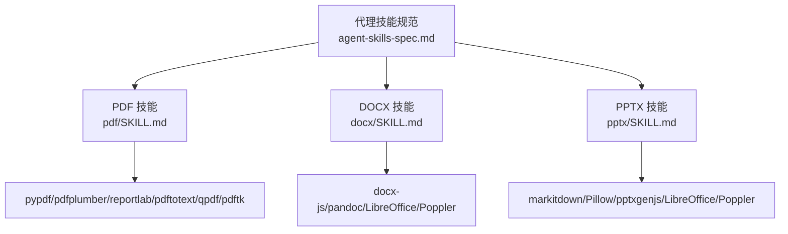
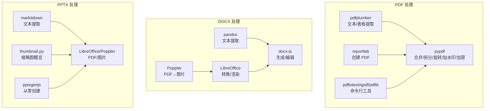
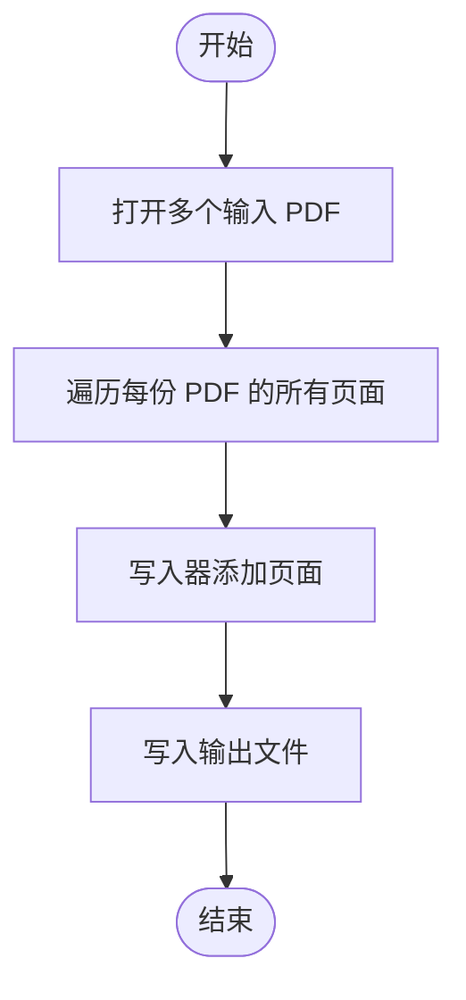
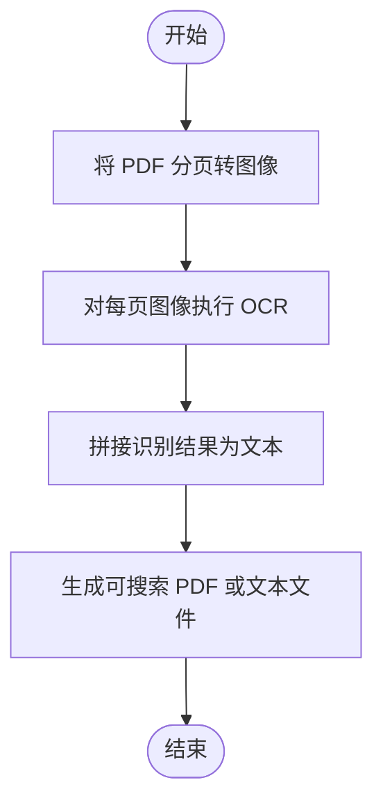
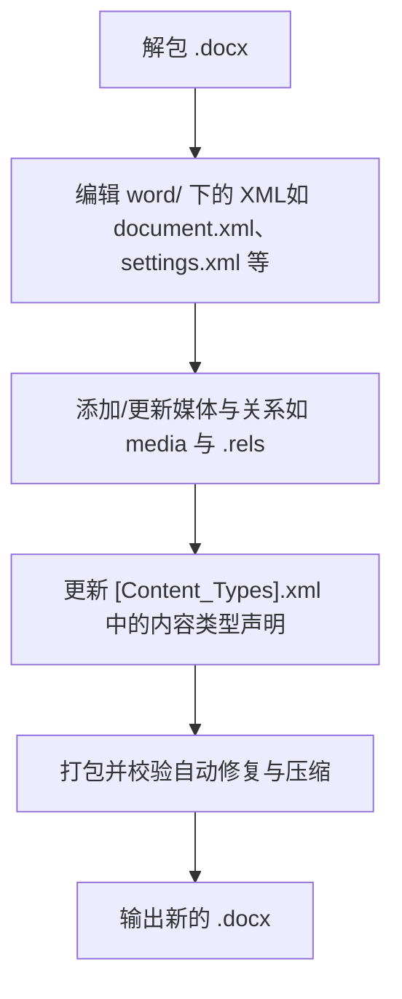
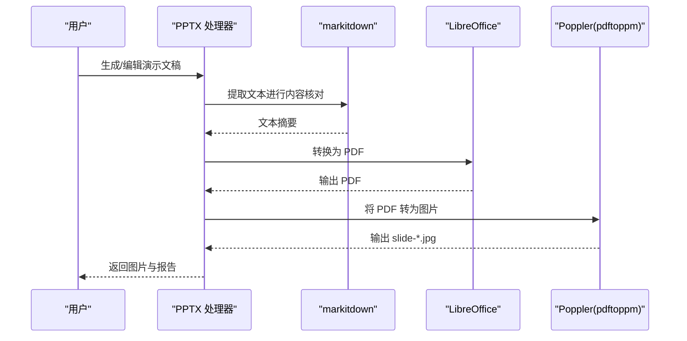
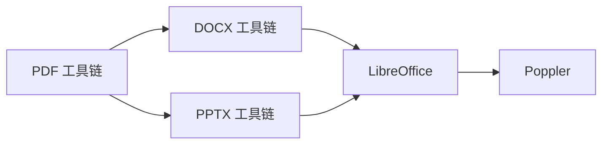

# 文档处理技能

<cite>
**本文引用的文件**
- [pdf 技能说明](file://skills/daoSkilLs/skills/anthropics-skills/skills/pdf/SKILL.md)
- [docx 技能说明](file://skills/daoSkilLs/skills/anthropics-skills/skills/docx/SKILL.md)
- [pptx 技能说明](file://skills/daoSkilLs/skills/anthropics-skills/skills/pptx/SKILL.md)
- [代理技能规范](file://skills/daoSkilLs/skills/anthropics-skills/spec/agent-skills-spec.md)
</cite>

## 目录
1. [简介](#简介)
2. [项目结构](#项目结构)
3. [核心组件](#核心组件)
4. [架构总览](#架构总览)
5. [详细组件分析](#详细组件分析)
6. [依赖关系分析](#依赖关系分析)
7. [性能考虑](#性能考虑)
8. [故障排查指南](#故障排查指南)
9. [结论](#结论)
10. [附录](#附录)

## 简介
本技术文档聚焦于“文档处理技能”，系统性阐述以下能力与机制：
- PDF 处理：文本与表格提取、表单字段填充与验证、合并/拆分、旋转、加水印、加密/解密、扫描版 OCR 可检索化、图片提取等。
- DOCX 文档：结构解析（ZIP/XML）、内容提取、格式化生成与编辑、样式与列表/表格/图像/页眉页脚/目录/脚注/超链接/制表符/多栏布局等高级排版、变更追踪与批注、XML 层面的打包与解包、校验与自动修复。
- PPTX 幻灯片：内容读取（文本/缩略图/原始 XML）、模板分析、从零创建、设计建议与质量保障流程、转图片进行视觉验收。

同时，文档给出 Office 文档的 XML 结构、Schema 合规要点、安全处理方法以及实际使用场景与最佳实践。

## 项目结构
该仓库中与“文档处理技能”直接相关的内容主要位于 Anthropic 技能集合下的 pdf、docx、pptx 子技能说明文件，以及代理技能规范文件。这些文件提供了各技能的功能边界、工具链、工作流与注意事项。

图表来源
- [代理技能规范:1-4](file://skills/daoSkilLs/skills/anthropics-skills/spec/agent-skills-spec.md#L1-L4)
- [pdf 技能说明:1-315](file://skills/daoSkilLs/skills/anthropics-skills/skills/pdf/SKILL.md#L1-L315)
- [docx 技能说明:1-591](file://skills/daoSkilLs/skills/anthropics-skills/skills/docx/SKILL.md#L1-L591)
- [pptx 技能说明:1-233](file://skills/daoSkilLs/skills/anthropics-skills/skills/pptx/SKILL.md#L1-L233)

章节来源
- [代理技能规范:1-4](file://skills/daoSkilLs/skills/anthropics-skills/spec/agent-skills-spec.md#L1-L4)
- [pdf 技能说明:1-315](file://skills/daoSkilLs/skills/anthropics-skills/skills/pdf/SKILL.md#L1-L315)
- [docx 技能说明:1-591](file://skills/daoSkilLs/skills/anthropics-skills/skills/docx/SKILL.md#L1-L591)
- [pptx 技能说明:1-233](file://skills/daoSkilLs/skills/anthropics-skills/skills/pptx/SKILL.md#L1-L233)

## 核心组件
- PDF 处理组件
  - 文本与表格提取：基于 pdfplumber 的页面级文本与表格抽取；支持导出为 Excel。
  - 表单处理：通过 pypdf 或 pdf-lib（JS）进行字段填充与验证（见 FORMS.md 指引）。
  - 基础操作：合并/拆分、旋转、加水印、元数据读取、加密/解密、图片提取、OCR 可检索化。
  - 创建 PDF：使用 reportlab 生成基础 PDF 或复杂报表。
  - 命令行工具：pdftotext、qpdf、pdftk 等辅助任务。
- DOCX 组件
  - 结构解析：.docx 是 ZIP 容器，内部包含 XML 文件；可使用 pandoc 或直接解包访问原始 XML。
  - 内容提取：支持带变更追踪的文本抽取。
  - 编辑与生成：docx-js 用于从零创建；编辑现有文档需解包→修改 XML→打包并校验。
  - 高级排版：页尺寸、页边距、列表（编号/符号）、表格（双宽度约束、清除底纹）、图像、页眉页脚、目录、脚注、超链接、制表符、多栏布局。
  - 变更追踪与批注：XML 层面插入删除标记与评论范围标记，支持回复嵌套。
  - 校验与修复：自动修复 durableId、缺失 xml:space 等常见问题；无法修复的模式错误需手工修复后重打包。
- PPTX 组件
  - 内容读取：markitdown 提取文本；thumbnail.py 生成缩略图概览；解包查看原始 XML。
  - 编辑工作流：模板分析→解包→内容编辑→清理→打包。
  - 从零创建：使用 pptxgenjs 生成新演示文稿。
  - 质量保障：文本/视觉双重 QA 流程；转 PDF 再转图片进行人工审阅；验证循环持续改进。
  - 设计建议：配色、字体、版式、间距与避免常见错误清单。

章节来源
- [pdf 技能说明:1-315](file://skills/daoSkilLs/skills/pdf/SKILL.md#L1-L315)
- [docx 技能说明:1-591](file://skills/daoSkilLs/skills/docx/SKILL.md#L1-L591)
- [pptx 技能说明:1-233](file://skills/daoSkilLs/skills/pptx/SKILL.md#L1-L233)

## 架构总览
下图展示了三类文档处理技能在系统中的定位与工具链交互：

图表来源
- [pdf 技能说明:1-315](file://skills/daoSkilLs/skills/pdf/SKILL.md#L1-L315)
- [docx 技能说明:1-591](file://skills/daoSkilLs/skills/docx/SKILL.md#L1-L591)
- [pptx 技能说明:1-233](file://skills/daoSkilLs/skills/pptx/SKILL.md#L1-L233)

## 详细组件分析

### PDF 处理组件
- 功能矩阵
  - 文本与表格：逐页提取文本与表格，支持导出为结构化数据。
  - 表单处理：字段填充与验证（参考 FORMS.md）。
  - 基础操作：合并/拆分、旋转、加水印、元数据读取、加密/解密、图片提取、OCR 可检索化。
  - 创建 PDF：使用 reportlab 生成基础或复杂报表。
  - 命令行工具：pdftotext、qpdf、pdftk 等。
- 关键流程（以“合并 PDF”为例）

图表来源
- [pdf 技能说明:32-44](file://skills/daoSkilLs/skills/pdf/SKILL.md#L32-L44)

- 关键流程（以“OCR 扫描版 PDF”为例）

图表来源
- [pdf 技能说明:233-250](file://skills/daoSkilLs/skills/pdf/SKILL.md#L233-L250)

章节来源
- [pdf 技能说明:1-315](file://skills/daoSkilLs/skills/pdf/SKILL.md#L1-L315)

### DOCX 处理组件
- 结构与解析
  - .docx 是 ZIP 容器，内部包含 XML 文件；可通过 pandoc 或直接解包访问原始 XML。
  - 解包后可进行编辑，再通过打包工具生成新的 .docx，并进行自动修复与校验。
- 高级排版与样式
  - 页尺寸与方向：明确 DXA 单位与横向布局的尺寸传递方式。
  - 列表：必须使用编号配置而非 Unicode 符号；不同引用独立编号。
  - 表格：必须同时设置表格宽度与列宽数组，且列宽之和等于表格宽度；使用清除底纹避免黑块。
  - 图像：必须指定类型参数；建议设置替代文本。
  - 页眉页脚：支持页码、自定义文本；注意段落换页断点的正确放置。
  - 目录：仅使用内置标题级别样式，确保目录层级有效。
  - 脚注：通过文档级脚注映射与引用运行对象插入。
  - 超链接：外部链接与内部书签链接分别处理。
  - 制表符与多栏：右对齐、点线引导、等宽或多宽列。
- 变更追踪与批注
  - 插入与删除：使用 <w:ins>/<w:del> 标记，必要时在段落属性中同步删除标记。
  - 批注：commentRangeStart/End 与 commentReference 标记，支持回复嵌套。
- XML 合规与安全
  - 元素顺序、空白保留、RSID 格式等。
  - 自动修复：durableId 规范化、缺失 xml:space 的补全。
  - 无法修复：畸形 XML、元素嵌套错误、关系缺失、Schema 违规等需手工修复。
- 关键流程（编辑现有文档）

图表来源
- [docx 技能说明:402-441](file://skills/daoSkilLs/skills/docx/SKILL.md#L402-L441)

章节来源
- [docx 技能说明:1-591](file://skills/daoSkilLs/skills/docx/SKILL.md#L1-L591)

### PPTX 处理组件
- 内容读取与分析
  - 使用 markitdown 提取文本；thumbnail.py 生成缩略图网格；解包查看原始 XML。
- 模板分析与编辑
  - 通过缩略图快速理解布局与主题；解包→编辑→清理→打包。
- 从零创建
  - 使用 pptxgenjs 生成新演示文稿，结合设计建议与质量保障流程。
- 质量保障与验证
  - 文本 QA：二次提取核对缺失/错序/占位符残留。
  - 视觉 QA：转 PDF 再转图片，子代理交叉审阅，建立验证循环。
- 关键流程（PPTX 质量保障）

图表来源
- [pptx 技能说明:141-204](file://skills/daoSkilLs/skills/pptx/SKILL.md#L141-L204)

章节来源
- [pptx 技能说明:1-233](file://skills/daoSkilLs/skills/pptx/SKILL.md#L1-L233)

## 依赖关系分析
- 工具链依赖
  - PDF：pypdf、pdfplumber、reportlab、pdftotext、qpdf、pdftk。
  - DOCX：docx-js、pandoc、LibreOffice、Poppler。
  - PPTX：markitdown、Pillow、pptxgenjs、LibreOffice、Poppler。
- 互操作关系
  - DOCX/PPTX 可通过 LibreOffice 转 PDF，再用 Poppler 转图片进行视觉验收。
  - PDF 可作为 DOCX/PPTX 的中间介质参与跨格式处理。

图表来源
- [pdf 技能说明:189-229](file://skills/daoSkilLs/skills/pdf/SKILL.md#L189-L229)
- [docx 技能说明:585-591](file://skills/daoSkilLs/skills/docx/SKILL.md#L585-L591)
- [pptx 技能说明:226-233](file://skills/daoSkilLs/skills/pptx/SKILL.md#L226-L233)

章节来源
- [pdf 技能说明:189-229](file://skills/daoSkilLs/skills/pdf/SKILL.md#L189-L229)
- [docx 技能说明:585-591](file://skills/daoSkilLs/skills/docx/SKILL.md#L585-L591)
- [pptx 技能说明:226-233](file://skills/daoSkilLs/skills/pptx/SKILL.md#L226-L233)

## 性能考虑
- 批处理与并发
  - 对大量 PDF/图片进行 OCR 或转图片时，建议分批处理并利用多进程/多线程提升吞吐。
- 内存与磁盘
  - 大型文档解包/打包时注意内存占用；优先使用流式写入与临时目录管理。
- 渲染与转换
  - LibreOffice 转换与 Poppler 图片导出可能较耗时，建议缓存中间产物并在需要时复用。
- 校验与修复
  - 自动修复可减少手工干预，但复杂模式错误仍需人工介入；建议在 CI 中加入自动化校验步骤。

## 故障排查指南
- PDF 常见问题
  - 合并后页面方向异常：检查旋转参数与写入顺序。
  - 表单字段不生效：确认字段名称与类型匹配，参考 FORMS.md。
  - OCR 结果乱码：检查语言包与图像质量。
- DOCX 常见问题
  - 表格显示异常：检查表格宽度与列宽是否一致，单元格宽度是否设置。
  - 列表符号不显示：改用编号配置而非 Unicode 符号。
  - 变更追踪错位：确保插入/删除标记包裹完整段落或最小编辑单元。
  - 打开报错：使用自动修复或回退到上一个已知可用版本。
- PPTX 常见问题
  - 占位符残留：使用 markitdown 再次提取并 grep 检查。
  - 视觉错位：转图片后人工审阅，重点关注对齐、间距与对比度。
  - 导出图片模糊：提高分辨率参数或缩小导出范围。

章节来源
- [pdf 技能说明:233-250](file://skills/daoSkilLs/skills/pdf/SKILL.md#L233-L250)
- [docx 技能说明:442-453](file://skills/daoSkilLs/skills/docx/SKILL.md#L442-L453)
- [pptx 技能说明:141-204](file://skills/daoSkilLs/skills/pptx/SKILL.md#L141-L204)

## 结论
“文档处理技能”围绕 PDF、DOCX、PPTX 三大办公文档格式，构建了从内容提取、结构解析、格式化生成到编辑与质量保障的完整能力谱系。通过明确的工具链选择、严格的 XML 合规与安全处理、完善的校验与修复机制，以及可重复的质量保障流程，能够稳定支撑各类文档自动化任务。建议在实际项目中结合业务场景，优先采用官方推荐工具与工作流，并在 CI 中集成自动化校验与图片验收，以确保交付质量。

## 附录
- 实际使用场景与最佳实践
  - PDF：批量归档、合规审计、表单自动化、扫描件可检索化。
  - DOCX：合同/报告/模板化文档生成与修订、跨平台兼容性校验。
  - PPTX：演示文稿模板化、批量生成与视觉一致性保障。
- 安全与合规
  - 严格限制外部输入的 XML/宏/脚本；对解包/编辑过程进行沙箱隔离。
  - 对 OCR/转换中间产物进行病毒扫描与内容审查。
  - 记录变更追踪与批注作者信息，满足审计要求。