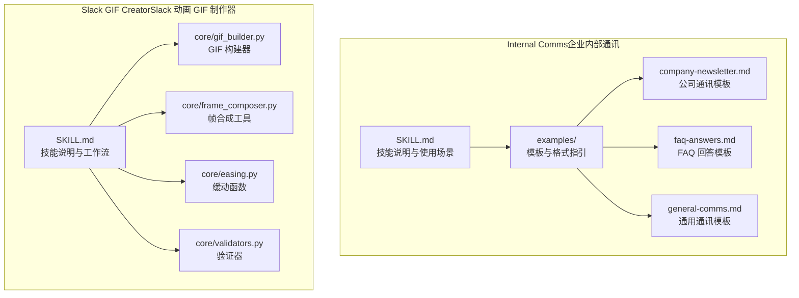
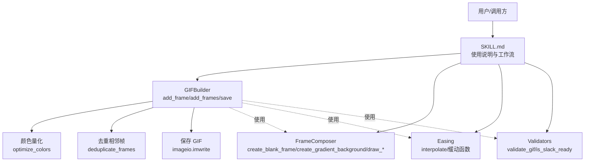
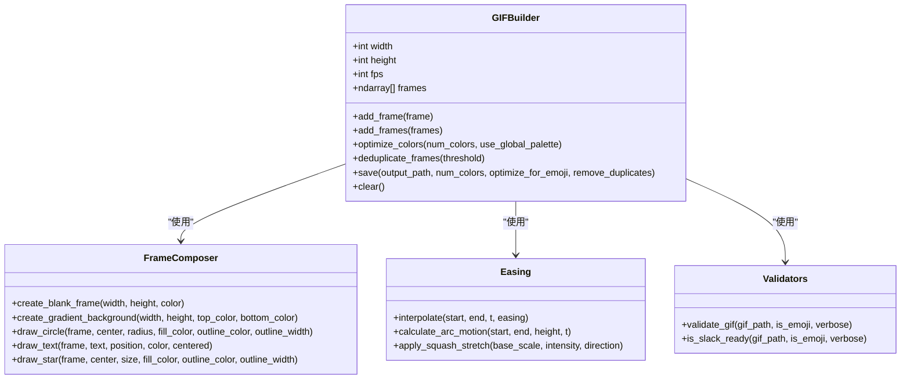
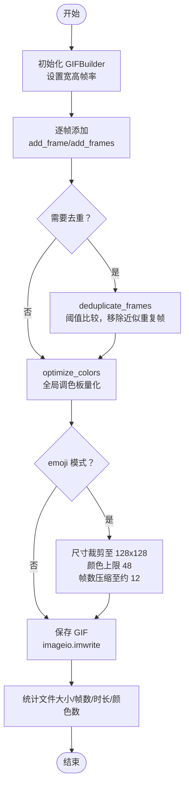
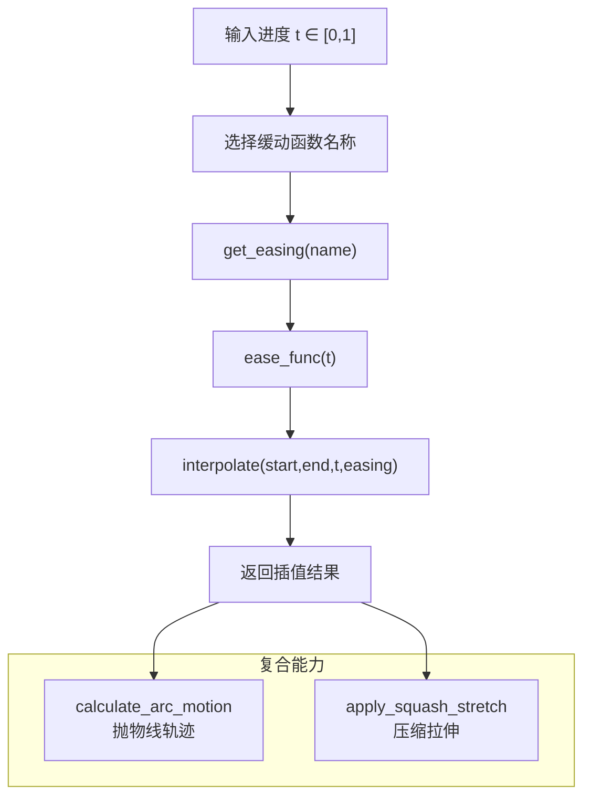
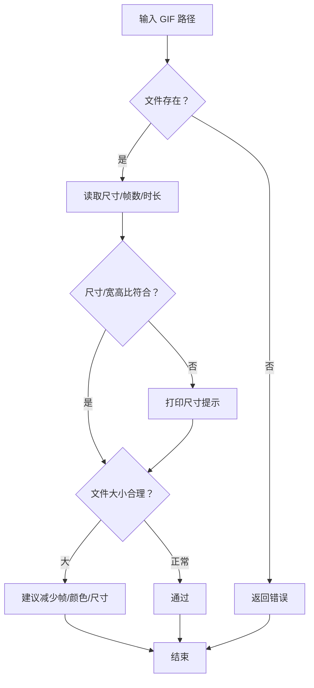
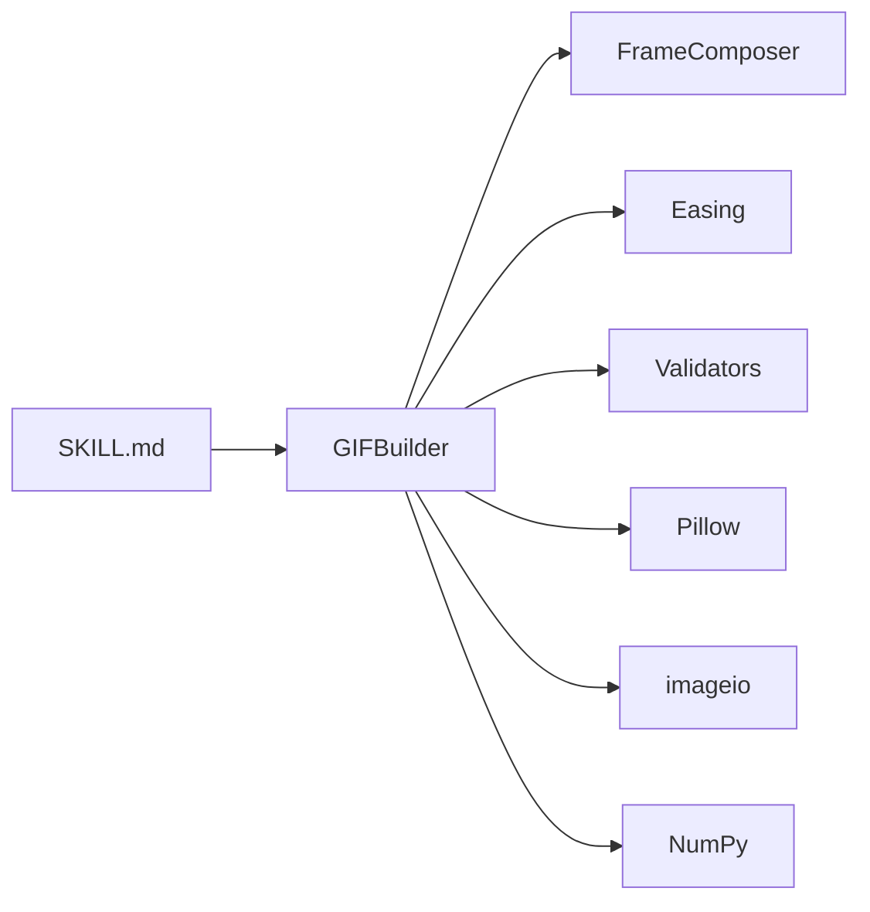

# 沟通交流技能

<cite>
**本文引用的文件**
- [internal-comms/SKILL.md](file://skills/daoSkilLs/skills/anthropics-skills/skills/internal-comms/SKILL.md)
- [internal-comms/examples/company-newsletter.md](file://skills/daoSkilLs/skills/anthropics-skills/skills/internal-comms/examples/company-newsletter.md)
- [internal-comms/examples/faq-answers.md](file://skills/daoSkilLs/skills/anthropics-skills/skills/internal-comms/examples/faq-answers.md)
- [internal-comms/examples/general-comms.md](file://skills/daoSkilLs/skills/anthropics-skills/skills/internal-comms/examples/general-comms.md)
- [slack-gif-creator/SKILL.md](file://skills/daoSkilLs/skills/anthropics-skills/skills/slack-gif-creator/SKILL.md)
- [slack-gif-creator/core/gif_builder.py](file://skills/daoSkilLs/skills/anthropics-skills/skills/slack-gif-creator/core/gif_builder.py)
- [slack-gif-creator/core/frame_composer.py](file://skills/daoSkilLs/skills/anthropics-skills/skills/slack-gif-creator/core/frame_composer.py)
- [slack-gif-creator/core/easing.py](file://skills/daoSkilLs/skills/anthropics-skills/skills/slack-gif-creator/core/easing.py)
- [slack-gif-creator/core/validators.py](file://skills/daoSkilLs/skills/anthropics-skills/skills/slack-gif-creator/core/validators.py)
</cite>

## 目录
1. [简介](#简介)
2. [项目结构](#项目结构)
3. [核心组件](#核心组件)
4. [架构总览](#架构总览)
5. [详细组件分析](#详细组件分析)
6. [依赖关系分析](#依赖关系分析)
7. [性能考量](#性能考量)
8. [故障排查指南](#故障排查指南)
9. [结论](#结论)
10. [附录](#附录)

## 简介
本技术文档围绕两类沟通交流技能展开：Internal Comms（企业内部通讯）与 Slack GIF Creator（Slack 动画 GIF 制作器）。前者提供企业内部各类通讯内容的模板与规范，帮助快速生成 3P 更新、公司通讯、FAQ 回答等；后者提供面向 Slack 的 GIF 构建工具链，涵盖帧合成、缓动函数与验证器，确保动画在尺寸、色彩、帧率与体积上满足平台要求，并支持创意动画的高效落地。

## 项目结构
该仓库中与“沟通交流技能”直接相关的内容位于 anthropic 技能包下的 internal-comms 与 slack-gif-creator 两个子模块。每个子模块包含技能说明文档与核心实现模块或示例模板。

图表来源
- [internal-comms/SKILL.md:1-33](file://skills/daoSkilLs/skills/anthropics-skills/skills/internal-comms/SKILL.md#L1-L33)
- [slack-gif-creator/SKILL.md:1-255](file://skills/daoSkilLs/skills/anthropics-skills/skills/slack-gif-creator/SKILL.md#L1-L255)

章节来源
- [internal-comms/SKILL.md:1-33](file://skills/daoSkilLs/skills/anthropics-skills/skills/internal-comms/SKILL.md#L1-L33)
- [slack-gif-creator/SKILL.md:1-255](file://skills/daoSkilLs/skills/anthropics-skills/skills/slack-gif-creator/SKILL.md#L1-L255)

## 核心组件
- Internal Comms 技能：提供企业内部通讯的使用场景、模板加载与格式化指导，覆盖 3P 更新、公司通讯、FAQ 回答与通用通讯等类型。
- Slack GIF Creator 技能：提供 GIF 构建、帧合成、缓动函数与验证器，确保输出符合 Slack 尺寸、帧率与体积约束，并支持创意动画的实现。

章节来源
- [internal-comms/SKILL.md:7-29](file://skills/daoSkilLs/skills/anthropics-skills/skills/internal-comms/SKILL.md#L7-L29)
- [slack-gif-creator/SKILL.md:11-248](file://skills/daoSkilLs/skills/anthropics-skills/skills/slack-gif-creator/SKILL.md#L11-L248)

## 架构总览
下图展示了 Slack GIF Creator 的核心模块交互：用户通过技能说明调用 GIF 构建器，构建器负责帧收集、颜色量化、去重与保存；同时可结合帧合成工具绘制图形、文本与渐变背景；缓动函数用于平滑运动轨迹；验证器用于检查输出是否满足 Slack 要求。

图表来源
- [slack-gif-creator/SKILL.md:22-248](file://skills/daoSkilLs/skills/anthropics-skills/skills/slack-gif-creator/SKILL.md#L22-L248)
- [slack-gif-creator/core/gif_builder.py:17-270](file://skills/daoSkilLs/skills/anthropics-skills/skills/slack-gif-creator/core/gif_builder.py#L17-L270)
- [slack-gif-creator/core/frame_composer.py:1-177](file://skills/daoSkilLs/skills/anthropics-skills/skills/slack-gif-creator/core/frame_composer.py#L1-L177)
- [slack-gif-creator/core/easing.py:1-235](file://skills/daoSkilLs/skills/anthropics-skills/skills/slack-gif-creator/core/easing.py#L1-L235)
- [slack-gif-creator/core/validators.py:1-137](file://skills/daoSkilLs/skills/anthropics-skills/skills/slack-gif-creator/core/validators.py#L1-L137)

## 详细组件分析

### Internal Comms（企业内部通讯）
- 使用场景与模板加载
  - 支持 3P 更新、公司通讯、FAQ 回答、状态报告、领导更新、项目更新与事件报告等。
  - 通过从 examples 目录加载相应模板，遵循格式、语气与内容收集指引。
- 公司通讯模板要点
  - 结构建议：公告、优先进展、领导更新、社交动态等分段组织。
  - 内容优先级：公司级影响、领导层公告、重大里程碑、影响大多数员工的信息、外部认可。
  - 工具建议：Slack、邮件、日历、文档与外部新闻作为素材来源。
- FAQ 回答模板要点
  - 范围：捕捉大规模员工普遍困惑的问题，给出简洁专业且可追溯权威来源的答案。
  - 格式：问题与答案一一对应，必要时标注需高层确认或官方回应。
- 通用通讯模板要点
  - 明确受众、目的、语调与格式要求，遵循公司沟通风格。

章节来源
- [internal-comms/SKILL.md:7-29](file://skills/daoSkilLs/skills/anthropics-skills/skills/internal-comms/SKILL.md#L7-L29)
- [internal-comms/examples/company-newsletter.md:1-66](file://skills/daoSkilLs/skills/anthropics-skills/skills/internal-comms/examples/company-newsletter.md#L1-L66)
- [internal-comms/examples/faq-answers.md:1-30](file://skills/daoSkilLs/skills/anthropics-skills/skills/internal-comms/examples/faq-answers.md#L1-L30)
- [internal-comms/examples/general-comms.md:1-16](file://skills/daoSkilLs/skills/anthropics-skills/skills/internal-comms/examples/general-comms.md#L1-L16)

### Slack GIF Creator（动画 GIF 构建器）
- 核心工作流
  - 初始化构建器（尺寸、帧率），逐帧添加（PIL 图像或 NumPy 数组），颜色量化与去重，保存为 GIF。
  - 提供 emoji 模式自动优化（尺寸、颜色、帧数）与体积提示。
- 帧合成工具
  - 提供空白帧、渐变背景、圆形、文本与五角星绘制等便捷函数，便于快速搭建动画画面。
- 缓动函数
  - 提供线性、二次、三次、弹性、弹跳与回退等多种缓动曲线，支持插值计算与弧形运动、压缩拉伸等扩展能力。
- 验证器
  - 检查尺寸（表情包 128x128 或消息 GIF 宽高比与最小边）、帧数与时长、文件大小，输出详细信息并给出优化建议。

图表来源
- [slack-gif-creator/core/gif_builder.py:17-270](file://skills/daoSkilLs/skills/anthropics-skills/skills/slack-gif-creator/core/gif_builder.py#L17-L270)
- [slack-gif-creator/core/frame_composer.py:1-177](file://skills/daoSkilLs/skills/anthropics-skills/skills/slack-gif-creator/core/frame_composer.py#L1-L177)
- [slack-gif-creator/core/easing.py:1-235](file://skills/daoSkilLs/skills/anthropics-skills/skills/slack-gif-creator/core/easing.py#L1-L235)
- [slack-gif-creator/core/validators.py:1-137](file://skills/daoSkilLs/skills/anthropics-skills/skills/slack-gif-creator/core/validators.py#L1-L137)

#### GIF 构建器：帧组合、颜色量化与保存流程

图表来源
- [slack-gif-creator/core/gif_builder.py:160-265](file://skills/daoSkilLs/skills/anthropics-skills/skills/slack-gif-creator/core/gif_builder.py#L160-L265)

章节来源
- [slack-gif-creator/SKILL.md:22-248](file://skills/daoSkilLs/skills/anthropics-skills/skills/slack-gif-creator/SKILL.md#L22-L248)
- [slack-gif-creator/core/gif_builder.py:17-270](file://skills/daoSkilLs/skills/anthropics-skills/skills/slack-gif-creator/core/gif_builder.py#L17-L270)

#### 缓动函数：插值与复合动画

图表来源
- [slack-gif-creator/core/easing.py:117-234](file://skills/daoSkilLs/skills/anthropics-skills/skills/slack-gif-creator/core/easing.py#L117-L234)

章节来源
- [slack-gif-creator/core/easing.py:1-235](file://skills/daoSkilLs/skills/anthropics-skills/skills/slack-gif-creator/core/easing.py#L1-L235)

#### 验证器：Slack 就绪检查

图表来源
- [slack-gif-creator/core/validators.py:11-137](file://skills/daoSkilLs/skills/anthropics-skills/skills/slack-gif-creator/core/validators.py#L11-L137)

章节来源
- [slack-gif-creator/core/validators.py:1-137](file://skills/daoSkilLs/skills/anthropics-skills/skills/slack-gif-creator/core/validators.py#L1-L137)

## 依赖关系分析
- Internal Comms 依赖于 examples 下的模板文件，调用方根据请求类型加载对应模板并遵循格式与语气。
- Slack GIF Creator 的 GIFBuilder 依赖于以下模块：
  - FrameComposer：提供基础图形与背景绘制。
  - Easing：提供平滑运动与轨迹计算。
  - Validators：提供就绪校验与体积提示。
- 外部依赖：Pillow、imageio、NumPy。

图表来源
- [slack-gif-creator/SKILL.md:250-255](file://skills/daoSkilLs/skills/anthropics-skills/skills/slack-gif-creator/SKILL.md#L250-L255)
- [slack-gif-creator/core/gif_builder.py:9-14](file://skills/daoSkilLs/skills/anthropics-skills/skills/slack-gif-creator/core/gif_builder.py#L9-L14)

章节来源
- [slack-gif-creator/SKILL.md:250-255](file://skills/daoSkilLs/skills/anthropics-skills/skills/slack-gif-creator/SKILL.md#L250-L255)
- [slack-gif-creator/core/gif_builder.py:1-15](file://skills/daoSkilLs/skills/anthropics-skills/skills/slack-gif-creator/core/gif_builder.py#L1-L15)

## 性能考量
- 减少帧数与降低帧率：在保持流畅的前提下，适当降低 FPS 或缩短时长以减小体积。
- 控制颜色数量：使用更少的颜色（如 48）可显著降低文件大小。
- 适配尺寸：emoji 场景建议 128x128，消息 GIF 建议 320–640 边长且宽高比合理。
- 去重相邻帧：启用去重可去除近似重复帧，保留细微动画的同时减少冗余。
- 全局调色板：对多帧使用全局调色板可提升压缩效率。
- 输出前验证：通过验证器检查尺寸、帧数与时长，避免超限导致上传失败或加载缓慢。

章节来源
- [slack-gif-creator/SKILL.md:214-232](file://skills/daoSkilLs/skills/anthropics-skills/skills/slack-gif-creator/SKILL.md#L214-L232)
- [slack-gif-creator/core/gif_builder.py:59-122](file://skills/daoSkilLs/skills/anthropics-skills/skills/slack-gif-creator/core/gif_builder.py#L59-L122)
- [slack-gif-creator/core/validators.py:63-118](file://skills/daoSkilLs/skills/anthropics-skills/skills/slack-gif-creator/core/validators.py#L63-L118)

## 故障排查指南
- 无帧可保存：若未添加任何帧，保存时会抛出异常。请先调用 add_frame/add_frames 添加帧后再保存。
- 尺寸不符：验证器会提示尺寸是否符合 Slack 要求（emoji 128x128 或消息 GIF 宽高比与最小边限制）。请调整尺寸或启用 emoji 自动优化。
- 文件过大：验证器会提示文件大小是否偏大。建议减少帧数、颜色或尺寸，并考虑去重与全局调色板。
- 帧重复导致体积异常：启用去重功能可移除近似重复帧，但需注意阈值设置以平衡细节与体积。

章节来源
- [slack-gif-creator/core/gif_builder.py:179-180](file://skills/daoSkilLs/skills/anthropics-skills/skills/slack-gif-creator/core/gif_builder.py#L179-L180)
- [slack-gif-creator/core/validators.py:115-117](file://skills/daoSkilLs/skills/anthropics-skills/skills/slack-gif-creator/core/validators.py#L115-L117)

## 结论
Internal Comms 与 Slack GIF Creator 两大技能分别覆盖“内容生成”与“视觉呈现”的关键环节。前者通过模板与规范提升企业内部沟通的一致性与效率；后者通过构建器、帧合成、缓动与验证工具链，保障动画在 Slack 平台上的质量与性能。两者结合可为企业提供从“说什么”到“怎么表现”的完整沟通方案。

## 附录
- 实际应用场景与使用示例（基于模板与技能说明）
  - 企业通讯：按公司通讯模板组织内容，分段呈现公告、进展、领导更新与社交动态，链接权威来源，突出公司级影响与外部认可。
  - FAQ 回答：从 Slack、邮件与文档中聚合高频问题，统一格式输出，注明来源并标注需官方确认项。
  - 动画制作：使用帧合成工具绘制基础图形与背景，结合缓动函数实现自然运动，最后通过验证器检查尺寸与体积，必要时启用 emoji 模式优化。

章节来源
- [internal-comms/examples/company-newsletter.md:18-66](file://skills/daoSkilLs/skills/anthropics-skills/skills/internal-comms/examples/company-newsletter.md#L18-L66)
- [internal-comms/examples/faq-answers.md:10-30](file://skills/daoSkilLs/skills/anthropics-skills/skills/internal-comms/examples/faq-answers.md#L10-L30)
- [slack-gif-creator/SKILL.md:22-248](file://skills/daoSkilLs/skills/anthropics-skills/skills/slack-gif-creator/SKILL.md#L22-L248)