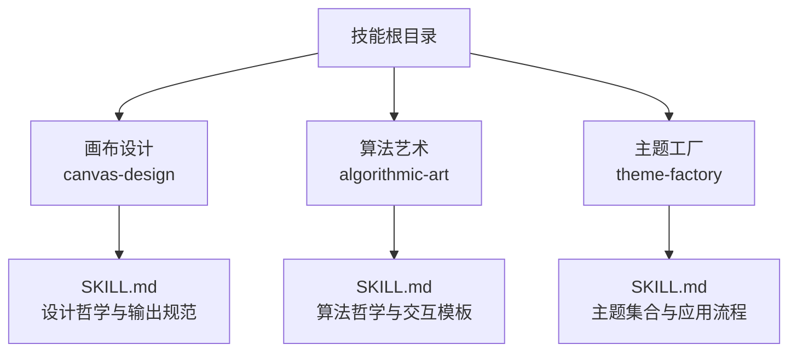
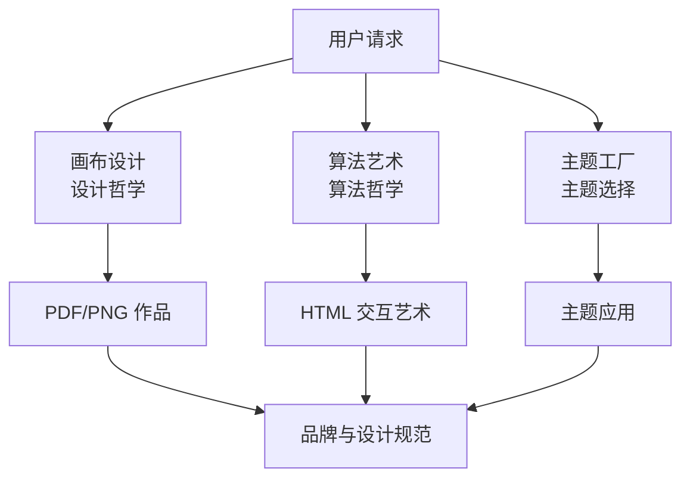
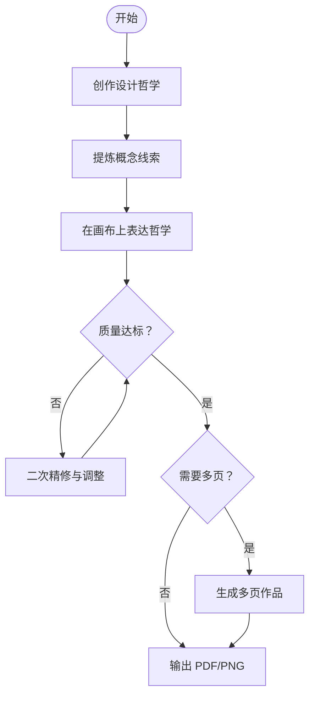
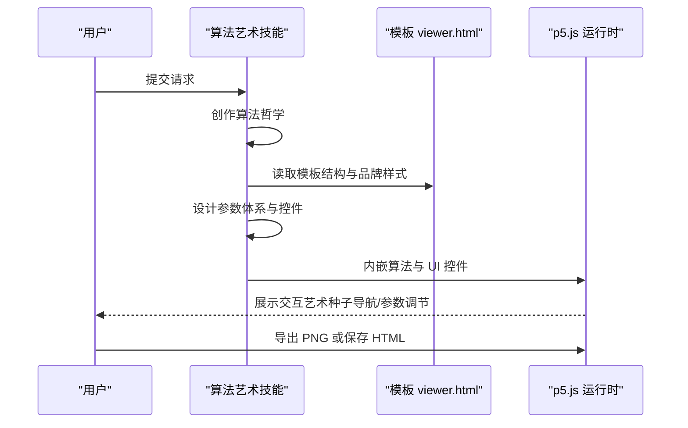
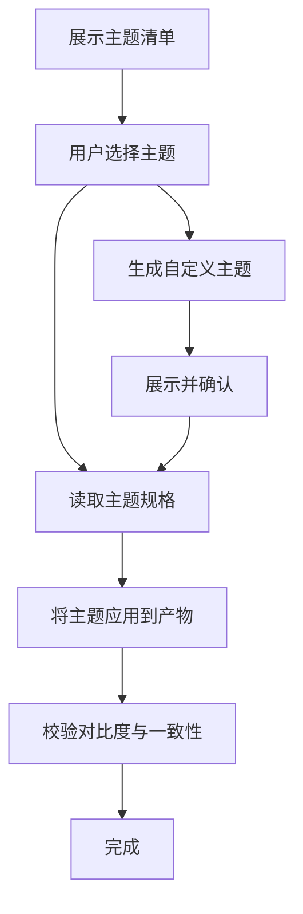
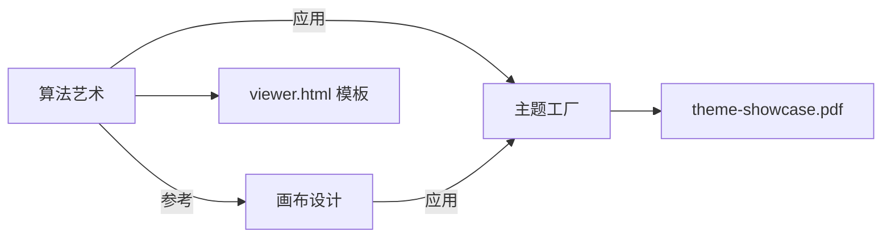

# 设计创作技能

<cite>
**本文引用的文件**
- [技能总览](file://skills/daoSkilLs/skills/anthropics-skills/README.md)
- [画布设计 SKILL.md](file://skills/daoSkilLs/skills/anthropics-skills/skills/canvas-design/README.md)
- [算法艺术 SKILL.md](file://skills/daoSkilLs/skills/anthropics-skills/skills/algorithmic-art/README.md)
- [主题工厂 SKILL.md](file://skills/daoSkilLs/skills/anthropics-skills/skills/theme-factory/README.md)
</cite>

## 目录
1. [简介](#简介)
2. [项目结构](#项目结构)
3. [核心组件](#核心组件)
4. [架构概览](#架构概览)
5. [详细组件分析](#详细组件分析)
6. [依赖关系分析](#依赖关系分析)
7. [性能考量](#性能考量)
8. [故障排查指南](#故障排查指南)
9. [结论](#结论)
10. [附录](#附录)

## 简介
本技术文档聚焦于“设计创作技能”，系统阐述三类核心能力：Canvas Design（画布设计）、Algorithmic Art（算法艺术）与 Theme Factory（主题工厂）。文档从设计理念、实现流程、数据与控制流、交互机制、错误处理与性能优化等维度，提供面向设计师与工程师的可操作指南，并给出设计规范、品牌一致性与创意工具使用建议。

## 项目结构
该仓库采用“技能”（Skill）作为功能单元组织方式，每项技能独立封装在各自目录中，包含技能元信息与实现指引。与本主题相关的核心技能位于：
- skills/daoSkilLs/skills/anthropics-skills/skills/canvas-design
- skills/daoSkilLs/skills/anthropics-skills/skills/algorithmic-art
- skills/daoSkilLs/skills/anthropics-skills/skills/theme-factory

图表来源
- [技能总览](file://skills/daoSkilLs/skills/anthropics-skills/README.md)

章节来源
- [技能总览](file://skills/daoSkilLs/skills/anthropics-skills/README.md)

## 核心组件
- 画布设计（Canvas Design）
  - 目标：以“设计哲学”为起点，产出高完成度的视觉作品（PDF/PNG），强调空间表达、极简文字与专家级工艺感。
  - 关键流程：设计哲学创作 → 概念提炼 → 画布表达 → 多页扩展（如需）。
- 算法艺术（Algorithmic Art）
  - 目标：以“算法哲学”为起点，产出可交互的 p5.js 生成式艺术（HTML+JS），强调过程美学、参数化探索与可重现性。
  - 关键流程：算法哲学创作 → 参数体系设计 → 交互界面构建 → 可视化渲染与导出。
- 主题工厂（Theme Factory）
  - 目标：为各类内容产物提供一致的品牌风格，内置 10 套预设主题，并支持按需定制。
  - 关键流程：展示主题 → 用户选择 → 应用主题到产物 → 自定义主题生成与验证。

章节来源
- [画布设计 SKILL.md](file://skills/daoSkilLs/skills/anthropics-skills/skills/canvas-design/README.md)
- [算法艺术 SKILL.md](file://skills/daoSkilLs/skills/anthropics-skills/skills/algorithmic-art/README.md)
- [主题工厂 SKILL.md](file://skills/daoSkilLs/skills/anthropics-skills/skills/theme-factory/README.md)

## 架构概览
三类技能围绕“先理念、后实现”的创作范式协同工作：用户输入触发技能执行；技能内部通过“哲学层”指导“实现层”，最终输出标准化产物。算法艺术强调交互与参数化，画布设计强调视觉完整性与品牌一致性，主题工厂贯穿于两者以确保风格统一。

图表来源
- [画布设计 SKILL.md](file://skills/daoSkilLs/skills/anthropics-skills/skills/canvas-design/README.md)
- [算法艺术 SKILL.md](file://skills/daoSkilLs/skills/anthropics-skills/skills/algorithmic-art/README.md)
- [主题工厂 SKILL.md](file://skills/daoSkilLs/skills/anthropics-skills/skills/theme-factory/README.md)

## 详细组件分析

### 画布设计（Canvas Design）
- 设计理念
  - 强调“视觉表达优先、文本极简、空间叙事”。作品应具备专家级工艺感，避免卡通化或业余感。
  - 输出形态为单页或多页 PDF/PNG，遵循“90% 视觉设计 + 10% 必要文字”的比例。
- 实现流程
  - 设计哲学创作：围绕形式、空间、色彩、构图、图像与图形、形状与图案等维度展开，形成可指导视觉表达的哲学文本。
  - 概念提炼：从用户输入中提取“微妙的概念线索”，作为作品的“灵魂”，不直接宣告，而以隐性方式融入构成。
  - 画布表达：依据哲学进行高完成度的视觉创作，注意留白、层次、排版与字体选择，确保无重叠、边界清晰、呼吸空间充足。
  - 多页扩展：可在保持哲学一致的前提下，创作多页作品，形成类似画册的叙事。
- 质量标准
  - 工艺感：如同顶级专家反复打磨，细节无懈可击。
  - 品牌一致性：字体选择需与设计哲学相匹配，避免与品牌风格冲突。
  - 可达性：保证对比度与可读性，避免文字与图形重叠。

图表来源
- [画布设计 SKILL.md](file://skills/daoSkilLs/skills/anthropics-skills/skills/canvas-design/README.md)

章节来源
- [画布设计 SKILL.md](file://skills/daoSkilLs/skills/anthropics-skills/skills/canvas-design/README.md)

### 算法艺术（Algorithmic Art）
- 算法理念
  - “过程即产品”，强调算法执行中的动态美与参数化探索。作品应体现“受控混沌”“涌现行为”“数学美感”。
  - 采用 p5.js 实现，要求可交互、可重现（种子固定），并提供参数化 UI 控件。
- 实现流程
  - 算法哲学创作：描述计算过程、噪声场、粒子系统、场与力、参数化变化等维度，形成可指导实现的哲学文本。
  - 参数体系设计：围绕系统可调节属性（数量、尺度、概率、比例、角度、阈值等）建立参数对象，确保与哲学一致。
  - 交互界面构建：基于模板 viewer.html 的固定结构（品牌色、字体、种子区、动作区），替换变量部分（算法、参数控件、颜色控件）。
  - 渲染与导出：支持实时更新、随机/跳转种子、批量变体生成与 PNG 导出。
- 资源与约束
  - 使用模板 viewer.html 作为起始点，保留其布局与品牌风格，仅替换算法与参数区域。
  - 所有产物为自包含 HTML 文件，内嵌 p5.js 与全部逻辑，便于分享与运行。

图表来源
- [算法艺术 SKILL.md](file://skills/daoSkilLs/skills/anthropics-skills/skills/algorithmic-art/README.md)

章节来源
- [算法艺术 SKILL.md](file://skills/daoSkilLs/skills/anthropics-skills/skills/algorithmic-art/README.md)

### 主题工厂（Theme Factory）
- 主题理念
  - 提供 10 套专业配色与字体组合，覆盖不同场景与受众；支持对现有主题进行应用，也支持按需生成新主题。
- 使用流程
  - 展示主题：向用户展示 theme-showcase.pdf，不修改，仅用于浏览。
  - 选择主题：明确主题名称后，读取对应主题文件，应用到目标产物。
  - 应用策略：确保色彩对比与可读性，维持主题视觉标识在全产物中的一致性。
  - 自定义主题：根据输入生成新的主题，经审核后再应用。
- 配置要点
  - 每个主题包含：配色板（含十六进制码）、标题与正文字体搭配、适用于不同场景的视觉身份。

图表来源
- [主题工厂 SKILL.md](file://skills/daoSkilLs/skills/anthropics-skills/skills/theme-factory/README.md)

章节来源
- [主题工厂 SKILL.md](file://skills/daoSkilLs/skills/anthropics-skills/skills/theme-factory/README.md)

## 依赖关系分析
- 技能间协作
  - 算法艺术与画布设计均可受益于主题工厂提供的风格基线，确保品牌一致性。
  - 画布设计产出的 PDF/PNG 可作为算法艺术的静态参考或素材来源。
- 外部资源
  - 算法艺术依赖 p5.js（CDN）与模板 viewer.html 的结构约定。
  - 主题工厂依赖主题清单与 PDF 展示材料。

图表来源
- [算法艺术 SKILL.md](file://skills/daoSkilLs/skills/anthropics-skills/skills/algorithmic-art/README.md)
- [主题工厂 SKILL.md](file://skills/daoSkilLs/skills/anthropics-skills/skills/theme-factory/README.md)

章节来源
- [算法艺术 SKILL.md](file://skills/daoSkilLs/skills/anthropics-skills/skills/algorithmic-art/README.md)
- [主题工厂 SKILL.md](file://skills/daoSkilLs/skills/anthropics-skills/skills/theme-factory/README.md)

## 性能考量
- 算法艺术
  - 控制复杂度与渲染频率，避免卡顿；合理设置帧率与采样密度。
  - 使用种子确保可重现，便于调试与版本对比。
  - 将所有逻辑内嵌于单一 HTML，减少加载与网络开销。
- 画布设计
  - 在高分辨率输出前进行多次校验，避免后期返工。
  - 字体与图像资源尽量本地化或缓存，提升导出效率。
- 主题工厂
  - 主题清单与 PDF 展示材料应轻量化，避免影响浏览体验。

## 故障排查指南
- 算法艺术
  - 交互无响应：检查模板结构是否被正确保留，变量区是否已替换。
  - 种子不可用：确认 seed 控件与更新函数绑定正确，且参数对象包含 seed 字段。
  - 导出失败：确认导出逻辑已实现，或使用浏览器截图替代。
- 画布设计
  - 文字与图形重叠：回退到更宽松的留白策略，调整字体大小与位置。
  - 颜色对比不足：切换至主题工厂提供的高对比度配色。
- 主题工厂
  - 应用后风格不一致：核对主题文件中的配色与字体是否完整应用到各页面。
  - 自定义主题未通过审核：根据反馈调整配色与字体组合，确保可读性与适用性。

## 结论
本设计创作技能体系以“哲学驱动实现”为核心，通过画布设计强化视觉表达与品牌一致性，通过算法艺术拓展过程美学与交互探索，通过主题工厂保障风格统一与可复用性。三者协同可覆盖从创意构思到成品交付的全流程，既满足专业级质量要求，又便于分享与迭代。

## 附录
- 设计规范与品牌指南
  - 字体：优先使用与主题匹配的字体组合，避免系统默认字体破坏整体风格。
  - 色彩：严格遵循主题工厂提供的配色表，确保对比度与可读性。
  - 版式：遵循“90% 视觉 + 10% 文字”的原则，文本作为视觉元素而非信息载体。
- 创意工具使用技巧
  - 画布设计：先做哲学，再做图；多轮精修，追求“专家级工艺感”。
  - 算法艺术：以哲学为纲，参数为目；提供直观的参数与种子导航。
  - 主题工厂：先看后选，再应用；必要时生成自定义主题并评审。