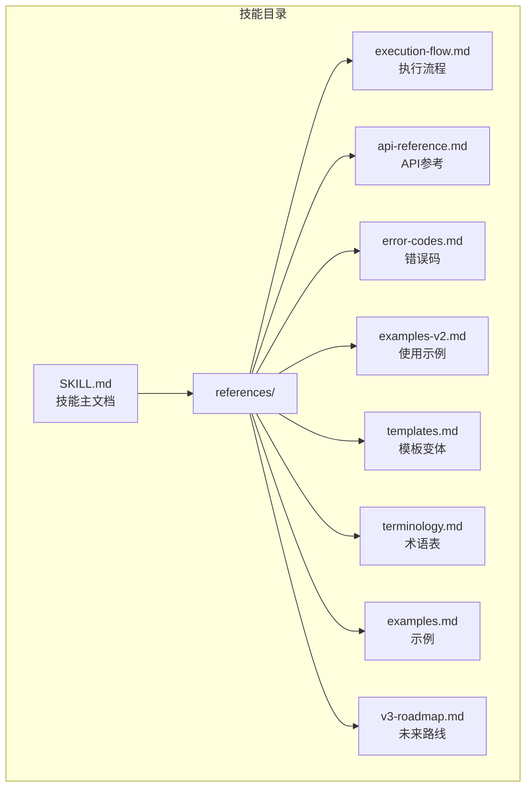
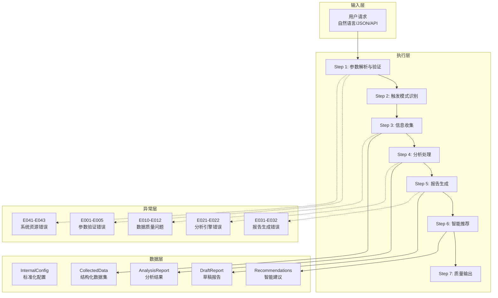
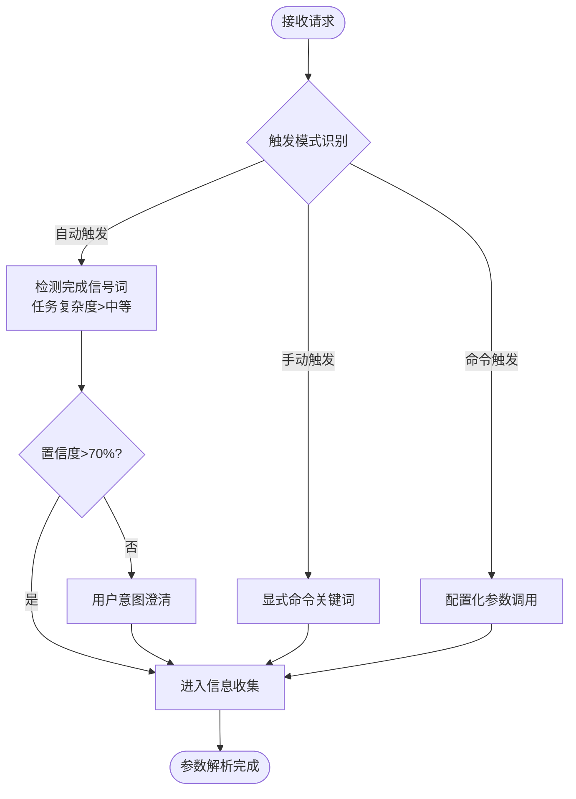
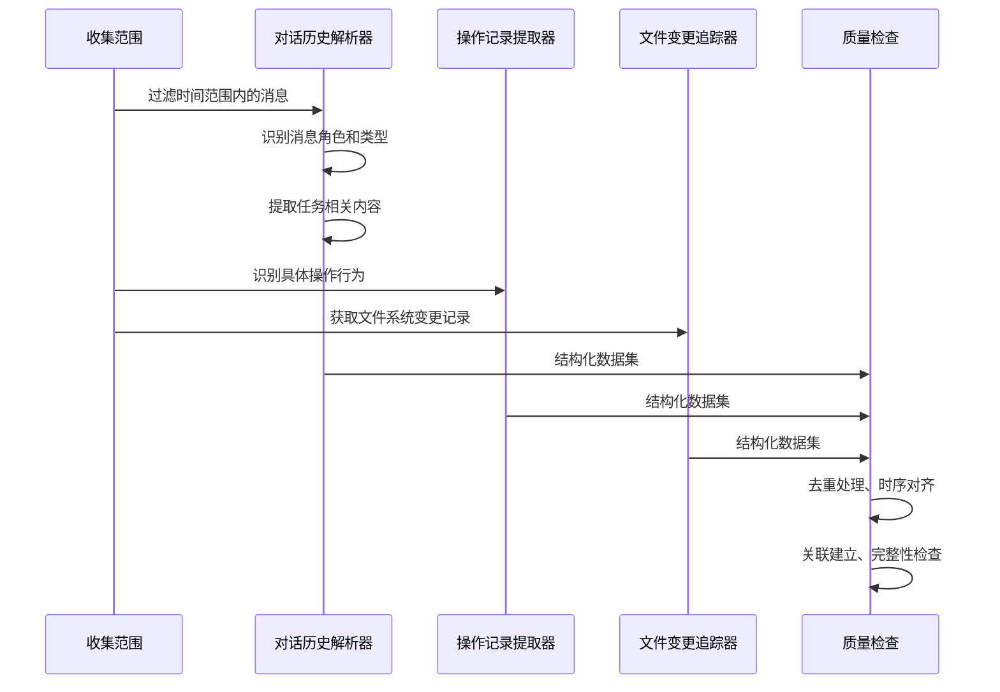
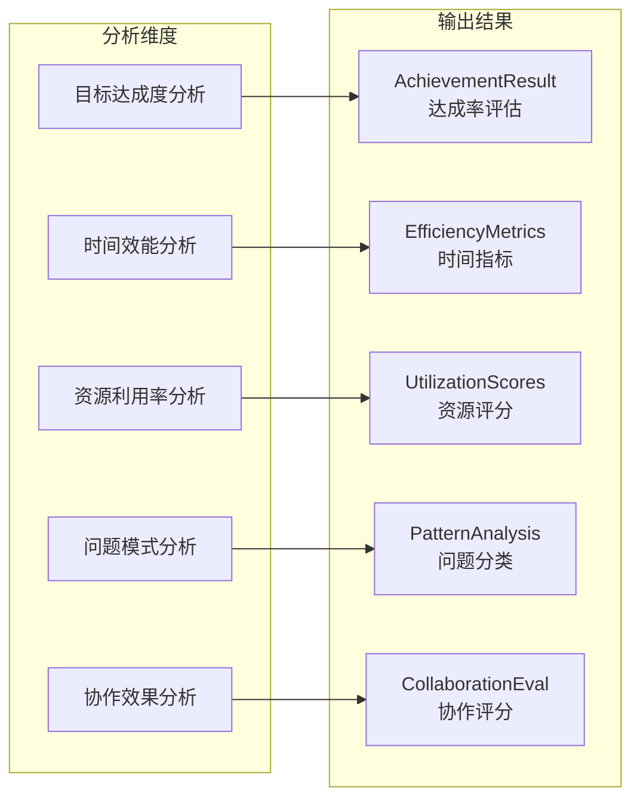
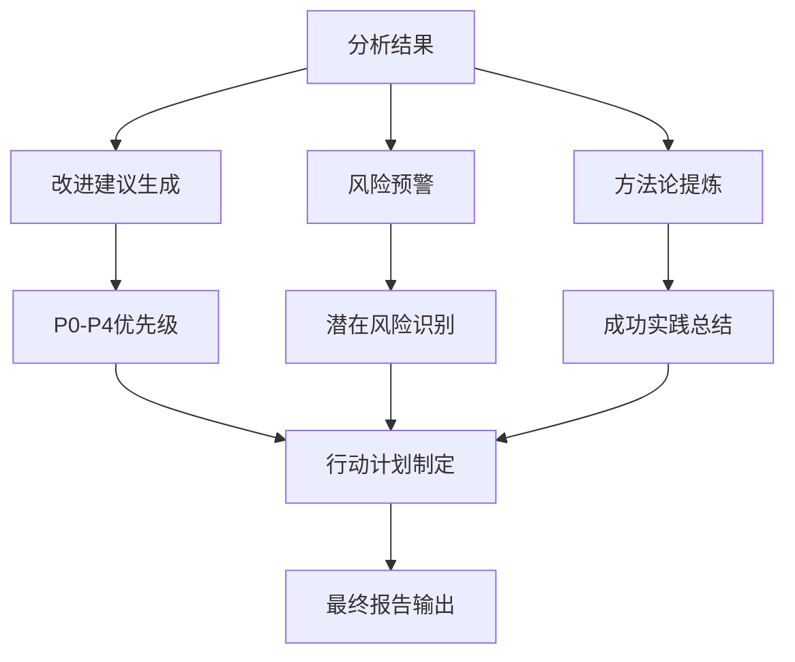
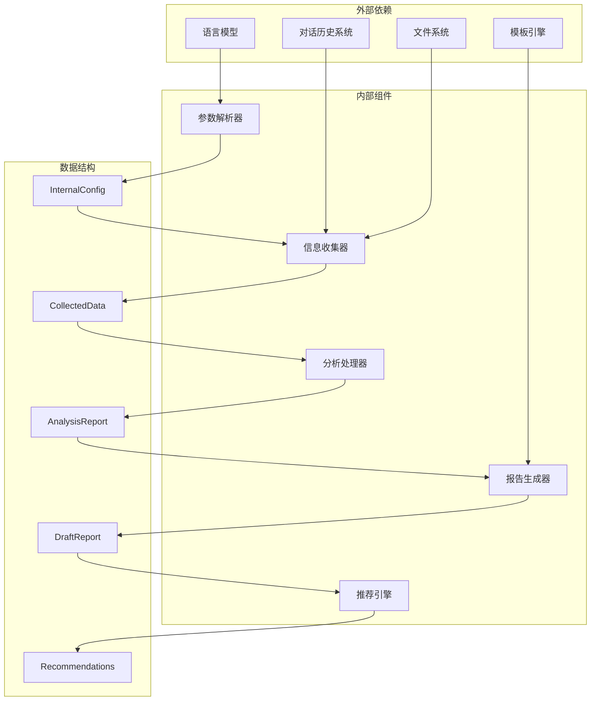
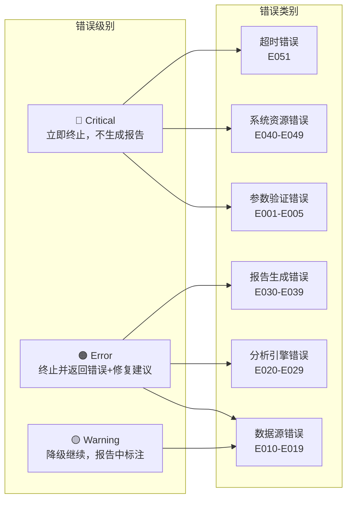

# 任务执行技能

<cite>
**本文档引用的文件**
- [SKILL.md](file://skills/daoSkilLs/skills/task-execution-summary/SKILL.md)
- [execution-flow.md](file://skills/daoSkilLs/skills/task-execution-summary/references/execution-flow.md)
- [api-reference.md](file://skills/daoSkilLs/skills/task-execution-summary/references/api-reference.md)
- [error-codes.md](file://skills/daoSkilLs/skills/task-execution-summary/references/error-codes.md)
- [examples-v2.md](file://skills/daoSkilLs/skills/task-execution-summary/references/examples-v2.md)
- [templates.md](file://skills/daoSkilLs/skills/task-execution-summary/references/templates.md)
</cite>

## 目录
1. [简介](#简介)
2. [项目结构](#项目结构)
3. [核心组件](#核心组件)
4. [架构总览](#架构总览)
5. [详细组件分析](#详细组件分析)
6. [依赖分析](#依赖分析)
7. [性能考虑](#性能考虑)
8. [故障排查指南](#故障排查指南)
9. [结论](#结论)
10. [附录](#附录)

## 简介
本技能是“任务执行总结报告生成器”，旨在为用户提供系统化、结构化的任务执行经验总结能力。通过智能化的信息收集、深度分析和规范化报告生成，帮助用户从已完成任务中提炼有价值的经验教训，形成可复用的方法论，持续提升个人和团队的执行效能。

- **核心价值**：经验沉淀、模式识别、决策支持、能力提升
- **适用场景**：软件开发、项目管理、运维故障排查、技术研究、学习成长等
- **四大核心引擎**：信息收集、分析处理、报告生成、智能推荐

## 项目结构
技能位于 `skills/daoSkilLs/skills/task-execution-summary/` 目录下，包含技能主文档、参考文档和评估文件：



**图表来源**
- [SKILL.md:1-364](file://skills/daoSkilLs/skills/task-execution-summary/SKILL.md#L1-L364)
- [execution-flow.md:1-1783](file://skills/daoSkilLs/skills/task-execution-summary/references/execution-flow.md#L1-L1783)
- [api-reference.md:1-1378](file://skills/daoSkilLs/skills/task-execution-summary/references/api-reference.md#L1-L1378)
- [error-codes.md:1-1594](file://skills/daoSkilLs/skills/task-execution-summary/references/error-codes.md#L1-L1594)
- [examples-v2.md:1-769](file://skills/daoSkilLs/skills/task-execution-summary/references/examples-v2.md#L1-L769)
- [templates.md:1-2000](file://skills/daoSkilLs/skills/task-execution-summary/references/templates.md#L1-L2000)

**章节来源**
- [SKILL.md:1-364](file://skills/daoSkilLs/skills/task-execution-summary/SKILL.md#L1-L364)

## 核心组件
技能由以下核心组件构成：

### 1. 触发与参数解析引擎
- **触发模式**：自动触发、手动触发、命令式调用
- **参数验证**：必填参数校验、类型检查、范围验证
- **默认值应用**：标准化内部配置对象

### 2. 信息收集引擎
- **数据源适配**：对话历史解析、操作记录提取、文件变更追踪
- **信息抽取**：任务目标、时间节点、决策、问题、资源、协作
- **数据整合**：去重处理、时序对齐、关联建立

### 3. 分析处理引擎
- **五维分析**：目标达成度、时间效能、资源利用、问题模式、协作效果
- **质量检查**：完整性评分、准确性验证、覆盖率阈值

### 4. 报告生成引擎
- **10章标准模板**：执行概览、目标背景、执行过程、关键决策、问题解决、资源使用、团队协作、多维分析、经验方法、改进行动
- **模板变体**：摘要版、标准版、详细版、学习版

### 5. 智能推荐引擎
- **方法论提炼**：从成功实践中提取可复用方法论
- **改进建议**：P0-P4优先级建议、行动计划、风险预警
- **降级机制**：数据不足时的警告和简化处理

**章节来源**
- [SKILL.md:73-193](file://skills/daoSkilLs/skills/task-execution-summary/SKILL.md#L73-L193)
- [execution-flow.md:1-1783](file://skills/daoSkilLs/skills/task-execution-summary/references/execution-flow.md#L1-L1783)

## 架构总览
技能采用“确定性-可观测性-容错性”三大设计原则：



**图表来源**
- [execution-flow.md:1-1783](file://skills/daoSkilLs/skills/task-execution-summary/references/execution-flow.md#L1-L1783)
- [api-reference.md:1-1378](file://skills/daoSkilLs/skills/task-execution-summary/references/api-reference.md#L1-L1378)

## 详细组件分析

### 触发与参数解析组件
触发模式识别支持三种模式：



**图表来源**
- [execution-flow.md:313-439](file://skills/daoSkilLs/skills/task-execution-summary/references/execution-flow.md#L313-L439)

参数验证规则：
- 必填参数：task_name（2-200字符）
- 可选参数：detail_level（summary/standard/detailed）、template_variant、included_chapters/excluded_chapters
- 默认值：detail_level=standard、output_format=markdown、language=zh-CN

**章节来源**
- [execution-flow.md:175-311](file://skills/daoSkilLs/skills/task-execution-summary/references/execution-flow.md#L175-L311)
- [api-reference.md:183-715](file://skills/daoSkilLs/skills/task-execution-summary/references/api-reference.md#L183-L715)

### 信息收集组件
信息收集阶段是核心瓶颈，占总耗时的40-50%：



**图表来源**
- [execution-flow.md:441-699](file://skills/daoSkilLs/skills/task-execution-summary/references/execution-flow.md#L441-L699)

信息抽取六大类别：
- 任务目标实体：目标关键词、成功标准
- 时间节点实体：时间表达、阶段划分
- 决策实体：选择行为、依据
- 问题实体：错误、异常、困难
- 资源实体：工具、框架、服务
- 协作实体：团队角色、分工

**章节来源**
- [execution-flow.md:482-659](file://skills/daoSkilLs/skills/task-execution-summary/references/execution-flow.md#L482-L659)

### 分析处理组件
五维分析引擎：



**图表来源**
- [execution-flow.md:701-800](file://skills/daoSkilLs/skills/task-execution-summary/references/execution-flow.md#L701-L800)

分析方法：
- 目标达成度：对比法 + 量化评估（优秀≥95%、良好85-94%、合格70-84%）
- 时间效能：偏差计算 + 瓶颈识别（总体时效比、阶段均衡度、瓶颈集中度）
- 资源利用：利用率计算 + 浪费识别（必要性、充分性、适配性、性价比）

**章节来源**
- [execution-flow.md:701-800](file://skills/daoSkilLs/skills/task-execution-summary/references/execution-flow.md#L701-L800)

### 报告生成组件
10章标准模板结构：

```mermaid
graph TB
subgraph "10章模板"
S1[执行概览<br/>基本信息、关键数据、亮点挑战]
S2[目标背景<br/>初始目标、调整记录、最终成果、约束条件]
S3[执行过程<br/>分阶段步骤、时间线、关键事件、产出物]
S4[关键决策<br/>决策清单、备选方案、选择依据、事后评估]
S5[问题解决<br/>问题总览、详细解决过程、模式分析、经验教训]
S6[资源使用<br/>人力、技术栈、工具依赖、效率评估]
S7[团队协作<br/>协作模式、沟通效能、分工合理性]
S8[多维分析<br/>五大分析汇总、综合评价、雷达图]
S9[经验方法<br/>成功要素、方法论提炼、最佳实践、知识图谱]
S10[改进行动<br/>建议(P0-P4)、行动计划、风险预警、工具推荐]
end
```

**图表来源**
- [templates.md:1-2000](file://skills/daoSkilLs/skills/task-execution-summary/references/templates.md#L1-L2000)

模板变体：
- 摘要版：第1章完整+第10章摘要+其他章节标题（2-3页）
- 标准版：10章完整（8-15页）
- 详细版：10章深入+更多图表+详尽附录（20-30页）
- 学习版：学习专用模板，强调知识掌握和学习方法论

**章节来源**
- [templates.md:1-2000](file://skills/daoSkilLs/skills/task-execution-summary/references/templates.md#L1-L2000)

### 智能推荐组件
智能推荐生成：



**图表来源**
- [execution-flow.md:1-1783](file://skills/daoSkilLs/skills/task-execution-summary/references/execution-flow.md#L1-L1783)

推荐策略：
- 从成功实践中提取可复用方法论
- 针对发现问题生成具体改进建议（P0-P4优先级）
- 识别潜在风险并给出预警和防范措施

**章节来源**
- [execution-flow.md:1-1783](file://skills/daoSkilLs/skills/task-execution-summary/references/execution-flow.md#L1-L1783)

## 依赖分析
技能的依赖关系和耦合度：



**图表来源**
- [execution-flow.md:1-1783](file://skills/daoSkilLs/skills/task-execution-summary/references/execution-flow.md#L1-L1783)
- [api-reference.md:1-1378](file://skills/daoSkilLs/skills/task-execution-summary/references/api-reference.md#L1-L1378)

依赖特征：
- **低耦合**：各组件职责明确，接口清晰
- **高内聚**：每个组件专注于特定功能领域
- **可扩展**：支持新模板、新分析维度的扩展
- **容错性**：非致命错误不阻断主流程

**章节来源**
- [execution-flow.md:1-1783](file://skills/daoSkilLs/skills/task-execution-summary/references/execution-flow.md#L1-L1783)

## 性能考虑
性能基线和优化策略：

### 性能基线
- 总耗时分布（标准版报告，中等复杂度任务）：
  - Step 3（信息收集）：40-50%
  - Step 4（分析处理）：35-40%
  - Step 5（报告生成）：15-20%
  - Step 6（智能推荐）：5-10%
  - Step 7（质量输出）：<2%
  - Step 2（触发识别）：<2%
  - Step 1（参数解析）：<1%

### 性能影响因素
- 对话轮数：20轮以下（低影响）、20-50轮（中等影响）、>50轮（高影响）
- 详细程度：摘要版（-30%）、标准版（基准）、详细版（+50%）
- 数据量：对话长度、文件变更数量、操作记录复杂度

### 优化策略
1. **缓存策略**
   - 对话历史缓存
   - 模板渲染缓存
   - 分析结果缓存

2. **并发处理**
   - 多线程信息收集
   - 异步报告生成
   - 流水线并行化

3. **降级策略**
   - 数据不足时的警告和简化处理
   - 部分功能降级而非完全失败
   - 用户可选择降级继续

4. **资源优化**
   - 内存使用监控和限制
   - 文件系统I/O优化
   - 网络请求超时控制

**章节来源**
- [execution-flow.md:142-171](file://skills/daoSkilLs/skills/task-execution-summary/references/execution-flow.md#L142-L171)

## 故障排查指南
错误处理和故障排查：

### 错误分级体系


**图表来源**
- [error-codes.md:1-1594](file://skills/daoSkilLs/skills/task-execution-summary/references/error-codes.md#L1-L1594)

### 常见问题和解决方案
1. **参数验证错误（E001-E005）**
   - 缺少必填参数：检查task_name和其他必需参数
   - 参数类型错误：确认参数类型与期望一致
   - 参数值越界：调整到有效范围内
   - 参数冲突：修改参数组合以消除冲突

2. **数据不足警告（E010）**
   - 对话历史过短：保持更详细的对话记录
   - 关键信息缺失：补充决策过程、问题描述、时间信息
   - 资源信息不完整：提供技术栈和工具使用情况

3. **系统资源错误（E041-E043）**
   - 内存不足：释放内存或增加资源
   - 文件系统写入失败：检查磁盘空间和权限
   - 未预期异常：查看日志获取详细信息

### 降级机制
当信息不足时的降级策略：
- 从详细版降级为标准版
- 简化受影响章节的内容
- 在报告中标注信息不足区域
- 提供用户补充建议

**章节来源**
- [error-codes.md:1-1594](file://skills/daoSkilLs/skills/task-execution-summary/references/error-codes.md#L1-L1594)
- [examples-v2.md:461-688](file://skills/daoSkilLs/skills/task-execution-summary/references/examples-v2.md#L461-L688)

## 结论
任务执行总结技能通过"确定性-可观测性-容错性"的设计原则，实现了高质量的任务执行经验总结能力。其核心优势包括：

1. **系统化流程**：7步标准执行流程确保结果的一致性和可复现性
2. **智能化分析**：五维深度分析提供全面的执行效能评估
3. **灵活输出**：多种模板变体适应不同场景需求
4. **容错机制**：完善的错误处理和降级策略保证服务稳定性
5. **可扩展架构**：模块化设计支持功能扩展和定制化

该技能为个人和团队提供了强大的知识管理工具，有助于持续改进和学习成长。

## 附录

### 使用示例
技能提供了丰富的使用示例，涵盖正常调用、最小参数、参数错误和数据不足等典型场景。示例包括软件开发任务、Sprint复盘、参数验证错误和降级执行等场景。

### API参考
完整的API接口规范，包括输入参数定义、输出响应格式、调用示例和版本历史。支持RESTful API和JSON-RPC两种调用方式。

### 模板参考
详细的模板变体说明，包括快速摘要版、标准版、详细深度版和学习版模板的结构定义和使用场景。

### 术语表
86个专业术语的完整定义，涵盖任务执行、项目管理、技术分析等相关概念。

**章节来源**
- [examples-v2.md:1-769](file://skills/daoSkilLs/skills/task-execution-summary/references/examples-v2.md#L1-L769)
- [api-reference.md:1-1378](file://skills/daoSkilLs/skills/task-execution-summary/references/api-reference.md#L1-L1378)
- [templates.md:1-2000](file://skills/daoSkilLs/skills/task-execution-summary/references/templates.md#L1-L2000)
- [SKILL.md:287-308](file://skills/daoSkilLs/skills/task-execution-summary/SKILL.md#L287-L308)