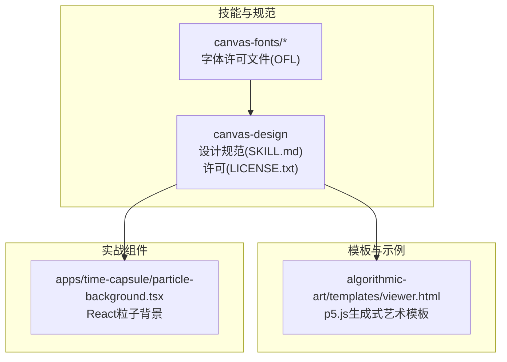
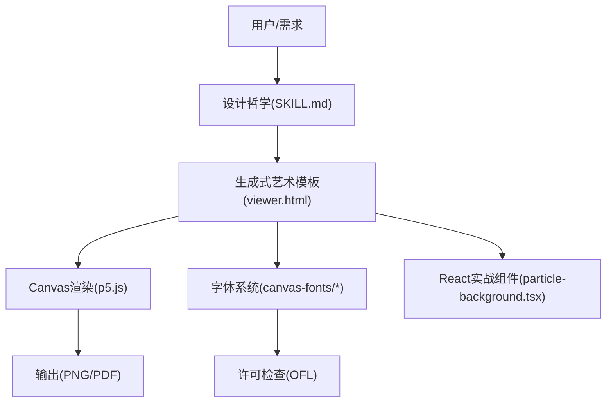
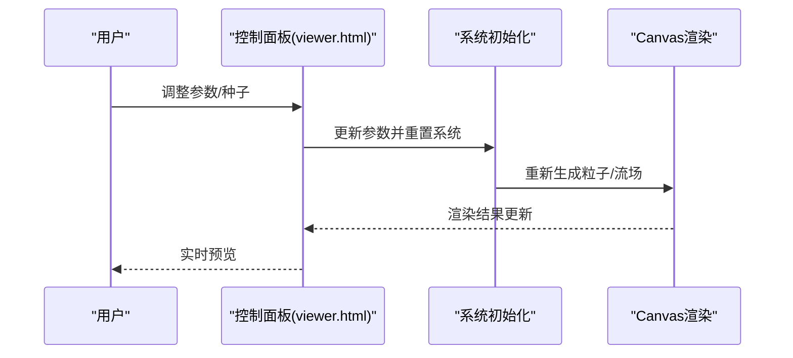
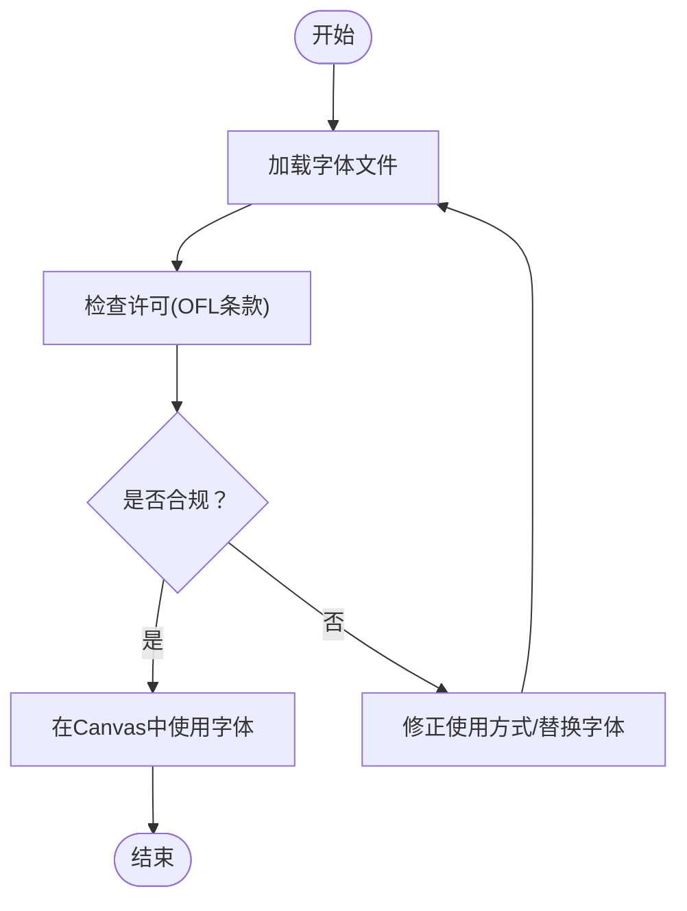
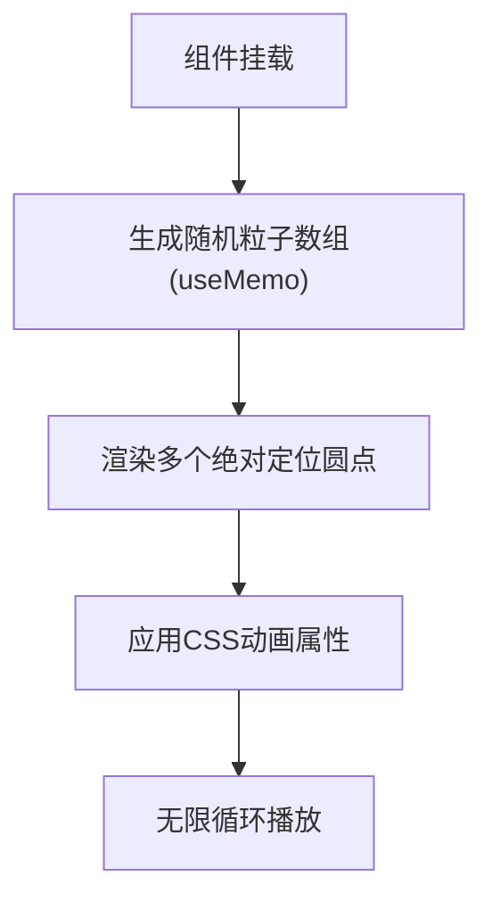
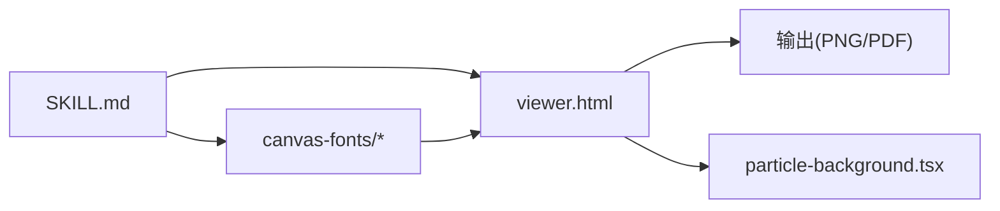

# Canvas设计工具

<cite>
**本文档引用的文件**
- [SKILL.md](file://skills/daoSkilLs/skills/anthropics-skills/skills/canvas-design/SKILL.md)
- [LICENSE.txt](file://skills/daoSkilLs/skills/anthropics-skills/skills/canvas-design/LICENSE.txt)
- [viewer.html](file://skills/daoSkilLs/skills/anthropics-skills/skills/algorithmic-art/templates/viewer.html)
- [particle-background.tsx](file://apps/time-capsule/src/components/ui/particle-background.tsx)
- [CrimsonPro-OFL.txt](file://skills/daoSkilLs/skills/anthropics-skills/skills/canvas-design/canvas-fonts/CrimsonPro-OFL.txt)
- [DMMono-OFL.txt](file://skills/daoSkilLs/skills/anthropics-skills/skills/canvas-design/canvas-fonts/DMMono-OFL.txt)
- [BricolageGrotesque-OFL.txt](file://skills/daoSkilLs/skills/anthropics-skills/skills/canvas-design/canvas-fonts/BricolageGrotesque-OFL.txt)
- [BigShoulders-OFL.txt](file://skills/daoSkilLs/skills/anthropics-skills/skills/canvas-design/canvas-fonts/BigShoulders-OFL.txt)
- [PixelifySans-OFL.txt](file://skills/daoSkilLs/skills/anthropics-skills/skills/canvas-design/canvas-fonts/PixelifySans-OFL.txt)
- [InstrumentSans-OFL.txt](file://skills/daoSkilLs/skills/anthropics-skills/skills/canvas-design/canvas-fonts/InstrumentSans-OFL.txt)
- [Italiana-OFL.txt](file://skills/daoSkilLs/skills/anthropics-skills/skills/canvas-design/canvas-fonts/Italiana-OFL.txt)
- [RedHatMono-OFL.txt](file://skills/daoSkilLs/skills/anthropics-skills/skills/canvas-design/canvas-fonts/RedHatMono-OFL.txt)
- [Silkscreen-OFL.txt](file://skills/daoSkilLs/skills/anthropics-skills/skills/canvas-design/canvas-fonts/Silkscreen-OFL.txt)
- [Jura-OFL.txt](file://skills/daoSkilLs/skills/anthropics-skills/skills/canvas-design/canvas-fonts/Jura-OFL.txt)
- [NationalPark-OFL.txt](file://skills/daoSkilLs/skills/anthropics-skills/skills/canvas-design/canvas-fonts/NationalPark-OFL.txt)
- [SmoochSans-OFL.txt](file://skills/daoSkilLs/skills/anthropics-skills/skills/canvas-design/canvas-fonts/SmoochSans-OFL.txt)
- [WorkSans-OFL.txt](file://skills/daoSkilLs/skills/anthropics-skills/skills/canvas-design/canvas-fonts/WorkSans-OFL.txt)
- [PoiretOne-OFL.txt](file://skills/daoSkilLs/skills/anthropics-skills/skills/canvas-design/canvas-fonts/PoiretOne-OFL.txt)
- [EricaOne-OFL.txt](file://skills/daoSkilLs/skills/anthropics-skills/skills/canvas-design/canvas-fonts/EricaOne-OFL.txt)
</cite>

## 目录
1. [简介](#简介)
2. [项目结构](#项目结构)
3. [核心组件](#核心组件)
4. [架构总览](#架构总览)
5. [详细组件分析](#详细组件分析)
6. [依赖关系分析](#依赖关系分析)
7. [性能考虑](#性能考虑)
8. [故障排除指南](#故障排除指南)
9. [结论](#结论)
10. [附录](#附录)

## 简介
本项目围绕“Canvas设计工具”展开，目标是构建一个以HTML5 Canvas为核心的图形设计与字体管理系统，支持：
- 基于Canvas的高级绘图：路径绘制、渐变、滤镜与图像处理
- 字体系统：字体文件管理、加载机制、文本渲染优化与跨浏览器兼容
- 动画制作：帧率控制、性能优化与交互响应
- 复杂图形效果：粒子系统、几何图案与动态背景
- 用户界面与交互：直观的参数化控制面板与实时预览
- 数据交换：与外部设计软件的通用格式对接（如PDF、PNG等）

该能力由“Canvas设计”技能与“算法艺术”模板共同支撑，前者定义设计哲学与输出规范，后者提供可扩展的Canvas/生成式艺术实现框架。

## 项目结构
项目采用多技能模块化组织，其中与Canvas设计直接相关的关键位置如下：
- 技能层：skills/daoSkilLs/skills/anthropics-skills/skills/canvas-design
  - 设计规范与字体许可：SKILL.md、LICENSE.txt、canvas-fonts/*
- 模板与示例：skills/daoSkilLs/skills/anthropics-skills/skills/algorithmic-art/templates/viewer.html
- 实战组件：apps/time-capsule/src/components/ui/particle-background.tsx

图表来源
- [SKILL.md:1-130](file://skills/daoSkilLs/skills/anthropics-skills/skills/canvas-design/SKILL.md#L1-L130)
- [LICENSE.txt:1-202](file://skills/daoSkilLs/skills/anthropics-skills/skills/canvas-design/LICENSE.txt#L1-L202)
- [viewer.html:1-599](file://skills/daoSkilLs/skills/anthropics-skills/skills/algorithmic-art/templates/viewer.html#L1-L599)
- [particle-background.tsx:1-45](file://apps/time-capsule/src/components/ui/particle-background.tsx#L1-L45)

章节来源
- [SKILL.md:1-130](file://skills/daoSkilLs/skills/anthropics-skills/skills/canvas-design/SKILL.md#L1-L130)
- [LICENSE.txt:1-202](file://skills/daoSkilLs/skills/anthropics-skills/skills/canvas-design/LICENSE.txt#L1-L202)
- [viewer.html:1-599](file://skills/daoSkilLs/skills/anthropics-skills/skills/algorithmic-art/templates/viewer.html#L1-L599)
- [particle-background.tsx:1-45](file://apps/time-capsule/src/components/ui/particle-background.tsx#L1-L45)

## 核心组件
- 设计哲学与输出规范
  - 明确“视觉表达优先”的设计哲学，强调空间传达、极简文字与专家级工艺感
  - 输出形态限定为PDF或PNG，强调单页/多页高质量艺术作品
- Canvas绘图与生成式艺术模板
  - 提供基于p5.js的可编辑模板，包含参数化控制、种子管理、颜色调色板与重置逻辑
  - 模板中预留粒子系统、流场生成、轨迹长度等参数，便于扩展复杂图形效果
- 字体系统与许可
  - 内置多套开源字体（OFL许可），提供字体文件与许可文本，确保合规使用
  - 设计规范要求在Canvas中下载并使用所需字体，使排版成为艺术的一部分
- 实战粒子背景
  - React组件实现轻量粒子动画背景，体现Canvas之外的高性能动画思路

章节来源
- [SKILL.md:100-130](file://skills/daoSkilLs/skills/anthropics-skills/skills/canvas-design/SKILL.md#L100-L130)
- [viewer.html:340-599](file://skills/daoSkilLs/skills/anthropics-skills/skills/algorithmic-art/templates/viewer.html#L340-L599)
- [particle-background.tsx:1-45](file://apps/time-capsule/src/components/ui/particle-background.tsx#L1-L45)

## 架构总览
整体架构由“设计规范驱动 + 参数化模板 + 字体许可 + 实战组件”构成，形成从理念到实现的闭环。

图表来源
- [SKILL.md:1-130](file://skills/daoSkilLs/skills/anthropics-skills/skills/canvas-design/SKILL.md#L1-L130)
- [viewer.html:1-599](file://skills/daoSkilLs/skills/anthropics-skills/skills/algorithmic-art/templates/viewer.html#L1-L599)
- [particle-background.tsx:1-45](file://apps/time-capsule/src/components/ui/particle-background.tsx#L1-L45)

## 详细组件分析

### 组件A：Canvas生成式艺术模板（viewer.html）
- 角色定位：参数化Canvas生成式艺术的可编辑骨架，支持种子、参数与颜色的实时调整
- 关键特性
  - 种子控制：支持手动输入、上一/下一枚举与随机生成，保证可复现性
  - 参数控制：粒子数量、流速、噪声尺度、轨迹长度等滑块参数
  - 颜色调色板：三原色拾取器，便于快速试验配色
  - 初始化与重置：统一初始化函数与默认参数存储，一键恢复
- 扩展点
  - 在预留区域填充粒子系统、流场生成与绘制逻辑
  - 可接入字体加载与文本渲染，遵循设计规范中的“极简文字”原则

图表来源
- [viewer.html:440-599](file://skills/daoSkilLs/skills/anthropics-skills/skills/algorithmic-art/templates/viewer.html#L440-L599)

章节来源
- [viewer.html:340-599](file://skills/daoSkilLs/skills/anthropics-skills/skills/algorithmic-art/templates/viewer.html#L340-L599)

### 组件B：字体系统与许可（canvas-fonts/*）
- 角色定位：为Canvas设计提供合规字体资源与许可保障
- 字体组织
  - 多套开源字体（如CrimsonPro、DMMono、BricolageGrotesque等）按名称分目录存放
  - 每个字体配套OFL许可文本，明确使用范围与再分发条件
- 使用建议
  - 在Canvas设计前加载所需字体，确保跨浏览器一致性
  - 严格遵守OFL条款，避免单独销售字体软件，但可随软件打包使用

图表来源
- [CrimsonPro-OFL.txt:27-58](file://skills/daoSkilLs/skills/anthropics-skills/skills/canvas-design/canvas-fonts/CrimsonPro-OFL.txt#L27-L58)
- [DMMono-OFL.txt:27-58](file://skills/daoSkilLs/skills/anthropics-skills/skills/canvas-design/canvas-fonts/DMMono-OFL.txt#L27-L58)
- [BricolageGrotesque-OFL.txt:27-58](file://skills/daoSkilLs/skills/anthropics-skills/skills/canvas-design/canvas-fonts/BricolageGrotesque-OFL.txt#L27-L58)

章节来源
- [SKILL.md:108-116](file://skills/daoSkilLs/skills/anthropics-skills/skills/canvas-design/SKILL.md#L108-L116)
- [CrimsonPro-OFL.txt:27-58](file://skills/daoSkilLs/skills/anthropics-skills/skills/canvas-design/canvas-fonts/CrimsonPro-OFL.txt#L27-L58)
- [DMMono-OFL.txt:27-58](file://skills/daoSkilLs/skills/anthropics-skills/skills/canvas-design/canvas-fonts/DMMono-OFL.txt#L27-L58)
- [BricolageGrotesque-OFL.txt:27-58](file://skills/daoSkilLs/skills/anthropics-skills/skills/canvas-design/canvas-fonts/BricolageGrotesque-OFL.txt#L27-L58)

### 组件C：React粒子背景（particle-background.tsx）
- 角色定位：前端轻量粒子动画组件，体现高性能动画与Canvas之外的实现思路
- 关键特性
  - 使用CSS动画与固定定位实现粒子漂浮效果
  - 通过useMemo生成初始状态，减少重复计算
  - 固定层级与指针事件禁用，确保不干扰主Canvas交互
- 与Canvas的关系
  - 可作为Canvas页面的背景层，提升沉浸感
  - 动画参数（延迟、时长、透明度）可借鉴到Canvas粒子系统

图表来源
- [particle-background.tsx:12-44](file://apps/time-capsule/src/components/ui/particle-background.tsx#L12-L44)

章节来源
- [particle-background.tsx:1-45](file://apps/time-capsule/src/components/ui/particle-background.tsx#L1-L45)

### 组件D：设计哲学与输出规范（SKILL.md）
- 角色定位：指导Canvas设计的艺术准则与输出标准
- 关键原则
  - 视觉表达优先：空间、形式、色彩、构图决定信息传递
  - 极简文字：文本作为视觉元素，非冗长说明
  - 专家级工艺：追求极致细节与专业水准
  - 输出形态：PDF或PNG，单页或多页，强调艺术性而非文档装饰
- 与模板/字体的衔接
  - 设计哲学决定参数化控制的取舍（如粒子密度、颜色策略）
  - 字体选择需贴合哲学语境，避免喧宾夺主

章节来源
- [SKILL.md:15-116](file://skills/daoSkilLs/skills/anthropics-skills/skills/canvas-design/SKILL.md#L15-L116)

## 依赖关系分析
- 设计规范对模板与字体的约束
  - 设计规范决定参数与颜色策略，模板提供实现载体
  - 字体许可决定可用字体范围与使用边界
- 模板与实战组件的互补
  - viewer.html用于生成式艺术与参数化实验
  - particle-background.tsx用于页面氛围与性能参考

图表来源
- [SKILL.md:1-130](file://skills/daoSkilLs/skills/anthropics-skills/skills/canvas-design/SKILL.md#L1-L130)
- [viewer.html:1-599](file://skills/daoSkilLs/skills/anthropics-skills/skills/algorithmic-art/templates/viewer.html#L1-L599)
- [particle-background.tsx:1-45](file://apps/time-capsule/src/components/ui/particle-background.tsx#L1-L45)

章节来源
- [SKILL.md:1-130](file://skills/daoSkilLs/skills/anthropics-skills/skills/canvas-design/SKILL.md#L1-L130)
- [viewer.html:1-599](file://skills/daoSkilLs/skills/anthropics-skills/skills/algorithmic-art/templates/viewer.html#L1-L599)
- [particle-background.tsx:1-45](file://apps/time-capsule/src/components/ui/particle-background.tsx#L1-L45)

## 性能考虑
- Canvas渲染优化
  - 合理设置画布尺寸与分辨率，避免过度放大导致重绘压力
  - 将静态背景与动态元素分离，优先重绘变化部分
  - 使用离屏Canvas缓存复杂图形，减少重复计算
- 动画帧率控制
  - 使用requestAnimationFrame进行逐帧调度，避免setInterval造成卡顿
  - 对粒子系统采用批量更新与对象池，降低GC压力
- 字体加载与渲染
  - 预加载关键字体，避免渲染阻塞
  - 文本绘制尽量批量提交，减少上下文切换
- React背景组件
  - 利用CSS动画与GPU加速，减少JavaScript计算
  - 控制粒子数量与动画时长，避免影响主Canvas性能

## 故障排除指南
- 字体加载失败
  - 检查字体许可文件与使用范围，确保符合OFL条款
  - 确认字体文件路径与跨域访问策略
- Canvas渲染异常
  - 核对画布尺寸与设备像素比，避免模糊或拉伸
  - 检查渐变/滤镜参数是否超出浏览器支持范围
- 动画卡顿
  - 降低粒子数量或简化轨迹绘制
  - 使用时间片策略分帧渲染，避免长时间占用主线程
- 参数不可控
  - 确保参数更新后触发系统重置流程
  - 检查种子值是否有效，避免非法输入导致初始化失败

章节来源
- [CrimsonPro-OFL.txt:27-58](file://skills/daoSkilLs/skills/anthropics-skills/skills/canvas-design/canvas-fonts/CrimsonPro-OFL.txt#L27-L58)
- [viewer.html:530-599](file://skills/daoSkilLs/skills/anthropics-skills/skills/algorithmic-art/templates/viewer.html#L530-L599)

## 结论
本项目以“设计哲学”为纲，结合“参数化模板”“字体许可体系”与“实战组件”，构建了从理念到实现的完整Canvas设计工具链。通过规范化的参数控制、合规的字体管理与高性能的渲染策略，能够稳定产出高质量的视觉艺术作品，并为后续扩展（如复杂几何图案、动态背景与外部格式导出）奠定坚实基础。

## 附录
- 许可与合规
  - Apache 2.0许可适用于技能包整体；字体采用OFL许可，注意不得单独销售字体软件
- 外部格式建议
  - 输出PDF用于高精度打印与存档；PNG用于网页展示与分享
- 进一步扩展方向
  - 引入WebGL以支持大规模粒子与复杂几何
  - 集成外部设计软件数据交换（如SVG导入/导出），实现工作流闭环

章节来源
- [LICENSE.txt:1-202](file://skills/daoSkilLs/skills/anthropics-skills/skills/canvas-design/LICENSE.txt#L1-L202)
- [SKILL.md:1-130](file://skills/daoSkilLs/skills/anthropics-skills/skills/canvas-design/SKILL.md#L1-L130)