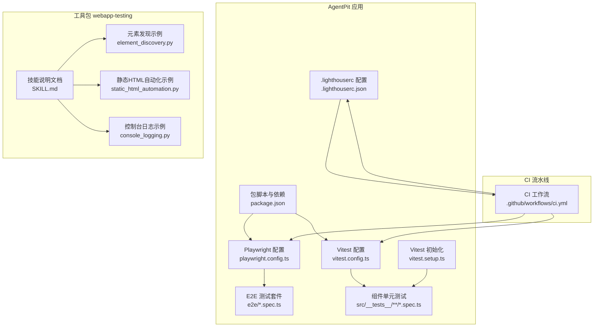
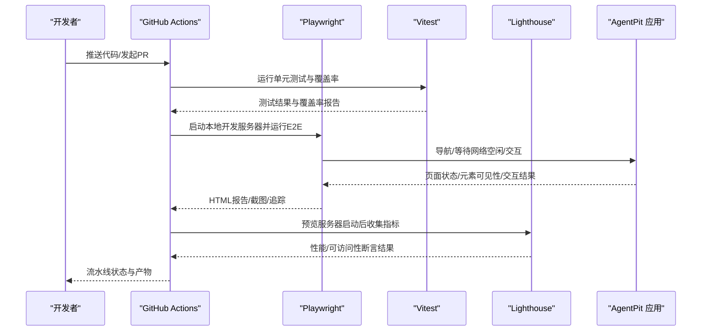
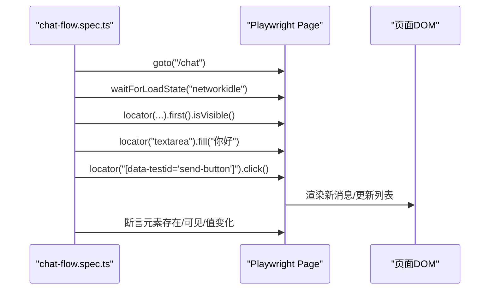
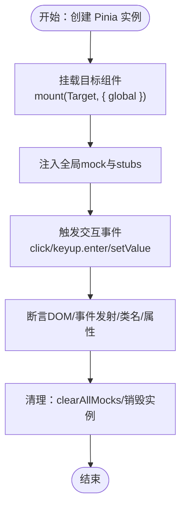
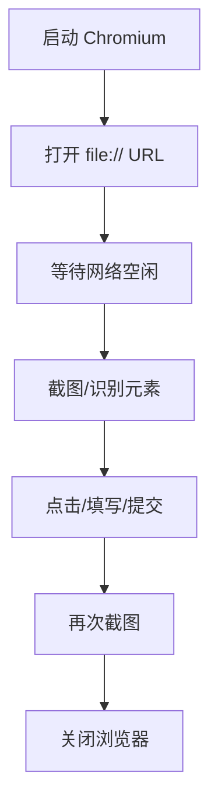
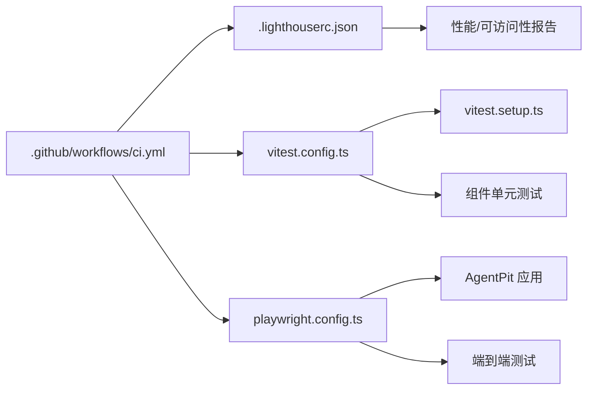

# Web应用测试

<cite>
**本文引用的文件**
- [apps/AgentPit/playwright.config.ts](file://apps/AgentPit/playwright.config.ts)
- [apps/AgentPit/vitest.config.ts](file://apps/AgentPit/vitest.config.ts)
- [apps/AgentPit/vitest.setup.ts](file://apps/AgentPit/vitest.setup.ts)
- [apps/AgentPit/.lighthouserc.json](file://apps/AgentPit/.lighthouserc.json)
- [apps/AgentPit/package.json](file://apps/AgentPit/package.json)
- [apps/AgentPit/e2e/chat-flow.spec.ts](file://apps/AgentPit/e2e/chat-flow.spec.ts)
- [apps/AgentPit/src/__tests__/components/layout/Header.spec.ts](file://apps/AgentPit/src/__tests__/components/layout/Header.spec.ts)
- [apps/AgentPit/src/__tests__/components/chat/ChatInterface.spec.ts](file://apps/AgentPit/src/__tests__/components/chat/ChatInterface.spec.ts)
- [.github/workflows/ci.yml](file://.github/workflows/ci.yml)
- [skills/daoSkilLs/skills/anthropics-skills/skills/webapp-testing/SKILL.md](file://skills/daoSkilLs/skills/anthropics-skills/skills/webapp-testing/SKILL.md)
- [skills/daoSkilLs/skills/anthropics-skills/skills/webapp-testing/examples/element_discovery.py](file://skills/daoSkilLs/skills/anthropics-skills/skills/webapp-testing/examples/element_discovery.py)
- [skills/daoSkilLs/skills/anthropics-skills/skills/webapp-testing/examples/static_html_automation.py](file://skills/daoSkilLs/skills/anthropics-skills/skills/webapp-testing/examples/static_html_automation.py)
- [skills/daoSkilLs/skills/anthropics-skills/skills/webapp-testing/examples/console_logging.py](file://skills/daoSkilLs/skills/anthropics-skills/skills/webapp-testing/examples/console_logging.py)
</cite>

## 目录
1. [简介](#简介)
2. [项目结构](#项目结构)
3. [核心组件](#核心组件)
4. [架构总览](#架构总览)
5. [详细组件分析](#详细组件分析)
6. [依赖关系分析](#依赖关系分析)
7. [性能考量](#性能考量)
8. [故障排查指南](#故障排查指南)
9. [结论](#结论)
10. [附录](#附录)

## 简介
本文件面向Web应用测试工程师，系统梳理该仓库中已有的自动化测试体系与最佳实践，覆盖端到端测试（E2E）、组件单元测试（Unit）、性能与可访问性评估以及持续集成流水线。文档重点说明：
- 测试环境搭建：浏览器配置、测试框架集成、数据准备与断言策略
- 不同类型测试策略：功能测试、UI测试、性能测试、兼容性测试
- 元素定位与交互模拟：Playwright与Vitest的典型用法
- 动态内容、异步操作与复杂交互的处理方式
- 测试报告生成、错误捕获与调试工具使用
- 在CI中进行测试自动化与并行执行策略
- 测试最佳实践与常见问题解决方案

## 项目结构
该仓库包含多个子应用与测试工具包，其中与Web应用测试直接相关的关键目录与文件如下：
- 应用层（AgentPit）：包含Playwright配置、Vitest配置、测试脚本与组件单元测试
- 工具包（webapp-testing）：提供Playwright本地自动化与静态HTML自动化示例
- CI流水线：GitHub Actions配置，串联格式检查、类型检查、单元测试、覆盖率上传与产物打包

**图表来源**
- [apps/AgentPit/playwright.config.ts:1-28](file://apps/AgentPit/playwright.config.ts#L1-L28)
- [apps/AgentPit/vitest.config.ts:1-48](file://apps/AgentPit/vitest.config.ts#L1-L48)
- [apps/AgentPit/vitest.setup.ts:1-47](file://apps/AgentPit/vitest.setup.ts#L1-L47)
- [apps/AgentPit/.lighthouserc.json:1-24](file://apps/AgentPit/.lighthouserc.json#L1-L24)
- [apps/AgentPit/package.json:1-74](file://apps/AgentPit/package.json#L1-L74)
- [apps/AgentPit/e2e/chat-flow.spec.ts:1-56](file://apps/AgentPit/e2e/chat-flow.spec.ts#L1-L56)
- [apps/AgentPit/src/__tests__/components/layout/Header.spec.ts:1-222](file://apps/AgentPit/src/__tests__/components/layout/Header.spec.ts#L1-L222)
- [apps/AgentPit/src/__tests__/components/chat/ChatInterface.spec.ts:1-172](file://apps/AgentPit/src/__tests__/components/chat/ChatInterface.spec.ts#L1-L172)
- [.github/workflows/ci.yml:1-67](file://.github/workflows/ci.yml#L1-L67)
- [skills/daoSkilLs/skills/anthropics-skills/skills/webapp-testing/SKILL.md:1-96](file://skills/daoSkilLs/skills/anthropics-skills/skills/webapp-testing/SKILL.md#L1-L96)
- [skills/daoSkilLs/skills/anthropics-skills/skills/webapp-testing/examples/element_discovery.py:1-40](file://skills/daoSkilLs/skills/anthropics-skills/skills/webapp-testing/examples/element_discovery.py#L1-L40)
- [skills/daoSkilLs/skills/anthropics-skills/skills/webapp-testing/examples/static_html_automation.py:1-33](file://skills/daoSkilLs/skills/anthropics-skills/skills/webapp-testing/examples/static_html_automation.py#L1-L33)
- [skills/daoSkilLs/skills/anthropics-skills/skills/webapp-testing/examples/console_logging.py:1-35](file://skills/daoSkilLs/skills/anthropics-skills/skills/webapp-testing/examples/console_logging.py#L1-L35)

**章节来源**
- [apps/AgentPit/playwright.config.ts:1-28](file://apps/AgentPit/playwright.config.ts#L1-L28)
- [apps/AgentPit/vitest.config.ts:1-48](file://apps/AgentPit/vitest.config.ts#L1-L48)
- [apps/AgentPit/vitest.setup.ts:1-47](file://apps/AgentPit/vitest.setup.ts#L1-L47)
- [apps/AgentPit/.lighthouserc.json:1-24](file://apps/AgentPit/.lighthouserc.json#L1-L24)
- [apps/AgentPit/package.json:1-74](file://apps/AgentPit/package.json#L1-L74)
- [.github/workflows/ci.yml:1-67](file://.github/workflows/ci.yml#L1-L67)

## 核心组件
- Playwright端到端测试：负责真实浏览器环境下的页面导航、元素定位、交互与截图/追踪等
- Vitest组件单元测试：基于jsdom的DOM模拟，用于组件行为、事件与状态断言
- Lighthouse性能与可访问性评估：在预览服务器上收集指标并断言阈值
- GitHub Actions CI：统一执行格式检查、类型检查、测试与覆盖率上传

**章节来源**
- [apps/AgentPit/playwright.config.ts:1-28](file://apps/AgentPit/playwright.config.ts#L1-L28)
- [apps/AgentPit/vitest.config.ts:1-48](file://apps/AgentPit/vitest.config.ts#L1-L48)
- [apps/AgentPit/.lighthouserc.json:1-24](file://apps/AgentPit/.lighthouserc.json#L1-L24)
- [.github/workflows/ci.yml:1-67](file://.github/workflows/ci.yml#L1-L67)

## 架构总览
下图展示了测试栈在本地与CI中的整体交互：

**图表来源**
- [.github/workflows/ci.yml:1-67](file://.github/workflows/ci.yml#L1-L67)
- [apps/AgentPit/playwright.config.ts:1-28](file://apps/AgentPit/playwright.config.ts#L1-L28)
- [apps/AgentPit/.lighthouserc.json:1-24](file://apps/AgentPit/.lighthouserc.json#L1-L24)
- [apps/AgentPit/vitest.config.ts:1-48](file://apps/AgentPit/vitest.config.ts#L1-L48)

## 详细组件分析

### Playwright 端到端测试
- 配置要点
  - 测试目录与并行策略：开启完全并行，CI环境限制工作者数量
  - 报告器：HTML报告；首次重试时启用trace；失败时自动截图
  - 项目设备：仅配置桌面Chrome；可通过新增项目扩展跨浏览器
  - Web Server：自动启动本地开发服务器，复用已有进程避免重复启动
- 典型用法
  - 页面导航与等待：使用网络空闲状态保证动态内容加载完成
  - 元素定位：优先使用语义化选择器（文本、role），其次CSS/属性
  - 交互与断言：可见性、输入值、点击、超时等待
  - 失败诊断：截图、trace、HTML报告

**图表来源**
- [apps/AgentPit/e2e/chat-flow.spec.ts:1-56](file://apps/AgentPit/e2e/chat-flow.spec.ts#L1-L56)
- [apps/AgentPit/playwright.config.ts:1-28](file://apps/AgentPit/playwright.config.ts#L1-L28)

**章节来源**
- [apps/AgentPit/playwright.config.ts:1-28](file://apps/AgentPit/playwright.config.ts#L1-L28)
- [apps/AgentPit/e2e/chat-flow.spec.ts:1-56](file://apps/AgentPit/e2e/chat-flow.spec.ts#L1-L56)

### Vitest 组件单元测试
- 配置要点
  - 环境：jsdom，模拟浏览器API（如matchMedia、ResizeObserver）
  - 覆盖率：多格式输出，按目录与阈值控制
  - 别名：@指向src，便于导入
  - 初始化：全局setup文件注入polyfill与mock
- 典型用法
  - 组件挂载：使用@vue/test-utils的mount，配合RouterLink Stub与Teleport
  - 状态隔离：每个用例创建独立Pinia实例，避免状态污染
  - 事件与交互：触发键盘事件、点击、setValue等，断言事件发射与类名变化
  - Mock：对第三方图表库、子组件与数据模块进行mock

**图表来源**
- [apps/AgentPit/src/__tests__/components/layout/Header.spec.ts:1-222](file://apps/AgentPit/src/__tests__/components/layout/Header.spec.ts#L1-L222)
- [apps/AgentPit/src/__tests__/components/chat/ChatInterface.spec.ts:1-172](file://apps/AgentPit/src/__tests__/components/chat/ChatInterface.spec.ts#L1-L172)
- [apps/AgentPit/vitest.setup.ts:1-47](file://apps/AgentPit/vitest.setup.ts#L1-L47)
- [apps/AgentPit/vitest.config.ts:1-48](file://apps/AgentPit/vitest.config.ts#L1-L48)

**章节来源**
- [apps/AgentPit/vitest.config.ts:1-48](file://apps/AgentPit/vitest.config.ts#L1-L48)
- [apps/AgentPit/vitest.setup.ts:1-47](file://apps/AgentPit/vitest.setup.ts#L1-L47)
- [apps/AgentPit/src/__tests__/components/layout/Header.spec.ts:1-222](file://apps/AgentPit/src/__tests__/components/layout/Header.spec.ts#L1-L222)
- [apps/AgentPit/src/__tests__/components/chat/ChatInterface.spec.ts:1-172](file://apps/AgentPit/src/__tests__/components/chat/ChatInterface.spec.ts#L1-L172)

### Lighthouse 性能与可访问性评估
- 配置要点
  - 收集：指定URL、运行次数、预览服务器命令与就绪模式
  - 断言：对性能、可访问性、最佳实践、SEO设置阈值
  - 上传：临时公开存储以便归档
- 使用建议
  - 在CI中先构建预览，再运行Lighthouse收集指标
  - 将断言阈值作为质量门禁，失败即阻断发布

**章节来源**
- [apps/AgentPit/.lighthouserc.json:1-24](file://apps/AgentPit/.lighthouserc.json#L1-L24)

### Playwright 静态HTML自动化与控制台日志
- 静态HTML自动化：通过file://协议打开本地HTML文件，截图、点击、填充表单、提交
- 控制台日志：注册console事件监听器，捕获并保存日志
- 元素发现：等待网络空闲后扫描按钮、链接、输入框，打印信息并截图

**图表来源**
- [skills/daoSkilLs/skills/anthropics-skills/skills/webapp-testing/examples/static_html_automation.py:1-33](file://skills/daoSkilLs/skills/anthropics-skills/skills/webapp-testing/examples/static_html_automation.py#L1-L33)
- [skills/daoSkilLs/skills/anthropics-skills/skills/webapp-testing/examples/console_logging.py:1-35](file://skills/daoSkilLs/skills/anthropics-skills/skills/webapp-testing/examples/console_logging.py#L1-L35)
- [skills/daoSkilLs/skills/anthropics-skills/skills/webapp-testing/examples/element_discovery.py:1-40](file://skills/daoSkilLs/skills/anthropics-skills/skills/webapp-testing/examples/element_discovery.py#L1-L40)

**章节来源**
- [skills/daoSkilLs/skills/anthropics-skills/skills/webapp-testing/SKILL.md:1-96](file://skills/daoSkilLs/skills/anthropics-skills/skills/webapp-testing/SKILL.md#L1-L96)
- [skills/daoSkilLs/skills/anthropics-skills/skills/webapp-testing/examples/static_html_automation.py:1-33](file://skills/daoSkilLs/skills/anthropics-skills/skills/webapp-testing/examples/static_html_automation.py#L1-L33)
- [skills/daoSkilLs/skills/anthropics-skills/skills/webapp-testing/examples/console_logging.py:1-35](file://skills/daoSkilLs/skills/anthropics-skills/skills/webapp-testing/examples/console_logging.py#L1-L35)
- [skills/daoSkilLs/skills/anthropics-skills/skills/webapp-testing/examples/element_discovery.py:1-40](file://skills/daoSkilLs/skills/anthropics-skills/skills/webapp-testing/examples/element_discovery.py#L1-L40)

## 依赖关系分析
- 测试框架与工具链
  - Playwright：E2E测试、浏览器自动化、截图、trace
  - Vitest：单元测试、覆盖率、jsdom环境
  - Lighthouse：性能与可访问性断言
  - GitHub Actions：流水线编排与制品上传
- 项目内依赖
  - AgentPit应用通过package.json脚本统一入口，CI中依次执行格式检查、类型检查、测试与构建
  - Playwright与Vitest共享同一测试脚本入口，分别针对不同层级的测试场景

**图表来源**
- [.github/workflows/ci.yml:1-67](file://.github/workflows/ci.yml#L1-L67)
- [apps/AgentPit/.lighthouserc.json:1-24](file://apps/AgentPit/.lighthouserc.json#L1-L24)
- [apps/AgentPit/vitest.config.ts:1-48](file://apps/AgentPit/vitest.config.ts#L1-L48)
- [apps/AgentPit/vitest.setup.ts:1-47](file://apps/AgentPit/vitest.setup.ts#L1-L47)
- [apps/AgentPit/playwright.config.ts:1-28](file://apps/AgentPit/playwright.config.ts#L1-L28)

**章节来源**
- [apps/AgentPit/package.json:1-74](file://apps/AgentPit/package.json#L1-L74)
- [.github/workflows/ci.yml:1-67](file://.github/workflows/ci.yml#L1-L67)

## 性能考量
- 并行执行
  - E2E：fullyParallel开启，最大化并发；CI中限制workers以稳定资源
  - 单测：jsdom轻量，建议按组件分组并行运行
- 等待策略
  - 使用networkidle等待动态内容加载完成，避免过早断言
  - 对于异步操作，结合显式等待与断言组合
- 覆盖率与报告
  - Vitest多格式覆盖率输出，结合CI上传Codecov
  - Lighthouse断言阈值作为性能门禁

**章节来源**
- [apps/AgentPit/playwright.config.ts:1-28](file://apps/AgentPit/playwright.config.ts#L1-L28)
- [apps/AgentPit/vitest.config.ts:1-48](file://apps/AgentPit/vitest.config.ts#L1-L48)
- [apps/AgentPit/.lighthouserc.json:1-24](file://apps/AgentPit/.lighthouserc.json#L1-L24)

## 故障排查指南
- 浏览器API未定义（如matchMedia）
  - 解决：在vitest.setup.ts中注入polyfill或使用vi.fn.mockImplementation
  - 参考：[apps/AgentPit/vitest.setup.ts:1-47](file://apps/AgentPit/vitest.setup.ts#L1-L47)
- E2E不稳定或元素找不到
  - 解决：增加waitForLoadState('networkidle')，使用更稳定的定位器（text/role），必要时添加显式等待
  - 参考：[apps/AgentPit/e2e/chat-flow.spec.ts:1-56](file://apps/AgentPit/e2e/chat-flow.spec.ts#L1-L56)
- CI覆盖率未上传
  - 检查Codecov Action配置与lcov路径是否一致
  - 参考：[apps/AgentPit/vitest.config.ts:1-48](file://apps/AgentPit/vitest.config.ts#L1-L48)，[ci.yml:51-55](file://.github/workflows/ci.yml#L51-L55)
- Lighthouse断言失败
  - 调整阈值或修复页面性能/可访问性问题
  - 参考：[apps/AgentPit/.lighthouserc.json:1-24](file://apps/AgentPit/.lighthouserc.json#L1-L24)

**章节来源**
- [apps/AgentPit/vitest.setup.ts:1-47](file://apps/AgentPit/vitest.setup.ts#L1-L47)
- [apps/AgentPit/e2e/chat-flow.spec.ts:1-56](file://apps/AgentPit/e2e/chat-flow.spec.ts#L1-L56)
- [.github/workflows/ci.yml:51-55](file://.github/workflows/ci.yml#L51-L55)
- [apps/AgentPit/.lighthouserc.json:1-24](file://apps/AgentPit/.lighthouserc.json#L1-L24)

## 结论
该仓库已具备完善的前端测试基础设施：Playwright负责端到端验证，Vitest负责组件级行为与状态断言，Lighthouse提供性能与可访问性保障，CI流水线串联了从代码规范到产物发布的全流程。建议在现有基础上继续扩展：
- 增加更多E2E场景（购物旅程、社交互动等）
- 引入跨浏览器项目，提升兼容性覆盖
- 将Lighthouse断言纳入质量门禁
- 逐步引入集成测试与API测试，形成完整的测试金字塔

## 附录
- 测试脚本示例路径
  - E2E聊天流程：[apps/AgentPit/e2e/chat-flow.spec.ts:1-56](file://apps/AgentPit/e2e/chat-flow.spec.ts#L1-L56)
  - 组件单元测试（Header）：[apps/AgentPit/src/__tests__/components/layout/Header.spec.ts:1-222](file://apps/AgentPit/src/__tests__/components/layout/Header.spec.ts#L1-L222)
  - 组件单元测试（ChatInterface）：[apps/AgentPit/src/__tests__/components/chat/ChatInterface.spec.ts:1-172](file://apps/AgentPit/src/__tests__/components/chat/ChatInterface.spec.ts#L1-L172)
  - 静态HTML自动化：[skills/daoSkilLs/skills/anthropics-skills/skills/webapp-testing/examples/static_html_automation.py:1-33](file://skills/daoSkilLs/skills/anthropics-skills/skills/webapp-testing/examples/static_html_automation.py#L1-L33)
  - 控制台日志捕获：[skills/daoSkilLs/skills/anthropics-skills/skills/webapp-testing/examples/console_logging.py:1-35](file://skills/daoSkilLs/skills/anthropics-skills/skills/webapp-testing/examples/console_logging.py#L1-L35)
  - 元素发现示例：[skills/daoSkilLs/skills/anthropics-skills/skills/webapp-testing/examples/element_discovery.py:1-40](file://skills/daoSkilLs/skills/anthropics-skills/skills/webapp-testing/examples/element_discovery.py#L1-L40)
- 持续集成配置
  - CI工作流：[ci.yml:1-67](file://.github/workflows/ci.yml#L1-L67)
  - Playwright配置：[apps/AgentPit/playwright.config.ts:1-28](file://apps/AgentPit/playwright.config.ts#L1-L28)
  - Vitest配置：[apps/AgentPit/vitest.config.ts:1-48](file://apps/AgentPit/vitest.config.ts#L1-L48)
  - Lighthouse配置：[apps/AgentPit/.lighthouserc.json:1-24](file://apps/AgentPit/.lighthouserc.json#L1-L24)
  - 包脚本与依赖：[apps/AgentPit/package.json:1-74](file://apps/AgentPit/package.json#L1-L74)