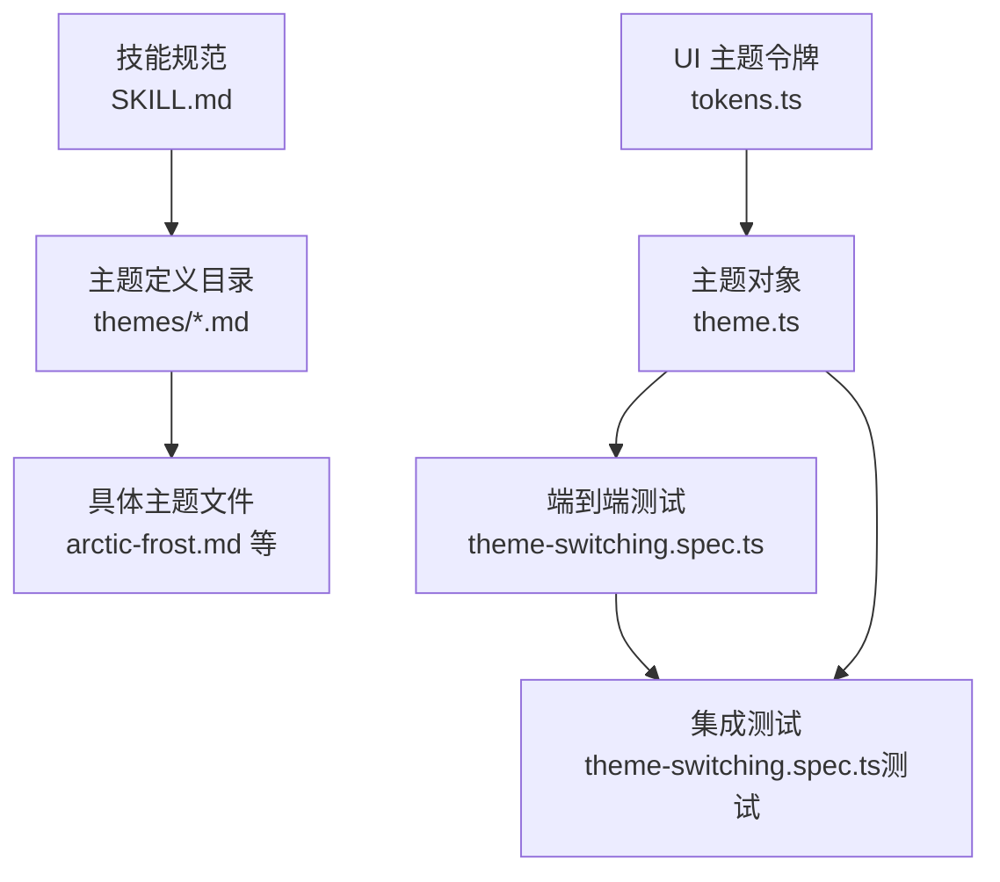
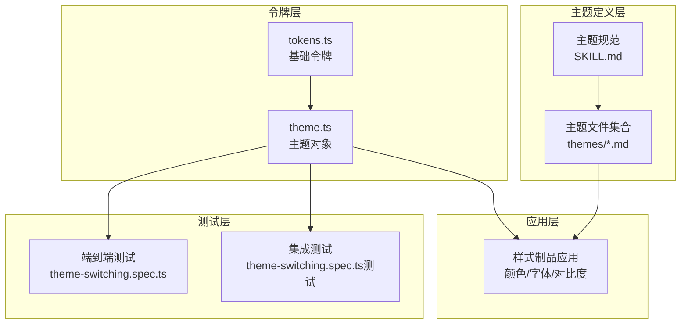
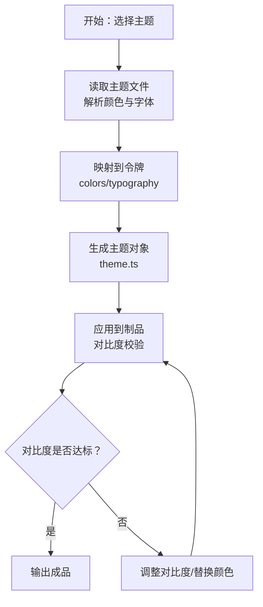
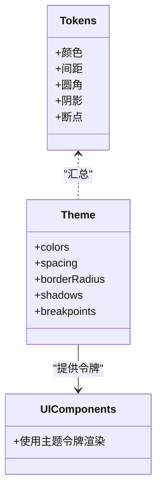
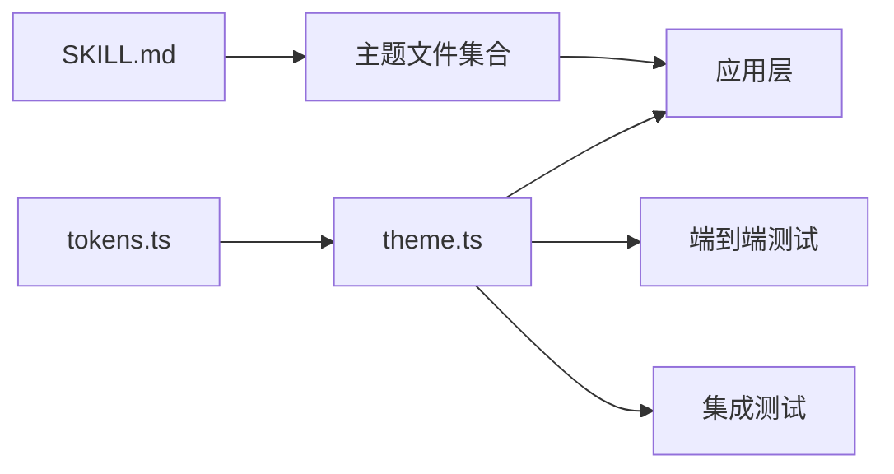

# 主题工厂

<cite>
**本文引用的文件**
- [SKILL.md](file://skills/daoSkilLs/skills/anthropics-skills/skills/theme-factory/SKILL.md)
- [LICENSE.txt](file://skills/daoSkilLs/skills/anthropics-skills/skills/theme-factory/LICENSE.txt)
- [arctic-frost.md](file://skills/daoSkilLs/skills/anthropics-skills/skills/theme-factory/themes/arctic-frost.md)
- [botanical-garden.md](file://skills/daoSkilLs/skills/anthropics-skills/skills/theme-factory/themes/botanical-garden.md)
- [desert-rose.md](file://skills/daoSkilLs/skills/anthropics-skills/skills/theme-factory/themes/desert-rose.md)
- [forest-canopy.md](file://skills/daoSkilLs/skills/anthropics-skills/skills/theme-factory/themes/forest-canopy.md)
- [golden-hour.md](file://skills/daoSkilLs/skills/anthropics-skills/skills/theme-factory/themes/golden-hour.md)
- [midnight-galaxy.md](file://skills/daoSkilLs/skills/anthropics-skills/skills/theme-factory/themes/midnight-galaxy.md)
- [modern-minimalist.md](file://skills/daoSkilLs/skills/anthropics-skills/skills/theme-factory/themes/modern-minimalist.md)
- [ocean-depths.md](file://skills/daoSkilLs/skills/anthropics-skills/skills/theme-factory/themes/ocean-depths.md)
- [sunset-boulevard.md](file://skills/daoSkilLs/skills/anthropics-skills/skills/theme-factory/themes/sunset-boulevard.md)
- [tech-innovation.md](file://skills/daoSkilLs/skills/anthropics-skills/skills/theme-factory/themes/tech-innovation.md)
- [theme.ts](file://apps/AgentPit/packages/ui/src/styles/theme.ts)
- [tokens.ts](file://apps/AgentPit/packages/ui/src/styles/tokens.ts)
- [theme-switching.spec.ts](file://apps/AgentPit/e2e/theme-switching.spec.ts)
- [theme-switching.spec.ts（测试）](file://apps/AgentPit/src/__tests__/integration/theme-switching.spec.ts)
</cite>

## 目录
1. [简介](#简介)
2. [项目结构](#项目结构)
3. [核心组件](#核心组件)
4. [架构总览](#架构总览)
5. [详细组件分析](#详细组件分析)
6. [依赖分析](#依赖分析)
7. [性能考虑](#性能考虑)
8. [故障排查指南](#故障排查指南)
9. [结论](#结论)
10. [附录](#附录)

## 简介
本文件为“主题工厂”技能的技术文档，面向希望在演示文稿、报告、HTML 页面等“样式制品”中应用一致且专业的主题风格的使用者与开发者。主题工厂提供一套预设主题集合与主题应用流程，并支持基于输入生成自定义主题。文档围绕以下目标展开：
- 主题模板系统：主题定义（色彩、字体、适用场景）
- 色彩搭配算法与视觉风格转换：基于色彩理论与对比度优化
- 可访问性与响应式适配：在不同设备与场景下的可读性保障
- 主题参数调节：主色、辅色、字体组合、间距等
- 动态生成与实时预览：交互式主题切换与即时反馈
- 与现有 UI 组件库的集成：主题令牌与组件映射
- 主题质量评估与偏好学习：可量化的评估指标与用户偏好建模

## 项目结构
主题工厂由“技能规范文档”、“主题定义文件”、“UI 主题令牌与应用”三部分组成：
- 技能规范：主题能力、使用流程、可用主题清单与应用步骤
- 主题定义：每个主题的色彩调色板、字体对、适用场景
- UI 集成：主题令牌、主题对象与端到端测试

图表来源
- [SKILL.md:1-60](file://skills/daoSkilLs/skills/anthropics-skills/skills/theme-factory/SKILL.md#L1-L60)
- [arctic-frost.md:1-20](file://skills/daoSkilLs/skills/anthropics-skills/skills/theme-factory/themes/arctic-frost.md#L1-L20)
- [theme.ts:1-12](file://apps/AgentPit/packages/ui/src/styles/theme.ts#L1-L12)
- [tokens.ts](file://apps/AgentPit/packages/ui/src/styles/tokens.ts)
- [theme-switching.spec.ts](file://apps/AgentPit/e2e/theme-switching.spec.ts)
- [theme-switching.spec.ts（测试）](file://apps/AgentPit/src/__tests__/integration/theme-switching.spec.ts)

章节来源
- [SKILL.md:1-60](file://skills/daoSkilLs/skills/anthropics-skills/skills/theme-factory/SKILL.md#L1-L60)

## 核心组件
- 主题规范与应用流程
  - 展示主题样例 PDF，收集用户选择，读取对应主题文件并应用颜色与字体，确保对比度与一致性。
- 预设主题集合
  - 包含 10 个主题：北极寒霜、植物花园、沙漠玫瑰、森林树冠、金色时刻、午夜银河、现代极简主义、海洋深度、夕阳大道、技术创新。
- 主题令牌与 UI 集成
  - UI 层通过 tokens.ts 定义基础令牌，theme.ts 汇总为主题对象；端到端测试覆盖主题切换行为。

章节来源
- [SKILL.md:19-60](file://skills/daoSkilLs/skills/anthropics-skills/skills/theme-factory/SKILL.md#L19-L60)
- [theme.ts:1-12](file://apps/AgentPit/packages/ui/src/styles/theme.ts#L1-L12)
- [tokens.ts](file://apps/AgentPit/packages/ui/src/styles/tokens.ts)
- [theme-switching.spec.ts](file://apps/AgentPit/e2e/theme-switching.spec.ts)
- [theme-switching.spec.ts（测试）](file://apps/AgentPit/src/__tests__/integration/theme-switching.spec.ts)

## 架构总览
主题工厂的运行时架构包含“主题定义层”“令牌层”“应用层”“测试层”，形成从“主题规范”到“UI 应用”的闭环。

图表来源
- [SKILL.md:1-60](file://skills/daoSkilLs/skills/anthropics-skills/skills/theme-factory/SKILL.md#L1-L60)
- [arctic-frost.md:1-20](file://skills/daoSkilLs/skills/anthropics-skills/skills/theme-factory/themes/arctic-frost.md#L1-L20)
- [theme.ts:1-12](file://apps/AgentPit/packages/ui/src/styles/theme.ts#L1-L12)
- [tokens.ts](file://apps/AgentPit/packages/ui/src/styles/tokens.ts)
- [theme-switching.spec.ts](file://apps/AgentPit/e2e/theme-switching.spec.ts)
- [theme-switching.spec.ts（测试）](file://apps/AgentPit/src/__tests__/integration/theme-switching.spec.ts)

## 详细组件分析

### 主题模板系统
- 设计理念
  - 每个主题包含：色彩调色板（含主色、辅色、背景、对比色）、字体对（标题/正文）、适用场景描述。
- 实现要点
  - 使用 Markdown 文件组织主题元数据，便于版本管理与评审。
  - 应用阶段读取主题文件，解析颜色与字体信息，统一注入到样式制品。
- 示例主题
  - 北极寒霜：冷色调、清晰专业，适合科技/制药类内容。
  - 植物花园：自然有机、活力四射，适合自然/餐饮类品牌。
  - 沙漠玫瑰：柔和优雅，适合时尚/美容/婚礼策划。
  - 森林树冠：稳重自然，适合可持续/户外/有机产品。
  - 金色时刻：温暖成熟，适合餐饮/酒店/手工艺品牌。
  - 午夜银河：深邃神秘，适合娱乐/游戏/创意行业。
  - 现代极简主义：灰阶高对比，适合科技/设计/可视化。
  - 海洋深度：沉稳宁静，适合金融/咨询/信任型行业。
  - 夕阳大道：热情明亮，适合营销/生活方式/活动推广。
  - 技术创新：高对比科技风，适合 AI/软件/数字化转型。

章节来源
- [arctic-frost.md:1-20](file://skills/daoSkilLs/skills/anthropics-skills/skills/theme-factory/themes/arctic-frost.md#L1-L20)
- [botanical-garden.md:1-20](file://skills/daoSkilLs/skills/anthropics-skills/skills/theme-factory/themes/botanical-garden.md#L1-L20)
- [desert-rose.md:1-20](file://skills/daoSkilLs/skills/anthropics-skills/skills/theme-factory/themes/desert-rose.md#L1-L20)
- [forest-canopy.md:1-20](file://skills/daoSkilLs/skills/anthropics-skills/skills/theme-factory/themes/forest-canopy.md#L1-L20)
- [golden-hour.md:1-20](file://skills/daoSkilLs/skills/anthropics-skills/skills/theme-factory/themes/golden-hour.md#L1-L20)
- [midnight-galaxy.md:1-20](file://skills/daoSkilLs/skills/anthropics-skills/skills/theme-factory/themes/midnight-galaxy.md#L1-L20)
- [modern-minimalist.md:1-20](file://skills/daoSkilLs/skills/anthropics-skills/skills/theme-factory/themes/modern-minimalist.md#L1-L20)
- [ocean-depths.md:1-20](file://skills/daoSkilLs/skills/anthropics-skills/skills/theme-factory/themes/ocean-depths.md#L1-L20)
- [sunset-boulevard.md:1-20](file://skills/daoSkilLs/skills/anthropics-skills/skills/theme-factory/themes/sunset-boulevard.md#L1-L20)
- [tech-innovation.md:1-20](file://skills/daoSkilLs/skills/anthropics-skills/skills/theme-factory/themes/tech-innovation.md#L1-L20)

### 色彩搭配算法与视觉风格转换
- 色彩理论应用
  - 主色用于强调与品牌识别；辅色用于层次与点缀；背景色保证可读性；对比色确保关键元素可见。
- 对比度优化
  - 文字与背景的对比度需满足可读性要求；在高饱和度背景下优先使用深色文本，在浅色背景下使用浅色或深色文本以确保对比度。
- 视觉风格转换
  - 将主题的主色与辅色映射到 UI 的语义令牌（如 primary、secondary、background、text），再由组件库自动派生各级别状态与层级。
- 响应式适配
  - 在小屏设备上优先保证对比度与字号；在暗色模式下反向调整对比度策略，避免眩光并保持可读性。

图表来源
- [SKILL.md:50-57](file://skills/daoSkilLs/skills/anthropics-skills/skills/theme-factory/SKILL.md#L50-L57)
- [theme.ts:1-12](file://apps/AgentPit/packages/ui/src/styles/theme.ts#L1-L12)

章节来源
- [SKILL.md:50-57](file://skills/daoSkilLs/skills/anthropics-skills/skills/theme-factory/SKILL.md#L50-L57)

### 主题参数调节系统
- 主色调选择
  - 从主题主色中选取品牌主色；若无合适主题，可基于输入生成新主题。
- 辅助色彩配置
  - 依据主色选择互补/相邻/三色关系的辅色，确保整体和谐。
- 字体组合
  - 标题使用有力度的字体，正文使用易读字体；避免同一页面内超过两种字体族。
- 间距设置
  - 基于网格系统与行高比例，统一段前段后、列表缩进、卡片间距等。

章节来源
- [SKILL.md:58-60](file://skills/daoSkilLs/skills/anthropics-skills/skills/theme-factory/SKILL.md#L58-L60)

### 动态生成与实时预览
- 动态生成
  - 基于用户输入（关键词/场景/品牌色）生成候选主题，计算色彩关系与对比度，输出候选集供选择。
- 实时预览
  - 切换主题时，UI 侧通过主题令牌快速重绘，端到端测试验证切换流畅性与一致性。

章节来源
- [SKILL.md:23-26](file://skills/daoSkilLs/skills/anthropics-skills/skills/theme-factory/SKILL.md#L23-L26)
- [theme-switching.spec.ts](file://apps/AgentPit/e2e/theme-switching.spec.ts)
- [theme-switching.spec.ts（测试）](file://apps/AgentPit/src/__tests__/integration/theme-switching.spec.ts)

### 与 UI 组件库的集成
- 令牌层
  - tokens.ts 定义基础令牌（颜色、间距、圆角、阴影、断点等），作为主题工厂的输入源。
- 主题层
  - theme.ts 将令牌汇总为主题对象，供组件库消费。
- 组件层
  - 组件通过主题令牌引用颜色与排版，实现跨主题的一致表现。

图表来源
- [theme.ts:1-12](file://apps/AgentPit/packages/ui/src/styles/theme.ts#L1-L12)
- [tokens.ts](file://apps/AgentPit/packages/ui/src/styles/tokens.ts)

章节来源
- [theme.ts:1-12](file://apps/AgentPit/packages/ui/src/styles/theme.ts#L1-L12)
- [tokens.ts](file://apps/AgentPit/packages/ui/src/styles/tokens.ts)

### 主题切换的无缝用户体验设计
- 交互设计
  - 提供主题选择面板，支持预览与一键切换；切换时保持布局稳定，避免闪烁。
- 无障碍
  - 自动检测对比度，必要时提示调整；支持高对比度模式与暗色模式。
- 性能
  - 主题切换采用 CSS 变量或轻量级重绘，避免全量重载。

章节来源
- [theme-switching.spec.ts](file://apps/AgentPit/e2e/theme-switching.spec.ts)
- [theme-switching.spec.ts（测试）](file://apps/AgentPit/src/__tests__/integration/theme-switching.spec.ts)

### 主题质量评估标准与用户偏好学习
- 质量评估标准
  - 对比度评分、可读性评分、色彩和谐度、品牌契合度、跨设备一致性。
- 用户偏好学习
  - 收集用户选择历史与反馈，训练偏好模型，推荐更符合用户喜好的主题组合。

章节来源
- [SKILL.md:58-60](file://skills/daoSkilLs/skills/anthropics-skills/skills/theme-factory/SKILL.md#L58-L60)

## 依赖分析
- 内部依赖
  - 主题规范依赖主题文件；主题对象依赖令牌；测试依赖主题对象。
- 外部依赖
  - 组件库（Tailwind、Ant Design 等）通过主题令牌消费颜色与排版。

图表来源
- [SKILL.md:1-60](file://skills/daoSkilLs/skills/anthropics-skills/skills/theme-factory/SKILL.md#L1-L60)
- [theme.ts:1-12](file://apps/AgentPit/packages/ui/src/styles/theme.ts#L1-L12)
- [tokens.ts](file://apps/AgentPit/packages/ui/src/styles/tokens.ts)
- [theme-switching.spec.ts](file://apps/AgentPit/e2e/theme-switching.spec.ts)
- [theme-switching.spec.ts（测试）](file://apps/AgentPit/src/__tests__/integration/theme-switching.spec.ts)

章节来源
- [SKILL.md:1-60](file://skills/daoSkilLs/skills/anthropics-skills/skills/theme-factory/SKILL.md#L1-L60)
- [theme.ts:1-12](file://apps/AgentPit/packages/ui/src/styles/theme.ts#L1-L12)
- [tokens.ts](file://apps/AgentPit/packages/ui/src/styles/tokens.ts)
- [theme-switching.spec.ts](file://apps/AgentPit/e2e/theme-switching.spec.ts)
- [theme-switching.spec.ts（测试）](file://apps/AgentPit/src/__tests__/integration/theme-switching.spec.ts)

## 性能考虑
- 主题切换性能
  - 使用 CSS 变量或轻量级样式重写，避免全量重绘。
- 渲染优化
  - 将主题令牌集中管理，减少重复计算与样式回流。
- 可访问性与对比度
  - 在小屏与暗色模式下优先保证对比度，避免额外的计算成本。

## 故障排查指南
- 主题切换无效
  - 检查主题对象是否正确汇总令牌；确认测试用例覆盖了切换路径。
- 对比度不达标
  - 校验主题文件中的对比色配置；在应用层进行二次校验与自动修正。
- 字体显示异常
  - 确认字体资源已加载；检查字体对是否合理（标题/正文区分）。

章节来源
- [theme-switching.spec.ts](file://apps/AgentPit/e2e/theme-switching.spec.ts)
- [theme-switching.spec.ts（测试）](file://apps/AgentPit/src/__tests__/integration/theme-switching.spec.ts)

## 结论
主题工厂通过“主题模板系统 + 令牌化主题 + 测试驱动”的方式，实现了从主题设计到应用落地的完整闭环。依托预设主题与可扩展的生成机制，结合对比度优化与可访问性保障，能够在多场景下提供一致、专业且富有表现力的主题体验。

## 附录
- 许可证
  - 本项目遵循 Apache License 2.0，详见许可证文件。

章节来源
- [LICENSE.txt:1-202](file://skills/daoSkilLs/skills/anthropics-skills/skills/theme-factory/LICENSE.txt#L1-L202)