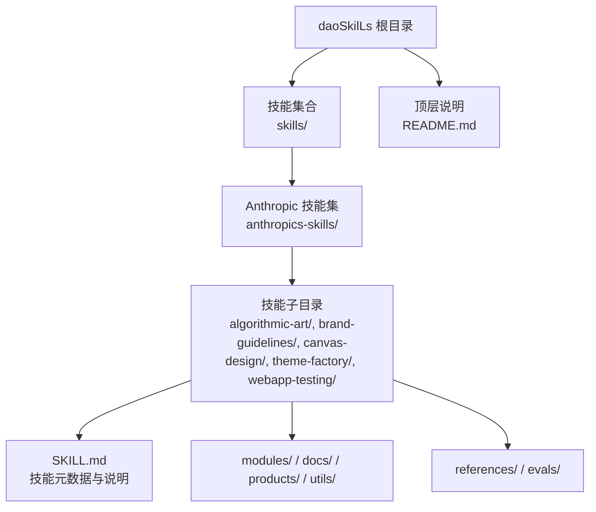
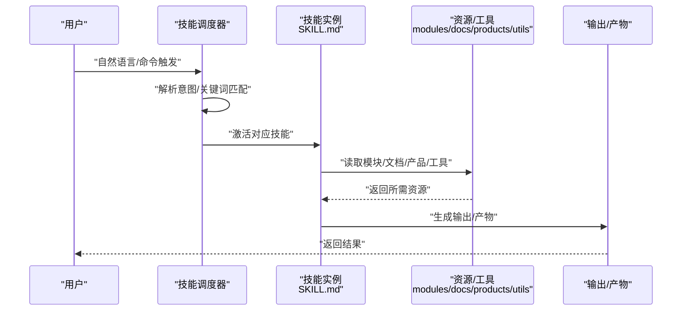
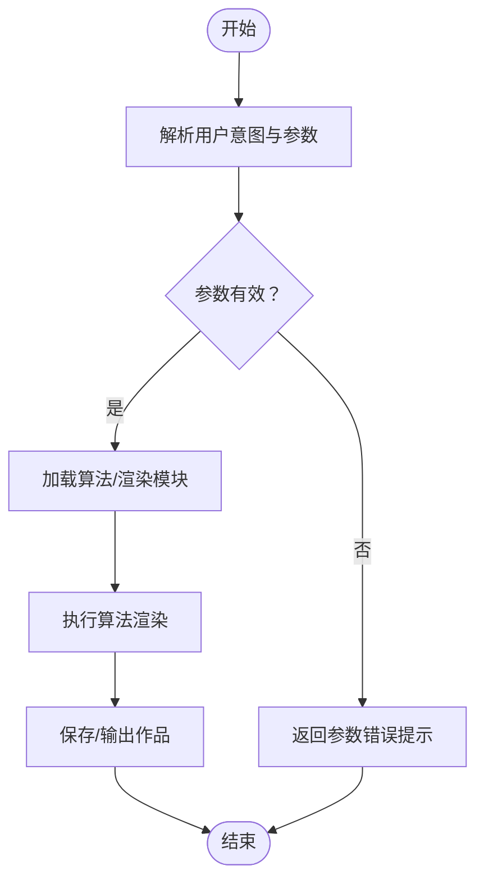
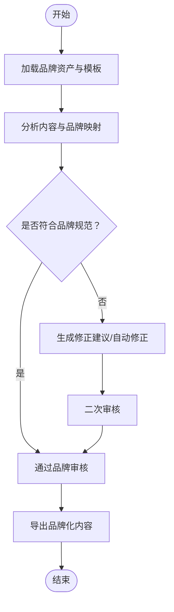
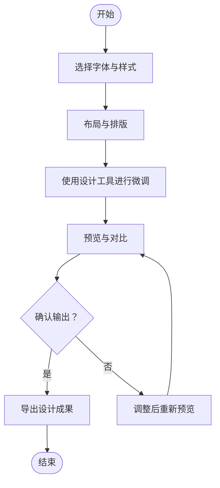
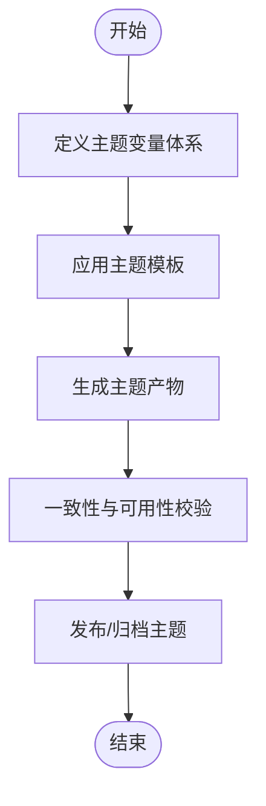
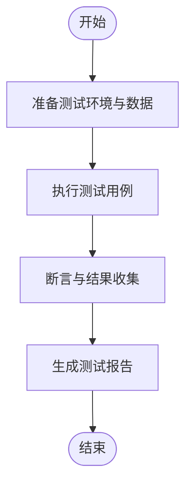
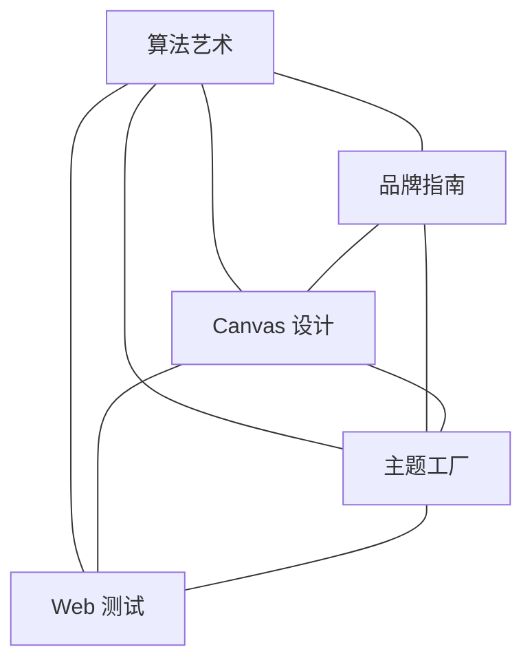

# 其他专用技能

<cite>
**本文引用的文件**
- [技能总览](file://skills/daoSkilLs/README.md)
- [技能集合说明](file://skills/daoSkilLs/skills/anthropics-skills/README.md)
- [算法艺术 SKILL.md](file://skills/daoSkilLs/skills/anthropics-skills/skills/algorithmic-art/SKILL.md)
- [品牌指南 SKILL.md](file://skills/daoSkilLs/skills/anthropics-skills/skills/brand-guidelines/SKILL.md)
- [Canvas 设计 SKILL.md](file://skills/daoSkilLs/skills/anthropics-skills/skills/canvas-design/SKILL.md)
- [主题工厂 SKILL.md](file://skills/daoSkilLs/skills/anthropics-skills/skills/theme-factory/SKILL.md)
- [Web 应用测试 SKILL.md](file://skills/daoSkilLs/skills/anthropics-skills/skills/webapp-testing/SKILL.md)
</cite>

## 目录
1. [简介](#简介)
2. [项目结构](#项目结构)
3. [核心技能概览](#核心技能概览)
4. [架构总览](#架构总览)
5. [详细技能分析](#详细技能分析)
6. [依赖关系分析](#依赖关系分析)
7. [性能考量](#性能考量)
8. [故障排查指南](#故障排查指南)
9. [结论](#结论)

## 简介
本文件面向“其他专用技能”，聚焦算法艺术生成、品牌指南管理、Canvas 设计工具、主题工厂、Web 应用测试等多样化技能。文档从系统架构、组件关系、数据流、处理逻辑、集成点、错误处理与性能特征等方面进行深入解析，并提供各技能的触发条件、配置要求与最佳实践，帮助开发者与使用者高效落地。

## 项目结构
daoSkilLs 是 daoApps 生态的技能中心，统一管理各类可调用技能，支持标准化、可重用与可扩展。其核心由三部分组成：
- 顶层说明：技能目录定位、角色与用途、通用使用模式与开发规范
- 技能集合：按领域划分的技能集合，如支付集成、任务总结、Anthropic 官方技能集
- 技能子目录：每个技能独立目录，包含 SKILL.md（技能元数据与说明）、modules/docs/products/utils/references/evals 等

图示来源
- [技能总览:164-231](file://skills/daoSkilLs/README.md#L164-L231)
- [技能集合说明:24-27](file://skills/daoSkilLs/skills/anthropics-skills/README.md#L24-L27)

章节来源
- [技能总览:1-231](file://skills/daoSkilLs/README.md#L1-L231)
- [技能集合说明:1-95](file://skills/daoSkilLs/skills/anthropics-skills/README.md#L1-L95)

## 核心技能概览
本节对五类“其他专用技能”进行快速扫描式介绍，后续章节将逐项深入。

- 算法艺术生成：面向生成式艺术创作，强调创意与参数化控制，适合视觉设计、艺术实验与创意产出。
- 品牌指南管理：面向企业品牌一致性维护，提供品牌元素、文案规范、视觉风格的标准化管理与执行。
- Canvas 设计工具：面向图形与排版设计，强调字体库管理与设计工具链整合，适合 UI/UX 设计与品牌物料制作。
- 主题工厂：面向主题创建与管理，提供主题模板、变量体系与批量生成能力，适合多端一致性与品牌化。
- Web 应用测试：面向前端/全栈测试自动化，覆盖端到端测试、跨浏览器兼容与回归验证，适合持续交付与质量保障。

章节来源
- [技能总览:148-163](file://skills/daoSkilLs/README.md#L148-L163)

## 架构总览
技能系统采用“技能即插件”的动态加载模式：每个技能以独立目录存在，内置 SKILL.md 作为元数据与指令载体；系统通过触发条件匹配技能，再按技能内部流程执行相应动作。典型调用链如下：

图示来源
- [技能总览:232-242](file://skills/daoSkilLs/README.md#L232-L242)

章节来源
- [技能总览:232-242](file://skills/daoSkilLs/README.md#L232-L242)

## 详细技能分析

### 算法艺术生成
- 角色与定位：生成式艺术创作的技能入口，面向创意与实验场景，强调参数化与可重复的艺术生成流程。
- 触发条件：当用户表达“生成艺术作品”“算法艺术”“生成式创作”等意图时触发。
- 使用方法：通过 SKILL.md 中的示例与指南，结合 modules/docs/products/utils 中的模块化资源，完成从参数设定到艺术作品输出的全流程。
- 配置要求：通常无需外部依赖，但需准备合适的输入参数与渲染环境；若涉及外部服务，应在 SKILL.md 中明确说明。
- 最佳实践：
  - 明确艺术风格与约束边界，避免无界探索导致的资源浪费
  - 将参数化与模板化结合，提升可复用性
  - 保留中间态与草稿，便于回溯与迭代

图示来源
- [算法艺术 SKILL.md:1-200](file://skills/daoSkilLs/skills/anthropics-skills/skills/algorithmic-art/SKILL.md#L1-L200)

章节来源
- [算法艺术 SKILL.md:1-200](file://skills/daoSkilLs/skills/anthropics-skills/skills/algorithmic-art/SKILL.md#L1-L200)

### 品牌指南管理
- 角色与定位：维护品牌一致性，确保跨渠道、跨介质的品牌表达统一。
- 触发条件：当用户提出“品牌规范”“品牌一致性”“品牌文案校验”“视觉风格统一”等需求时触发。
- 使用方法：通过 SKILL.md 的品牌元素清单、文案模板与执行流程，对内容进行品牌化改造与一致性校验。
- 配置要求：建立品牌资产库（颜色、字体、图标、文案模板），并在 SKILL.md 中声明依赖与配置项。
- 最佳实践：
  - 将品牌元素与文案模板结构化，便于检索与替换
  - 建立“品牌合规检查清单”，在生成/编辑流程中自动校验
  - 为不同渠道（网页、移动端、印刷品）维护差异化模板

图示来源
- [品牌指南 SKILL.md:1-200](file://skills/daoSkilLs/skills/anthropics-skills/skills/brand-guidelines/SKILL.md#L1-L200)

章节来源
- [品牌指南 SKILL.md:1-200](file://skills/daoSkilLs/skills/anthropics-skills/skills/brand-guidelines/SKILL.md#L1-L200)

### Canvas 设计工具
- 角色与定位：提供图形与排版设计能力，重点在于字体库管理与设计工具链整合。
- 触发条件：当用户提出“设计图形”“排版优化”“字体选择”“设计工具使用”等需求时触发。
- 使用方法：通过 SKILL.md 的设计流程与工具说明，结合字体库与设计模块，完成从草图到成品的设计闭环。
- 配置要求：维护字体库索引与可用字体清单，确保渲染一致性；必要时在 SKILL.md 中声明外部字体/渲染依赖。
- 最佳实践：
  - 建立字体分级与使用规范，避免过度装饰
  - 将常用布局模板与配色方案固化为模板库
  - 在输出前进行跨设备/跨浏览器的渲染一致性检查

图示来源
- [Canvas 设计 SKILL.md:1-200](file://skills/daoSkilLs/skills/anthropics-skills/skills/canvas-design/SKILL.md#L1-L200)

章节来源
- [Canvas 设计 SKILL.md:1-200](file://skills/daoSkilLs/skills/anthropics-skills/skills/canvas-design/SKILL.md#L1-L200)

### 主题工厂
- 角色与定位：面向主题创建与管理，提供主题模板、变量体系与批量生成能力，确保多端一致性与品牌化。
- 触发条件：当用户提出“创建主题”“主题变量管理”“批量主题生成”“主题切换”等需求时触发。
- 使用方法：通过 SKILL.md 的主题模板与变量体系，结合生成流程，完成主题的创建、校验与发布。
- 配置要求：建立主题变量表（颜色、间距、字号、阴影等），在 SKILL.md 中声明变量映射与生成规则。
- 最佳实践：
  - 将变量与层级化命名规范结合，降低耦合度
  - 为暗黑/明亮模式提供对称的变量映射
  - 建立主题变更影响矩阵，辅助回归与一致性检查

图示来源
- [主题工厂 SKILL.md:1-200](file://skills/daoSkilLs/skills/anthropics-skills/skills/theme-factory/SKILL.md#L1-L200)

章节来源
- [主题工厂 SKILL.md:1-200](file://skills/daoSkilLs/skills/anthropics-skills/skills/theme-factory/SKILL.md#L1-L200)

### Web 应用测试
- 角色与定位：面向前端/全栈测试自动化，覆盖端到端测试、跨浏览器兼容与回归验证，支撑持续交付与质量保障。
- 触发条件：当用户提出“测试页面”“自动化测试”“跨浏览器验证”“回归测试”等需求时触发。
- 使用方法：通过 SKILL.md 的测试流程与工具说明，结合测试脚本与断言规则，完成从测试用例到报告输出的闭环。
- 配置要求：在 SKILL.md 中声明测试环境、浏览器矩阵、断言策略与报告格式；必要时提供测试数据准备与清理流程。
- 最佳实践：
  - 将测试用例与页面元素定位策略解耦，提升稳定性
  - 建立失败重试与截图/日志采集机制
  - 结合 CI/CD，实现自动化触发与结果通知

图示来源
- [Web 应用测试 SKILL.md:1-200](file://skills/daoSkilLs/skills/anthropics-skills/skills/webapp-testing/SKILL.md#L1-L200)

章节来源
- [Web 应用测试 SKILL.md:1-200](file://skills/daoSkilLs/skills/anthropics-skills/skills/webapp-testing/SKILL.md#L1-L200)

## 依赖关系分析
- 技能内聚性：每个技能以 SKILL.md 为核心，辅以 modules/docs/products/utils/references/evals 等子目录，形成高内聚低耦合的结构。
- 技能间关系：技能彼此独立，通过触发条件与上下文进行区分；在复杂场景下可通过组合多个技能实现端到端能力。
- 外部依赖：部分技能可能依赖外部工具或服务（如字体库、渲染引擎、测试框架等），应在 SKILL.md 中明确列出并提供安装/配置指引。

图示来源
- [技能总览:148-163](file://skills/daoSkilLs/README.md#L148-L163)

章节来源
- [技能总览:148-163](file://skills/daoSkilLs/README.md#L148-L163)

## 性能考量
- 资源占用：生成式艺术与设计渲染可能消耗较多计算资源，建议在离线或批处理场景中执行，并对并发与超时进行限制。
- 一致性与稳定性：品牌与主题相关技能需保证输出的一致性，建议引入缓存与校验机制，减少重复计算与不一致风险。
- 自动化效率：Web 测试应尽量缩短执行时间，优先使用稳定的选择器与异步等待策略，配合并行化与重试策略提升吞吐。
- 可观测性：为关键流程增加日志与指标采集，便于定位瓶颈与回归问题。

## 故障排查指南
- 触发失败：检查触发关键词与上下文是否满足 SKILL.md 中的触发条件；必要时在请求中明确指定技能名称或使用命令格式。
- 输出异常：核对输入参数与配置项，确认外部依赖已正确安装与配置；查看 SKILL.md 中的示例与常见问题解答。
- 性能问题：对耗时操作进行分段监控，识别瓶颈环节；对可缓存的结果进行本地缓存，减少重复计算。
- 集成问题：若技能依赖外部服务，确认网络连通性、凭据有效性与错误处理策略；在 SKILL.md 中补充必要的配置说明。

章节来源
- [技能总览:592-631](file://skills/daoSkilLs/README.md#L592-L631)

## 结论
“其他专用技能”围绕创意、品牌、设计、主题与测试五大方向，提供了可复用、可扩展的技能化能力。通过标准化的 SKILL.md 与模块化结构，这些技能能够灵活适配多样化的应用场景。建议在实际落地中，结合业务上下文完善触发条件与配置项，持续优化性能与可观测性，以实现高质量、可持续的技能化交付。