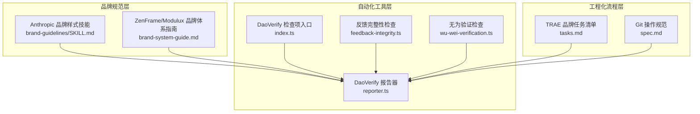
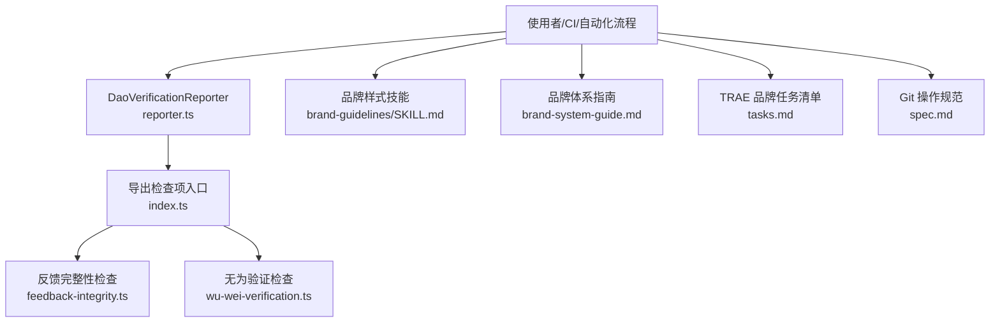
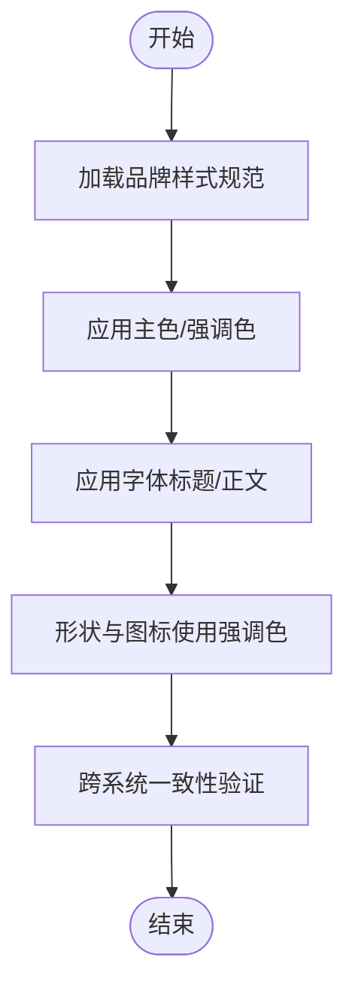
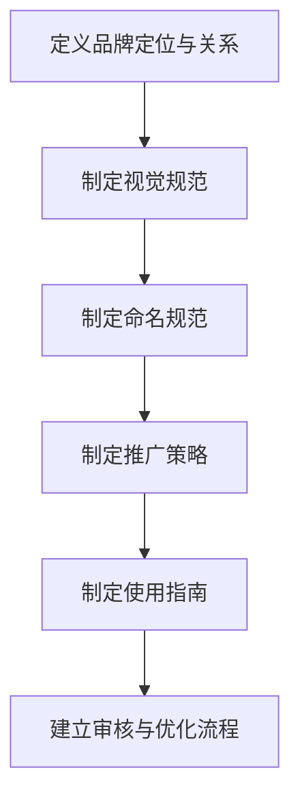
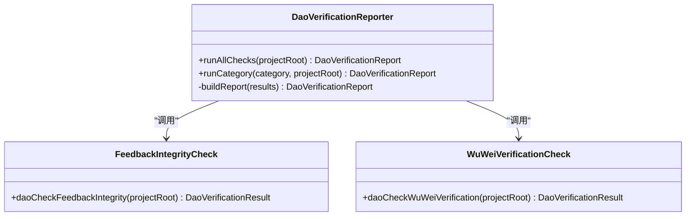
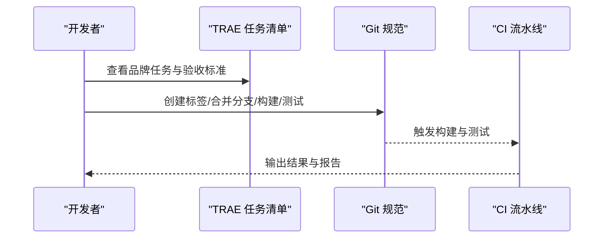
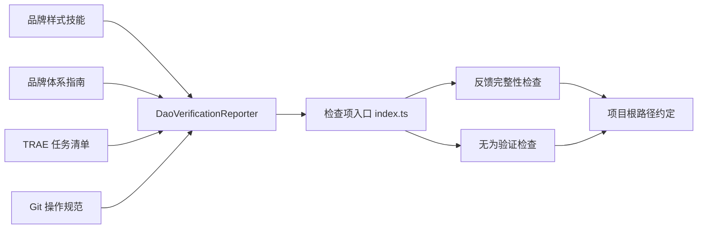

# 品牌指南管理

<cite>
**本文引用的文件**
- [brand-guidelines/SKILL.md](file://skills/daoSkilLs/skills/anthropics-skills/skills/brand-guidelines/SKILL.md)
- [brand-guidelines/LICENSE.txt](file://skills/daoSkilLs/skills/anthropics-skills/skills/brand-guidelines/LICENSE.txt)
- [brand-system-guide.md](file://apps/DaoMind/.trae/branding/brand-system-guide.md)
- [tasks.md](file://apps/DaoMind/.trae/specs/zenframe-modulux-branding/tasks.md)
- [index.ts](file://apps/DaoMind/packages/daoVerify/src/index.ts)
- [reporter.ts](file://apps/DaoMind/packages/daoVerify/src/reporter.ts)
- [feedback-integrity.ts](file://apps/DaoMind/packages/daoVerify/src/checks/feedback-integrity.ts)
- [wu-wei-verification.ts](file://apps/DaoMind/packages/daoVerify/src/checks/wu-wei-verification.ts)
- [spec.md](file://.trae/specs/git-operations/spec.md)
</cite>

## 目录
1. [引言](#引言)
2. [项目结构](#项目结构)
3. [核心组件](#核心组件)
4. [架构总览](#架构总览)
5. [详细组件分析](#详细组件分析)
6. [依赖分析](#依赖分析)
7. [性能考虑](#性能考虑)
8. [故障排除指南](#故障排除指南)
9. [结论](#结论)
10. [附录](#附录)

## 引言
本文件面向“品牌指南管理”主题，围绕品牌一致性维护、视觉元素标准化与品牌资产管理系统的落地实践展开。文档聚焦以下能力：
- 品牌指南的核心要素：色彩规范、字体选择、图标标准、版式规则与品牌声音
- 品牌资产的数字化管理、版本控制与自动合规检查机制
- 品牌一致性检测算法的实现思路：颜色匹配、字体识别、布局分析
- 基于AI的自动违规识别与修正建议
- 多平台品牌适配策略、动态品牌生成与实时品牌审核
- 具体的合规检查流程与自动化工具使用方法

本仓库中与品牌相关的关键资产包括：
- Anthropic 品牌样式技能：提供官方色彩与排版规范，以及在演示文稿等场景中的应用方法
- ZenFrame/Modulux 品牌体系指南：定义视觉规范、命名规范、推广策略与审核流程
- DaoVerify 品牌一致性检查工具：提供可扩展的检查项注册与报告器，用于自动化合规校验
- TRAE 品牌体系任务清单：明确品牌标识更新、文档整理与审核优化的流程与验收标准
- Git 操作规范：为品牌资产的版本控制与发布提供工程化保障

章节来源
- [brand-guidelines/SKILL.md:1-74](file://skills/daoSkilLs/skills/anthropics-skills/skills/brand-guidelines/SKILL.md#L1-L74)
- [brand-system-guide.md:1-163](file://apps/DaoMind/.trae/branding/brand-system-guide.md#L1-L163)
- [tasks.md:67-104](file://apps/DaoMind/.trae/specs/zenframe-modulux-branding/tasks.md#L67-L104)

## 项目结构
品牌指南管理涉及三个层面：
- 品牌规范层：Anthropic 品牌样式技能与 ZenFrame/Modulux 品牌体系指南，定义色彩、字体、版式与品牌声音
- 自动化工具层：DaoVerify 检查器与报告器，提供可插拔的合规检查与评分
- 工程化流程层：TRAE 任务清单与 Git 规范，确保品牌资产的版本控制与发布质量

图示来源
- [brand-guidelines/SKILL.md:1-74](file://skills/daoSkilLs/skills/anthropics-skills/skills/brand-guidelines/SKILL.md#L1-L74)
- [brand-system-guide.md:1-163](file://apps/DaoMind/.trae/branding/brand-system-guide.md#L1-L163)
- [index.ts:1-18](file://apps/DaoMind/packages/daoVerify/src/index.ts#L1-L18)
- [reporter.ts:65-94](file://apps/DaoMind/packages/daoVerify/src/reporter.ts#L65-L94)
- [feedback-integrity.ts:47-116](file://apps/DaoMind/packages/daoVerify/src/checks/feedback-integrity.ts#L47-L116)
- [wu-wei-verification.ts:1-40](file://apps/DaoMind/packages/daoVerify/src/checks/wu-wei-verification.ts#L1-L40)
- [tasks.md:67-104](file://apps/DaoMind/.trae/specs/zenframe-modulux-branding/tasks.md#L67-L104)
- [spec.md:64-102](file://.trae/specs/git-operations/spec.md#L64-L102)

章节来源
- [brand-guidelines/SKILL.md:1-74](file://skills/daoSkilLs/skills/anthropics-skills/skills/brand-guidelines/SKILL.md#L1-L74)
- [brand-system-guide.md:1-163](file://apps/DaoMind/.trae/branding/brand-system-guide.md#L1-L163)
- [index.ts:1-18](file://apps/DaoMind/packages/daoVerify/src/index.ts#L1-L18)
- [reporter.ts:65-94](file://apps/DaoMind/packages/daoVerify/src/reporter.ts#L65-L94)
- [feedback-integrity.ts:47-116](file://apps/DaoMind/packages/daoVerify/src/checks/feedback-integrity.ts#L47-L116)
- [tasks.md:67-104](file://apps/DaoMind/.trae/specs/zenframe-modulux-branding/tasks.md#L67-L104)
- [spec.md:64-102](file://.trae/specs/git-operations/spec.md#L64-L102)

## 核心组件
- 品牌样式技能（Anthropic）：提供色彩规范与字体应用方法，支持在演示文稿等场景中自动套用品牌风格
- 品牌体系指南（ZenFrame/Modulux）：定义视觉规范、命名规范、推广策略与审核流程
- DaoVerify 检查器：提供可扩展的检查项注册与报告器，支持按类别运行检查并汇总评分
- TRAE 品牌任务清单：明确品牌标识更新、文档整理与审核优化的流程与验收标准
- Git 操作规范：为品牌资产的版本控制与发布提供工程化保障

章节来源
- [brand-guidelines/SKILL.md:15-74](file://skills/daoSkilLs/skills/anthropics-skills/skills/brand-guidelines/SKILL.md#L15-L74)
- [brand-system-guide.md:23-157](file://apps/DaoMind/.trae/branding/brand-system-guide.md#L23-L157)
- [index.ts:10-18](file://apps/DaoMind/packages/daoVerify/src/index.ts#L10-L18)
- [reporter.ts:65-94](file://apps/DaoMind/packages/daoVerify/src/reporter.ts#L65-L94)
- [tasks.md:67-104](file://apps/DaoMind/.trae/specs/zenframe-modulux-branding/tasks.md#L67-L104)
- [spec.md:64-102](file://.trae/specs/git-operations/spec.md#L64-L102)

## 架构总览
品牌指南管理的总体架构由“规范定义—工具执行—流程保障”三层组成：
- 规范定义：Anthropic 品牌样式技能与 ZenFrame/Modulux 品牌体系指南提供品牌要素与使用准则
- 工具执行：DaoVerify 报告器统一调度检查项，输出合规报告；检查项可扩展，覆盖反馈完整性、命名规范、无为验证等维度
- 流程保障：TRAE 任务清单与 Git 规范确保品牌资产的版本控制、文档更新与审核优化

图示来源
- [reporter.ts:65-94](file://apps/DaoMind/packages/daoVerify/src/reporter.ts#L65-L94)
- [index.ts:10-18](file://apps/DaoMind/packages/daoVerify/src/index.ts#L10-L18)
- [feedback-integrity.ts:47-116](file://apps/DaoMind/packages/daoVerify/src/checks/feedback-integrity.ts#L47-L116)
- [wu-wei-verification.ts:1-40](file://apps/DaoMind/packages/daoVerify/src/checks/wu-wei-verification.ts#L1-L40)
- [brand-guidelines/SKILL.md:15-74](file://skills/daoSkilLs/skills/anthropics-skills/skills/brand-guidelines/SKILL.md#L15-L74)
- [brand-system-guide.md:105-157](file://apps/DaoMind/.trae/branding/brand-system-guide.md#L105-L157)
- [tasks.md:67-104](file://apps/DaoMind/.trae/specs/zenframe-modulux-branding/tasks.md#L67-L104)
- [spec.md:64-102](file://.trae/specs/git-operations/spec.md#L64-L102)

## 详细组件分析

### 组件A：品牌样式技能（Anthropic）
- 功能要点
  - 色彩规范：提供主色与强调色的精确值，并说明在不同背景下的文本颜色选择策略
  - 字体应用：针对标题与正文分别指定字体族，并提供系统回退策略
  - 形状与强调色：非文本形状采用循环强调色，保持视觉活力与品牌一致性
  - 技术细节：通过 Python 库实现颜色应用与字体管理，保证跨系统一致性
- 实施建议
  - 在演示文稿、网页与文档生成中统一引用该技能，确保品牌风格一致
  - 预装推荐字体以获得最佳显示效果

图示来源
- [brand-guidelines/SKILL.md:17-74](file://skills/daoSkilLs/skills/anthropics-skills/skills/brand-guidelines/SKILL.md#L17-L74)

章节来源
- [brand-guidelines/SKILL.md:15-74](file://skills/daoSkilLs/skills/anthropics-skills/skills/brand-guidelines/SKILL.md#L15-L74)
- [brand-guidelines/LICENSE.txt:1-202](file://skills/daoSkilLs/skills/anthropics-skills/skills/brand-guidelines/LICENSE.txt#L1-L202)

### 组件B：品牌体系指南（ZenFrame/Modulux）
- 功能要点
  - 视觉规范：定义 ZenFrame 与 Modulux 的主色、辅色、强调色与字体家族
  - 命名规范：产品命名、版本命名与包命名的格式与示例
  - 推广策略：内容营销、社区建设与合作伙伴策略
  - 使用指南：品牌标识使用、品牌声音与一致性要求
  - 审核与优化：定期审核流程与优化策略
- 实施建议
  - 将指南作为品牌使用的权威参考，贯穿所有材料与渠道
  - 建立定期审核机制，确保品牌一致性与相关性

图示来源
- [brand-system-guide.md:3-157](file://apps/DaoMind/.trae/branding/brand-system-guide.md#L3-L157)

章节来源
- [brand-system-guide.md:1-163](file://apps/DaoMind/.trae/branding/brand-system-guide.md#L1-L163)

### 组件C：DaoVerify 品牌一致性检查器
- 功能要点
  - 检查项注册：通过入口导出多个检查项，支持按类别运行
  - 报告器：统一汇总检查结果，计算加权总分并输出报告
  - 示例检查项：反馈完整性检查与无为验证检查，体现可扩展性
- 实施建议
  - 新增检查项时遵循统一接口，确保报告器可直接消费
  - 在 CI 中集成 DaoVerificationReporter，实现自动化品牌合规检查

图示来源
- [reporter.ts:65-94](file://apps/DaoMind/packages/daoVerify/src/reporter.ts#L65-L94)
- [feedback-integrity.ts:47-116](file://apps/DaoMind/packages/daoVerify/src/checks/feedback-integrity.ts#L47-L116)
- [wu-wei-verification.ts:1-40](file://apps/DaoMind/packages/daoVerify/src/checks/wu-wei-verification.ts#L1-L40)

章节来源
- [index.ts:10-18](file://apps/DaoMind/packages/daoVerify/src/index.ts#L10-L18)
- [reporter.ts:65-94](file://apps/DaoMind/packages/daoVerify/src/reporter.ts#L65-L94)
- [feedback-integrity.ts:47-116](file://apps/DaoMind/packages/daoVerify/src/checks/feedback-integrity.ts#L47-L116)
- [wu-wei-verification.ts:1-40](file://apps/DaoMind/packages/daoVerify/src/checks/wu-wei-verification.ts#L1-L40)

### 组件D：TRAE 品牌任务清单与 Git 规范
- 功能要点
  - 品牌任务清单：明确品牌标识更新、文档整理与审核优化的任务、优先级与验收标准
  - Git 规范：提供标签创建、分支合并、构建与测试验证的程序化验收流程
- 实施建议
  - 将品牌任务纳入常规迭代流程，确保品牌资产的持续更新与一致性
  - 在 CI 中执行 Git 规范中的构建与测试步骤，保障发布质量

图示来源
- [tasks.md:67-104](file://apps/DaoMind/.trae/specs/zenframe-modulux-branding/tasks.md#L67-L104)
- [spec.md:64-102](file://.trae/specs/git-operations/spec.md#L64-L102)

章节来源
- [tasks.md:67-104](file://apps/DaoMind/.trae/specs/zenframe-modulux-branding/tasks.md#L67-L104)
- [spec.md:64-102](file://.trae/specs/git-operations/spec.md#L64-L102)

## 依赖分析
- 组件耦合
  - DaoVerificationReporter 依赖检查项入口 index.ts 导出的检查函数
  - 检查项（如反馈完整性检查）依赖项目根路径下的特定目录结构
  - 品牌样式技能与品牌体系指南为工具层提供输入规范
- 外部依赖
  - 品牌样式技能中提到的字体与颜色应用依赖系统环境与第三方库
  - Git 规范为品牌资产的版本控制提供工程化保障

图示来源
- [index.ts:10-18](file://apps/DaoMind/packages/daoVerify/src/index.ts#L10-L18)
- [reporter.ts:65-94](file://apps/DaoMind/packages/daoVerify/src/reporter.ts#L65-L94)
- [feedback-integrity.ts:47-116](file://apps/DaoMind/packages/daoVerify/src/checks/feedback-integrity.ts#L47-L116)
- [brand-guidelines/SKILL.md:60-74](file://skills/daoSkilLs/skills/anthropics-skills/skills/brand-guidelines/SKILL.md#L60-L74)
- [brand-system-guide.md:105-157](file://apps/DaoMind/.trae/branding/brand-system-guide.md#L105-L157)
- [tasks.md:67-104](file://apps/DaoMind/.trae/specs/zenframe-modulux-branding/tasks.md#L67-L104)
- [spec.md:64-102](file://.trae/specs/git-operations/spec.md#L64-L102)

章节来源
- [index.ts:10-18](file://apps/DaoMind/packages/daoVerify/src/index.ts#L10-L18)
- [reporter.ts:65-94](file://apps/DaoMind/packages/daoVerify/src/reporter.ts#L65-L94)
- [feedback-integrity.ts:47-116](file://apps/DaoMind/packages/daoVerify/src/checks/feedback-integrity.ts#L47-L116)
- [brand-guidelines/SKILL.md:60-74](file://skills/daoSkilLs/skills/anthropics-skills/skills/brand-guidelines/SKILL.md#L60-L74)
- [brand-system-guide.md:105-157](file://apps/DaoMind/.trae/branding/brand-system-guide.md#L105-L157)
- [tasks.md:67-104](file://apps/DaoMind/.trae/specs/zenframe-modulux-branding/tasks.md#L67-L104)
- [spec.md:64-102](file://.trae/specs/git-operations/spec.md#L64-L102)

## 性能考虑
- 检查项执行效率
  - 尽量避免重复读取同一文件，缓存中间结果
  - 并行执行相互独立的检查项，缩短总耗时
- 品牌资产渲染
  - 预装推荐字体，减少回退带来的重排与渲染成本
  - 控制颜色与字体应用范围，避免过度渲染
- CI 集成
  - 将品牌合规检查纳入流水线早期阶段，尽早发现违规

## 故障排除指南
- 检查项失败
  - 反馈完整性检查：确认 @dao/feedback 包存在且包含四阶段文件，lifecycle.ts 正确串联各阶段
  - 无为验证检查：确认被检查文件符合事件驱动与自组织特征
- 报告器异常
  - 确认检查项已正确注册到入口导出列表
  - 检查类别名称是否在注册表中存在
- 品牌样式应用不一致
  - 确认系统已安装推荐字体，或允许回退策略生效
  - 检查颜色值与字体应用逻辑是否与规范一致

章节来源
- [feedback-integrity.ts:47-116](file://apps/DaoMind/packages/daoVerify/src/checks/feedback-integrity.ts#L47-L116)
- [reporter.ts:72-92](file://apps/DaoMind/packages/daoVerify/src/reporter.ts#L72-L92)
- [brand-guidelines/SKILL.md:60-74](file://skills/daoSkilLs/skills/anthropics-skills/skills/brand-guidelines/SKILL.md#L60-L74)

## 结论
本仓库提供了从品牌规范定义到自动化合规检查与工程化流程保障的完整闭环。通过品牌样式技能与品牌体系指南，确保视觉与声音的一致性；通过 DaoVerify 检查器与报告器，实现可扩展的自动化合规校验；通过 TRAE 任务清单与 Git 规范，保障品牌资产的版本控制与持续优化。建议在实际项目中将上述组件整合进 CI/CD 流水线，形成“规范先行、工具支撑、流程保障”的品牌治理模式。

## 附录
- 品牌一致性检测算法实现思路（概念性）
  - 颜色匹配：基于色彩规范的 RGB 值进行阈值比较，支持亮度与饱和度补偿
  - 字体识别：通过字体度量与字形轮廓特征进行匹配，结合系统字体回退策略
  - 布局分析：基于网格系统与间距规则进行静态布局校验
- AI 驱动的违规识别与修正建议（概念性）
  - 利用 OCR 与视觉分类模型识别图像中的品牌元素，对比规范并给出修正建议
  - 通过自然语言模型生成品牌文案的风格化建议与一致性评估
- 多平台适配与动态品牌生成（概念性）
  - 基于品牌规范的参数化模板，动态生成适用于网页、移动端与文档的样式
  - 实时品牌审核：在内容发布前进行跨平台一致性检查与合规评分