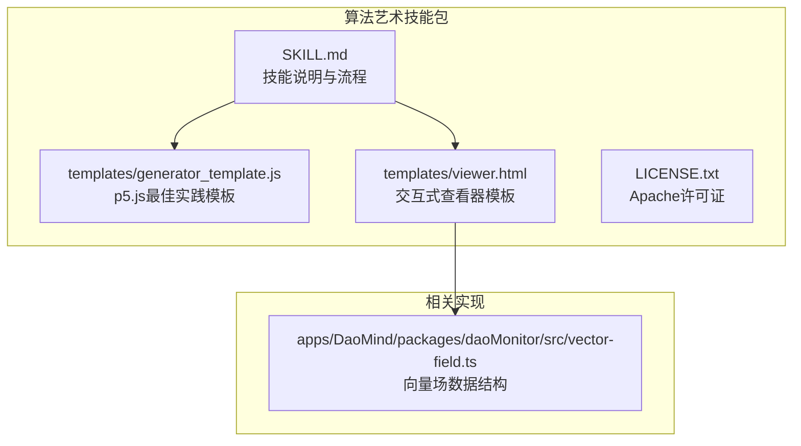
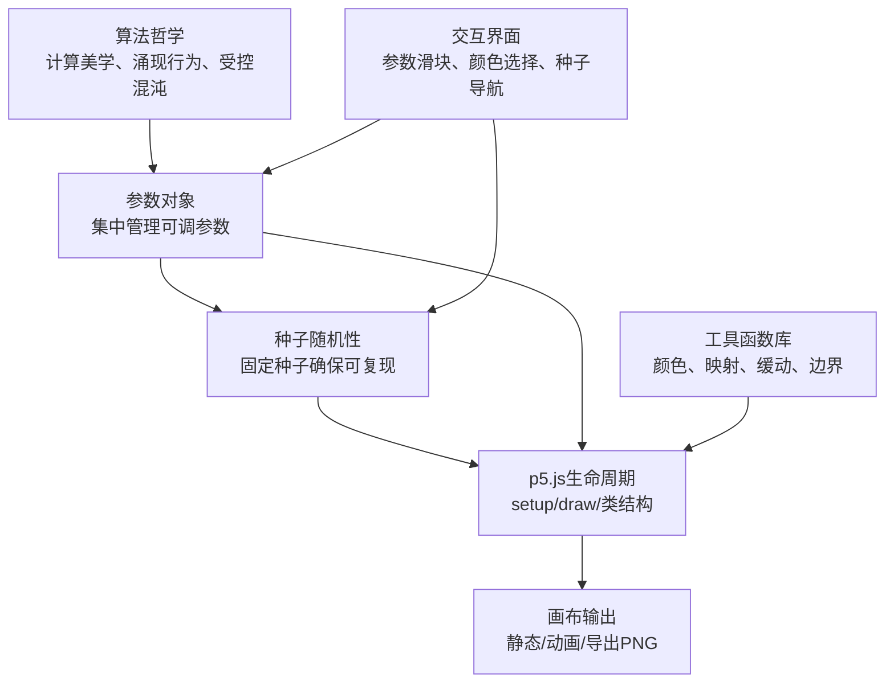
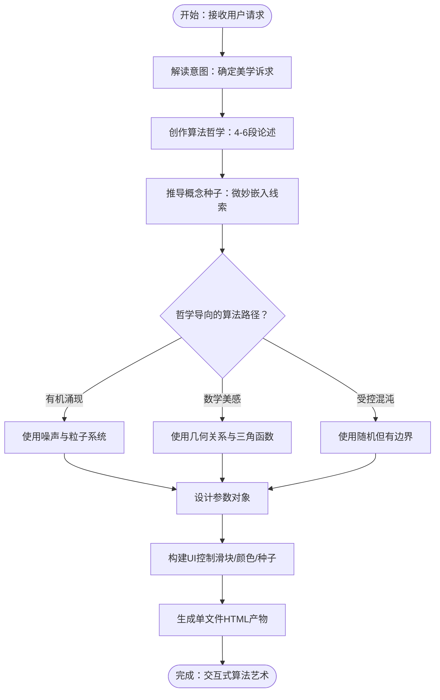
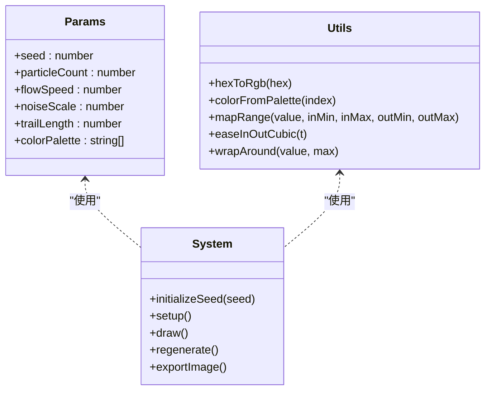
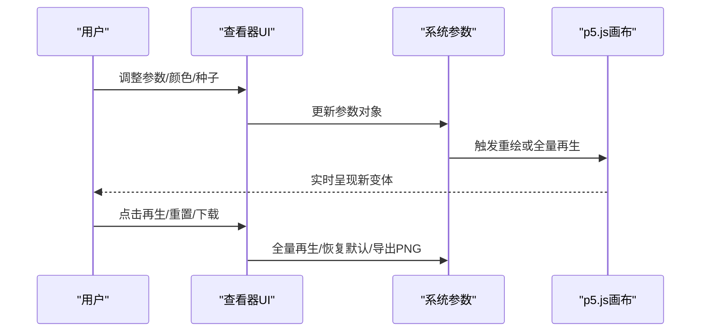
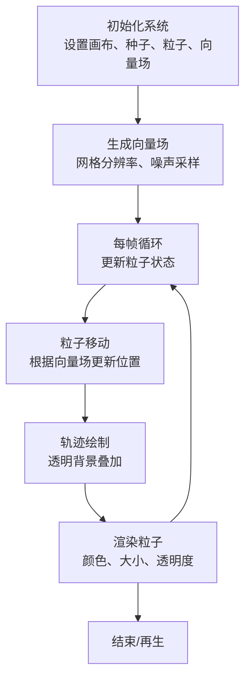
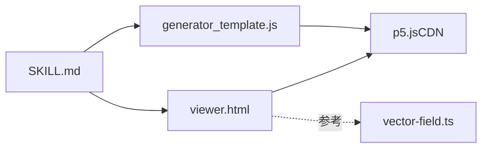

# 算法艺术生成

<cite>
**本文引用的文件**
- [算法艺术技能说明](file://skills/daoSkilLs/skills/anthropics-skills/skills/algorithmic-art/SKILL.md)
- [p5.js生成器模板](file://skills/daoSkilLs/skills/anthropics-skills/skills/algorithmic-art/templates/generator_template.js)
- [交互式查看器模板](file://skills/daoSkilLs/skills/anthropics-skills/skills/algorithmic-art/templates/viewer.html)
- [Apache许可证](file://skills/daoSkilLs/skills/anthropics-skills/skills/algorithmic-art/LICENSE.txt)
- [DAO向量场实现](file://apps/DaoMind/packages/daoMonitor/src/vector-field.ts)
</cite>

## 目录
1. [简介](#简介)
2. [项目结构](#项目结构)
3. [核心组件](#核心组件)
4. [架构总览](#架构总览)
5. [详细组件分析](#详细组件分析)
6. [依赖关系分析](#依赖关系分析)
7. [性能考量](#性能考量)
8. [故障排除指南](#故障排除指南)
9. [结论](#结论)
10. [附录](#附录)

## 简介
本技术文档围绕基于p5.js的算法艺术生成技能展开，系统阐述从“算法哲学”到“参数化生成”，再到“交互式可视化”的完整创作流程。文档重点解释以下核心概念：
- 计算美学：以数学与算法为语言的视觉表达
- 涌现行为：由简单规则在系统层面产生的复杂模式
- 种子随机性：通过固定种子确保可复现的随机生成
- 参数化表达：通过可调参数探索无限变体

同时，文档给出算法哲学创作的四个步骤：哲学宣言撰写、概念种子推导、p5.js实现、交互式产物创建，并结合Perlin噪声、粒子系统、向量场等技术，提供种子导航、参数控制与颜色调色板的实现细节，帮助保持算法的艺术性与可探索性。

## 项目结构
该技能位于DAO应用仓库的算法艺术技能包中，包含技能说明文档、p5.js模板与交互式查看器模板，以及许可证文件。DAO向量场实现作为相关领域的参考实现，展示了数据结构与向量场抽象的设计思路。



图表来源
- [算法艺术技能说明](file://skills/daoSkilLs/skills/anthropics-skills/skills/algorithmic-art/SKILL.md)
- [p5.js生成器模板](file://skills/daoSkilLs/skills/anthropics-skills/skills/algorithmic-art/templates/generator_template.js)
- [交互式查看器模板](file://skills/daoSkilLs/skills/anthropics-skills/skills/algorithmic-art/templates/viewer.html)
- [Apache许可证](file://skills/daoSkilLs/skills/anthropics-skills/skills/algorithmic-art/LICENSE.txt)
- [DAO向量场实现](file://apps/DaoMind/packages/daoMonitor/src/vector-field.ts)

章节来源
- [算法艺术技能说明](file://skills/daoSkilLs/skills/anthropics-skills/skills/algorithmic-art/SKILL.md)
- [p5.js生成器模板](file://skills/daoSkilLs/skills/anthropics-skills/skills/algorithmic-art/templates/generator_template.js)
- [交互式查看器模板](file://skills/daoSkilLs/skills/anthropics-skills/skills/algorithmic-art/templates/viewer.html)
- [Apache许可证](file://skills/daoSkilLs/skills/anthropics-skills/skills/algorithmic-art/LICENSE.txt)
- [DAO向量场实现](file://apps/DaoMind/packages/daoMonitor/src/vector-field.ts)

## 核心组件
- 算法哲学：定义生成艺术的计算世界观与美学原则，强调过程而非结果，参数化表达与受控混沌。
- 参数组织：将所有可调参数集中在一个对象中，便于UI绑定、重置与序列化保存。
- 种子随机性：使用固定种子初始化随机数与噪声，确保相同输入产生一致输出。
- p5.js生命周期：支持静态生成（一次性）、动画生成（持续更新）与用户触发再生（参数变化时重绘）。
- 类结构：当系统包含多个实体（如粒子、代理、节点）时采用类封装，分离更新与渲染逻辑。
- 性能考虑：针对大量元素进行预计算、简化碰撞检测、限制昂贵操作；保持流畅帧率。
- 工具函数：颜色工具、映射与缓动、边界包裹等实用函数。
- 参数更新：将UI事件映射到参数对象，决定是实时更新还是全量再生。
- 常见模式：透明背景绘制轨迹、使用噪声实现有机变化、从角度创建向量等。
- 导出功能：保存当前画布为PNG图像。

章节来源
- [算法艺术技能说明](file://skills/daoSkilLs/skills/anthropics-skills/skills/algorithmic-art/SKILL.md)
- [p5.js生成器模板](file://skills/daoSkilLs/skills/anthropics-skills/skills/algorithmic-art/templates/generator_template.js)

## 架构总览
算法艺术生成的总体架构由“哲学驱动的参数化系统”和“交互式可视化界面”组成。哲学指导参数设计，参数驱动算法执行，UI负责参数与种子的交互，最终在p5.js画布上呈现。



图表来源
- [算法艺术技能说明](file://skills/daoSkilLs/skills/anthropics-skills/skills/algorithmic-art/SKILL.md)
- [p5.js生成器模板](file://skills/daoSkilLs/skills/anthropics-skills/skills/algorithmic-art/templates/generator_template.js)
- [交互式查看器模板](file://skills/daoSkilLs/skills/anthropics-skills/skills/algorithmic-art/templates/viewer.html)

## 详细组件分析

### 组件A：算法哲学创作流程
算法哲学是整个生成艺术的“计算世界观”。它强调：
- 过程优于产品：美来自算法执行过程，每次运行都是独特的
- 参数化表达：通过数学关系、力与行为传达思想
- 受控混沌：在严格边界内引入随机变化，使系统从无序中产生有序
- 专家工艺：最终算法需体现深思熟虑与反复打磨

创作步骤：
1) 哲学宣言撰写：用4-6段简洁而完整的论述，阐明计算过程、噪声模式、粒子行为、时间演化与参数化复杂度如何共同表达理念。
2) 概念种子推导：从用户请求中提取微妙的概念线索，将其嵌入到参数、行为与涌现模式中，使其“只懂的人能感知，外行也能欣赏”。
3) p5.js实现：依据哲学选择合适的算法路径（有机涌现、数学美感或受控混沌），避免从“模式菜单”中挑选，而要让哲学自然流露。
4) 交互式产物创建：构建单文件HTML产物，内含p5.js、算法、参数控制与UI，保持Anthropic品牌风格与一致性。



图表来源
- [算法艺术技能说明](file://skills/daoSkilLs/skills/anthropics-skills/skills/algorithmic-art/SKILL.md)

章节来源
- [算法艺术技能说明](file://skills/daoSkilLs/skills/anthropics-skills/skills/algorithmic-art/SKILL.md)

### 组件B：参数化生成与种子随机性
参数化生成的核心在于将“可调参数”集中在一个对象中，并通过固定种子确保可复现性。模板提供了参数组织、种子初始化、生命周期与常用工具函数的最佳实践。

要点：
- 参数组织：将数量、尺度、概率、角度、阈值等属性统一管理，便于UI绑定与重置
- 种子随机性：初始化随机数与噪声种子，保证相同输入产生一致输出
- 生命周期：支持静态生成（一次性）、动画生成（持续更新）与用户触发再生
- 类结构：当系统包含多实体时采用类封装，分离更新与渲染逻辑
- 性能考虑：预计算、简化碰撞检测、限制昂贵操作
- 工具函数：颜色转换、映射与缓动、边界包裹
- 参数更新：将UI事件映射到参数对象，决定实时更新或全量再生
- 常见模式：透明背景绘制轨迹、使用噪声实现有机变化、从角度创建向量
- 导出功能：保存当前画布为PNG图像



图表来源
- [p5.js生成器模板](file://skills/daoSkilLs/skills/anthropics-skills/skills/algorithmic-art/templates/generator_template.js)

章节来源
- [p5.js生成器模板](file://skills/daoSkilLs/skills/anthropics-skills/skills/algorithmic-art/templates/generator_template.js)

### 组件C：交互式可视化实现（查看器模板）
查看器模板提供了一套固定的Anthropic品牌风格与一致的交互布局，开发者只需替换变量部分即可快速产出可探索的算法艺术作品。模板包含：
- 固定部分：标题、副标题、种子导航（显示、上一个、下一个、随机、跳转）、动作按钮（再生、重置）
- 可变部分：参数控制组（滑块）、颜色选择器（可选）、p5.js算法实现区域
- 单文件结构：内嵌p5.js、样式与脚本，无需外部依赖



图表来源
- [交互式查看器模板](file://skills/daoSkilLs/skills/anthropics-skills/skills/algorithmic-art/templates/viewer.html)

章节来源
- [交互式查看器模板](file://skills/daoSkilLs/skills/anthropics-skills/skills/algorithmic-art/templates/viewer.html)

### 组件D：向量场与粒子系统（技术参考）
虽然查看器模板中的向量场生成与粒子系统留有占位符，但DAO向量场实现展示了数据结构与向量场抽象的设计思路，可作为理解“力场”与“粒子跟随”的参考。

要点：
- 边缘记录：记录从节点到节点的流向、幅度、方向与压力
- 邻接关系：维护入边与出边集合，便于查询热点与流向
- 向量获取：将内部存储转换为对外暴露的向量数组
- 热点识别：统计节点总吞吐量并排序，找出关键节点

```mermaid
classDiagram
class Edge {
+from : string
+to : string
+magnitude : number
+direction : FlowVector.direction
+pressure : number
}
class DaoVectorField {
-edges : Map~string, Edge~
-adjacencyIn : Map~string, Set~string~~
-adjacencyOut : Map~string, Set~string~~
+recordFlow(from, to, magnitude, direction)
+getVectors() : FlowVector[]
+getNodeInbound(nodeId) : FlowVector[]
+getNodeOutbound(nodeId) : FlowVector[]
+getHotspots(limit) : {nodeId, totalThroughput}[]
}
DaoVectorField --> Edge : "管理"
```

图表来源
- [DAO向量场实现](file://apps/DaoMind/packages/daoMonitor/src/vector-field.ts)

章节来源
- [DAO向量场实现](file://apps/DaoMind/packages/daoMonitor/src/vector-field.ts)

### 组件E：Perlin噪声、粒子系统与向量场的实现要点
- Perlin噪声：用于有机变化与随机但平滑的扰动，常用于粒子速度、颜色或密度映射
- 粒子系统：包含初始化、更新与渲染三阶段，支持轨迹衰减与边界处理
- 向量场：网格化采样，每个格点携带方向与强度，粒子沿场移动并留下轨迹



图表来源
- [交互式查看器模板](file://skills/daoSkilLs/skills/anthropics-skills/skills/algorithmic-art/templates/viewer.html)
- [p5.js生成器模板](file://skills/daoSkilLs/skills/anthropics-skills/skills/algorithmic-art/templates/generator_template.js)

章节来源
- [交互式查看器模板](file://skills/daoSkilLs/skills/anthropics-skills/skills/algorithmic-art/templates/viewer.html)
- [p5.js生成器模板](file://skills/daoSkilLs/skills/anthropics-skills/skills/algorithmic-art/templates/generator_template.js)

## 依赖关系分析
- 技能说明依赖模板：查看器模板提供UI结构与品牌风格，生成器模板提供代码结构与最佳实践
- 查看器模板依赖p5.js：通过CDN引入p5.js，内嵌算法与UI控制
- DAO向量场实现与查看器模板在“向量场”概念上存在关联，前者提供数据结构抽象，后者提供可视化实现框架



图表来源
- [算法艺术技能说明](file://skills/daoSkilLs/skills/anthropics-skills/skills/algorithmic-art/SKILL.md)
- [交互式查看器模板](file://skills/daoSkilLs/skills/anthropics-skills/skills/algorithmic-art/templates/viewer.html)
- [p5.js生成器模板](file://skills/daoSkilLs/skills/anthropics-skills/skills/algorithmic-art/templates/generator_template.js)
- [DAO向量场实现](file://apps/DaoMind/packages/daoMonitor/src/vector-field.ts)

章节来源
- [算法艺术技能说明](file://skills/daoSkilLs/skills/anthropics-skills/skills/algorithmic-art/SKILL.md)
- [交互式查看器模板](file://skills/daoSkilLs/skills/anthropics-skills/skills/algorithmic-art/templates/viewer.html)
- [p5.js生成器模板](file://skills/daoSkilLs/skills/anthropics-skills/skills/algorithmic-art/templates/generator_template.js)
- [DAO向量场实现](file://apps/DaoMind/packages/daoMonitor/src/vector-field.ts)

## 性能考量
- 大规模粒子：预计算可复用项、使用空间哈希等简化碰撞检测、减少昂贵运算（平方根、三角函数）
- 动画帧率：目标60fps，必要时降低粒子数量或简化计算
- 渲染优化：使用透明背景叠加绘制轨迹，避免频繁重绘整个画布
- 参数更新策略：区分实时更新与全量再生，避免不必要的重初始化

## 故障排除指南
- 画面卡顿：检查是否过度使用昂贵运算，适当降低粒子数量或简化更新逻辑
- 参数不生效：确认UI事件正确映射到参数对象，必要时触发全量再生
- 种子无效：确保种子输入为正整数，非法输入会回退到当前种子
- 颜色异常：检查颜色选择器与调色板索引映射，确保颜色值格式正确

章节来源
- [p5.js生成器模板](file://skills/daoSkilLs/skills/anthropics-skills/skills/algorithmic-art/templates/generator_template.js)
- [交互式查看器模板](file://skills/daoSkilLs/skills/anthropics-skills/skills/algorithmic-art/templates/viewer.html)

## 结论
算法艺术生成技能以“算法哲学”为核心，通过“参数化表达”与“种子随机性”确保可探索性与可复现性，并借助“交互式可视化”让用户深度参与创作过程。模板化的p5.js实现与查看器结构为快速产出高质量算法艺术提供了坚实基础。结合Perlin噪声、粒子系统与向量场等技术，可以在保持艺术性的同时，实现可控的参数调整与丰富的视觉变体。

## 附录
- 许可证：本技能遵循Apache 2.0许可证，允许使用、复制、修改与分发，但需保留版权与许可证声明。

章节来源
- [Apache许可证](file://skills/daoSkilLs/skills/anthropics-skills/skills/algorithmic-art/LICENSE.txt)