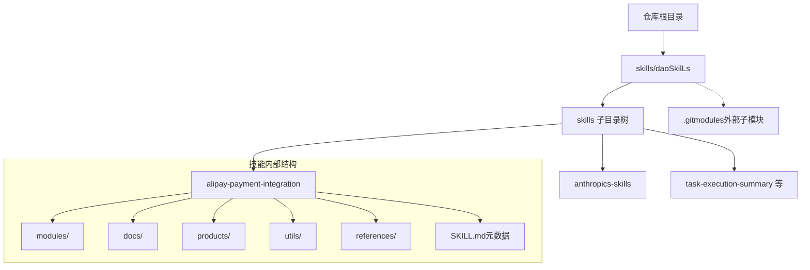
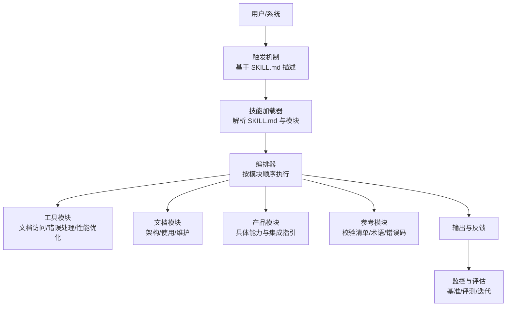
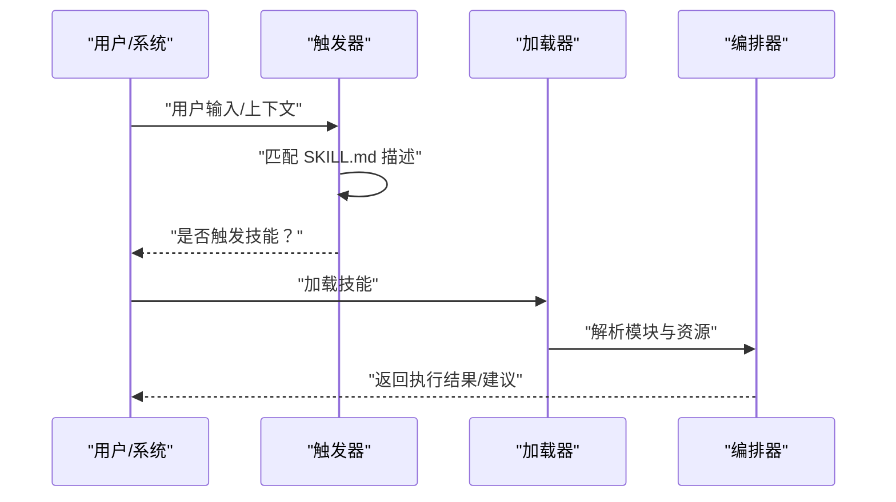
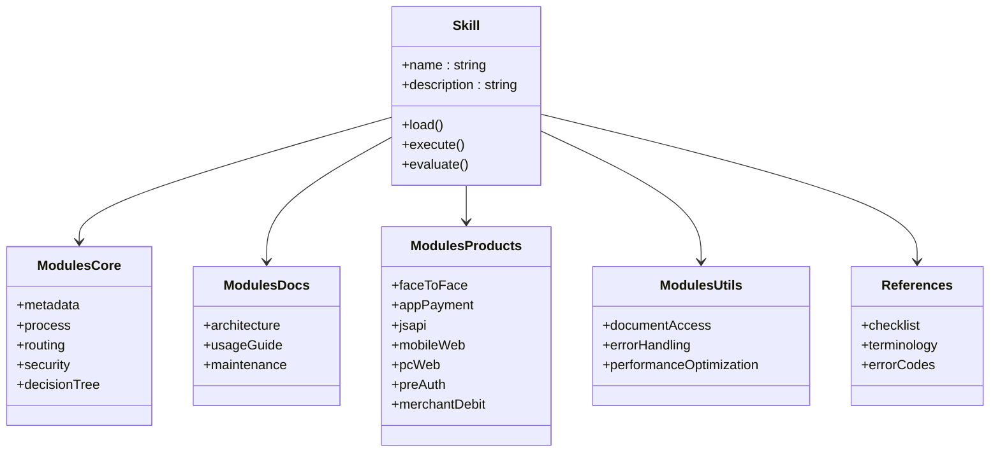
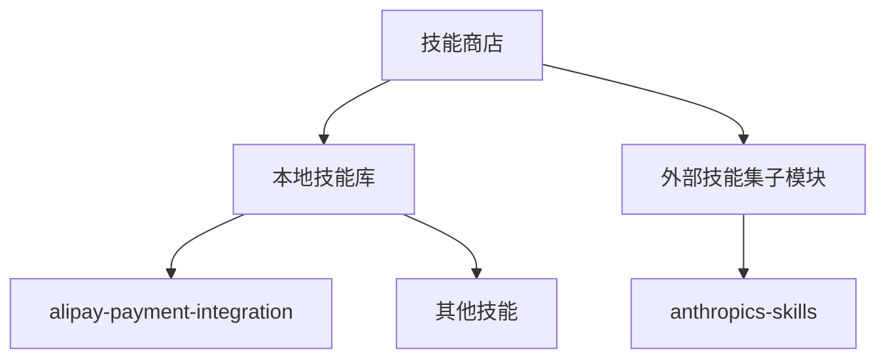
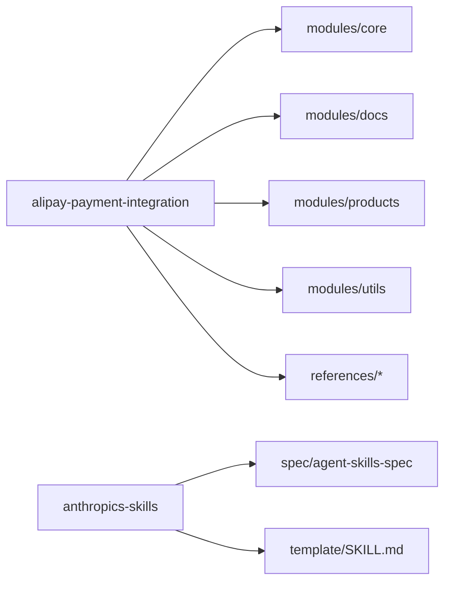

# 技能架构设计

<cite>
**本文引用的文件**
- [SKILL.md](file://skills/daoSkilLs/skills/alipay-payment-integration/SKILL.md)
- [skill-metadata.md](file://skills/daoSkilLs/skills/alipay-payment-integration/modules/core/skill-metadata.md)
- [integration-process.md](file://skills/daoSkilLs/skills/alipay-payment-integration/modules/core/integration-process.md)
- [decision-tree.md](file://skills/daoSkilLs/skills/alipay-payment-integration/modules/core/decision-tree.md)
- [README.md](file://skills/daoSkilLs/skills/anthropics-skills/README.md)
- [SKILL.md（模板）](file://skills/daoSkilLs/skills/anthropics-skills/template/SKILL.md)
- [.gitmodules](file://skills/daoSkilLs/.gitmodules)
- [agent-skills-spec.md](file://skills/daoSkilLs/skills/anthropics-skills/spec/agent-skills-spec.md)
- [SKILL.md（Skill Creator）](file://skills/daoSkilLs/skills/anthropics-skills/skills/skill-creator/SKILL.md)
- [.gitignore](file://skills/daoSkilLs/.gitignore)
</cite>

## 目录
1. [引言](#引言)
2. [项目结构](#项目结构)
3. [核心组件](#核心组件)
4. [架构总览](#架构总览)
5. [详细组件分析](#详细组件分析)
6. [依赖分析](#依赖分析)
7. [性能考量](#性能考量)
8. [故障排查指南](#故障排查指南)
9. [结论](#结论)
10. [附录](#附录)

## 引言
本文件面向“技能架构设计”，聚焦于 daoSkilLs 目录的模块化理念、标准化结构与可扩展框架，系统阐述技能目录树、文件组织规范与命名约定；并提供技能生命周期管理、版本控制与依赖管理的完整架构方案，覆盖技能模板系统、元数据管理、触发机制与集成接口的设计原理，以及技能商店实现、性能优化与维护策略的架构考虑。

## 项目结构
daoSkilLs 是一个以“技能”为中心的知识与工作流集合仓库，采用“技能即资源”的目录化组织方式，每个技能独立封装为一个目录，内置统一的元数据与文档结构，便于动态加载与按需触发。仓库通过子模块方式引入外部技能集，形成“本地技能 + 外部技能”的混合生态。



图示来源
- [SKILL.md:1-64](file://skills/daoSkilLs/skills/alipay-payment-integration/SKILL.md#L1-L64)
- [.gitmodules:1-4](file://skills/daoSkilLs/.gitmodules#L1-L4)

章节来源
- [SKILL.md:1-64](file://skills/daoSkilLs/skills/alipay-payment-integration/SKILL.md#L1-L64)
- [.gitmodules:1-4](file://skills/daoSkilLs/.gitmodules#L1-L4)

## 核心组件
- 技能元数据与入口
  - 每个技能以 SKILL.md 作为统一入口，包含 YAML frontmatter（名称、描述等）与正文说明，用于动态加载与触发判定。
  - 示例路径：[SKILL.md:1-64](file://skills/daoSkilLs/skills/alipay-payment-integration/SKILL.md#L1-L64)、[SKILL.md（模板）:1-7](file://skills/daoSkilLs/skills/anthropics-skills/template/SKILL.md#L1-L7)。
- 核心模块与文档
  - modules/core：技能元数据、接入环境、注意事项、集成流程、路由表、决策树、安全规范等。
  - modules/docs：架构设计、使用指南、维护手册等。
  - modules/products：具体产品能力与集成指引。
  - modules/utils：工具类文档，如文档访问、错误处理、性能优化等。
  - references：校验清单、术语表、错误码等参考材料。
- 外部技能集与规范
  - anthropics-skills：官方示例与规范，包含 Agent Skills 规范链接与模板。
  - agent-skills-spec：规范位置迁移至官网，便于统一标准。
- 子模块集成
  - 通过 .gitmodules 引入外部技能集，实现“本地 + 外部”的技能生态。

章节来源
- [SKILL.md:1-64](file://skills/daoSkilLs/skills/alipay-payment-integration/SKILL.md#L1-L64)
- [skill-metadata.md:1-37](file://skills/daoSkilLs/skills/alipay-payment-integration/modules/core/skill-metadata.md#L1-L37)
- [integration-process.md:1-20](file://skills/daoSkilLs/skills/alipay-payment-integration/modules/core/integration-process.md#L1-L20)
- [decision-tree.md:1-22](file://skills/daoSkilLs/skills/alipay-payment-integration/modules/core/decision-tree.md#L1-L22)
- [README.md:1-95](file://skills/daoSkilLs/skills/anthropics-skills/README.md#L1-L95)
- [agent-skills-spec.md:1-4](file://skills/daoSkilLs/skills/anthropics-skills/spec/agent-skills-spec.md#L1-L4)
- [.gitmodules:1-4](file://skills/daoSkilLs/.gitmodules#L1-L4)

## 架构总览
技能架构围绕“元数据驱动 + 模块化组织 + 动态加载”的核心思想构建，形成“触发 -> 加载 -> 执行 -> 反馈”的闭环。



图示来源
- [SKILL.md:1-64](file://skills/daoSkilLs/skills/alipay-payment-integration/SKILL.md#L1-L64)
- [integration-process.md:1-20](file://skills/daoSkilLs/skills/alipay-payment-integration/modules/core/integration-process.md#L1-L20)
- [decision-tree.md:1-22](file://skills/daoSkilLs/skills/alipay-payment-integration/modules/core/decision-tree.md#L1-L22)

## 详细组件分析

### 组件A：技能元数据与触发机制
- 设计要点
  - 元数据集中于 SKILL.md 的 YAML frontmatter，包含名称、描述等，作为触发判定的核心依据。
  - 正文提供使用示例、指南与上下文，帮助模型在复杂任务中正确调用技能。
- 触发流程
  - 用户意图识别 -> 匹配 SKILL.md 描述 -> 决定是否加载技能 -> 执行相应模块。
- 模板与规范
  - anthropics-skills 提供标准模板，强调“名称 + 描述”的最小可用元数据，以及渐进披露（metadata/body/resources）的加载策略。



图示来源
- [SKILL.md（模板）:1-7](file://skills/daoSkilLs/skills/anthropics-skills/template/SKILL.md#L1-L7)
- [SKILL.md（Skill Creator）:66-92](file://skills/daoSkilLs/skills/anthropics-skills/skills/skill-creator/SKILL.md#L66-L92)

章节来源
- [SKILL.md（模板）:1-7](file://skills/daoSkilLs/skills/anthropics-skills/template/SKILL.md#L1-L7)
- [SKILL.md（Skill Creator）:66-92](file://skills/daoSkilLs/skills/anthropics-skills/skills/skill-creator/SKILL.md#L66-L92)

### 组件B：集成流程与决策树
- 集成流程
  - 信息收集 -> 产品文档获取 -> 集成校验，每一步均明确所需文档与校验点，确保一致性与可追溯性。
- 决策树
  - 将用户意图映射到具体产品能力，形成“线下/线上/特殊场景”的三叉树，辅助快速选型与路由。

```mermaid
flowchart TD
start["开始：用户咨询支付宝接入"] --> q1{"线下门店收款？"}
q1 --> |是| q2{"出示付款码/出示二维码？"}
q1 --> |否| q3{"线上支付？"}
q2 --> |付款码| face["当面付"]
q2 --> |订单码| order["订单码支付"]
q3 --> |App| app["App 支付"]
q3 --> |小程序| jsapi["JSAPI 支付"]
q3 --> |H5| mobile["手机网站支付"]
q3 --> |网页| pc["电脑网站支付"]
q1 --> |否且非线下| q4{"需要冻结资金/押金？"}
q4 --> |是| pre["预授权支付"]
q1 --> |否且非线下| q5{"周期性自动扣款？"}
q5 --> |是| debit["商家扣款"]
face --> end["结束"]
order --> end
app --> end
jsapi --> end
mobile --> end
pc --> end
pre --> end
debit --> end
```

图示来源
- [decision-tree.md:1-22](file://skills/daoSkilLs/skills/alipay-payment-integration/modules/core/decision-tree.md#L1-L22)

章节来源
- [integration-process.md:1-20](file://skills/daoSkilLs/skills/alipay-payment-integration/modules/core/integration-process.md#L1-L20)
- [decision-tree.md:1-22](file://skills/daoSkilLs/skills/alipay-payment-integration/modules/core/decision-tree.md#L1-L22)

### 组件C：技能模板系统与标准化结构
- 模板结构
  - 标准模板强调“名称 + 描述”的最小元数据，正文提供使用说明、示例与指南，遵循渐进披露原则。
- 结构规范
  - modules/core：基础元数据、流程、路由、安全等。
  - modules/docs：架构、使用、维护。
  - modules/products：产品能力与集成指引。
  - modules/utils：工具类文档。
  - references：校验清单、术语、错误码等。
- 规范来源
  - anthropics-skills 提供模板与规范，agent-skills-spec 指向官方规范地址，确保跨团队一致性。



图示来源
- [SKILL.md:1-64](file://skills/daoSkilLs/skills/alipay-payment-integration/SKILL.md#L1-L64)
- [skill-metadata.md:1-37](file://skills/daoSkilLs/skills/alipay-payment-integration/modules/core/skill-metadata.md#L1-L37)
- [integration-process.md:1-20](file://skills/daoSkilLs/skills/alipay-payment-integration/modules/core/integration-process.md#L1-L20)

章节来源
- [SKILL.md:1-64](file://skills/daoSkilLs/skills/alipay-payment-integration/SKILL.md#L1-L64)
- [skill-metadata.md:1-37](file://skills/daoSkilLs/skills/alipay-payment-integration/modules/core/skill-metadata.md#L1-L37)
- [integration-process.md:1-20](file://skills/daoSkilLs/skills/alipay-payment-integration/modules/core/integration-process.md#L1-L20)

### 组件D：技能商店与外部生态集成
- 外部技能集
  - anthropics-skills 通过子模块引入，提供示例技能与规范，便于复用与对齐。
- 商店化能力
  - 通过 SKILL.md 的标准化元数据与模块化结构，可实现“安装/卸载/更新/版本对比”的商店化管理。
- 子模块管理
  - 使用 .gitmodules 管理外部依赖，确保版本与来源可控。



图示来源
- [.gitmodules:1-4](file://skills/daoSkilLs/.gitmodules#L1-L4)
- [README.md:1-95](file://skills/daoSkilLs/skills/anthropics-skills/README.md#L1-L95)

章节来源
- [.gitmodules:1-4](file://skills/daoSkilLs/.gitmodules#L1-L4)
- [README.md:1-95](file://skills/daoSkilLs/skills/anthropics-skills/README.md#L1-L95)

## 依赖分析
- 内部依赖
  - 各技能内部模块之间存在依赖关系：核心流程依赖元数据与路由，文档与产品模块依赖工具与参考模块。
- 外部依赖
  - 通过 .gitmodules 引入外部技能集，形成“本地技能 + 外部技能”的混合生态。
- 规范依赖
  - agent-skills-spec 指向官方规范，确保跨团队一致性与互操作性。



图示来源
- [SKILL.md:1-64](file://skills/daoSkilLs/skills/alipay-payment-integration/SKILL.md#L1-L64)
- [agent-skills-spec.md:1-4](file://skills/daoSkilLs/skills/anthropics-skills/spec/agent-skills-spec.md#L1-L4)
- [SKILL.md（模板）:1-7](file://skills/daoSkilLs/skills/anthropics-skills/template/SKILL.md#L1-L7)

章节来源
- [SKILL.md:1-64](file://skills/daoSkilLs/skills/alipay-payment-integration/SKILL.md#L1-L64)
- [agent-skills-spec.md:1-4](file://skills/daoSkilLs/skills/anthropics-skills/spec/agent-skills-spec.md#L1-L4)
- [SKILL.md（模板）:1-7](file://skills/daoSkilLs/skills/anthropics-skills/template/SKILL.md#L1-L7)

## 性能考量
- 渐进披露与按需加载
  - 通过 SKILL.md 的三阶段加载（元数据、正文、资源），减少一次性上下文负担，提升响应速度。
- 工具模块优化
  - 文档访问、错误处理与性能优化工具模块，提供可复用的优化手段与最佳实践。
- 评测与基准
  - 通过评测脚本与基准生成，持续跟踪耗时与令牌使用，指导迭代优化。

章节来源
- [SKILL.md（Skill Creator）:227-231](file://skills/daoSkilLs/skills/anthropics-skills/skills/skill-creator/SKILL.md#L227-L231)
- [integration-process.md:1-20](file://skills/daoSkilLs/skills/alipay-payment-integration/modules/core/integration-process.md#L1-L20)

## 故障排查指南
- 触发失败
  - 检查 SKILL.md 描述是否准确、是否包含触发关键词；必要时使用描述优化流程。
- 集成问题
  - 回溯集成流程与路由表，核对文档访问与校验清单。
- 错误定位
  - 参考错误码与术语表，结合工具模块的错误处理流程进行定位与修复。

章节来源
- [decision-tree.md:1-22](file://skills/daoSkilLs/skills/alipay-payment-integration/modules/core/decision-tree.md#L1-L22)
- [integration-process.md:1-20](file://skills/daoSkilLs/skills/alipay-payment-integration/modules/core/integration-process.md#L1-L20)
- [SKILL.md（Skill Creator）:190-217](file://skills/daoSkilLs/skills/anthropics-skills/skills/skill-creator/SKILL.md#L190-L217)

## 结论
daoSkilLs 以“元数据驱动 + 模块化组织 + 动态加载”为核心，构建了可扩展、可维护、可评测的技能架构。通过标准化的 SKILL.md 结构、模块化目录与外部生态集成，实现了从触发、加载、执行到评估的完整闭环，为技能商店化与规模化应用奠定了坚实基础。

## 附录
- 文件组织规范与命名约定
  - 技能目录：技能名（小写、连字符），避免空格与特殊字符。
  - 元数据文件：SKILL.md（YAML frontmatter + 正文）。
  - 模块目录：modules/core、modules/docs、modules/products、modules/utils。
  - 参考资料：references/*。
- 版本控制与依赖管理
  - 使用 .gitmodules 管理外部子模块，确保来源与版本可控。
  - 通过规范链接（agent-skills-spec）保持标准一致性。
- 维护策略
  - 定期评审与更新 SKILL.md 与模块内容，结合评测与基准持续优化。

章节来源
- [SKILL.md:1-64](file://skills/daoSkilLs/skills/alipay-payment-integration/SKILL.md#L1-L64)
- [.gitignore:1-208](file://skills/daoSkilLs/.gitignore#L1-L208)
- [agent-skills-spec.md:1-4](file://skills/daoSkilLs/skills/anthropics-skills/spec/agent-skills-spec.md#L1-L4)
- [.gitmodules:1-4](file://skills/daoSkilLs/.gitmodules#L1-L4)