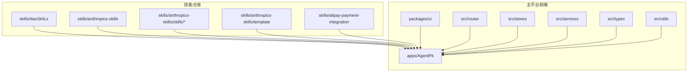
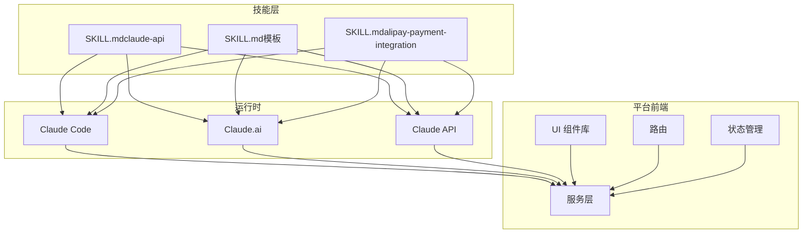
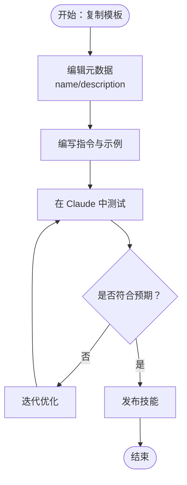
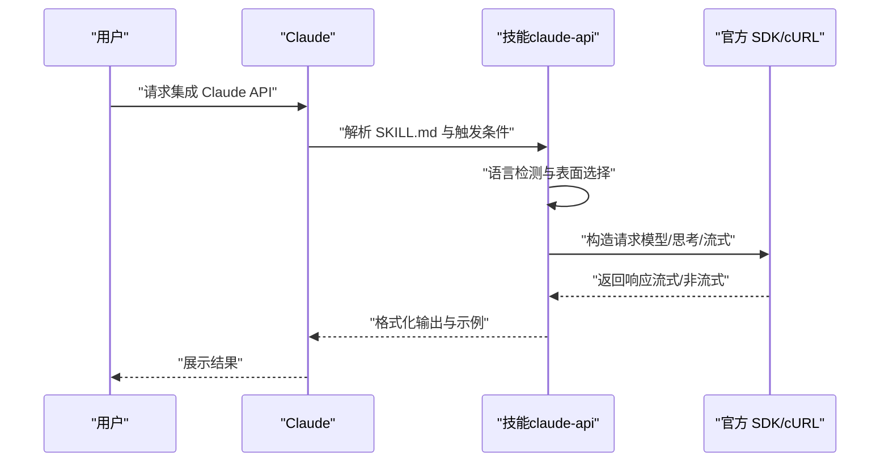
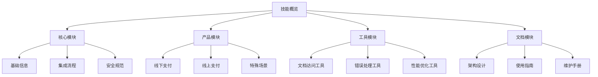
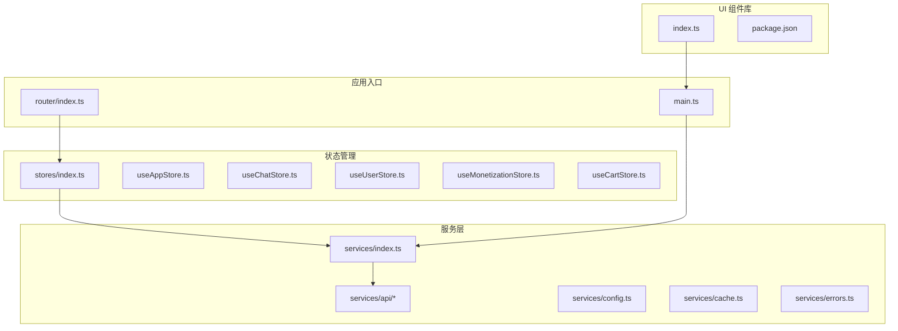
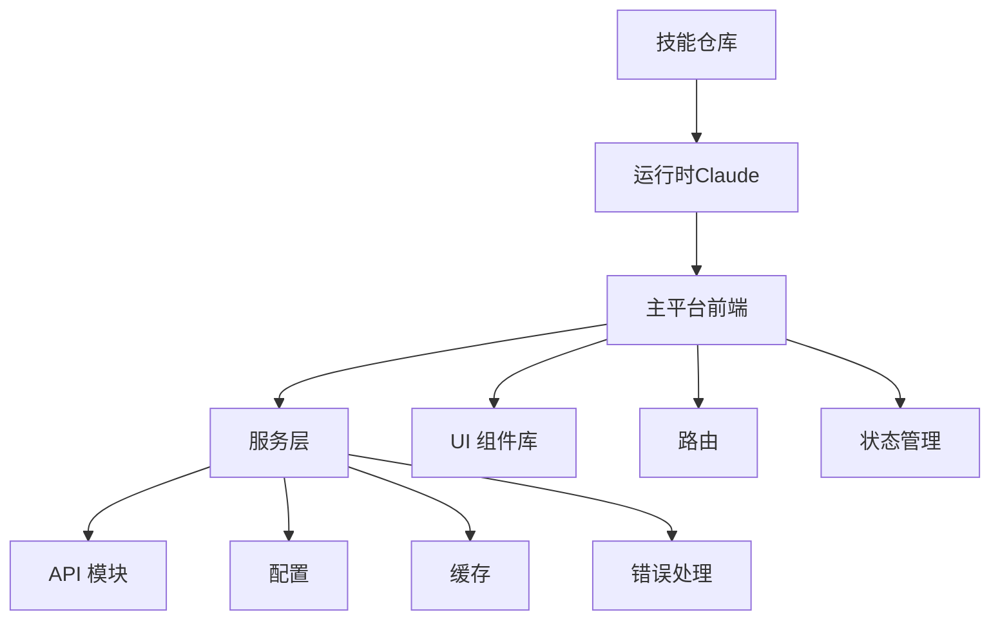

# 技能系统

<cite>
**本文引用的文件**
- [README.md](file://skills/daoSkilLs/skills/anthropics-skills/README.md)
- [SKILL.md（claude-api）](file://skills/daoSkilLs/skills/anthropics-skills/skills/claude-api/SKILL.md)
- [SKILL.md（模板）](file://skills/daoSkilLs/skills/anthropics-skills/template/SKILL.md)
- [SKILL.md（alipay-payment-integration）](file://skills/daoSkilLs/skills/alipay-payment-integration/SKILL.md)
- [README.md（AgentPit 应用）](file://apps/AgentPit/README.md)
- [index.ts（UI 组件库入口）](file://apps/AgentPit/packages/ui/src/index.ts)
- [package.json（UI 组件库）](file://apps/AgentPit/packages/ui/package.json)
- [main.ts（应用入口）](file://apps/AgentPit/src/main.ts)
- [router/index.ts（应用路由）](file://apps/AgentPit/src/router/index.ts)
- [stores（状态管理）](file://apps/AgentPit/src/stores/)
- [services/api（服务层）](file://apps/AgentPit/src/services/api/)
- [types（类型定义）](file://apps/AgentPit/src/types/)
- [logger.ts（日志工具）](file://apps/AgentPit/src/utils/logger.ts)
- [errors.ts（错误处理）](file://apps/AgentPit/src/services/errors.ts)
- [cache.ts（缓存）](file://apps/AgentPit/src/services/cache.ts)
- [config.ts（配置）](file://apps/AgentPit/src/services/config.ts)
- [index.ts（服务索引）](file://apps/AgentPit/src/services/index.ts)
- [index.ts（应用商店）](file://apps/AgentPit/src/stores/index.ts)
- [useAppStore.ts（应用状态）](file://apps/AgentPit/src/stores/useAppStore.ts)
- [useChatStore.ts（聊天状态）](file://apps/AgentPit/src/stores/useChatStore.ts)
- [useUserStore.ts（用户状态）](file://apps/AgentPit/src/stores/useUserStore.ts)
- [useMonetizationStore.ts（货币化状态）](file://apps/AgentPit/src/stores/useMonetizationStore.ts)
- [useCartStore.ts（购物车状态）](file://apps/AgentPit/src/stores/useCartStore.ts)
- [chat.ts（聊天 API）](file://src/services/api/chat.ts)
- [client.ts（通用 API 客户端）](file://src/services/api/client.ts)
- [home.ts（首页 API）](file://src/services/api/home.ts)
- [monetization.ts（货币化 API）](file://src/services/api/monetization.ts)
- [sphinx.ts（Sphinx API）](file://src/services/api/sphinx.ts)
- [index.ts（平台服务索引）](file://src/services/index.ts)
- [config.ts（平台配置）](file://src/services/config.ts)
- [cache.ts（平台缓存）](file://src/services/cache.ts)
- [errors.ts（平台错误处理）](file://src/services/errors.ts)
- [.gitignore（仓库忽略规则）](file://skills/daoSkilLs/.gitignore)
- [.gitmodules（子模块）](file://skills/daoSkilLs/.gitmodules)
</cite>

## 目录
1. [简介](#简介)
2. [项目结构](#项目结构)
3. [核心组件](#核心组件)
4. [架构总览](#架构总览)
5. [详细组件分析](#详细组件分析)
6. [依赖关系分析](#依赖关系分析)
7. [性能考虑](#性能考虑)
8. [故障排查指南](#故障排查指南)
9. [结论](#结论)
10. [附录](#附录)

## 简介
本技术文档面向 DAOApps 技能系统，聚焦以下目标：
- 技能模块化设计：以“技能”为最小可执行单元，围绕 SKILL.md 元数据与指令构建可复用能力。
- 插件系统架构：基于 Anthropic Skills 标准，支持在 Claude Code、Claude.ai 与 Claude API 中注册与使用技能。
- 技能生命周期管理：从模板生成、开发、测试到发布与版本管理的全流程。
- Anthropic Skills 集成与 Claude API 使用：提供技能开发框架、触发条件、语言检测与输出规范。
- 技能模板系统与测试策略：标准化模板与示例，确保一致性与可验证性。
- 自定义技能开发指南：环境搭建、调试方法与最佳实践。
- 与主平台的集成方式与扩展机制：前端应用与后端服务层的衔接。

## 项目结构
技能系统主要由两部分构成：
- 技能仓库（skills/daoSkilLs）：包含 Anthropic Skills 示例、模板与第三方技能（如支付宝支付集成）。
- 主平台前端应用（apps/AgentPit）：提供 UI 组件库、路由、状态管理与服务层，承载技能的展示与调用。

图示来源
- [README.md（AgentPit 应用）](file://apps/AgentPit/README.md)
- [README.md（技能仓库）](file://skills/daoSkilLs/skills/anthropics-skills/README.md)

章节来源
- [README.md（AgentPit 应用）](file://apps/AgentPit/README.md)
- [README.md（技能仓库）](file://skills/daoSkilLs/skills/anthropics-skills/README.md)

## 核心组件
- 技能模板与元数据：通过 SKILL.md 的 YAML frontmatter 提供名称、描述与触发条件；正文包含指令、示例与规范。
- 语言检测与输出规范：根据项目语言选择 SDK 或 cURL 调用，统一默认模型、思考模式与流式响应策略。
- 子命令分发：支持通过特定子命令直接触发技能中的流程，便于 CLI 快速调用。
- 模块化文档结构：将技能拆分为核心模块、产品模块、工具模块与文档模块，便于维护与扩展。
- 平台集成：前端应用通过服务层封装 API 调用，结合状态管理与 UI 组件库实现技能的可视化与交互。

章节来源
- [SKILL.md（claude-api）](file://skills/daoSkilLs/skills/anthropics-skills/skills/claude-api/SKILL.md)
- [SKILL.md（模板）](file://skills/daoSkilLs/skills/anthropics-skills/template/SKILL.md)
- [SKILL.md（alipay-payment-integration）](file://skills/daoSkilLs/skills/alipay-payment-integration/SKILL.md)

## 架构总览
技能系统采用“技能即插件”的架构，围绕 Anthropic Skills 标准实现：
- 技能作为独立单元，通过 SKILL.md 描述能力边界与使用方式。
- 在 Claude Code、Claude.ai 与 Claude API 中注册与加载技能。
- 主平台前端应用通过服务层与状态管理调用技能相关能力，形成前后端协同。

图示来源
- [README.md（技能仓库）](file://skills/daoSkilLs/skills/anthropics-skills/README.md)
- [SKILL.md（claude-api）](file://skills/daoSkilLs/skills/anthropics-skills/skills/claude-api/SKILL.md)
- [SKILL.md（模板）](file://skills/daoSkilLs/skills/anthropics-skills/template/SKILL.md)
- [SKILL.md（alipay-payment-integration）](file://skills/daoSkilLs/skills/alipay-payment-integration/SKILL.md)

## 详细组件分析

### 组件一：技能模板系统
- 设计要点
  - 使用 YAML frontmatter 定义技能名称与描述，确保唯一标识与用途说明。
  - 正文包含指令、示例与规范，便于 Claude 理解与执行。
  - 通过模板快速生成新技能，降低重复工作量。
- 开发流程
  - 复制模板文件并修改 frontmatter 与正文内容。
  - 在 Claude Code、Claude.ai 或 Claude API 中注册与测试。
  - 发布前进行一致性检查与示例验证。

图示来源
- [SKILL.md（模板）](file://skills/daoSkilLs/skills/anthropics-skills/template/SKILL.md)

章节来源
- [SKILL.md（模板）](file://skills/daoSkilLs/skills/anthropics-skills/template/SKILL.md)

### 组件二：Claude API 技能（claude-api）
- 设计要点
  - 明确触发条件与禁用条件，避免与其他 SDK 混用。
  - 语言检测与输出规范：优先使用官方 SDK，否则使用 cURL/raw HTTP。
  - 默认模型、思考模式与流式响应策略，确保稳定性与性能。
  - 子命令分发机制，支持直接调用特定流程。
- 关键流程
  - 语言检测：依据文件扩展名与配置文件推断语言。
  - 表面选择：单次调用、工具调用、代理或托管代理的决策树。
  - 架构：统一通过消息接口，工具与输出约束为该端点特性。
  - 模型与思考：使用指定模型 ID，推荐自适应思考；提示词缓存与压缩策略。
  - 托管代理（Beta）：持久化代理配置与会话，按需启用 beta 头部。
- 测试策略
  - 单元测试覆盖语言检测与表面选择逻辑。
  - 集成测试验证 SDK 调用链路与错误处理。
  - 性能测试评估长对话与大令牌场景下的缓存命中率与延迟。

图示来源
- [SKILL.md（claude-api）](file://skills/daoSkilLs/skills/anthropics-skills/skills/claude-api/SKILL.md)

章节来源
- [SKILL.md（claude-api）](file://skills/daoSkilLs/skills/anthropics-skills/skills/claude-api/SKILL.md)

### 组件三：模块化技能（alipay-payment-integration）
- 设计要点
  - 将技能拆分为基础信息、集成流程、安全规范、产品模块、工具模块与文档模块。
  - 通过模块化文档结构提升可维护性与可扩展性。
- 开发与维护
  - 按模块更新与校验，确保一致性与准确性。
  - 结合参考清单与决策树，减少集成风险。

图示来源
- [SKILL.md（alipay-payment-integration）](file://skills/daoSkilLs/skills/alipay-payment-integration/SKILL.md)

章节来源
- [SKILL.md（alipay-payment-integration）](file://skills/daoSkilLs/skills/alipay-payment-integration/SKILL.md)

### 组件四：平台前端集成（AgentPit）
- 设计要点
  - UI 组件库提供统一风格与可复用组件。
  - 路由与状态管理分离职责，提升可维护性。
  - 服务层封装 API 调用，统一错误处理与缓存策略。
- 关键模块
  - UI 组件库入口与配置。
  - 应用入口与路由配置。
  - 状态管理（应用、聊天、用户、货币化、购物车）。
  - 服务层（聊天、首页、货币化、Sphinx 等 API）。
  - 类型定义与日志工具。

图示来源
- [index.ts（UI 组件库入口）](file://apps/AgentPit/packages/ui/src/index.ts)
- [package.json（UI 组件库）](file://apps/AgentPit/packages/ui/package.json)
- [main.ts（应用入口）](file://apps/AgentPit/src/main.ts)
- [router/index.ts（应用路由）](file://apps/AgentPit/src/router/index.ts)
- [index.ts（应用商店）](file://apps/AgentPit/src/stores/index.ts)
- [useAppStore.ts（应用状态）](file://apps/AgentPit/src/stores/useAppStore.ts)
- [useChatStore.ts（聊天状态）](file://apps/AgentPit/src/stores/useChatStore.ts)
- [useUserStore.ts（用户状态）](file://apps/AgentPit/src/stores/useUserStore.ts)
- [useMonetizationStore.ts（货币化状态）](file://apps/AgentPit/src/stores/useMonetizationStore.ts)
- [useCartStore.ts（购物车状态）](file://apps/AgentPit/src/stores/useCartStore.ts)
- [index.ts（服务索引）](file://apps/AgentPit/src/services/index.ts)
- [chat.ts（聊天 API）](file://src/services/api/chat.ts)
- [client.ts（通用 API 客户端）](file://src/services/api/client.ts)
- [home.ts（首页 API）](file://src/services/api/home.ts)
- [monetization.ts（货币化 API）](file://src/services/api/monetization.ts)
- [sphinx.ts（Sphinx API）](file://src/services/api/sphinx.ts)
- [config.ts（平台配置）](file://src/services/config.ts)
- [cache.ts（平台缓存）](file://src/services/cache.ts)
- [errors.ts（平台错误处理）](file://src/services/errors.ts)

章节来源
- [index.ts（UI 组件库入口）](file://apps/AgentPit/packages/ui/src/index.ts)
- [package.json（UI 组件库）](file://apps/AgentPit/packages/ui/package.json)
- [main.ts（应用入口）](file://apps/AgentPit/src/main.ts)
- [router/index.ts（应用路由）](file://apps/AgentPit/src/router/index.ts)
- [index.ts（应用商店）](file://apps/AgentPit/src/stores/index.ts)
- [useAppStore.ts（应用状态）](file://apps/AgentPit/src/stores/useAppStore.ts)
- [useChatStore.ts（聊天状态）](file://apps/AgentPit/src/stores/useChatStore.ts)
- [useUserStore.ts（用户状态）](file://apps/AgentPit/src/stores/useUserStore.ts)
- [useMonetizationStore.ts（货币化状态）](file://apps/AgentPit/src/stores/useMonetizationStore.ts)
- [useCartStore.ts（购物车状态）](file://apps/AgentPit/src/stores/useCartStore.ts)
- [index.ts（服务索引）](file://apps/AgentPit/src/services/index.ts)
- [chat.ts（聊天 API）](file://src/services/api/chat.ts)
- [client.ts（通用 API 客户端）](file://src/services/api/client.ts)
- [home.ts（首页 API）](file://src/services/api/home.ts)
- [monetization.ts（货币化 API）](file://src/services/api/monetization.ts)
- [sphinx.ts（Sphinx API）](file://src/services/api/sphinx.ts)
- [config.ts（平台配置）](file://src/services/config.ts)
- [cache.ts（平台缓存）](file://src/services/cache.ts)
- [errors.ts（平台错误处理）](file://src/services/errors.ts)

## 依赖关系分析
- 技能仓库与主平台的耦合点
  - 技能通过标准格式（SKILL.md）与 Claude 生态交互，不直接依赖主平台前端。
  - 主平台前端通过服务层与 API 客户端封装调用，间接使用技能能力。
- 内部依赖
  - UI 组件库被应用入口引用，路由与状态管理依赖服务层。
  - 服务层统一管理配置、缓存与错误处理，API 模块按领域划分。

图示来源
- [README.md（技能仓库）](file://skills/daoSkilLs/skills/anthropics-skills/README.md)
- [index.ts（服务索引）](file://apps/AgentPit/src/services/index.ts)
- [config.ts（平台配置）](file://apps/AgentPit/src/services/config.ts)
- [cache.ts（平台缓存）](file://apps/AgentPit/src/services/cache.ts)
- [errors.ts（平台错误处理）](file://apps/AgentPit/src/services/errors.ts)

章节来源
- [README.md（技能仓库）](file://skills/daoSkilLs/skills/anthropics-skills/README.md)
- [index.ts（服务索引）](file://apps/AgentPit/src/services/index.ts)
- [config.ts（平台配置）](file://apps/AgentPit/src/services/config.ts)
- [cache.ts（平台缓存）](file://apps/AgentPit/src/services/cache.ts)
- [errors.ts（平台错误处理）](file://apps/AgentPit/src/services/errors.ts)

## 性能考虑
- 提示词缓存
  - 使用顶层自动缓存与断点放置策略，避免静默失效因素（时间戳、无序 JSON、动态工具集）。
  - 通过用量指标验证缓存命中情况，持续优化前缀稳定性。
- 思考与努力
  - Opus/Sonnet 推荐自适应思考，避免过时的预算令牌参数。
  - 通过努力级别控制思考深度与整体开销，在正确性与成本间取得平衡。
- 流式响应
  - 对长输入/输出与高最大令牌数请求启用流式传输，防止超时。
  - 使用 SDK 提供的最终消息聚合辅助函数，避免手动事件监听引发的复杂度。
- 压缩与上下文管理
  - 在接近上下文窗口阈值时启用服务器端压缩，保留压缩块以维持历史摘要。
- 批处理与文件复用
  - 对非实时任务使用批处理端点，降低成本。
  - 文件跨请求复用避免重复上传。

## 故障排查指南
- 常见问题与对策
  - SDK 功能误用：优先使用 SDK 提供的高阶助手与类型，避免重复造轮子。
  - 错误处理：使用 SDK 的专用异常类而非字符串匹配，提升健壮性。
  - 输出格式：使用结构化输出替代已弃用的参数，确保响应格式一致。
  - 工具调用 JSON 解析：Opus 4.6 可能产生不同的转义形式，务必使用解析器而非原始字符串匹配。
- 日志与缓存
  - 使用统一日志工具记录关键路径与参数，便于定位问题。
  - 缓存命中率低时，检查前缀稳定性与断点位置，修正静默失效因素。
- 平台侧错误处理
  - 服务层集中处理错误，统一返回格式与重试策略。
  - 配置与缓存模块提供兜底能力，减少外部依赖波动对业务的影响。

章节来源
- [logger.ts（日志工具）](file://apps/AgentPit/src/utils/logger.ts)
- [cache.ts（平台缓存）](file://apps/AgentPit/src/services/cache.ts)
- [errors.ts（平台错误处理）](file://apps/AgentPit/src/services/errors.ts)
- [config.ts（平台配置）](file://apps/AgentPit/src/services/config.ts)

## 结论
DAOApps 技能系统以 Anthropic Skills 为标准，结合模块化设计与模板化开发，实现了可复用、可测试、可发布的技能能力。通过 Claude Code、Claude.ai 与 Claude API 的多端集成，技能能够在不同场景中被灵活调用。主平台前端通过 UI 组件库、路由、状态管理与服务层，提供了稳定的承载与扩展能力。建议在后续实践中进一步完善自动化测试与发布流程，持续优化性能与用户体验。

## 附录
- 自定义技能开发指南（概述）
  - 环境搭建：准备 Claude Code 或 Claude API 访问权限，克隆技能仓库。
  - 开发步骤：复制模板 → 编辑元数据与指令 → 本地测试 → 注册与验证。
  - 调试方法：利用日志工具与缓存命中率监控，结合 SDK 异常类定位问题。
  - 最佳实践：遵循输出规范与语言检测规则，优先使用官方 SDK，合理使用流式响应与提示词缓存。
- 技能测试策略（概述）
  - 单元测试：覆盖语言检测、表面选择与子命令分发。
  - 集成测试：验证 SDK 调用链路与错误处理。
  - 性能测试：评估长对话、大令牌与缓存策略的效果。
- 技能发布流程与版本管理（概述）
  - 发布前检查：一致性校验、示例验证与性能回归测试。
  - 版本管理：基于 Git 标签与子模块管理，确保可追溯性与可回滚性。
- 与主平台的集成方式与扩展机制（概述）
  - 前端集成：通过服务层封装 API 调用，结合状态管理与 UI 组件库实现可视化。
  - 后端扩展：按领域拆分 API 模块，统一配置、缓存与错误处理，便于横向扩展。