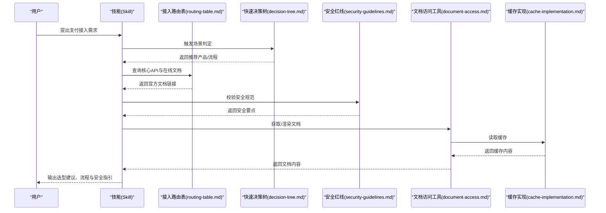
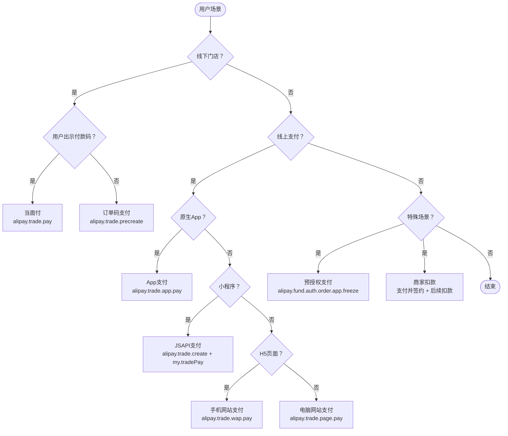
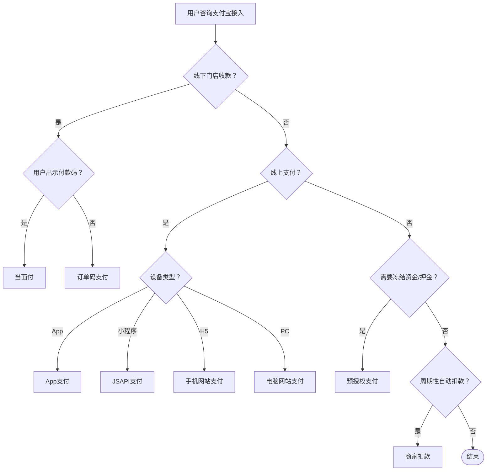
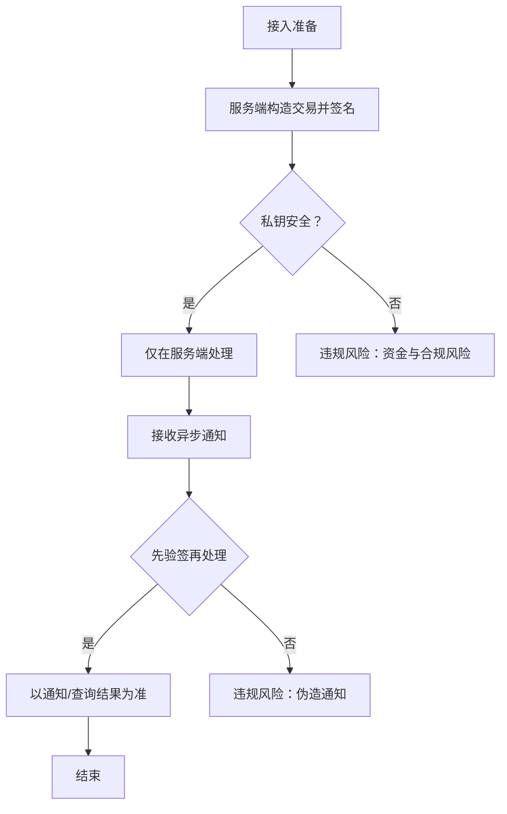
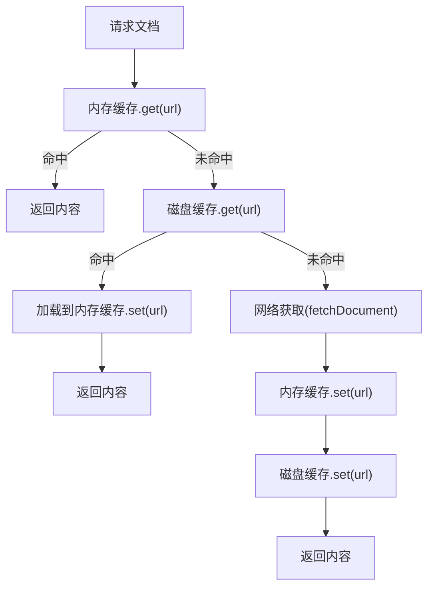
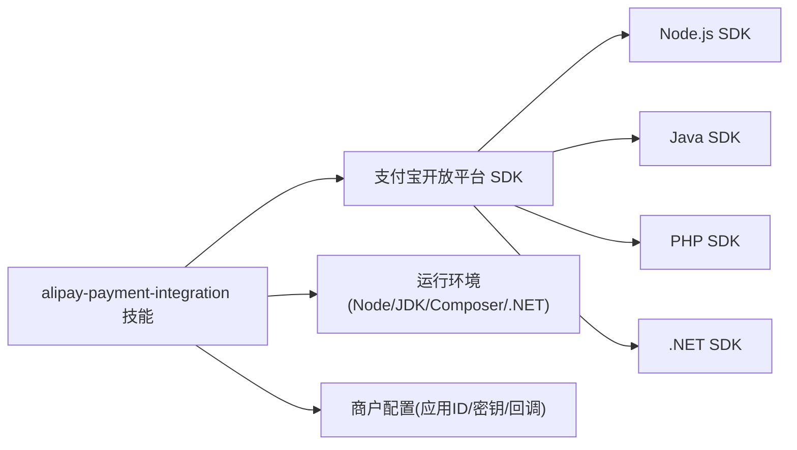

# 支付集成技能

<cite>
**本文引用的文件**
- [SKILL.md](file://skills/daoSkilLs/skills/alipay-payment-integration/SKILL.md)
- [routing-table.md](file://skills/daoSkilLs/skills/alipay-payment-integration/modules/core/routing-table.md)
- [decision-tree.md](file://skills/daoSkilLs/skills/alipay-payment-integration/modules/core/decision-tree.md)
- [security-guidelines.md](file://skills/daoSkilLs/skills/alipay-payment-integration/modules/core/security-guidelines.md)
- [cache-implementation.md](file://skills/daoSkilLs/skills/alipay-payment-integration/modules/utils/cache-implementation.md)
- [README.md](file://skills/daoSkilLs/README.md)
</cite>

## 目录
1. [简介](#简介)
2. [项目结构](#项目结构)
3. [核心组件](#核心组件)
4. [架构总览](#架构总览)
5. [详细组件分析](#详细组件分析)
6. [依赖关系分析](#依赖关系分析)
7. [性能考量](#性能考量)
8. [故障排查指南](#故障排查指南)
9. [结论](#结论)
10. [附录](#附录)

## 简介
本技能面向“支付宝开放平台支付产品接入”，覆盖线下当面付、订单码支付，线上 App 支付、JSAPI 支付、手机网站支付、电脑网站支付，以及预授权支付、商家扣款等特殊场景。通过模块化的文档与工具，提供产品选型、接入流程、安全规范、缓存与性能优化、错误处理与集成校验的系统化指导。

## 项目结构
DAO Skills 体系下的支付宝支付集成技能采用“技能目录 + 模块化子目录”的组织方式，便于维护与扩展。核心模块包括：
- 核心模块（core）：环境说明、集成流程、路由表、决策树、安全规范、关键词匹配、澄清话术等
- 产品模块（products）：按支付场景细分的接入指南
- 工具模块（utils）：文档访问、错误处理、性能优化、缓存实现等
- 文档模块（docs）：架构设计、使用指南、维护手册、测试与性能分析等
- 参考资料（references）：校验清单、术语表、错误码等

```mermaid
graph TB
subgraph "技能根目录"
SKILL["SKILL.md"]
end
subgraph "核心模块(core)"
ENV["environment.md"]
ROUTE["routing-table.md"]
DECISION["decision-tree.md"]
SEC["security-guidelines.md"]
KWM["keyword-matching.md"]
CLAR["clarification-script.md"]
PROC["integration-process.md"]
NOTES["notes.md"]
end
subgraph "产品模块(products)"
F2F["face-to-face-payment.md"]
ORDER["order-code-payment.md"]
APP["app-payment.md"]
JSAPI["jsapi-payment.md"]
MW["mobile-web-payment.md"]
PC["pc-web-payment.md"]
PREAUTH["pre-authorization.md"]
MERCHANT["merchant-debit.md"]
end
subgraph "工具模块(utils)"
DOCACC["document-access.md"]
ERR["error-handling.md"]
PERF["performance-optimization.md"]
CACHE["cache-implementation.md"]
end
subgraph "文档模块(docs)"
ARCH["architecture.md"]
USAGE["usage-guide.md"]
MAINTAIN["maintenance-guide.md"]
PERFDOC["performance-analysis.md"]
TEST["testing-plan.md"]
end
subgraph "参考资料(references)"
CHECK["checklist.md"]
REF["execution-flow.md"]
TERM["terminology.md"]
EX["examples-v2.md"]
end
SKILL --> ENV
SKILL --> ROUTE
SKILL --> DECISION
SKILL --> SEC
SKILL --> KWM
SKILL --> CLAR
SKILL --> PROC
SKILL --> NOTES
SKILL --> F2F
SKILL --> ORDER
SKILL --> APP
SKILL --> JSAPI
SKILL --> MW
SKILL --> PC
SKILL --> PREAUTH
SKILL --> MERCHANT
SKILL --> DOCACC
SKILL --> ERR
SKILL --> PERF
SKILL --> CACHE
SKILL --> ARCH
SKILL --> USAGE
SKILL --> MAINTAIN
SKILL --> PERFDOC
SKILL --> TEST
SKILL --> CHECK
SKILL --> REF
SKILL --> TERM
SKILL --> EX
```

图表来源
- [SKILL.md:1-64](file://skills/daoSkilLs/skills/alipay-payment-integration/SKILL.md#L1-L64)
- [routing-table.md:1-17](file://skills/daoSkilLs/skills/alipay-payment-integration/modules/core/routing-table.md#L1-L17)
- [decision-tree.md:1-22](file://skills/daoSkilLs/skills/alipay-payment-integration/modules/core/decision-tree.md#L1-L22)
- [security-guidelines.md:1-11](file://skills/daoSkilLs/skills/alipay-payment-integration/modules/core/security-guidelines.md#L1-L11)
- [cache-implementation.md:1-243](file://skills/daoSkilLs/skills/alipay-payment-integration/modules/utils/cache-implementation.md#L1-L243)

章节来源
- [SKILL.md:1-64](file://skills/daoSkilLs/skills/alipay-payment-integration/SKILL.md#L1-L64)
- [README.md:168-212](file://skills/daoSkilLs/README.md#L168-L212)

## 核心组件
- 接入路由表：基于业务场景映射到推荐产品与核心 API，指引用户查阅官方在线文档
- 快速决策树：帮助快速判断适用的支付产品（线下/线上/预授权/周期扣款）
- 安全红线：明确服务端签名、异步通知验签、前台结果不可信等安全原则
- 集成流程约束：规范接入流程与前置条件
- 关键词匹配与澄清话术：提升与用户沟通效率，确保场景理解准确
- 缓存实现：内存+磁盘双层缓存，降低文档访问延迟与网络开销

章节来源
- [routing-table.md:1-17](file://skills/daoSkilLs/skills/alipay-payment-integration/modules/core/routing-table.md#L1-L17)
- [decision-tree.md:1-22](file://skills/daoSkilLs/skills/alipay-payment-integration/modules/core/decision-tree.md#L1-L22)
- [security-guidelines.md:1-11](file://skills/daoSkilLs/skills/alipay-payment-integration/modules/core/security-guidelines.md#L1-L11)
- [cache-implementation.md:1-243](file://skills/daoSkilLs/skills/alipay-payment-integration/modules/utils/cache-implementation.md#L1-L243)

## 架构总览
支付宝支付集成技能的“文档驱动 + 工具支撑”架构，围绕“产品选型—接入流程—安全规范—性能优化—错误处理”闭环展开。核心流程如下：

图表来源
- [decision-tree.md:1-22](file://skills/daoSkilLs/skills/alipay-payment-integration/modules/core/decision-tree.md#L1-L22)
- [routing-table.md:1-17](file://skills/daoSkilLs/skills/alipay-payment-integration/modules/core/routing-table.md#L1-L17)
- [security-guidelines.md:1-11](file://skills/daoSkilLs/skills/alipay-payment-integration/modules/core/security-guidelines.md#L1-L11)
- [cache-implementation.md:1-243](file://skills/daoSkilLs/skills/alipay-payment-integration/modules/utils/cache-implementation.md#L1-L243)

## 详细组件分析

### 接入路由表（按场景到产品/API）
- 线下门店：用户出示付款码 → 当面付；商家出示二维码 → 订单码支付
- 线上支付：原生 App（iOS/Android/鸿蒙）→ App 支付；小程序 → JSAPI 支付；H5 → 手机网站支付；PC 网页 → 电脑网站支付
- 特殊场景：押金/冻结/信用住 → 预授权支付；周期扣款/自动续费/会员订阅 → 商家扣款

图表来源
- [routing-table.md:1-17](file://skills/daoSkilLs/skills/alipay-payment-integration/modules/core/routing-table.md#L1-L17)

章节来源
- [routing-table.md:1-17](file://skills/daoSkilLs/skills/alipay-payment-integration/modules/core/routing-table.md#L1-L17)

### 快速决策树
- 以“线下/线上/预授权/周期扣款”为主线，帮助快速定位产品与流程
- 与路由表配合，形成“场景→产品→API→文档”的闭环

图表来源
- [decision-tree.md:1-22](file://skills/daoSkilLs/skills/alipay-payment-integration/modules/core/decision-tree.md#L1-L22)

章节来源
- [decision-tree.md:1-22](file://skills/daoSkilLs/skills/alipay-payment-integration/modules/core/decision-tree.md#L1-L22)

### 安全规范（安全红线）
- 私钥严禁出现在客户端、日志、公共仓库
- 前台同步结果不可信，必须以异步通知或查询接口为准
- 未确认不重付；异步通知必须先验签

图表来源
- [security-guidelines.md:1-11](file://skills/daoSkilLs/skills/alipay-payment-integration/modules/core/security-guidelines.md#L1-L11)

章节来源
- [security-guidelines.md:1-11](file://skills/daoSkilLs/skills/alipay-payment-integration/modules/core/security-guidelines.md#L1-L11)

### 缓存实现（内存+磁盘）
- 内存缓存：LRU 淘汰、24 小时过期、按大小阈值回收
- 磁盘缓存：本地文件系统、压缩存储、定期清理
- 访问流程：内存命中 → 磁盘命中 → 网络拉取 → 双缓存回填

图表来源
- [cache-implementation.md:1-243](file://skills/daoSkilLs/skills/alipay-payment-integration/modules/utils/cache-implementation.md#L1-L243)

章节来源
- [cache-implementation.md:1-243](file://skills/daoSkilLs/skills/alipay-payment-integration/modules/utils/cache-implementation.md#L1-L243)

### 产品模块概览（场景与API）
- 线下支付：当面付、订单码支付
- 线上支付：App 支付、JSAPI 支付、手机网站支付、电脑网站支付
- 特殊场景：预授权支付、商家扣款

章节来源
- [SKILL.md:37-52](file://skills/daoSkilLs/skills/alipay-payment-integration/SKILL.md#L37-L52)

### 工具模块（文档访问、错误处理、性能优化）
- 文档访问工具：统一获取与渲染文档，结合缓存
- 错误处理工具：标准化异常捕获、重试与降级
- 性能优化工具：缓存策略、并发控制、超时与重试

章节来源
- [cache-implementation.md:1-243](file://skills/daoSkilLs/skills/alipay-payment-integration/modules/utils/cache-implementation.md#L1-L243)
- [SKILL.md:53-58](file://skills/daoSkilLs/skills/alipay-payment-integration/SKILL.md#L53-L58)

### 文档模块（架构设计、使用指南、维护手册）
- 架构设计：模块划分、依赖关系、数据流
- 使用指南：触发条件、输出格式、最佳实践
- 维护手册：版本演进、变更策略、回滚方案

章节来源
- [SKILL.md:59-64](file://skills/daoSkilLs/skills/alipay-payment-integration/SKILL.md#L59-L64)

## 依赖关系分析
- 技能依赖：支付宝开放平台 SDK（Node/Java/PHP/.NET），需按语言选择相应依赖
- 环境依赖：Node.js v12+、JDK 8+、Composer、.NET Framework 等
- 配置依赖：商户账户、应用ID、私钥、支付宝公钥、回调通知URL

图表来源
- [README.md:361-387](file://skills/daoSkilLs/README.md#L361-L387)

章节来源
- [README.md:361-387](file://skills/daoSkilLs/README.md#L361-L387)

## 性能考量
- 缓存策略：内存+磁盘双层缓存，显著降低文档访问延迟与网络开销
- 命中率与清理：定期清理过期缓存，监控命中率与大小，避免内存溢出
- 预加载：对高频文档进行预加载，提升命中率
- 并发与超时：控制并发数与请求超时，结合重试与降级策略

章节来源
- [cache-implementation.md:204-243](file://skills/daoSkilLs/skills/alipay-payment-integration/modules/utils/cache-implementation.md#L204-L243)

## 故障排查指南
- 私钥泄露/日志外泄/公共仓库暴露：立即更换密钥、扫描并清理敏感信息
- 前台结果不可信导致重复支付：严格以异步通知/查询接口为准
- 未验签即处理：优先验签，拒绝伪造通知
- 缓存异常：检查缓存目录权限、压缩文件完整性、过期清理策略

章节来源
- [security-guidelines.md:1-11](file://skills/daoSkilLs/skills/alipay-payment-integration/modules/core/security-guidelines.md#L1-L11)
- [cache-implementation.md:140-168](file://skills/daoSkilLs/skills/alipay-payment-integration/modules/utils/cache-implementation.md#L140-L168)

## 结论
通过“路由表+决策树+安全红线+缓存实现+工具模块”的组合，支付宝支付集成技能提供了从场景识别到接入落地、从安全合规到性能优化的全链路指导。建议在实际集成中：
- 严格遵循安全红线，确保服务端签名与验签
- 基于路由表与决策树快速定位产品与API
- 结合缓存策略与错误处理工具，提升稳定性与性能
- 使用集成校验清单与官方文档，保障上线质量

## 附录
- 触发关键词：接入支付宝、集成支付宝支付、对接支付、支付宝收款、加个支付功能、支付宝下单、H5支付、小程序支付、预授权、付款码、扫码支付、网页支付、PC支付、周期扣款、自动续费、会员订阅、连续包月、代扣
- 依赖安装与配置：按语言选择对应 SDK，并完成商户配置

章节来源
- [SKILL.md:4-9](file://skills/daoSkilLs/skills/alipay-payment-integration/SKILL.md#L4-L9)
- [README.md:361-394](file://skills/daoSkilLs/README.md#L361-L394)