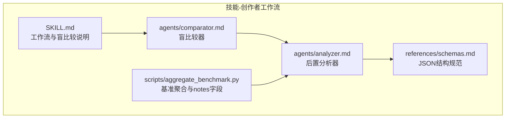
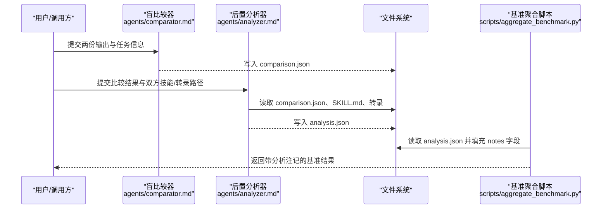
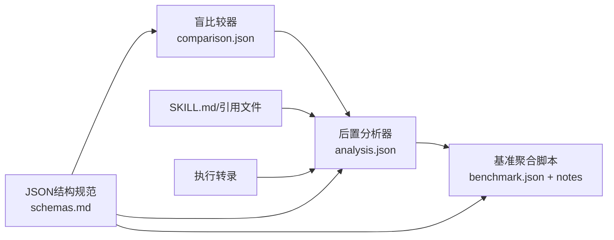

# 分析器代理

<cite>
**本文引用的文件**
- [analyzer.md](file://skills/daoSkilLs/skills/anthropics-skills/skills/skill-creator/agents/analyzer.md)
- [comparator.md](file://skills/daoSkilLs/skills/anthropics-skills/skills/skill-creator/agents/comparator.md)
- [schemas.md](file://skills/daoSkilLs/skills/anthropics-skills/skills/skill-creator/references/schemas.md)
- [SKILL.md](file://skills/daoSkilLs/skills/anthropics-skills/skills/skill-creator/SKILL.md)
- [aggregate_benchmark.py](file://skills/daoSkilLs/skills/anthropics-skills/skills/skill-creator/scripts/aggregate_benchmark.py)
</cite>

## 目录
1. [简介](#简介)
2. [项目结构](#项目结构)
3. [核心组件](#核心组件)
4. [架构总览](#架构总览)
5. [详细组件分析](#详细组件分析)
6. [依赖关系分析](#依赖关系分析)
7. [性能考量](#性能考量)
8. [故障排查指南](#故障排查指南)
9. [结论](#结论)
10. [附录](#附录)

## 简介
本文件面向“后置分析器代理（Post-hoc Analyzer Agent）”，系统性阐述其在盲比较（Blind Comparison）之后对胜负结果进行深度剖析与改进建议生成的工作机制。该代理以“解盲”为目标，结合双方技能定义与执行转录，定位胜负关键因素，量化指令遵循度，并给出可落地的改进优先级与类别归类，帮助优化失败方技能，提升后续评测表现。

## 项目结构
围绕分析器代理的关键文档与规范位于“技能-创作者（skill-creator）”子技能中，主要文件如下：
- agents/analyzer.md：定义分析器角色、输入、处理流程、输出格式与指导原则
- agents/comparator.md：定义盲比较器的角色、输入、评分维度与输出格式
- references/schemas.md：定义 benchmark.json、grading.json、comparison.json、analysis.json 等关键产物的结构
- scripts/aggregate_benchmark.py：聚合基准评测结果并为分析器留出 notes 字段
- SKILL.md：技能创作工作流中关于“盲比较”的说明与前后流程衔接

**图表来源**
- [SKILL.md](file://skills/daoSkilLs/skills/anthropics-skills/skills/skill-creator/SKILL.md)
- [comparator.md](file://skills/daoSkilLs/skills/anthropics-skills/skills/skill-creator/agents/comparator.md)
- [analyzer.md](file://skills/daoSkilLs/skills/anthropics-skills/skills/skill-creator/agents/analyzer.md)
- [schemas.md](file://skills/daoSkilLs/skills/anthropics-skills/skills/skill-creator/references/schemas.md)
- [aggregate_benchmark.py](file://skills/daoSkilLs/skills/anthropics-skills/skills/skill-creator/scripts/aggregate_benchmark.py)

**章节来源**
- [SKILL.md](file://skills/daoSkilLs/skills/anthropics-skills/skills/skill-creator/SKILL.md)
- [analyzer.md](file://skills/daoSkilLs/skills/anthropics-skills/skills/skill-creator/agents/analyzer.md)
- [comparator.md](file://skills/daoSkilLs/skills/anthropics-skills/skills/skill-creator/agents/comparator.md)
- [schemas.md](file://skills/daoSkilLs/skills/anthropics-skills/skills/skill-creator/references/schemas.md)
- [aggregate_benchmark.py](file://skills/daoSkilLs/skills/anthropics-skills/skills/skill-creator/scripts/aggregate_benchmark.py)

## 核心组件
- 后置分析器代理（Analyzer）
  - 角色：在盲比较确定胜负后，基于比较结果、双方技能定义与执行转录，提取“为何获胜者胜出”的因果洞察，并生成可操作的改进建议
  - 输入参数：winner、winner_skill_path、winner_transcript_path、loser_skill_path、loser_transcript_path、comparison_result_path、output_path
  - 处理流程：读取比较结果 → 对比双方技能结构 → 对比双方执行转录 → 指令遵循度打分 → 总结胜者优势与败者短板 → 生成建议（按影响优先级与类别） → 输出结构化分析结果
  - 输出格式：analysis.json（包含比较摘要、胜者优势、败者短板、指令遵循度、改进建议、转录洞察）

- 盲比较器（Comparator）
  - 角色：对两份输出进行客观质量判定，不暴露来源技能，依据内容与结构维度评分
  - 输入参数：output_a_path、output_b_path、eval_prompt、expectations
  - 输出格式：comparison.json（包含胜负、理由、内容/结构评分、期望通过率等）

- JSON结构规范（schemas.md）
  - 定义 analysis.json、comparison.json、benchmark.json、grading.json 等产物的字段与层级，确保跨模块一致性

**章节来源**
- [analyzer.md](file://skills/daoSkilLs/skills/anthropics-skills/skills/skill-creator/agents/analyzer.md)
- [comparator.md](file://skills/daoSkilLs/skills/anthropics-skills/skills/skill-creator/agents/comparator.md)
- [schemas.md](file://skills/daoSkilLs/skills/anthropics-skills/skills/skill-creator/references/schemas.md)

## 架构总览
下图展示了从盲比较到后置分析再到最终分析报告的端到端流程：

**图表来源**
- [comparator.md](file://skills/daoSkilLs/skills/anthropics-skills/skills/skill-creator/agents/comparator.md)
- [analyzer.md](file://skills/daoSkilLs/skills/anthropics-skills/skills/skill-creator/agents/analyzer.md)
- [schemas.md](file://skills/daoSkilLs/skills/anthropics-skills/skills/skill-creator/references/schemas.md)
- [aggregate_benchmark.py](file://skills/daoSkilLs/skills/anthropics-skills/skills/skill-creator/scripts/aggregate_benchmark.py)

## 详细组件分析

### 组件A：后置分析器代理（Analyzer）
- 角色与目标
  - 在盲比较确定胜负后，解盲比较结果，深入剖析“胜者为何胜出”以及“败者何以失败”
  - 产出结构化分析，聚焦可改进的技能内容，而非对代理行为的主观评价

- 输入参数
  - winner：A 或 B（来自盲比较）
  - winner_skill_path、loser_skill_path：分别对应产生优胜/劣汰输出的技能路径
  - winner_transcript_path、loser_transcript_path：对应的执行转录路径
  - comparison_result_path：盲比较输出 comparison.json 的路径
  - output_path：分析结果 analysis.json 的保存路径

- 处理流程（步骤1-8）
  - 步骤1：读取比较结果
    - 解析 comparison.json，记录胜负方、评委理由与各项评分
    - 明确评委看重的优劣维度（如内容正确性、结构清晰度等）
  - 步骤2：读取双方技能
    - 读取胜者与败者的 SKILL.md 及关键引用文件
    - 对比结构差异：指令清晰度与具体性、脚本/工具使用模式、示例覆盖度、边缘场景处理
  - 步骤3：读取双方转录
    - 对比执行模式：是否严格遵循技能指令、工具使用差异、偏离最优行为的节点、错误与恢复尝试
  - 步骤4：指令遵循度分析
    - 逐项评估：是否遵循显式指令、是否使用技能提供的脚本/工具、是否错失利用技能内容的机会、是否引入无关步骤
    - 为双方打分（1-10），并列出具体问题
  - 步骤5：总结胜者优势
    - 明确胜者在哪些方面更优：更清晰的指令、更好的脚本/工具、更全面的示例、更好的错误处理
    - 引用技能与转录中的具体语句作为佐证
  - 步骤6：识别败者短板
    - 明确导致失败的结构性弱点：指令模糊、缺少脚本/工具、边缘场景缺失、错误处理不当
  - 步骤7：生成改进建议
    - 基于上述分析，提出可落地的改进建议：指令调整、脚本/模板增补、示例补充、边缘场景与错误处理策略
    - 按影响优先级排序（高/中/低），聚焦能改变胜负结果的改动
  - 步骤8：写入分析结果
    - 将结构化分析写入 analysis.json，供后续基准聚合与可视化使用

- 输出格式（analysis.json）
  - 结构字段
    - comparison_summary：包含 winner、winner_skill、loser_skill、comparator_reasoning
    - winner_strengths：字符串数组，列举胜者优势
    - loser_weaknesses：字符串数组，列举败者短板
    - instruction_following：双方指令遵循度评分与问题清单
    - improvement_suggestions：建议数组，含 priority、category、suggestion、expected_impact
    - transcript_insights：双方执行模式洞察
  - 类别与优先级
    - 建议类别：instructions、tools、examples、error_handling、structure、references
    - 优先级：high（可能改变胜负）、medium（提升质量但不改输赢）、low（锦上添花）

- 使用示例（概念性说明）
  - 场景1：文档处理技能对比
    - 输入：winner=A、winner_skill_path=/skills/doc-processing、loser_skill_path=/skills/doc-processing-v1、comparison_result_path=.../comparison.json、output_path=.../analysis.json
    - 过程：分析发现胜者具备明确的验证脚本与OCR失败回退策略；败者指令模糊且缺少验证步骤
    - 输出：analysis.json 中包含“建议增加验证脚本”“建议补充OCR失败回退步骤”等高优先级建议
  - 场景2：数据导出技能对比
    - 输入：winner=B、comparison_result_path=.../comparison.json、transcript 路径
    - 过程：败者在转录中多次偏离技能步骤，引入额外工具导致输出不一致
    - 输出：analysis.json 中包含“建议精简工具链”“建议将步骤固化为脚本”等建议

- 关键评估标准
  - 指令遵循度：1-10 分，关注是否遵循显式步骤、是否使用技能提供的工具、是否遗漏关键环节
  - 影响评估：建议应说明预期影响，如“消除歧义导致的不一致行为”
  - 因果判断：需区分“技能缺陷直接导致更差输出”与“偶然因素”

**章节来源**
- [analyzer.md](file://skills/daoSkilLs/skills/anthropics-skills/skills/skill-creator/agents/analyzer.md)
- [schemas.md](file://skills/daoSkilLs/skills/anthropics-skills/skills/skill-creator/references/schemas.md)

### 组件B：盲比较器（Comparator）
- 角色与目标
  - 对两份输出进行客观质量判定，不暴露来源技能，依据内容与结构维度评分
- 输入参数
  - output_a_path、output_b_path：两份输出（文件或目录）
  - eval_prompt：原始任务提示
  - expectations：可选的断言列表
- 处理流程（步骤1-7）
  - 步骤1：读取两份输出，记录类型、结构与内容
  - 步骤2：理解任务要求：产出物、质量要素（准确性、完整性、格式）、优秀与较差的区分点
  - 步骤3：生成评分量表（内容与结构双维度）
  - 步骤4：对每份输出按量表评分，计算维度总分与综合得分（1-10）
  - 步骤5：若提供断言，统计通过率作为次级证据
  - 步骤6：确定胜负：优先综合得分，其次断言通过率，极端相同时判平局
  - 步骤7：写出比较结果 comparison.json
- 输出格式（comparison.json）
  - 包含 winner、reasoning、rubric（内容/结构评分与总分）、output_quality（1-10评分及优缺点）、expectation_results（可选）

**章节来源**
- [comparator.md](file://skills/daoSkilLs/skills/anthropics-skills/skills/skill-creator/agents/comparator.md)
- [schemas.md](file://skills/daoSkilLs/skills/anthropics-skills/skills/skill-creator/references/schemas.md)

### 组件C：基准聚合与分析注记（aggregate_benchmark.py）
- 作用
  - 聚合多轮评测运行，生成 benchmark.json，并为分析器预留 notes 字段，便于在分析阶段补充自由形式观察
- 关键点
  - 从 run 目录读取 grading.json、timing.json 等，汇总 pass_rate、时间、token 等指标
  - 在基准结果中保留 notes 列表，供分析器写入观察性注记

**章节来源**
- [aggregate_benchmark.py](file://skills/daoSkilLs/skills/anthropics-skills/skills/skill-creator/scripts/aggregate_benchmark.py)
- [schemas.md](file://skills/daoSkilLs/skills/anthropics-skills/skills/skill-creator/references/schemas.md)

## 依赖关系分析
- 组件耦合
  - 分析器依赖比较器的 comparison.json 与双方技能/转录文件
  - 比较器独立完成质量评分，不依赖分析器
  - 基准聚合脚本依赖分析器输出的 analysis.json（notes 字段）以完善整体观察
- 数据契约
  - 所有中间产物遵循 schemas.md 中的 JSON 结构，保证跨模块一致性
- 外部依赖
  - 文件系统：读取 SKILL.md、转录、comparison.json、analysis.json
  - 工具链：评测与转录生成由技能-创作者工作流提供

**图表来源**
- [comparator.md](file://skills/daoSkilLs/skills/anthropics-skills/skills/skill-creator/agents/comparator.md)
- [analyzer.md](file://skills/daoSkilLs/skills/anthropics-skills/skills/skill-creator/agents/analyzer.md)
- [schemas.md](file://skills/daoSkilLs/skills/anthropics-skills/skills/skill-creator/references/schemas.md)
- [aggregate_benchmark.py](file://skills/daoSkilLs/skills/anthropics-skills/skills/skill-creator/scripts/aggregate_benchmark.py)

**章节来源**
- [analyzer.md](file://skills/daoSkilLs/skills/anthropics-skills/skills/skill-creator/agents/analyzer.md)
- [comparator.md](file://skills/daoSkilLs/skills/anthropics-skills/skills/skill-creator/agents/comparator.md)
- [schemas.md](file://skills/daoSkilLs/skills/anthropics-skills/skills/skill-creator/references/schemas.md)
- [aggregate_benchmark.py](file://skills/daoSkilLs/skills/anthropics-skills/skills/skill-creator/scripts/aggregate_benchmark.py)

## 性能考量
- I/O 成本
  - 分析器需读取 SKILL.md、转录与 comparison.json，文件数量与大小直接影响处理时延
- 评分与建议生成
  - 指令遵循度评分与建议生成属于轻量文本分析，主要瓶颈在 I/O
- 建议
  - 合理组织技能资源与转录文件，避免过深目录层级
  - 在批量分析场景中，尽量并行读取与解析，减少等待时间

## 故障排查指南
- 比较结果缺失或格式异常
  - 确认 comparison_result_path 指向有效 comparison.json
  - 若 comparison.json 缺失或损坏，先运行盲比较器重新生成
- 技能文件或转录不可读
  - 检查 winner_skill_path、loser_skill_path、winner_transcript_path、loser_transcript_path 是否存在且可读
  - 确保 SKILL.md 与引用文件未被意外修改或权限限制
- 输出路径写入失败
  - 确认 output_path 所在目录存在且具备写权限
- 建议未按预期生成
  - 检查 comparison.json 中评委理由与评分是否充分
  - 确认 SKILL.md 与转录中包含足够细节，以便分析器提炼洞察

**章节来源**
- [analyzer.md](file://skills/daoSkilLs/skills/anthropics-skills/skills/skill-creator/agents/analyzer.md)
- [schemas.md](file://skills/daoSkilLs/skills/anthropics-skills/skills/skill-creator/references/schemas.md)

## 结论
后置分析器代理通过系统化的“解盲”流程，将盲比较的客观质量评分转化为可操作的技能改进路径。其关键价值在于：
- 将“胜负”转化为“原因”与“改进”
- 以结构化输出驱动持续迭代
- 通过优先级与类别归类，帮助团队聚焦高影响力改动

配合盲比较器与基准聚合脚本，形成从“质量判定—原因剖析—改进建议—效果追踪”的闭环，适用于技能开发与评测体系的持续优化。

## 附录

### 输入参数与输出格式速览
- 分析器输入
  - winner、winner_skill_path、winner_transcript_path、loser_skill_path、loser_transcript_path、comparison_result_path、output_path
- 分析器输出（analysis.json）
  - comparison_summary、winner_strengths、loser_weaknesses、instruction_following、improvement_suggestions、transcript_insights
- 盲比较输出（comparison.json）
  - winner、reasoning、rubric、output_quality、expectation_results（可选）

**章节来源**
- [analyzer.md](file://skills/daoSkilLs/skills/anthropics-skills/skills/skill-creator/agents/analyzer.md)
- [comparator.md](file://skills/daoSkilLs/skills/anthropics-skills/skills/skill-creator/agents/comparator.md)
- [schemas.md](file://skills/daoSkilLs/skills/anthropics-skills/skills/skill-creator/references/schemas.md)