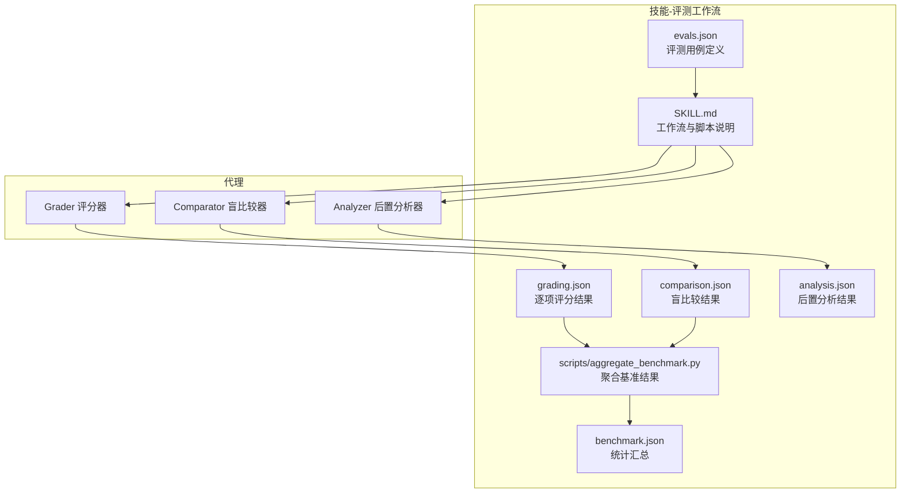
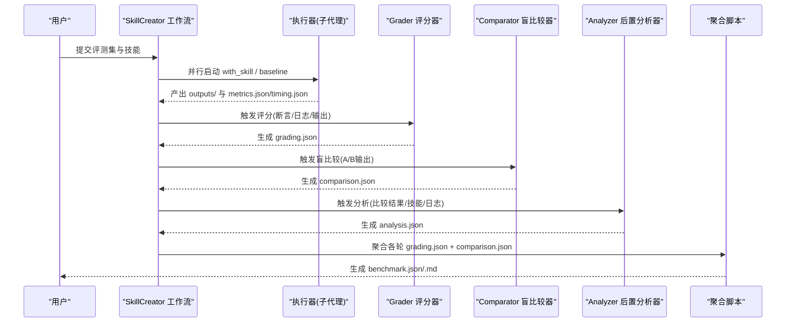
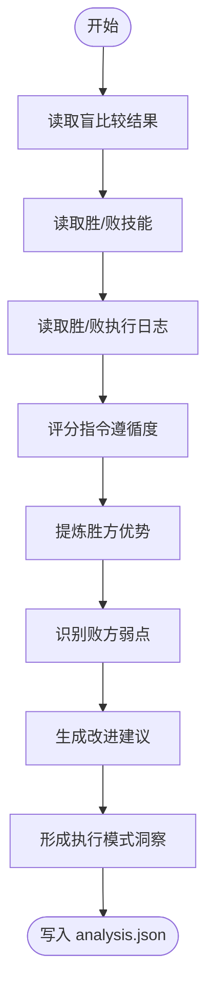
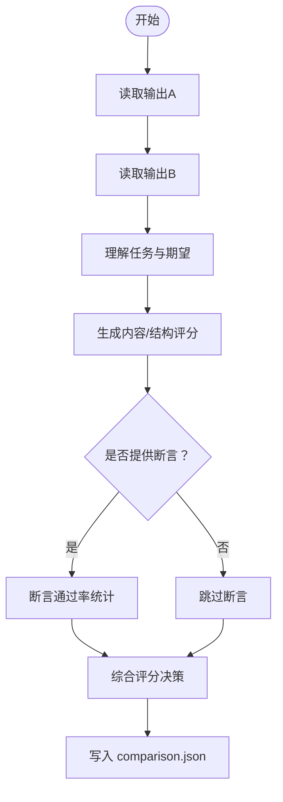
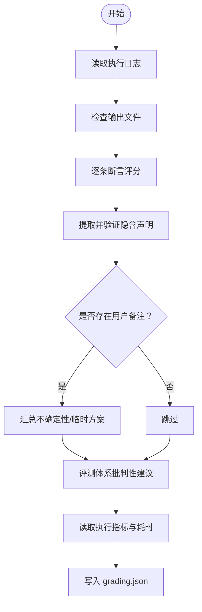
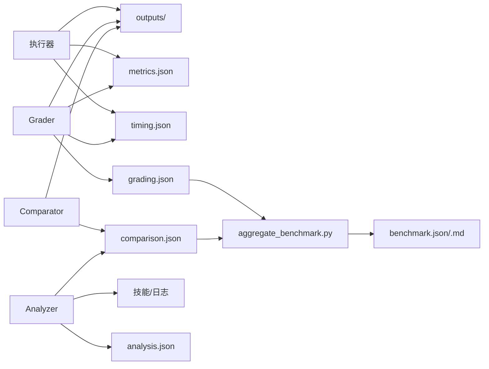

# 技能代理系统

<cite>
**本文引用的文件**
- [analyzer.md](file://skills/daoSkilLs/skills/anthropics-skills/skills/skill-creator/agents/analyzer.md)
- [comparator.md](file://skills/daoSkilLs/skills/anthropics-skills/skills/skill-creator/agents/comparator.md)
- [grader.md](file://skills/daoSkilLs/skills/anthropics-skills/skills/skill-creator/agents/grader.md)
- [schemas.md](file://skills/daoSkilLs/skills/anthropics-skills/skills/skill-creator/references/schemas.md)
- [SKILL.md](file://skills/daoSkilLs/skills/anthropics-skills/skills/skill-creator/SKILL.md)
- [aggregate_benchmark.py](file://skills/daoSkilLs/skills/anthropics-skills/skills/skill-creator/scripts/aggregate_benchmark.py)
- [test_models.py](file://tools/flexloop/tests/testing/test_multi_agent/test_models.py)
- [manager.py](file://tools/flexloop/src/taolib/testing/multi_agent/skills/manager.py)
</cite>

## 目录
1. [引言](#引言)
2. [项目结构](#项目结构)
3. [核心组件](#核心组件)
4. [架构总览](#架构总览)
5. [详细组件分析](#详细组件分析)
6. [依赖关系分析](#依赖关系分析)
7. [性能考虑](#性能考虑)
8. [故障排查指南](#故障排查指南)
9. [结论](#结论)
10. [附录](#附录)

## 引言
本技术文档面向“技能代理系统”，聚焦于三个智能代理：analyzer（后置分析器）、comparator（盲比较器）、grader（评分器）。文档系统性阐述三者职责边界、协作流程、通信协议、数据交换格式与状态管理，并给出配置参数、性能优化策略与故障处理方案，同时提供可操作的使用场景与集成示例。

## 项目结构
该系统位于技能仓库的“skill-creator”子模块中，围绕“评测-基准-评审”的闭环展开，核心文件包括：
- 代理说明文档：agents/analyzer.md、agents/comparator.md、agents/grader.md
- JSON 结构规范：references/schemas.md
- 工作流与脚本：SKILL.md、scripts/aggregate_benchmark.py
- 多智能体框架测试与模型：tools/flexloop/tests/testing/test_multi_agent/test_models.py、tools/flexloop/src/taolib/testing/multi_agent/skills/manager.py

图表来源
- [SKILL.md:221-247](file://skills/daoSkilLs/skills/anthropics-skills/skills/skill-creator/SKILL.md#L221-L247)
- [schemas.md:86-160](file://skills/daoSkilLs/skills/anthropics-skills/skills/skill-creator/references/schemas.md#L86-L160)
- [aggregate_benchmark.py:373-401](file://skills/daoSkilLs/skills/anthropics-skills/skills/skill-creator/scripts/aggregate_benchmark.py#L373-L401)

章节来源
- [SKILL.md:163-251](file://skills/daoSkilLs/skills/anthropics-skills/skills/skill-creator/SKILL.md#L163-L251)
- [schemas.md:1-431](file://skills/daoSkilLs/skills/anthropics-skills/skills/skill-creator/references/schemas.md#L1-L431)

## 核心组件
- analyzer（后置分析器）
  - 职责：在盲比较确定胜负后，解盲对比两个版本的技能与执行日志，提炼“胜因”与“改进点”，输出结构化分析报告。
  - 关键输入：胜者/败者标识、技能路径、执行日志路径、比较结果路径、输出路径。
  - 输出：comparison_summary、winner_strengths、loser_weaknesses、instruction_following、improvement_suggestions、transcript_insights。
- comparator（盲比较器）
  - 职责：对两份输出进行无偏判定，依据内容与结构维度打分，必要时结合断言通过率，最终给出胜负或平局。
  - 关键输入：输出A/B路径、原始任务提示、期望断言列表。
  - 输出：winner、reasoning、rubric（含内容/结构/总体）、output_quality、expectation_results。
- grader（评分器）
  - 职责：基于执行日志与输出文件，逐条断言判定通过/失败，并提取与验证隐含声明，同时汇总执行指标与耗时。
  - 关键输入：断言列表、执行日志路径、输出目录。
  - 输出：expectations（含证据）、summary、execution_metrics、timing、claims、user_notes_summary、eval_feedback。

章节来源
- [analyzer.md:1-154](file://skills/daoSkilLs/skills/anthropics-skills/skills/skill-creator/agents/analyzer.md#L1-L154)
- [comparator.md:1-203](file://skills/daoSkilLs/skills/anthropics-skills/skills/skill-creator/agents/comparator.md#L1-L203)
- [grader.md:1-224](file://skills/daoSkilLs/skills/anthropics-skills/skills/skill-creator/agents/grader.md#L1-L224)

## 架构总览
系统采用“并行执行 + 量化评估 + 统计聚合”的流水线式架构：
- 并行执行：同一轮评测同时产出“带技能版本”与“基线版本”输出。
- 量化评估：由 grader 对每轮输出逐项断言评分；由 comparator 在独立视角下做盲比较；由 analyzer 对多轮结果做模式归纳。
- 统计聚合：aggregate_benchmark.py 将各轮结果汇总为 benchmark.json，供可视化与对比分析。

图表来源
- [SKILL.md:169-247](file://skills/daoSkilLs/skills/anthropics-skills/skills/skill-creator/SKILL.md#L169-L247)
- [schemas.md:86-160](file://skills/daoSkilLs/skills/anthropics-skills/skills/skill-creator/references/schemas.md#L86-L160)
- [aggregate_benchmark.py:373-401](file://skills/daoSkilLs/skills/anthropics-skills/skills/skill-creator/scripts/aggregate_benchmark.py#L373-L401)

## 详细组件分析

### analyzer（后置分析器）
- 输入参数与职责
  - 解析盲比较结果，明确胜负与理由
  - 对比两个技能的结构差异（指令清晰度、脚本工具使用、示例覆盖、异常处理）
  - 对比两个执行日志，总结执行模式差异与错误恢复行为
  - 评分指令遵循度，标注具体问题
  - 总结胜方优势与败方短板
  - 生成高优先级改进建议（按影响排序）
  - 形成执行模式洞察
- 输出结构要点
  - comparison_summary：胜者/败者技能路径与理由
  - winner_strengths / loser_weaknesses：具体事实性观察
  - instruction_following：1-10评分与问题清单
  - improvement_suggestions：优先级、类别、建议与预期影响
  - transcript_insights：执行模式对比
- 使用建议
  - 建议在每次盲比较后立即触发，以便及时沉淀改进点
  - 分类与优先级字段有助于聚焦高价值改动

图表来源
- [analyzer.md:23-89](file://skills/daoSkilLs/skills/anthropics-skills/skills/skill-creator/agents/analyzer.md#L23-L89)

章节来源
- [analyzer.md:1-275](file://skills/daoSkilLs/skills/anthropics-skills/skills/skill-creator/agents/analyzer.md#L1-L275)
- [schemas.md:384-431](file://skills/daoSkilLs/skills/anthropics-skills/skills/skill-creator/references/schemas.md#L384-L431)

### comparator（盲比较器）
- 输入参数与职责
  - 读取 A/B 输出，理解任务要求
  - 构建内容与结构双维度评分表（正确性、完整性、准确性；组织性、格式、可用性）
  - 可选：基于断言通过率作为次级证据
  - 决策优先级：总体评分 > 断言通过率 > 平局
- 输出结构要点
  - winner、reasoning
  - rubric：内容/结构/总体得分
  - output_quality：简要质量评述
  - expectation_results：断言通过统计与明细
- 使用建议
  - 保持“无偏”原则，仅依据输出质量判定
  - 当双方均差或均优时，选择微弱更优者，避免长期平局

图表来源
- [comparator.md:22-89](file://skills/daoSkilLs/skills/anthropics-skills/skills/skill-creator/agents/comparator.md#L22-L89)

章节来源
- [comparator.md:1-203](file://skills/daoSkilLs/skills/anthropics-skills/skills/skill-creator/agents/comparator.md#L1-L203)
- [schemas.md:309-380](file://skills/daoSkilLs/skills/anthropics-skills/skills/skill-creator/references/schemas.md#L309-L380)

### grader（评分器）
- 输入参数与职责
  - 读取执行日志与输出目录
  - 对每条断言检索证据，判定通过/失败，必须提供具体证据
  - 提取并验证隐含声明（事实/过程/质量），标注不可验证项
  - 读取执行指标与耗时，汇总到结果
- 输出结构要点
  - expectations：text/passed/evidence
  - summary：passed/failed/total/pass_rate
  - execution_metrics：工具调用、文件数、字符数等
  - timing：执行器/评分器/总计耗时
  - claims：claim/type/verified/evidence
  - user_notes_summary：不确定性/需复核/临时方案
  - eval_feedback：对评测体系的改进建议
- 使用建议
  - 断言应具备可客观验证性，避免表面合规陷阱
  - 对评测体系提出建设性意见，提升区分度

图表来源
- [grader.md:21-84](file://skills/daoSkilLs/skills/anthropics-skills/skills/skill-creator/agents/grader.md#L21-L84)

章节来源
- [grader.md:1-224](file://skills/daoSkilLs/skills/anthropics-skills/skills/skill-creator/agents/grader.md#L1-L224)
- [schemas.md:86-160](file://skills/daoSkilLs/skills/anthropics-skills/skills/skill-creator/references/schemas.md#L86-L160)

### 数据交换格式与状态管理
- JSON 模式
  - evals.json：评测用例定义（技能名、评测列表、期望断言等）
  - grading.json：逐项断言评分与证据、摘要、执行指标、耗时、声明、用户备注、评测反馈
  - metrics.json：执行器阶段的工具调用、文件创建、字符数等
  - timing.json：运行耗时与起止时间
  - benchmark.json：按配置统计的均值±标准差、增量、每评测项明细与分析笔记
  - comparison.json：盲比较胜负、理由、评分矩阵、断言结果
  - analysis.json：后置分析的对比摘要、优劣势、指令遵循评分、改进建议、执行洞察
- 状态流转
  - 执行阶段：outputs/ 与 metrics.json/timing.json
  - 评分阶段：grading.json
  - 比较阶段：comparison.json
  - 分析阶段：analysis.json
  - 聚合阶段：benchmark.json/.md

章节来源
- [schemas.md:7-431](file://skills/daoSkilLs/skills/anthropics-skills/skills/skill-creator/references/schemas.md#L7-L431)

### 代理配置参数与工作流集成
- Grader 参数
  - expectations：断言列表
  - transcript_path：执行日志路径
  - outputs_dir：输出目录
- Comparator 参数
  - output_a_path / output_b_path：A/B 输出路径
  - eval_prompt：原始任务提示
  - expectations：期望断言列表（可选）
- Analyzer 参数
  - winner / winner_skill_path / winner_transcript_path / loser_skill_path / loser_transcript_path / comparison_result_path / output_path
- 工作流脚本
  - aggregate_benchmark.py：聚合 grading.json 与 comparison.json，生成 benchmark.json 与 benchmark.md
  - SKILL.md 中的“运行与评测测试用例”章节定义了完整的并行执行、评分、聚合与可视化流程

章节来源
- [grader.md:11-18](file://skills/daoSkilLs/skills/anthropics-skills/skills/skill-creator/agents/grader.md#L11-L18)
- [comparator.md:11-18](file://skills/daoSkilLs/skills/anthropics-skills/skills/skill-creator/agents/comparator.md#L11-L18)
- [analyzer.md:9-19](file://skills/daoSkilLs/skills/anthropics-skills/skills/skill-creator/agents/analyzer.md#L9-L19)
- [SKILL.md:221-247](file://skills/daoSkilLs/skills/anthropics-skills/skills/skill-creator/SKILL.md#L221-L247)
- [aggregate_benchmark.py:373-401](file://skills/daoSkilLs/skills/anthropics-skills/skills/skill-creator/scripts/aggregate_benchmark.py#L373-L401)

## 依赖关系分析
- 组件耦合
  - analyzer 依赖 comparator 的 comparison.json 与技能/日志资源
  - grader 与 comparator 独立产出，共同驱动 benchmark.json 的生成
  - 聚合脚本依赖各轮 grading.json 与 comparison.json
- 外部依赖
  - 子代理执行器（执行日志、输出文件、指标与耗时）
  - 文件系统（outputs/、metrics.json、timing.json、grading.json、comparison.json、analysis.json、benchmark.json）

图表来源
- [schemas.md:86-160](file://skills/daoSkilLs/skills/anthropics-skills/skills/skill-creator/references/schemas.md#L86-L160)
- [aggregate_benchmark.py:373-401](file://skills/daoSkilLs/skills/anthropics-skills/skills/skill-creator/scripts/aggregate_benchmark.py#L373-L401)

章节来源
- [schemas.md:163-305](file://skills/daoSkilLs/skills/anthropics-skills/skills/skill-creator/references/schemas.md#L163-L305)

## 性能考虑
- 并行执行
  - 同一轮评测中并行启动“带技能版本”与“基线版本”，缩短总耗时
- 评测设计
  - 断言应具备可自动化验证能力，减少人工核查成本
- 指标采集
  - 严格在任务通知到达时捕获 timing.json，避免遗漏
- 聚合效率
  - 聚合脚本批量读取各轮结果，统一生成统计报表，便于横向对比

章节来源
- [SKILL.md:207-231](file://skills/daoSkilLs/skills/anthropics-skills/skills/skill-creator/SKILL.md#L207-L231)
- [aggregate_benchmark.py:373-401](file://skills/daoSkilLs/skills/anthropics-skills/skills/skill-creator/scripts/aggregate_benchmark.py#L373-L401)

## 故障排查指南
- timing.json 缺失
  - 现象：grading.json/timing.json 未生成
  - 处理：确保在子代理任务完成后立即保存 timing.json；若已错过时机，需重新执行对应轮次
- grading.json 字段不匹配
  - 现象：评测查看器无法解析
  - 处理：严格使用 text/passed/evidence 字段；参考 schemas.md 的字段定义
- benchmark.json 结构错误
  - 现象：查看器显示空值或零值
  - 处理：严格遵循 metadata/runs/run_summary/notes 字段命名与嵌套层级
- 比较结果偏差
  - 现象：盲比较器偏向某一方
  - 处理：检查 rubric 设计与断言通过率权重；必要时调整任务提示以增强区分度
- 分析建议无效
  - 现象：improvement_suggestions 与实际输出无关
  - 处理：确保 analyzer 严格基于技能文本与日志中的具体差异生成建议

章节来源
- [schemas.md:86-160](file://skills/daoSkilLs/skills/anthropics-skills/skills/skill-creator/references/schemas.md#L86-L160)
- [grader.md:106-184](file://skills/daoSkilLs/skills/anthropics-skills/skills/skill-creator/agents/grader.md#L106-L184)
- [comparator.md:91-173](file://skills/daoSkilLs/skills/anthropics-skills/skills/skill-creator/agents/comparator.md#L91-L173)
- [analyzer.md:91-153](file://skills/daoSkilLs/skills/anthropics-skills/skills/skill-creator/agents/analyzer.md#L91-L153)

## 结论
analyzer、comparator、grader 三者分别承担“模式归纳与改进”“无偏对比”“量化评分与评测体系批判”的职责，配合 SKILL.md 定义的工作流与 aggregate_benchmark.py 的统计聚合，形成闭环的技能评测与优化体系。通过严格的 JSON 模式与状态管理、并行执行与指标采集，系统在保证客观性的同时提升了评测效率与可解释性。

## 附录
- 实际使用场景
  - 新技能开发：先草拟 SKILL.md，再并行执行 with_skill 与 baseline，随后评分、盲比较、分析与迭代
  - 现有技能优化：快照旧版本，对比新旧版本的 benchmark.json，聚焦高优先级改进
  - 评测体系完善：基于 grader 的 eval_feedback 与 analyzer 的 notes，持续优化断言与评测设计
- 集成示例
  - 使用 aggregate_benchmark.py 聚合 benchmark.json 与 benchmark.md
  - 通过 eval-viewer/generate_review.py 可视化输出与基准对比（SKILL.md 中提供了启动命令与注意事项）

章节来源
- [SKILL.md:221-247](file://skills/daoSkilLs/skills/anthropics-skills/skills/skill-creator/SKILL.md#L221-L247)
- [aggregate_benchmark.py:373-401](file://skills/daoSkilLs/skills/anthropics-skills/skills/skill-creator/scripts/aggregate_benchmark.py#L373-L401)