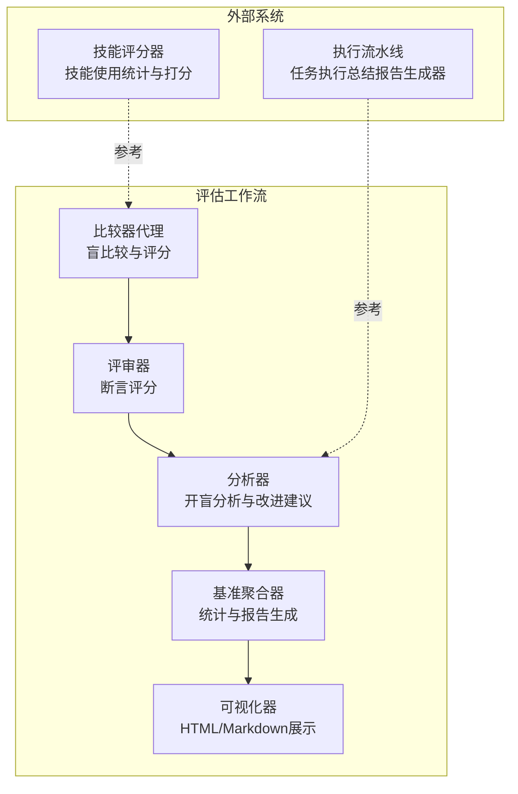
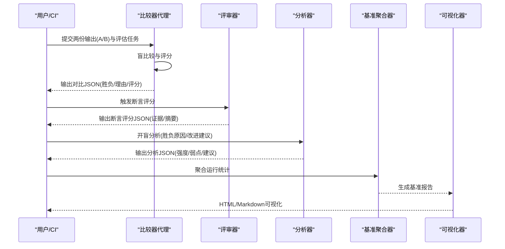
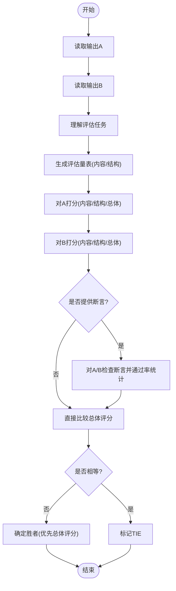
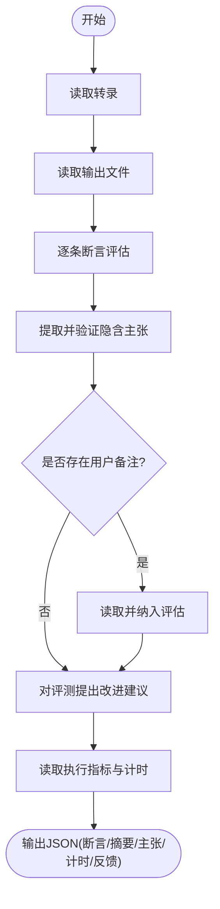
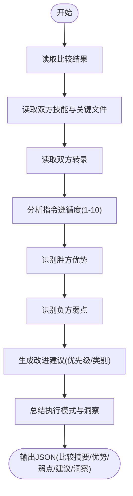
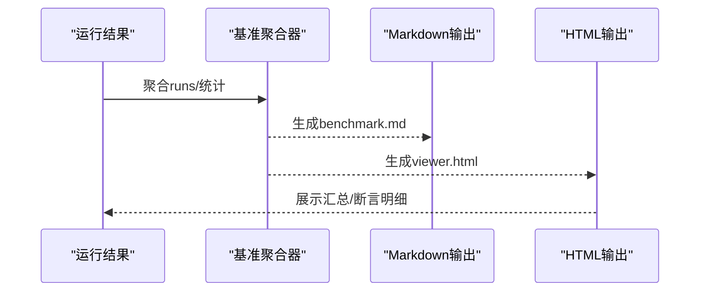
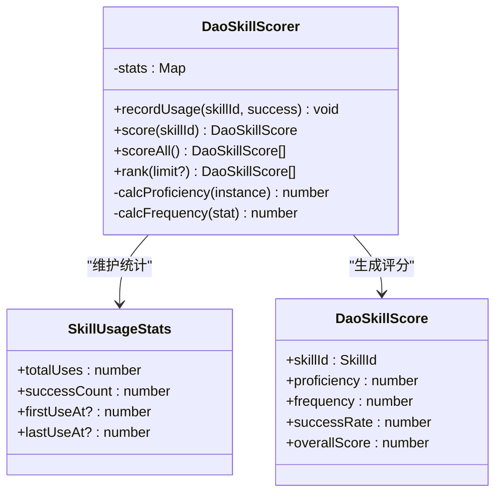
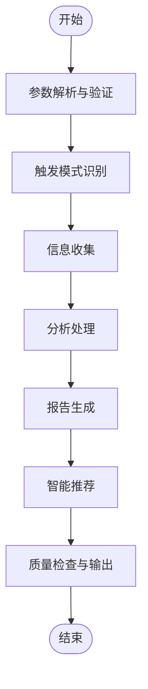
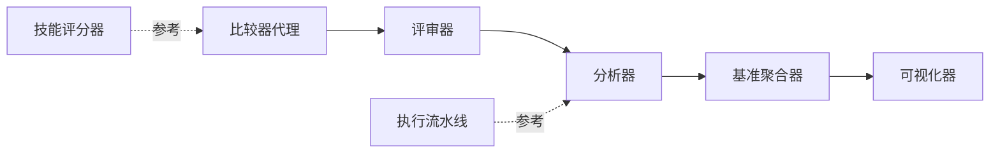

# 比较器代理

<cite>
**本文引用的文件**
- [comparator.md](file://skills/daoSkilLs/skills/anthropics-skills/agents/comparator.md)
- [grader.md](file://skills/daoSkilLs/skills/anthropics-skills/agents/grader.md)
- [analyzer.md](file://skills/daoSkilLs/skills/anthropics-skills/agents/analyzer.md)
- [viewer.html](file://skills/daoSkilLs/skills/anthropics-skills/eval-viewer/viewer.html)
- [aggregate_benchmark.py](file://skills/daoSkilLs/skills/anthropics-skills/scripts/aggregate_benchmark.py)
- [generate_report.py](file://skills/daoSkilLs/skills/anthropics-skills/scripts/generate_report.py)
- [scorer.ts](file://apps/DaoMind/packages/daoSkilLs/src/scorer.ts)
- [api-reference.md](file://skills/daoSkilLs/skills/task-execution-summary/references/api-reference.md)
- [execution-flow.md](file://skills/daoSkilLs/skills/task-execution-summary/references/execution-flow.md)
</cite>

## 目录
1. [简介](#简介)
2. [项目结构](#项目结构)
3. [核心组件](#核心组件)
4. [架构总览](#架构总览)
5. [详细组件分析](#详细组件分析)
6. [依赖分析](#依赖分析)
7. [性能考量](#性能考量)
8. [故障排查指南](#故障排查指南)
9. [结论](#结论)
10. [附录](#附录)

## 简介
本文件系统化阐述“比较器代理”的技术设计与实现，聚焦于盲比较评估机制、无偏见结果判定与比较逻辑。文档从评估标准、评分体系与决策过程三个维度，深入解析代理在技能评估中的作用，涵盖多维度评估、主观偏见规避与可靠结果生成，并提供可落地的使用场景与集成示例。

## 项目结构
比较器代理位于“技能-创建器”工作流中，配合“评分器”“评审器”“分析器”与“基准聚合器/可视化器”形成闭环评估链路。关键文件与职责如下：
- 比较器代理：执行盲比较，生成对比结果与JSON报告
- 评审器：对执行转录与输出逐条断言评分
- 分析器：在“开盲”后分析胜负原因并提出改进意见
- 基准聚合器：汇总运行统计、生成基准报告
- 可视化器：渲染基准结果与断言明细
- 技能评分器：对技能使用频度、成功率与熟练度进行量化打分

**图表来源**
- [comparator.md:1-203](file://skills/daoSkilLs/agents/comparator.md#L1-L203)
- [grader.md:1-224](file://skills/daoSkilLs/agents/grader.md#L1-L224)
- [analyzer.md:1-275](file://skills/daoSkilLs/agents/analyzer.md#L1-L275)
- [aggregate_benchmark.py:267-302](file://skills/daoSkilLs/scripts/aggregate_benchmark.py#L267-L302)
- [viewer.html:1123-1305](file://skills/daoSkilLs/eval-viewer/viewer.html#L1123-L1305)
- [scorer.ts:1-80](file://apps/DaoMind/packages/daoSkilLs/src/scorer.ts#L1-L80)
- [api-reference.md:1-120](file://skills/daoSkilLs/skills/task-execution-summary/references/api-reference.md#L1-L120)
- [execution-flow.md:1-120](file://skills/daoSkilLs/skills/task-execution-summary/references/execution-flow.md#L1-L120)

**章节来源**
- [comparator.md:1-203](file://skills/daoSkilLs/agents/comparator.md#L1-L203)
- [grader.md:1-224](file://skills/daoSkilLs/agents/grader.md#L1-L224)
- [analyzer.md:1-275](file://skills/daoSkilLs/agents/analyzer.md#L1-L275)
- [aggregate_benchmark.py:267-302](file://skills/daoSkilLs/scripts/aggregate_benchmark.py#L267-L302)
- [viewer.html:1123-1305](file://skills/daoSkilLs/eval-viewer/viewer.html#L1123-L1305)
- [scorer.ts:1-80](file://apps/DaoMind/packages/daoSkilLs/src/scorer.ts#L1-L80)
- [api-reference.md:1-120](file://skills/daoSkilLs/skills/task-execution-summary/references/api-reference.md#L1-L120)
- [execution-flow.md:1-120](file://skills/daoSkilLs/skills/task-execution-summary/references/execution-flow.md#L1-L120)

## 核心组件
- 比较器代理：执行盲比较，生成包含胜负、理由、内容与结构评分、断言通过率与质量摘要的JSON结果
- 评审器：基于断言对输出进行“通过/失败”判定，输出证据与摘要
- 分析器：在开盲后分析胜负原因，提出可操作的技能改进建议
- 基准聚合器：聚合运行统计（通过率、耗时、Token等），生成基准报告与Markdown
- 可视化器：渲染汇总表、按评估维度拆解与断言明细
- 技能评分器：基于使用次数、成功率与频率对技能进行量化打分

**章节来源**
- [comparator.md:91-193](file://skills/daoSkilLs/agents/comparator.md#L91-L193)
- [grader.md:106-224](file://skills/daoSkilLs/agents/grader.md#L106-L224)
- [analyzer.md:91-184](file://skills/daoSkilLs/agents/analyzer.md#L91-L184)
- [aggregate_benchmark.py:299-401](file://skills/daoSkilLs/scripts/aggregate_benchmark.py#L299-L401)
- [viewer.html:1137-1305](file://skills/daoSkilLs/eval-viewer/viewer.html#L1137-L1305)
- [scorer.ts:15-80](file://apps/DaoMind/packages/daoSkilLs/src/scorer.ts#L15-L80)

## 架构总览
比较器代理处于“评审-分析-聚合-可视”的闭环中心，上游由评审器提供断言证据，下游由分析器与聚合器/可视化器提供洞察与呈现。技能评分器与执行流水线为评估提供外部参考与背景。

**图表来源**
- [comparator.md:77-89](file://skills/daoSkilLs/agents/comparator.md#L77-L89)
- [grader.md:81-105](file://skills/daoSkilLs/agents/grader.md#L81-L105)
- [analyzer.md:87-90](file://skills/daoSkilLs/agents/analyzer.md#L87-L90)
- [aggregate_benchmark.py:373-401](file://skills/daoSkilLs/scripts/aggregate_benchmark.py#L373-L401)
- [viewer.html:1123-1191](file://skills/daoSkilLs/eval-viewer/viewer.html#L1123-L1191)

## 详细组件分析

### 比较器代理：盲比较评估机制
- 盲比较原则：不暴露输出来源，仅依据输出质量与任务完成度判定
- 输入参数：输出A/B路径、评估任务提示、可选断言集合
- 评估维度：内容评分（正确性、完整性、准确性）、结构评分（组织、格式、可用性）
- 决策流程：先看总体评分，再看断言通过率，最后以平局收场
- 输出格式：包含胜负、理由、内容/结构/总体评分、质量摘要、断言结果（若提供）

**图表来源**
- [comparator.md:20-89](file://skills/daoSkilLs/agents/comparator.md#L20-L89)

**章节来源**
- [comparator.md:1-203](file://skills/daoSkilLs/agents/comparator.md#L1-L203)

### 评审器：断言评分与证据提取
- 角色：基于转录与输出文件对断言进行“通过/失败”判定，提供证据
- 关键流程：读取转录与输出、逐条断言评估、提取并验证隐含主张、读取执行指标与计时、输出JSON
- 评分准则：有明确证据且反映真实任务完成度为通过；无证据或证据矛盾或表面合规为失败；不确定时由断言承担举证责任

**图表来源**
- [grader.md:19-105](file://skills/daoSkilLs/agents/grader.md#L19-L105)

**章节来源**
- [grader.md:1-224](file://skills/daoSkilLs/agents/grader.md#L1-L224)

### 分析器：开盲分析与改进建议
- 角色：在开盲后分析胜负原因，提炼“胜方优势/负方弱点”，生成可操作建议
- 关键流程：读取比较结果、读取双方技能与转录、分析指令遵循度、识别优势与弱点、生成建议、输出结构化分析
- 建议分类：指令、工具、示例、错误处理、结构、参考

**图表来源**
- [analyzer.md:21-89](file://skills/daoSkilLs/agents/analyzer.md#L21-L89)

**章节来源**
- [analyzer.md:1-275](file://skills/daoSkilLs/agents/analyzer.md#L1-L275)

### 基准聚合器与可视化器：统计与呈现
- 基准聚合器：汇总运行统计（均值±标准差、Delta），生成benchmark.json与benchmark.md
- 可视化器：渲染汇总表、按评估维度拆解、断言明细，支持静态输出

**图表来源**
- [aggregate_benchmark.py:299-401](file://skills/daoSkilLs/scripts/aggregate_benchmark.py#L299-L401)
- [viewer.html:1137-1305](file://skills/daoSkilLs/eval-viewer/viewer.html#L1137-L1305)

**章节来源**
- [aggregate_benchmark.py:267-401](file://skills/daoSkilLs/scripts/aggregate_benchmark.py#L267-L401)
- [viewer.html:1123-1305](file://skills/daoSkilLs/eval-viewer/viewer.html#L1123-L1305)

### 技能评分器：技能使用与效用量化
- 评分维度：熟练度（useCount/maxUses）、使用频率（单位时间使用次数）、成功率（successCount/totalUses）
- 综合得分：加权组合，用于技能排名与选择

**图表来源**
- [scorer.ts:1-80](file://apps/DaoMind/packages/daoSkilLs/src/scorer.ts#L1-L80)

**章节来源**
- [scorer.ts:1-80](file://apps/DaoMind/packages/daoSkilLs/src/scorer.ts#L1-L80)

### 执行流水线与评估背景：任务执行总结报告生成器
- 设计原则：确定性、可观测性、容错性
- 执行流程：参数解析与验证、触发模式识别、信息收集、分析处理、报告生成、智能推荐、质量检查与输出
- 与比较器的关系：为分析器提供执行模式与资源使用背景，辅助理解胜负原因

**图表来源**
- [execution-flow.md:173-280](file://skills/daoSkilLs/skills/task-execution-summary/references/execution-flow.md#L173-L280)

**章节来源**
- [api-reference.md:1-120](file://skills/daoSkilLs/skills/task-execution-summary/references/api-reference.md#L1-L120)
- [execution-flow.md:1-120](file://skills/daoSkilLs/skills/task-execution-summary/references/execution-flow.md#L1-L120)

## 依赖分析
- 比较器代理依赖评审器提供的断言证据与分析器的开盲洞察
- 基准聚合器与可视化器依赖评审器与比较器的结构化输出
- 技能评分器与执行流水线为评估提供外部参考与背景信息

**图表来源**
- [comparator.md:77-89](file://skills/daoSkilLs/agents/comparator.md#L77-L89)
- [grader.md:81-105](file://skills/daoSkilLs/agents/grader.md#L81-L105)
- [analyzer.md:87-90](file://skills/daoSkilLs/agents/analyzer.md#L87-L90)
- [aggregate_benchmark.py:373-401](file://skills/daoSkilLs/scripts/aggregate_benchmark.py#L373-L401)
- [viewer.html:1123-1191](file://skills/daoSkilLs/eval-viewer/viewer.html#L1123-L1191)
- [scorer.ts:1-80](file://apps/DaoMind/packages/daoSkilLs/src/scorer.ts#L1-L80)
- [execution-flow.md:173-280](file://skills/daoSkilLs/skills/task-execution-summary/references/execution-flow.md#L173-L280)

**章节来源**
- [comparator.md:77-89](file://skills/daoSkilLs/agents/comparator.md#L77-L89)
- [grader.md:81-105](file://skills/daoSkilLs/agents/grader.md#L81-L105)
- [analyzer.md:87-90](file://skills/daoSkilLs/agents/analyzer.md#L87-L90)
- [aggregate_benchmark.py:373-401](file://skills/daoSkilLs/scripts/aggregate_benchmark.py#L373-L401)
- [viewer.html:1123-1191](file://skills/daoSkilLs/eval-viewer/viewer.html#L1123-L1191)
- [scorer.ts:1-80](file://apps/DaoMind/packages/daoSkilLs/src/scorer.ts#L1-L80)
- [execution-flow.md:173-280](file://skills/daoSkilLs/skills/task-execution-summary/references/execution-flow.md#L173-L280)

## 性能考量
- 比较器代理：以结构化评分与断言验证为主，计算开销较低，主要耗时在I/O（读取输出与断言）
- 评审器：断言评分与证据提取依赖文件解析，建议批量处理与缓存证据
- 分析器：开盲分析涉及技能与转录对比，建议增量式分析与模板化建议生成
- 基准聚合器：统计计算与Markdown生成，建议并行化聚合与增量更新
- 可视化器：HTML/Markdown渲染，建议静态输出以减少服务器压力

[本节为通用指导，无需特定文件引用]

## 故障排查指南
- 断言无效或过于宽松：评审器强调“表面合规不等于真实完成”，需确保断言可验证且具备区分度
- 评审器输出与比较器结论不一致：检查断言证据是否充分，必要时增加断言或细化评分
- 分析器建议难以落地：建议聚焦高优先级、可复制的改进点，避免空泛建议
- 基准聚合器统计异常：核对运行数据完整性与一致性，关注离群值与波动
- 可视化器显示异常：检查输出格式与字段命名，确保与viewer期望一致

**章节来源**
- [grader.md:85-100](file://skills/daoSkilLs/agents/grader.md#L85-L100)
- [analyzer.md:156-165](file://skills/daoSkilLs/agents/analyzer.md#L156-L165)
- [aggregate_benchmark.py:299-401](file://skills/daoSkilLs/scripts/aggregate_benchmark.py#L299-L401)
- [viewer.html:1137-1305](file://skills/daoSkilLs/eval-viewer/viewer.html#L1137-L1305)

## 结论
比较器代理通过“盲比较+断言验证+开盲分析+基准聚合+可视化”的闭环，实现了对技能输出的无偏见、可复现与可解释的评估。其评分体系兼顾内容与结构质量，断言作为第二证据增强判别力，分析器提供可操作的改进路径，基准与可视化保障结果可读与可追踪。结合技能评分器与执行流水线，可进一步提升评估的深度与广度。

[本节为总结性内容，无需特定文件引用]

## 附录
- 使用场景
  - 技能A/B对比：在相同评估任务下，比较两个技能的输出质量与稳定性
  - 评测迭代：通过分析器建议持续优化技能，再进行新一轮盲比较
  - 基准发布：使用聚合器与可视化器生成可共享的评测报告
- 集成示例
  - 评审器集成：在每次运行结束后，调用评审器对断言进行评分，输出grading.json
  - 基准聚合：运行聚合脚本，生成benchmark.json与benchmark.md
  - 可视化：启动viewer生成HTML报告，或导出静态页面
  - 技能评分：记录技能使用与成功情况，使用技能评分器进行量化排名

**章节来源**
- [grader.md:221-224](file://skills/daoSkilLs/agents/grader.md#L221-L224)
- [aggregate_benchmark.py:373-401](file://skills/daoSkilLs/scripts/aggregate_benchmark.py#L373-L401)
- [viewer.html:1123-1191](file://skills/daoSkilLs/eval-viewer/viewer.html#L1123-L1191)
- [scorer.ts:51-80](file://apps/DaoMind/packages/daoSkilLs/src/scorer.ts#L51-L80)