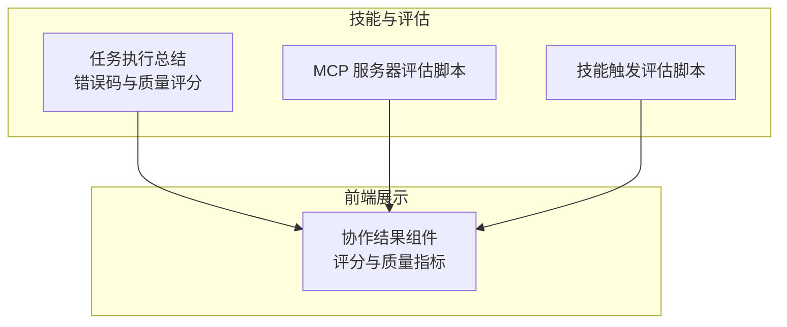
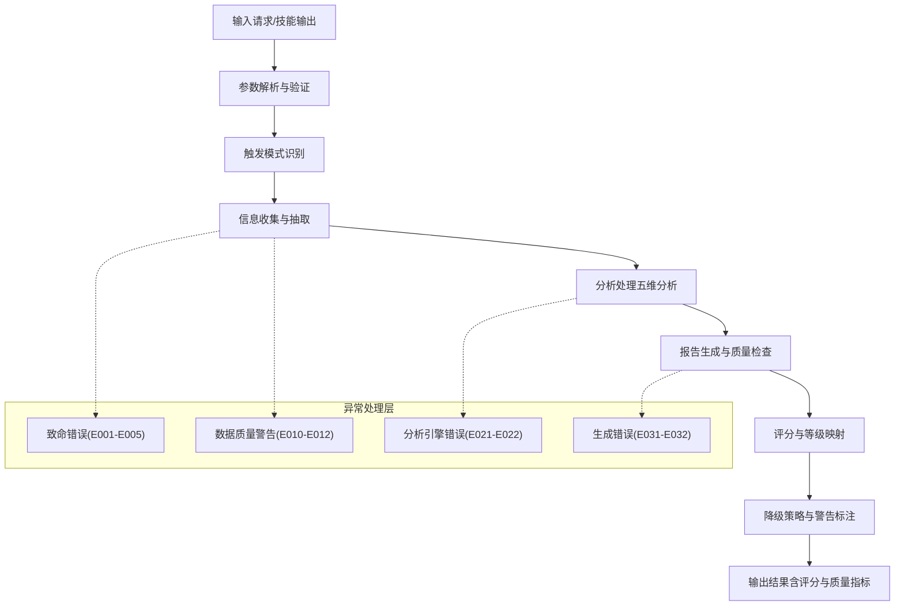
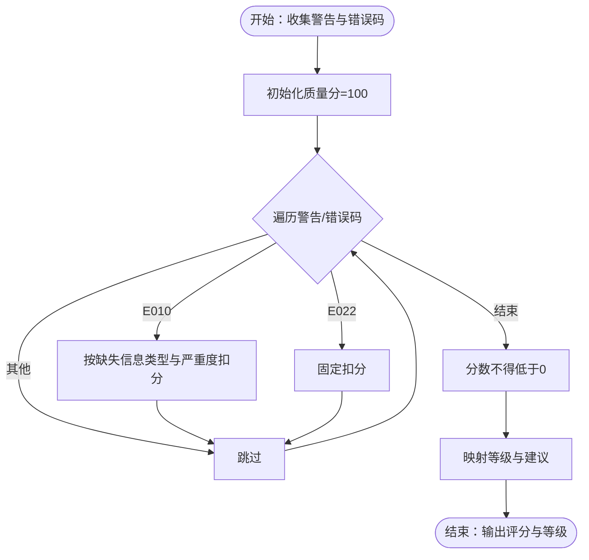
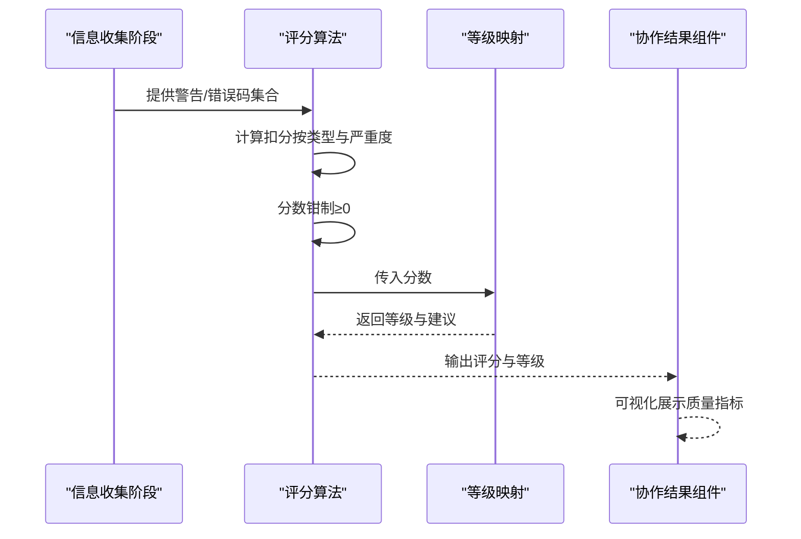
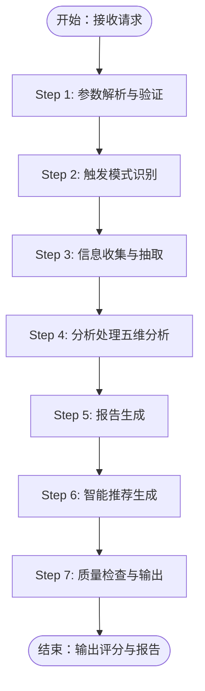
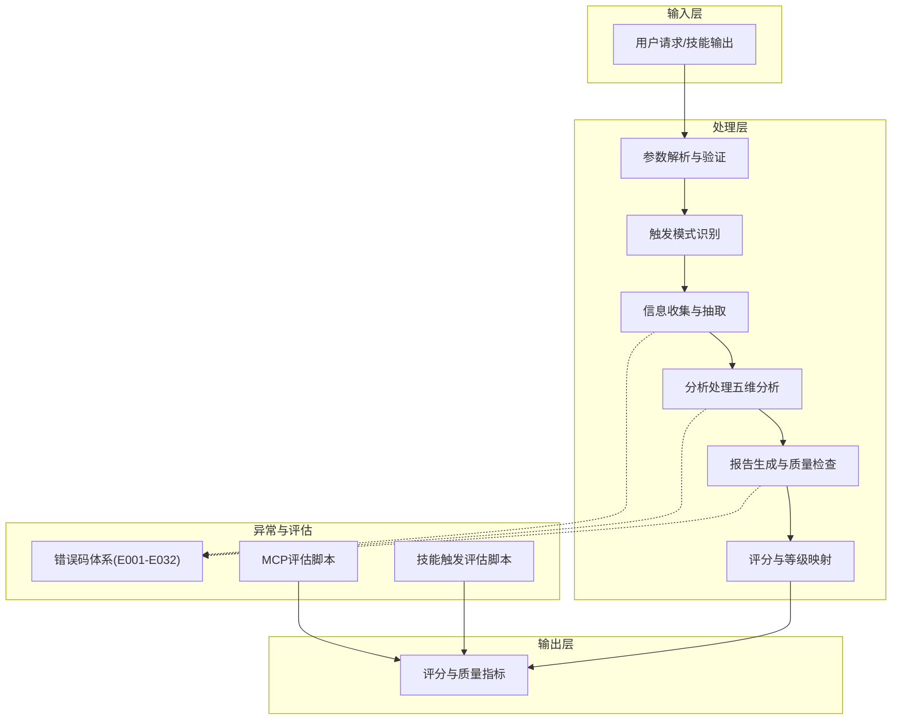

# 评分器代理

<cite>
**本文引用的文件**
- [错误码定义文档](file://skills/daoSkilLs/skills/task-execution-summary/references/error-codes.md)
- [执行流程文档](file://skills/daoSkilLs/skills/task-execution-summary/references/execution-flow.md)
- [MCP 服务器评估脚本](file://skills/daoSkilLs/skills/anthropics-skills/skills/mcp-builder/scripts/evaluation.py)
- [技能触发评估脚本](file://skills/daoSkilLs/skills/anthropics-skills/skills/skill-creator/scripts/run_eval.py)
- [协作结果组件](file://apps/AgentPit/src-react-backup-20260410/components/collaboration/CollaborationResult.tsx)
</cite>

## 目录
1. [简介](#简介)
2. [项目结构](#项目结构)
3. [核心组件](#核心组件)
4. [架构总览](#架构总览)
5. [详细组件分析](#详细组件分析)
6. [依赖关系分析](#依赖关系分析)
7. [性能考量](#性能考量)
8. [故障排除指南](#故障排除指南)
9. [结论](#结论)
10. [附录](#附录)

## 简介
本文件为“评分器代理”的技术文档，聚焦于量化评分机制、质量判断标准与评分算法实现。文档从技能评估体系出发，阐述评分维度、评分规则与质量评估流程，并结合仓库内现有“任务执行总结报告生成器”技能的错误码与质量评分实践，给出标准化评分的落地方法与可比较结果的生成路径。同时，文档提供评分标准的应用与实际案例分析，帮助读者在不同技能输出场景中实现一致、可解释的评分。

## 项目结构
评分器代理相关的内容主要分布在以下模块：
- 任务执行总结报告生成器的错误码与质量评分体系（错误码定义文档、执行流程文档）
- MCP 服务器与技能触发评估脚本（用于外部工具链与技能质量评估）
- 前端协作结果展示组件（用于可视化评分与质量指标）

**图表来源**
- [错误码定义文档:1-1594](file://skills/daoSkilLs/skills/task-execution-summary/references/error-codes.md#L1-L1594)
- [执行流程文档:1-1783](file://skills/daoSkilLs/skills/task-execution-summary/references/execution-flow.md#L1-L1783)
- [MCP 服务器评估脚本:1-374](file://skills/daoSkilLs/skills/anthropics-skills/skills/mcp-builder/scripts/evaluation.py#L1-L374)
- [技能触发评估脚本:1-311](file://skills/daoSkilLs/skills/anthropics-skills/skills/skill-creator/scripts/run_eval.py#L1-L311)
- [协作结果组件:93-143](file://apps/AgentPit/src-react-backup-20260410/components/collaboration/CollaborationResult.tsx#L93-L143)

**章节来源**
- [错误码定义文档:1-1594](file://skills/daoSkilLs/skills/task-execution-summary/references/error-codes.md#L1-L1594)
- [执行流程文档:1-1783](file://skills/daoSkilLs/skills/task-execution-summary/references/execution-flow.md#L1-L1783)
- [MCP 服务器评估脚本:1-374](file://skills/daoSkilLs/skills/anthropics-skills/skills/mcp-builder/scripts/evaluation.py#L1-L374)
- [技能触发评估脚本:1-311](file://skills/daoSkilLs/skills/anthropics-skills/skills/skill-creator/scripts/run_eval.py#L1-L311)
- [协作结果组件:93-143](file://apps/AgentPit/src-react-backup-20260410/components/collaboration/CollaborationResult.tsx#L93-L143)

## 核心组件
- 评分维度与质量指标
  - 完整性、准确性、创新性、实用性等多维指标，用于衡量技能输出质量。
  - 通过前端组件直观展示评分与质量指标，便于对比与决策。
- 质量评分算法
  - 基于警告与错误的量化扣分规则，结合阈值生成等级与建议。
  - 支持降级继续与质量等级映射，确保在信息不完整时仍可产出可解释的评分。
- 评估流程
  - 参数解析与验证 → 触发模式识别 → 信息收集 → 分析处理 → 报告生成 → 智能推荐 → 质量检查与输出。
  - 异常路径分级处理，区分致命错误与警告，保障系统容错性与可观测性。

**章节来源**
- [协作结果组件:93-143](file://apps/AgentPit/src-react-backup-20260410/components/collaboration/CollaborationResult.tsx#L93-L143)
- [错误码定义文档:1483-1528](file://skills/daoSkilLs/skills/task-execution-summary/references/error-codes.md#L1483-L1528)
- [执行流程文档:1-1783](file://skills/daoSkilLs/skills/task-execution-summary/references/execution-flow.md#L1-L1783)

## 架构总览
评分器代理的架构围绕“确定性、可观测性、容错性”三大原则构建，形成从输入到评分输出的闭环：

**图表来源**
- [执行流程文档:1-1783](file://skills/daoSkilLs/skills/task-execution-summary/references/execution-flow.md#L1-L1783)
- [错误码定义文档:1-1594](file://skills/daoSkilLs/skills/task-execution-summary/references/error-codes.md#L1-L1594)

## 详细组件分析

### 量化评分机制与质量判断标准
- 质量评分来源
  - 基于信息收集阶段的完整性覆盖率与警告/错误码，计算综合质量分。
  - 警告与错误码对评分的扣分规则明确，确保评分可量化、可回溯。
- 质量等级与使用建议
  - 通过分数区间映射到等级与建议，指导用户对报告的使用与后续优化。
- 评分维度
  - 完整性、准确性、创新性、实用性等维度在前端组件中可视化呈现，便于横向对比。

**图表来源**
- [错误码定义文档:1483-1528](file://skills/daoSkilLs/skills/task-execution-summary/references/error-codes.md#L1483-L1528)

**章节来源**
- [错误码定义文档:1483-1528](file://skills/daoSkilLs/skills/task-execution-summary/references/error-codes.md#L1483-L1528)
- [协作结果组件:93-143](file://apps/AgentPit/src-react-backup-20260410/components/collaboration/CollaborationResult.tsx#L93-L143)

### 评分算法实现
- 算法输入
  - 警告与错误码集合，包含缺失信息类型、严重度、影响章节等上下文。
- 算法逻辑
  - 针对 E010（数据不充分）按缺失类型与严重度累加扣分；针对 E022（时间线重建失败）固定扣分。
  - 最终分数经下限钳制，映射到等级与使用建议。
- 输出
  - 质量分、等级与建议，支持在前端组件中展示与对比。

**图表来源**
- [错误码定义文档:1483-1528](file://skills/daoSkilLs/skills/task-execution-summary/references/error-codes.md#L1483-L1528)
- [协作结果组件:93-143](file://apps/AgentPit/src-react-backup-20260410/components/collaboration/CollaborationResult.tsx#L93-L143)

**章节来源**
- [错误码定义文档:1483-1528](file://skills/daoSkilLs/skills/task-execution-summary/references/error-codes.md#L1483-L1528)
- [协作结果组件:93-143](file://apps/AgentPit/src-react-backup-20260410/components/collaboration/CollaborationResult.tsx#L93-L143)

### 代理的评分维度、规则与质量评估流程
- 评分维度
  - 完整性：覆盖关键信息类别（目标、时间、决策、问题、资源、协作）。
  - 准确性：对抽取与分析结果的可信度评估。
  - 创新性：对方法论与经验总结的创新程度评估。
  - 实用性：对改进建议与行动计划的可操作性评估。
- 评分规则
  - 基于覆盖率阈值与警告/错误码的扣分规则，确保评分可解释且可比较。
  - 降级继续策略：在信息不完整时仍可生成报告并标注影响。
- 质量评估流程
  - 参数解析与验证 → 触发模式识别 → 信息收集 → 分析处理（五维分析）→ 报告生成 → 质量检查与输出。
  - 异常路径分级处理，保障系统在异常情况下仍可提供可解释的输出。

**图表来源**
- [执行流程文档:173-693](file://skills/daoSkilLs/skills/task-execution-summary/references/execution-flow.md#L173-L693)

**章节来源**
- [执行流程文档:1-1783](file://skills/daoSkilLs/skills/task-execution-summary/references/execution-flow.md#L1-L1783)

### 评分器在技能评估体系中的作用
- 标准化评分
  - 通过统一的评分维度与扣分规则，确保不同技能输出具备可比较的评分结果。
- 处理不同类型的技能输出
  - 面向文本生成、工具调用、报告生成等多样输出，提供一致的评估入口与评分口径。
- 生成可比较的评分结果
  - 前端组件以可视化方式呈现评分与质量指标，便于横向对比与决策。

**章节来源**
- [协作结果组件:93-143](file://apps/AgentPit/src-react-backup-20260410/components/collaboration/CollaborationResult.tsx#L93-L143)

### 评分标准的具体应用与实际案例分析
- 应用场景
  - 任务执行总结报告生成：基于覆盖率与警告扣分，生成质量分与等级，指导用户补充关键信息。
  - MCP 服务器评估：通过问答对与工具调用统计，计算准确率与工具使用效率，辅助评估工具质量。
  - 技能触发评估：通过查询触发率与阈值，评估技能描述对 Claude 的触发效果，优化技能可见性与可用性。
- 实际案例
  - 案例一：对话轮数较少导致覆盖率偏低，系统发出警告并降级生成，同时给出补充建议。
  - 案例二：MCP 服务器工具调用频繁但准确率偏低，系统输出工具使用统计与反馈，指导优化工具设计。
  - 案例三：技能描述触发率低于阈值，系统输出触发率与改进建议，帮助提升技能命中率。

**章节来源**
- [错误码定义文档:560-668](file://skills/daoSkilLs/skills/task-execution-summary/references/error-codes.md#L560-L668)
- [MCP 服务器评估脚本:154-272](file://skills/daoSkilLs/skills/anthropics-skills/skills/mcp-builder/scripts/evaluation.py#L154-L272)
- [技能触发评估脚本:184-256](file://skills/daoSkilLs/skills/anthropics-skills/skills/skill-creator/scripts/run_eval.py#L184-L256)

## 依赖关系分析
评分器代理的依赖关系围绕“输入-处理-输出”主线展开，同时通过错误码体系与评估脚本实现跨模块协同：

**图表来源**
- [执行流程文档:1-1783](file://skills/daoSkilLs/skills/task-execution-summary/references/execution-flow.md#L1-L1783)
- [错误码定义文档:1-1594](file://skills/daoSkilLs/skills/task-execution-summary/references/error-codes.md#L1-L1594)
- [MCP 服务器评估脚本:1-374](file://skills/daoSkilLs/skills/anthropics-skills/skills/mcp-builder/scripts/evaluation.py#L1-L374)
- [技能触发评估脚本:1-311](file://skills/daoSkilLs/skills/anthropics-skills/skills/skill-creator/scripts/run_eval.py#L1-L311)

**章节来源**
- [执行流程文档:1-1783](file://skills/daoSkilLs/skills/task-execution-summary/references/execution-flow.md#L1-L1783)
- [错误码定义文档:1-1594](file://skills/daoSkilLs/skills/task-execution-summary/references/error-codes.md#L1-L1594)
- [MCP 服务器评估脚本:1-374](file://skills/daoSkilLs/skills/anthropics-skills/skills/mcp-builder/scripts/evaluation.py#L1-L374)
- [技能触发评估脚本:1-311](file://skills/daoSkilLs/skills/anthropics-skills/skills/skill-creator/scripts/run_eval.py#L1-L311)

## 性能考量
- 性能基线
  - 信息收集阶段为性能瓶颈，通常占总耗时的 40-50%；分析处理次之，报告生成与质量检查占比相对较小。
  - 性能受对话轮数、详细程度、数据量等因素影响，建议在大规模数据场景下优化数据源适配与抽取策略。
- 优化建议
  - 并行化数据源适配与抽取，减少重复计算与去重成本。
  - 引入缓存与增量更新机制，降低重复任务的处理开销。
  - 对高成本分析步骤进行阈值控制与降采样，平衡质量与性能。

**章节来源**
- [执行流程文档:142-170](file://skills/daoSkilLs/skills/task-execution-summary/references/execution-flow.md#L142-L170)

## 故障排除指南
- 错误码与处理策略
  - 参数验证错误（E001-E005）：直接返回错误，指导用户补齐参数或修正类型/范围。
  - 数据源错误（E010-E012）：发出警告并支持降级继续，或提示用户选择补充信息/重试。
  - 分析引擎错误（E021-E022）：部分跳过或降级输出，标注受影响章节。
  - 报告生成错误（E031-E032）：回退到简化模板，确保输出可用。
  - 超时错误（E051）：终止或返回部分结果，避免长时间占用资源。
- 建议操作
  - 对于警告：查看降级通知与影响章节，补充关键信息后重新生成。
  - 对于错误：根据错误码与恢复建议进行修复或切换到手动输入模式。
  - 对于系统资源错误：检查权限、磁盘空间与网络连通性，修复后重试。

**章节来源**
- [错误码定义文档:1-1594](file://skills/daoSkilLs/skills/task-execution-summary/references/error-codes.md#L1-L1594)

## 结论
评分器代理通过统一的评分维度、可量化的扣分规则与降级策略，实现了对多样化技能输出的标准化评估。结合前端可视化展示与错误码体系，评分结果具备可解释性与可比较性，能够有效指导用户优化技能与输出质量。未来可在性能优化、评估自动化与跨模态评分方面进一步拓展，以适应更复杂的技能评估场景。

## 附录
- 术语
  - 质量分：综合评分，范围 0-100，数值越高代表质量越好。
  - 等级：基于分数区间的等级划分，指导使用与后续优化。
  - 降级继续：在信息不完整时仍可生成报告并标注影响，确保输出可用。
- 参考
  - 评分算法与等级映射：见错误码定义文档中的评分规则与等级建议。
  - 评估脚本与触发率统计：见 MCP 服务器评估脚本与技能触发评估脚本。

**章节来源**
- [错误码定义文档:1483-1528](file://skills/daoSkilLs/skills/task-execution-summary/references/error-codes.md#L1483-L1528)
- [MCP 服务器评估脚本:154-272](file://skills/daoSkilLs/skills/anthropics-skills/skills/mcp-builder/scripts/evaluation.py#L154-L272)
- [技能触发评估脚本:184-256](file://skills/daoSkilLs/skills/anthropics-skills/skills/skill-creator/scripts/run_eval.py#L184-L256)