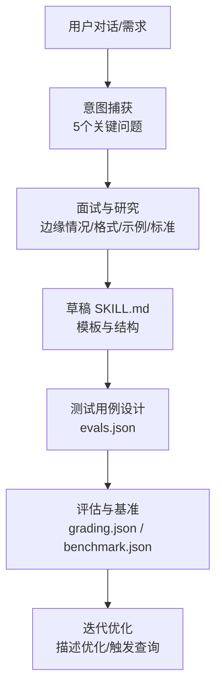
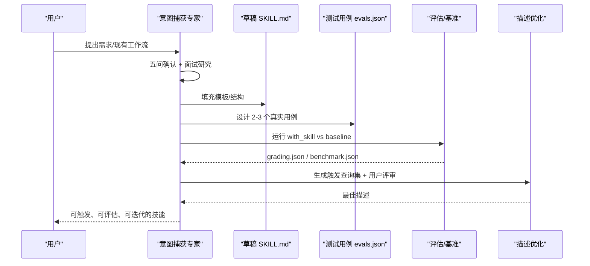
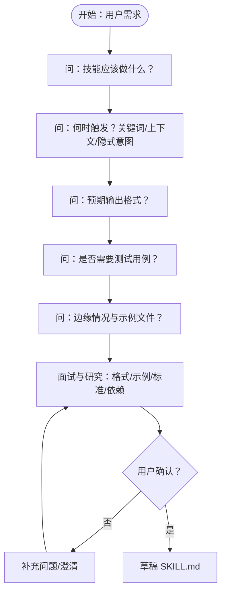
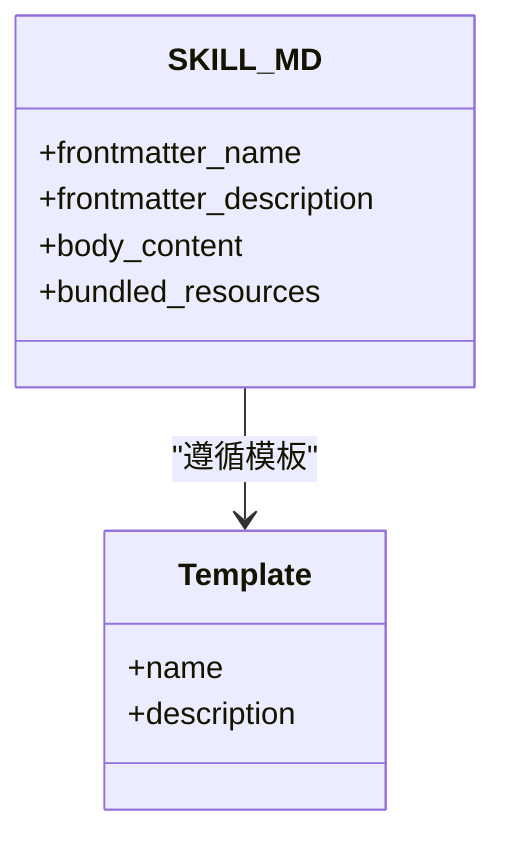
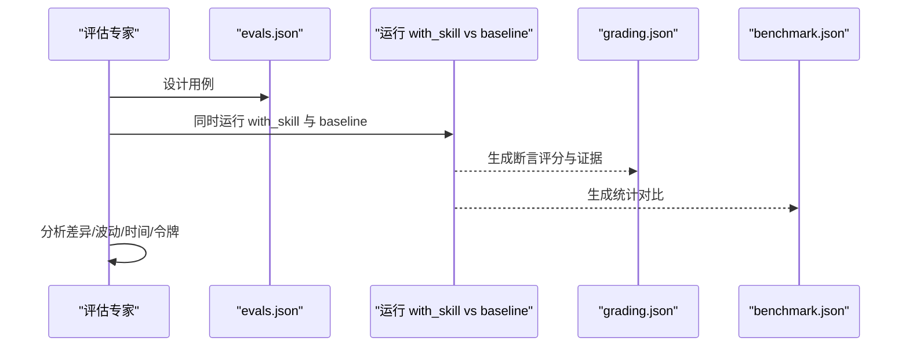
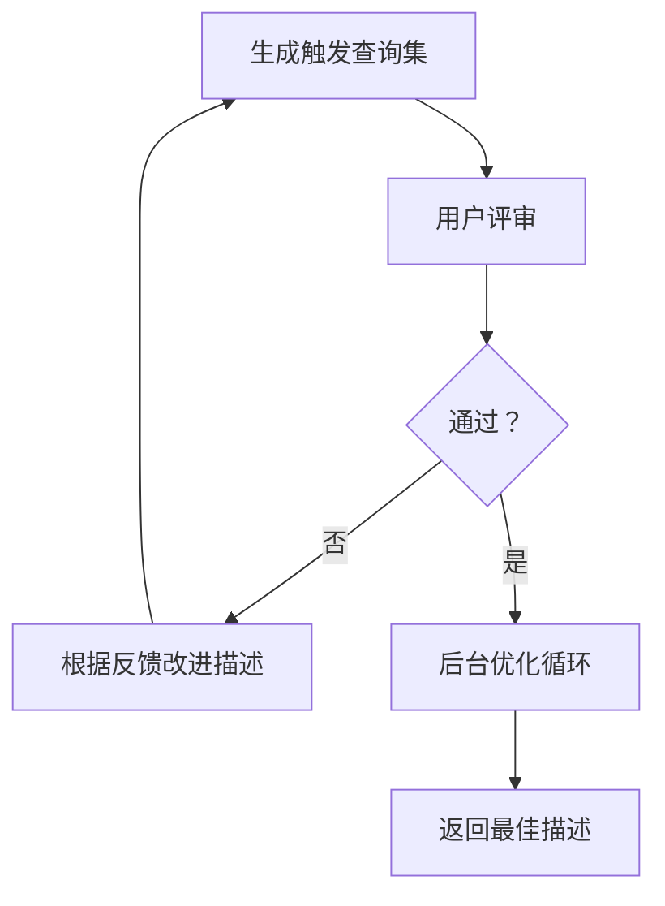
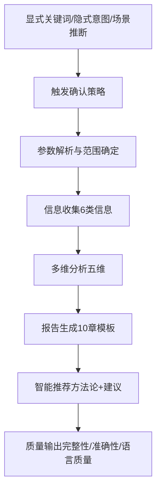
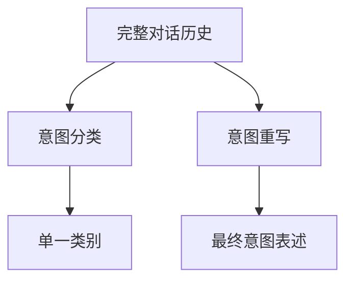
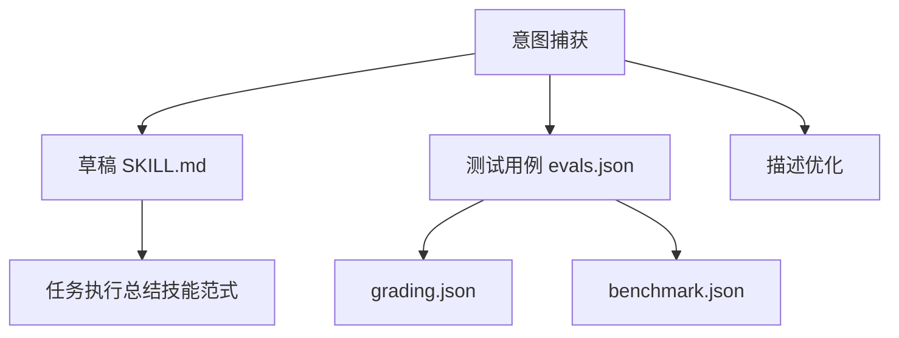

# 意图捕获阶段

<cite>
**本文引用的文件**
- [技能创建 SKILL.md](file://skills/daoSkilLs/skills/anthropics-skills/skills/skill-creator/SKILL.md)
- [模板 SKILL.md](file://skills/daoSkilLs/skills/anthropics-skills/template/SKILL.md)
- [任务执行总结 SKILL.md](file://skills/daoSkilLs/skills/task-execution-summary/SKILL.md)
- [任务执行总结 执行流程](file://skills/daoSkilLs/skills/task-execution-summary/references/execution-flow.md)
- [任务执行总结 示例 V2](file://skills/daoSkilLs/skills/task-execution-summary/references/examples-v2.md)
- [技能评估 JSON 模式](file://skills/daoSkilLs/skills/anthropics-skills/skills/skill-creator/references/schemas.md)
- [盲比较器说明](file://skills/daoSkilLs/skills/anthropics-skills/skills/skill-creator/agents/comparator.md)
- [意图分类示例](file://tools/DeepResearch/src/deepresearch/prompts/prep/classify.py)
- [意图重写示例](file://tools/DeepResearch/src/deepresearch/prompts/prep/rewrite.py)
</cite>

## 目录
1. [简介](#简介)
2. [项目结构](#项目结构)
3. [核心组件](#核心组件)
4. [架构总览](#架构总览)
5. [详细组件分析](#详细组件分析)
6. [依赖关系分析](#依赖关系分析)
7. [性能考量](#性能考量)
8. [故障排查指南](#故障排查指南)
9. [结论](#结论)
10. [附录](#附录)

## 简介
本文件面向“技能创建流程”的“意图捕获阶段”，系统阐述如何从用户对话中准确理解并固化技能目标，确保后续技能设计、测试与优化的高成功率。文档围绕“5个关键问题”展开，结合面试与研究过程中的边缘情况处理、输入输出格式确认、示例文件准备与成功标准定义，提供可操作的策略、流程图与最佳实践，帮助开发者在与用户的互动中建立正确的技能方向。

## 项目结构
本仓库包含多套技能与工具，其中与“意图捕获”直接相关的核心来源如下：
- 技能创建工作流与意图捕获规范：技能创建 SKILL.md
- 技能模板：模板 SKILL.md
- 任务执行总结技能：用于理解“何时触发、如何确认、如何输出”的典型范式
- 评估与基准：技能评估 JSON 模式、盲比较器说明
- 意图理解与重写：DeepResearch 中的意图分类与重写提示词

**图示来源**
- [技能创建 SKILL.md:45-60](file://skills/daoSkilLs/skills/anthropics-skills/skills/skill-creator/SKILL.md#L45-L60)
- [模板 SKILL.md:1-7](file://skills/daoSkilLs/skills/anthropics-skils/template/SLK.md#L1-L7)
- [技能评估 JSON 模式:7-36](file://skills/daoSkilLs/skills/anthropics-skills/skills/skill-creator/references/schemas.md#L7-L36)

**章节来源**
- [技能创建 SKILL.md:45-60](file://skills/daoSkilLs/skills/anthropics-skills/skills/skill-creator/SKILL.md#L45-L60)
- [模板 SKILL.md:1-7](file://skills/daoSkilLs/skills/anthropics-skills/template/SLK.md#L1-L7)

## 核心组件
- 意图捕获五问
  - 技能应该做什么
  - 何时触发（用户话语/上下文）
  - 预期输出格式
  - 是否需要测试用例
  - 边缘情况与示例文件
- 面试与研究
  - 主动询问边界、输入/输出格式、示例文件、成功标准与依赖
  - 并行研究可用 MCP 工具，准备上下文以减少用户负担
- 草稿 SKILL.md
  - 使用模板，明确 name/description/兼容性/正文
  - 描述应“带点推力”，让 Claude 更愿意触发
- 测试用例与评估
  - evals.json：用 2-3 个真实用户会说的话作为测试用例
  - grading.json / benchmark.json：量化评估与对比
- 描述优化
  - 生成 should-trigger/should-not-trigger 查询集
  - 与用户评审后迭代优化描述，提升触发精度

**章节来源**
- [技能创建 SKILL.md:45-60](file://skills/daoSkilLs/skills/anthropics-skills/skills/skill-creator/SKILL.md#L45-L60)
- [技能创建 SKILL.md:62-70](file://skills/daoSkilLs/skills/anthropics-skills/skills/skill-creator/SKILL.md#L62-L70)
- [技能评估 JSON 模式:7-36](file://skills/daoSkilLs/skills/anthropics-skills/skills/skill-creator/references/schemas.md#L7-L36)
- [技能评估 JSON 模式:86-160](file://skills/daoSkilLs/skills/anthropics-skills/skills/skill-creator/references/schemas.md#L86-L160)
- [技能评估 JSON 模式:219-306](file://skills/daoSkilLs/skills/anthropics-skills/skills/skill-creator/references/schemas.md#L219-L306)

## 架构总览
意图捕获阶段的端到端流程如下：

**图示来源**
- [技能创建 SKILL.md:45-60](file://skills/daoSkilLs/skills/anthropics-skills/skills/skill-creator/SKILL.md#L45-L60)
- [技能评估 JSON 模式:7-36](file://skills/daoSkilLs/skills/anthropics-skills/skills/skill-creator/references/schemas.md#L7-L36)
- [技能评估 JSON 模式:86-160](file://skills/daoSkilLs/skills/anthropics-skills/skills/skill-creator/references/schemas.md#L86-L160)
- [技能评估 JSON 模式:219-306](file://skills/daoSkilLs/skills/anthropics-skills/skills/skill-creator/references/schemas.md#L219-L306)

## 详细组件分析

### 组件A：五问策略与面试研究
- 五问清单
  - 技能应该做什么：明确目标、范围、前置条件
  - 何时触发：关键词、上下文、隐式意图
  - 预期输出格式：结构化模板、文件类型、可读性要求
  - 是否需要测试用例：客观可验证 vs 主观评价
  - 边缘情况与示例：异常输入、并发、边界值、依赖缺失
- 面试与研究
  - 主动询问边界、输入/输出格式、示例文件、成功标准与依赖
  - 并行研究可用 MCP 工具，准备上下文以减少用户负担
  - 保存历史与先前尝试，避免重复

**图示来源**
- [技能创建 SKILL.md:45-60](file://skills/daoSkilLs/skills/anthropics-skills/skills/skill-creator/SKILL.md#L45-L60)
- [技能创建 SKILL.md:56-60](file://skills/daoSkilLs/skills/anthropics-skills/skills/skill-creator/SKILL.md#L56-L60)

**章节来源**
- [技能创建 SKILL.md:45-60](file://skills/daoSkilLs/skills/anthropics-skills/skills/skill-creator/SKILL.md#L45-L60)
- [技能创建 SKILL.md:56-60](file://skills/daoSkilLs/skills/anthropics-skills/skills/skill-creator/SKILL.md#L56-L60)

### 组件B：草稿 SKILL.md 与模板
- 使用模板 SKILL.md，确保 frontmatter（name/description）与正文结构完整
- 描述应“带点推力”，明确何时使用与具体场景
- 保持正文不超过 500 行，必要时增加层级与指路
- 包含示例与参考文件，大型参考建议加目录

**图示来源**
- [模板 SKILL.md:1-7](file://skills/daoSkilLs/skills/anthropics-skills/template/SLK.md#L1-L7)
- [技能创建 SKILL.md:71-110](file://skills/daoSkilLs/skills/anthropics-skills/skills/skill-creator/SLK.md#L71-L110)

**章节来源**
- [模板 SKILL.md:1-7](file://skills/daoSkilLs/skills/anthropics-skills/template/SLK.md#L1-L7)
- [技能创建 SKILL.md:71-110](file://skills/daoSkilLs/skills/anthropics-skills/skills/skill-creator/SLK.md#L71-L110)

### 组件C：测试用例设计与评估
- evals.json：2-3 个真实用户会说的话，包含期望输出与可选输入文件
- grading.json：对断言逐条评分与证据，支持定量分析
- benchmark.json：with_skill vs baseline 的统计对比，含均值±标准差与差异
- 盲比较器：用于 A/B 输出的客观评分与分析

**图示来源**
- [技能评估 JSON 模式:7-36](file://skills/daoSkilLs/skills/anthropics-skills/skills/skill-creator/references/schemas.md#L7-L36)
- [技能评估 JSON 模式:86-160](file://skills/daoSkilLs/skills/anthropics-skills/skills/skill-creator/references/schemas.md#L86-L160)
- [技能评估 JSON 模式:219-306](file://skills/daoSkilLs/skills/anthropics-skills/skills/skill-creator/references/schemas.md#L219-L306)
- [盲比较器说明:91-170](file://skills/daoSkilLs/skills/anthropics-skills/skills/skill-creator/agents/comparator.md#L91-L170)

**章节来源**
- [技能评估 JSON 模式:7-36](file://skills/daoSkilLs/skills/anthropics-skills/skills/skill-creator/references/schemas.md#L7-L36)
- [技能评估 JSON 模式:86-160](file://skills/daoSkilLs/skills/anthropics-skills/skills/skill-creator/references/schemas.md#L86-L160)
- [技能评估 JSON 模式:219-306](file://skills/daoSkilLs/skills/anthropics-skills/skills/skill-creator/references/schemas.md#L219-L306)
- [盲比较器说明:91-170](file://skills/daoSkilLs/skills/anthropics-skills/skills/skill-creator/agents/comparator.md#L91-L170)

### 组件D：描述优化与触发查询
- 生成 20 个触发查询：should-trigger 与 should-not-trigger
- 查询需真实、具体、带背景，避免过于抽象
- 用户评审后迭代优化描述，提升触发精度
- 说明触发机制：复杂多步/专业化查询更易触发

**图示来源**
- [技能创建 SKILL.md:337-358](file://skills/daoSkilLs/skills/anthropics-skills/skills/skill-creator/SLK.md#L337-L358)
- [技能创建 SKILL.md:375-394](file://skills/daoSkilLs/skills/anthropics-skills/skills/skill-creator/SLK.md#L375-L394)

**章节来源**
- [技能创建 SKILL.md:337-358](file://skills/daoSkilLs/skills/anthropics-skills/skills/skill-creator/SLK.md#L337-L358)
- [技能创建 SKILL.md:375-394](file://skills/daoSkilLs/skills/anthropics-skills/skills/skill-creator/SLK.md#L375-L394)

### 组件E：任务执行总结技能的触发与确认范式
- 触发条件：显式关键词、隐式意图、场景推断
- 触发确认策略：复杂度/重要决策/重复性操作的倾向性判断
- 执行流程：参数解析 → 信息收集 → 多维分析 → 报告生成 → 智能推荐 → 质量输出
- 该范式可用于设计技能的“何时触发、如何确认、如何输出”的标准

**图示来源**
- [任务执行总结 SKILL.md:82-133](file://skills/daoSkilLs/skills/task-execution-summary/SLK.md#L82-L133)
- [任务执行总结 SKILL.md:135-193](file://skills/daoSkilLs/skills/task-execution-summary/SLK.md#L135-L193)
- [任务执行总结 执行流程:376-414](file://skills/daoSkilLs/skills/task-execution-summary/references/execution-flow.md#L376-L414)
- [任务执行总结 执行流程:640-693](file://skills/daoSkilLs/skills/task-execution-summary/references/execution-flow.md#L640-L693)

**章节来源**
- [任务执行总结 SKILL.md:82-133](file://skills/daoSkilLs/skills/task-execution-summary/SLK.md#L82-L133)
- [任务执行总结 SKILL.md:135-193](file://skills/daoSkilLs/skills/task-execution-summary/SLK.md#L135-L193)
- [任务执行总结 执行流程:376-414](file://skills/daoSkilLs/skills/task-execution-summary/references/execution-flow.md#L376-L414)
- [任务执行总结 执行流程:640-693](file://skills/daoSkilLs/skills/task-execution-summary/references/execution-flow.md#L640-L693)

### 组件F：意图理解与重写（辅助）
- 意图分类：识别用户查询的核心目的与分析主体，限定到单一类别
- 意图重写：整合对话历史与澄清，生成完整、精确、最新的用户意图
- 用于在复杂对话中提炼“真正想要”的那一句话，避免歧义

**图示来源**
- [意图分类示例:9-22](file://tools/DeepResearch/src/deepresearch/prompts/prep/classify.py#L9-L22)
- [意图重写示例:9-24](file://tools/DeepResearch/src/deepresearch/prompts/prep/rewrite.py#L9-L24)

**章节来源**
- [意图分类示例:9-22](file://tools/DeepResearch/src/deepresearch/prompts/prep/classify.py#L9-L22)
- [意图重写示例:9-24](file://tools/DeepResearch/src/deepresearch/prompts/prep/rewrite.py#L9-L24)

## 依赖关系分析
- 意图捕获依赖草稿 SKILL.md 的结构化模板
- 测试用例依赖评估 JSON 模式（evals.json、grading.json、benchmark.json）
- 描述优化依赖触发查询与用户评审
- 任务执行总结技能提供“触发确认策略”与“执行流程”的参考范式

**图示来源**
- [技能创建 SKILL.md:62-70](file://skills/daoSkilLs/skills/anthropics-skills/skills/skill-creator/SLK.md#L62-L70)
- [技能评估 JSON 模式:7-36](file://skills/daoSkilLs/skills/anthropics-skills/skills/skill-creator/references/schemas.md#L7-L36)
- [技能评估 JSON 模式:86-160](file://skills/daoSkilLs/skills/anthropics-skills/skills/skill-creator/references/schemas.md#L86-L160)
- [技能评估 JSON 模式:219-306](file://skills/daoSkilLs/skills/anthropics-skills/skills/skill-creator/references/schemas.md#L219-L306)
- [任务执行总结 SKILL.md:82-133](file://skills/daoSkilLs/skills/task-execution-summary/SLK.md#L82-L133)

**章节来源**
- [技能创建 SKILL.md:62-70](file://skills/daoSkilLs/skills/anthropics-skills/skills/skill-creator/SLK.md#L62-L70)
- [技能评估 JSON 模式:7-36](file://skills/daoSkilLs/skills/anthropics-skills/skills/skill-creator/references/schemas.md#L7-L36)
- [技能评估 JSON 模式:86-160](file://skills/daoSkilLs/skills/anthropics-skills/skills/skill-creator/references/schemas.md#L86-L160)
- [技能评估 JSON 模式:219-306](file://skills/daoSkilLs/skills/anthropics-skills/skills/skill-creator/references/schemas.md#L219-L306)
- [任务执行总结 SKILL.md:82-133](file://skills/daoSkilLs/skills/task-execution-summary/SLK.md#L82-L133)

## 性能考量
- 评估与基准：通过 with_skill vs baseline 的对比，量化收益与代价（时间/令牌/通过率）
- 触发优化：通过触发查询集与描述优化，减少误触发与漏触发，提升整体效率
- 评审与迭代：尽早暴露问题，减少后期返工成本

[本节为通用指导，无需特定文件引用]

## 故障排查指南
- 触发不准确
  - 检查描述是否“带点推力”，覆盖显式/隐式/场景触发
  - 使用触发查询集进行评审与优化
- 评估不一致
  - 校验 evals.json 的断言是否可量化、可验证
  - 检查 grading.json 的证据链是否充分
- 基准不稳定
  - 增加 run 数量与样本多样性，关注方差与离群值
  - 使用盲比较器进行客观对比

**章节来源**
- [技能创建 SKILL.md:337-358](file://skills/daoSkilLs/skills/anthropics-skills/skills/skill-creator/SLK.md#L337-L358)
- [技能评估 JSON 模式:86-160](file://skills/daoSkilLs/skills/anthropics-skills/skills/skill-creator/references/schemas.md#L86-L160)
- [技能评估 JSON 模式:219-306](file://skills/daoSkilLs/skills/anthropics-skills/skills/skill-creator/references/schemas.md#L219-L306)
- [盲比较器说明:91-170](file://skills/daoSkilLs/skills/anthropics-skills/skills/skill-creator/agents/comparator.md#L91-L170)

## 结论
意图捕获阶段是技能创建成功的基石。通过“五问策略 + 面试研究 + 草稿模板 + 测试用例 + 评估基准 + 描述优化”的闭环，开发者可以系统性地将用户意图转化为可触发、可评估、可迭代的技能。配合任务执行总结技能的触发确认范式与 DeepResearch 的意图理解工具，能进一步提升理解精度与执行质量。

[本节为总结性内容，无需特定文件引用]

## 附录
- 实际对话示例与最佳实践
  - 参考任务执行总结技能的使用示例，学习如何在不同场景下触发与确认
  - 参考示例 V2 的边界测试用例，理解如何设计稳健的输入与断言
- 边界测试与降级处理
  - 参考任务执行总结技能的执行流程与阈值判断，设计健壮的降级与错误处理

**章节来源**
- [任务执行总结 示例 V2:734-766](file://skills/daoSkilLs/skills/task-execution-summary/references/examples-v2.md#L734-L766)
- [任务执行总结 执行流程:640-693](file://skills/daoSkilLs/skills/task-execution-summary/references/execution-flow.md#L640-L693)