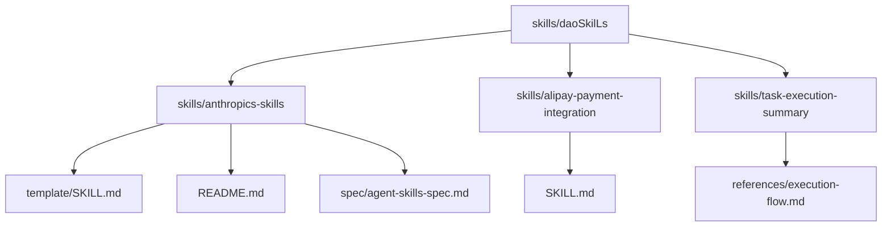
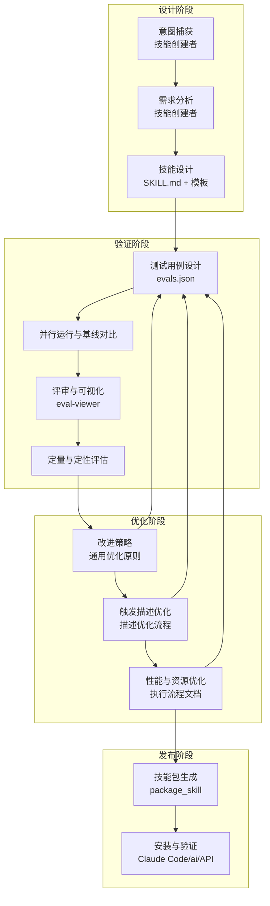
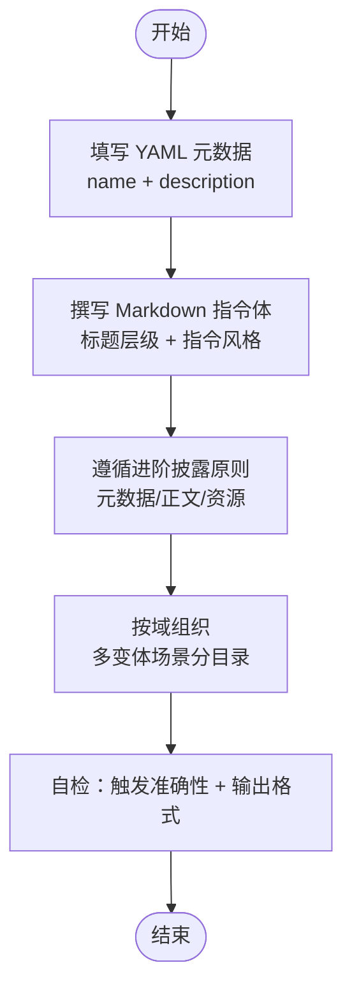
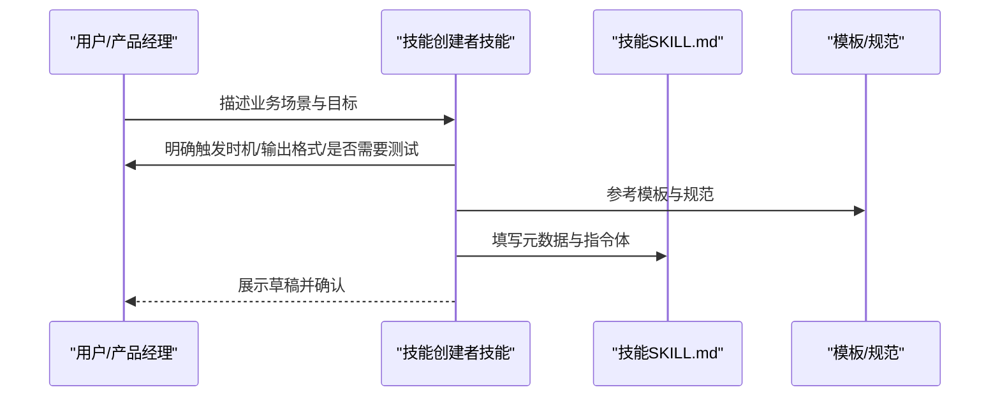
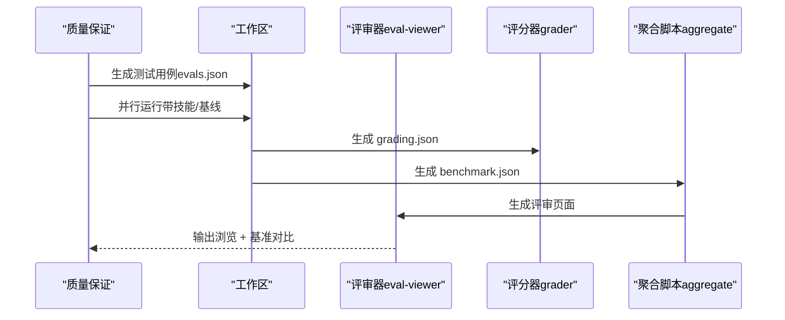
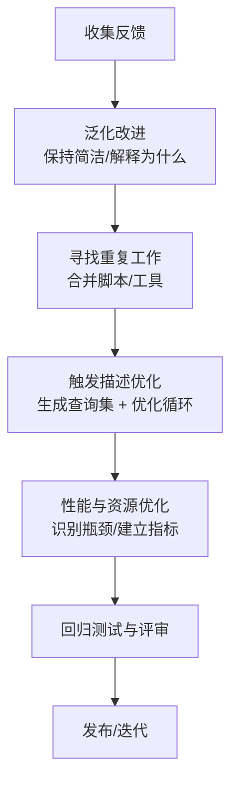
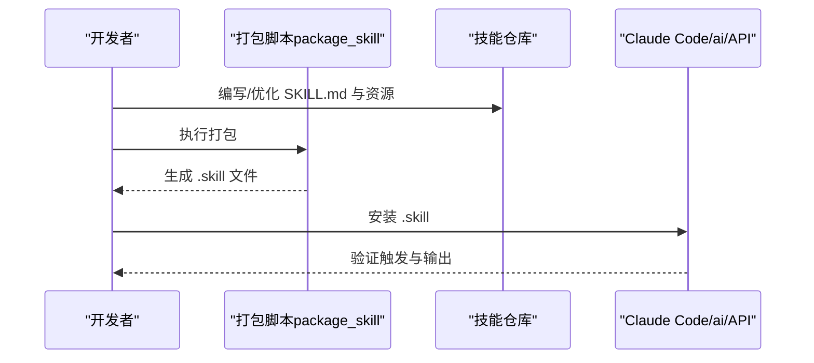
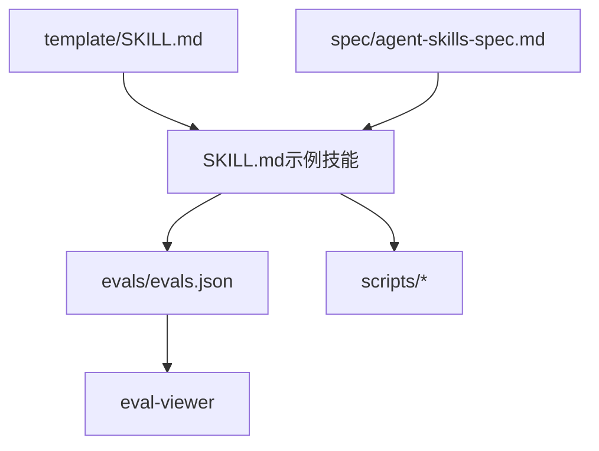

# 技能创建流程

<cite>
**本文引用的文件**
- [SKILL.md（模板）](file://skills/daoSkilLs/skills/anthropics-skills/template/SKILL.md)
- [README（技能集合）](file://skills/daoSkilLs/skills/anthropics-skills/README.md)
- [agent-skills-spec.md（规范）](file://skills/daoSkilLs/skills/anthropics-skills/spec/agent-skills-spec.md)
- [SKILL.md（任务执行总结）](file://skills/daoSkilLs/skills/task-execution-summary/references/execution-flow.md)
- [SKILL.md（技能创建者）](file://skills/daoSkilLs/skills/anthropics-skills/skills/skill-creator/SKILL.md)
- [SKILL.md（支付宝支付集成）](file://skills/daoSkilLs/skills/alipay-payment-integration/SKILL.md)
- [.gitignore（技能仓库）](file://skills/daoSkilLs/.gitignore)
</cite>

## 目录
1. [简介](#简介)
2. [项目结构](#项目结构)
3. [核心组件](#核心组件)
4. [架构总览](#架构总览)
5. [详细组件分析](#详细组件分析)
6. [依赖分析](#依赖分析)
7. [性能考虑](#性能考虑)
8. [故障排查指南](#故障排查指南)
9. [结论](#结论)
10. [附录](#附录)

## 简介
本指南面向希望在本仓库中系统化创建、优化与发布“技能”的工程师与产品人员。文档覆盖从意图捕获、需求分析、技能设计、测试验证到迭代优化的全流程，并结合仓库内现有的技能模板、规范与示例，给出可落地的实施步骤与最佳实践。同时，文档解释技能模板系统的使用方法（SKILL.md 文件结构、YAML 前置元数据与 Markdown 指令编写规范）、技能包生成与快速验证流程、性能改进要点、描述优化与触发准确性提升策略，以及常见问题的解决方案。

## 项目结构
技能相关资产主要集中在 skills/daoSkilLs 目录，包含：
- 模板与规范：template 与 spec 子目录，提供 SKILL.md 的最小可运行模板与 Agent Skills 规范链接
- 示例技能：anthropics-skills 下的多种技能样例，展示不同领域的技能组织方式
- 专项技能：如 alipay-payment-integration、task-execution-summary 等，体现模块化与层次化组织
- 工程化支持：.gitignore 等工程化配置，确保仓库整洁与 CI/CD 友好

图表来源
- [README（技能集合）:1-95](file://skills/daoSkilLs/skills/anthropics-skills/README.md#L1-L95)
- [SKILL.md（模板）:1-7](file://skills/daoSkilLs/skills/anthropics-skills/template/SKILL.md#L1-L7)
- [SKILL.md（任务执行总结）:1-25](file://skills/daoSkilLs/skills/task-execution-summary/references/execution-flow.md#L1-L25)

章节来源
- [README（技能集合）:1-95](file://skills/daoSkilLs/skills/anthropics-skills/README.md#L1-L95)
- [.gitignore（技能仓库）:1-208](file://skills/daoSkilLs/.gitignore#L1-L208)

## 核心组件
- 技能模板与规范
  - SKILL.md 前置元数据：name、description 为必需字段，用于技能识别与触发
  - Markdown 指令体：提供可执行的步骤、示例与约束
  - 规范链接：Agent Skills 规范地址位于 spec 子目录
- 示例技能
  - 任务执行总结：提供完整的执行流程文档，包含流程图、异常路径、性能基线与状态机说明
  - 支付宝支付集成：展示模块化组织（基础信息、集成流程、安全规范、产品模块、工具模块、文档模块）
  - 技能创建者：提供从意图捕获到迭代优化的完整闭环流程
- 工程化与测试
  - evals/evals.json：测试用例与断言的载体
  - eval-viewer：可视化评审工具，支持定量与定性结果对比
  - scripts：打包、聚合基准、运行循环等自动化脚本

章节来源
- [SKILL.md（模板）:1-7](file://skills/daoSkilLs/skills/anthropics-skills/template/SKILL.md#L1-L7)
- [agent-skills-spec.md（规范）:1-4](file://skills/daoSkilLs/skills/anthropics-skills/spec/agent-skills-spec.md#L1-L4)
- [SKILL.md（任务执行总结）:1-25](file://skills/daoSkilLs/skills/task-execution-summary/references/execution-flow.md#L1-L25)
- [SKILL.md（支付宝支付集成）:1-64](file://skills/daoSkilLs/skills/alipay-payment-integration/SKILL.md#L1-L64)
- [SKILL.md（技能创建者）:1-486](file://skills/daoSkilLs/skills/anthropics-skills/skills/skill-creator/SKILL.md#L1-L486)

## 架构总览
技能创建流程由“意图捕获—需求分析—技能设计—测试验证—迭代优化—发布”构成闭环。技能模板与规范为设计阶段提供约束与指引；测试与评审工具链保障验证与优化；性能与触发准确性优化贯穿迭代过程；最终形成可复用、可评测、可发布的技能包。

图表来源
- [SKILL.md（技能创建者）:10-32](file://skills/daoSkilLs/skills/anthropics-skills/skills/skill-creator/SKILL.md#L10-L32)
- [SKILL.md（技能创建者）:163-252](file://skills/daoSkilLs/skills/anthropics-skills/skills/skill-creator/SKILL.md#L163-L252)
- [SKILL.md（技能创建者）:333-406](file://skills/daoSkilLs/skills/anthropics-skills/skills/skill-creator/SKILL.md#L333-L406)
- [SKILL.md（任务执行总结）:142-171](file://skills/daoSkilLs/skills/task-execution-summary/references/execution-flow.md#L142-L171)
- [README（技能集合）:61-88](file://skills/daoSkilLs/skills/anthropics-skills/README.md#L61-L88)

## 详细组件分析

### 组件A：技能模板系统与 SKILL.md 结构
- YAML 前置元数据
  - name：技能唯一标识（小写、连字符）
  - description：技能做什么、何时触发的完整描述，是触发主机制
- Markdown 指令体
  - 标题层级：建议使用 #、##、### 组织内容
  - 指令风格：使用祈使句，明确输出格式与示例
  - 进阶披露：控制上下文加载大小（元数据约100字、正文<500行、资源按需加载）
  - 域组织：多变体场景按子目录组织，仅加载相关资源
- 模板参考
  - template/SKILL.md 提供最小可运行模板
  - anthropics-skills/README.md 提供创建基本技能的步骤与要点

图表来源
- [SKILL.md（模板）:1-7](file://skills/daoSkilLs/skills/anthropics-skills/template/SKILL.md#L1-L7)
- [README（技能集合）:61-88](file://skills/daoSkilLs/skills/anthropics-skills/README.md#L61-L88)
- [SKILL.md（技能创建者）:86-110](file://skills/daoSkilLs/skills/anthropics-skills/skills/skill-creator/SKILL.md#L86-L110)

章节来源
- [SKILL.md（模板）:1-7](file://skills/daoSkilLs/skills/anthropics-skills/template/SKILL.md#L1-L7)
- [README（技能集合）:61-88](file://skills/daoSkilLs/skills/anthropics-skills/README.md#L61-L88)
- [SKILL.md（技能创建者）:86-110](file://skills/daoSkilLs/skills/anthropics-skills/skills/skill-creator/SKILL.md#L86-L110)

### 组件B：从意图捕获到技能设计的流程
- 意图捕获：明确技能要达成的目标、触发时机、输出格式与是否需要测试用例
- 需求分析：识别边缘场景、输入/输出格式、示例文件、成功标准与依赖
- 技能设计：基于模板填充元数据与指令体，遵循进阶披露与域组织原则
- 示例参考：支付宝支付集成技能的模块化组织方式

图表来源
- [SKILL.md（技能创建者）:47-70](file://skills/daoSkilLs/skills/anthropics-skills/skills/skill-creator/SKILL.md#L47-L70)
- [SKILL.md（模板）:1-7](file://skills/daoSkilLs/skills/anthropics-skills/template/SKILL.md#L1-L7)

章节来源
- [SKILL.md（技能创建者）:47-70](file://skills/daoSkilLs/skills/anthropics-skills/skills/skill-creator/SKILL.md#L47-L70)
- [SKILL.md（支付宝支付集成）:19-64](file://skills/daoSkilLs/skills/alipay-payment-integration/SKILL.md#L19-L64)

### 组件C：测试验证与评审
- 测试用例设计：在 evals/evals.json 中定义测试集，先写用例再写断言
- 并行运行与基线对比：同一轮次内同时运行“带技能”与“基线”子任务
- 评审与可视化：使用 eval-viewer 生成评审页面，支持输出浏览与基准对比
- 定量与定性评估：grading.json 与 benchmark.json 提供统计指标与观察

图表来源
- [SKILL.md（技能创建者）:163-252](file://skills/daoSkilLs/skills/anthropics-skills/skills/skill-creator/SKILL.md#L163-L252)
- [SKILL.md（技能创建者）:227-234](file://skills/daoSkilLs/skills/anthropics-skills/skills/skill-creator/SKILL.md#L227-L234)

章节来源
- [SKILL.md（技能创建者）:163-252](file://skills/daoSkilLs/skills/anthropics-skills/skills/skill-creator/SKILL.md#L163-L252)

### 组件D：迭代优化与性能改进
- 通用优化原则：泛化反馈、保持简洁、解释“为什么”、寻找重复工作
- 触发描述优化：生成触发查询集，运行优化循环，基于测试分数选择最优描述
- 性能与资源优化：参考任务执行总结的执行流程文档，识别瓶颈、建立质量指标与降级策略

图表来源
- [SKILL.md（技能创建者）:296-322](file://skills/daoSkilLs/skills/anthropics-skills/skills/skill-creator/SKILL.md#L296-L322)
- [SKILL.md（技能创建者）:333-406](file://skills/daoSkilLs/skills/anthropics-skills/skills/skill-creator/SKILL.md#L333-L406)
- [SKILL.md（任务执行总结）:142-171](file://skills/daoSkilLs/skills/task-execution-summary/references/execution-flow.md#L142-L171)

章节来源
- [SKILL.md（技能创建者）:296-322](file://skills/daoSkilLs/skills/anthropics-skills/skills/skill-creator/SKILL.md#L296-L322)
- [SKILL.md（技能创建者）:333-406](file://skills/daoSkilLs/skills/anthropics-skills/skills/skill-creator/SKILL.md#L333-L406)
- [SKILL.md（任务执行总结）:142-171](file://skills/daoSkilLs/skills/task-execution-summary/references/execution-flow.md#L142-L171)

### 组件E：技能包生成与发布
- 技能包生成：使用 package_skill 脚本将技能目录打包为 .skill 文件
- 安装与验证：在 Claude Code/ai 或 API 中安装并验证技能
- 规范遵循：参考 Agent Skills 规范与 README 中的使用说明

图表来源
- [README（技能集合）:61-88](file://skills/daoSkilLs/skills/anthropics-skills/README.md#L61-L88)
- [SKILL.md（技能创建者）:408-417](file://skills/daoSkilLs/skills/anthropics-skills/skills/skill-creator/SKILL.md#L408-L417)

章节来源
- [README（技能集合）:61-88](file://skills/daoSkilLs/skills/anthropics-skills/README.md#L61-L88)
- [SKILL.md（技能创建者）:408-417](file://skills/daoSkilLs/skills/anthropics-skills/skills/skill-creator/SKILL.md#L408-L417)

## 依赖分析
- 模板与规范依赖
  - template/SKILL.md 为最小可运行模板
  - spec/agent-skills-spec.md 指向官方规范地址
- 示例技能依赖
  - 支付宝支付集成：模块化文档组织，便于按需加载
  - 任务执行总结：提供执行流程、异常路径与性能基线
- 工具链依赖
  - evals/evals.json：测试用例与断言
  - eval-viewer：评审页面
  - scripts：打包、聚合、运行循环等

图表来源
- [SKILL.md（模板）:1-7](file://skills/daoSkilLs/skills/anthropics-skills/template/SKILL.md#L1-L7)
- [agent-skills-spec.md（规范）:1-4](file://skills/daoSkilLs/skills/anthropics-skills/spec/agent-skills-spec.md#L1-L4)
- [SKILL.md（技能创建者）:163-252](file://skills/daoSkilLs/skills/anthropics-skills/skills/skill-creator/SKILL.md#L163-L252)

章节来源
- [SKILL.md（模板）:1-7](file://skills/daoSkilLs/skills/anthropics-skills/template/SKILL.md#L1-L7)
- [agent-skills-spec.md（规范）:1-4](file://skills/daoSkilLs/skills/anthropics-skills/spec/agent-skills-spec.md#L1-L4)
- [SKILL.md（技能创建者）:163-252](file://skills/daoSkilLs/skills/anthropics-skills/skills/skill-creator/SKILL.md#L163-L252)

## 性能考虑
- 执行流程优化
  - 参考任务执行总结的执行流程文档，识别瓶颈阶段（如信息收集与分析处理）
  - 建立关键性能指标（总耗时分布、阶段耗时占比、详细程度影响）
- 触发与上下文控制
  - 控制 SKILL.md 长度与资源加载规模，避免超载上下文
  - 在描述中强调触发时机与场景，减少“欠触发”
- 资源与工具复用
  - 合并重复脚本与工具，减少每次调用的重复工作
  - 使用脚本目录统一管理可执行资源

章节来源
- [SKILL.md（任务执行总结）:142-171](file://skills/daoSkilLs/skills/task-execution-summary/references/execution-flow.md#L142-L171)
- [SKILL.md（技能创建者）:86-110](file://skills/daoSkilLs/skills/anthropics-skills/skills/skill-creator/SKILL.md#L86-L110)
- [SKILL.md（技能创建者）:304-305](file://skills/daoSkilLs/skills/anthropics-skills/skills/skill-creator/SKILL.md#L304-L305)

## 故障排查指南
- 触发不生效
  - 检查描述是否足够具体、覆盖多种触发场景
  - 使用触发描述优化流程生成查询集并运行优化循环
- 测试用例无效
  - 确保 evals.json 中包含真实、具体的提示与预期输出
  - 使用评审器查看输出与基准，聚焦失败用例
- 性能不佳
  - 参考执行流程文档识别瓶颈阶段，优化数据源适配与信息抽取
  - 降低上下文规模，合并重复工作
- 工具链问题
  - 确认 eval-viewer 与聚合脚本可用
  - 在无浏览器环境使用静态输出模式

章节来源
- [SKILL.md（技能创建者）:333-406](file://skills/daoSkilLs/skills/anthropics-skills/skills/skill-creator/SKILL.md#L333-L406)
- [SKILL.md（技能创建者）:227-234](file://skills/daoSkilLs/skills/anthropics-skills/skills/skill-creator/SKILL.md#L227-L234)
- [SKILL.md（任务执行总结）:142-171](file://skills/daoSkilLs/skills/task-execution-summary/references/execution-flow.md#L142-L171)

## 结论
通过模板与规范的约束、示例技能的参考、工具链的支撑与持续的测试与优化，本仓库提供了从意图到发布的完整技能创建路径。建议在设计阶段严格遵循进阶披露与域组织原则，在验证阶段建立完善的测试与评审流程，在优化阶段持续关注触发准确性与性能指标，并最终形成可复用、可评测、可发布的高质量技能包。

## 附录
- 快速开始
  - 使用 template/SKILL.md 作为起点
  - 参考 anthropics-skills/README.md 的创建步骤
  - 使用 evals/evals.json 与 eval-viewer 进行评审
- 参考文件
  - SKILL.md（模板）：提供最小可运行模板
  - README（技能集合）：创建基本技能的步骤与要点
  - agent-skills-spec.md：官方规范链接
  - SKILL.md（任务执行总结）：执行流程、异常路径与性能基线
  - SKILL.md（技能创建者）：意图捕获、测试验证、描述优化与发布流程

章节来源
- [SKILL.md（模板）:1-7](file://skills/daoSkilLs/skills/anthropics-skills/template/SKILL.md#L1-L7)
- [README（技能集合）:61-88](file://skills/daoSkilLs/skills/anthropics-skills/README.md#L61-L88)
- [agent-skills-spec.md（规范）:1-4](file://skills/daoSkilLs/skills/anthropics-skills/spec/agent-skills-spec.md#L1-L4)
- [SKILL.md（任务执行总结）:1-25](file://skills/daoSkilLs/skills/task-execution-summary/references/execution-flow.md#L1-L25)
- [SKILL.md（技能创建者）:1-486](file://skills/daoSkilLs/skills/anthropics-skills/skills/skill-creator/SKILL.md#L1-L486)