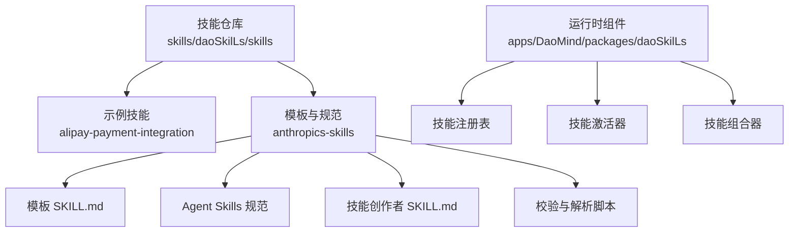
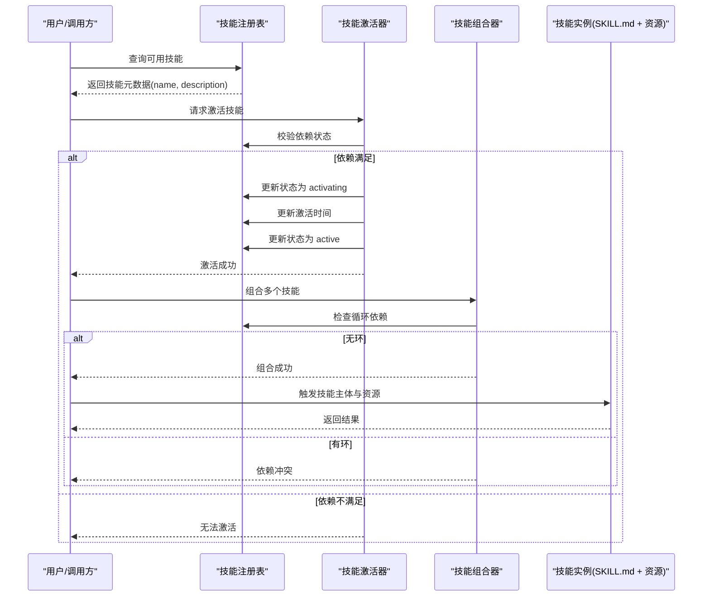
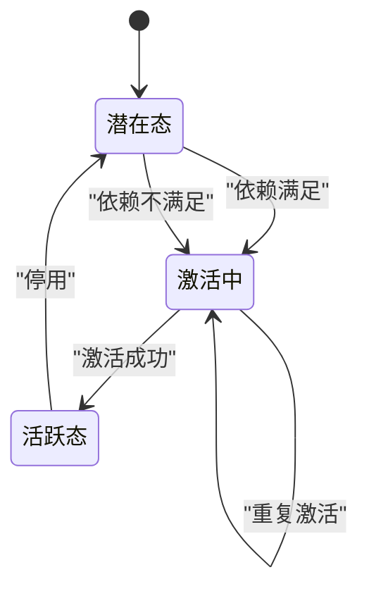
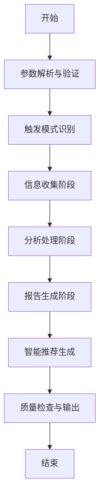
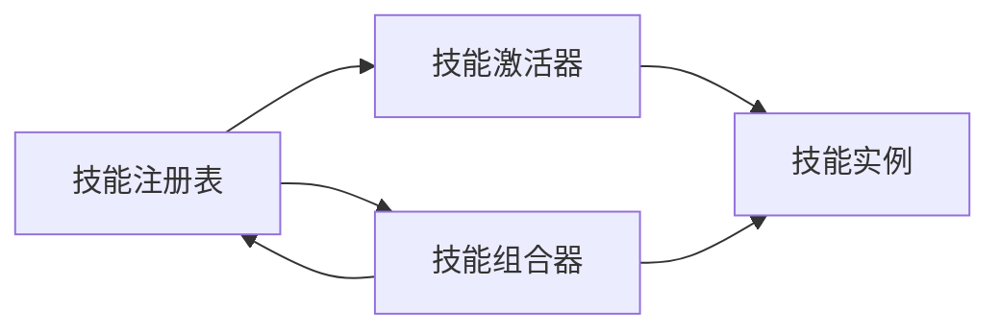

# 技能编写阶段

<cite>
**本文引用的文件**
- [SKILL.md（支付宝支付集成）](file://skills/daoSkilLs/skills/alipay-payment-integration/SKILL.md)
- [SKILL.md（技能模板）](file://skills/daoSkilLs/skills/anthropics-skills/template/SKILL.md)
- [Agent Skills 规范](file://skills/daoSkilLs/skills/anthropics-skills/spec/agent-skills-spec.md)
- [任务执行总结参考：执行流程](file://skills/daoSkilLs/skills/task-execution-summary/references/execution-flow.md)
- [任务执行总结参考：术语表](file://skills/daoSkilLs/skills/task-execution-summary/references/terminology.md)
- [技能创建指南（技能创作者）](file://skills/daoSkilLs/skills/anthropics-skills/skills/skill-creator/SKILL.md)
- [技能 Frontmatter 解析工具](file://skills/daoSkilLs/skills/anthropics-skills/skills/skill-creator/scripts/utils.py)
- [技能 Frontmatter 快速校验脚本](file://skills/daoSkilLs/skills/anthropics-skills/skills/skill-creator/scripts/quick_validate.py)
- [技能激活器（DaoSkillActivator）](file://apps/DaoMind/packages/daoSkilLs/src/skill-activator.ts)
- [技能注册表（DaoSkillRegistry）](file://apps/DaoMind/packages/daoSkilLs/src/skill-registry.ts)
- [技能组合器（DaoSkillCombiner）](file://apps/DaoMind/packages/daoSkilLs/src/combiner.ts)
</cite>

## 目录
1. [简介](#简介)
2. [项目结构](#项目结构)
3. [核心组件](#核心组件)
4. [架构总览](#架构总览)
5. [详细组件分析](#详细组件分析)
6. [依赖分析](#依赖分析)
7. [性能考量](#性能考量)
8. [故障排查指南](#故障排查指南)
9. [结论](#结论)
10. [附录](#附录)

## 简介
本指南面向“技能编写阶段”的实践者，系统阐述如何基于 DAOApps 仓库中的技能体系，完成高质量的技能创作与维护。内容覆盖 SKILL.md 的完整结构与 YAML 前置元数据规范、Markdown 指令组织方式、三层次加载系统（元数据、技能主体、捆绑资源）的设计原理与实现细节，以及技能模板系统的使用方法。同时，结合渐进披露模式、缺乏惊喜原则与写作风格的最佳实践，提供可操作的编写流程、常见错误规避方法与可视化图示。

## 项目结构
技能相关代码与文档主要分布在以下位置：
- skills/daoSkilLs/skills：技能示例与模板，包含 SKILL.md、modules、references、scripts、assets 等
- skills/daoSkilLs/skills/anthropics-skills：技能标准与模板、技能创作者工具链
- apps/DaoMind/packages/daoSkilLs：技能运行时的注册、激活与组合逻辑（TypeScript）

**图表来源**
- [SKILL.md（支付宝支付集成）:1-64](file://skills/daoSkilLs/skills/alipay-payment-integration/SKILL.md#L1-L64)
- [SKILL.md（技能模板）:1-7](file://skills/daoSkilLs/skills/anthropics-skills/template/SKILL.md#L1-L7)
- [Agent Skills 规范:1-4](file://skills/daoSkilLs/skills/anthropics-skills/spec/agent-skills-spec.md#L1-L4)
- [技能创建指南（技能创作者）:1-486](file://skills/daoSkilLs/skills/anthropics-skills/skills/skill-creator/SKILL.md#L1-L486)
- [技能激活器（DaoSkillActivator）:1-39](file://apps/DaoMind/packages/daoSkilLs/src/skill-activator.ts#L1-L39)
- [技能注册表（DaoSkillRegistry）:40-72](file://apps/DaoMind/packages/daoSkilLs/src/skill-registry.ts#L40-L72)
- [技能组合器（DaoSkillCombiner）:50-83](file://apps/DaoMind/packages/daoSkilLs/src/combiner.ts#L50-L83)

**章节来源**
- [SKILL.md（支付宝支付集成）:1-64](file://skills/daoSkilLs/skills/alipay-payment-integration/SKILL.md#L1-L64)
- [SKILL.md（技能模板）:1-7](file://skills/daoSkilLs/skills/anthropics-skills/template/SKILL.md#L1-L7)
- [Agent Skills 规范:1-4](file://skills/daoSkilLs/skills/anthropics-skills/spec/agent-skills-spec.md#L1-L4)
- [技能创建指南（技能创作者）:1-486](file://skills/daoSkilLs/skills/anthropics-skills/skills/skill-creator/SKILL.md#L1-L486)
- [技能激活器（DaoSkillActivator）:1-39](file://apps/DaoMind/packages/daoSkilLs/src/skill-activator.ts#L1-L39)
- [技能注册表（DaoSkillRegistry）:40-72](file://apps/DaoMind/packages/daoSkilLs/src/skill-registry.ts#L40-L72)
- [技能组合器（DaoSkillCombiner）:50-83](file://apps/DaoMind/packages/daoSkilLs/src/combiner.ts#L50-L83)

## 核心组件
- YAML 前置元数据（name、description 等）：用于技能识别、触发与上下文注入
- 技能主体（SKILL.md）：包含指令、示例、指南与结构化内容
- 捆绑资源（scripts、references、assets）：按需加载的脚本、参考文档与资产
- 运行时组件（注册、激活、组合）：负责技能生命周期与依赖管理

关键要点
- 元数据始终在上下文中（约 100 字），保证触发准确性
- 技能主体在触发时加载（理想 <500 行），避免上下文污染
- 捆绑资源按需加载，脚本可直接执行，不受上下文大小限制

**章节来源**
- [技能创建指南（技能创作者）:86-117](file://skills/daoSkilLs/skills/anthropics-skills/skills/skill-creator/SKILL.md#L86-L117)
- [SKILL.md（技能模板）:1-7](file://skills/daoSkilLs/skills/anthropics-skills/template/SKILL.md#L1-L7)

## 架构总览
技能的三层次加载系统与运行时生命周期如下：

**图表来源**
- [技能注册表（DaoSkillRegistry）:40-72](file://apps/DaoMind/packages/daoSkilLs/src/skill-registry.ts#L40-L72)
- [技能激活器（DaoSkillActivator）:10-30](file://apps/DaoMind/packages/daoSkilLs/src/skill-activator.ts#L10-L30)
- [技能组合器（DaoSkillCombiner）:50-83](file://apps/DaoMind/packages/daoSkilLs/src/combiner.ts#L50-L83)

## 详细组件分析

### YAML 前置元数据与 SKILL.md 结构
- name：唯一标识符，建议使用 kebab-case（小写字母、数字、连字符），长度不超过 64
- description：触发描述与用途说明，应包含何时触发与做什么，长度不超过 1024
- 其他可选字段：license、allowed-tools、metadata、compatibility 等
- SKILL.md 主体：指令、示例、指南与结构化内容，遵循渐进披露与“缺乏惊喜”原则

编写规范与最佳实践
- 渐进披露：元数据（100 字）+ 主体（<500 行）+ 资源（按需）
- 缺乏惊喜：不包含恶意内容，意图明确，不误导用户
- 写作风格：使用祈使句，解释“为何”而非仅列“必须”
- 示例与指南：提供真实场景示例，明确输出格式与校验点

**章节来源**
- [技能创建指南（技能创作者）:86-117](file://skills/daoSkilLs/skills/anthropics-skills/skills/skill-creator/SKILL.md#L86-L117)
- [技能 Frontmatter 快速校验脚本:42-94](file://skills/daoSkilLs/skills/anthropics-skills/skills/skill-creator/scripts/quick_validate.py#L42-L94)
- [技能 Frontmatter 解析工具:7-47](file://skills/daoSkilLs/skills/anthropics-skills/skills/skill-creator/scripts/utils.py#L7-L47)

### 三层次加载系统
- 元数据（name + description）：始终在上下文中，用于触发与检索
- 技能主体（SKILL.md）：触发时加载，包含指令与结构化内容
- 捆绑资源（scripts、references、assets）：按需加载，脚本可直接执行

实现细节
- 元数据解析：通过 YAML 前置元数据读取 name 与 description
- 主体加载：在触发时将 SKILL.md 的主体内容注入上下文
- 资源加载：仅在需要时读取 references 与执行 scripts

**章节来源**
- [技能创建指南（技能创作者）:86-117](file://skills/daoSkilLs/skills/anthropics-skills/skills/skill-creator/SKILL.md#L86-L117)
- [技能 Frontmatter 解析工具:7-47](file://skills/daoSkilLs/skills/anthropics-skills/skills/skill-creator/scripts/utils.py#L7-L47)

### 技能模板系统
- 模板文件：template/SKILL.md 提供最小骨架
- 规范参考：Agent Skills 规范与技能创作者指南
- 组织结构：技能目录包含 SKILL.md、scripts、references、assets

使用方法
- 从模板开始，填充 name 与 description，并编写主体指令
- 将参考文档放入 references，脚本放入 scripts，资产放入 assets
- 使用校验脚本确保 Frontmatter 合规

**章节来源**
- [SKILL.md（技能模板）:1-7](file://skills/daoSkilLs/skills/anthropics-skills/template/SKILL.md#L1-L7)
- [Agent Skills 规范:1-4](file://skills/daoSkilLs/skills/anthropics-skills/spec/agent-skills-spec.md#L1-L4)
- [技能创建指南（技能创作者）:71-84](file://skills/daoSkilLs/skills/anthropics-skills/skills/skill-creator/SKILL.md#L71-L84)

### 渐进披露模式与“缺乏惊喜”原则
渐进披露
- 元数据（name + description）：始终在上下文，约 100 字
- 主体（SKILL.md）：触发时加载，建议 <500 行
- 资源（scripts、references、assets）：按需加载

“缺乏惊喜”原则
- 不包含恶意内容，意图明确
- 不误导用户，不鼓励不当用途
- 保持透明与可审计

**章节来源**
- [技能创建指南（技能创作者）:86-117](file://skills/daoSkilLs/skills/anthropics-skills/skills/skill-creator/SKILL.md#L86-L117)
- [技能 Frontmatter 快速校验脚本:111-114](file://skills/daoSkilLs/skills/anthropics-skills/skills/skill-creator/scripts/quick_validate.py#L111-L114)

### 写作风格与示例组织
- 使用祈使句，强调行动与结果
- 明确输出格式与结构，必要时提供模板
- 提供真实场景示例，标注输入与输出
- 对于长文档，提供目录与分层组织

**章节来源**
- [技能创建指南（技能创作者）:115-136](file://skills/daoSkilLs/skills/anthropics-skills/skills/skill-creator/SKILL.md#L115-L136)

### 运行时生命周期与依赖管理
技能生命周期
- 注册：登记技能定义与状态
- 激活：校验依赖，更新状态为 active
- 使用：在上下文中执行技能主体与资源
- 组合：多技能组合，避免循环依赖

**图表来源**
- [技能激活器（DaoSkillActivator）:10-30](file://apps/DaoMind/packages/daoSkilLs/src/skill-activator.ts#L10-L30)
- [技能注册表（DaoSkillRegistry）:44-49](file://apps/DaoMind/packages/daoSkilLs/src/skill-registry.ts#L44-L49)

**章节来源**
- [技能激活器（DaoSkillActivator）:1-39](file://apps/DaoMind/packages/daoSkilLs/src/skill-activator.ts#L1-L39)
- [技能注册表（DaoSkillRegistry）:40-72](file://apps/DaoMind/packages/daoSkilLs/src/skill-registry.ts#L40-L72)
- [技能组合器（DaoSkillCombiner）:50-83](file://apps/DaoMind/packages/daoSkilLs/src/combiner.ts#L50-L83)

### 复杂逻辑组件：执行流程与术语体系（参考）
- 执行流程：参数解析与验证、触发模式识别、信息收集、分析处理、报告生成、智能推荐、质量检查与输出
- 术语体系：涵盖任务执行、目标与成果评估、时间与效率分析、问题与风险、资源与协作、报告结构、项目管理、软件开发、学习方法论等

**图表来源**
- [任务执行总结参考：执行流程:173-310](file://skills/daoSkilLs/skills/task-execution-summary/references/execution-flow.md#L173-L310)

**章节来源**
- [任务执行总结参考：执行流程:1-1783](file://skills/daoSkilLs/skills/task-execution-summary/references/execution-flow.md#L1-L1783)
- [任务执行总结参考：术语表:1-1104](file://skills/daoSkilLs/skills/task-execution-summary/references/terminology.md#L1-L1104)

## 依赖分析
- 技能与运行时组件的耦合：通过注册表与激活器解耦，组合器负责依赖关系检查
- 外部依赖：Agent Skills 规范与模板系统
- 潜在循环依赖：组合器通过 DFS 检测，避免技能组合死锁

**图表来源**
- [技能注册表（DaoSkillRegistry）:40-72](file://apps/DaoMind/packages/daoSkilLs/src/skill-registry.ts#L40-L72)
- [技能激活器（DaoSkillActivator）:1-39](file://apps/DaoMind/packages/daoSkilLs/src/skill-activator.ts#L1-L39)
- [技能组合器（DaoSkillCombiner）:50-83](file://apps/DaoMind/packages/daoSkilLs/src/combiner.ts#L50-L83)

**章节来源**
- [技能组合器（DaoSkillCombiner）:50-83](file://apps/DaoMind/packages/daoSkilLs/src/combiner.ts#L50-L83)

## 性能考量
- 上下文大小控制：元数据与主体严格控制在建议字数内，避免上下文溢出
- 资源按需加载：scripts 与 references 仅在需要时读取，减少初始化开销
- 触发策略：描述优化与触发评估有助于减少误触发与漏触发
- 运行时开销：注册、激活与组合的检查逻辑应尽量轻量，避免阻塞主线程

## 故障排查指南
常见问题与解决方法
- Frontmatter 缺失或格式错误：使用快速校验脚本检查 name、description、allowed-keys 等
- 描述过长或包含非法字符：确保长度与字符合规
- 技能未被触发：优化描述，增加触发关键词与场景说明
- 依赖未满足：检查激活器的依赖链，确保前置技能已激活
- 组合循环依赖：使用组合器的环检测，调整依赖关系

**章节来源**
- [技能 Frontmatter 快速校验脚本:12-94](file://skills/daoSkilLs/skills/anthropics-skills/skills/skill-creator/scripts/quick_validate.py#L12-L94)
- [技能 Frontmatter 解析工具:7-47](file://skills/daoSkilLs/skills/anthropics-skills/skills/skill-creator/scripts/utils.py#L7-L47)
- [技能激活器（DaoSkillActivator）:16-24](file://apps/DaoMind/packages/daoSkilLs/src/skill-activator.ts#L16-L24)
- [技能组合器（DaoSkillCombiner）:50-79](file://apps/DaoMind/packages/daoSkilLs/src/combiner.ts#L50-L79)

## 结论
通过三层次加载系统与运行时生命周期管理，DAOApps 的技能体系实现了高效、可控与可扩展的技能交付。遵循 YAML 前置元数据规范、渐进披露与“缺乏惊喜”原则，配合模板系统与校验工具，可显著提升技能质量与稳定性。建议在编写过程中持续进行触发评估与性能优化，确保技能在真实场景中可靠运行。

## 附录
- Agent Skills 规范与模板参考：见“技能模板系统”与“Agent Skills 规范”
- 执行流程与术语体系参考：见“复杂逻辑组件：执行流程与术语体系（参考）”