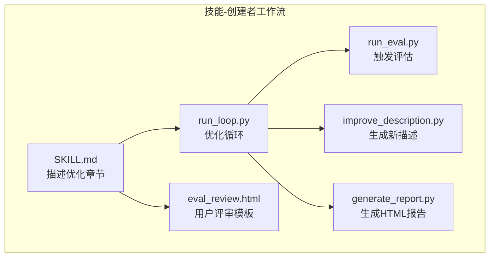
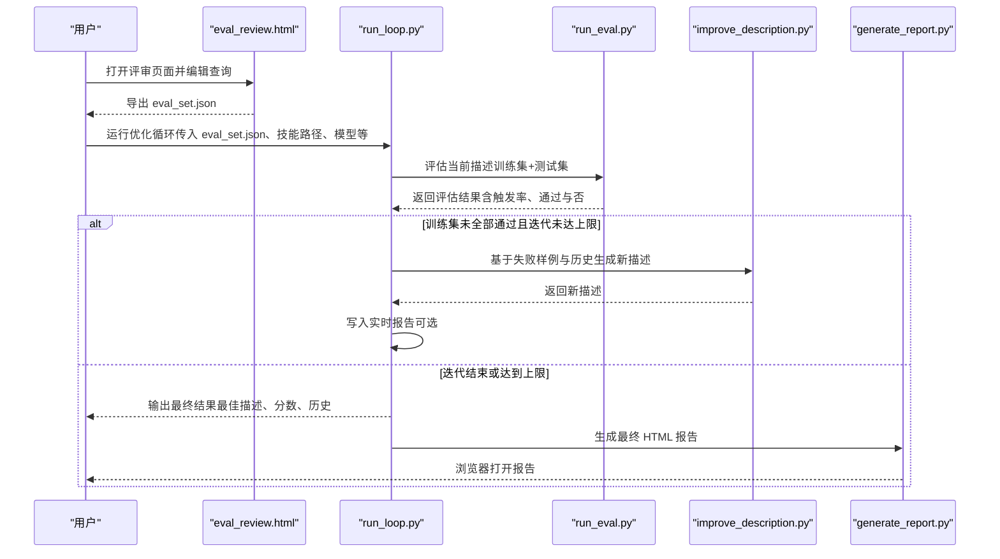
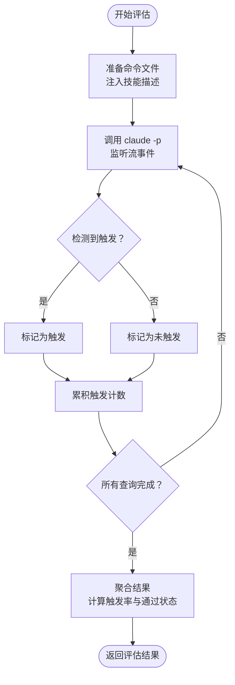
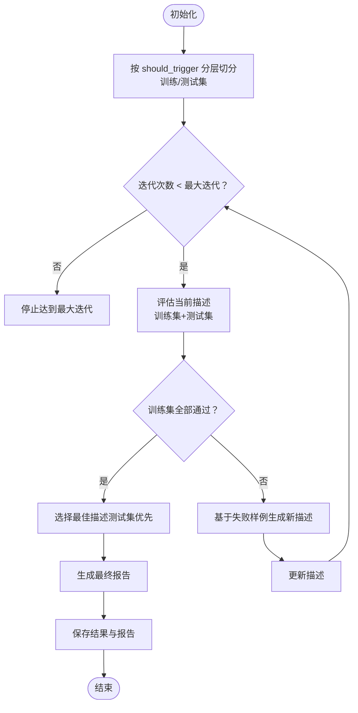
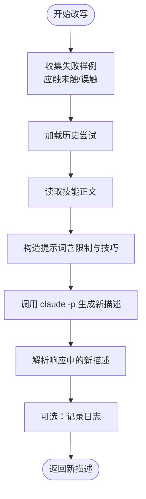
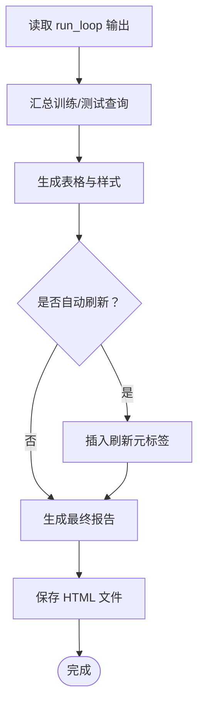
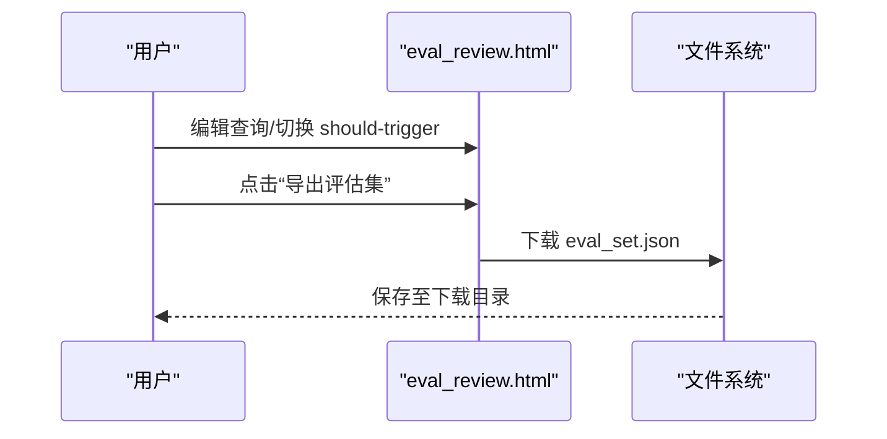
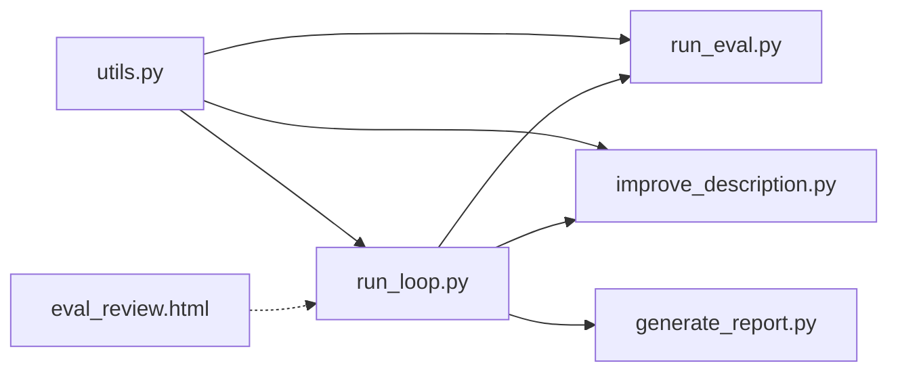

# 描述优化

<cite>
**本文引用的文件**
- [run_loop.py](file://skills/daoSkilLs/skills/anthropics-skills/skills/skill-creator/scripts/run_loop.py)
- [run_eval.py](file://skills/daoSkilLs/skills/anthropics-skills/skills/skill-creator/scripts/run_eval.py)
- [improve_description.py](file://skills/daoSkilLs/skills/anthropics-skills/skills/skill-creator/scripts/improve_description.py)
- [generate_report.py](file://skills/daoSkilLs/skills/anthropics-skills/skills/skill-creator/scripts/generate_report.py)
- [eval_review.html](file://skills/daoSkilLs/skills/anthropics-skills/skills/skill-creator/assets/eval_review.html)
- [SKILL.md](file://skills/daoSkilLs/skills/anthropics-skills/skills/skill-creator/SKILL.md)
- [utils.py](file://skills/daoSkilLs/skills/anthropics-skills/skills/skill-creator/scripts/utils.py)
</cite>

## 目录
1. [简介](#简介)
2. [项目结构](#项目结构)
3. [核心组件](#核心组件)
4. [架构总览](#架构总览)
5. [详细组件分析](#详细组件分析)
6. [依赖分析](#依赖分析)
7. [性能考量](#性能考量)
8. [故障排查指南](#故障排查指南)
9. [结论](#结论)
10. [附录](#附录)

## 简介
本指南面向“技能描述优化”工作流，围绕 SKILL.md 前言区的 description 字段（即触发机制）展开，系统阐述如何通过 20 个触发评估查询（should-trigger 与 should-not-trigger 平衡设计）、HTML 模板评审、用户评审流程、eval_set.json 导出、run_loop.py 自动优化循环（参数、迭代次数、最佳描述选择标准）、触发机制原理、评分体系与量化评估方法，帮助你构建高质量、高触发准确率的技能描述。

## 项目结构
该能力由一组脚本与模板组成，位于技能“skill-creator”的子模块中，核心文件如下：
- 触发评估与优化主循环：scripts/run_loop.py
- 单轮触发评估：scripts/run_eval.py
- 描述改写建议生成：scripts/improve_description.py
- HTML 报告生成：scripts/generate_report.py
- 用户评审 HTML 模板：assets/eval_review.html
- 使用说明与流程：SKILL.md
- 工具函数：scripts/utils.py

图示来源
- [run_loop.py:1-329](file://skills/daoSkilLs/skills/anthropics-skills/skills/skill-creator/scripts/run_loop.py#L1-L329)
- [run_eval.py:1-311](file://skills/daoSkilLs/skills/anthropics-skills/skills/skill-creator/scripts/run_eval.py#L1-L311)
- [improve_description.py:1-248](file://skills/daoSkilLs/skills/anthropics-skills/skills/skill-creator/scripts/improve_description.py#L1-L248)
- [generate_report.py:1-327](file://skills/daoSkilLs/skills/anthropics-skills/skills/skill-creator/scripts/generate_report.py#L1-L327)
- [eval_review.html:1-147](file://skills/daoSkilLs/skills/anthropics-skills/skills/skill-creator/assets/eval_review.html#L1-L147)
- [SKILL.md:333-406](file://skills/daoSkilLs/skills/anthropics-skills/skills/skill-creator/SKILL.md#L333-L406)

章节来源
- [SKILL.md:333-406](file://skills/daoSkilLs/skills/anthropics-skills/skills/skill-creator/SKILL.md#L333-L406)

## 核心组件
- 触发评估器 run_eval.py：并行执行评估查询，基于 claude -p 的流式事件检测判断是否触发，统计触发率与通过情况。
- 优化循环 run_loop.py：在训练集与测试集上迭代评估与改进描述，支持自动刷新的 HTML 报告与最佳描述选择。
- 描述改写器 improve_description.py：基于失败样例与历史尝试，调用 claude -p 生成更优描述文本。
- 报告生成器 generate_report.py：将优化历史渲染为 HTML，区分训练/测试列，标注最佳迭代。
- 用户评审模板 eval_review.html：用于人工校验与导出 eval_set.json 的交互界面。
- 工具函数 utils.py：解析 SKILL.md 前言区，提取名称与描述。

章节来源
- [run_eval.py:184-256](file://skills/daoSkilLs/skills/anthropics-skills/skills/skill-creator/scripts/run_eval.py#L184-L256)
- [run_loop.py:47-241](file://skills/daoSkilLs/skills/anthropics-skills/skills/skill-creator/scripts/run_loop.py#L47-L241)
- [improve_description.py:50-191](file://skills/daoSkilLs/skills/anthropics-skills/skills/skill-creator/scripts/improve_description.py#L50-L191)
- [generate_report.py:16-301](file://skills/daoSkilLs/skills/anthropics-skills/skills/skill-creator/scripts/generate_report.py#L16-L301)
- [eval_review.html:62-144](file://skills/daoSkilLs/skills/anthropics-skills/skills/skill-creator/assets/eval_review.html#L62-L144)
- [utils.py:7-38](file://skills/daoSkilLs/skills/anthropics-skills/skills/skill-creator/scripts/utils.py#L7-L38)

## 架构总览
下图展示从“生成评估查询”到“自动优化循环”的端到端流程，以及各组件之间的调用关系与数据传递。

图示来源
- [SKILL.md:360-394](file://skills/daoSkilLs/skills/anthropics-skills/skills/skill-creator/SKILL.md#L360-L394)
- [run_loop.py:86-241](file://skills/daoSkilLs/skills/anthropics-skills/skills/skill-creator/scripts/run_loop.py#L86-L241)
- [run_eval.py:184-256](file://skills/daoSkilLs/skills/anthropics-skills/skills/skill-creator/scripts/run_eval.py#L184-L256)
- [improve_description.py:50-191](file://skills/daoSkilLs/skills/anthropics-skills/skills/skill-creator/scripts/improve_description.py#L50-L191)
- [generate_report.py:16-301](file://skills/daoSkilLs/skills/anthropics-skills/skills/skill-creator/scripts/generate_report.py#L16-L301)

## 详细组件分析

### 组件一：触发评估器 run_eval.py
- 功能要点
  - 为每个查询创建临时命令文件，注入技能描述，调用 claude -p 并监听流事件，尽早识别“Skill/Read”工具调用以判定是否触发。
  - 对每个查询重复运行多次（默认 3 次），计算触发率；根据阈值（默认 0.5）决定是否通过。
  - 支持并发执行（进程池），提升吞吐。
- 关键参数
  - num_workers：并行 worker 数量
  - timeout：单次查询超时秒数
  - runs-per-query：每查询重试次数
  - trigger-threshold：触发率阈值
  - model：指定模型 ID 以匹配用户实际体验
- 数据结构
  - 输入：eval_set.json（每项包含 query 与 should_trigger）
  - 输出：results（含 query、should_trigger、trigger_rate、triggers、runs、pass）与 summary（总数、通过数、失败数）

图示来源
- [run_eval.py:35-182](file://skills/daoSkilLs/skills/anthropics-skills/skills/skill-creator/scripts/run_eval.py#L35-L182)
- [run_eval.py:184-256](file://skills/daoSkilLs/skills/anthropics-skills/skills/skill-creator/scripts/run_eval.py#L184-L256)

章节来源
- [run_eval.py:184-256](file://skills/daoSkilLs/skills/anthropics-skills/skills/skill-creator/scripts/run_eval.py#L184-L256)
- [run_eval.py:259-311](file://skills/daoSkilLs/skills/anthropics-skills/skills/skill-creator/scripts/run_eval.py#L259-L311)

### 组件二：优化循环 run_loop.py
- 功能要点
  - 将评估集按 should_trigger 分层随机采样，划分训练集与测试集（默认 60%/40%），避免过拟合。
  - 在每次迭代中先评估当前描述，再基于训练集失败样例生成新描述，直至训练集全部通过或达到最大迭代次数。
  - 实时生成 HTML 报告（可自动刷新），记录每次迭代的训练/测试分数与描述。
  - 最终依据测试集分数选择最佳描述（若无测试集则回退到训练集）。
- 关键参数
  - max-iterations：最大迭代次数
  - holdout：保留测试集比例
  - num-workers、timeout、runs-per-query、trigger-threshold、model
  - report：报告输出路径（auto/none）
  - results-dir：保存结果目录（含 results.json 与 report.html）
- 评分与统计
  - 训练/测试集分别统计 passed、failed、total，并计算精确率、召回率、准确率（内部打印）。

图示来源
- [run_loop.py:24-44](file://skills/daoSkilLs/skills/anthropics-skills/skills/skill-creator/scripts/run_loop.py#L24-L44)
- [run_loop.py:86-241](file://skills/daoSkilLs/skills/anthropics-skills/skills/skill-creator/scripts/run_loop.py#L86-L241)

章节来源
- [run_loop.py:47-241](file://skills/daoSkilLs/skills/anthropics-skills/skills/skill-creator/scripts/run_loop.py#L47-L241)
- [run_loop.py:244-329](file://skills/daoSkilLs/skills/anthropics-skills/skills/skill-creator/scripts/run_loop.py#L244-L329)

### 组件三：描述改写器 improve_description.py
- 功能要点
  - 聚焦失败样例（两类）：应触发而未触发、不应触发却误触发。
  - 结合历史尝试与技能正文，生成新的描述文本，限制字符长度并进行安全截断。
  - 通过 claude -p 子进程调用，复用当前会话认证。
- 输出
  - 新描述文本（包裹在特定标签内），并记录日志（可选）。

图示来源
- [improve_description.py:50-191](file://skills/daoSkilLs/skills/anthropics-skills/skills/skill-creator/scripts/improve_description.py#L50-L191)

章节来源
- [improve_description.py:50-191](file://skills/daoSkilLs/skills/anthropics-skills/skills/skill-creator/scripts/improve_description.py#L50-L191)

### 组件四：HTML 报告 generate_report.py
- 功能要点
  - 将 run_loop 输出的历史数据渲染为 HTML，区分训练/测试列，标注最佳迭代。
  - 提供自动刷新模式（开发阶段）与静态报告（最终输出）。
- 可视化指标
  - 每行代表一次迭代，列头包含训练/测试查询，单元格显示“✓/✗”与触发率“t/n”。

图示来源
- [generate_report.py:16-301](file://skills/daoSkilLs/skills/anthropics-skills/skills/skill-creator/scripts/generate_report.py#L16-L301)

章节来源
- [generate_report.py:16-301](file://skills/daoSkilLs/skills/anthropics-skills/skills/skill-creator/scripts/generate_report.py#L16-L301)

### 组件五：用户评审模板 eval_review.html
- 功能要点
  - 以 HTML 表单形式展示评估查询，支持增删改、切换 should-trigger、导出为 eval_set.json。
  - 便于非技术用户参与评审与修正。
- 导出机制
  - 用户点击“导出评估集”，浏览器下载 eval_set.json 至系统下载目录。

图示来源
- [eval_review.html:129-141](file://skills/daoSkilLs/skills/anthropics-skills/skills/skill-creator/assets/eval_review.html#L129-L141)

章节来源
- [eval_review.html:62-144](file://skills/daoSkilLs/skills/anthropics-skills/skills/skill-creator/assets/eval_review.html#L62-L144)

### 组件六：工具函数 utils.py
- 功能要点
  - 解析 SKILL.md 前言区，提取 name、description 与全文内容，供其他脚本使用。

章节来源
- [utils.py:7-38](file://skills/daoSkilLs/skills/anthropics-skills/skills/skill-creator/scripts/utils.py#L7-L38)

## 依赖分析
- 组件耦合
  - run_loop.py 依赖 run_eval.py（评估）、improve_description.py（改写）、generate_report.py（报告）、utils.py（解析 SKILL.md）。
  - run_eval.py 依赖 utils.py（解析 SKILL.md）。
  - improve_description.py 依赖 utils.py（解析 SKILL.md）。
- 外部依赖
  - claude -p：用于触发评估与描述改写。
  - HTML 模板与浏览器：用于用户评审与报告展示。

图示来源
- [run_loop.py:18-21](file://skills/daoSkilLs/skills/anthropics-skills/skills/skill-creator/scripts/run_loop.py#L18-L21)
- [run_eval.py:19](file://skills/daoSkilLs/skills/anthropics-skills/skills/skill-creator/scripts/run_eval.py#L19)
- [improve_description.py:17](file://skills/daoSkilLs/skills/anthropics-skills/skills/skill-creator/scripts/improve_description.py#L17)

章节来源
- [run_loop.py:18-21](file://skills/daoSkilLs/skills/anthropics-skills/skills/skill-creator/scripts/run_loop.py#L18-L21)
- [run_eval.py:19](file://skills/daoSkilLs/skills/anthropics-skills/skills/skill-creator/scripts/run_eval.py#L19)
- [improve_description.py:17](file://skills/daoSkilLs/skills/anthropics-skills/skills/skill-creator/scripts/improve_description.py#L17)

## 性能考量
- 并行度与吞吐
  - 通过多进程池并行评估多个查询，显著缩短整体耗时；合理设置 num_workers 以平衡 CPU 与 I/O。
- 超时与稳定性
  - 为单次查询设置超时，避免长时间阻塞；对异常查询进行容错（记录警告并计入失败）。
- 触发率统计的稳健性
  - runs-per-query 默认 3 次重试，降低噪声波动，提高评估稳定性。
- 报告生成与渲染
  - 自动刷新仅用于开发阶段，最终报告采用静态 HTML，减少前端负担。

## 故障排查指南
- claude -p 无法启动或权限问题
  - 确认已安装 claude CLI 并可通过命令行调用；脚本会移除特定环境变量以避免冲突。
- 评估结果全为失败或全为通过
  - 检查 eval_set.json 是否包含足够多样化的 should-trigger/should-not-trigger 查询；调整 trigger-threshold 或 runs-per-query。
- 触发率不稳定
  - 增加 runs-per-query（如 3→5）以降低随机性影响。
- 报告未更新或无法打开
  - 若启用自动刷新，检查浏览器是否允许 meta refresh；最终报告可手动保存后打开。
- 最佳描述未应用
  - 确认 run_loop 输出包含 best_description，并按提示更新 SKILL.md 前言区 description 字段。

章节来源
- [run_eval.py:85-182](file://skills/daoSkilLs/skills/anthropics-skills/skills/skill-creator/scripts/run_eval.py#L85-L182)
- [run_loop.py:153-176](file://skills/daoSkilLs/skills/anthropics-skills/skills/skill-creator/scripts/run_loop.py#L153-L176)
- [generate_report.py:16-301](file://skills/daoSkilLs/skills/anthropics-skills/skills/skill-creator/scripts/generate_report.py#L16-L301)

## 结论
通过“评估查询设计—用户评审—自动优化循环—报告可视化—最佳描述应用”的闭环，可以系统性地提升技能描述的触发准确性。关键在于：
- 评估查询的平衡与真实性：should-trigger 与 should-not-trigger 各占约 40%~50%，覆盖常见与边缘场景。
- 严谨的阈值与统计：结合触发率阈值与多次重试，确保评估稳健。
- 可解释的报告：训练/测试分离与迭代对比，便于定位问题与追踪改进。
- 最佳选择标准：优先测试集分数，避免过拟合。

## 附录

### 评估查询生成策略（20 个查询）
- 目标
  - 平衡 should-trigger 与 should-not-trigger，覆盖典型与边缘场景，避免明显无关的负样本。
- 设计原则
  - 真实性：贴近用户实际表达，包含上下文、具体字段、公司名、路径等。
  - 多样性：不同语气、长度、拼写与口语化表达。
  - 边缘案例：近似匹配但不应触发的场景，避免过于显式的无关示例。
- 示例分布
  - should-trigger：8–10 个（正式/非正式表述、隐含需求、竞争场景中应优先选择该技能）
  - should-not-trigger：8–10 个（邻域领域、歧义表达、其他工具更合适的情况）

章节来源
- [SKILL.md:337-359](file://skills/daoSkilLs/skills/anthropics-skills/skills/skill-creator/SKILL.md#L337-L359)

### HTML 模板使用方法
- 评审流程
  - 使用 assets/eval_review.html 展示评估集，用户可编辑查询、切换 should-trigger、增删条目。
  - 点击“导出评估集”，浏览器下载 eval_set.json 至系统下载目录。
- 注意事项
  - 保持查询内容真实、具体，避免过于抽象或显而易见的无关示例。

章节来源
- [SKILL.md:360-373](file://skills/daoSkilLs/skills/anthropics-skills/skills/skill-creator/SKILL.md#L360-L373)
- [eval_review.html:129-141](file://skills/daoSkilLs/skills/anthropics-skills/skills/skill-creator/assets/eval_review.html#L129-L141)

### 用户评审流程与 eval_set.json 导出
- 步骤
  - 生成 20 个评估查询（平衡设计）。
  - 使用评审模板展示并修正，导出 eval_set.json。
  - 保存到工作空间，后续交由 run_loop.py 使用。
- 输出
  - eval_set.json：数组，每项包含 query 与 should_trigger。

章节来源
- [SKILL.md:337-373](file://skills/daoSkilLs/skills/anthropics-skills/skills/skill-creator/SKILL.md#L337-L373)

### run_loop.py 自动优化循环配置与参数
- 必填参数
  - --eval-set：评估集路径
  - --skill-path：技能目录（需包含 SKILL.md）
  - --model：用于评估与改写的模型 ID
- 常用参数
  - --num-workers：并行 worker 数（默认 10）
  - --timeout：单查询超时秒数（默认 30）
  - --max-iterations：最大迭代次数（默认 5）
  - --runs-per-query：每查询重试次数（默认 3）
  - --trigger-threshold：触发率阈值（默认 0.5）
  - --holdout：测试集比例（默认 0.4）
  - --report：报告输出路径（默认自动，设为 none 则禁用）
  - --results-dir：结果目录（自动时间戳子目录）
- 迭代控制
  - 当训练集全部通过或达到最大迭代次数时停止。
- 最佳描述选择标准
  - 优先测试集分数；若无测试集，则回退到训练集分数。

章节来源
- [run_loop.py:244-329](file://skills/daoSkilLs/skills/anthropics-skills/skills/skill-creator/scripts/run_loop.py#L244-L329)

### 触发机制工作原理与评分系统
- 触发机制
  - 技能出现在可用技能列表中，Claude 基于 description 决定是否调用技能。
  - 复杂、多步骤或专业性强的任务更可能触发技能；简单直接任务可能不会触发。
- 评分系统
  - 每个查询统计触发率（触发次数/重试次数），与阈值比较决定通过与否。
  - 训练/测试集分别统计 passed、failed、total，并可计算精确率、召回率、准确率（内部打印）。
- 优化目标
  - 最小化“应触发未触发”与“不应触发却误触发”的组合，提升整体正确率。

章节来源
- [SKILL.md:396-401](file://skills/daoSkilLs/skills/anthropics-skills/skills/skill-creator/SKILL.md#L396-L401)
- [run_loop.py:153-176](file://skills/daoSkilLs/skills/anthropics-skills/skills/skill-creator/scripts/run_loop.py#L153-L176)

### 量化评估方法
- 指标
  - 训练/测试集通过率（总数/通过数）
  - 触发率（触发次数/重试次数）与通过判定
- 报告解读
  - HTML 报告按迭代排序，最佳迭代以高亮标识；训练/测试列清晰对比。
- 建议
  - 关注“应触发未触发”与“误触发”两类失败样例，针对性改进描述关键词与意图表达。

章节来源
- [generate_report.py:205-294](file://skills/daoSkilLs/skills/anthropics-skills/skills/skill-creator/scripts/generate_report.py#L205-L294)
- [run_eval.py:235-256](file://skills/daoSkilLs/skills/anthropics-skills/skills/skill-creator/scripts/run_eval.py#L235-L256)