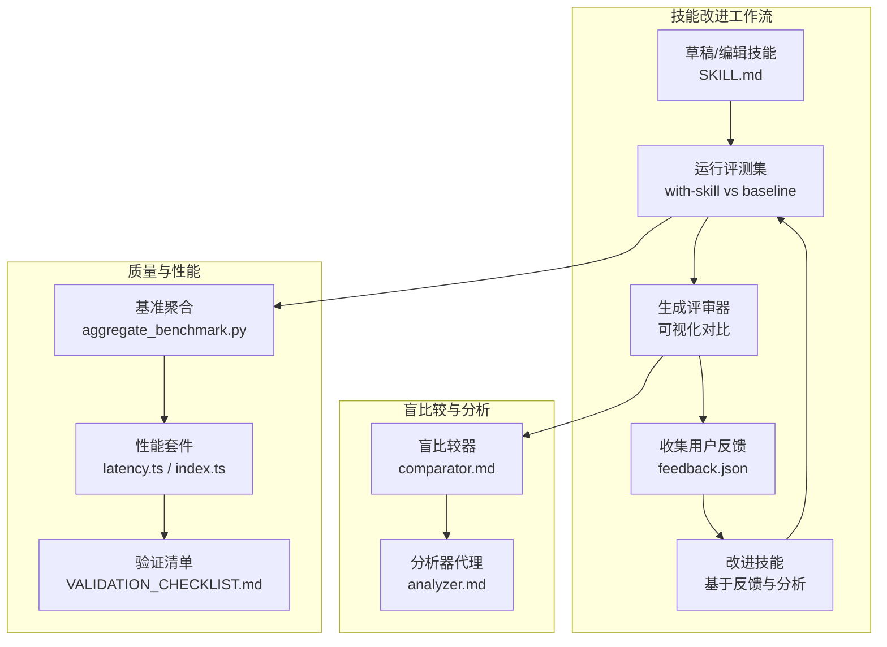
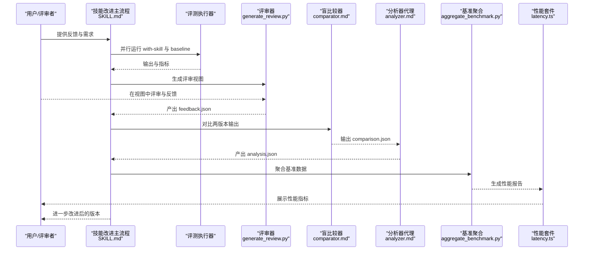
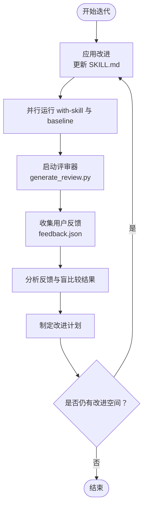
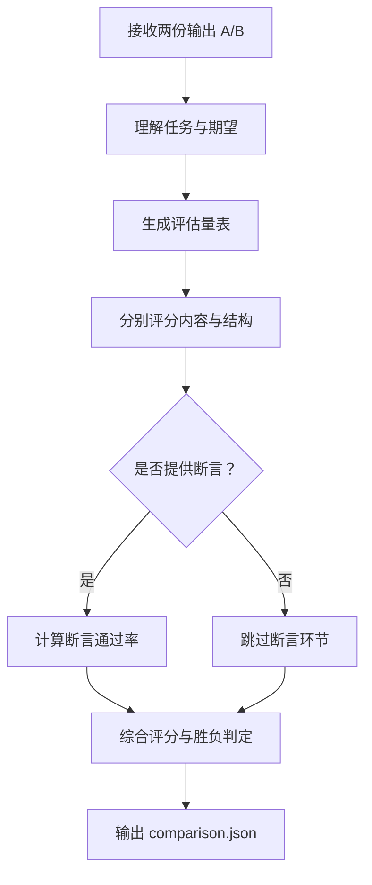
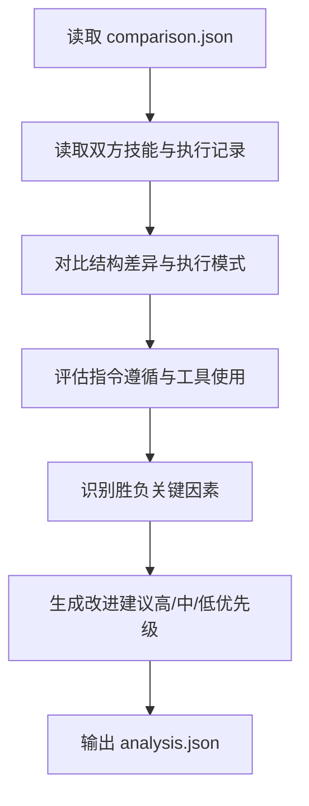
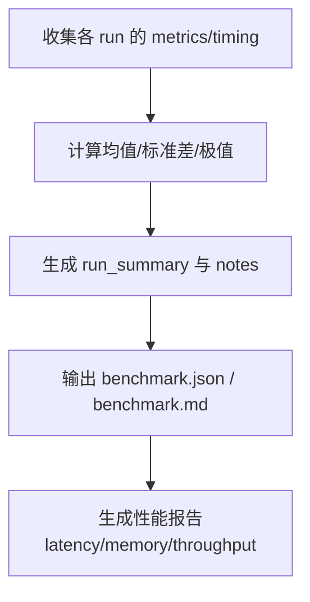
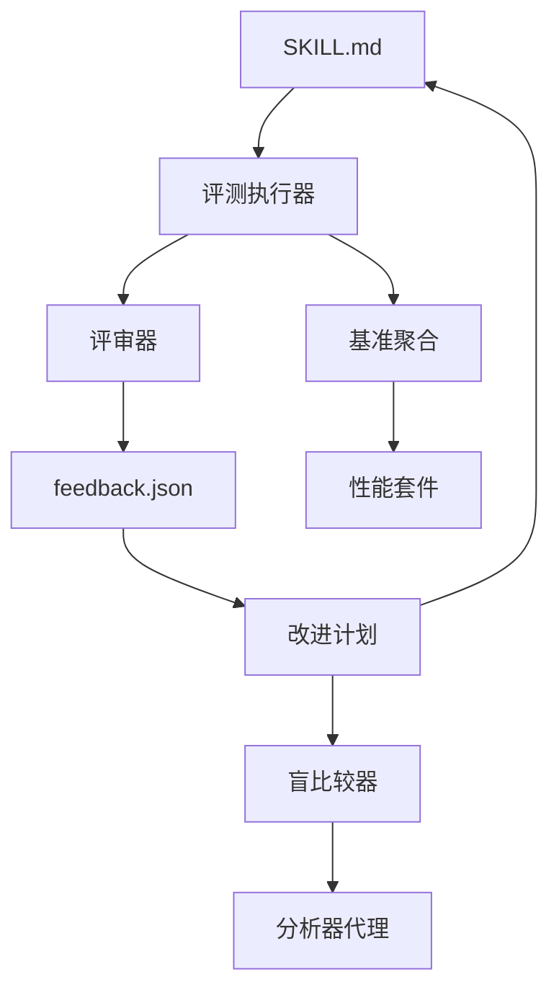

# 改进迭代循环

<cite>
**本文引用的文件**
- [SKILL.md](file://skills/daoSkilLs/skills/anthropics-skills/skills/skill-creator/SKILL.md)
- [comparator.md](file://skills/daoSkilLs/skills/anthropics-skills/skills/skill-creator/agents/comparator.md)
- [analyzer.md](file://skills/daoSkilLs/skills/anthropics-skills/skills/skill-creator/agents/analyzer.md)
- [schemas.md](file://skills/daoSkilLs/skills/anthropics-skills/skills/skill-creator/references/schemas.md)
- [aggregate_benchmark.py](file://skills/daoSkilLs/skills/anthropics-skills/skills/skill-creator/scripts/aggregate_benchmark.py)
- [VALIDATION_CHECKLIST.md](file://apps/AgentPit/VALIDATION_CHECKLIST.md)
- [checklist.md](file://apps/DaoMind/.trae/specs/comprehensive-testing/checklist.md)
- [checklist.md](file://apps/DaoMind/.trae/specs/agentpit-performance-cd/checklist.md)
- [checklist.md](file://apps/DaoMind/.trae/specs/agentpit-production-readiness/checklist.md)
- [latency.ts](file://apps/DaoMind/packages/daoBenchmark/src/suites/latency.ts)
- [index.ts](file://apps/DaoMind/packages/daoBenchmark/src/index.ts)
- [wu-wei-verification.ts](file://apps/DaoMind/packages/daoVerify/src/checks/wu-wei-verification.ts)
- [reporter.ts](file://apps/DaoMind/packages/daoVerify/src/reporter.ts)
- [perf_remote_bench.py](file://tools/flexloop/tests/testing/perf_remote_bench.py)
- [execution-flow.md](file://skills/daoSkilLs/skills/task-execution-summary/references/execution-flow.md)
</cite>

## 目录
1. [简介](#简介)
2. [项目结构](#项目结构)
3. [核心组件](#核心组件)
4. [架构总览](#架构总览)
5. [详细组件分析](#详细组件分析)
6. [依赖分析](#依赖分析)
7. [性能考量](#性能考量)
8. [故障排查指南](#故障排查指南)
9. [结论](#结论)
10. [附录](#附录)

## 简介
本指南围绕“技能改进迭代循环”展开，系统阐述五项改进思考原则与迭代步骤，并结合盲比较系统（comparator）与分析器代理（analyzer）的工作机制，给出可操作的实践流程、性能权衡与最终发布前的质量检查清单。目标是帮助读者在技能开发与优化过程中，形成稳定、可复现、可衡量的闭环改进方法。

## 项目结构
本指南聚焦于技能改进工作流与相关工具链，涉及以下关键模块：
- 技能改进主流程：从草稿到评测、评审、改进、再评测的循环
- 盲比较系统：独立对比两个版本输出，消除偏见
- 分析器代理：解读盲比较结果，提取改进要点
- 质量与性能保障：基准聚合、性能指标、验证清单与回归测试

图表来源
- [SKILL.md:167-251](file://skills/daoSkilLs/skills/anthropics-skills/skills/skill-creator/SKILL.md#L167-L251)
- [comparator.md:1-192](file://skills/daoSkilLs/skills/anthropics-skills/skills/skill-creator/agents/comparator.md#L1-L192)
- [analyzer.md:1-275](file://skills/daoSkilLs/skills/anthropics-skills/skills/skill-creator/agents/analyzer.md#L1-L275)
- [aggregate_benchmark.py:373-401](file://skills/daoSkilLs/skills/anthropics-skills/skills/skill-creator/scripts/aggregate_benchmark.py#L373-L401)
- [latency.ts:76-96](file://apps/DaoMind/packages/daoBenchmark/src/suites/latency.ts#L76-L96)
- [index.ts:1-16](file://apps/DaoMind/packages/daoBenchmark/src/index.ts#L1-L16)
- [VALIDATION_CHECKLIST.md:1-487](file://apps/AgentPit/VALIDATION_CHECKLIST.md#L1-L487)

章节来源
- [SKILL.md:167-251](file://skills/daoSkilLs/skills/anthropics-skills/skills/skill-creator/SKILL.md#L167-L251)

## 核心组件
- 技能改进主流程：包含评测、评审、反馈、改进与再评测的循环，强调“先并行运行 with-skill 与 baseline，再统一评审”的设计。
- 盲比较系统：独立对比两份输出，依据内容与结构双维度评分，确保客观性。
- 分析器代理：在“解盲”后，对比技能与执行记录，提炼改进建议，聚焦可操作性与因果关系。
- 基准聚合与性能套件：提供统计摘要、差异分析与性能指标，支撑决策与回归检测。
- 质量与验证清单：覆盖环境、构建、运行、功能、健康检查、性能、安全、日志等维度，确保发布前质量门禁。

章节来源
- [SKILL.md:296-322](file://skills/daoSkilLs/skills/anthropics-skills/skills/skill-creator/SKILL.md#L296-L322)
- [comparator.md:37-86](file://skills/daoSkilLs/skills/anthropics-skills/skills/skill-creator/agents/comparator.md#L37-L86)
- [analyzer.md:187-275](file://skills/daoSkilLs/skills/anthropics-skills/skills/skill-creator/agents/analyzer.md#L187-L275)
- [aggregate_benchmark.py:373-401](file://skills/daoSkilLs/skills/anthropics-skills/skills/skill-creator/scripts/aggregate_benchmark.py#L373-L401)
- [latency.ts:76-96](file://apps/DaoMind/packages/daoBenchmark/src/suites/latency.ts#L76-L96)
- [VALIDATION_CHECKLIST.md:1-487](file://apps/AgentPit/VALIDATION_CHECKLIST.md#L1-L487)

## 架构总览
改进迭代循环的端到端流程如下：

图表来源
- [SKILL.md:167-251](file://skills/daoSkilLs/skills/anthropics-skills/skills/skill-creator/SKILL.md#L167-L251)
- [comparator.md:1-192](file://skills/daoSkilLs/skills/anthropics-skills/skills/skill-creator/agents/comparator.md#L1-L192)
- [analyzer.md:1-275](file://skills/daoSkilLs/skills/anthropics-skills/skills/skill-creator/agents/analyzer.md#L1-L275)
- [aggregate_benchmark.py:373-401](file://skills/daoSkilLs/skills/anthropics-skills/skills/skill-creator/scripts/aggregate_benchmark.py#L373-L401)
- [latency.ts:76-96](file://apps/DaoMind/packages/daoBenchmark/src/suites/latency.ts#L76-L96)

## 详细组件分析

### 五项改进思考原则
- 从反馈中概括：聚焦用户反馈中的具体问题与期望，避免泛泛而谈。优先关注“哪里做得不够好”和“为什么不够好”，并将其转化为可验证的断言或指标。
- 保持提示简洁：去除冗余指令，保留关键步骤与边界条件。通过“解释为什么”而非“强制必须做”来提升模型理解与执行的一致性。
- 解释原因：在技能说明中明确“为什么需要这个步骤”“为什么这样设计”，帮助模型在面对变体输入时也能做出正确选择。
- 寻找重复工作：通过审阅执行记录与脚本，识别可复用的工具、模板与流程，将其沉淀为技能内的脚本或参考文件，降低未来调用成本。
- 迭代优化策略：以“最小可行改动”推动改进，每次迭代只改变一个变量，便于定位因果关系；同时记录版本历史与改进动机，便于回溯与复现。

章节来源
- [SKILL.md:296-322](file://skills/daoSkilLs/skills/anthropics-skills/skills/skill-creator/SKILL.md#L296-L322)

### 迭代循环步骤详解
- 应用改进：在 SKILL.md 中落实分析与反馈得到的改进点，确保措辞清晰、步骤可执行、示例可复现。
- 重新运行测试：在同一轮迭代中并行运行 with-skill 与 baseline，确保对比公平且可复现。
- 启动查看器：使用评审器生成可视化界面，支持用户逐条评审与提交反馈。
- 等待用户反馈：在评审器中收集反馈，包括主观评价与客观断言结果。
- 读取反馈数据：解析 feedback.json，提取关键问题与改进方向，进入下一轮迭代。

图表来源
- [SKILL.md:308-322](file://skills/daoSkilLs/skills/anthropics-skills/skills/skill-creator/SKILL.md#L308-L322)
- [schemas.md:86-160](file://skills/daoSkilLs/skills/anthropics-skills/skills/skill-creator/references/schemas.md#L86-L160)

章节来源
- [SKILL.md:167-251](file://skills/daoSkilLs/skills/anthropics-skills/skills/skill-creator/SKILL.md#L167-L251)
- [schemas.md:86-160](file://skills/daoSkilLs/skills/anthropics-skills/skills/skill-creator/references/schemas.md#L86-L160)

### 盲比较系统（comparator）使用场景与流程
- 使用场景：当用户质疑“新版本是否真的更好”时，引入盲比较系统，避免主观偏见影响判断。
- 评估维度：内容（正确性、完整性、准确性）与结构（组织性、格式、可用性），并可结合断言通过率作为辅助证据。
- 输出结构：包含胜负判定、评分明细、优缺点总结与断言结果，便于进一步分析。

图表来源
- [comparator.md:37-86](file://skills/daoSkilLs/skills/anthropics-skills/skills/skill-creator/agents/comparator.md#L37-L86)
- [schemas.md:309-380](file://skills/daoSkilLs/skills/anthropics-skills/skills/skill-creator/references/schemas.md#L309-L380)

章节来源
- [comparator.md:1-192](file://skills/daoSkilLs/skills/anthropics-skills/skills/skill-creator/agents/comparator.md#L1-L192)
- [schemas.md:309-380](file://skills/daoSkilLs/skills/anthropics-skills/skills/skill-creator/references/schemas.md#L309-L380)

### 分析器代理（analyzer）分析要点
- 解盲对比：读取盲比较结果，明确胜负方与理由，结合技能与执行记录进行因果分析。
- 结构差异：对比技能指令清晰度、工具使用模式、示例覆盖与边缘处理，定位差距来源。
- 执行模式：评估双方指令遵循度、工具使用差异、错误处理与恢复尝试，量化行为偏差。
- 改进建议：按优先级提出具体建议，涵盖指令、工具、示例、错误处理与结构重组，确保建议可落地。

图表来源
- [analyzer.md:21-89](file://skills/daoSkilLs/skills/anthropics-skills/skills/skill-creator/agents/analyzer.md#L21-L89)
- [schemas.md:384-430](file://skills/daoSkilLs/skills/anthropics-skills/skills/skill-creator/references/schemas.md#L384-L430)

章节来源
- [analyzer.md:1-275](file://skills/daoSkilLs/skills/anthropics-skills/skills/skill-creator/agents/analyzer.md#L1-L275)
- [schemas.md:384-430](file://skills/daoSkilLs/skills/anthropics-skills/skills/skill-creator/references/schemas.md#L384-L430)

### 基准聚合与性能分析
- 基准聚合：对 with-skill 与 baseline 的 pass 率、耗时与 token 使用进行统计，输出 benchmark.json 与 benchmark.md，并计算均值、标准差与差异。
- 性能套件：提供启动时间、内存基线、吞吐、反馈延迟与收敛时间等指标，支撑性能回归检测与发布门禁。

图表来源
- [aggregate_benchmark.py:373-401](file://skills/daoSkilLs/skills/anthropics-skills/skills/skill-creator/scripts/aggregate_benchmark.py#L373-L401)
- [latency.ts:76-96](file://apps/DaoMind/packages/daoBenchmark/src/suites/latency.ts#L76-L96)
- [index.ts:1-16](file://apps/DaoMind/packages/daoBenchmark/src/index.ts#L1-L16)

章节来源
- [aggregate_benchmark.py:373-401](file://skills/daoSkilLs/skills/anthropics-skills/skills/skill-creator/scripts/aggregate_benchmark.py#L373-L401)
- [latency.ts:76-96](file://apps/DaoMind/packages/daoBenchmark/src/suites/latency.ts#L76-L96)
- [index.ts:1-16](file://apps/DaoMind/packages/daoBenchmark/src/index.ts#L1-L16)

### 实际改进案例（基于仓库实践）
- 案例背景：某技能在“文档处理”场景中，用户反馈输出格式不一致、字段缺失。
- 改进过程：
  - 从反馈中概括：聚焦“字段缺失”“格式不一致”两类问题。
  - 保持提示简洁：删除冗余步骤，明确“先提取、再校验、后输出”的三步法。
  - 解释原因：在技能说明中解释为何需要校验与模板化输出。
  - 寻找重复工作：发现多个评测用例都在重复编写校验脚本，将其沉淀为技能内脚本。
  - 迭代优化：以最小改动推进，记录版本历史与改进动机。
- 盲比较与分析：使用盲比较器对比改进前后版本，分析器代理指出“校验脚本提升了稳定性，但示例覆盖不足导致边缘场景仍不稳定”，据此补充边缘用例。

章节来源
- [SKILL.md:296-322](file://skills/daoSkilLs/skills/anthropics-skills/skills/skill-creator/SKILL.md#L296-L322)
- [comparator.md:37-86](file://skills/daoSkilLs/skills/anthropics-skills/skills/skill-creator/agents/comparator.md#L37-L86)
- [analyzer.md:187-275](file://skills/daoSkilLs/skills/anthropics-skills/skills/skill-creator/agents/analyzer.md#L187-L275)

## 依赖分析
- 组件耦合与协作：
  - SKILL.md 是核心入口，驱动评测、评审与改进。
  - 评测执行器与评审器共同产出 feedback.json，驱动后续改进。
  - 盲比较器与分析器代理提供客观视角，避免主观偏见。
  - 基准聚合与性能套件为决策提供数据支持。
- 外部依赖与集成点：
  - 评审器依赖 benchmark.json 的字段结构，需严格遵循 schema。
  - 性能套件通过统一导出接口暴露指标，便于集成到发布流程。

图表来源
- [SKILL.md:167-251](file://skills/daoSkilLs/skills/anthropics-skills/skills/skill-creator/SKILL.md#L167-L251)
- [schemas.md:219-306](file://skills/daoSkilLs/skills/anthropics-skills/skills/skill-creator/references/schemas.md#L219-L306)
- [index.ts:1-16](file://apps/DaoMind/packages/daoBenchmark/src/index.ts#L1-L16)

章节来源
- [schemas.md:219-306](file://skills/daoSkilLs/skills/anthropics-skills/skills/skill-creator/references/schemas.md#L219-L306)

## 性能考量
- 性能回归检测：通过性能套件与基准聚合，持续监控 pass 率、耗时与 token 使用的变化，及时发现回归。
- 资源使用权衡：在提升质量的同时，关注工具调用次数、输出体积与执行时间，避免过度工程化导致性能劣化。
- 发布门禁：将性能指标纳入质量检查清单，确保上线前满足阈值要求。

章节来源
- [perf_remote_bench.py:632-665](file://tools/flexloop/tests/testing/perf_remote_bench.py#L632-L665)
- [latency.ts:76-96](file://apps/DaoMind/packages/daoBenchmark/src/suites/latency.ts#L76-L96)
- [checklist.md:1-32](file://apps/DaoMind/.trae/specs/agentpit-performance-cd/checklist.md#L1-L32)

## 故障排查指南
- 评审器无法启动或空白：检查评审器生成参数与 benchmark.json 字段是否符合 schema。
- 盲比较结果异常：核对 comparator 的输入路径与任务描述，确保输出结构完整。
- 性能指标异常：检查性能套件配置与采集数据，确认是否存在外部环境波动。
- 验证清单未通过：对照清单逐项检查，重点关注健康检查、缓存策略与安全响应头。

章节来源
- [schemas.md:219-306](file://skills/daoSkilLs/skills/anthropics-skills/skills/skill-creator/references/schemas.md#L219-L306)
- [VALIDATION_CHECKLIST.md:206-240](file://apps/AgentPit/VALIDATION_CHECKLIST.md#L206-L240)

## 结论
通过将“从反馈中概括、保持提示简洁、解释原因、寻找重复工作、迭代优化策略”五项原则融入技能改进循环，并借助盲比较系统与分析器代理提供客观视角，辅以基准聚合与性能套件的数据支持，可以形成稳定、可复现、可衡量的改进闭环。配合严格的验证清单与回归测试，确保每次迭代都能在质量与性能之间取得平衡，最终达成高质量、可维护的技能产品。

## 附录

### 最终发布前质量检查清单
- 环境与构建
  - 软件依赖版本满足要求，构建无错误或警告，镜像大小与标签规范。
- 运行与功能
  - 容器健康检查通过，端口映射正确，页面可访问且无 404。
  - SPA 路由 fallback 正常，静态资源加载与缓存策略有效。
- 性能与安全
  - 压缩与缓存生效，加载速度与首屏渲染时间达标。
  - 安全响应头与容器安全配置到位，日志持久化与轮转正常。
- 测试与验证
  - 全面测试验证清单通过，性能测试报告生成并满足阈值。
  - 回归测试矩阵覆盖关键路径，缺陷分类与优先级清晰。

章节来源
- [VALIDATION_CHECKLIST.md:1-487](file://apps/AgentPit/VALIDATION_CHECKLIST.md#L1-L487)
- [checklist.md:1-16](file://apps/DaoMind/.trae/specs/comprehensive-testing/checklist.md#L1-L16)
- [checklist.md:1-32](file://apps/DaoMind/.trae/specs/agentpit-performance-cd/checklist.md#L1-L32)
- [checklist.md:91-153](file://apps/DaoMind/.trae/specs/agentpit-production-readiness/checklist.md#L91-L153)

### 质量门禁与验证工具
- 无为验证：检查事件驱动、避免直接命令式调用、根节点精简等原则，输出评分与建议。
- 验证报告器：汇总各类验证检查结果，生成加权总分与报告。

章节来源
- [wu-wei-verification.ts:115-130](file://apps/DaoMind/packages/daoVerify/src/checks/wu-wei-verification.ts#L115-L130)
- [reporter.ts:65-94](file://apps/DaoMind/packages/daoVerify/src/reporter.ts#L65-L94)

### 执行流程与质量检查
- 执行流程：从草稿到最终响应的结构完整性验证、内容准确性抽检与最终组装。
- 质量检查：章节齐全、表格格式正确、标题层级连续、建议可操作等。

章节来源
- [execution-flow.md:1336-1401](file://skills/daoSkilLs/skills/task-execution-summary/references/execution-flow.md#L1336-L1401)