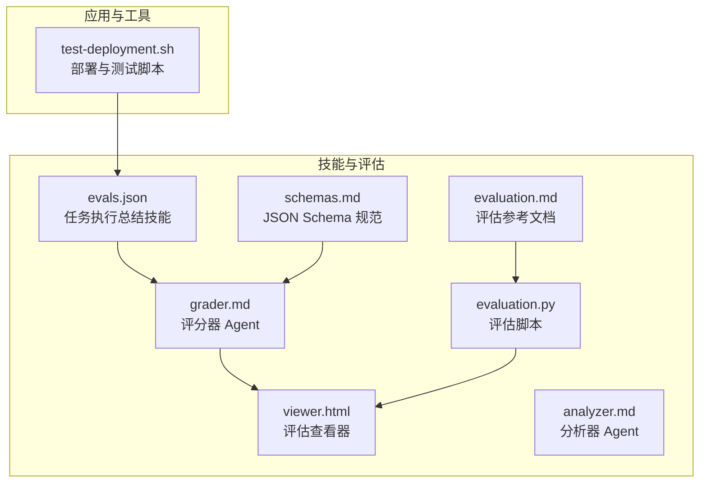
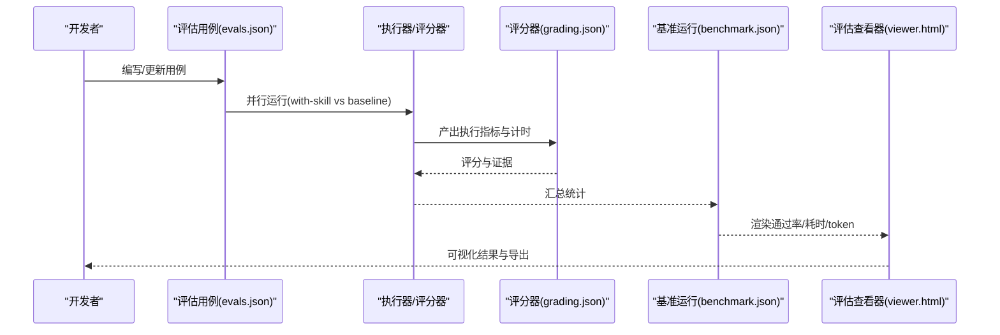
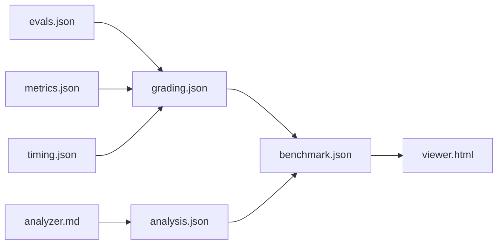

# 测试评估阶段

<cite>
**本文引用的文件**
- [evals.json](file://skills/daoSkilLs/skills/task-execution-summary/evals/evals.json)
- [schemas.md](file://skills/daoSkilLs/skills/anthropics-skills/skills/skill-creator/references/schemas.md)
- [viewer.html](file://skills/daoSkilLs/skills/anthropics-skills/skills/skill-creator/eval-viewer/viewer.html)
- [grader.md](file://skills/daoSkilLs/skills/anthropics-skills/skills/skill-creator/agents/grader.md)
- [analyzer.md](file://skills/daoSkilLs/skills/anthropics-skills/skills/skill-creator/agents/analyzer.md)
- [evaluation.py](file://skills/daoSkilLs/skills/anthropics-skills/skills/mcp-builder/scripts/evaluation.py)
- [evaluation.md](file://skills/daoSkilLs/skills/anthropics-skills/skills/mcp-builder/reference/evaluation.md)
- [test-deployment.sh](file://apps/AgentPit/test-deployment.sh)
</cite>

## 目录
1. [引言](#引言)
2. [项目结构](#项目结构)
3. [核心组件](#核心组件)
4. [架构总览](#架构总览)
5. [详细组件分析](#详细组件分析)
6. [依赖关系分析](#依赖关系分析)
7. [性能考量](#性能考量)
8. [故障排查指南](#故障排查指南)
9. [结论](#结论)
10. [附录](#附录)

## 引言
本指南面向测试评估阶段的质量保证体系落地，围绕以下目标展开：
- 明确测试用例设计的三大真实场景原则，并结合仓库中的任务执行总结技能样例进行说明；
- 全面解析 evals.json 的结构与 schema 规范，确保用例定义一致性；
- 给出并行运行策略（with-skill 与 baseline 对比）与运行时数据捕获（tokens 与 duration）方法；
- 详述 grading.json 的生成流程与字段语义；
- 提供基准聚合脚本的使用方法、分析器代理的作用与评估查看器的启动流程；
- 给出命令行示例、反馈收集机制与结果解读方法，帮助团队建立系统化的质量评估闭环。

## 项目结构
本仓库在 skills/daoSkilLs 下提供了完整的评估工具链与样例：
- 任务执行总结技能的 evals.json 定义了四个真实场景的测试用例；
- anthropics-skills 技能套件提供了评估、打分、基准、盲比较与分析的 JSON Schema 与工作流；
- mcp-builder 提供了评估脚本与参考文档，演示如何采集 tokens 与 duration；
- AgentPit 提供了部署与测试脚本，便于在集成环境中验证评估流程。

**图表来源**
- [evals.json](file://skills/daoSkilLs/skills/task-execution-summary/evals/evals.json)
- [schemas.md](file://skills/daoSkilLs/skills/anthropics-skills/skills/skill-creator/references/schemas.md)
- [viewer.html](file://skills/daoSkilLs/skills/anthropics-skills/skills/skill-creator/eval-viewer/viewer.html)
- [grader.md](file://skills/daoSkilLs/skills/anthropics-skills/skills/skill-creator/agents/grader.md)
- [analyzer.md](file://skills/daoSkilLs/skills/anthropics-skills/skills/skill-creator/agents/analyzer.md)
- [evaluation.py](file://skills/daoSkilLs/skills/anthropics-skills/skills/mcp-builder/scripts/evaluation.py)
- [evaluation.md](file://skills/daoSkilLs/skills/anthropics-skills/skills/mcp-builder/reference/evaluation.md)
- [test-deployment.sh](file://apps/AgentPit/test-deployment.sh)

**章节来源**
- [evals.json](file://skills/daoSkilLs/skills/task-execution-summary/evals/evals.json)
- [schemas.md](file://skills/daoSkilLs/skills/anthropics-skills/skills/skill-creator/references/schemas.md)
- [viewer.html](file://skills/daoSkilLs/skills/anthropics-skills/skills/skill-creator/eval-viewer/viewer.html)
- [grader.md](file://skills/daoSkilLs/skills/anthropics-skills/skills/skill-creator/agents/grader.md)
- [analyzer.md](file://skills/daoSkilLs/skills/anthropics-skills/skills/skill-creator/agents/analyzer.md)
- [evaluation.py](file://skills/daoSkilLs/skills/anthropics-skills/skills/mcp-builder/scripts/evaluation.py)
- [evaluation.md](file://skills/daoSkilLs/skills/anthropics-skills/skills/mcp-builder/reference/evaluation.md)
- [test-deployment.sh](file://apps/AgentPit/test-deployment.sh)

## 核心组件
- 评估用例定义：evals.json，包含技能名、版本、创建日期、描述以及多个测试用例的 id、名称、类别、难度、提示词、期望输出与断言集合。
- 评分器：根据执行产物与断言生成 grading.json，包含期望项逐条判定、摘要统计、执行指标与计时信息。
- 基准运行：以 with-skill 与 without-skill（baseline）并行运行，产出 benchmark.json，包含每项评估的通过率、耗时、token 使用与统计摘要。
- 评估查看器：渲染 benchmark.json，按配置分组显示通过率、时间与 token 的均值与方差，并支持导出。
- 分析器代理：对盲比较结果进行后置分析，提取胜负原因、指令遵循差异与改进建议。
- 评估脚本：采集单次任务的响应、评分、耗时与工具调用次数，形成评估报告。

**章节来源**
- [evals.json](file://skills/daoSkilLs/skills/task-execution-summary/evals/evals.json)
- [schemas.md](file://skills/daoSkilLs/skills/anthropics-skills/skills/skill-creator/references/schemas.md)
- [grader.md](file://skills/daoSkilLs/skills/anthropics-skills/skills/skill-creator/agents/grader.md)
- [analyzer.md](file://skills/daoSkilLs/skills/anthropics-skills/skills/skill-creator/agents/analyzer.md)
- [evaluation.py](file://skills/daoSkilLs/skills/anthropics-skills/skills/mcp-builder/scripts/evaluation.py)

## 架构总览
下图展示了从用例定义到结果呈现的完整评估流水线：

**图表来源**
- [evals.json](file://skills/daoSkilLs/skills/task-execution-summary/evals/evals.json)
- [schemas.md](file://skills/daoSkilLs/skills/anthropics-skills/skills/skill-creator/references/schemas.md)
- [viewer.html](file://skills/daoSkilLs/skills/anthropics-skills/skills/skill-creator/eval-viewer/viewer.html)
- [grader.md](file://skills/daoSkilLs/skills/anthropics-skills/skills/skill-creator/agents/grader.md)

## 详细组件分析

### 测试用例设计的三大真实场景原则
基于任务执行总结技能的四个用例，可归纳如下三大原则：
- 场景真实性：用例来源于真实业务与技术实践，如软件开发、项目管理、故障排查与学习成长，确保评估内容贴近实际工作。
- 结构完整性：每个用例包含任务背景、时间线、关键决策、问题与解决方案、量化成果与改进建议等要素，便于生成结构化报告。
- 断言可验证性：断言覆盖关键元素与格式要求，如必须出现的关键词、表格数量与结构、量化指标等，确保结果可客观判定。

参考样例用例（软件开发、Sprint 复盘、故障排查、学习总结）体现了上述原则，可作为其他技能评估用例设计的模板。

**章节来源**
- [evals.json](file://skills/daoSkilLs/skills/task-execution-summary/evals/evals.json)

### evals.json 的结构与 schema 规范
- 必填字段
  - skill_name：技能名称，需与技能 frontmatter 一致。
  - evals[]：用例数组，每个用例包含：
    - id：唯一整数标识；
    - name：用例名称（用于目录与查看器标题）；
    - category：用例类别（如“软件开发”、“项目管理”等）；
    - difficulty：难度等级（如“中等”、“较高”、“高”）；
    - prompt：用户任务提示词；
    - expected_output：成功预期的描述性说明；
    - assertions[]：断言列表，包含断言名称、描述、类型与期望值；
    - files[]：可选输入文件路径（相对技能根目录）。
- 断言类型
  - 文本包含类（text_inclusion）：检查关键词是否出现；
  - 结构检查类（structure_check）：检查表格、Markdown 格式等结构；
  - 计数检查类（count_check）：统计关键词出现次数；
  - 自定义逻辑类：由具体技能定义。

注意：当断言已存在于 evals.json 中时，应在迭代过程中及时评审与解释，以便在查看器中清晰呈现。

**章节来源**
- [schemas.md](file://skills/daoSkilLs/skills/anthropics-skills/skills/skill-creator/references/schemas.md)
- [evals.json](file://skills/daoSkilLs/skills/task-execution-summary/evals/evals.json)

### 并行运行策略（with-skill 与 baseline 对比）
- 运行模式
  - with-skill：启用目标技能，评估技能带来的增益；
  - without-skill（baseline）：禁用技能，作为对照基线；
  - 迭代策略：每次改进后，重新运行所有用例至新的 iteration-N/ 目录，保留 baseline 与新版本对比。
- 分组与颜色编码
  - 查看器通过 configuration 字段识别“with_skill”与“without_skill”，并分别着色与分组展示，便于直观对比。

**章节来源**
- [schemas.md](file://skills/daoSkilLs/skills/anthropics-skills/skills/skill-creator/references/schemas.md)
- [viewer.html](file://skills/daoSkilLs/skills/anthropics-skills/skills/skill-creator/eval-viewer/viewer.html)

### 运行时数据捕获（tokens 与 duration）
- timing.json
  - 包含 wall clock 计时：executor_duration_seconds、grader_duration_seconds、total_duration_seconds；
  - 包含 token 数量：total_tokens；
  - 关键点：当子任务完成后，通知中会携带 total_tokens 与 duration_ms，需立即保存，否则无法恢复。
- metrics.json
  - 包含工具调用统计、总步数、输出字符数、转录字符数等；
  - 输出字符数可作为 token 的近似代理。
- evaluation.py
  - 在单任务评估中，记录总耗时与工具调用次数，形成评估报告；
  - 参考输出包括准确率、平均耗时、平均工具调用数与 per-task 结果明细。

**章节来源**
- [schemas.md](file://skills/daoSkilLs/skills/anthropics-skills/skills/skill-creator/references/schemas.md)
- [evaluation.py](file://skills/daoSkilLs/skills/anthropics-skills/skills/mcp-builder/scripts/evaluation.py)
- [evaluation.md](file://skills/daoSkilLs/skills/anthropics-skills/skills/mcp-builder/reference/evaluation.md)

### grading.json 的生成过程与字段语义
- 生成来源：评分器根据执行产物与断言生成，位于运行目录下的 grading.json。
- 关键字段
  - expectations[]：逐条断言的判定与证据；
  - summary：通过/失败/总数与通过率；
  - execution_metrics：来自 metrics.json 的工具调用、总步数、输出字符数、转录字符数；
  - timing：来自 timing.json 的 wall clock 时间；
  - claims：从输出中抽取并验证的事实/流程/质量声明；
  - user_notes_summary：执行器标注的不确定性、需人工复核与临时规避措施；
  - eval_feedback：针对用例断言的改进建议（仅在必要时出现）。

**章节来源**
- [grader.md](file://skills/daoSkilLs/skills/anthropics-skills/skills/skill-creator/agents/grader.md)
- [schemas.md](file://skills/daoSkilLs/skills/anthropics-skills/skills/skill-creator/references/schemas.md)

### 基准聚合脚本的使用方法
- 作用：对多次 with-skill 与 without-skill 运行进行统计汇总，生成 benchmark.json，包含均值、标准差、最小/最大值与 delta。
- 输入：runs[] 中的 result 字段需包含 pass_rate、passed、failed、total、time_seconds、tokens、errors 等；
- 输出：run_summary 中按配置分组统计，delta 展示增益或劣化幅度；
- 使用建议：确保 runs_per_configuration 设置正确，evals_run 列表与实际运行一致。

**章节来源**
- [schemas.md](file://skills/daoSkilLs/skills/anthropics-skills/skills/skill-creator/references/schemas.md)

### 分析器代理的作用
- 盲比较后置分析：读取盲比较结果与双方技能/执行转录，分析胜负原因与指令遵循差异；
- 输出：analysis.json，包含胜负摘要、双方优势/劣势、指令遵循评分、改进建议与执行模式洞察；
- 指导价值：聚焦可迁移的技能层面改进，而非对代理行为的主观评价。

**章节来源**
- [analyzer.md](file://skills/daoSkilLs/skills/anthropics-skills/skills/skill-creator/agents/analyzer.md)
- [schemas.md](file://skills/daoSkilLs/skills/anthropics-skills/skills/skill-creator/references/schemas.md)

### 评估查看器的启动流程
- 文件：viewer.html
- 功能：读取 benchmark.json，按配置分组渲染表格，显示通过率、时间与 token 的统计摘要；支持导出 Excel；
- 使用：将生成的 benchmark.json 放入查看器所在目录，直接在浏览器打开即可预览与导出。

**章节来源**
- [viewer.html](file://skills/daoSkilLs/skills/anthropics-skills/skills/skill-creator/eval-viewer/viewer.html)
- [schemas.md](file://skills/daoSkilLs/skills/anthropics-skills/skills/skill-creator/references/schemas.md)

### 实际命令行示例与反馈收集机制
- 评估脚本示例（mcp-builder）
  - 创建评估文件（XML）后，安装依赖并运行评估脚本，生成评估报告；
  - 参考命令行示例与输出字段，便于自动化集成。
- 反馈收集
  - 评分器在 eval_feedback 中提供针对断言的改进建议；
  - 分析器在 analysis.json 中给出技能层面的优先改进建议；
  - 结合查看器的可视化结果，形成“用例→执行→评分→分析→改进”的闭环。

**章节来源**
- [evaluation.md](file://skills/daoSkilLs/skills/anthropics-skills/skills/mcp-builder/reference/evaluation.md)
- [evaluation.py](file://skills/daoSkilLs/skills/anthropics-skills/skills/mcp-builder/scripts/evaluation.py)
- [grader.md](file://skills/daoSkilLs/skills/anthropics-skills/skills/skill-creator/agents/grader.md)
- [analyzer.md](file://skills/daoSkilLs/skills/anthropics-skills/skills/skill-creator/agents/analyzer.md)

### 结果解读方法
- 通过率变化：关注 with-skill 相较 baseline 的 pass_rate delta，判断技能增益；
- 性能指标：time_seconds 与 tokens 的均值与方差，辅助权衡质量与成本；
- 断言证据：逐条断言的通过情况与证据，定位具体问题；
- 统计摘要：查看 run_summary 的 mean/stddev/min/max，识别异常波动；
- 导出与复盘：导出 Excel 表格，结合 analysis.json 的建议制定改进计划。

**章节来源**
- [schemas.md](file://skills/daoSkilLs/skills/anthropics-skills/skills/skill-creator/references/schemas.md)
- [viewer.html](file://skills/daoSkilLs/skills/anthropics-skills/skills/skill-creator/eval-viewer/viewer.html)

## 依赖关系分析
- 低耦合高内聚：评估用例（evals.json）与评分器（grading.json）解耦，便于独立演进；
- 数据链路清晰：timing.json 与 metrics.json 为基准统计提供原始数据支撑；
- 工具链完整：从用例编写、执行评分、盲比较到后置分析，形成闭环。

**图表来源**
- [evals.json](file://skills/daoSkilLs/skills/task-execution-summary/evals/evals.json)
- [schemas.md](file://skills/daoSkilLs/skills/anthropics-skills/skills/skill-creator/references/schemas.md)
- [viewer.html](file://skills/daoSkilLs/skills/anthropics-skills/skills/skill-creator/eval-viewer/viewer.html)
- [analyzer.md](file://skills/daoSkilLs/skills/anthropics-skills/skills/skill-creator/agents/analyzer.md)

**章节来源**
- [schemas.md](file://skills/daoSkilLs/skills/anthropics-skills/skills/skill-creator/references/schemas.md)

## 性能考量
- 并发与稳定性：基准运行应固定 runs_per_configuration，避免过少导致统计不稳，过多导致资源压力；
- 指标选择：在 pass_rate 提升的同时，关注 time_seconds 与 tokens 的增长，防止“以牺牲性能换取微弱收益”；
- 数据完整性：严格遵循 timing.json 与 metrics.json 的字段命名与层级，避免查看器无法解析。

## 故障排查指南
- 用例未通过：检查 grading.json 中 expectations 的证据与断言类型，确认是否误判；
- 查看器空白：确认 benchmark.json 的字段命名与层级与 schema 一致（如 configuration、result、run_summary 等）；
- 评估脚本异常：核对 evaluation.py 的输出字段与 evaluation.md 的示例一致，确保总耗时与工具调用统计正确；
- 部署与测试：使用 test-deployment.sh 的日志与状态码，快速定位环境与依赖问题。

**章节来源**
- [viewer.html](file://skills/daoSkilLs/skills/anthropics-skills/skills/skill-creator/eval-viewer/viewer.html)
- [evaluation.md](file://skills/daoSkilLs/skills/anthropics-skills/skills/mcp-builder/reference/evaluation.md)
- [test-deployment.sh](file://apps/AgentPit/test-deployment.sh)

## 结论
通过规范的用例设计、严谨的并行对比、完善的运行时数据采集与结构化评分，结合评估查看器与分析器代理，团队可以建立起可重复、可度量、可改进的质量保证体系。建议在日常迭代中坚持“用例→执行→评分→分析→改进”的闭环流程，持续提升技能质量与交付稳定性。

## 附录
- 命令行示例（参考）
  - 评估脚本运行：参考 evaluation.md 中的示例命令与参数；
  - 评估查看器：将 benchmark.json 放入 viewer.html 所在目录后在浏览器打开；
  - 迭代流程：按照 skill-creator 的迭代步骤，先改进技能，再并行运行 with-skill 与 baseline，最后启动查看器审阅。

**章节来源**
- [evaluation.md](file://skills/daoSkilLs/skills/anthropics-skills/skills/mcp-builder/reference/evaluation.md)
- [viewer.html](file://skills/daoSkilLs/skills/anthropics-skills/skills/skill-creator/eval-viewer/viewer.html)
- [schemas.md](file://skills/daoSkilLs/skills/anthropics-skills/skills/skill-creator/references/schemas.md)