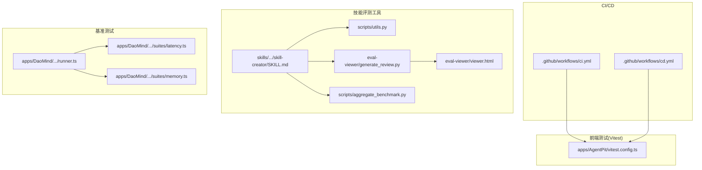
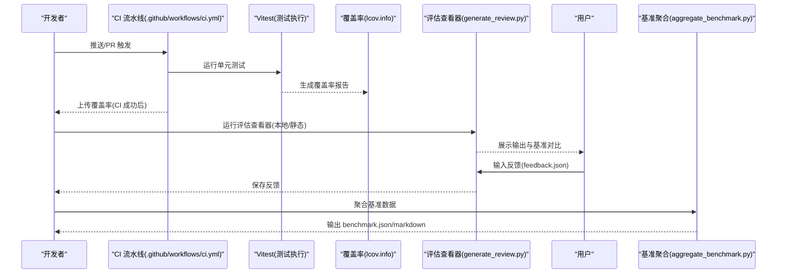
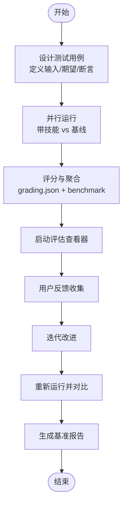
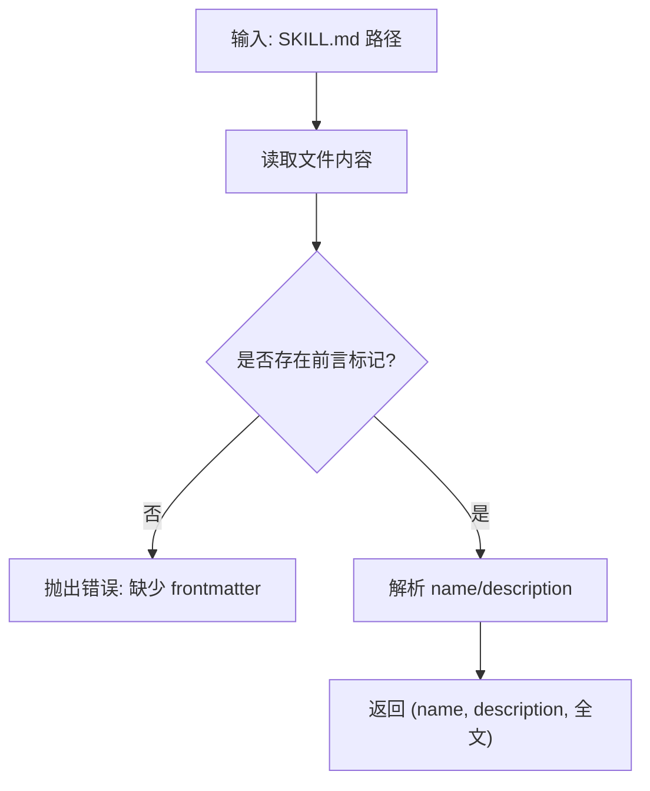
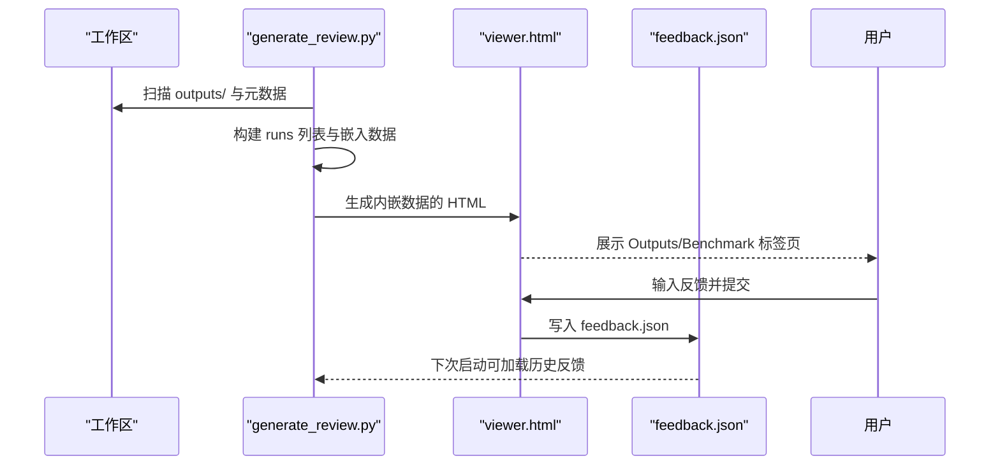
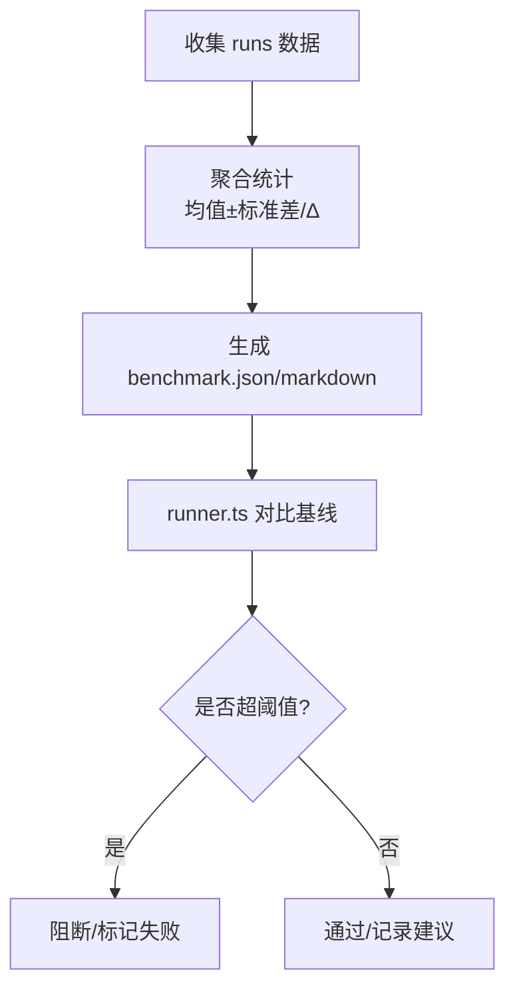
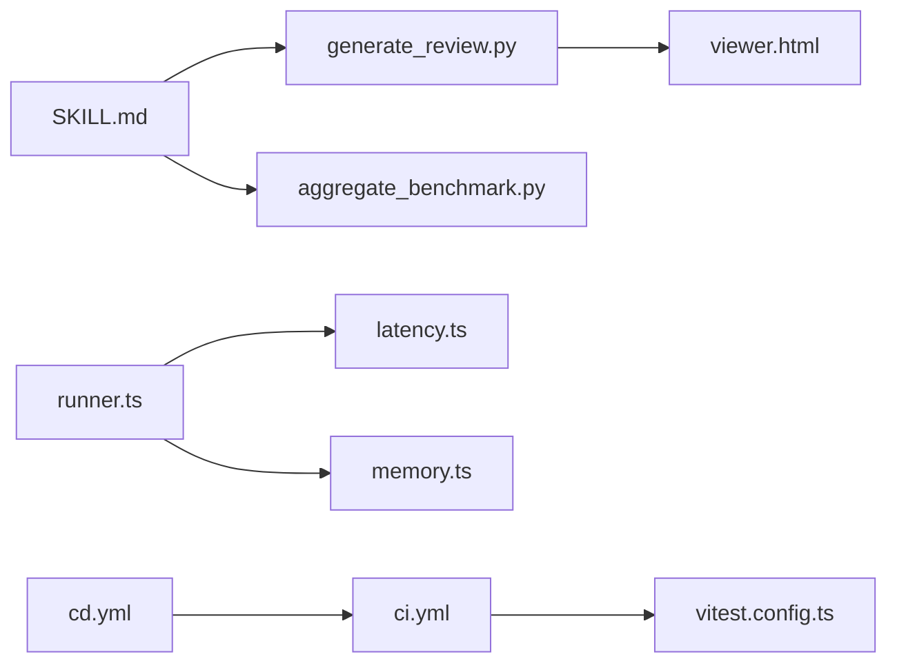

# 技能测试策略

<cite>
**本文档引用的文件**
- [ci.yml](file://.github/workflows/ci.yml)
- [cd.yml](file://.github/workflows/cd.yml)
- [ci-pipeline-optimization/spec.md](file://.trae/specs/ci-pipeline-optimization/spec.md)
- [ci-pipeline-optimization/tasks.md](file://.trae/specs/ci-pipeline-optimization/tasks.md)
- [vitest.config.ts](file://apps/AgentPit/vitest.config.ts)
- [utils.py](file://skills/daoSkilLs/skills/anthropics-skills/skills/skill-creator/scripts/utils.py)
- [SKILL.md](file://skills/daoSkilLs/skills/anthropics-skills/skills/skill-creator/SKILL.md)
- [generate_review.py](file://skills/daoSkilLs/skills/anthropics-skills/skills/skill-creator/eval-viewer/generate_review.py)
- [viewer.html](file://skills/daoSkilLs/skills/anthropics-skills/skills/skill-creator/eval-viewer/viewer.html)
- [aggregate_benchmark.py](file://skills/daoSkilLs/skills/anthropics-skills/skills/skill-creator/scripts/aggregate_benchmark.py)
- [runner.ts](file://apps/DaoMind/packages/daoBenchmark/src/runner.ts)
- [latency.ts](file://apps/DaoMind/packages/daoBenchmark/src/suites/latency.ts)
- [memory.ts](file://apps/DaoMind/packages/daoBenchmark/src/suites/memory.ts)
- [test_e2e.py](file://tools/DeepResearch/tests/e2e/test_e2e.py)
- [test_integration.py](file://tools/DeepResearch/tests/integration/test_integration.py)
- [concurrency_test.py](file://tools/DeepResearch/tests/performance/concurrency_test.py)
- [stability_test.py](file://tools/DeepResearch/tests/performance/stability_test.py)
- [testing_guidelines.md](file://tools/DeepResearch/tests/utils/testing_guidelines.md)
- [testing.md](file://tools/flexloop/testing.md)
- [TEST_SUMMARY.md](file://tools/flexloop/tests/testing/test_config_center/TEST_SUMMARY.md)
</cite>

## 目录
1. [引言](#引言)
2. [项目结构](#项目结构)
3. [核心组件](#核心组件)
4. [架构总览](#架构总览)
5. [详细组件分析](#详细组件分析)
6. [依赖关系分析](#依赖关系分析)
7. [性能考量](#性能考量)
8. [故障排查指南](#故障排查指南)
9. [结论](#结论)
10. [附录](#附录)

## 引言
本指南面向“技能测试策略”，围绕以下目标展开：系统化设计测试用例、自动化测试执行与结果验证、快速验证脚本的实现与使用、测试工具集（含 utils.py 辅助函数）的使用说明、评估查看器工作机制与用户反馈收集流程、测试覆盖率分析、回归测试策略与持续集成配置、最佳实践与常见问题解决方案。文档同时提供可视化图示帮助理解端到端流程。

## 项目结构
本仓库包含多个应用与工具模块，其中与测试策略直接相关的关键位置如下：
- GitHub Actions 工作流：CI/CD 流水线定义，覆盖 Node.js 版本、测试执行、覆盖率上传、构建产物与 Lighthouse 检查。
- Vitest 配置：前端应用的单元测试配置，含浏览器 API 模拟、覆盖率阈值与报告格式。
- 技能测试工具链：技能创建与评测的脚本、评估查看器、基准聚合工具。
- 基准测试包：DaoMind 包中的性能基准套件，提供延迟与内存测试。
- 工具链测试：DeepResearch 与 flexloop 的测试指南与样例。

**图表来源**
- [ci.yml:1-67](file://.github/workflows/ci.yml#L1-L67)
- [cd.yml:1-247](file://.github/workflows/cd.yml#L1-L247)
- [vitest.config.ts:1-48](file://apps/AgentPit/vitest.config.ts#L1-L48)
- [SKILL.md:1-486](file://skills/daoSkilLs/skills/anthropics-skills/skills/skill-creator/SKILL.md#L1-L486)
- [utils.py:1-48](file://skills/daoSkilLs/skills/anthropics-skills/skills/skill-creator/scripts/utils.py#L1-L48)
- [generate_review.py:1-472](file://skills/daoSkilLs/skills/anthropics-skills/skills/skill-creator/eval-viewer/generate_review.py#L1-L472)
- [viewer.html:545-578](file://skills/daoSkilLs/skills/anthropics-skills/skills/skill-creator/eval-viewer/viewer.html#L545-L578)
- [aggregate_benchmark.py:373-401](file://skills/daoSkilLs/skills/anthropics-skills/skills/skill-creator/scripts/aggregate_benchmark.py#L373-L401)
- [runner.ts:73-247](file://apps/DaoMind/packages/daoBenchmark/src/runner.ts#L73-L247)
- [latency.ts:76-96](file://apps/DaoMind/packages/daoBenchmark/src/suites/latency.ts#L76-L96)
- [memory.ts:45-69](file://apps/DaoMind/packages/daoBenchmark/src/suites/memory.ts#L45-L69)

**章节来源**
- [ci.yml:1-67](file://.github/workflows/ci.yml#L1-L67)
- [cd.yml:1-247](file://.github/workflows/cd.yml#L1-L247)
- [vitest.config.ts:1-48](file://apps/AgentPit/vitest.config.ts#L1-L48)

## 核心组件
- CI/CD 流水线：定义 Node.js 版本矩阵、测试与覆盖率上传、构建与制品上传、Lighthouse 检查等。
- Vitest 测试环境：jsdom 环境、全局 setupFiles、覆盖率报告格式与阈值。
- 技能评测工具链：SKILL.md 中的评测流程、generate_review.py 评估查看器、aggregate_benchmark.py 基准聚合。
- 基准测试套件：runner.ts 统计与报告生成，latency.ts 与 memory.ts 具体指标计算。
- 工具链测试指南：DeepResearch 与 flexloop 的测试规范与样例。

**章节来源**
- [ci.yml:10-67](file://.github/workflows/ci.yml#L10-L67)
- [cd.yml:136-208](file://.github/workflows/cd.yml#L136-L208)
- [vitest.config.ts:7-41](file://apps/AgentPit/vitest.config.ts#L7-L41)
- [SKILL.md:163-280](file://skills/daoSkilLs/skills/anthropics-skills/skills/skill-creator/SKILL.md#L163-L280)
- [generate_review.py:1-472](file://skills/daoSkilLs/skills/anthropics-skills/skills/skill-creator/eval-viewer/generate_review.py#L1-L472)
- [aggregate_benchmark.py:373-401](file://skills/daoSkilLs/skills/anthropics-skills/skills/skill-creator/scripts/aggregate_benchmark.py#L373-L401)
- [runner.ts:73-247](file://apps/DaoMind/packages/daoBenchmark/src/runner.ts#L73-L247)
- [latency.ts:76-96](file://apps/DaoMind/packages/daoBenchmark/src/suites/latency.ts#L76-L96)
- [memory.ts:45-69](file://apps/DaoMind/packages/daoBenchmark/src/suites/memory.ts#L45-L69)

## 架构总览
下图展示从测试用例设计到结果验证的完整流程，涵盖自动化执行、覆盖率采集、评估查看器与用户反馈闭环，以及基准测试与回归策略。

**图表来源**
- [ci.yml:47-55](file://.github/workflows/ci.yml#L47-L55)
- [vitest.config.ts:11-36](file://apps/AgentPit/vitest.config.ts#L11-L36)
- [generate_review.py:387-472](file://skills/daoSkilLs/skills/anthropics-skills/skills/skill-creator/eval-viewer/generate_review.py#L387-L472)
- [aggregate_benchmark.py:373-401](file://skills/daoSkilLs/skills/anthropics-skills/skills/skill-creator/scripts/aggregate_benchmark.py#L373-L401)

## 详细组件分析

### 测试用例设计与自动化执行
- 设计原则
  - 明确输入/期望输出与断言；对可编程断言优先采用脚本自动判定。
  - 使用真实用户场景作为测试提示，覆盖边界与异常路径。
  - 在并行子代理环境下，同时运行“带技能”与“基线”版本，保证公平对比。
- 自动化执行
  - CI 中统一执行 Prettier、ESLint、TypeScript 类型检查、单元测试与构建。
  - Vitest 使用 jsdom 环境，通过 setupFiles 解决浏览器 API 缺失问题。
  - 覆盖率报告生成并上传至 Codecov。

**图表来源**
- [SKILL.md:169-246](file://skills/daoSkilLs/skills/anthropics-skills/skills/skill-creator/SKILL.md#L169-L246)
- [ci.yml:35-59](file://.github/workflows/ci.yml#L35-L59)
- [vitest.config.ts:8-41](file://apps/AgentPit/vitest.config.ts#L8-L41)

**章节来源**
- [SKILL.md:141-246](file://skills/daoSkilLs/skills/anthropics-skills/skills/skill-creator/SKILL.md#L141-L246)
- [ci.yml:35-59](file://.github/workflows/ci.yml#L35-L59)
- [vitest.config.ts:8-41](file://apps/AgentPit/vitest.config.ts#L8-L41)

### 快速验证脚本与使用方法
- utils.py（技能元数据解析）
  - 功能：解析 SKILL.md 的 YAML frontmatter，提取 name、description 与全文内容。
  - 使用场景：在自动化流程中读取技能元数据，用于命名、触发条件与描述优化。
- 使用步骤
  - 准备 SKILL.md 文件与资源目录。
  - 调用解析函数获取元数据，后续用于评测与打包。
- 注意事项
  - frontmatter 必须以 "---" 开始与结束。
  - 对多行字符串（>、| 等）的处理需遵循 YAML 语法缩进规则。

**图表来源**
- [utils.py:7-47](file://skills/daoSkilLs/skills/anthropics-skills/skills/skill-creator/scripts/utils.py#L7-L47)

**章节来源**
- [utils.py:1-48](file://skills/daoSkilLs/skills/anthropics-skills/skills/skill-creator/scripts/utils.py#L1-L48)

### 测试数据准备与执行环境配置
- 测试数据
  - evals/evals.json：包含技能名称、测试用例列表与断言草稿。
  - eval_metadata.json：每个测试用例的元数据（prompt、id、断言）。
  - outputs/：各次运行的输出文件集合。
  - grading.json：断言评分结果（包含 text、passed、evidence 字段）。
- 执行环境
  - Vitest：jsdom 环境 + setupFiles，确保 window 等浏览器 API 可用。
  - Node.js：CI 使用 24.x 版本矩阵，确保与工具链兼容。
  - Lighthouse：CI 中集成 LHCI 自动化检查，生成报告并上传制品。

**章节来源**
- [SKILL.md:147-218](file://skills/daoSkilLs/skills/anthropics-skills/skills/skill-creator/SKILL.md#L147-L218)
- [vitest.config.ts:8-41](file://apps/AgentPit/vitest.config.ts#L8-L41)
- [ci.yml:139-200](file://.github/workflows/ci.yml#L139-L200)

### 结果验证与评估查看器
- 评估查看器（generate_review.py）
  - 功能：扫描工作区，发现 runs，内嵌数据生成独立 HTML 页面，支持前后迭代对比与基准数据展示。
  - 交互：输出标签页展示逐条测试用例与输出，支持键盘/按钮导航；提交后生成 feedback.json。
  - 静态模式：在无显示环境时导出独立 HTML 文件供下载与离线评审。
- 用户反馈收集
  - feedback.json：包含 reviews 数组与状态字段，按 run_id 归属。
  - 后续处理：读取反馈，聚焦问题用例，驱动技能迭代改进。

**图表来源**
- [generate_review.py:60-147](file://skills/daoSkilLs/skills/anthropics-skills/skills/skill-creator/eval-viewer/generate_review.py#L60-L147)
- [viewer.html:545-578](file://skills/daoSkilLs/skills/anthropics-skills/skills/skill-creator/eval-viewer/viewer.html#L545-L578)
- [SKILL.md:267-280](file://skills/daoSkilLs/skills/anthropics-skills/skills/skill-creator/SKILL.md#L267-L280)

**章节来源**
- [generate_review.py:1-472](file://skills/daoSkilLs/skills/anthropics-skills/skills/skill-creator/eval-viewer/generate_review.py#L1-L472)
- [viewer.html:545-578](file://skills/daoSkilLs/skills/anthropics-skills/skills/skill-creator/eval-viewer/viewer.html#L545-L578)
- [SKILL.md:221-280](file://skills/daoSkilLs/skills/anthropics-skills/skills/skill-creator/SKILL.md#L221-L280)

### 测试工具集与辅助函数（utils.py）
- 能力概览
  - 解析 SKILL.md frontmatter，支持多行字符串处理与引号清理。
  - 返回标准化的元数据三元组，便于后续脚本复用。
- 使用建议
  - 在 CI 或本地脚本中调用，确保 frontmatter 规范化。
  - 与评估查看器、打包脚本协同，提升自动化一致性。

**章节来源**
- [utils.py:1-48](file://skills/daoSkilLs/skills/anthropics-skills/skills/skill-creator/scripts/utils.py#L1-L48)

### 基准测试与回归策略
- 基准聚合（aggregate_benchmark.py）
  - 功能：统计各配置的 pass_rate、时间与 token，生成 benchmark.json 与 markdown 报告，并打印摘要。
- 性能报告（runner.ts）
  - 功能：对比当前与基线套件，识别回归与性能下降，生成文本/JSON/Markdown 报告。
- 回归策略
  - 将“带技能”与“基线”对比纳入 CI，若关键指标超阈值则阻断合并。
  - 建议引入“性能门禁”：延迟/P99、内存占用等指标超过阈值即失败。

**图表来源**
- [aggregate_benchmark.py:373-401](file://skills/daoSkilLs/skills/anthropics-skills/skills/skill-creator/scripts/aggregate_benchmark.py#L373-L401)
- [runner.ts:73-105](file://apps/DaoMind/packages/daoBenchmark/src/runner.ts#L73-L105)
- [latency.ts:76-96](file://apps/DaoMind/packages/daoBenchmark/src/suites/latency.ts#L76-L96)
- [memory.ts:45-69](file://apps/DaoMind/packages/daoBenchmark/src/suites/memory.ts#L45-L69)

**章节来源**
- [aggregate_benchmark.py:373-401](file://skills/daoSkilLs/skills/anthropics-skills/skills/skill-creator/scripts/aggregate_benchmark.py#L373-L401)
- [runner.ts:73-247](file://apps/DaoMind/packages/daoBenchmark/src/runner.ts#L73-L247)
- [latency.ts:76-96](file://apps/DaoMind/packages/daoBenchmark/src/suites/latency.ts#L76-L96)
- [memory.ts:45-69](file://apps/DaoMind/packages/daoBenchmark/src/suites/memory.ts#L45-L69)

### 持续集成配置与覆盖率分析
- CI 配置要点
  - Node.js 版本矩阵：24.x。
  - 步骤：安装依赖、格式检查、代码检查、类型检查、单元测试、覆盖率上传、构建与制品上传、Lighthouse 检查。
  - CD 配置：根据分支与手动触发部署到 Staging/Production，生成部署报告。
- 覆盖率分析
  - Vitest 输出 lcov、html、json 等报告；CI 中上传至 Codecov。
  - 阈值：lines/functions/branches/statements ≥ 80%/80%/75%/80%（按配置）。

**章节来源**
- [ci.yml:1-67](file://.github/workflows/ci.yml#L1-L67)
- [cd.yml:136-208](file://.github/workflows/cd.yml#L136-L208)
- [vitest.config.ts:11-36](file://apps/AgentPit/vitest.config.ts#L11-L36)
- [.trae/specs/ci-pipeline-optimization/spec.md:28-91](file://.trae/specs/ci-pipeline-optimization/spec.md#L28-L91)
- [.trae/specs/ci-pipeline-optimization/tasks.md:87-113](file://.trae/specs/ci-pipeline-optimization/tasks.md#L87-L113)

## 依赖关系分析
- 组件耦合
  - SKILL.md 是评测流程的契约，generate_review.py 与 aggregate_benchmark.py 依赖其目录结构与文件命名约定。
  - runner.ts 依赖基准套件输出结构，用于生成报告。
  - CI/CD 依赖 Vitest 配置与覆盖率产物。
- 外部依赖
  - GitHub Actions、Codecov、LHCI。
  - Node.js 24.x、Vitest、Python 标准库（评估查看器）。

**图表来源**
- [SKILL.md:1-486](file://skills/daoSkilLs/skills/anthropics-skills/skills/skill-creator/SKILL.md#L1-L486)
- [generate_review.py:1-472](file://skills/daoSkilLs/skills/anthropics-skills/skills/skill-creator/eval-viewer/generate_review.py#L1-L472)
- [viewer.html:545-578](file://skills/daoSkilLs/skills/anthropics-skills/skills/skill-creator/eval-viewer/viewer.html#L545-L578)
- [aggregate_benchmark.py:373-401](file://skills/daoSkilLs/skills/anthropics-skills/skills/skill-creator/scripts/aggregate_benchmark.py#L373-L401)
- [runner.ts:73-247](file://apps/DaoMind/packages/daoBenchmark/src/runner.ts#L73-L247)
- [latency.ts:76-96](file://apps/DaoMind/packages/daoBenchmark/src/suites/latency.ts#L76-L96)
- [memory.ts:45-69](file://apps/DaoMind/packages/daoBenchmark/src/suites/memory.ts#L45-L69)
- [ci.yml:1-67](file://.github/workflows/ci.yml#L1-L67)
- [cd.yml:1-247](file://.github/workflows/cd.yml#L1-L247)
- [vitest.config.ts:1-48](file://apps/AgentPit/vitest.config.ts#L1-L48)

**章节来源**
- [ci.yml:1-67](file://.github/workflows/ci.yml#L1-L67)
- [cd.yml:1-247](file://.github/workflows/cd.yml#L1-L247)
- [vitest.config.ts:1-48](file://apps/AgentPit/vitest.config.ts#L1-L48)

## 性能考量
- 延迟与内存
  - latency.ts 计算 P99 与平均延迟，memory.ts 统计总内存与快照增量，作为性能门禁依据。
- 基准对比
  - runner.ts 对比当前与基线套件，识别显著回归（>20%）与一般下降（>10%），给出建议。
- 建议
  - 在 CI 中加入性能门禁，对关键指标失败直接阻断。
  - 对高变异性用例进行隔离或重复采样，减少误报。

**章节来源**
- [latency.ts:76-96](file://apps/DaoMind/packages/daoBenchmark/src/suites/latency.ts#L76-L96)
- [memory.ts:45-69](file://apps/DaoMind/packages/daoBenchmark/src/suites/memory.ts#L45-L69)
- [runner.ts:73-105](file://apps/DaoMind/packages/daoBenchmark/src/runner.ts#L73-L105)

## 故障排查指南
- 浏览器 API 缺失（如 window.matchMedia）
  - 现象：测试报错提示浏览器 API 不存在。
  - 解决：启用 jsdom 环境并通过 setupFiles 注入 polyfill。
  - 参考：CI 优化规格与任务清单。
- 覆盖率未上传
  - 现象：CI 成功但覆盖率未显示。
  - 解决：检查 Codecov token 配置与 lcov 文件路径。
- 评估查看器无法打开
  - 现象：无显示环境或浏览器不可用。
  - 解决：使用 --static 导出独立 HTML 文件，或使用 previous-workspace 对比历史反馈。
- 基准报告为空
  - 现象：aggregate_benchmark.py 未找到 runs。
  - 解决：确认工作区目录结构与 eval_metadata.json 存在。

**章节来源**
- [.trae/specs/ci-pipeline-optimization/spec.md:53-86](file://.trae/specs/ci-pipeline-optimization/spec.md#L53-L86)
- [.trae/specs/ci-pipeline-optimization/tasks.md:87-113](file://.trae/specs/ci-pipeline-optimization/tasks.md#L87-L113)
- [generate_review.py:431-472](file://skills/daoSkilLs/skills/anthropics-skills/skills/skill-creator/eval-viewer/generate_review.py#L431-L472)
- [aggregate_benchmark.py:373-401](file://skills/daoSkilLs/skills/anthropics-skills/skills/skill-creator/scripts/aggregate_benchmark.py#L373-L401)

## 结论
本策略以 SKILL.md 为契约，结合 generate_review.py 与 aggregate_benchmark.py 实现从测试用例设计到结果验证与用户反馈的闭环；通过 Vitest 与 CI/CD 确保自动化执行与覆盖率；借助 DaoMind 基准套件与 runner.ts 建立性能门禁与回归检测。建议在 CI 中强制执行性能与覆盖率门槛，持续优化评测流程与工具链稳定性。

## 附录
- 工具链测试参考
  - DeepResearch：端到端、集成与性能测试样例，提供测试指南与分析脚本。
  - flexloop：测试文档与测试总结，可借鉴其测试组织方式。
- 最佳实践
  - 断言优先脚本化，减少主观判断偏差。
  - 用例命名清晰，便于定位与回溯。
  - 基准报告定期审阅，沉淀性能改进建议。

**章节来源**
- [test_e2e.py:1-200](file://tools/DeepResearch/tests/e2e/test_e2e.py#L1-L200)
- [test_integration.py:1-200](file://tools/DeepResearch/tests/integration/test_integration.py#L1-L200)
- [concurrency_test.py:1-200](file://tools/DeepResearch/tests/performance/concurrency_test.py#L1-L200)
- [stability_test.py:1-200](file://tools/DeepResearch/tests/performance/stability_test.py#L1-L200)
- [testing_guidelines.md:1-200](file://tools/DeepResearch/tests/utils/testing_guidelines.md#L1-L200)
- [testing.md:1-200](file://tools/flexloop/testing.md#L1-L200)
- [TEST_SUMMARY.md:1-200](file://tools/flexloop/tests/testing/test_config_center/TEST_SUMMARY.md#L1-L200)