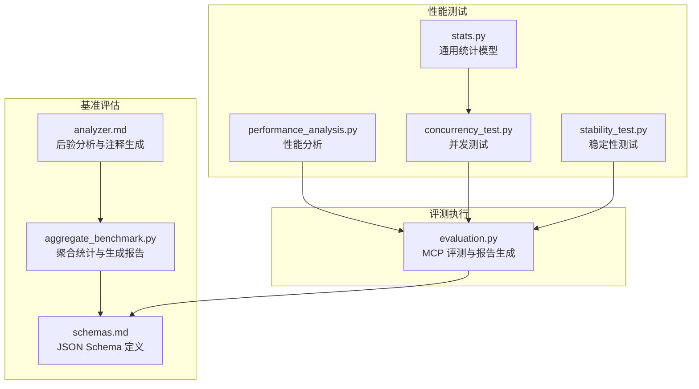
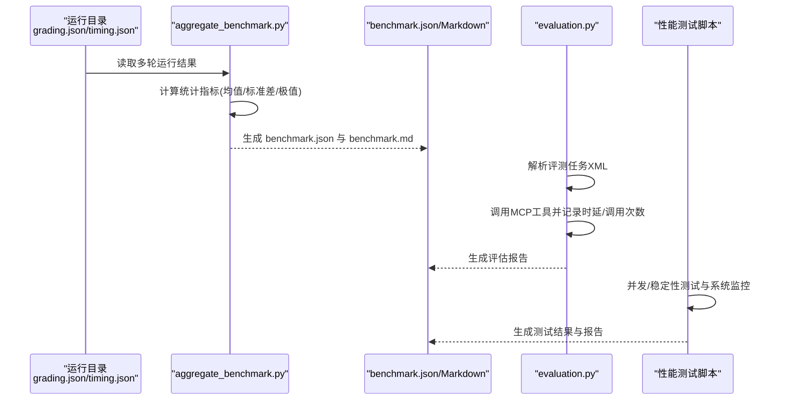
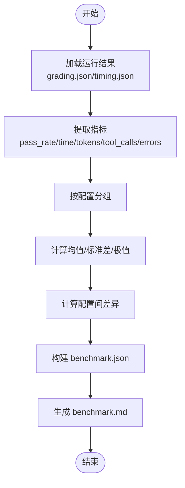
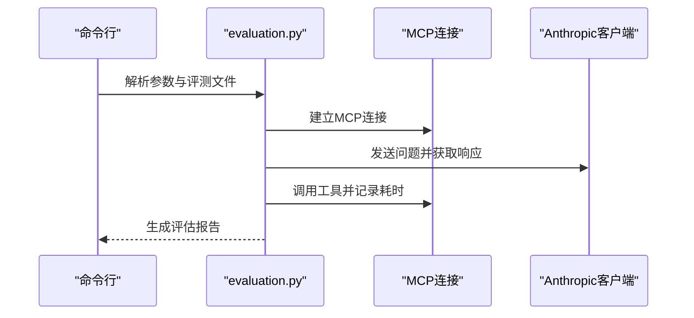
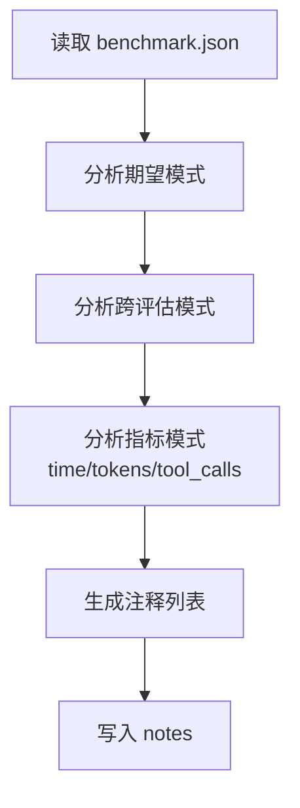
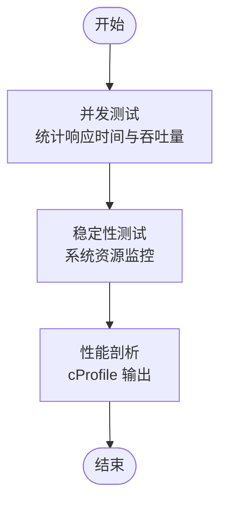
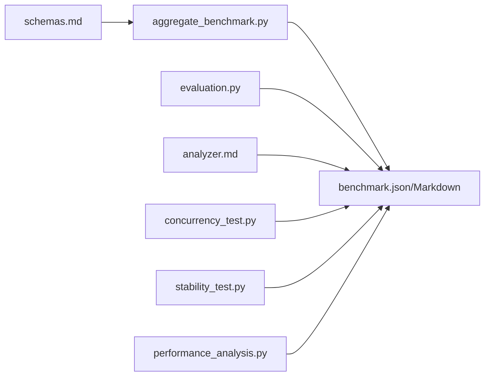

# 技能评估框架

<cite>
**本文引用的文件**
- [aggregate_benchmark.py](file://skills/daoSkilLs/anthropics-skills/skills/skill-creator/scripts/aggregate_benchmark.py)
- [evaluation.py](file://skills/daoSkilLs/anthropics-skills/skills/mcp-builder/scripts/evaluation.py)
- [schemas.md](file://skills/daoSkilLs/anthropics-skills/skills/skill-creator/references/schemas.md)
- [analyzer.md](file://skills/daoSkilLs/anthropics-skills/skills/skill-creator/agents/analyzer.md)
- [performance_analysis.py](file://tools/DeepResearch/tests/performance_analysis.py)
- [concurrency_test.py](file://tools/DeepResearch/tests/performance/concurrency_test.py)
- [stability_test.py](file://tools/DeepResearch/tests/performance/stability_test.py)
- [stats.py](file://tools/flexloop/src/taolib/testing/file_storage/models/stats.py)
</cite>

## 目录
1. [简介](#简介)
2. [项目结构](#项目结构)
3. [核心组件](#核心组件)
4. [架构总览](#架构总览)
5. [详细组件分析](#详细组件分析)
6. [依赖关系分析](#依赖关系分析)
7. [性能考量](#性能考量)
8. [故障排查指南](#故障排查指南)
9. [结论](#结论)
10. [附录](#附录)

## 简介
本指南面向“技能评估框架”的实现与使用，聚焦以下目标：
- 基准测试聚合：从多次运行中提取统计指标并生成可读报告
- 量化评估：对期望项、执行时长、资源消耗等进行量化评分
- 性能分析：并发、稳定性与系统资源监控
- 结果可视化与报告：以结构化 JSON 与 Markdown 输出，支持趋势与对比分析
- 实战案例与最佳实践：覆盖参数配置、输出格式、显著性检验与置信区间建议

## 项目结构
技能评估框架由三类模块构成：
- 基准聚合与报告：负责将单次运行结果汇总为 benchmark.json 与 benchmark.md
- 评测执行与报告：面向 MCP 工具链的评测脚本，生成评估报告
- 性能测试与分析：并发、稳定性与系统资源监控脚本，以及通用统计模型

图表来源
- [aggregate_benchmark.py:1-402](file://skills/daoSkilLs/anthropics-skills/skills/skill-creator/scripts/aggregate_benchmark.py#L1-L402)
- [schemas.md:219-307](file://skills/daoSkilLs/anthropics-skills/skills/skill-creator/references/schemas.md#L219-L307)
- [analyzer.md:187-275](file://skills/daoSkilLs/anthropics-skills/skills/skill-creator/agents/analyzer.md#L187-L275)
- [evaluation.py:1-374](file://skills/daoSkilLs/anthropics-skills/skills/mcp-builder/scripts/evaluation.py#L1-L374)
- [performance_analysis.py:1-49](file://tools/DeepResearch/tests/performance_analysis.py#L1-L49)
- [concurrency_test.py:1-184](file://tools/DeepResearch/tests/performance/concurrency_test.py#L1-L184)
- [stability_test.py:1-314](file://tools/DeepResearch/tests/performance/stability_test.py#L1-L314)
- [stats.py:1-39](file://tools/flexloop/src/taolib/testing/file_storage/models/stats.py#L1-L39)

章节来源
- [aggregate_benchmark.py:1-402](file://skills/daoSkilLs/anthropics-skills/skills/skill-creator/scripts/aggregate_benchmark.py#L1-L402)
- [evaluation.py:1-374](file://skills/daoSkilLs/anthropics-skills/skills/mcp-builder/scripts/evaluation.py#L1-L374)
- [schemas.md:1-431](file://skills/daoSkilLs/anthropics-skills/skills/skill-creator/references/schemas.md#L1-L431)
- [analyzer.md:1-275](file://skills/daoSkilLs/anthropics-skills/skills/skill-creator/agents/analyzer.md#L1-L275)
- [performance_analysis.py:1-49](file://tools/DeepResearch/tests/performance_analysis.py#L1-L49)
- [concurrency_test.py:1-184](file://tools/DeepResearch/tests/performance/concurrency_test.py#L1-L184)
- [stability_test.py:1-314](file://tools/DeepResearch/tests/performance/stability_test.py#L1-L314)
- [stats.py:1-39](file://tools/flexloop/src/taolib/testing/file_storage/models/stats.py#L1-L39)

## 核心组件
- 基准聚合器：读取 run 目录下的 grading.json/timing.json，计算均值、标准差、极值，并生成 benchmark.json 与 benchmark.md
- 评测执行器：基于 MCP 工具链，对一组问答对进行自动化评测，产出评估报告
- 后验分析器：对基准结果进行模式识别与注释生成，辅助理解差异与异常
- 性能分析器：并发测试、稳定性测试与系统资源监控，结合性能剖析工具定位瓶颈

章节来源
- [aggregate_benchmark.py:45-224](file://skills/daoSkilLs/anthropics-skills/skills/skill-creator/scripts/aggregate_benchmark.py#L45-L224)
- [evaluation.py:154-272](file://skills/daoSkilLs/anthropics-skills/skills/mcp-builder/scripts/evaluation.py#L154-L272)
- [analyzer.md:187-275](file://skills/daoSkilLs/anthropics-skills/skills/skill-creator/agents/analyzer.md#L187-L275)
- [performance_analysis.py:16-44](file://tools/DeepResearch/tests/performance_analysis.py#L16-L44)

## 架构总览
下图展示从运行结果到评估报告与性能分析的整体流程。

图表来源
- [aggregate_benchmark.py:67-173](file://skills/daoSkilLs/anthropics-skills/skills/skill-creator/scripts/aggregate_benchmark.py#L67-L173)
- [evaluation.py:154-272](file://skills/daoSkilLs/anthropics-skills/skills/mcp-builder/scripts/evaluation.py#L154-L272)
- [concurrency_test.py:42-115](file://tools/DeepResearch/tests/performance/concurrency_test.py#L42-L115)
- [stability_test.py:62-203](file://tools/DeepResearch/tests/performance/stability_test.py#L62-L203)

## 详细组件分析

### 组件A：基准聚合与报告生成
- 输入：基准目录（含 eval-N/with_skill/run-*/grading.json 与 timing.json）
- 处理：动态发现配置与评估集；提取 pass_rate、time_seconds、tokens、tool_calls、errors 等指标；按配置分组计算统计
- 输出：benchmark.json（metadata、runs、run_summary、notes）与 benchmark.md

图表来源
- [aggregate_benchmark.py:67-224](file://skills/daoSkilLs/anthropics-skills/skills/skill-creator/scripts/aggregate_benchmark.py#L67-L224)

章节来源
- [aggregate_benchmark.py:45-224](file://skills/daoSkilLs/anthropics-skills/skills/skill-creator/scripts/aggregate_benchmark.py#L45-L224)
- [schemas.md:219-307](file://skills/daoSkilLs/anthropics-skills/skills/skill-creator/references/schemas.md#L219-L307)

### 组件B：评测执行与报告生成
- 输入：评测 XML（qa_pair 列表）、MCP 连接方式（stdio/sse/http）
- 处理：逐条任务执行，记录响应、时延、工具调用次数与耗时；汇总准确率、平均时延、平均工具调用次数
- 输出：评估报告（Markdown）

图表来源
- [evaluation.py:154-272](file://skills/daoSkilLs/anthropics-skills/skills/mcp-builder/scripts/evaluation.py#L154-L272)

章节来源
- [evaluation.py:1-374](file://skills/daoSkilLs/anthropics-skills/skills/mcp-builder/scripts/evaluation.py#L1-L374)
- [schemas.md:86-160](file://skills/daoSkilLs/anthropics-skills/skills/skill-creator/references/schemas.md#L86-L160)

### 组件C：后验分析与注释生成
- 输入：benchmark.json、技能路径、输出路径
- 处理：逐期望、跨评估、指标模式分析；生成自由形式注释，帮助理解聚合指标之外的模式
- 输出：notes（JSON 数组字符串）

图表来源
- [analyzer.md:205-249](file://skills/daoSkilLs/anthropics-skills/skills/skill-creator/agents/analyzer.md#L205-L249)

章节来源
- [analyzer.md:187-275](file://skills/daoSkilLs/anthropics-skills/skills/skill-creator/agents/analyzer.md#L187-L275)

### 组件D：性能分析与测试
- 并发测试：多线程模拟并发用户，统计成功率、平均/最大/最小响应时间、吞吐量与标准差
- 稳定性测试：长时间运行，采集 CPU/内存/磁盘/网络指标，检测内存泄漏
- 性能剖析：使用 cProfile 定位热点函数

图表来源
- [concurrency_test.py:42-115](file://tools/DeepResearch/tests/performance/concurrency_test.py#L42-L115)
- [stability_test.py:42-203](file://tools/DeepResearch/tests/performance/stability_test.py#L42-L203)
- [performance_analysis.py:16-44](file://tools/DeepResearch/tests/performance_analysis.py#L16-L44)

章节来源
- [concurrency_test.py:1-184](file://tools/DeepResearch/tests/performance/concurrency_test.py#L1-L184)
- [stability_test.py:1-314](file://tools/DeepResearch/tests/performance/stability_test.py#L1-L314)
- [performance_analysis.py:1-49](file://tools/DeepResearch/tests/performance_analysis.py#L1-L49)

## 依赖关系分析
- aggregate_benchmark.py 依赖 grading.json/timing.json 的字段结构，严格遵循 schemas.md 中的字段命名
- evaluation.py 依赖 MCP 连接层与 Anthropic 客户端，输出评估报告
- analyzer.md 作为后验分析流程说明，指导生成 notes
- 性能测试脚本相互独立，但可与评测执行器配合进行端到端性能评估

图表来源
- [schemas.md:219-307](file://skills/daoSkilLs/anthropics-skills/skills/skill-creator/references/schemas.md#L219-L307)
- [aggregate_benchmark.py:1-402](file://skills/daoSkilLs/anthropics-skills/skills/skill-creator/scripts/aggregate_benchmark.py#L1-L402)
- [evaluation.py:1-374](file://skills/daoSkilLs/anthropics-skills/skills/mcp-builder/scripts/evaluation.py#L1-L374)
- [analyzer.md:1-275](file://skills/daoSkilLs/anthropics-skills/skills/skill-creator/agents/analyzer.md#L1-L275)
- [concurrency_test.py:1-184](file://tools/DeepResearch/tests/performance/concurrency_test.py#L1-L184)
- [stability_test.py:1-314](file://tools/DeepResearch/tests/performance/stability_test.py#L1-L314)
- [performance_analysis.py:1-49](file://tools/DeepResearch/tests/performance_analysis.py#L1-L49)

章节来源
- [schemas.md:1-431](file://skills/daoSkilLs/anthropics-skills/skills/skill-creator/references/schemas.md#L1-L431)
- [aggregate_benchmark.py:1-402](file://skills/daoSkilLs/anthropics-skills/skills/skill-creator/scripts/aggregate_benchmark.py#L1-L402)
- [evaluation.py:1-374](file://skills/daoSkilLs/anthropics-skills/skills/mcp-builder/scripts/evaluation.py#L1-L374)
- [analyzer.md:1-275](file://skills/daoSkilLs/anthropics-skills/skills/skill-creator/agents/analyzer.md#L1-L275)
- [concurrency_test.py:1-184](file://tools/DeepResearch/tests/performance/concurrency_test.py#L1-L184)
- [stability_test.py:1-314](file://tools/DeepResearch/tests/performance/stability_test.py#L1-L314)
- [performance_analysis.py:1-49](file://tools/DeepResearch/tests/performance_analysis.py#L1-L49)

## 性能考量
- 并发与稳定性：通过并发测试与稳定性测试评估系统在高负载与长时间运行下的鲁棒性
- 资源监控：采集 CPU、内存、磁盘与网络指标，辅助定位瓶颈与潜在泄漏
- 热点定位：使用性能剖析工具输出函数级耗时排序，指导优化方向

章节来源
- [concurrency_test.py:1-184](file://tools/DeepResearch/tests/performance/concurrency_test.py#L1-L184)
- [stability_test.py:1-314](file://tools/DeepResearch/tests/performance/stability_test.py#L1-L314)
- [performance_analysis.py:1-49](file://tools/DeepResearch/tests/performance_analysis.py#L1-L49)

## 故障排查指南
- 基准聚合常见问题
  - 缺失 grading.json 或字段不完整：检查 run 目录结构与 timing.json 是否存在
  - 字段名不匹配：确保使用 schemas.md 中的精确字段名（如 configuration、result.pass_rate 等）
- 评测执行常见问题
  - MCP 连接失败：确认传输类型、URL、头部或命令参数正确
  - 工具调用异常：查看工具返回内容与异常堆栈
- 性能测试常见问题
  - 并发测试吞吐低：检查线程池大小与系统资源限制
  - 稳定性测试内存泄漏：关注 RSS 趋势与峰值变化

章节来源
- [aggregate_benchmark.py:115-173](file://skills/daoSkilLs/anthropics-skills/skills/skill-creator/scripts/aggregate_benchmark.py#L115-L173)
- [evaluation.py:305-374](file://skills/daoSkilLs/anthropics-skills/skills/mcp-builder/scripts/evaluation.py#L305-L374)
- [stability_test.py:163-203](file://tools/DeepResearch/tests/performance/stability_test.py#L163-L203)

## 结论
技能评估框架通过“运行结果聚合 → 量化评估 → 性能分析 → 报告生成”的闭环，实现了对技能效果与系统性能的全面度量。借助标准化的 JSON Schema 与 Markdown 报告，评估结果具备良好的可读性与可比性；结合并发、稳定性与性能剖析，能够快速定位瓶颈并指导优化。

## 附录

### 评估数据结构与统计方法
- 数据结构
  - runs：每轮运行的指标集合（pass_rate、time_seconds、tokens、tool_calls、errors、expectations、notes）
  - run_summary：按配置分组的统计摘要（mean/stddev/min/max）
  - notes：后验分析生成的观察性注释
- 统计方法
  - 均值与标准差：用于描述中心趋势与离散程度
  - 极值：用于识别异常与波动
  - 配置间差异：用于直观展示改进效果

章节来源
- [schemas.md:219-307](file://skills/daoSkilLs/anthropics-skills/skills/skill-creator/references/schemas.md#L219-L307)
- [aggregate_benchmark.py:45-64](file://skills/daoSkilLs/anthropics-skills/skills/skill-creator/scripts/aggregate_benchmark.py#L45-L64)

### 评估脚本使用方法与参数
- 基准聚合脚本
  - 参数：基准目录、可选技能名与路径、输出路径
  - 输出：benchmark.json 与 benchmark.md
- 评测执行脚本
  - 参数：评测文件、传输类型、模型、连接参数、输出文件
  - 输出：评估报告（Markdown）
- 性能分析脚本
  - 并发测试：指定并发级别与持续时间，输出统计与报告
  - 稳定性测试：指定持续时间与监控间隔，输出统计与报告
  - 性能剖析：运行代理调用，输出函数级耗时排序

章节来源
- [aggregate_benchmark.py:338-401](file://skills/daoSkilLs/anthropics-skills/skills/skill-creator/scripts/aggregate_benchmark.py#L338-L401)
- [evaluation.py:305-374](file://skills/daoSkilLs/anthropics-skills/skills/mcp-builder/scripts/evaluation.py#L305-L374)
- [concurrency_test.py:163-184](file://tools/DeepResearch/tests/performance/concurrency_test.py#L163-L184)
- [stability_test.py:296-314](file://tools/DeepResearch/tests/performance/stability_test.py#L296-L314)
- [performance_analysis.py:16-44](file://tools/DeepResearch/tests/performance_analysis.py#L16-L44)

### 评估指标定义、置信区间与显著性检验
- 指标定义
  - 准确率：期望项通过数/总数
  - 时延：总耗时（秒）
  - 资源：token 数、工具调用次数、错误数
- 置信区间与显著性检验
  - 建议：当 runs_per_configuration ≥ 3 时，可采用样本标准差估计标准误，构造均值的 95% 置信区间；若需比较两配置差异，可采用成对 t 检验或非参数检验（如 Wilcoxon 符号秩检验），以 pass_rate/time_seconds 为主要判据
  - 注意：当前聚合脚本未内置统计显著性输出，可在下游报告中补充统计分析

章节来源
- [aggregate_benchmark.py:176-224](file://skills/daoSkilLs/anthropics-skills/skills/skill-creator/scripts/aggregate_benchmark.py#L176-L224)
- [schemas.md:219-307](file://skills/daoSkilLs/anthropics-skills/skills/skill-creator/references/schemas.md#L219-L307)

### 评估报告生成、趋势分析与性能对比
- 报告生成
  - 基准报告：benchmark.md 汇总 pass_rate、time_seconds、tokens 的均值与标准差，并标注配置差异
  - 评测报告：评估报告包含准确率、平均时延、平均工具调用次数等
- 趋势分析
  - 对比不同版本（history.json）的 expectation_pass_rate，观察改进轨迹
- 性能对比
  - 以 run_summary 的均值与差异为依据，结合 notes 的模式注释，形成综合判断

章节来源
- [aggregate_benchmark.py:281-335](file://skills/daoSkilLs/anthropics-skills/skills/skill-creator/scripts/aggregate_benchmark.py#L281-L335)
- [evaluation.py:187-272](file://skills/daoSkilLs/anthropics-skills/skills/mcp-builder/scripts/evaluation.py#L187-L272)
- [schemas.md:39-83](file://skills/daoSkilLs/anthropics-skills/skills/skill-creator/references/schemas.md#L39-L83)

### 实际案例与最佳实践
- 案例：在基准目录中组织 eval-N/with_skill/run-*/grading.json 与 timing.json，确保字段名与 schemas.md 一致
- 最佳实践
  - 固定 runs_per_configuration（如 3），提升统计稳健性
  - 在 grading.json 中提供完整的 expectations 与 timing/execution_metrics
  - 使用 analyzer.md 的注释模板，生成可解释的 notes
  - 并发与稳定性测试结合使用，先定位瓶颈再进行针对性优化

章节来源
- [schemas.md:86-160](file://skills/daoSkilLs/anthropics-skills/skills/skill-creator/references/schemas.md#L86-L160)
- [analyzer.md:234-249](file://skills/daoSkilLs/anthropics-skills/skills/skill-creator/agents/analyzer.md#L234-L249)
- [concurrency_test.py:163-184](file://tools/DeepResearch/tests/performance/concurrency_test.py#L163-L184)
- [stability_test.py:296-314](file://tools/DeepResearch/tests/performance/stability_test.py#L296-L314)