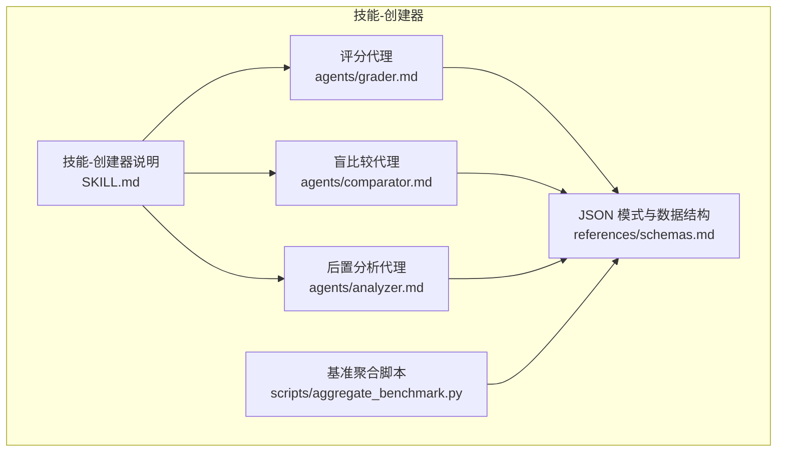
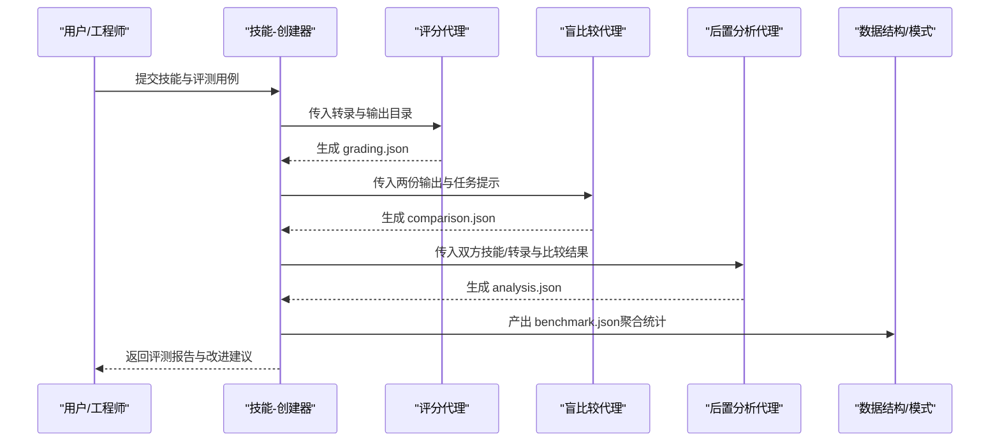
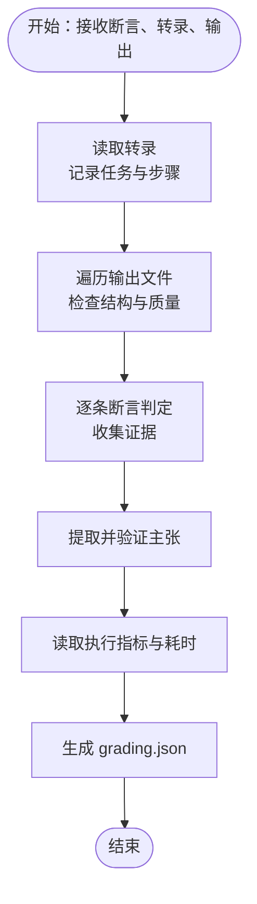
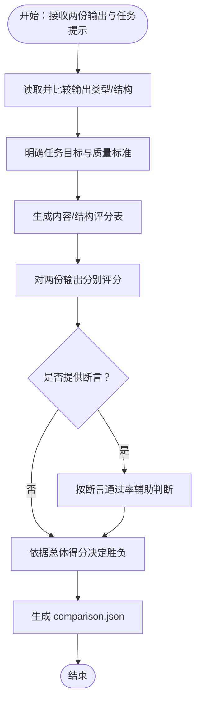
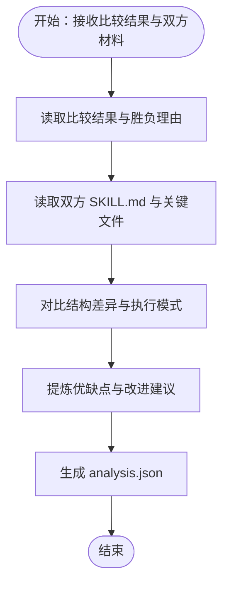
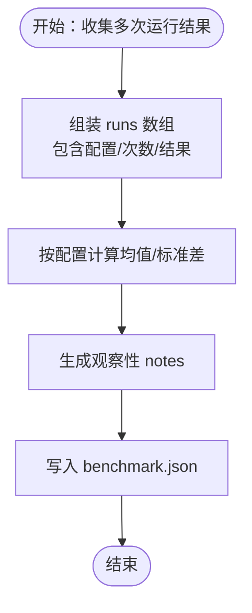
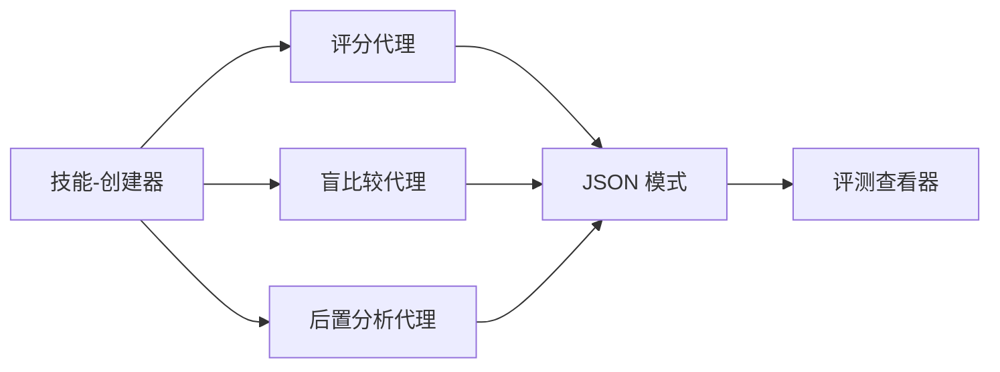

# 自定义技能开发

<cite>
**本文引用的文件**
- [技能-创建器说明](file://skills/daoSkilLs/README.md)
- [技能-创建器技能说明](file://skills/daoSkilLs/skills/anthropics-skills/skills/skill-creator/SKILL.md)
- [评分代理说明](file://skills/daoSkilLs/skills/anthropics-skills/skills/skill-creator/agents/grader.md)
- [比较代理说明](file://skills/daoSkilLs/skills/anthropics-skills/skills/skill-creator/agents/comparator.md)
- [后置分析代理说明](file://skills/daoSkilLs/skills/anthropics-skills/skills/skill-creator/agents/analyzer.md)
- [JSON 模式与数据结构](file://skills/daoSkilLs/skills/anthropics-skills/skills/skill-creator/references/schemas.md)
- [基准聚合脚本](file://skills/daoSkilLs/skills/anthropics-skills/skills/skill-creator/scripts/aggregate_benchmark.py)
- [技能模板](file://skills/daoSkilLs/skills/anthropics-skills/template/SKILL.md)
</cite>

## 目录
1. [引言](#引言)
2. [项目结构](#项目结构)
3. [核心组件](#核心组件)
4. [架构总览](#架构总览)
5. [详细组件分析](#详细组件分析)
6. [依赖关系分析](#依赖关系分析)
7. [性能考量](#性能考量)
8. [故障排查指南](#故障排查指南)
9. [结论](#结论)
10. [附录](#附录)

## 引言
本指南面向希望基于现有框架开发、优化与发布的“自定义技能”的工程师与产品人员。文档聚焦于技能创建器（Skill Creator）的智能代理体系：评分代理（Grader）、盲比较代理（Comparator）、后置分析代理（Analyzer），以及配套的数据结构与基准评测工具链。通过系统化的开发流程、测试策略与发布规范，帮助你构建高质量、可复现、可度量的技能。

## 项目结构
该仓库包含多类应用与工具，其中与“自定义技能开发”直接相关的核心位于 skills/daoSkilLs 子树下，尤其是 anthropics-skills 中的 skill-creator 技能及其配套 agents、references、scripts 等模块。整体组织方式以“技能”为中心，每个技能由一个 SKILL.md 描述元信息与指令，配合 evals、outputs、metrics、timing 等运行期产物进行闭环评测。

图表来源
- [技能-创建器技能说明:1-486](file://skills/daoSkilLs/skills/anthropics-skills/skills/skill-creator/SKILL.md#L1-L486)
- [评分代理说明:1-224](file://skills/daoSkilLs/skills/anthropics-skills/skills/skill-creator/agents/grader.md#L1-L224)
- [比较代理说明:1-203](file://skills/daoSkilLs/skills/anthropics-skills/skills/skill-creator/agents/comparator.md#L1-L203)
- [后置分析代理说明:1-239](file://skills/daoSkilLs/skills/anthropics-skills/skills/skill-creator/agents/analyzer.md#L1-L239)
- [JSON 模式与数据结构:1-431](file://skills/daoSkilLs/skills/anthropics-skills/skills/skill-creator/references/schemas.md#L1-L431)
- [基准聚合脚本:232-268](file://skills/daoSkilLs/skills/anthropics-skills/skills/skill-creator/scripts/aggregate_benchmark.py#L232-L268)

章节来源
- [技能-创建器说明:1-95](file://skills/daoSkilLs/README.md#L1-L95)
- [技能-创建器技能说明:1-486](file://skills/daoSkilLs/skills/anthropics-skills/skills/skill-creator/SKILL.md#L1-L486)

## 核心组件
- 评分代理（Grader）
  - 职责：对执行转录与输出进行客观判定，给出断言通过与否及证据；同时对评测用例提出改进建议。
  - 关键输入：期望断言列表、执行转录路径、输出目录。
  - 输出：grading.json，包含断言明细、摘要统计、执行指标、时序与提取声明等。
- 盲比较代理（Comparator）
  - 职责：在不知道来源的情况下对比两份输出，依据内容与结构维度打分，决定优胜者。
  - 关键输入：两个输出路径、原始任务提示、可选断言。
  - 输出：comparison.json，包含总体得分、维度评分、优劣总结与断言通过率。
- 后置分析代理（Analyzer）
  - 职责：在盲比较之后，结合双方技能与转录，提炼“为何获胜”的洞察与改进建议。
  - 关键输入：获胜方/失败方技能与转录、比较结果、输出路径。
  - 输出：analysis.json，包含对比摘要、优缺点、指令遵循评分、改进建议与执行模式洞察。
- 数据结构与模式
  - 定义了 evals.json、grading.json、metrics.json、timing.json、benchmark.json、comparison.json、analysis.json 等标准结构，确保评测与分析的可复现性与可视化一致性。
- 基准聚合脚本
  - 将多次运行结果汇总为 benchmark.json，并计算均值、标准差、差异等统计量，供评测查看器消费。

章节来源
- [评分代理说明:1-224](file://skills/daoSkilLs/skills/anthropics-skills/skills/skill-creator/agents/grader.md#L1-L224)
- [比较代理说明:1-203](file://skills/daoSkilLs/skills/anthropics-skills/skills/skill-creator/agents/comparator.md#L1-L203)
- [后置分析代理说明:1-239](file://skills/daoSkilLs/skills/anthropics-skills/skills/skill-creator/agents/analyzer.md#L1-L239)
- [JSON 模式与数据结构:1-431](file://skills/daoSkilLs/skills/anthropics-skills/skills/skill-creator/references/schemas.md#L1-L431)
- [基准聚合脚本:232-268](file://skills/daoSkilLs/skills/anthropics-skills/skills/skill-creator/scripts/aggregate_benchmark.py#L232-L268)

## 架构总览
技能创建器采用“代理协作 + 结构化数据”的架构：以 skill-creator 为核心编排，调用 grader、comparator、analyzer 等子代理完成评分、比较与分析；所有中间产物与最终报告均遵循统一的 JSON 模式，便于自动化处理与可视化展示。

图表来源
- [技能-创建器技能说明:472-484](file://skills/daoSkilLs/skills/anthropics-skills/skills/skill-creator/SKILL.md#L472-L484)
- [评分代理说明:1-224](file://skills/daoSkilLs/skills/anthropics-skills/skills/skill-creator/agents/grader.md#L1-L224)
- [比较代理说明:1-203](file://skills/daoSkilLs/skills/anthropics-skills/skills/skill-creator/agents/comparator.md#L1-L203)
- [后置分析代理说明:1-239](file://skills/daoSkilLs/skills/anthropics-skills/skills/skill-creator/agents/analyzer.md#L1-L239)
- [JSON 模式与数据结构:1-431](file://skills/daoSkilLs/skills/anthropics-skills/skills/skill-creator/references/schemas.md#L1-L431)

## 详细组件分析

### 评分代理（Grader）分析
- 输入与职责
  - 输入：断言列表、执行转录、输出目录。
  - 职责：逐条断言核查证据，区分事实性、过程性与质量性主张，输出客观结论与证据引用。
- 处理流程要点
  - 读取转录与输出，识别问题与错误。
  - 对断言逐一判定 PASS/FAIL，提供具体证据。
  - 提取并验证隐含主张，审阅用户备注。
  - 读取执行指标与耗时，纳入综合评估。
- 输出结构
  - expectations：每条断言的判定与证据。
  - summary：通过数、失败数、总数与通过率。
  - execution_metrics：工具调用、步骤数、输出字符数等。
  - timing：执行与评分阶段耗时。
  - claims：提取并验证的事实/过程/质量主张。
  - user_notes_summary：执行者标注的不确定性、需复核项与变通做法。
  - eval_feedback：评测用例改进建议。

图表来源
- [评分代理说明:1-224](file://skills/daoSkilLs/skills/anthropics-skills/skills/skill-creator/agents/grader.md#L1-L224)
- [JSON 模式与数据结构:86-160](file://skills/daoSkilLs/skills/anthropics-skills/skills/skill-creator/references/schemas.md#L86-L160)

章节来源
- [评分代理说明:1-224](file://skills/daoSkilLs/skills/anthropics-skills/skills/skill-creator/agents/grader.md#L1-L224)
- [JSON 模式与数据结构:86-160](file://skills/daoSkilLs/skills/anthropics-skills/skills/skill-creator/references/schemas.md#L86-L160)

### 盲比较代理（Comparator）分析
- 输入与职责
  - 输入：两份输出（文件或目录）、原始任务提示、可选断言。
  - 职责：不透露来源地对比两份输出，依据内容正确性、完整性与结构组织性打分，决定优胜者。
- 处理流程要点
  - 读取两份输出，理解任务要求与关键质量维度。
  - 生成内容与结构双维度评分表，计算总体得分。
  - 在提供断言时，统计通过率作为辅助证据。
  - 明确胜负与理由，必要时判平局。
- 输出结构
  - winner、reasoning、rubric（内容/结构维度评分）、output_quality（优缺点总结）、expectation_results（断言通过情况）。

图表来源
- [比较代理说明:1-203](file://skills/daoSkilLs/skills/anthropics-skills/skills/skill-creator/agents/comparator.md#L1-L203)
- [JSON 模式与数据结构:288-380](file://skills/daoSkilLs/skills/anthropics-skills/skills/skill-creator/references/schemas.md#L288-L380)

章节来源
- [比较代理说明:1-203](file://skills/daoSkilLs/skills/anthropics-skills/skills/skill-creator/agents/comparator.md#L1-L203)
- [JSON 模式与数据结构:288-380](file://skills/daoSkilLs/skills/anthropics-skills/skills/skill-creator/references/schemas.md#L288-L380)

### 后置分析代理（Analyzer）分析
- 输入与职责
  - 输入：获胜/失败方技能与转录、比较结果、输出路径。
  - 职责：解盲比较结果，分析“为何获胜”，生成可操作的改进建议。
- 处理流程要点
  - 读取比较结果，明确胜负与理由。
  - 对比双方技能与转录，识别结构性差异（指令清晰度、脚本使用、示例覆盖、边界处理等）。
  - 给出优缺点清单、指令遵循评分、优先级建议与执行模式洞察。
- 输出结构
  - comparison_summary、winner_strengths、loser_weaknesses、instruction_following、improvement_suggestions、transcript_insights。

图表来源
- [后置分析代理说明:1-154](file://skills/daoSkilLs/skills/anthropics-skills/skills/skill-creator/agents/analyzer.md#L1-L154)
- [JSON 模式与数据结构:384-431](file://skills/daoSkilLs/skills/anthropics-skills/skills/skill-creator/references/schemas.md#L384-L431)

章节来源
- [后置分析代理说明:1-154](file://skills/daoSkilLs/skills/anthropics-skills/skills/skill-creator/agents/analyzer.md#L1-L154)
- [JSON 模式与数据结构:384-431](file://skills/daoSkilLs/skills/anthropics-skills/skills/skill-creator/references/schemas.md#L384-L431)

### 基准评测与聚合
- 目标：在“有技能/无技能”两种配置下重复运行多个评测，统计通过率、耗时、Token 使用等指标，形成可对比的结论。
- 关键步骤
  - 生成 benchmark.json 的 runs 数组，包含每次运行的配置、次数、结果与期望断言。
  - 计算每种配置的均值与标准差，得到 run_summary。
  - 生成 notes，总结断言差异、波动与资源消耗变化。
- 参考字段
  - metadata、runs[]、run_summary、notes 等，严格遵循 schema 规范以保证评测查看器正确解析。

图表来源
- [基准聚合脚本:232-268](file://skills/daoSkilLs/skills/anthropics-skills/skills/skill-creator/scripts/aggregate_benchmark.py#L232-L268)
- [JSON 模式与数据结构:219-306](file://skills/daoSkilLs/skills/anthropics-skills/skills/skill-creator/references/schemas.md#L219-L306)

章节来源
- [基准聚合脚本:232-268](file://skills/daoSkilLs/skills/anthropics-skills/skills/skill-creator/scripts/aggregate_benchmark.py#L232-L268)
- [JSON 模式与数据结构:219-306](file://skills/daoSkilLs/skills/anthropics-skills/skills/skill-creator/references/schemas.md#L219-L306)

### 技能模板系统
- 模板文件：template/SKILL.md 提供最小可用的 YAML frontmatter 与说明占位，便于快速启动新技能。
- 元信息要求：至少包含 name 与 description，用于唯一标识与触发匹配。
- 内容结构：建议包含清晰的指令、示例与指导，便于评分与比较代理理解与判定。

章节来源
- [技能模板:1-7](file://skills/daoSkilLs/skills/anthropics-skills/template/SKILL.md#L1-L7)

### 评估查看器与基准测试
- 评测查看器依赖严格的字段命名与层级结构，如 runs[].configuration 必须为 "with_skill"/"without_skill"，且 runs[].result 下必须包含 pass_rate、passed、total、time_seconds、tokens、errors 等字段。
- 建议在生成 benchmark.json 时严格对照 schema，避免字段名拼写或层级错误导致可视化为空或为零。

章节来源
- [JSON 模式与数据结构:288-306](file://skills/daoSkilLs/skills/anthropics-skills/skills/skill-creator/references/schemas.md#L288-L306)

## 依赖关系分析
- 组件耦合
  - skill-creator 作为编排者，依赖 agents 与 references 的规范接口。
  - 评分/比较/分析三类代理彼此独立，但共享统一的数据结构，降低耦合度。
- 数据流
  - 评测数据从执行阶段产生，经 grader 生成 grading.json；随后 comparator 与 analyzer 分别消费，最终由聚合脚本汇总为 benchmark.json。
- 外部集成点
  - 评测查看器依赖 benchmark.json 的固定字段与层级，确保可视化稳定。

图表来源
- [技能-创建器技能说明:456-484](file://skills/daoSkilLs/skills/anthropics-skills/skills/skill-creator/SKILL.md#L456-L484)
- [JSON 模式与数据结构:1-431](file://skills/daoSkilLs/skills/anthropics-skills/skills/skill-creator/references/schemas.md#L1-L431)

章节来源
- [技能-创建器技能说明:456-484](file://skills/daoSkilLs/skills/anthropics-skills/skills/skill-creator/SKILL.md#L456-L484)
- [JSON 模式与数据结构:1-431](file://skills/daoSkilLs/skills/anthropics-skills/skills/skill-creator/references/schemas.md#L1-L431)

## 性能考量
- 评测稳定性
  - 增加 runs_per_configuration，有助于降低模型波动带来的误判，提升统计显著性。
- 指标选择
  - 除通过率外，关注 time_seconds、tokens、tool_calls 等资源指标，结合 run_summary 的均值与标准差，识别异常与瓶颈。
- 输出质量优先
  - 盲比较强调输出质量而非风格偏好，断言通过率仅作辅助证据，避免“表面正确”掩盖实质缺陷。

## 故障排查指南
- 评测查看器显示空值或零值
  - 检查 benchmark.json 字段命名与层级是否与 schema 完全一致（如 configuration、result.pass_rate 等）。
- 断言通过但质量不佳
  - 使用 grader 的 claims 与 eval_feedback 字段，定位“存在但不正确”的输出；补充更严格的断言。
- 比较结果争议
  - 使用 analyzer 的 analysis.json，结合双方执行模式与指令遵循评分，识别改进方向。
- 执行指标缺失
  - 确认执行阶段已生成 metrics.json 与 timing.json，并在 grading 阶段被正确读取。

章节来源
- [JSON 模式与数据结构:163-216](file://skills/daoSkilLs/skills/anthropics-skills/skills/skill-creator/references/schemas.md#L163-L216)
- [评分代理说明:101-105](file://skills/daoSkilLs/skills/anthropics-skills/skills/skill-creator/agents/grader.md#L101-L105)

## 结论
通过评分、比较与后置分析三大代理的协同，以及标准化的数据结构与基准聚合流程，技能创建器提供了从“草稿—评测—优化—发布”的闭环开发体验。遵循模板与 schema、重视断言质量与资源指标、善用分析报告，是持续提升技能质量与触发准确性的关键。

## 附录
- 开发流程建议
  - 明确技能目标与触发条件，编写清晰指令与示例。
  - 设计可验证断言，覆盖关键事实、过程与质量维度。
  - 进行多轮评测与对比，利用 comparison.json 与 analysis.json 指导迭代。
  - 生成 benchmark.json 并用评测查看器可视化，形成可复现的发布报告。
- 最佳实践
  - 指令遵循评分高意味着更强的一致性；优先修复“指令模糊”与“缺少验证脚本”等问题。
  - 对易波动的任务增加运行次数与统计分析，减少误判。
  - 保持 SKILL.md 的元信息简洁准确，提升触发准确性与检索效率。