# 开发环境问题排查指南

<cite>
**本文档引用的文件**
- [apps/AgentPit/package.json](file://apps/AgentPit/package.json)
- [apps/AgentPit/vite.config.ts](file://apps/AgentPit/vite.config.ts)
- [apps/AgentPit/tsconfig.json](file://apps/AgentPit/tsconfig.json)
- [apps/AgentPit/tsconfig.app.json](file://apps/AgentPit/tsconfig.app.json)
- [apps/AgentPit/tsconfig.node.json](file://apps/AgentPit/tsconfig.node.json)
- [apps/AgentPit/.env.example](file://apps/AgentPit/.env.example)
- [apps/AgentPit/podman-compose.yml](file://apps/AgentPit/podman-compose.yml)
- [apps/AgentPit/deploy.sh](file://apps/AgentPit/deploy.sh)
- [apps/AgentPit/nginx.conf](file://apps/AgentPit/nginx.conf)
- [apps/DaoMind/pnpm-workspace.yaml](file://apps/DaoMind/pnpm-workspace.yaml)
- [apps/DaoMind/pnpm-lock.yaml](file://apps/DaoMind/pnpm-lock.yaml)
</cite>

## 目录
1. [简介](#简介)
2. [项目结构](#项目结构)
3. [核心组件](#核心组件)
4. [架构概览](#架构概览)
5. [详细组件分析](#详细组件分析)
6. [依赖分析](#依赖分析)
7. [性能考虑](#性能考虑)
8. [故障排除指南](#故障排除指南)
9. [结论](#结论)
10. [附录](#附录)

## 简介

DAOApps项目是一个多应用的前端开发环境，包含多个独立的应用程序和工具包。本指南专注于开发环境的问题排查，涵盖Node.js版本兼容性、依赖安装失败、TypeScript编译错误、Vite构建问题等常见开发环境配置问题。

## 项目结构

DAOApps项目采用多包管理结构，主要包含以下组件：

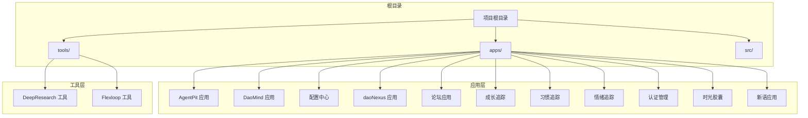

**图表来源**
- [apps/AgentPit/package.json:1-74](file://apps/AgentPit/package.json#L1-L74)
- [apps/DaoMind/pnpm-workspace.yaml](file://apps/DaoMind/pnpm-workspace.yaml)

**章节来源**
- [apps/AgentPit/package.json:1-74](file://apps/AgentPit/package.json#L1-L74)
- [apps/DaoMind/pnpm-workspace.yaml](file://apps/DaoMind/pnpm-workspace.yaml)

## 核心组件

### 开发工具链组件

项目使用现代化的前端开发工具链，主要包括：

| 组件 | 版本 | 功能 |
|------|------|------|
| Node.js | >= 18.x | JavaScript运行时环境 |
| TypeScript | ~6.0.2 | 类型安全的JavaScript扩展 |
| Vite | ^8.0.4 | 快速的开发服务器和构建工具 |
| Vue.js | ^3.5.32 | 渐进式JavaScript框架 |
| PNPM | 工作区管理 | 包管理器和工作区支持 |

### 关键配置文件

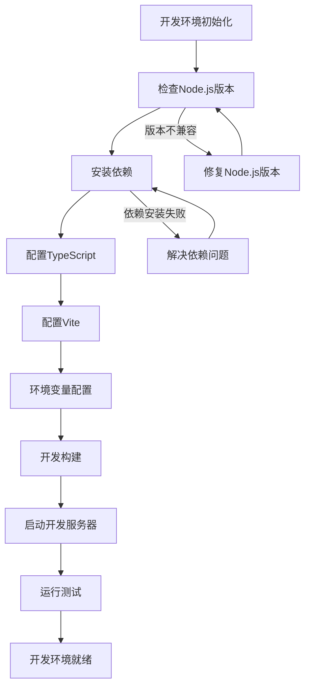

**图表来源**
- [apps/AgentPit/package.json:6-19](file://apps/AgentPit/package.json#L6-L19)
- [apps/AgentPit/tsconfig.json:1-8](file://apps/AgentPit/tsconfig.json#L1-L8)

**章节来源**
- [apps/AgentPit/package.json:1-74](file://apps/AgentPit/package.json#L1-L74)
- [apps/AgentPit/tsconfig.json:1-8](file://apps/AgentPit/tsconfig.json#L1-L8)

## 架构概览

### 开发环境架构

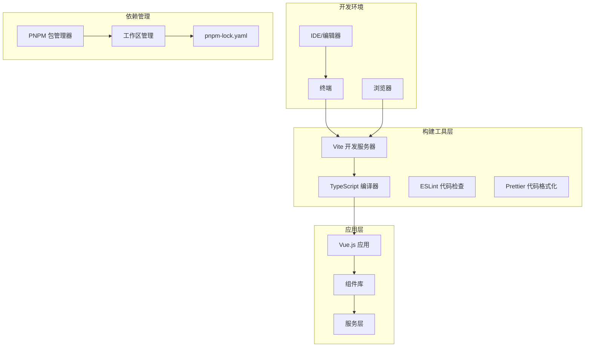

**图表来源**
- [apps/AgentPit/vite.config.ts:1-15](file://apps/AgentPit/vite.config.ts#L1-L15)
- [apps/AgentPit/tsconfig.app.json:1-1](file://apps/AgentPit/tsconfig.app.json#L1-L1)
- [apps/DaoMind/pnpm-workspace.yaml](file://apps/DaoMind/pnpm-workspace.yaml)

## 详细组件分析

### Node.js版本兼容性

#### 版本要求和检测

| Node.js版本 | 兼容性 | 推荐用途 |
|-------------|--------|----------|
| 18.x | ✅ 完全兼容 | 生产环境推荐 |
| 19.x | ⚠️ 部分兼容 | 测试环境 |
| 20.x | ❌ 不兼容 | 开发环境不推荐 |
| 21.x | ❌ 不兼容 | 开发环境不推荐 |

#### Node.js版本检查流程

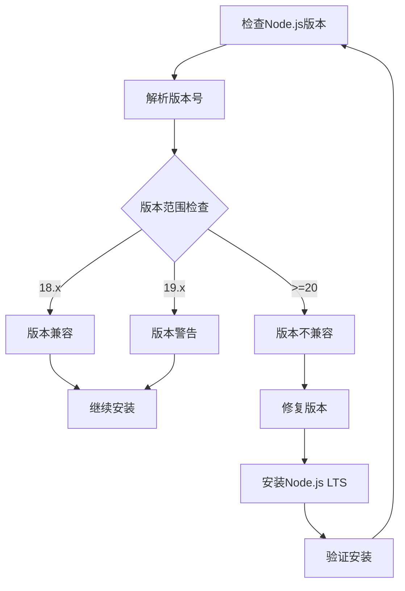

**图表来源**
- [apps/AgentPit/package.json:1-74](file://apps/AgentPit/package.json#L1-L74)

**章节来源**
- [apps/AgentPit/package.json:1-74](file://apps/AgentPit/package.json#L1-L74)

### 依赖安装问题排查

#### 依赖安装失败的常见原因

1. **网络连接问题**
   - npm registry访问失败
   - 代理设置错误
   - 防火墙阻拦

2. **权限问题**
   - 文件系统权限不足
   - 全局包权限问题
   - 缓存目录权限

3. **缓存问题**
   - npm缓存损坏
   - pnpm缓存问题
   - 本地缓存过期

#### 依赖安装诊断流程

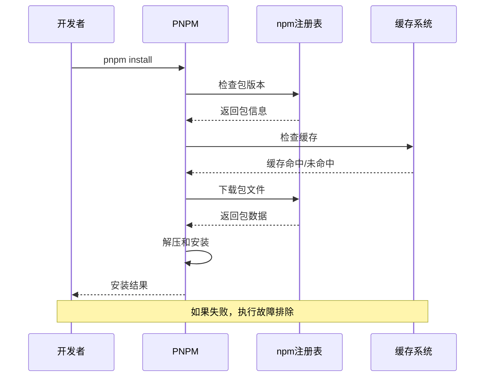

**图表来源**
- [apps/AgentPit/package.json:20-63](file://apps/AgentPit/package.json#L20-L63)

**章节来源**
- [apps/AgentPit/package.json:20-63](file://apps/AgentPit/package.json#L20-L63)

### TypeScript编译错误排查

#### TypeScript配置分析

项目使用了双配置文件结构：

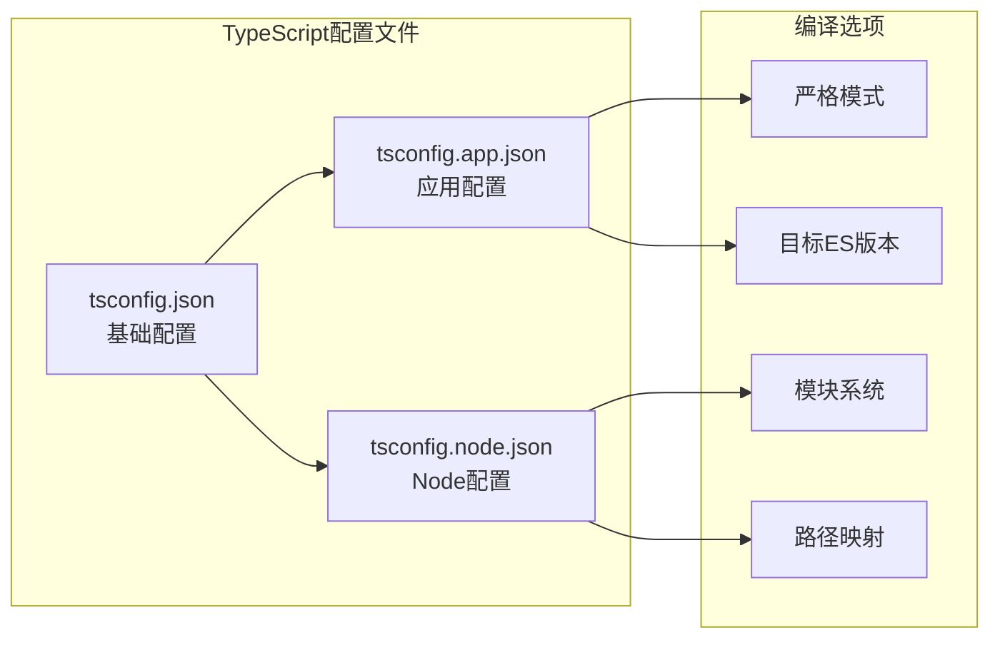

**图表来源**
- [apps/AgentPit/tsconfig.json:1-8](file://apps/AgentPit/tsconfig.json#L1-L8)
- [apps/AgentPit/tsconfig.app.json:1-1](file://apps/AgentPit/tsconfig.app.json#L1-L1)
- [apps/AgentPit/tsconfig.node.json:1-25](file://apps/AgentPit/tsconfig.node.json#L1-L25)

#### 常见TypeScript错误类型

| 错误类型 | 常见症状 | 解决方案 |
|----------|----------|----------|
| 类型错误 | 编译时报错，显示类型不匹配 | 检查类型注解，更新相关依赖 |
| 导入错误 | 无法找到模块或类型定义 | 检查路径映射，确认模块存在 |
| 配置错误 | 编译器选项冲突 | 检查tsconfig继承关系 |
| 版本不兼容 | 新特性在旧版本中不可用 | 更新TypeScript版本 |

**章节来源**
- [apps/AgentPit/tsconfig.json:1-8](file://apps/AgentPit/tsconfig.json#L1-L8)
- [apps/AgentPit/tsconfig.app.json:1-1](file://apps/AgentPit/tsconfig.app.json#L1-L1)
- [apps/AgentPit/tsconfig.node.json:1-25](file://apps/AgentPit/tsconfig.node.json#L1-L25)

### Vite构建问题排查

#### Vite配置分析

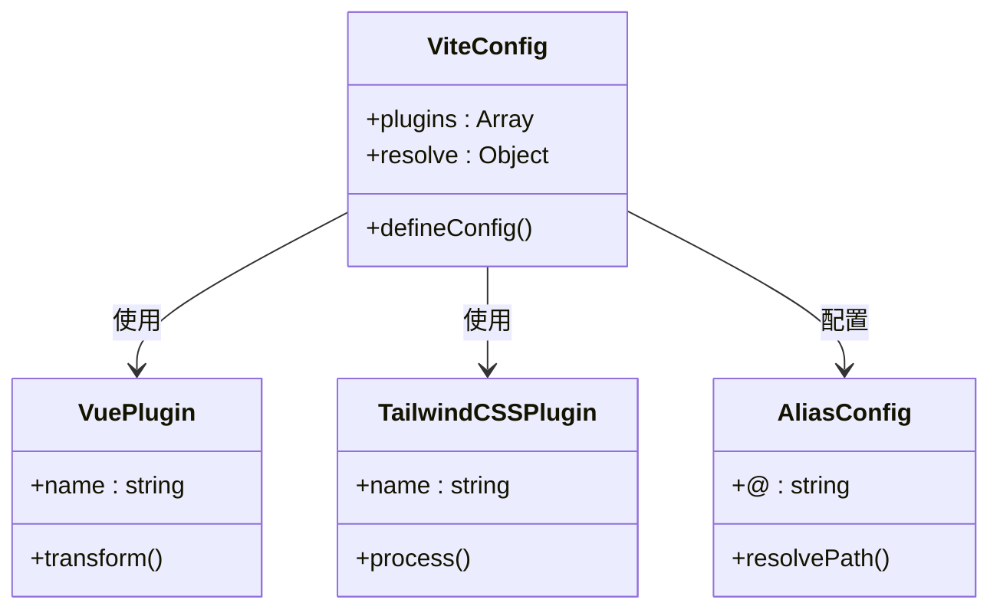

**图表来源**
- [apps/AgentPit/vite.config.ts:1-15](file://apps/AgentPit/vite.config.ts#L1-L15)

#### Vite构建流程

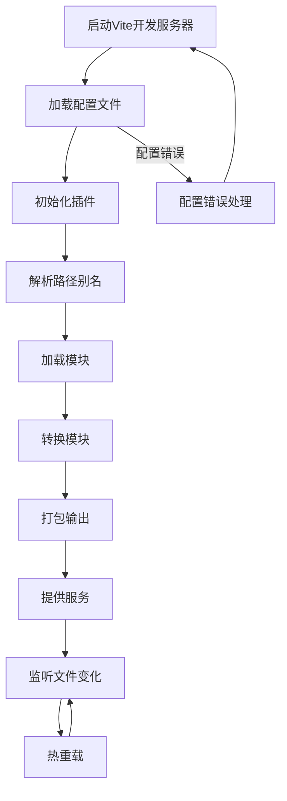

**图表来源**
- [apps/AgentPit/vite.config.ts:7-14](file://apps/AgentPit/vite.config.ts#L7-L14)

**章节来源**
- [apps/AgentPit/vite.config.ts:1-15](file://apps/AgentPit/vite.config.ts#L1-L15)

### 环境变量配置

#### 环境变量配置文件

| 变量名 | 默认值 | 用途 | 开发环境 | 生产环境 |
|--------|--------|------|----------|----------|
| VITE_API_BASE_URL | http://localhost:8080/api | API基础URL | 本地开发 | 服务器地址 |
| VITE_USE_MOCK_API | true | 是否使用Mock数据 | 开发调试 | 生产环境 |
| VITE_API_TIMEOUT | 30000 | API超时时间(ms) | 通用 | 通用 |
| VITE_DEEP_RESEARCH_PATH | 空 | DeepResearch工具路径 | 可选 | 可选 |
| VITE_FLEXLOOP_PATH | 空 | Flexloop工具路径 | 可选 | 可选 |

**章节来源**
- [apps/AgentPit/.env.example:1-15](file://apps/AgentPit/.env.example#L1-L15)

### Docker容器化问题

#### Podman容器配置

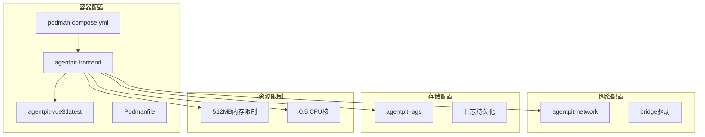

**图表来源**
- [apps/AgentPit/podman-compose.yml:1-70](file://apps/AgentPit/podman-compose.yml#L1-L70)

#### 容器部署流程

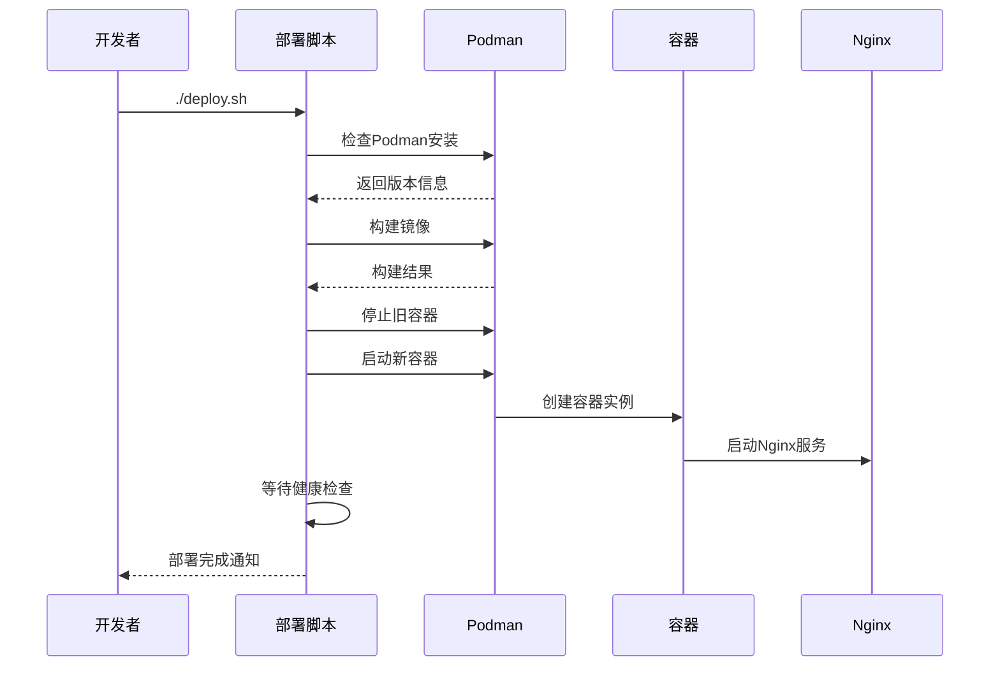

**图表来源**
- [apps/AgentPit/deploy.sh:161-184](file://apps/AgentPit/deploy.sh#L161-L184)
- [apps/AgentPit/podman-compose.yml:14-54](file://apps/AgentPit/podman-compose.yml#L14-L54)

**章节来源**
- [apps/AgentPit/podman-compose.yml:1-70](file://apps/AgentPit/podman-compose.yml#L1-L70)
- [apps/AgentPit/deploy.sh:1-184](file://apps/AgentPit/deploy.sh#L1-L184)

## 依赖分析

### 包管理器选择

项目同时支持多种包管理器：

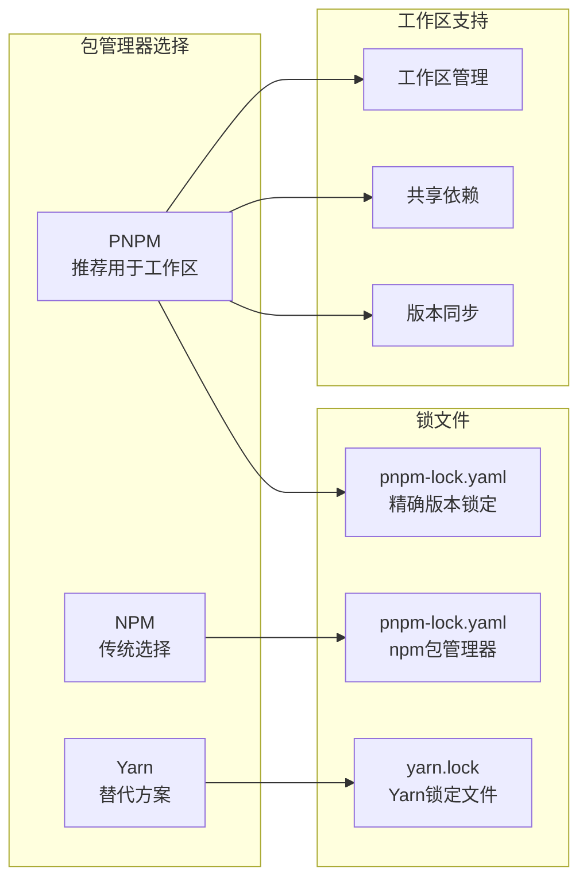

**图表来源**
- [apps/DaoMind/pnpm-workspace.yaml](file://apps/DaoMind/pnpm-workspace.yaml)
- [apps/DaoMind/pnpm-lock.yaml](file://apps/DaoMind/pnpm-lock.yaml)

### 依赖版本管理

| 依赖类型 | 管理方式 | 版本控制 |
|----------|----------|----------|
| 生产依赖 | semver范围 | 语义化版本 |
| 开发依赖 | 精确版本 | 固定版本 |
| 工作区依赖 | 相对路径 | 本地链接 |
| 工具依赖 | 最小版本 | 最低兼容版本 |

**章节来源**
- [apps/DaoMind/pnpm-workspace.yaml](file://apps/DaoMind/pnpm-workspace.yaml)
- [apps/DaoMind/pnpm-lock.yaml](file://apps/DaoMind/pnpm-lock.yaml)

## 性能考虑

### 开发服务器性能优化

1. **模块解析优化**
   - 使用路径别名减少解析时间
   - 配置合理的模块解析顺序
   - 避免不必要的模块导入

2. **缓存策略**
   - 利用浏览器缓存机制
   - 配置适当的缓存头
   - 启用Gzip压缩

3. **构建优化**
   - 分析包大小和依赖关系
   - 实施代码分割策略
   - 优化第三方库加载

### 生产环境性能

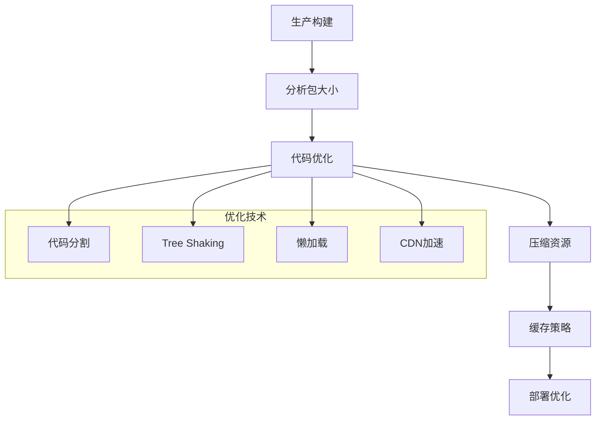

## 故障排除指南

### 开发环境搭建检查清单

#### 基础环境检查

| 检查项 | 描述 | 检查方法 | 通过标准 |
|--------|------|----------|----------|
| Node.js版本 | 检查Node.js版本是否符合要求 | `node --version` | 18.x系列 |
| Git安装 | 确认Git已正确安装 | `git --version` | 可用且正常 |
| 权限检查 | 验证文件系统权限 | `ls -la` | 读写权限正常 |
| 网络连接 | 测试npm registry访问 | `ping registry.npmjs.org` | 连接正常 |

#### 依赖安装检查

| 检查项 | 描述 | 检查方法 | 通过标准 |
|--------|------|----------|----------|
| 包管理器 | 选择合适的包管理器 | `pnpm --version` | 正常安装 |
| 缓存清理 | 清理损坏的缓存 | `pnpm store prune` | 缓存清理完成 |
| 锁文件 | 检查锁文件完整性 | `cat pnpm-lock.yaml` | 无语法错误 |
| 工作区 | 验证工作区配置 | `pnpm workspaces list` | 工作区正常 |

#### 开发服务器检查

| 检查项 | 描述 | 检查方法 | 通过标准 |
|--------|------|----------|----------|
| 端口占用 | 检查端口是否被占用 | `netstat -an | grep :5173` | 端口可用 |
| 热重载 | 验证热重载功能 | 修改文件观察变化 | 热重载正常 |
| 路径别名 | 测试路径别名解析 | 导入模块验证 | 路径解析正确 |
| 插件加载 | 确认插件正常加载 | 查看控制台日志 | 无插件错误 |

### 常见问题及解决方案

#### Node.js版本不兼容

**问题症状**
- 安装依赖时报错
- 运行时出现语法错误
- 构建过程失败

**诊断步骤**
1. 检查当前Node.js版本
2. 对比项目要求的版本范围
3. 查看CI/CD配置中的Node.js版本

**解决方案**
```bash
# 升级到推荐的Node.js版本
# 使用nvm管理Node.js版本
nvm install 18.18.0
nvm use 18.18.0

# 验证版本
node --version
```

**预防措施**
- 在项目根目录添加.nvmrc文件
- 使用GitHub Actions自动检查Node.js版本
- 在README中明确版本要求

#### 依赖安装失败

**问题症状**
- npm install报错
- pnpm install卡住
- 依赖版本冲突

**诊断步骤**
1. 清理缓存和node_modules
2. 检查网络连接和代理设置
3. 验证package.json语法
4. 检查锁文件完整性

**解决方案**
```bash
# 清理环境
rm -rf node_modules
rm -rf pnpm-lock.yaml
rm -rf ~/.pnpm-store

# 重新安装
pnpm install --frozen-lockfile

# 或使用npm
npm ci
```

**预防措施**
- 使用frozen-lockfile确保依赖一致性
- 定期更新依赖版本
- 在CI中启用依赖缓存

#### TypeScript编译错误

**问题症状**
- 编译时报类型错误
- 导入模块失败
- 配置文件语法错误

**诊断步骤**
1. 检查tsconfig.json配置
2. 验证TypeScript版本兼容性
3. 分析具体的编译错误信息

**解决方案**
```bash
# 清理TypeScript缓存
rm -rf node_modules/.vite
rm -rf tsconfig.app.tsbuildinfo
rm -rf tsconfig.node.tsbuildinfo

# 重新编译
pnpm type-check
```

**预防措施**
- 定期更新TypeScript版本
- 使用严格的类型检查选项
- 在PR中包含类型检查

#### Vite构建问题

**问题症状**
- 开发服务器启动失败
- 热重载不工作
- 路径别名解析错误

**诊断步骤**
1. 检查vite.config.ts配置
2. 验证插件安装和配置
3. 检查端口占用情况

**解决方案**
```bash
# 清理Vite缓存
rm -rf node_modules/.vite

# 重启开发服务器
pnpm dev

# 检查端口占用
lsof -i :5173
```

**预防措施**
- 使用默认的Vite配置作为基线
- 定期更新Vite和相关插件
- 在开发环境中禁用不必要的插件

#### 环境变量配置错误

**问题症状**
- API请求失败
- 功能模块加载异常
- 环境切换问题

**诊断步骤**
1. 检查.env文件是否存在
2. 验证环境变量命名规范
3. 确认变量值的有效性

**解决方案**
```bash
# 复制示例环境文件
cp .env.example .env

# 设置正确的环境变量
echo "VITE_API_BASE_URL=http://localhost:8080" >> .env

# 重启开发服务器
pnpm dev
```

**预防措施**
- 在.gitignore中排除.env文件
- 提供完整的.env.example模板
- 在CI中验证环境变量配置

#### Docker容器化问题

**问题症状**
- 容器启动失败
- 健康检查超时
- 端口映射冲突

**诊断步骤**
1. 检查Podman安装和版本
2. 验证Dockerfile和配置文件
3. 查看容器日志

**解决方案**
```bash
# 检查Podman状态
podman info

# 查看容器状态
podman ps -a

# 查看容器日志
podman logs agentpit-frontend

# 重建容器
podman-compose down
podman-compose up -d
```

**预防措施**
- 在部署脚本中添加错误处理
- 配置适当的健康检查
- 设置合理的资源限制

### 端到端故障排除流程

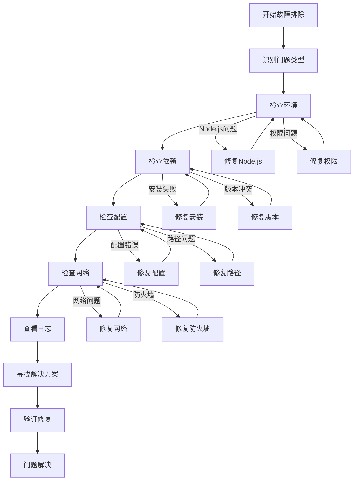

## 结论

DAOApps项目的开发环境相对复杂，涉及多个应用和工具的协同工作。通过建立完善的故障排除流程和预防措施，可以显著提高开发效率和环境稳定性。

关键要点包括：
- 严格控制Node.js版本和依赖版本
- 建立标准化的开发环境配置
- 实施自动化的问题检测和修复
- 提供详细的文档和最佳实践指导

建议团队定期审查和更新这些指南，确保与项目的发展保持同步。

## 附录

### 快速参考表

#### 开发环境快速检查

| 任务 | 命令 | 检查要点 |
|------|------|----------|
| 检查Node.js版本 | `node --version` | 确保18.x系列 |
| 检查包管理器 | `pnpm --version` | 确保正确安装 |
| 清理缓存 | `pnpm store prune` | 清理损坏缓存 |
| 重新安装依赖 | `pnpm install` | 确保依赖完整 |
| 启动开发服务器 | `pnpm dev` | 确保服务器正常运行 |
| 运行类型检查 | `pnpm type-check` | 确保类型安全 |
| 运行测试 | `pnpm test` | 确保测试通过 |

#### 常用故障排除命令

```bash
# 清理开发环境
rm -rf node_modules
rm -rf dist
rm -rf .vite
rm -rf tsconfig*.tsbuildinfo

# 清理缓存
pnpm store prune
rm -rf ~/.pnpm-store

# 检查端口占用
lsof -i :5173
netstat -an | grep :5173

# 查看系统信息
node -v
pnpm -v
npm -v

# 检查Git状态
git status
git log --oneline -5
```

#### 环境变量模板

```bash
# .env文件模板
VITE_API_BASE_URL=http://localhost:8080/api
VITE_USE_MOCK_API=true
VITE_API_TIMEOUT=30000
VITE_DEEP_RESEARCH_PATH=
VITE_FLEXLOOP_PATH=
```