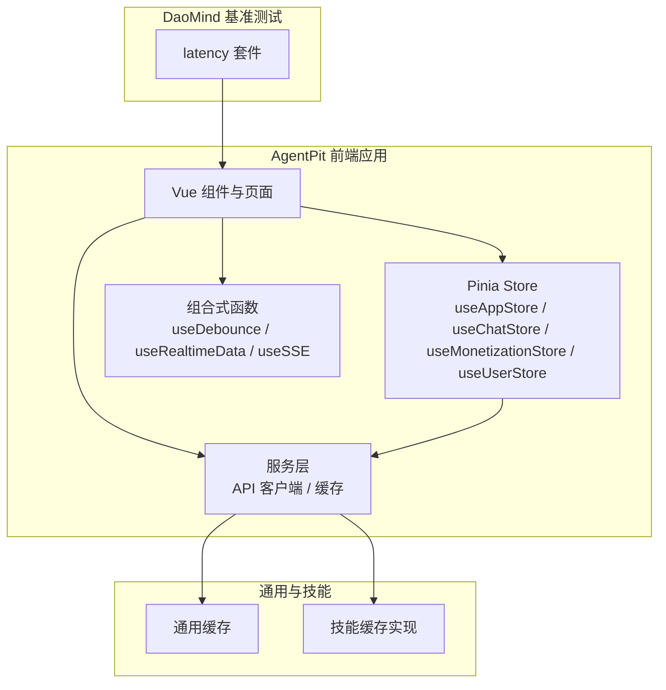
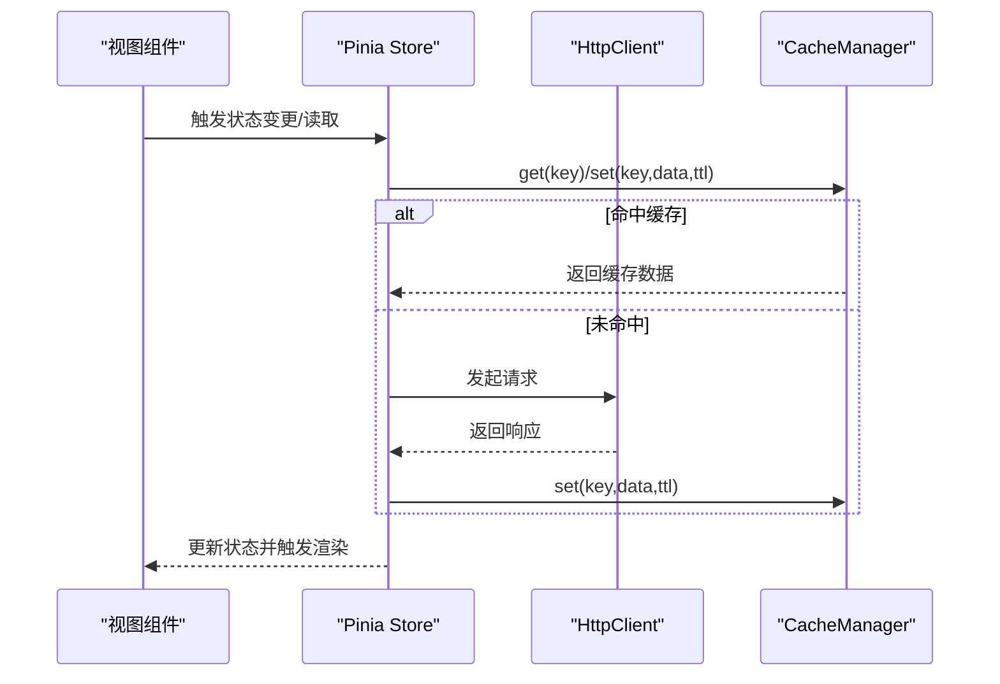
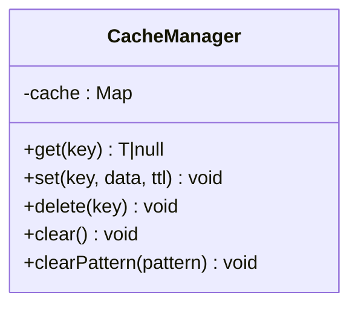
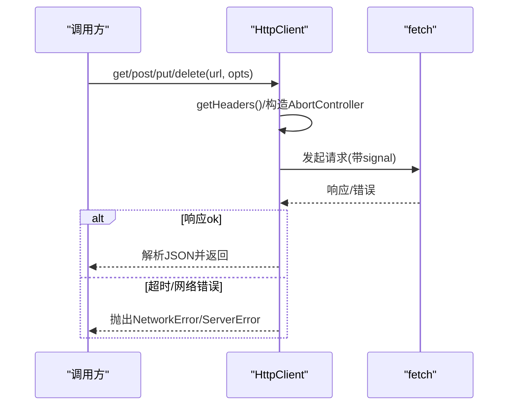
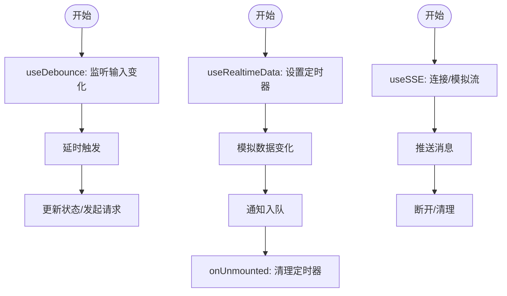
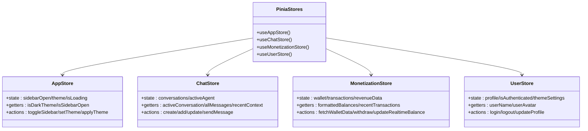
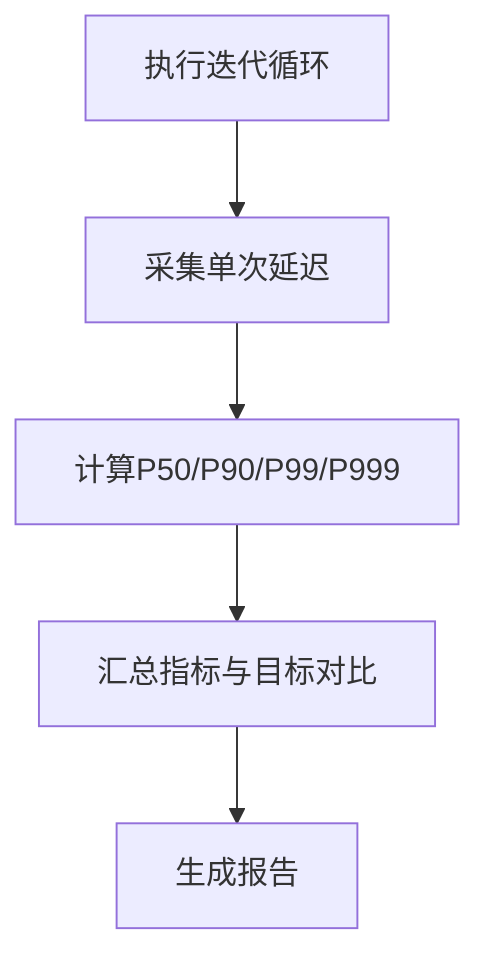
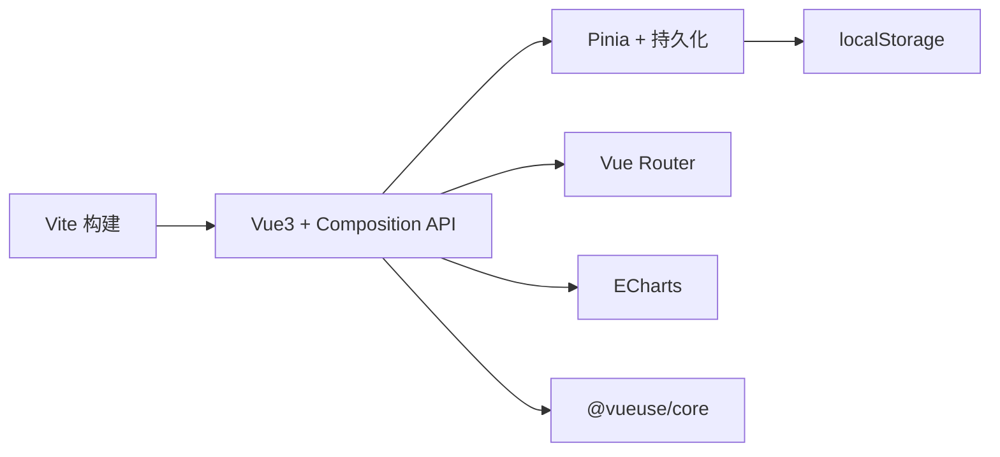

# 性能问题

<cite>
**本文引用的文件**
- [apps/AgentPit/src/services/cache.ts](file://apps/AgentPit/src/services/cache.ts)
- [src/services/cache.ts](file://src/services/cache.ts)
- [apps/AgentPit/src/services/api/client.ts](file://apps/AgentPit/src/services/api/client.ts)
- [apps/AgentPit/src/composables/useDebounce.ts](file://apps/AgentPit/src/composables/useDebounce.ts)
- [apps/AgentPit/src/composables/useRealtimeData.ts](file://apps/AgentPit/src/composables/useRealtimeData.ts)
- [apps/AgentPit/src/composables/useSSE.ts](file://apps/AgentPit/src/composables/useSSE.ts)
- [apps/AgentPit/src/stores/index.ts](file://apps/AgentPit/src/stores/index.ts)
- [apps/AgentPit/src/stores/useAppStore.ts](file://apps/AgentPit/src/stores/useAppStore.ts)
- [apps/AgentPit/src/stores/useChatStore.ts](file://apps/AgentPit/src/stores/useChatStore.ts)
- [apps/AgentPit/src/stores/useMonetizationStore.ts](file://apps/AgentPit/src/stores/useMonetizationStore.ts)
- [apps/AgentPit/src/stores/useUserStore.ts](file://apps/AgentPit/src/stores/useUserStore.ts)
- [.trae/docs/performance-baseline.md](file://.trae/docs/performance-baseline.md)
- [apps/AgentPit/package.json](file://apps/AgentPit/package.json)
- [apps/DaoMind/packages/daoBenchmark/src/suites/latency.ts](file://apps/DaoMind/packages/daoBenchmark/src/suites/latency.ts)
- [skills/daoSkilLs/skills/alipay-payment-integration/modules/utils/cache-implementation.md](file://skills/daoSkilLs/skills/alipay-payment-integration/modules/utils/cache-implementation.md)
</cite>

## 目录
1. [简介](#简介)
2. [项目结构](#项目结构)
3. [核心组件](#核心组件)
4. [架构总览](#架构总览)
5. [详细组件分析](#详细组件分析)
6. [依赖分析](#依赖分析)
7. [性能考虑](#性能考虑)
8. [故障排查指南](#故障排查指南)
9. [结论](#结论)
10. [附录](#附录)

## 简介
本指南面向DAOApps项目，聚焦于性能问题的诊断与优化，覆盖内存泄漏、渲染性能、API响应延迟、数据库查询慢等常见瓶颈，并提供性能监控工具使用、性能分析技术与优化策略。针对Vue组件、状态管理、缓存与网络请求，给出可落地的实施方案；同时提供性能基准测试方法与持续性能监控的最佳实践。

## 项目结构
DAOApps采用多应用与多包并行的组织方式，AgentPit作为前端主应用，包含服务层、缓存、状态管理、组合式函数与各业务store；DaoMind提供基准测试套件；部分技能模块包含缓存实现参考；另有通用服务层cache与API客户端。

**图表来源**
- [apps/AgentPit/src/stores/index.ts](file://apps/AgentPit/src/stores/index.ts)
- [apps/AgentPit/src/services/cache.ts](file://apps/AgentPit/src/services/cache.ts)
- [apps/AgentPit/src/services/api/client.ts](file://apps/AgentPit/src/services/api/client.ts)
- [apps/AgentPit/src/composables/useDebounce.ts](file://apps/AgentPit/src/composables/useDebounce.ts)
- [apps/AgentPit/src/composables/useRealtimeData.ts](file://apps/AgentPit/src/composables/useRealtimeData.ts)
- [apps/AgentPit/src/composables/useSSE.ts](file://apps/AgentPit/src/composables/useSSE.ts)
- [apps/DaoMind/packages/daoBenchmark/src/suites/latency.ts](file://apps/DaoMind/packages/daoBenchmark/src/suites/latency.ts)
- [skills/daoSkilLs/skills/alipay-payment-integration/modules/utils/cache-implementation.md](file://skills/daoSkilLs/skills/alipay-payment-integration/modules/utils/cache-implementation.md)

**章节来源**
- [apps/AgentPit/src/stores/index.ts](file://apps/AgentPit/src/stores/index.ts)
- [apps/AgentPit/package.json](file://apps/AgentPit/package.json)

## 核心组件
- 缓存管理：提供内存级TTL缓存，支持按正则清理，适合高频读取的数据。
- API客户端：封装fetch请求、超时控制与错误分类，统一鉴权头注入。
- 组合式函数：防抖、实时数据模拟、SSE模拟，用于交互与数据流优化。
- 状态管理：Pinia stores承载应用状态，持久化插件配合本地存储，减少重渲染与重复请求。
- 基准测试：延迟百分位统计，便于建立性能目标与回归验证。

**章节来源**
- [apps/AgentPit/src/services/cache.ts](file://apps/AgentPit/src/services/cache.ts)
- [src/services/cache.ts](file://src/services/cache.ts)
- [apps/AgentPit/src/services/api/client.ts](file://apps/AgentPit/src/services/api/client.ts)
- [apps/AgentPit/src/composables/useDebounce.ts](file://apps/AgentPit/src/composables/useDebounce.ts)
- [apps/AgentPit/src/composables/useRealtimeData.ts](file://apps/AgentPit/src/composables/useRealtimeData.ts)
- [apps/AgentPit/src/composables/useSSE.ts](file://apps/AgentPit/src/composables/useSSE.ts)
- [apps/AgentPit/src/stores/index.ts](file://apps/AgentPit/src/stores/index.ts)
- [apps/DaoMind/packages/daoBenchmark/src/suites/latency.ts](file://apps/DaoMind/packages/daoBenchmark/src/suites/latency.ts)

## 架构总览
前端应用通过组合式函数与store协调UI渲染与数据流；服务层负责网络请求与缓存；基准测试贯穿开发与CI，形成闭环。

**图表来源**
- [apps/AgentPit/src/services/cache.ts](file://apps/AgentPit/src/services/cache.ts)
- [apps/AgentPit/src/services/api/client.ts](file://apps/AgentPit/src/services/api/client.ts)
- [apps/AgentPit/src/stores/useChatStore.ts](file://apps/AgentPit/src/stores/useChatStore.ts)

## 详细组件分析

### 缓存组件分析
- 设计要点
  - TTL过期与LRU淘汰结合，Map存储键值与时间戳，支持按模式批量清理。
  - 提供clear/clearPattern等运维能力，避免长期驻留导致内存压力。
- 性能影响
  - 减少重复网络请求，降低首屏与交互延迟。
  - 需注意缓存键设计与TTL策略，避免命中率低或内存膨胀。
- 优化建议
  - 对热点数据设置更短TTL但更高命中率；对冷数据缩短TTL并启用定期清理。
  - 结合技能模块的内存/磁盘双层缓存思路，实现更大容量与持久化需求。

**图表来源**
- [apps/AgentPit/src/services/cache.ts](file://apps/AgentPit/src/services/cache.ts)
- [src/services/cache.ts](file://src/services/cache.ts)

**章节来源**
- [apps/AgentPit/src/services/cache.ts](file://apps/AgentPit/src/services/cache.ts)
- [src/services/cache.ts](file://src/services/cache.ts)
- [skills/daoSkilLs/skills/alipay-payment-integration/modules/utils/cache-implementation.md](file://skills/daoSkilLs/skills/alipay-payment-integration/modules/utils/cache-implementation.md)

### API客户端与网络优化
- 设计要点
  - 统一鉴权头注入，支持自定义超时与AbortController中断。
  - 错误分类：超时、网络失败、服务端错误，便于差异化处理。
- 性能影响
  - 合理超时与中断可避免长时间挂起，改善用户体验。
  - 与缓存配合可显著降低重复请求。
- 优化建议
  - 为长耗时接口设置更短超时并开启重试；对幂等操作支持去重。
  - 在路由切换/组件卸载时主动取消未完成请求，防止资源泄露。

**图表来源**
- [apps/AgentPit/src/services/api/client.ts](file://apps/AgentPit/src/services/api/client.ts)

**章节来源**
- [apps/AgentPit/src/services/api/client.ts](file://apps/AgentPit/src/services/api/client.ts)

### 组合式函数：防抖、实时数据与SSE
- useDebounce：降低频繁输入/搜索带来的渲染与请求压力。
- useRealtimeData：定时轮询模拟实时数据，注意清理interval与内存泄漏风险。
- useSSE：模拟SSE流，便于观察消息堆积与渲染性能，注意断开时清理定时器。

**图表来源**
- [apps/AgentPit/src/composables/useDebounce.ts](file://apps/AgentPit/src/composables/useDebounce.ts)
- [apps/AgentPit/src/composables/useRealtimeData.ts](file://apps/AgentPit/src/composables/useRealtimeData.ts)
- [apps/AgentPit/src/composables/useSSE.ts](file://apps/AgentPit/src/composables/useSSE.ts)

**章节来源**
- [apps/AgentPit/src/composables/useDebounce.ts](file://apps/AgentPit/src/composables/useDebounce.ts)
- [apps/AgentPit/src/composables/useRealtimeData.ts](file://apps/AgentPit/src/composables/useRealtimeData.ts)
- [apps/AgentPit/src/composables/useSSE.ts](file://apps/AgentPit/src/composables/useSSE.ts)

### 状态管理优化（Pinia）
- 设计要点
  - store持久化：主题、侧边栏等轻量状态持久化，减少初始化成本。
  - getter计算属性化：避免重复计算与无谓渲染。
  - 动作内聚：将读写分离，减少跨store耦合。
- 性能影响
  - 合理拆分store与getter，避免大对象全量订阅。
  - 持久化仅保留必要字段，避免localStorage膨胀。
- 优化建议
  - 对大数组/列表采用分页或懒加载；对高频更新字段拆分store。
  - 使用浅拷贝与不可变更新策略，减少深比较成本。

**图表来源**
- [apps/AgentPit/src/stores/index.ts](file://apps/AgentPit/src/stores/index.ts)
- [apps/AgentPit/src/stores/useAppStore.ts](file://apps/AgentPit/src/stores/useAppStore.ts)
- [apps/AgentPit/src/stores/useChatStore.ts](file://apps/AgentPit/src/stores/useChatStore.ts)
- [apps/AgentPit/src/stores/useMonetizationStore.ts](file://apps/AgentPit/src/stores/useMonetizationStore.ts)
- [apps/AgentPit/src/stores/useUserStore.ts](file://apps/AgentPit/src/stores/useUserStore.ts)

**章节来源**
- [apps/AgentPit/src/stores/index.ts](file://apps/AgentPit/src/stores/index.ts)
- [apps/AgentPit/src/stores/useAppStore.ts](file://apps/AgentPit/src/stores/useAppStore.ts)
- [apps/AgentPit/src/stores/useChatStore.ts](file://apps/AgentPit/src/stores/useChatStore.ts)
- [apps/AgentPit/src/stores/useMonetizationStore.ts](file://apps/AgentPit/src/stores/useMonetizationStore.ts)
- [apps/AgentPit/src/stores/useUserStore.ts](file://apps/AgentPit/src/stores/useUserStore.ts)

### 基准测试与延迟分析
- 套件能力
  - 多迭代采样，计算P50/P90/P99/P999延迟，输出平均延迟与目标对比。
- 应用建议
  - 将关键路径（登录、列表加载、消息发送）纳入基准测试。
  - 在CI中固定硬件/网络条件，确保结果可比性。

**图表来源**
- [apps/DaoMind/packages/daoBenchmark/src/suites/latency.ts](file://apps/DaoMind/packages/daoBenchmark/src/suites/latency.ts)

**章节来源**
- [apps/DaoMind/packages/daoBenchmark/src/suites/latency.ts](file://apps/DaoMind/packages/daoBenchmark/src/suites/latency.ts)

## 依赖分析
- 构建与工具链
  - Vite提供快速开发体验与高效打包；Vue3与Composition API利于tree-shaking与按需加载。
- 第三方库
  - Pinia与pinia-plugin-persistedstate用于状态持久化；lodash-es体积较大，可按需引入或替换。
  - ECharts用于图表渲染，注意按需引入与懒加载。
- 性能相关依赖
  - @vueuse/core提供useDebounce等高性能组合式工具。
  - vue-echarts、vue-router等对渲染与导航性能有直接影响。

**图表来源**
- [apps/AgentPit/package.json](file://apps/AgentPit/package.json)

**章节来源**
- [apps/AgentPit/package.json](file://apps/AgentPit/package.json)

## 性能考虑
- 内存泄漏防护
  - 组合式函数中使用onUnmounted清理定时器、EventSource与订阅；store中避免持有DOM引用。
  - 缓存清理策略：定期清理过期键、按模式批量清理，防止Map无限增长。
- 渲染性能
  - 使用computed/guardReactiveEffect减少无效渲染；组件拆分与懒加载；ECharts按需引入与虚拟滚动（如适用）。
- API响应延迟
  - 请求超时与中断、缓存命中、幂等重试；对长列表采用分页与增量加载。
- 数据库查询慢
  - 通过缓存与索引优化；对聚合查询做预计算与物化视图；限制一次性返回数据量。

[本节为通用指导，无需列出具体文件来源]

## 故障排查指南
- 性能监控与基线
  - 使用Web Vitals观测FCP/LCP/CLS；结合Lighthouse生成报告；在CI中自动化执行。
- 日志与可观测性
  - 使用统一Logger记录关键路径耗时与错误；区分级别与模块，便于定位。
- 常见问题定位
  - 高CPU/内存：检查定时器未清理、事件监听未移除、缓存未清理。
  - 渲染卡顿：检查大数组渲染、重复计算、不必要的响应式依赖。
  - 接口慢：检查超时配置、缓存命中、并发请求与重试策略。
- 回归与基线维护
  - 基于DaoMind延迟套件建立目标；在CI中固定环境与数据集，持续对比指标。

**章节来源**
- [.trae/docs/performance-baseline.md](file://.trae/docs/performance-baseline.md)
- [apps/AgentPit/src/composables/useRealtimeData.ts](file://apps/AgentPit/src/composables/useRealtimeData.ts)
- [apps/AgentPit/src/composables/useSSE.ts](file://apps/AgentPit/src/composables/useSSE.ts)
- [apps/AgentPit/src/services/cache.ts](file://apps/AgentPit/src/services/cache.ts)
- [apps/DaoMind/packages/daoBenchmark/src/suites/latency.ts](file://apps/DaoMind/packages/daoBenchmark/src/suites/latency.ts)

## 结论
通过缓存、网络与状态管理的协同优化，以及基准测试与持续监控，DAOApps可在保证功能完整性的同时显著提升性能表现。建议优先落地：缓存命中率提升、请求超时与中断、定时器清理、按需引入与懒加载、以及在CI中固化性能基线。

[本节为总结，无需列出具体文件来源]

## 附录
- 性能基线与监控方案参考：见性能基线文档中的监控与预算章节。
- 技能模块缓存实现参考：内存/磁盘双层缓存与使用流程，可迁移至通用缓存策略。

**章节来源**
- [.trae/docs/performance-baseline.md](file://.trae/docs/performance-baseline.md)
- [skills/daoSkilLs/skills/alipay-payment-integration/modules/utils/cache-implementation.md](file://skills/daoSkilLs/skills/alipay-payment-integration/modules/utils/cache-implementation.md)