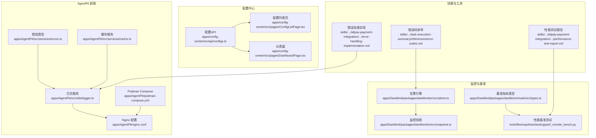
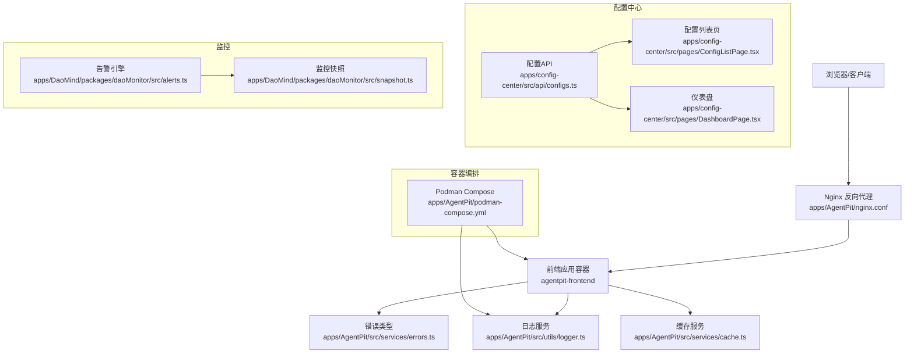
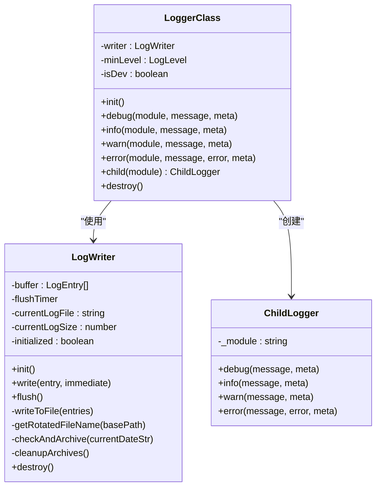
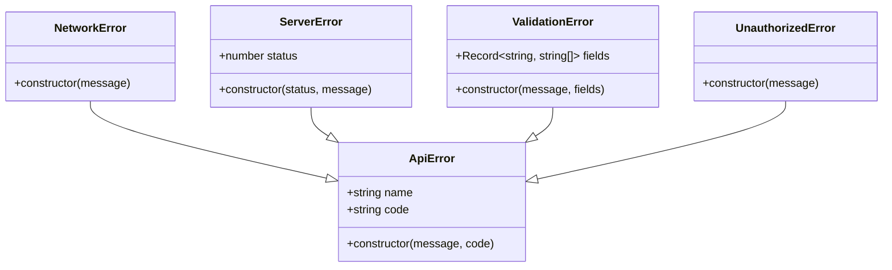
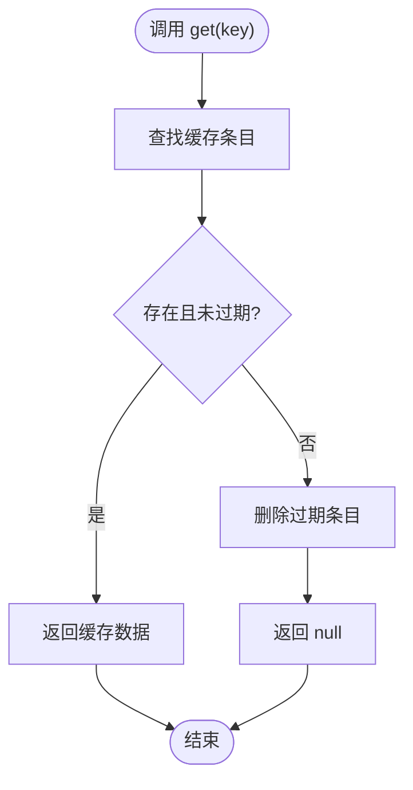
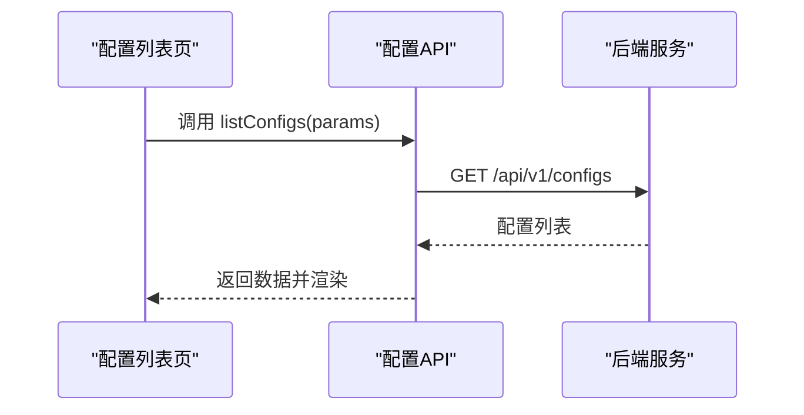
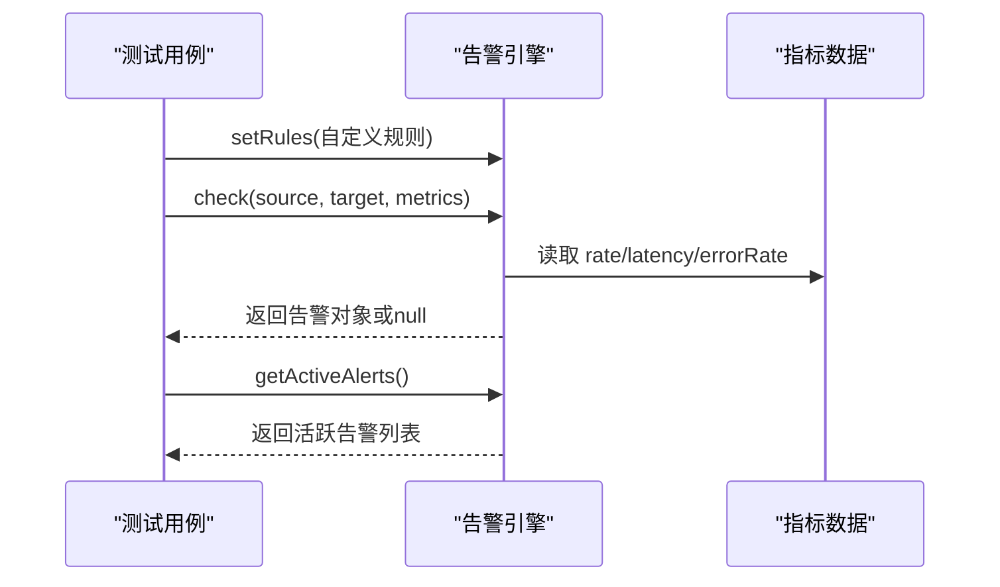
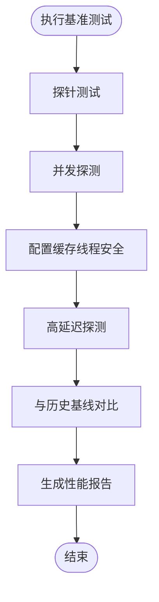
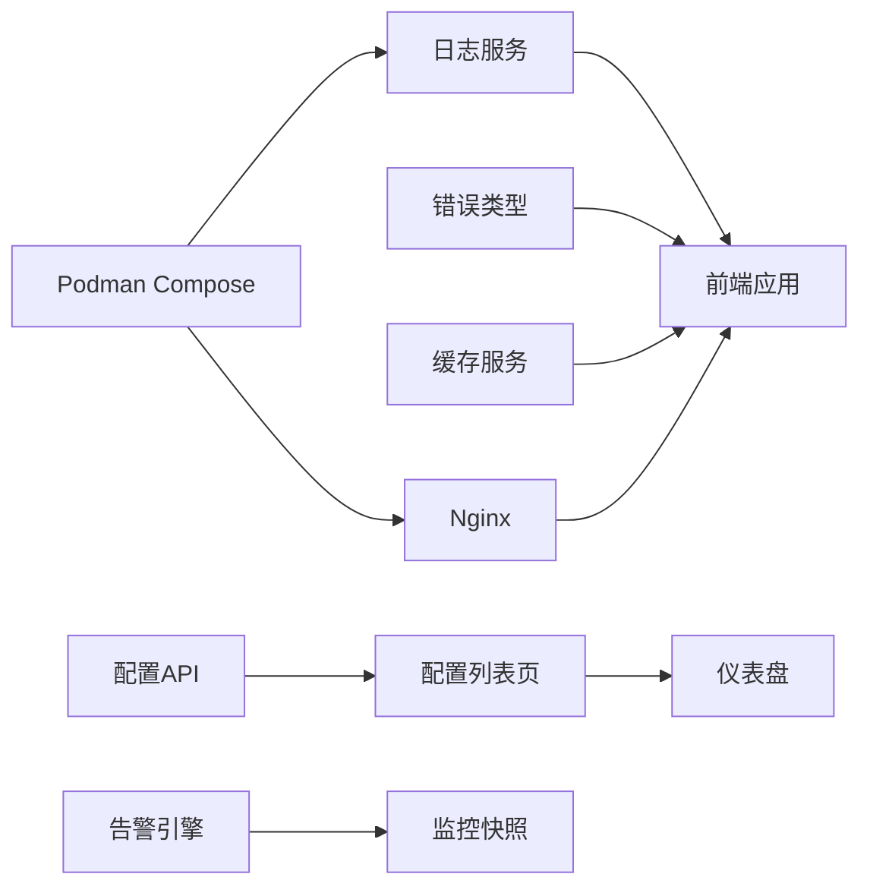

# 故障排除

<cite>
**本文引用的文件**
- [apps/AgentPit/src/utils/logger.ts](file://apps/AgentPit/src/utils/logger.ts)
- [apps/AgentPit/src/services/errors.ts](file://apps/AgentPit/src/services/errors.ts)
- [apps/AgentPit/src/services/cache.ts](file://apps/AgentPit/src/services/cache.ts)
- [src/services/errors.ts](file://src/services/errors.ts)
- [src/services/cache.ts](file://src/services/cache.ts)
- [apps/AgentPit/podman-compose.yml](file://apps/AgentPit/podman-compose.yml)
- [apps/AgentPit/nginx.conf](file://apps/AgentPit/nginx.conf)
- [apps/AgentPit/.dockerignore](file://apps/AgentPit/.dockerignore)
- [apps/config-center/src/api/configs.ts](file://apps/config-center/src/api/configs.ts)
- [apps/config-center/src/pages/DashboardPage.tsx](file://apps/config-center/src/pages/DashboardPage.tsx)
- [apps/config-center/src/pages/ConfigListPage.tsx](file://apps/config-center/src/pages/ConfigListPage.tsx)
- [apps/DaoMind/packages/daoMonitor/src/alerts.ts](file://apps/DaoMind/packages/daoMonitor/src/alerts.ts)
- [apps/DaoMind/packages/daoMonitor/src/snapshot.ts](file://apps/DaoMind/packages/daoMonitor/src/snapshot.ts)
- [apps/DaoMind/tests/test-monitor-system.test.ts](file://apps/DaoMind/tests/test-monitor-system.test.ts)
- [apps/DaoMind/packages/daoNexus/src/connection-manager.ts](file://apps/DaoMind/packages/daoNexus/src/connection-manager.ts)
- [apps/DaoMind/packages/daoBenchmark/src/types.ts](file://apps/DaoMind/packages/daoBenchmark/src/types.ts)
- [tools/flexloop/tests/testing/perf_remote_bench.py](file://tools/flexloop/tests/testing/perf_remote_bench.py)
- [skills/daoSkilLs/skills/alipay-payment-integration/modules/docs/performance-test-report.md](file://skills/daoSkilLs/skills/alipay-payment-integration/modules/docs/performance-test-report.md)
- [skills/daoSkilLs/skills/task-execution-summary/references/error-codes.md](file://skills/daoSkilLs/skills/task-execution-summary/references/error-codes.md)
- [skills/daoSkilLs/skills/alipay-payment-integration/modules/utils/error-handling-implementation.md](file://skills/daoSkilLs/skills/alipay-payment-integration/modules/utils/error-handling-implementation.md)
</cite>

## 目录
1. [简介](#简介)
2. [项目结构](#项目结构)
3. [核心组件](#核心组件)
4. [架构总览](#架构总览)
5. [详细组件分析](#详细组件分析)
6. [依赖关系分析](#依赖关系分析)
7. [性能考量](#性能考量)
8. [故障排除指南](#故障排除指南)
9. [结论](#结论)
10. [附录](#附录)

## 简介
本指南面向DAOApps项目的开发者与运维人员，提供系统化的故障排除方法与实践路径。内容覆盖开发环境问题、运行时错误、性能瓶颈、集成故障、调试工具与日志分析、性能监控、错误代码对照、常见错误模式与预防措施，以及系统恢复、数据修复与灾难恢复策略。文档中的所有技术细节均来自仓库内现有文件，并通过图示与分层讲解帮助不同背景的读者快速定位并解决问题。

## 项目结构
DAOApps采用多应用与多包并行的组织方式，核心模块包括：
- AgentPit前端应用：包含日志、错误与缓存服务，以及容器化与反向代理配置。
- 配置中心：提供配置列表、创建、更新、删除与发布接口。
- DaoMind监控与基准测试：包含告警引擎、快照生成、基准指标类型与测试样例。
- 技能与工具：包含支付技能的性能报告、错误码与错误处理规范，以及FlexLoop的性能基准脚本。

**图表来源**
- [apps/AgentPit/src/utils/logger.ts:1-412](file://apps/AgentPit/src/utils/logger.ts#L1-L412)
- [apps/AgentPit/src/services/errors.ts:1-45](file://apps/AgentPit/src/services/errors.ts#L1-L45)
- [apps/AgentPit/src/services/cache.ts:1-50](file://apps/AgentPit/src/services/cache.ts#L1-L50)
- [apps/AgentPit/nginx.conf:1-68](file://apps/AgentPit/nginx.conf#L1-L68)
- [apps/AgentPit/podman-compose.yml:1-70](file://apps/AgentPit/podman-compose.yml#L1-L70)
- [apps/config-center/src/api/configs.ts:1-32](file://apps/config-center/src/api/configs.ts#L1-L32)
- [apps/config-center/src/pages/ConfigListPage.tsx:1-28](file://apps/config-center/src/pages/ConfigListPage.tsx#L1-L28)
- [apps/config-center/src/pages/DashboardPage.tsx:86-106](file://apps/config-center/src/pages/DashboardPage.tsx#L86-L106)
- [apps/DaoMind/packages/daoMonitor/src/alerts.ts:80-121](file://apps/DaoMind/packages/daoMonitor/src/alerts.ts#L80-L121)
- [apps/DaoMind/packages/daoMonitor/src/snapshot.ts:38-75](file://apps/DaoMind/packages/daoMonitor/src/snapshot.ts#L38-L75)
- [apps/DaoMind/packages/daoBenchmark/src/types.ts:1-28](file://apps/DaoMind/packages/daoBenchmark/src/types.ts#L1-L28)
- [tools/flexloop/tests/testing/perf_remote_bench.py:662-699](file://tools/flexloop/tests/testing/perf_remote_bench.py#L662-L699)
- [skills/daoSkilLs/skills/alipay-payment-integration/modules/docs/performance-test-report.md:58-148](file://skills/daoSkilLs/skills/alipay-payment-integration/modules/docs/performance-test-report.md#L58-L148)
- [skills/daoSkilLs/skills/task-execution-summary/references/error-codes.md:1345-1378](file://skills/daoSkilLs/skills/task-execution-summary/references/error-codes.md#L1345-L1378)
- [skills/daoSkilLs/skills/alipay-payment-integration/modules/utils/error-handling-implementation.md:166-174](file://skills/daoSkilLs/skills/alipay-payment-integration/modules/utils/error-handling-implementation.md#L166-L174)

**章节来源**
- [apps/AgentPit/src/utils/logger.ts:1-412](file://apps/AgentPit/src/utils/logger.ts#L1-L412)
- [apps/AgentPit/src/services/errors.ts:1-45](file://apps/AgentPit/src/services/errors.ts#L1-L45)
- [apps/AgentPit/src/services/cache.ts:1-50](file://apps/AgentPit/src/services/cache.ts#L1-L50)
- [apps/AgentPit/nginx.conf:1-68](file://apps/AgentPit/nginx.conf#L1-L68)
- [apps/AgentPit/podman-compose.yml:1-70](file://apps/AgentPit/podman-compose.yml#L1-L70)
- [apps/config-center/src/api/configs.ts:1-32](file://apps/config-center/src/api/configs.ts#L1-L32)
- [apps/config-center/src/pages/ConfigListPage.tsx:1-28](file://apps/config-center/src/pages/ConfigListPage.tsx#L1-L28)
- [apps/config-center/src/pages/DashboardPage.tsx:86-106](file://apps/config-center/src/pages/DashboardPage.tsx#L86-L106)
- [apps/DaoMind/packages/daoMonitor/src/alerts.ts:80-121](file://apps/DaoMind/packages/daoMonitor/src/alerts.ts#L80-L121)
- [apps/DaoMind/packages/daoMonitor/src/snapshot.ts:38-75](file://apps/DaoMind/packages/daoMonitor/src/snapshot.ts#L38-L75)
- [apps/DaoMind/packages/daoBenchmark/src/types.ts:1-28](file://apps/DaoMind/packages/daoBenchmark/src/types.ts#L1-L28)
- [tools/flexloop/tests/testing/perf_remote_bench.py:662-699](file://tools/flexloop/tests/testing/perf_remote_bench.py#L662-L699)
- [skills/daoSkilLs/skills/alipay-payment-integration/modules/docs/performance-test-report.md:58-148](file://skills/daoSkilLs/skills/alipay-payment-integration/modules/docs/performance-test-report.md#L58-L148)
- [skills/daoSkilLs/skills/task-execution-summary/references/error-codes.md:1345-1378](file://skills/daoSkilLs/skills/task-execution-summary/references/error-codes.md#L1345-L1378)
- [skills/daoSkilLs/skills/alipay-payment-integration/modules/utils/error-handling-implementation.md:166-174](file://skills/daoSkilLs/skills/alipay-payment-integration/modules/utils/error-handling-implementation.md#L166-L174)

## 核心组件
- 日志系统：支持缓冲、轮转、归档、按级别输出与错误堆栈记录，适配开发与生产环境。
- 错误体系：统一的API错误、网络错误、服务器错误、参数校验错误与未授权错误类型。
- 缓存管理：基于Map的内存缓存，支持TTL与模式清理。
- 反向代理与容器化：Nginx配置含健康检查、静态资源缓存、安全头；Podman Compose定义资源限制与健康检查。
- 配置中心：提供配置的增删改查与发布接口，配套前端列表与仪表盘展示。
- 监控与告警：告警规则、活跃告警、告警确认与解决；监控快照生成与历史保留。
- 基准测试：指标类型定义与性能基准脚本，用于对比与回归分析。
- 技能与工具：支付技能性能报告、错误码与错误处理规范，辅助排障与质量门禁。

**章节来源**
- [apps/AgentPit/src/utils/logger.ts:1-412](file://apps/AgentPit/src/utils/logger.ts#L1-L412)
- [apps/AgentPit/src/services/errors.ts:1-45](file://apps/AgentPit/src/services/errors.ts#L1-L45)
- [apps/AgentPit/src/services/cache.ts:1-50](file://apps/AgentPit/src/services/cache.ts#L1-L50)
- [apps/AgentPit/nginx.conf:1-68](file://apps/AgentPit/nginx.conf#L1-L68)
- [apps/AgentPit/podman-compose.yml:1-70](file://apps/AgentPit/podman-compose.yml#L1-L70)
- [apps/config-center/src/api/configs.ts:1-32](file://apps/config-center/src/api/configs.ts#L1-L32)
- [apps/DaoMind/packages/daoMonitor/src/alerts.ts:80-121](file://apps/DaoMind/packages/daoMonitor/src/alerts.ts#L80-L121)
- [apps/DaoMind/packages/daoMonitor/src/snapshot.ts:38-75](file://apps/DaoMind/packages/daoMonitor/src/snapshot.ts#L38-L75)
- [apps/DaoMind/packages/daoBenchmark/src/types.ts:1-28](file://apps/DaoMind/packages/daoBenchmark/src/types.ts#L1-L28)
- [tools/flexloop/tests/testing/perf_remote_bench.py:662-699](file://tools/flexloop/tests/testing/perf_remote_bench.py#L662-L699)
- [skills/daoSkilLs/skills/alipay-payment-integration/modules/docs/performance-test-report.md:58-148](file://skills/daoSkilLs/skills/alipay-payment-integration/modules/docs/performance-test-report.md#L58-L148)
- [skills/daoSkilLs/skills/task-execution-summary/references/error-codes.md:1345-1378](file://skills/daoSkilLs/skills/task-execution-summary/references/error-codes.md#L1345-L1378)
- [skills/daoSkilLs/skills/alipay-payment-integration/modules/utils/error-handling-implementation.md:166-174](file://skills/daoSkilLs/skills/alipay-payment-integration/modules/utils/error-handling-implementation.md#L166-L174)

## 架构总览
下图展示了AgentPit前端、Nginx反向代理、Podman容器编排与日志持久化之间的交互关系，以及配置中心与监控系统的接入点。

**图表来源**
- [apps/AgentPit/nginx.conf:1-68](file://apps/AgentPit/nginx.conf#L1-L68)
- [apps/AgentPit/podman-compose.yml:1-70](file://apps/AgentPit/podman-compose.yml#L1-L70)
- [apps/AgentPit/src/utils/logger.ts:1-412](file://apps/AgentPit/src/utils/logger.ts#L1-L412)
- [apps/AgentPit/src/services/errors.ts:1-45](file://apps/AgentPit/src/services/errors.ts#L1-L45)
- [apps/AgentPit/src/services/cache.ts:1-50](file://apps/AgentPit/src/services/cache.ts#L1-L50)
- [apps/config-center/src/api/configs.ts:1-32](file://apps/config-center/src/api/configs.ts#L1-L32)
- [apps/config-center/src/pages/ConfigListPage.tsx:1-28](file://apps/config-center/src/pages/ConfigListPage.tsx#L1-L28)
- [apps/config-center/src/pages/DashboardPage.tsx:86-106](file://apps/config-center/src/pages/DashboardPage.tsx#L86-L106)
- [apps/DaoMind/packages/daoMonitor/src/alerts.ts:80-121](file://apps/DaoMind/packages/daoMonitor/src/alerts.ts#L80-L121)
- [apps/DaoMind/packages/daoMonitor/src/snapshot.ts:38-75](file://apps/DaoMind/packages/daoMonitor/src/snapshot.ts#L38-L75)

## 详细组件分析

### 组件A：日志系统（Logger）
- 功能要点
  - 支持DEBUG/INFO/WARN/ERROR级别，开发模式默认DEBUG，生产模式默认INFO。
  - 控制台输出与文件写入分离，生产环境异步缓冲与定时刷新。
  - 日志轮转与归档：按日期与大小轮转，归档保留天数与清理天数可配置。
  - 错误对象序列化：自动捕获name/message/stack并写入元数据。
- 排障要点
  - 生产环境日志未落盘：检查writer初始化、flush定时器与文件权限。
  - 日志过大或未轮转：核对maxFileSize、archiveDays与deleteArchiveDays配置。
  - 控制台日志过多：调整minLevel或在开发环境启用更严格的过滤。
- 关键路径
  - 初始化与最小级别：[apps/AgentPit/src/utils/logger.ts:284-295](file://apps/AgentPit/src/utils/logger.ts#L284-L295)
  - 文件写入与轮转：[apps/AgentPit/src/utils/logger.ts:170-209](file://apps/AgentPit/src/utils/logger.ts#L170-L209)
  - 归档与清理：[apps/AgentPit/src/utils/logger.ts:221-268](file://apps/AgentPit/src/utils/logger.ts#L221-L268)

**图表来源**
- [apps/AgentPit/src/utils/logger.ts:279-412](file://apps/AgentPit/src/utils/logger.ts#L279-L412)

**章节来源**
- [apps/AgentPit/src/utils/logger.ts:1-412](file://apps/AgentPit/src/utils/logger.ts#L1-L412)

### 组件B：错误类型与处理
- 统一错误类型
  - ApiError、NetworkError、ServerError、ValidationError、UnauthorizedError。
  - 服务器错误携带HTTP状态码，参数校验错误携带字段级错误数组。
- 排障要点
  - 参数校验失败：检查fields字段映射与前端提示一致性。
  - 网络错误：结合日志与缓存状态判断是否重试或降级。
  - 未授权：核对鉴权流程与令牌有效期。
- 关键路径
  - 错误类型定义：[apps/AgentPit/src/services/errors.ts:1-45](file://apps/AgentPit/src/services/errors.ts#L1-L45)，[src/services/errors.ts:1-45](file://src/services/errors.ts#L1-L45)

**图表来源**
- [apps/AgentPit/src/services/errors.ts:1-45](file://apps/AgentPit/src/services/errors.ts#L1-L45)
- [src/services/errors.ts:1-45](file://src/services/errors.ts#L1-L45)

**章节来源**
- [apps/AgentPit/src/services/errors.ts:1-45](file://apps/AgentPit/src/services/errors.ts#L1-L45)
- [src/services/errors.ts:1-45](file://src/services/errors.ts#L1-L45)

### 组件C：缓存管理
- 功能要点
  - 基于Map的内存缓存，支持TTL过期与正则模式清理。
  - 提供get/set/delete/clear/clearPattern等操作。
- 排障要点
  - 缓存未生效：检查TTL是否过短或键冲突。
  - 内存增长：使用clearPattern按模块清理或缩短TTL。
- 关键路径
  - 缓存实现与清理：[apps/AgentPit/src/services/cache.ts:1-50](file://apps/AgentPit/src/services/cache.ts#L1-L50)，[src/services/cache.ts:1-50](file://src/services/cache.ts#L1-L50)

**图表来源**
- [apps/AgentPit/src/services/cache.ts:11-21](file://apps/AgentPit/src/services/cache.ts#L11-L21)
- [src/services/cache.ts:11-21](file://src/services/cache.ts#L11-L21)

**章节来源**
- [apps/AgentPit/src/services/cache.ts:1-50](file://apps/AgentPit/src/services/cache.ts#L1-L50)
- [src/services/cache.ts:1-50](file://src/services/cache.ts#L1-L50)

### 组件D：配置中心API与前端
- API能力
  - 列表、详情、创建、更新、删除、发布配置。
- 前端功能
  - 支持搜索、筛选、创建对话框、批量操作与空状态。
- 排障要点
  - 列表为空：检查查询参数与后端过滤逻辑。
  - 创建失败：核对必填字段与后端验证规则。
- 关键路径
  - API封装：[apps/config-center/src/api/configs.ts:1-32](file://apps/config-center/src/api/configs.ts#L1-L32)
  - 列表页与仪表盘：[apps/config-center/src/pages/ConfigListPage.tsx:1-28](file://apps/config-center/src/pages/ConfigListPage.tsx#L1-L28)，[apps/config-center/src/pages/DashboardPage.tsx:86-106](file://apps/config-center/src/pages/DashboardPage.tsx#L86-L106)

**图表来源**
- [apps/config-center/src/api/configs.ts:4-12](file://apps/config-center/src/api/configs.ts#L4-L12)
- [apps/config-center/src/pages/ConfigListPage.tsx:23-28](file://apps/config-center/src/pages/ConfigListPage.tsx#L23-L28)

**章节来源**
- [apps/config-center/src/api/configs.ts:1-32](file://apps/config-center/src/api/configs.ts#L1-L32)
- [apps/config-center/src/pages/ConfigListPage.tsx:1-28](file://apps/config-center/src/pages/ConfigListPage.tsx#L1-L28)
- [apps/config-center/src/pages/DashboardPage.tsx:86-106](file://apps/config-center/src/pages/DashboardPage.tsx#L86-L106)

### 组件E：监控与告警
- 告警引擎
  - 规则注册、条件检查、活跃告警、确认与解决。
- 监控快照
  - 生成系统健康度、热力图、流量矢量、仪表与诊断集合。
- 排障要点
  - 告警未触发：检查规则条件与指标阈值。
  - 快照缺失：确认历史容量与生成周期。
- 关键路径
  - 告警规则与状态：[apps/DaoMind/packages/daoMonitor/src/alerts.ts:80-121](file://apps/DaoMind/packages/daoMonitor/src/alerts.ts#L80-L121)
  - 快照生成与历史：[apps/DaoMind/packages/daoMonitor/src/snapshot.ts:38-75](file://apps/DaoMind/packages/daoMonitor/src/snapshot.ts#L38-L75)
  - 测试用例（告警引擎）：[apps/DaoMind/tests/test-monitor-system.test.ts:134-172](file://apps/DaoMind/tests/test-monitor-system.test.ts#L134-L172)

**图表来源**
- [apps/DaoMind/packages/daoMonitor/src/alerts.ts:80-121](file://apps/DaoMind/packages/daoMonitor/src/alerts.ts#L80-L121)
- [apps/DaoMind/packages/daoMonitor/src/snapshot.ts:38-75](file://apps/DaoMind/packages/daoMonitor/src/snapshot.ts#L38-L75)
- [apps/DaoMind/tests/test-monitor-system.test.ts:134-172](file://apps/DaoMind/tests/test-monitor-system.test.ts#L134-L172)

**章节来源**
- [apps/DaoMind/packages/daoMonitor/src/alerts.ts:80-121](file://apps/DaoMind/packages/daoMonitor/src/alerts.ts#L80-L121)
- [apps/DaoMind/packages/daoMonitor/src/snapshot.ts:38-75](file://apps/DaoMind/packages/daoMonitor/src/snapshot.ts#L38-L75)
- [apps/DaoMind/tests/test-monitor-system.test.ts:134-172](file://apps/DaoMind/tests/test-monitor-system.test.ts#L134-L172)

### 组件F：基准测试与性能报告
- 指标类型
  - 基准套件名称、时间戳、指标数组、总体通过状态、持续时间等。
- 性能基准脚本
  - 包含并发探测、高延迟探测、线程安全配置缓存等测试项。
- 排障要点
  - 指标异常：核对测试环境与基线对比。
  - 并发瓶颈：关注吞吐与错误数变化。
- 关键路径
  - 指标类型定义：[apps/DaoMind/packages/daoBenchmark/src/types.ts:1-28](file://apps/DaoMind/packages/daoBenchmark/src/types.ts#L1-L28)
  - 基准测试执行：[tools/flexloop/tests/testing/perf_remote_bench.py:662-699](file://tools/flexloop/tests/testing/perf_remote_bench.py#L662-L699)
  - 支付技能性能报告：[skills/daoSkilLs/skills/alipay-payment-integration/modules/docs/performance-test-report.md:58-148](file://skills/daoSkilLs/skills/alipay-payment-integration/modules/docs/performance-test-report.md#L58-L148)

**图表来源**
- [apps/DaoMind/packages/daoBenchmark/src/types.ts:1-28](file://apps/DaoMind/packages/daoBenchmark/src/types.ts#L1-L28)
- [tools/flexloop/tests/testing/perf_remote_bench.py:662-699](file://tools/flexloop/tests/testing/perf_remote_bench.py#L662-L699)
- [skills/daoSkilLs/skills/alipay-payment-integration/modules/docs/performance-test-report.md:58-148](file://skills/daoSkilLs/skills/alipay-payment-integration/modules/docs/performance-test-report.md#L58-L148)

**章节来源**
- [apps/DaoMind/packages/daoBenchmark/src/types.ts:1-28](file://apps/DaoMind/packages/daoBenchmark/src/types.ts#L1-L28)
- [tools/flexloop/tests/testing/perf_remote_bench.py:662-699](file://tools/flexloop/tests/testing/perf_remote_bench.py#L662-L699)
- [skills/daoSkilLs/skills/alipay-payment-integration/modules/docs/performance-test-report.md:58-148](file://skills/daoSkilLs/skills/alipay-payment-integration/modules/docs/performance-test-report.md#L58-L148)

## 依赖关系分析
- 组件耦合
  - 日志服务被前端与各业务模块依赖；错误类型与缓存服务作为通用基础设施被多模块复用。
  - 配置中心API与前端页面强耦合，仪表盘依赖列表数据聚合。
  - 监控与告警相互协作，快照为告警提供输入。
- 外部依赖
  - Nginx负责静态资源与健康检查；Podman Compose负责容器资源限制与健康检查。
  - 技能与工具模块提供性能与错误处理参考。

**图表来源**
- [apps/AgentPit/src/utils/logger.ts:1-412](file://apps/AgentPit/src/utils/logger.ts#L1-L412)
- [apps/AgentPit/src/services/errors.ts:1-45](file://apps/AgentPit/src/services/errors.ts#L1-L45)
- [apps/AgentPit/src/services/cache.ts:1-50](file://apps/AgentPit/src/services/cache.ts#L1-L50)
- [apps/AgentPit/nginx.conf:1-68](file://apps/AgentPit/nginx.conf#L1-L68)
- [apps/AgentPit/podman-compose.yml:1-70](file://apps/AgentPit/podman-compose.yml#L1-L70)
- [apps/config-center/src/api/configs.ts:1-32](file://apps/config-center/src/api/configs.ts#L1-L32)
- [apps/config-center/src/pages/ConfigListPage.tsx:1-28](file://apps/config-center/src/pages/ConfigListPage.tsx#L1-L28)
- [apps/config-center/src/pages/DashboardPage.tsx:86-106](file://apps/config-center/src/pages/DashboardPage.tsx#L86-L106)
- [apps/DaoMind/packages/daoMonitor/src/alerts.ts:80-121](file://apps/DaoMind/packages/daoMonitor/src/alerts.ts#L80-L121)
- [apps/DaoMind/packages/daoMonitor/src/snapshot.ts:38-75](file://apps/DaoMind/packages/daoMonitor/src/snapshot.ts#L38-L75)

**章节来源**
- [apps/AgentPit/src/utils/logger.ts:1-412](file://apps/AgentPit/src/utils/logger.ts#L1-L412)
- [apps/AgentPit/src/services/errors.ts:1-45](file://apps/AgentPit/src/services/errors.ts#L1-L45)
- [apps/AgentPit/src/services/cache.ts:1-50](file://apps/AgentPit/src/services/cache.ts#L1-L50)
- [apps/AgentPit/nginx.conf:1-68](file://apps/AgentPit/nginx.conf#L1-L68)
- [apps/AgentPit/podman-compose.yml:1-70](file://apps/AgentPit/podman-compose.yml#L1-L70)
- [apps/config-center/src/api/configs.ts:1-32](file://apps/config-center/src/api/configs.ts#L1-L32)
- [apps/config-center/src/pages/ConfigListPage.tsx:1-28](file://apps/config-center/src/pages/ConfigListPage.tsx#L1-L28)
- [apps/config-center/src/pages/DashboardPage.tsx:86-106](file://apps/config-center/src/pages/DashboardPage.tsx#L86-L106)
- [apps/DaoMind/packages/daoMonitor/src/alerts.ts:80-121](file://apps/DaoMind/packages/daoMonitor/src/alerts.ts#L80-L121)
- [apps/DaoMind/packages/daoMonitor/src/snapshot.ts:38-75](file://apps/DaoMind/packages/daoMonitor/src/snapshot.ts#L38-L75)

## 性能考量
- 缓存与I/O
  - 使用内存缓存降低后端压力；日志缓冲与定时刷新避免频繁I/O。
- 反向代理优化
  - Gzip压缩、静态资源长期缓存、健康检查端点与安全头配置。
- 容器资源限制
  - CPU与内存上限、只读文件系统与非root运行，提升稳定性。
- 基准测试与回归
  - 通过基准脚本与性能报告对比优化前后指标，识别瓶颈。

**章节来源**
- [apps/AgentPit/src/services/cache.ts:1-50](file://apps/AgentPit/src/services/cache.ts#L1-L50)
- [apps/AgentPit/src/utils/logger.ts:134-160](file://apps/AgentPit/src/utils/logger.ts#L134-L160)
- [apps/AgentPit/nginx.conf:10-25](file://apps/AgentPit/nginx.conf#L10-L25)
- [apps/AgentPit/podman-compose.yml:39-69](file://apps/AgentPit/podman-compose.yml#L39-L69)
- [tools/flexloop/tests/testing/perf_remote_bench.py:662-699](file://tools/flexloop/tests/testing/perf_remote_bench.py#L662-L699)
- [skills/daoSkilLs/skills/alipay-payment-integration/modules/docs/performance-test-report.md:58-148](file://skills/daoSkilLs/skills/alipay-payment-integration/modules/docs/performance-test-report.md#L58-L148)

## 故障排除指南

### 开发环境问题
- 症状：本地无法启动或构建失败
  - 检查依赖安装与环境变量，确认日志目录可写。
  - 参考路径：[apps/AgentPit/.dockerignore:1-39](file://apps/AgentPit/.dockerignore#L1-L39)
- 症状：日志不输出或输出异常
  - 核对开发/生产模式下的最小日志级别与输出目标。
  - 参考路径：[apps/AgentPit/src/utils/logger.ts:284-295](file://apps/AgentPit/src/utils/logger.ts#L284-L295)

**章节来源**
- [apps/AgentPit/.dockerignore:1-39](file://apps/AgentPit/.dockerignore#L1-L39)
- [apps/AgentPit/src/utils/logger.ts:284-295](file://apps/AgentPit/src/utils/logger.ts#L284-L295)

### 运行时错误
- 症状：接口报错或参数校验失败
  - 查看错误类型与字段级错误，前端对应显示并收集反馈。
  - 参考路径：[apps/AgentPit/src/services/errors.ts:1-45](file://apps/AgentPit/src/services/errors.ts#L1-L45)
- 症状：网络异常或超时
  - 结合日志与缓存状态判断是否重试或降级。
  - 参考路径：[apps/AgentPit/src/services/errors.ts:12-17](file://apps/AgentPit/src/services/errors.ts#L12-L17)，[apps/AgentPit/src/services/cache.ts:1-50](file://apps/AgentPit/src/services/cache.ts#L1-L50)

**章节来源**
- [apps/AgentPit/src/services/errors.ts:1-45](file://apps/AgentPit/src/services/errors.ts#L1-L45)
- [apps/AgentPit/src/services/cache.ts:1-50](file://apps/AgentPit/src/services/cache.ts#L1-L50)

### 性能瓶颈
- 症状：响应时间长、CPU/内存占用高
  - 使用基准测试脚本定位并发与高延迟场景下的瓶颈。
  - 参考路径：[tools/flexloop/tests/testing/perf_remote_bench.py:662-699](file://tools/flexloop/tests/testing/perf_remote_bench.py#L662-L699)
- 症状：缓存命中率低
  - 调整TTL与清理策略，必要时增加预加载与智能缓存。
  - 参考路径：[skills/daoSkilLs/skills/alipay-payment-integration/modules/docs/performance-test-report.md:142-148](file://skills/daoSkilLs/skills/alipay-payment-integration/modules/docs/performance-test-report.md#L142-L148)，[apps/AgentPit/src/services/cache.ts:1-50](file://apps/AgentPit/src/services/cache.ts#L1-L50)

**章节来源**
- [tools/flexloop/tests/testing/perf_remote_bench.py:662-699](file://tools/flexloop/tests/testing/perf_remote_bench.py#L662-L699)
- [skills/daoSkilLs/skills/alipay-payment-integration/modules/docs/performance-test-report.md:142-148](file://skills/daoSkilLs/skills/alipay-payment-integration/modules/docs/performance-test-report.md#L142-L148)
- [apps/AgentPit/src/services/cache.ts:1-50](file://apps/AgentPit/src/services/cache.ts#L1-L50)

### 集成故障
- 症状：配置中心接口异常
  - 检查API参数与后端验证规则，确认列表页与仪表盘的数据流。
  - 参考路径：[apps/config-center/src/api/configs.ts:1-32](file://apps/config-center/src/api/configs.ts#L1-L32)，[apps/config-center/src/pages/ConfigListPage.tsx:1-28](file://apps/config-center/src/pages/ConfigListPage.tsx#L1-L28)
- 症状：监控告警未触发或快照缺失
  - 核查规则条件、指标阈值与历史容量。
  - 参考路径：[apps/DaoMind/packages/daoMonitor/src/alerts.ts:80-121](file://apps/DaoMind/packages/daoMonitor/src/alerts.ts#L80-L121)，[apps/DaoMind/packages/daoMonitor/src/snapshot.ts:38-75](file://apps/DaoMind/packages/daoMonitor/src/snapshot.ts#L38-L75)

**章节来源**
- [apps/config-center/src/api/configs.ts:1-32](file://apps/config-center/src/api/configs.ts#L1-L32)
- [apps/config-center/src/pages/ConfigListPage.tsx:1-28](file://apps/config-center/src/pages/ConfigListPage.tsx#L1-L28)
- [apps/DaoMind/packages/daoMonitor/src/alerts.ts:80-121](file://apps/DaoMind/packages/daoMonitor/src/alerts.ts#L80-L121)
- [apps/DaoMind/packages/daoMonitor/src/snapshot.ts:38-75](file://apps/DaoMind/packages/daoMonitor/src/snapshot.ts#L38-L75)

### 调试工具与日志分析
- 日志级别与记录
  - DEBUG/INFO/WARN/ERROR，生产环境建议从INFO起步，必要时临时降级至DEBUG。
  - 参考路径：[skills/daoSkilLs/skills/alipay-payment-integration/modules/utils/error-handling-implementation.md:166-174](file://skills/daoSkilLs/skills/alipay-payment-integration/modules/utils/error-handling-implementation.md#L166-L174)
- 日志落盘与轮转
  - 检查writer初始化、flush定时器、文件大小阈值与归档策略。
  - 参考路径：[apps/AgentPit/src/utils/logger.ts:108-132](file://apps/AgentPit/src/utils/logger.ts#L108-L132)，[apps/AgentPit/src/utils/logger.ts:170-209](file://apps/AgentPit/src/utils/logger.ts#L170-L209)，[apps/AgentPit/src/utils/logger.ts:221-268](file://apps/AgentPit/src/utils/logger.ts#L221-L268)

**章节来源**
- [skills/daoSkilLs/skills/alipay-payment-integration/modules/utils/error-handling-implementation.md:166-174](file://skills/daoSkilLs/skills/alipay-payment-integration/modules/utils/error-handling-implementation.md#L166-L174)
- [apps/AgentPit/src/utils/logger.ts:108-132](file://apps/AgentPit/src/utils/logger.ts#L108-L132)
- [apps/AgentPit/src/utils/logger.ts:170-209](file://apps/AgentPit/src/utils/logger.ts#L170-L209)
- [apps/AgentPit/src/utils/logger.ts:221-268](file://apps/AgentPit/src/utils/logger.ts#L221-L268)

### 性能监控方法
- 指标采集与快照
  - 通过监控快照生成系统健康度、热力图与诊断集合。
  - 参考路径：[apps/DaoMind/packages/daoMonitor/src/snapshot.ts:38-75](file://apps/DaoMind/packages/daoMonitor/src/snapshot.ts#L38-L75)
- 告警规则与处理
  - 注册规则、检查告警、确认与解决，定期回顾活跃告警。
  - 参考路径：[apps/DaoMind/packages/daoMonitor/src/alerts.ts:80-121](file://apps/DaoMind/packages/daoMonitor/src/alerts.ts#L80-L121)，[apps/DaoMind/tests/test-monitor-system.test.ts:134-172](file://apps/DaoMind/tests/test-monitor-system.test.ts#L134-L172)

**章节来源**
- [apps/DaoMind/packages/daoMonitor/src/snapshot.ts:38-75](file://apps/DaoMind/packages/daoMonitor/src/snapshot.ts#L38-L75)
- [apps/DaoMind/packages/daoMonitor/src/alerts.ts:80-121](file://apps/DaoMind/packages/daoMonitor/src/alerts.ts#L80-L121)
- [apps/DaoMind/tests/test-monitor-system.test.ts:134-172](file://apps/DaoMind/tests/test-monitor-system.test.ts#L134-L172)

### 错误代码对照表与常见错误模式
- 错误码配置与质量门禁
  - 包含严格模式、部分输出允许、重试策略、通知与质量门禁等配置项。
  - 参考路径：[skills/daoSkilLs/skills/task-execution-summary/references/error-codes.md:1345-1378](file://skills/daoSkilLs/skills/task-execution-summary/references/error-codes.md#L1345-L1378)
- 常见错误模式
  - 参数校验失败、网络超时、服务器内部错误、未授权访问。
  - 参考路径：[apps/AgentPit/src/services/errors.ts:1-45](file://apps/AgentPit/src/services/errors.ts#L1-L45)

**章节来源**
- [skills/daoSkilLs/skills/task-execution-summary/references/error-codes.md:1345-1378](file://skills/daoSkilLs/skills/task-execution-summary/references/error-codes.md#L1345-L1378)
- [apps/AgentPit/src/services/errors.ts:1-45](file://apps/AgentPit/src/services/errors.ts#L1-L45)

### 预防措施
- 缓存策略
  - 合理设置TTL与清理策略，避免内存膨胀。
  - 参考路径：[apps/AgentPit/src/services/cache.ts:1-50](file://apps/AgentPit/src/services/cache.ts#L1-L50)
- 日志与监控
  - 生产环境最小日志级别与缓冲刷新策略，配合Nginx健康检查与容器资源限制。
  - 参考路径：[apps/AgentPit/src/utils/logger.ts:284-295](file://apps/AgentPit/src/utils/logger.ts#L284-L295)，[apps/AgentPit/nginx.conf:27-32](file://apps/AgentPit/nginx.conf#L27-L32)，[apps/AgentPit/podman-compose.yml:39-69](file://apps/AgentPit/podman-compose.yml#L39-L69)
- 配置管理
  - 使用配置中心进行集中治理，发布前进行质量门禁与回滚预案。
  - 参考路径：[apps/config-center/src/api/configs.ts:1-32](file://apps/config-center/src/api/configs.ts#L1-L32)

**章节来源**
- [apps/AgentPit/src/services/cache.ts:1-50](file://apps/AgentPit/src/services/cache.ts#L1-L50)
- [apps/AgentPit/src/utils/logger.ts:284-295](file://apps/AgentPit/src/utils/logger.ts#L284-L295)
- [apps/AgentPit/nginx.conf:27-32](file://apps/AgentPit/nginx.conf#L27-L32)
- [apps/AgentPit/podman-compose.yml:39-69](file://apps/AgentPit/podman-compose.yml#L39-L69)
- [apps/config-center/src/api/configs.ts:1-32](file://apps/config-center/src/api/configs.ts#L1-L32)

### 系统恢复流程
- 前端恢复
  - 重建镜像并重启容器，确认Nginx健康检查端点可用。
  - 参考路径：[apps/AgentPit/podman-compose.yml:55-61](file://apps/AgentPit/podman-compose.yml#L55-L61)，[apps/AgentPit/nginx.conf:27-32](file://apps/AgentPit/nginx.conf#L27-L32)
- 配置恢复
  - 通过配置API恢复或回滚到上一个稳定版本。
  - 参考路径：[apps/config-center/src/api/configs.ts:1-32](file://apps/config-center/src/api/configs.ts#L1-L32)

**章节来源**
- [apps/AgentPit/podman-compose.yml:55-61](file://apps/AgentPit/podman-compose.yml#L55-L61)
- [apps/AgentPit/nginx.conf:27-32](file://apps/AgentPit/nginx.conf#L27-L32)
- [apps/config-center/src/api/configs.ts:1-32](file://apps/config-center/src/api/configs.ts#L1-L32)

### 数据修复与灾难恢复
- 日志与缓存
  - 清理过期日志与缓存，必要时重建缓存索引。
  - 参考路径：[apps/AgentPit/src/utils/logger.ts:221-268](file://apps/AgentPit/src/utils/logger.ts#L221-L268)，[apps/AgentPit/src/services/cache.ts:39-46](file://apps/AgentPit/src/services/cache.ts#L39-L46)
- 监控与告警
  - 重置告警状态并重新评估规则，确保快照历史完整。
  - 参考路径：[apps/DaoMind/packages/daoMonitor/src/alerts.ts:104-116](file://apps/DaoMind/packages/daoMonitor/src/alerts.ts#L104-L116)，[apps/DaoMind/packages/daoMonitor/src/snapshot.ts:54-59](file://apps/DaoMind/packages/daoMonitor/src/snapshot.ts#L54-L59)

**章节来源**
- [apps/AgentPit/src/utils/logger.ts:221-268](file://apps/AgentPit/src/utils/logger.ts#L221-L268)
- [apps/AgentPit/src/services/cache.ts:39-46](file://apps/AgentPit/src/services/cache.ts#L39-L46)
- [apps/DaoMind/packages/daoMonitor/src/alerts.ts:104-116](file://apps/DaoMind/packages/daoMonitor/src/alerts.ts#L104-L116)
- [apps/DaoMind/packages/daoMonitor/src/snapshot.ts:54-59](file://apps/DaoMind/packages/daoMonitor/src/snapshot.ts#L54-L59)

## 结论
本指南基于DAOApps仓库内的实际组件与测试文件，提供了从开发环境到运行时、从性能到集成的全链路故障排除方法。通过统一的日志与错误体系、缓存与反向代理优化、配置中心与监控告警的协同，以及基准测试与性能报告的持续回归，可以有效降低故障发生概率并加速恢复进程。建议在日常运维中固化上述流程与检查清单，形成可追溯、可复现、可改进的排障闭环。

## 附录
- 参考文件清单
  - 日志服务：[apps/AgentPit/src/utils/logger.ts:1-412](file://apps/AgentPit/src/utils/logger.ts#L1-L412)
  - 错误类型：[apps/AgentPit/src/services/errors.ts:1-45](file://apps/AgentPit/src/services/errors.ts#L1-L45)，[src/services/errors.ts:1-45](file://src/services/errors.ts#L1-L45)
  - 缓存服务：[apps/AgentPit/src/services/cache.ts:1-50](file://apps/AgentPit/src/services/cache.ts#L1-L50)，[src/services/cache.ts:1-50](file://src/services/cache.ts#L1-L50)
  - Nginx配置：[apps/AgentPit/nginx.conf:1-68](file://apps/AgentPit/nginx.conf#L1-L68)
  - Podman Compose：[apps/AgentPit/podman-compose.yml:1-70](file://apps/AgentPit/podman-compose.yml#L1-L70)
  - 配置中心API与页面：[apps/config-center/src/api/configs.ts:1-32](file://apps/config-center/src/api/configs.ts#L1-L32)，[apps/config-center/src/pages/ConfigListPage.tsx:1-28](file://apps/config-center/src/pages/ConfigListPage.tsx#L1-L28)，[apps/config-center/src/pages/DashboardPage.tsx:86-106](file://apps/config-center/src/pages/DashboardPage.tsx#L86-L106)
  - 监控与告警：[apps/DaoMind/packages/daoMonitor/src/alerts.ts:80-121](file://apps/DaoMind/packages/daoMonitor/src/alerts.ts#L80-L121)，[apps/DaoMind/packages/daoMonitor/src/snapshot.ts:38-75](file://apps/DaoMind/packages/daoMonitor/src/snapshot.ts#L38-L75)，[apps/DaoMind/tests/test-monitor-system.test.ts:134-172](file://apps/DaoMind/tests/test-monitor-system.test.ts#L134-L172)
  - 基准测试与指标：[apps/DaoMind/packages/daoBenchmark/src/types.ts:1-28](file://apps/DaoMind/packages/daoBenchmark/src/types.ts#L1-L28)，[tools/flexloop/tests/testing/perf_remote_bench.py:662-699](file://tools/flexloop/tests/testing/perf_remote_bench.py#L662-L699)
  - 技能与工具：[skills/daoSkilLs/skills/alipay-payment-integration/modules/docs/performance-test-report.md:58-148](file://skills/daoSkilLs/skills/alipay-payment-integration/modules/docs/performance-test-report.md#L58-L148)，[skills/daoSkilLs/skills/task-execution-summary/references/error-codes.md:1345-1378](file://skills/daoSkilLs/skills/task-execution-summary/references/error-codes.md#L1345-L1378)，[skills/daoSkilLs/skills/alipay-payment-integration/modules/utils/error-handling-implementation.md:166-174](file://skills/daoSkilLs/skills/alipay-payment-integration/modules/utils/error-handling-implementation.md#L166-L174)