# 系统恢复

<cite>
**本文引用的文件**
- [apps/AgentPit/src/services/cache.ts](file://apps/AgentPit/src/services/cache.ts)
- [apps/AgentPit/src/services/config.ts](file://apps/AgentPit/src/services/config.ts)
- [apps/AgentPit/src/services/errors.ts](file://apps/AgentPit/src/services/errors.ts)
- [apps/AgentPit/src/utils/logger.ts](file://apps/AgentPit/src/utils/logger.ts)
- [apps/AgentPit/deploy.sh](file://apps/AgentPit/deploy.sh)
- [apps/AgentPit/podman-compose.yml](file://apps/AgentPit/podman-compose.yml)
- [apps/AgentPit/nginx.conf](file://apps/AgentPit/nginx.conf)
- [apps/AgentPit/.dockerignore](file://apps/AgentPit/.dockerignore)
- [apps/AgentPit/src/components/memory/BackupSettings.vue](file://apps/AgentPit/src/components/memory/BackupSettings.vue)
- [apps/AgentPit/src-react-backup-20260410/components/memory/BackupSettings.tsx](file://apps/AgentPit/src-react-backup-20260410/components/memory/BackupSettings.tsx)
- [apps/AgentPit/src-react-backup-20260410/data/mockMemory.ts](file://apps/AgentPit/src-react-backup-20260410/data/mockMemory.ts)
- [tools/flexloop/src/taolib/testing/email_service/server/api/health.py](file://tools/flexloop/src/taolib/testing/email_service/server/api/health.py)
- [tools/flexloop/src/taolib/testing/email_service/providers/failover.py](file://tools/flexloop/src/taolib/testing/email_service/providers/failover.py)
- [tools/flexloop/tests/testing/test_data_sync/test_models.py](file://tools/flexloop/tests/testing/test_data_sync/test_models.py)
- [tools/flexloop/src/taolib/testing/data_sync/models/job.py](file://tools/flexloop/src/taolib/testing/data_sync/models/job.py)
- [apps/DaoMind/packages/daoMonitor/src/snapshot.ts](file://apps/DaoMind/packages/daoMonitor/src/snapshot.ts)
- [apps/DaoMind/packages/daoFeedback/src/safety.ts](file://apps/DaoMind/packages/daoFeedback/src/safety.ts)
- [skills/daoSkilLs/skills/alipay-payment-integration/modules/utils/error-handling-implementation.md](file://skills/daoSkilLs/skills/alipay-payment-integration/modules/utils/error-handling-implementation.md)
- [skills/daoSkilLs/skills/task-execution-summary/references/error-codes.md](file://skills/daoSkilLs/skills/task-execution-summary/references/error-codes.md)
- [apps/DaoMind/packages/daoApps/src/__tests__/lifecycle.test.ts](file://apps/DaoMind/packages/daoApps/src/__tests__/lifecycle.test.ts)
- [tools/DeepResearch/tests/performance/stability_test.py](file://tools/DeepResearch/tests/performance/stability_test.py)
</cite>

## 目录
1. [简介](#简介)
2. [项目结构](#项目结构)
3. [核心组件](#核心组件)
4. [架构总览](#架构总览)
5. [详细组件分析](#详细组件分析)
6. [依赖关系分析](#依赖关系分析)
7. [性能考量](#性能考量)
8. [故障排查指南](#故障排查指南)
9. [结论](#结论)
10. [附录](#附录)

## 简介
本指南面向DAOApps项目的运维与开发团队，提供系统崩溃后的恢复与数据修复流程，涵盖数据备份与恢复、状态重置、缓存清理、配置修复、灾难恢复策略、数据完整性检查、系统自愈机制、离线数据同步、配置文件修复、依赖服务恢复与系统回滚等关键环节。文档以仓库现有实现为依据，结合容器化部署与健康检查能力，形成可执行的应急响应手册。

## 项目结构
DAOApps采用多应用与工具模块并行的组织方式，前端应用通过容器编排统一发布，核心服务包含缓存管理、配置加载、错误类型、日志记录、备份与恢复界面、健康检查与故障转移、数据同步模型、监控快照与快照校验、错误处理策略与稳定性测试等。

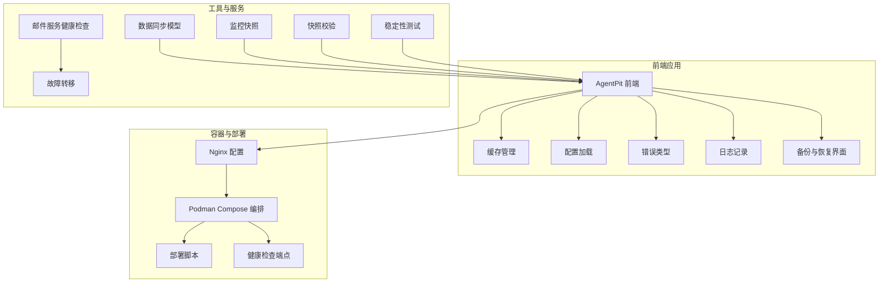

**图表来源**
- [apps/AgentPit/src/services/cache.ts:1-50](file://apps/AgentPit/src/services/cache.ts#L1-L50)
- [apps/AgentPit/src/services/config.ts:1-11](file://apps/AgentPit/src/services/config.ts#L1-L11)
- [apps/AgentPit/src/services/errors.ts:1-45](file://apps/AgentPit/src/services/errors.ts#L1-L45)
- [apps/AgentPit/src/utils/logger.ts:1-412](file://apps/AgentPit/src/utils/logger.ts#L1-L412)
- [apps/AgentPit/nginx.conf:1-68](file://apps/AgentPit/nginx.conf#L1-L68)
- [apps/AgentPit/podman-compose.yml:1-70](file://apps/AgentPit/podman-compose.yml#L1-L70)
- [apps/AgentPit/deploy.sh:1-184](file://apps/AgentPit/deploy.sh#L1-L184)
- [tools/flexloop/src/taolib/testing/email_service/server/api/health.py:1-56](file://tools/flexloop/src/taolib/testing/email_service/server/api/health.py#L1-L56)
- [tools/flexloop/src/taolib/testing/email_service/providers/failover.py:146-174](file://tools/flexloop/src/taolib/testing/email_service/providers/failover.py#L146-L174)
- [tools/flexloop/src/taolib/testing/data_sync/models/job.py:65-108](file://tools/flexloop/src/taolib/testing/data_sync/models/job.py#L65-L108)
- [apps/DaoMind/packages/daoMonitor/src/snapshot.ts:38-75](file://apps/DaoMind/packages/daoMonitor/src/snapshot.ts#L38-L75)
- [apps/DaoMind/packages/daoFeedback/src/safety.ts:294-338](file://apps/DaoMind/packages/daoFeedback/src/safety.ts#L294-L338)
- [tools/DeepResearch/tests/performance/stability_test.py:78-146](file://tools/DeepResearch/tests/performance/stability_test.py#L78-L146)

**章节来源**
- [apps/AgentPit/nginx.conf:1-68](file://apps/AgentPit/nginx.conf#L1-L68)
- [apps/AgentPit/podman-compose.yml:1-70](file://apps/AgentPit/podman-compose.yml#L1-L70)
- [apps/AgentPit/deploy.sh:1-184](file://apps/AgentPit/deploy.sh#L1-L184)

## 核心组件
- 缓存管理：提供键值缓存、TTL过期、按正则清理、清空等能力，便于在系统异常后快速清理缓存。
- 配置加载：集中管理API基础URL、超时、Mock开关与重试策略，便于在配置错误时快速修复。
- 错误类型：统一的API/网络/服务端/验证/未授权错误类型，便于在恢复过程中进行错误分类与处理。
- 日志记录：支持缓冲、轮转、归档与清理，便于在崩溃后定位问题与审计。
- 备份与恢复界面：提供手动/自动备份、备份历史、恢复确认等交互，支撑数据层面的恢复。
- 健康检查与故障转移：容器健康检查端点与邮件服务健康检查与故障转移逻辑，支撑系统自愈。
- 数据同步模型：定义同步作业、状态、范围、模式与检查点，支撑离线/增量同步与回滚。
- 监控快照与快照校验：生成系统健康快照与校验，辅助完整性检查与状态评估。
- 错误处理策略与稳定性测试：提供错误分类、恢复策略与稳定性观测，支撑灾难恢复与回归验证。

**章节来源**
- [apps/AgentPit/src/services/cache.ts:1-50](file://apps/AgentPit/src/services/cache.ts#L1-L50)
- [apps/AgentPit/src/services/config.ts:1-11](file://apps/AgentPit/src/services/config.ts#L1-L11)
- [apps/AgentPit/src/services/errors.ts:1-45](file://apps/AgentPit/src/services/errors.ts#L1-L45)
- [apps/AgentPit/src/utils/logger.ts:1-412](file://apps/AgentPit/src/utils/logger.ts#L1-L412)
- [apps/AgentPit/src/components/memory/BackupSettings.vue:404-475](file://apps/AgentPit/src/components/memory/BackupSettings.vue#L404-L475)
- [apps/AgentPit/src-react-backup-20260410/components/memory/BackupSettings.tsx:111-358](file://apps/AgentPit/src-react-backup-20260410/components/memory/BackupSettings.tsx#L111-L358)
- [apps/AgentPit/src-react-backup-20260410/data/mockMemory.ts:290-304](file://apps/AgentPit/src-react-backup-20260410/data/mockMemory.ts#L290-L304)
- [tools/flexloop/src/taolib/testing/email_service/server/api/health.py:1-56](file://tools/flexloop/src/taolib/testing/email_service/server/api/health.py#L1-L56)
- [tools/flexloop/src/taolib/testing/email_service/providers/failover.py:146-174](file://tools/flexloop/src/taolib/testing/email_service/providers/failover.py#L146-L174)
- [tools/flexloop/src/taolib/testing/data_sync/models/job.py:65-108](file://tools/flexloop/src/taolib/testing/data_sync/models/job.py#L65-L108)
- [apps/DaoMind/packages/daoMonitor/src/snapshot.ts:38-75](file://apps/DaoMind/packages/daoMonitor/src/snapshot.ts#L38-L75)
- [apps/DaoMind/packages/daoFeedback/src/safety.ts:294-338](file://apps/DaoMind/packages/daoFeedback/src/safety.ts#L294-L338)
- [skills/daoSkilLs/skills/alipay-payment-integration/modules/utils/error-handling-implementation.md:36-288](file://skills/daoSkilLs/skills/alipay-payment-integration/modules/utils/error-handling-implementation.md#L36-L288)
- [tools/DeepResearch/tests/performance/stability_test.py:78-146](file://tools/DeepResearch/tests/performance/stability_test.py#L78-L146)

## 架构总览
系统通过Nginx作为反向代理与静态资源服务，Podman容器编排前端应用，容器内置健康检查端点；后端服务通过健康检查接口与故障转移机制保障可用性；前端提供备份与恢复界面，结合日志与错误类型进行恢复与诊断；数据同步模型支撑离线/增量同步与回滚；监控与快照校验用于完整性检查与状态评估。

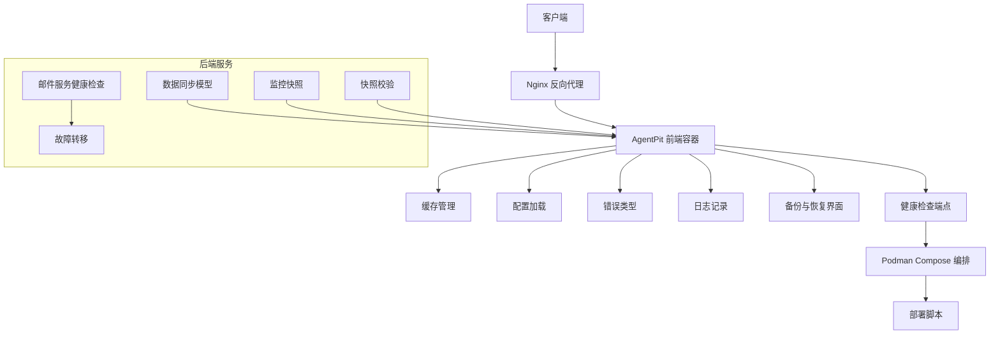

**图表来源**
- [apps/AgentPit/nginx.conf:1-68](file://apps/AgentPit/nginx.conf#L1-L68)
- [apps/AgentPit/podman-compose.yml:1-70](file://apps/AgentPit/podman-compose.yml#L1-L70)
- [apps/AgentPit/deploy.sh:1-184](file://apps/AgentPit/deploy.sh#L1-L184)
- [tools/flexloop/src/taolib/testing/email_service/server/api/health.py:1-56](file://tools/flexloop/src/taolib/testing/email_service/server/api/health.py#L1-L56)
- [tools/flexloop/src/taolib/testing/email_service/providers/failover.py:146-174](file://tools/flexloop/src/taolib/testing/email_service/providers/failover.py#L146-L174)
- [tools/flexloop/src/taolib/testing/data_sync/models/job.py:65-108](file://tools/flexloop/src/taolib/testing/data_sync/models/job.py#L65-L108)
- [apps/DaoMind/packages/daoMonitor/src/snapshot.ts:38-75](file://apps/DaoMind/packages/daoMonitor/src/snapshot.ts#L38-L75)
- [apps/DaoMind/packages/daoFeedback/src/safety.ts:294-338](file://apps/DaoMind/packages/daoFeedback/src/safety.ts#L294-L338)

## 详细组件分析

### 缓存管理与状态重置
- 功能要点：支持按键获取/设置/删除/清空/按正则批量清理，TTL过期自动失效。
- 恢复建议：系统崩溃后优先执行清空与按模式清理，避免脏缓存影响恢复；必要时按环境/模块前缀清理。

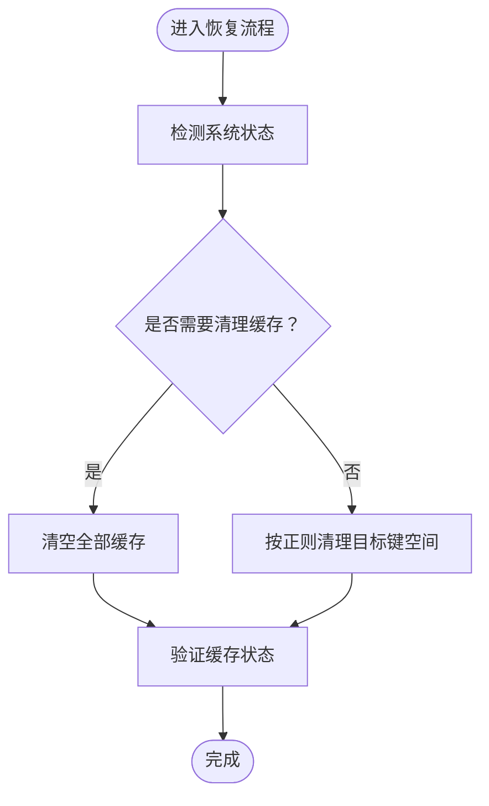

**图表来源**
- [apps/AgentPit/src/services/cache.ts:1-50](file://apps/AgentPit/src/services/cache.ts#L1-L50)

**章节来源**
- [apps/AgentPit/src/services/cache.ts:1-50](file://apps/AgentPit/src/services/cache.ts#L1-L50)

### 配置修复与回滚
- 功能要点：集中配置API基础URL、超时、Mock开关与重试策略；容器编排支持环境变量注入与只读文件系统增强安全。
- 恢复建议：优先核对环境变量与Nginx安全头；若配置变更导致异常，回退到上一版本并清除缓存。

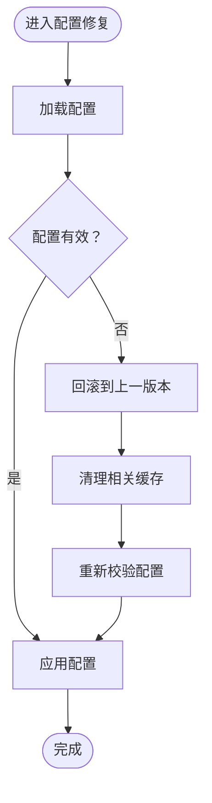

**图表来源**
- [apps/AgentPit/src/services/config.ts:1-11](file://apps/AgentPit/src/services/config.ts#L1-L11)
- [apps/AgentPit/podman-compose.yml:32-38](file://apps/AgentPit/podman-compose.yml#L32-L38)
- [apps/AgentPit/nginx.conf:52-67](file://apps/AgentPit/nginx.conf#L52-L67)

**章节来源**
- [apps/AgentPit/src/services/config.ts:1-11](file://apps/AgentPit/src/services/config.ts#L1-L11)
- [apps/AgentPit/podman-compose.yml:32-38](file://apps/AgentPit/podman-compose.yml#L32-L38)
- [apps/AgentPit/nginx.conf:52-67](file://apps/AgentPit/nginx.conf#L52-L67)

### 日志与审计（崩溃定位与完整性检查）
- 功能要点：缓冲写入、定时刷新、日志轮转、归档与清理；支持模块化子日志器；错误级别与元数据记录。
- 恢复建议：崩溃后优先查看当日与归档日志，定位错误堆栈与上下文；结合错误类型进行分类处理。

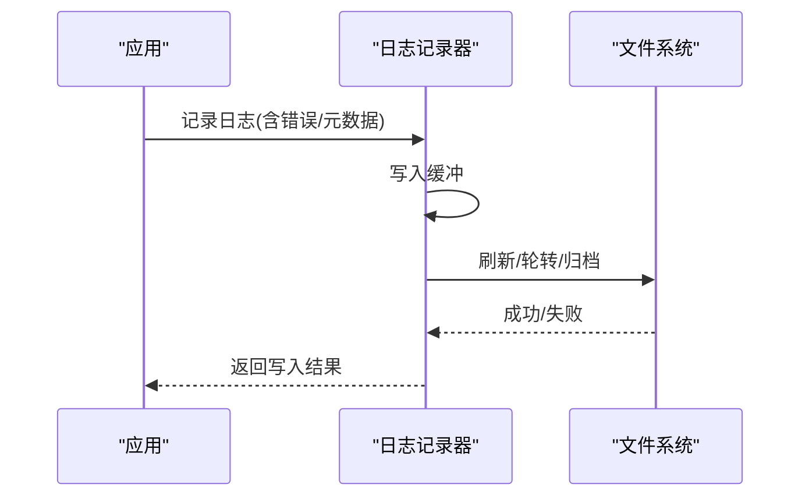

**图表来源**
- [apps/AgentPit/src/utils/logger.ts:108-277](file://apps/AgentPit/src/utils/logger.ts#L108-L277)

**章节来源**
- [apps/AgentPit/src/utils/logger.ts:1-412](file://apps/AgentPit/src/utils/logger.ts#L1-L412)

### 备份与恢复（数据完整性与可回溯）
- 功能要点：手动/自动备份计划、备份历史展示、恢复确认对话框、云端存储集成提示；支持全量/增量备份与版本历史。
- 恢复建议：在确认备份可用后，执行恢复确认对话框中的“恢复到此版本”操作；恢复前务必备份当前状态。

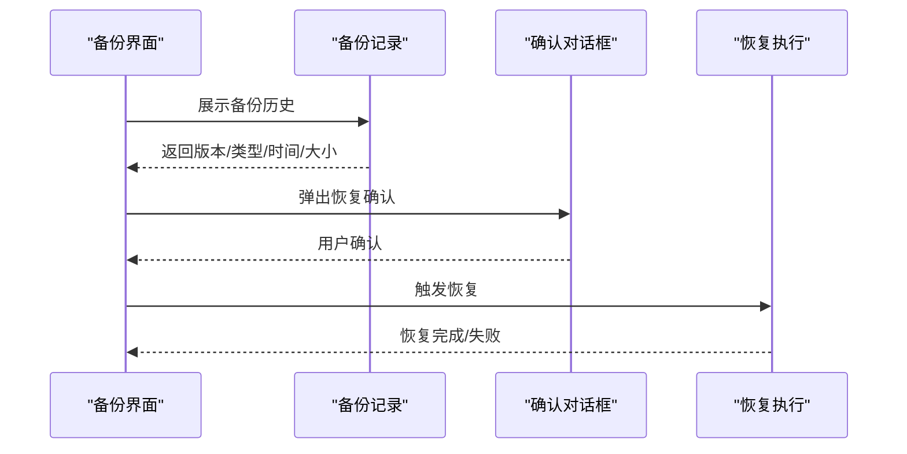

**图表来源**
- [apps/AgentPit/src/components/memory/BackupSettings.vue:404-475](file://apps/AgentPit/src/components/memory/BackupSettings.vue#L404-L475)
- [apps/AgentPit/src-react-backup-20260410/components/memory/BackupSettings.tsx:111-358](file://apps/AgentPit/src-react-backup-20260410/components/memory/BackupSettings.tsx#L111-L358)
- [apps/AgentPit/src-react-backup-20260410/data/mockMemory.ts:290-304](file://apps/AgentPit/src-react-backup-20260410/data/mockMemory.ts#L290-L304)

**章节来源**
- [apps/AgentPit/src/components/memory/BackupSettings.vue:404-475](file://apps/AgentPit/src/components/memory/BackupSettings.vue#L404-L475)
- [apps/AgentPit/src-react-backup-20260410/components/memory/BackupSettings.tsx:111-358](file://apps/AgentPit/src-react-backup-20260410/components/memory/BackupSettings.tsx#L111-L358)
- [apps/AgentPit/src-react-backup-20260410/data/mockMemory.ts:290-304](file://apps/AgentPit/src-react-backup-20260410/data/mockMemory.ts#L290-L304)

### 健康检查与系统自愈
- 功能要点：容器健康检查端点、Nginx健康路径、邮件服务健康检查与故障转移；支持连续失败次数与冷却恢复。
- 恢复建议：容器健康检查失败时，先检查日志与依赖服务；依赖服务异常时，启用故障转移并观察恢复状态。

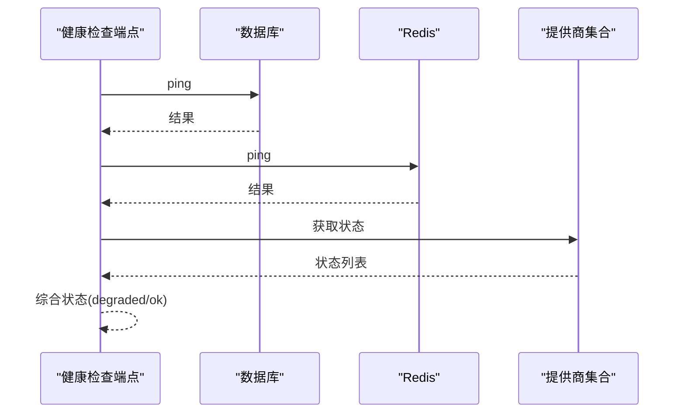

**图表来源**
- [apps/AgentPit/nginx.conf:27-32](file://apps/AgentPit/nginx.conf#L27-L32)
- [apps/AgentPit/podman-compose.yml:55-61](file://apps/AgentPit/podman-compose.yml#L55-L61)
- [tools/flexloop/src/taolib/testing/email_service/server/api/health.py:1-56](file://tools/flexloop/src/taolib/testing/email_service/server/api/health.py#L1-L56)
- [tools/flexloop/src/taolib/testing/email_service/providers/failover.py:146-174](file://tools/flexloop/src/taolib/testing/email_service/providers/failover.py#L146-L174)

**章节来源**
- [apps/AgentPit/nginx.conf:27-32](file://apps/AgentPit/nginx.conf#L27-L32)
- [apps/AgentPit/podman-compose.yml:55-61](file://apps/AgentPit/podman-compose.yml#L55-L61)
- [tools/flexloop/src/taolib/testing/email_service/server/api/health.py:1-56](file://tools/flexloop/src/taolib/testing/email_service/server/api/health.py#L1-L56)
- [tools/flexloop/src/taolib/testing/email_service/providers/failover.py:146-174](file://tools/flexloop/src/taolib/testing/email_service/providers/failover.py#L146-L174)

### 离线数据同步与回滚
- 功能要点：同步作业模型、状态/范围/模式、检查点与度量；支持全量/增量同步与失败动作（跳过/重试/中止）。
- 恢复建议：在离线状态下，优先执行增量同步；若失败，根据失败动作选择重试或中止；必要时回滚到最近稳定检查点。

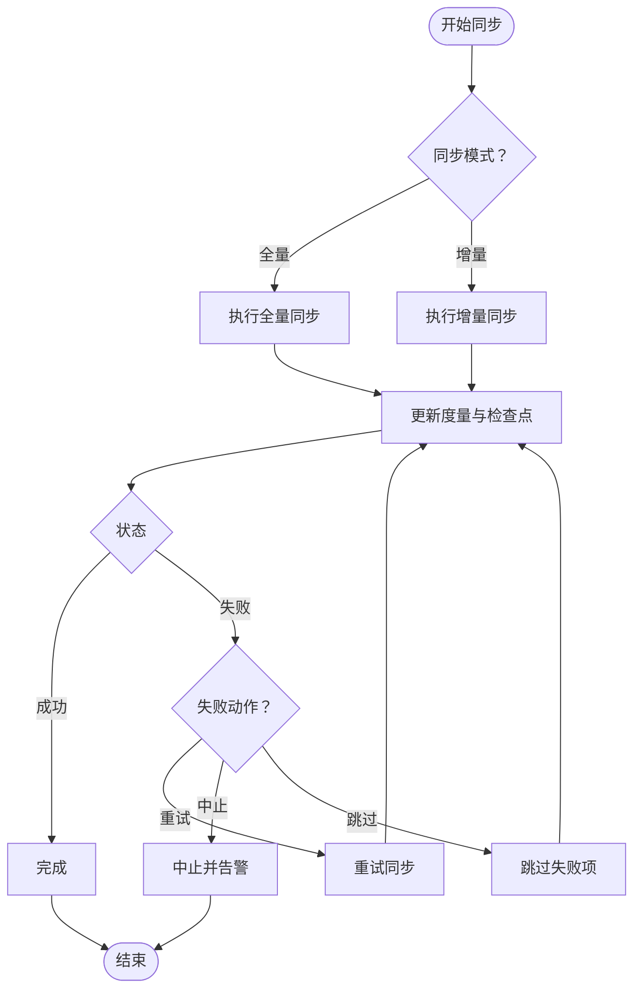

**图表来源**
- [tools/flexloop/src/taolib/testing/data_sync/models/job.py:65-108](file://tools/flexloop/src/taolib/testing/data_sync/models/job.py#L65-L108)
- [tools/flexloop/tests/testing/test_data_sync/test_models.py:1-126](file://tools/flexloop/tests/testing/test_data_sync/test_models.py#L1-L126)

**章节来源**
- [tools/flexloop/src/taolib/testing/data_sync/models/job.py:65-108](file://tools/flexloop/src/taolib/testing/data_sync/models/job.py#L65-L108)
- [tools/flexloop/tests/testing/test_data_sync/test_models.py:1-126](file://tools/flexloop/tests/testing/test_data_sync/test_models.py#L1-L126)

### 监控快照与快照校验（完整性检查）
- 功能要点：生成系统健康快照、诊断节点不足/冗余、维护历史长度；快照校验通过校验和验证一致性。
- 恢复建议：在恢复前后分别生成快照，对比诊断与健康度；若校验失败，执行数据修复与重新校验。

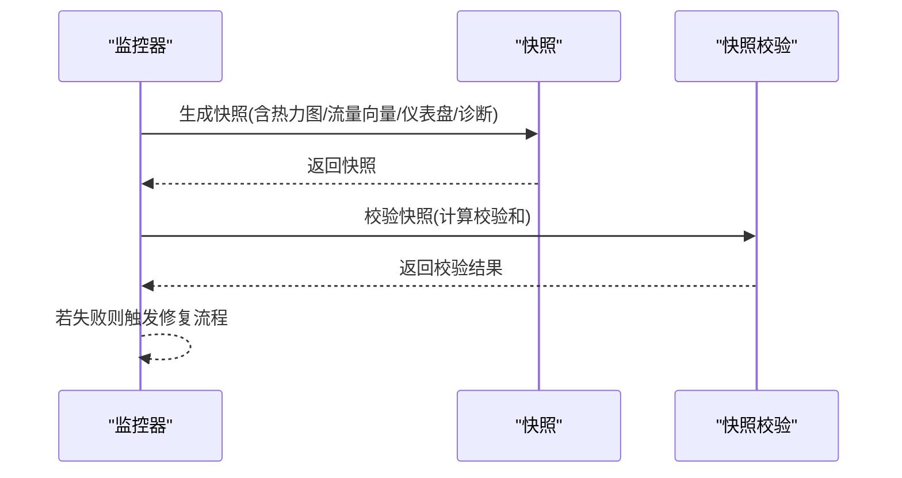

**图表来源**
- [apps/DaoMind/packages/daoMonitor/src/snapshot.ts:38-75](file://apps/DaoMind/packages/daoMonitor/src/snapshot.ts#L38-L75)
- [apps/DaoMind/packages/daoFeedback/src/safety.ts:294-338](file://apps/DaoMind/packages/daoFeedback/src/safety.ts#L294-L338)

**章节来源**
- [apps/DaoMind/packages/daoMonitor/src/snapshot.ts:38-75](file://apps/DaoMind/packages/daoMonitor/src/snapshot.ts#L38-L75)
- [apps/DaoMind/packages/daoFeedback/src/safety.ts:294-338](file://apps/DaoMind/packages/daoFeedback/src/safety.ts#L294-L338)

### 错误处理策略与系统回滚
- 功能要点：错误分类（内部/内存/缓存/限流）、错误捕获与处理、错误日志格式化、恢复策略（重试/降级/资源释放/状态恢复）。
- 恢复建议：针对内存不足等致命错误，执行终止与降级；缓存错误执行清理与重试；网络/限流错误延迟重试；记录审计日志以便回溯。

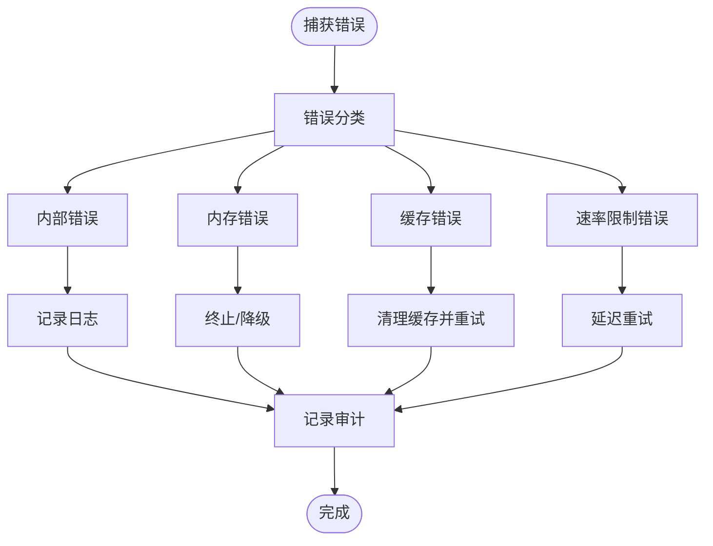

**图表来源**
- [skills/daoSkilLs/skills/alipay-payment-integration/modules/utils/error-handling-implementation.md:36-288](file://skills/daoSkilLs/skills/alipay-payment-integration/modules/utils/error-handling-implementation.md#L36-L288)
- [apps/AgentPit/src/services/errors.ts:1-45](file://apps/AgentPit/src/services/errors.ts#L1-L45)

**章节来源**
- [skills/daoSkilLs/skills/alipay-payment-integration/modules/utils/error-handling-implementation.md:36-288](file://skills/daoSkilLs/skills/alipay-payment-integration/modules/utils/error-handling-implementation.md#L36-L288)
- [apps/AgentPit/src/services/errors.ts:1-45](file://apps/AgentPit/src/services/errors.ts#L1-L45)

### 稳定性与性能观测（灾难恢复验证）
- 功能要点：稳定性测试采集CPU/内存/RSS/VMS与响应时间统计，用于灾难恢复后的回归验证。
- 恢复建议：恢复完成后执行稳定性测试，观察指标波动与成功率，确保系统回到正常阈值。

**章节来源**
- [tools/DeepResearch/tests/performance/stability_test.py:78-146](file://tools/DeepResearch/tests/performance/stability_test.py#L78-L146)

## 依赖关系分析
- 前端应用依赖缓存、配置、错误类型与日志模块；通过Nginx与容器编排对外提供服务。
- 健康检查与故障转移依赖数据库与外部提供商状态；容器健康检查端点用于编排器判定。
- 数据同步模型为离线/增量同步提供契约；监控与快照校验为完整性检查提供手段。
- 错误处理策略贯穿各模块，确保恢复过程中的可观测与可回溯。

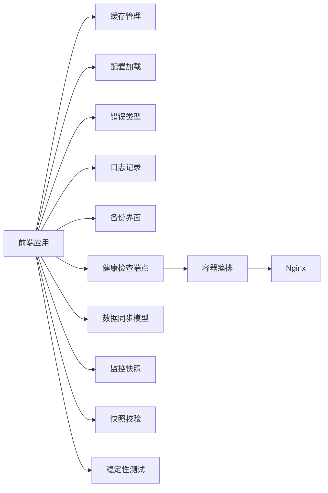

**图表来源**
- [apps/AgentPit/src/services/cache.ts:1-50](file://apps/AgentPit/src/services/cache.ts#L1-L50)
- [apps/AgentPit/src/services/config.ts:1-11](file://apps/AgentPit/src/services/config.ts#L1-L11)
- [apps/AgentPit/src/services/errors.ts:1-45](file://apps/AgentPit/src/services/errors.ts#L1-L45)
- [apps/AgentPit/src/utils/logger.ts:1-412](file://apps/AgentPit/src/utils/logger.ts#L1-L412)
- [apps/AgentPit/nginx.conf:1-68](file://apps/AgentPit/nginx.conf#L1-L68)
- [apps/AgentPit/podman-compose.yml:1-70](file://apps/AgentPit/podman-compose.yml#L1-L70)
- [tools/flexloop/src/taolib/testing/data_sync/models/job.py:65-108](file://tools/flexloop/src/taolib/testing/data_sync/models/job.py#L65-L108)
- [apps/DaoMind/packages/daoMonitor/src/snapshot.ts:38-75](file://apps/DaoMind/packages/daoMonitor/src/snapshot.ts#L38-L75)
- [apps/DaoMind/packages/daoFeedback/src/safety.ts:294-338](file://apps/DaoMind/packages/daoFeedback/src/safety.ts#L294-L338)
- [tools/DeepResearch/tests/performance/stability_test.py:78-146](file://tools/DeepResearch/tests/performance/stability_test.py#L78-L146)

**章节来源**
- [apps/AgentPit/nginx.conf:1-68](file://apps/AgentPit/nginx.conf#L1-L68)
- [apps/AgentPit/podman-compose.yml:1-70](file://apps/AgentPit/podman-compose.yml#L1-L70)
- [apps/AgentPit/deploy.sh:1-184](file://apps/AgentPit/deploy.sh#L1-L184)

## 性能考量
- 容器资源限制：内存与CPU限制防止资源耗尽；健康检查间隔与超时需平衡恢复速度与资源消耗。
- 缓存策略：合理设置TTL与清理策略，避免缓存膨胀影响恢复性能。
- 日志轮转：控制单文件大小与归档周期，避免磁盘IO成为瓶颈。
- 稳定性测试：定期执行稳定性测试，提前发现潜在性能退化。

[本节为通用指导，无需具体文件分析]

## 故障排查指南
- 健康检查失败
  - 检查容器日志与依赖服务状态；确认数据库与Redis连通性；观察提供商健康状态。
  - 参考：[健康检查端点:27-32](file://apps/AgentPit/nginx.conf#L27-L32)，[容器健康检查:55-61](file://apps/AgentPit/podman-compose.yml#L55-L61)，[邮件服务健康检查:1-56](file://tools/flexloop/src/taolib/testing/email_service/server/api/health.py#L1-L56)，[故障转移:146-174](file://tools/flexloop/src/taolib/testing/email_service/providers/failover.py#L146-L174)
- 缓存异常
  - 执行缓存清空与按模式清理；检查TTL设置；确认恢复后缓存命中率。
  - 参考：[缓存管理:1-50](file://apps/AgentPit/src/services/cache.ts#L1-L50)
- 配置错误
  - 核对环境变量与Nginx安全头；回滚到上一版本并清除相关缓存。
  - 参考：[配置加载:1-11](file://apps/AgentPit/src/services/config.ts#L1-L11)，[容器环境变量:32-38](file://apps/AgentPit/podman-compose.yml#L32-L38)，[Nginx安全头:52-67](file://apps/AgentPit/nginx.conf#L52-L67)
- 备份/恢复问题
  - 确认备份可用性与版本历史；恢复前备份当前状态；使用恢复确认对话框。
  - 参考：[备份界面:404-475](file://apps/AgentPit/src/components/memory/BackupSettings.vue#L404-L475)，[备份设置(React):111-358](file://apps/AgentPit/src-react-backup-20260410/components/memory/BackupSettings.tsx#L111-L358)，[备份历史(mock):290-304](file://apps/AgentPit/src-react-backup-20260410/data/mockMemory.ts#L290-L304)
- 数据同步失败
  - 根据失败动作选择重试/中止/跳过；必要时回滚到最近检查点。
  - 参考：[数据同步模型:65-108](file://tools/flexloop/src/taolib/testing/data_sync/models/job.py#L65-L108)，[同步测试:1-126](file://tools/flexloop/tests/testing/test_data_sync/test_models.py#L1-L126)
- 完整性检查
  - 生成快照并校验；若失败，执行修复与重新校验。
  - 参考：[监控快照:38-75](file://apps/DaoMind/packages/daoMonitor/src/snapshot.ts#L38-L75)，[快照校验:294-338](file://apps/DaoMind/packages/daoFeedback/src/safety.ts#L294-L338)
- 错误处理与审计
  - 使用统一错误类型与日志记录；记录审计日志以便回溯。
  - 参考：[错误类型:1-45](file://apps/AgentPit/src/services/errors.ts#L1-L45)，[日志记录:1-412](file://apps/AgentPit/src/utils/logger.ts#L1-L412)，[错误处理策略:36-288](file://skills/daoSkilLs/skills/alipay-payment-integration/modules/utils/error-handling-implementation.md#L36-L288)
- 生命周期与回调健壮性
  - 确保回调异常不影响整体流程；验证生命周期管理。
  - 参考：[生命周期测试:93-108](file://apps/DaoMind/packages/daoApps/src/__tests__/lifecycle.test.ts#L93-L108)

**章节来源**
- [apps/AgentPit/nginx.conf:27-32](file://apps/AgentPit/nginx.conf#L27-L32)
- [apps/AgentPit/podman-compose.yml:55-61](file://apps/AgentPit/podman-compose.yml#L55-L61)
- [tools/flexloop/src/taolib/testing/email_service/server/api/health.py:1-56](file://tools/flexloop/src/taolib/testing/email_service/server/api/health.py#L1-L56)
- [tools/flexloop/src/taolib/testing/email_service/providers/failover.py:146-174](file://tools/flexloop/src/taolib/testing/email_service/providers/failover.py#L146-L174)
- [apps/AgentPit/src/services/cache.ts:1-50](file://apps/AgentPit/src/services/cache.ts#L1-L50)
- [apps/AgentPit/src/services/config.ts:1-11](file://apps/AgentPit/src/services/config.ts#L1-L11)
- [apps/AgentPit/src/components/memory/BackupSettings.vue:404-475](file://apps/AgentPit/src/components/memory/BackupSettings.vue#L404-L475)
- [apps/AgentPit/src-react-backup-20260410/components/memory/BackupSettings.tsx:111-358](file://apps/AgentPit/src-react-backup-20260410/components/memory/BackupSettings.tsx#L111-L358)
- [apps/AgentPit/src-react-backup-20260410/data/mockMemory.ts:290-304](file://apps/AgentPit/src-react-backup-20260410/data/mockMemory.ts#L290-L304)
- [tools/flexloop/src/taolib/testing/data_sync/models/job.py:65-108](file://tools/flexloop/src/taolib/testing/data_sync/models/job.py#L65-L108)
- [tools/flexloop/tests/testing/test_data_sync/test_models.py:1-126](file://tools/flexloop/tests/testing/test_data_sync/test_models.py#L1-L126)
- [apps/DaoMind/packages/daoMonitor/src/snapshot.ts:38-75](file://apps/DaoMind/packages/daoMonitor/src/snapshot.ts#L38-L75)
- [apps/DaoMind/packages/daoFeedback/src/safety.ts:294-338](file://apps/DaoMind/packages/daoFeedback/src/safety.ts#L294-L338)
- [apps/AgentPit/src/services/errors.ts:1-45](file://apps/AgentPit/src/services/errors.ts#L1-L45)
- [apps/AgentPit/src/utils/logger.ts:1-412](file://apps/AgentPit/src/utils/logger.ts#L1-L412)
- [skills/daoSkilLs/skills/alipay-payment-integration/modules/utils/error-handling-implementation.md:36-288](file://skills/daoSkilLs/skills/alipay-payment-integration/modules/utils/error-handling-implementation.md#L36-L288)
- [apps/DaoMind/packages/daoApps/src/__tests__/lifecycle.test.ts:93-108](file://apps/DaoMind/packages/daoApps/src/__tests__/lifecycle.test.ts#L93-L108)

## 结论
本指南基于DAOApps现有实现，提供了从缓存清理、配置修复、日志审计到备份恢复、健康检查与自愈、数据同步与回滚、监控快照与校验、错误处理策略与稳定性验证的完整恢复路径。建议在生产环境中固化上述流程，并定期演练以提升应急响应效率与系统韧性。

[本节为总结，无需具体文件分析]

## 附录
- 部署与容器化
  - 使用部署脚本与容器编排进行一键部署与健康检查；容器内嵌健康端点与只读文件系统增强安全。
  - 参考：[部署脚本:1-184](file://apps/AgentPit/deploy.sh#L1-L184)，[容器编排:1-70](file://apps/AgentPit/podman-compose.yml#L1-L70)，[Nginx配置:1-68](file://apps/AgentPit/nginx.conf#L1-L68)，[忽略规则:1-39](file://apps/AgentPit/.dockerignore#L1-L39)

**章节来源**
- [apps/AgentPit/deploy.sh:1-184](file://apps/AgentPit/deploy.sh#L1-L184)
- [apps/AgentPit/podman-compose.yml:1-70](file://apps/AgentPit/podman-compose.yml#L1-L70)
- [apps/AgentPit/nginx.conf:1-68](file://apps/AgentPit/nginx.conf#L1-L68)
- [.dockerignore:1-39](file://apps/AgentPit/.dockerignore#L1-L39)