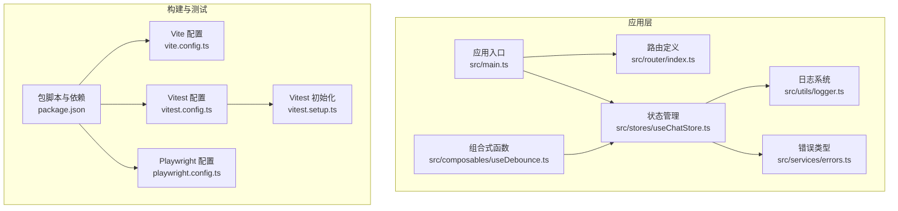
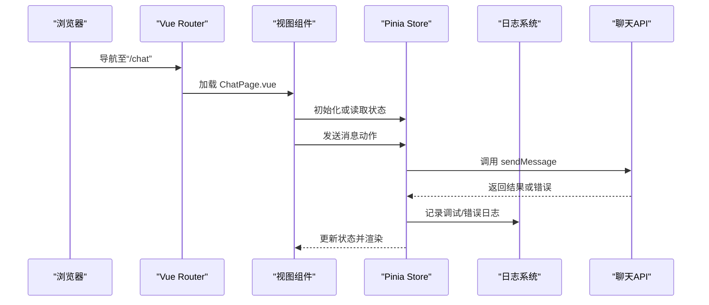
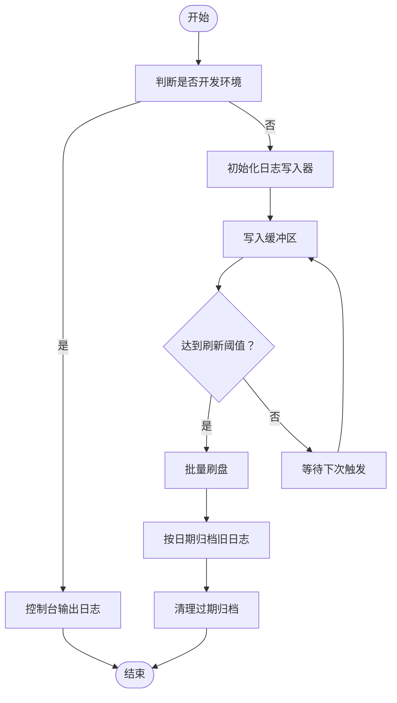
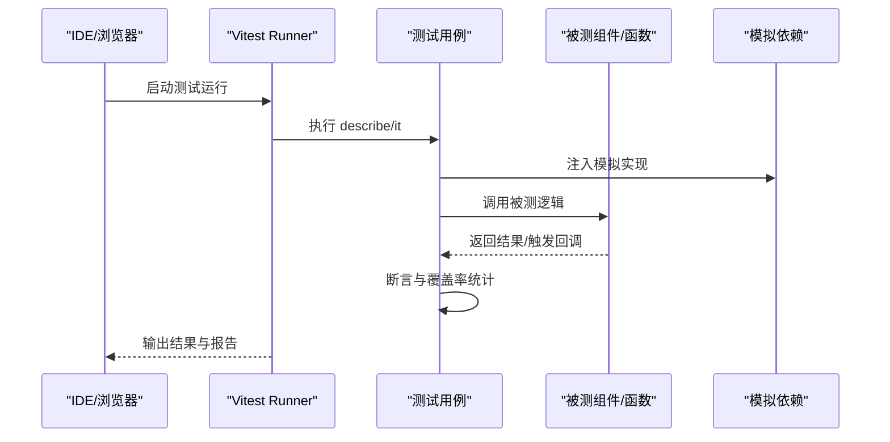
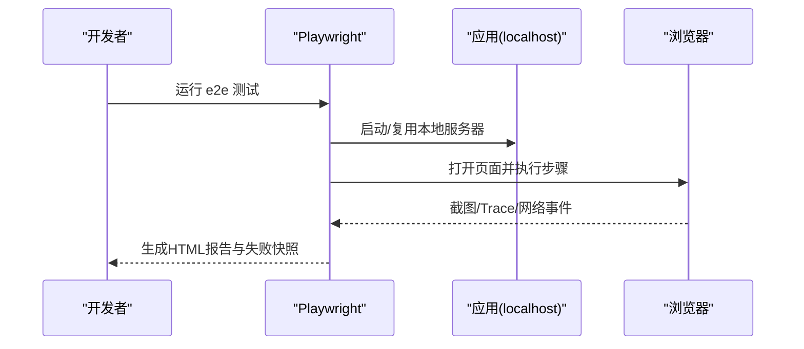
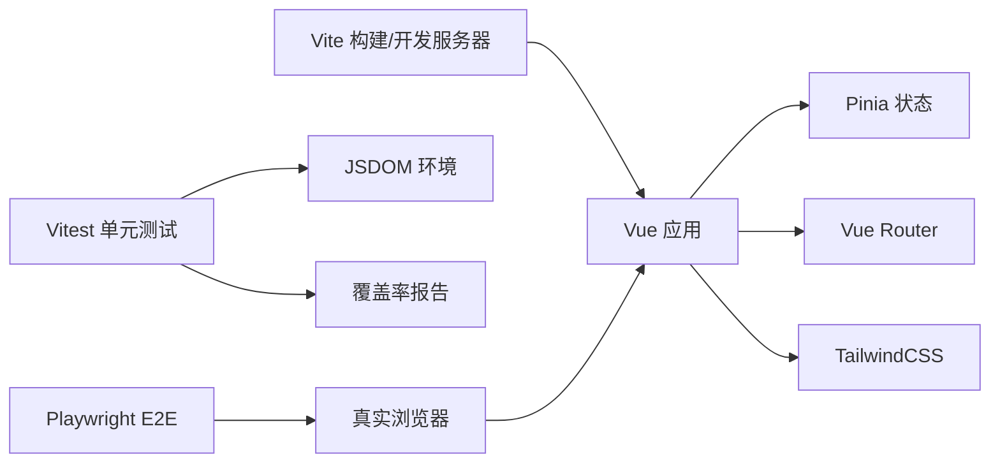

# 调试工具使用

<cite>
**本文引用的文件**
- [apps/AgentPit/package.json](file://apps/AgentPit/package.json)
- [apps/AgentPit/vitest.config.ts](file://apps/AgentPit/vitest.config.ts)
- [apps/AgentPit/playwright.config.ts](file://apps/AgentPit/playwright.config.ts)
- [apps/AgentPit/vitest.setup.ts](file://apps/AgentPit/vitest.setup.ts)
- [apps/AgentPit/vite.config.ts](file://apps/AgentPit/vite.config.ts)
- [apps/AgentPit/src/main.ts](file://apps/AgentPit/src/main.ts)
- [apps/AgentPit/src/router/index.ts](file://apps/AgentPit/src/router/index.ts)
- [apps/AgentPit/src/stores/useChatStore.ts](file://apps/AgentPit/src/stores/useChatStore.ts)
- [apps/AgentPit/src/composables/useDebounce.ts](file://apps/AgentPit/src/composables/useDebounce.ts)
- [apps/AgentPit/src/utils/logger.ts](file://apps/AgentPit/src/utils/logger.ts)
- [apps/AgentPit/src/services/errors.ts](file://apps/AgentPit/src/services/errors.ts)
- [apps/AgentPit/src/__tests__/components/chat/ChatInterface.spec.ts](file://apps/AgentPit/src/__tests__/components/chat/ChatInterface.spec.ts)
- [apps/AgentPit/e2e/chat-flow.spec.ts](file://apps/AgentPit/e2e/chat-flow.spec.ts)
</cite>

## 目录
1. [简介](#简介)
2. [项目结构](#项目结构)
3. [核心组件](#核心组件)
4. [架构总览](#架构总览)
5. [详细组件分析](#详细组件分析)
6. [依赖分析](#依赖分析)
7. [性能考虑](#性能考虑)
8. [故障排查指南](#故障排查指南)
9. [结论](#结论)
10. [附录](#附录)

## 简介
本指南面向DAOApps项目的开发者，聚焦于实际可用的调试工具与工作流，涵盖浏览器开发者工具、Vue DevTools、Node.js调试器、日志分析与覆盖率报告、以及单元测试、端到端测试与集成测试的调试最佳实践。文档基于仓库中现有的Vite、Vitest、Playwright与Vue/Pinia生态配置，提供可直接落地的操作步骤与可视化图示，帮助快速定位问题、优化性能并提升开发效率。

## 项目结构
AgentPit应用采用Vite + Vue 3 + Pinia + Vue Router的前端架构，配合Vitest进行单元测试与覆盖率分析，Playwright进行端到端测试。关键调试相关配置集中在根目录的构建与测试配置文件中，并在应用入口与路由中体现运行时行为。

图表来源
- [apps/AgentPit/src/main.ts:1-13](file://apps/AgentPit/src/main.ts#L1-L13)
- [apps/AgentPit/src/router/index.ts:1-73](file://apps/AgentPit/src/router/index.ts#L1-L73)
- [apps/AgentPit/src/stores/useChatStore.ts:1-218](file://apps/AgentPit/src/stores/useChatStore.ts#L1-L218)
- [apps/AgentPit/src/composables/useDebounce.ts:1-21](file://apps/AgentPit/src/composables/useDebounce.ts#L1-L21)
- [apps/AgentPit/src/utils/logger.ts:1-412](file://apps/AgentPit/src/utils/logger.ts#L1-L412)
- [apps/AgentPit/src/services/errors.ts:1-45](file://apps/AgentPit/src/services/errors.ts#L1-L45)
- [apps/AgentPit/vite.config.ts:1-15](file://apps/AgentPit/vite.config.ts#L1-L15)
- [apps/AgentPit/package.json:1-74](file://apps/AgentPit/package.json#L1-L74)
- [apps/AgentPit/vitest.config.ts:1-48](file://apps/AgentPit/vitest.config.ts#L1-L48)
- [apps/AgentPit/vitest.setup.ts:1-47](file://apps/AgentPit/vitest.setup.ts#L1-L47)
- [apps/AgentPit/playwright.config.ts:1-28](file://apps/AgentPit/playwright.config.ts#L1-L28)

章节来源
- [apps/AgentPit/package.json:1-74](file://apps/AgentPit/package.json#L1-L74)
- [apps/AgentPit/vite.config.ts:1-15](file://apps/AgentPit/vite.config.ts#L1-L15)
- [apps/AgentPit/vitest.config.ts:1-48](file://apps/AgentPit/vitest.config.ts#L1-L48)
- [apps/AgentPit/playwright.config.ts:1-28](file://apps/AgentPit/playwright.config.ts#L1-L28)
- [apps/AgentPit/vitest.setup.ts:1-47](file://apps/AgentPit/vitest.setup.ts#L1-L47)
- [apps/AgentPit/src/main.ts:1-13](file://apps/AgentPit/src/main.ts#L1-L13)
- [apps/AgentPit/src/router/index.ts:1-73](file://apps/AgentPit/src/router/index.ts#L1-L73)
- [apps/AgentPit/src/stores/useChatStore.ts:1-218](file://apps/AgentPit/src/stores/useChatStore.ts#L1-L218)
- [apps/AgentPit/src/composables/useDebounce.ts:1-21](file://apps/AgentPit/src/composables/useDebounce.ts#L1-L21)
- [apps/AgentPit/src/utils/logger.ts:1-412](file://apps/AgentPit/src/utils/logger.ts#L1-L412)
- [apps/AgentPit/src/services/errors.ts:1-45](file://apps/AgentPit/src/services/errors.ts#L1-L45)

## 核心组件
- 应用入口与运行时：应用通过入口文件挂载到DOM，注册路由与状态管理，便于在浏览器控制台与Vue DevTools中进行交互式调试。
- 路由系统：集中定义页面路由，便于在浏览器网络面板与Vue Router Devtools中观察导航与懒加载行为。
- 状态管理：Pinia Store承载会话、消息与流式状态，支持持久化与本地存储读写，适合在Vue DevTools中检查状态变化与时间旅行调试。
- 组合式函数：如防抖组合式函数，便于在组件生命周期中观察响应式数据变更。
- 日志系统：统一的日志记录器，支持开发环境控制台输出与生产环境文件落盘，便于问题复盘与性能分析。
- 错误类型：统一的错误类型体系，便于在异常捕获与测试断言中进行精确匹配。

章节来源
- [apps/AgentPit/src/main.ts:1-13](file://apps/AgentPit/src/main.ts#L1-L13)
- [apps/AgentPit/src/router/index.ts:1-73](file://apps/AgentPit/src/router/index.ts#L1-L73)
- [apps/AgentPit/src/stores/useChatStore.ts:1-218](file://apps/AgentPit/src/stores/useChatStore.ts#L1-L218)
- [apps/AgentPit/src/composables/useDebounce.ts:1-21](file://apps/AgentPit/src/composables/useDebounce.ts#L1-L21)
- [apps/AgentPit/src/utils/logger.ts:1-412](file://apps/AgentPit/src/utils/logger.ts#L1-L412)
- [apps/AgentPit/src/services/errors.ts:1-45](file://apps/AgentPit/src/services/errors.ts#L1-L45)

## 架构总览
下图展示从浏览器到应用、再到服务层的典型调用链路，有助于在浏览器网络面板与Vue DevTools中定位问题。

图表来源
- [apps/AgentPit/src/router/index.ts:1-73](file://apps/AgentPit/src/router/index.ts#L1-L73)
- [apps/AgentPit/src/stores/useChatStore.ts:199-215](file://apps/AgentPit/src/stores/useChatStore.ts#L199-L215)
- [apps/AgentPit/src/utils/logger.ts:374-397](file://apps/AgentPit/src/utils/logger.ts#L374-L397)

## 详细组件分析

### 浏览器开发者工具与Vue DevTools
- 打开方式：在浏览器中按F12或右键选择“检查”，切换到Elements、Console、Sources、Network、Performance标签页。
- Vue DevTools：安装浏览器扩展后，在应用页面右上角出现Vue图标；可查看组件树、Props、状态、事件与时间旅行调试。
- 断点调试：在Sources中对组件方法、Store动作或组合式函数设置断点，触发交互后逐步执行，观察变量与调用栈。
- 网络请求监控：在Network中过滤XHR/Fetch，查看请求头、响应体、耗时与错误码；结合路由懒加载与图片资源定位性能瓶颈。
- 性能分析：在Performance中录制交互过程，查看主线程占用、重排重绘与长任务，结合代码拆分与组件卸载时机优化。

### Node.js调试器（用于服务端或CLI场景）
- 在需要调试Node侧逻辑时，可在IDE中配置启动参数，或使用命令行附加调试器。
- 建议在日志系统初始化与错误抛出处设置断点，验证日志格式与堆栈信息是否完整。

### 日志分析工具
- 开发环境：日志直接输出到控制台，便于即时定位。
- 生产环境：日志写入文件，按日期滚动与归档，定期清理过期归档，便于离线分析。
- 使用建议：在关键路径（如Store动作、API调用前后）插入日志，包含模块名、元数据与错误对象，便于检索与聚合。

图表来源
- [apps/AgentPit/src/utils/logger.ts:108-132](file://apps/AgentPit/src/utils/logger.ts#L108-L132)
- [apps/AgentPit/src/utils/logger.ts:148-160](file://apps/AgentPit/src/utils/logger.ts#L148-L160)
- [apps/AgentPit/src/utils/logger.ts:221-268](file://apps/AgentPit/src/utils/logger.ts#L221-L268)

章节来源
- [apps/AgentPit/src/utils/logger.ts:1-412](file://apps/AgentPit/src/utils/logger.ts#L1-L412)

### 单元测试调试（Vitest）
- 运行与覆盖：通过脚本运行测试并生成覆盖率报告，定位未覆盖路径与边界条件。
- 模拟与桩：在测试中对第三方库（如图表库）与全局对象进行模拟，确保测试稳定与可重复。
- 断点与交互：在IDE中为测试文件设置断点，逐行执行并观察被测函数返回值与副作用。
- 最佳实践：
  - 将复杂逻辑抽离到组合式函数或纯函数，便于独立测试。
  - 使用Pinia的测试工具设置活动Store，隔离状态影响。
  - 对异步流程使用flushPromises或等待策略，避免竞态。

图表来源
- [apps/AgentPit/vitest.config.ts:7-41](file://apps/AgentPit/vitest.config.ts#L7-L41)
- [apps/AgentPit/vitest.setup.ts:1-47](file://apps/AgentPit/vitest.setup.ts#L1-L47)
- [apps/AgentPit/src/__tests__/components/chat/ChatInterface.spec.ts:1-172](file://apps/AgentPit/src/__tests__/components/chat/ChatInterface.spec.ts#L1-L172)

章节来源
- [apps/AgentPit/package.json:16-18](file://apps/AgentPit/package.json#L16-L18)
- [apps/AgentPit/vitest.config.ts:1-48](file://apps/AgentPit/vitest.config.ts#L1-L48)
- [apps/AgentPit/vitest.setup.ts:1-47](file://apps/AgentPit/vitest.setup.ts#L1-L47)
- [apps/AgentPit/src/__tests__/components/chat/ChatInterface.spec.ts:1-172](file://apps/AgentPit/src/__tests__/components/chat/ChatInterface.spec.ts#L1-L172)

### 端到端测试调试（Playwright）
- 配置要点：本地开发服务器地址、截图失败、首次重试时抓取trace，便于回放问题。
- 调试步骤：
  - 在IDE中为测试文件设置断点，运行单个测试用例。
  - 使用浏览器打开HTML报告，查看交互序列与元素定位。
  - 结合浏览器Network面板与Console，确认页面加载与脚本执行情况。
- 场景示例：聊天界面加载、输入框交互、发送按钮触发、快捷命令面板可见性等。

图表来源
- [apps/AgentPit/playwright.config.ts:1-28](file://apps/AgentPit/playwright.config.ts#L1-L28)
- [apps/AgentPit/e2e/chat-flow.spec.ts:1-56](file://apps/AgentPit/e2e/chat-flow.spec.ts#L1-L56)

章节来源
- [apps/AgentPit/playwright.config.ts:1-28](file://apps/AgentPit/playwright.config.ts#L1-L28)
- [apps/AgentPit/e2e/chat-flow.spec.ts:1-56](file://apps/AgentPit/e2e/chat-flow.spec.ts#L1-L56)

### 集成测试调试
- 关注跨模块协作：Store动作与API调用、路由跳转与页面渲染、日志与错误类型的联动。
- 建议在关键集成点设置断点与日志，观察状态变更与异步完成信号。
- 使用Vue DevTools的时间旅行功能，回放状态变化，定位异常分支。

章节来源
- [apps/AgentPit/src/stores/useChatStore.ts:176-215](file://apps/AgentPit/src/stores/useChatStore.ts#L176-L215)
- [apps/AgentPit/src/services/errors.ts:1-45](file://apps/AgentPit/src/services/errors.ts#L1-L45)

## 依赖分析
- 构建与开发：Vite负责开发服务器与热更新，别名映射简化导入路径。
- 测试框架：Vitest提供JSDOM环境与覆盖率，Playwright负责真实浏览器端到端验证。
- 应用依赖：Vue、Pinia、Vue Router构成前端核心，TailwindCSS提供样式基础。

图表来源
- [apps/AgentPit/vite.config.ts:1-15](file://apps/AgentPit/vite.config.ts#L1-L15)
- [apps/AgentPit/package.json:1-74](file://apps/AgentPit/package.json#L1-L74)
- [apps/AgentPit/vitest.config.ts:1-48](file://apps/AgentPit/vitest.config.ts#L1-L48)
- [apps/AgentPit/playwright.config.ts:1-28](file://apps/AgentPit/playwright.config.ts#L1-L28)

章节来源
- [apps/AgentPit/vite.config.ts:1-15](file://apps/AgentPit/vite.config.ts#L1-L15)
- [apps/AgentPit/package.json:1-74](file://apps/AgentPit/package.json#L1-L74)
- [apps/AgentPit/vitest.config.ts:1-48](file://apps/AgentPit/vitest.config.ts#L1-L48)
- [apps/AgentPit/playwright.config.ts:1-28](file://apps/AgentPit/playwright.config.ts#L1-L28)

## 性能考虑
- 路由懒加载：路由组件采用动态导入，减少首屏体积，结合浏览器Network面板观察加载时机。
- 组件渲染：在Vue DevTools中观察组件更新频率与深度，避免不必要的响应式穿透。
- 状态持久化：Store中的本地存储读写需注意同步与异常处理，避免阻塞主线程。
- 图表与媒体：对外部库进行模拟或延迟初始化，减少首屏渲染压力。

章节来源
- [apps/AgentPit/src/router/index.ts:1-73](file://apps/AgentPit/src/router/index.ts#L1-L73)
- [apps/AgentPit/src/stores/useChatStore.ts:161-174](file://apps/AgentPit/src/stores/useChatStore.ts#L161-L174)
- [apps/AgentPit/vitest.setup.ts:33-46](file://apps/AgentPit/vitest.setup.ts#L33-L46)

## 故障排查指南
- 控制台错误定位：优先查看错误堆栈与日志输出，结合错误类型进行分类处理。
- 网络请求异常：在Network中定位失败请求，检查状态码、响应体与CORS设置；必要时在API层增加重试与降级。
- 状态不一致：在Vue DevTools中对比Store与组件状态，确认动作是否正确提交与持久化是否成功。
- 测试失败复现：利用Playwright HTML报告与trace文件，回放失败步骤；在Vitest中单独运行失败用例并开启断点。
- 日志分析：在生产环境下查看日志文件与归档策略，关注ERROR级别与关键模块的上下文信息。

章节来源
- [apps/AgentPit/src/utils/logger.ts:374-397](file://apps/AgentPit/src/utils/logger.ts#L374-L397)
- [apps/AgentPit/src/services/errors.ts:1-45](file://apps/AgentPit/src/services/errors.ts#L1-L45)
- [apps/AgentPit/playwright.config.ts:9-14](file://apps/AgentPit/playwright.config.ts#L9-L14)
- [apps/AgentPit/vitest.config.ts:11-36](file://apps/AgentPit/vitest.config.ts#L11-L36)

## 结论
通过将浏览器开发者工具、Vue DevTools、Node.js调试器与Vitest/Playwright测试体系有机结合，可以形成从组件到服务的全链路调试闭环。配合统一的日志系统与清晰的错误类型，能够显著提升问题定位效率与系统稳定性。建议在日常开发中坚持“先断点、后日志、再测试”的调试顺序，并建立标准化的覆盖率与报告规范。

## 附录
- 快速命令参考（基于现有脚本）
  - 启动开发服务器：npm run dev
  - 运行单元测试：npm run test 或 npm run test:run
  - 生成覆盖率：npm run test:coverage
  - 运行端到端测试：npx playwright test（或根据项目脚本配置）
- 常用断点位置建议
  - 组件生命周期钩子（如onMounted/onUnmounted）
  - Store动作（如sendMessage、addMessage）
  - 异常捕获与错误类型抛出点
  - 日志输出与文件写入的关键节点

章节来源
- [apps/AgentPit/package.json:6-18](file://apps/AgentPit/package.json#L6-L18)
- [apps/AgentPit/playwright.config.ts:1-28](file://apps/AgentPit/playwright.config.ts#L1-L28)