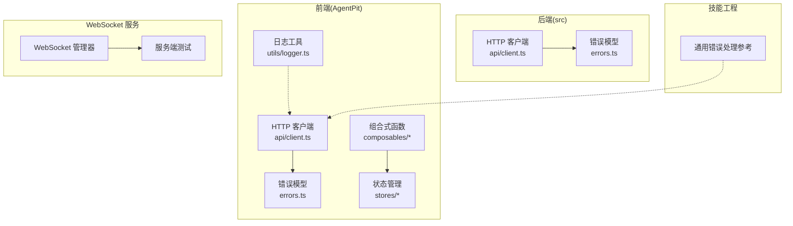
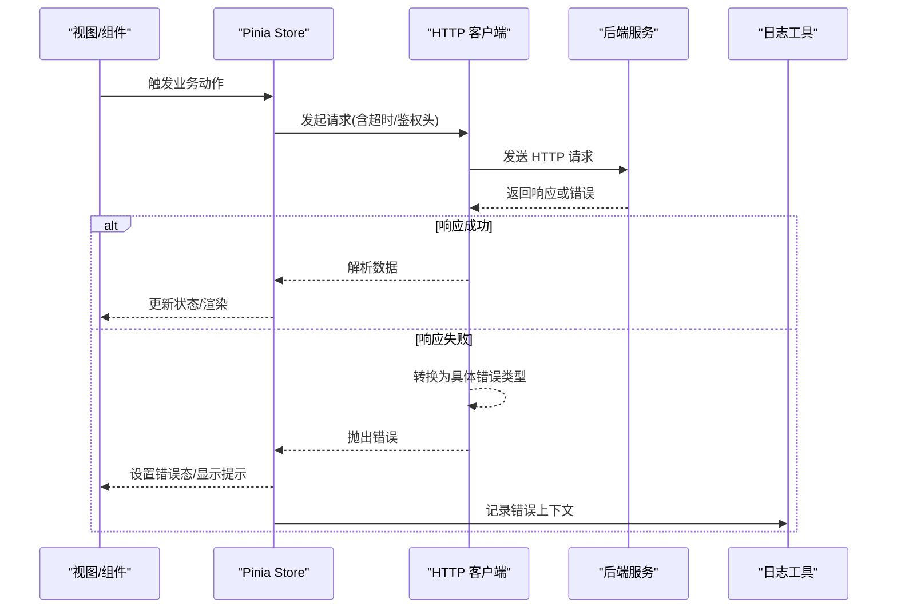
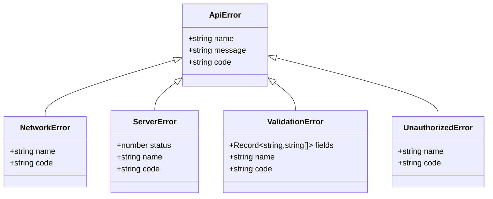
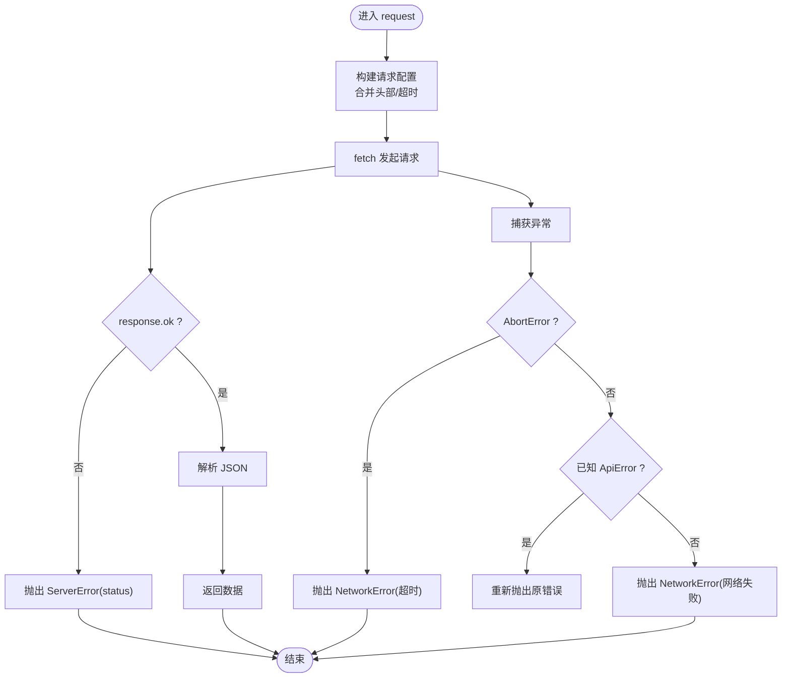
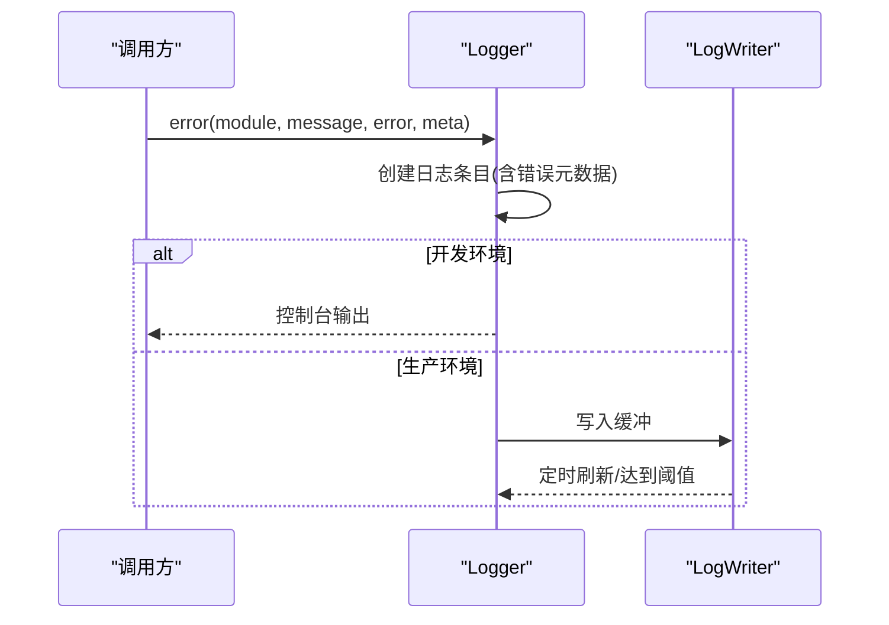
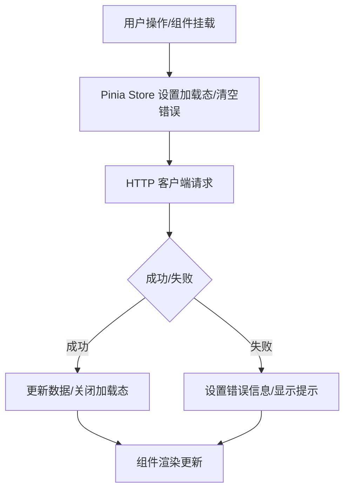
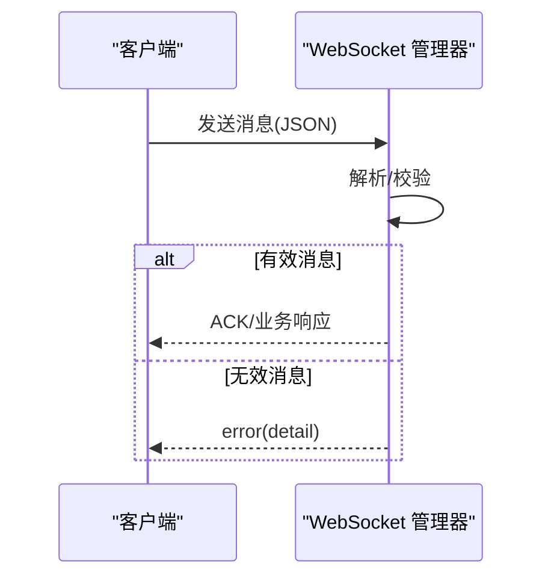
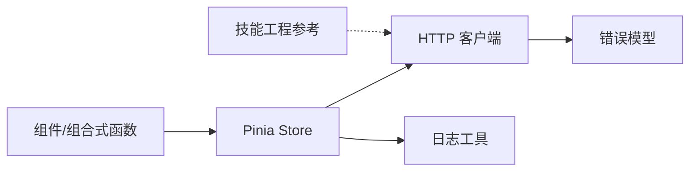

# 运行时错误

<cite>
**本文档引用的文件**
- [apps/AgentPit/src/services/api/client.ts](file://apps/AgentPit/src/services/api/client.ts)
- [apps/AgentPit/src/services/errors.ts](file://apps/AgentPit/src/services/errors.ts)
- [apps/AgentPit/src/utils/logger.ts](file://apps/AgentPit/src/utils/logger.ts)
- [apps/AgentPit/src/stores/index.ts](file://apps/AgentPit/src/stores/index.ts)
- [apps/AgentPit/src/stores/useAppStore.ts](file://apps/AgentPit/src/stores/useAppStore.ts)
- [apps/AgentPit/src/composables/useRealtimeData.ts](file://apps/AgentPit/src/composables/useRealtimeData.ts)
- [apps/AgentPit/src/composables/useSSE.ts](file://apps/AgentPit/src/composables/useSSE.ts)
- [src/services/api/client.ts](file://src/services/api/client.ts)
- [src/services/errors.ts](file://src/services/errors.ts)
- [skills/daoSkilLs/skills/alipay-payment-integration/modules/utils/error-handling-implementation.md](file://skills/daoSkilLs/skills/alipay-payment-integration/modules/utils/error-handling-implementation.md)
- [tools/flexloop/src/taolib/testing/config_center/server/websocket/manager.py](file://tools/flexloop/src/taolib/testing/config_center/server/websocket/manager.py)
- [tools/flexloop/tests/testing/test_config_center/test_push_service.py](file://tools/flexloop/tests/testing/test_config_center/test_push_service.py)
</cite>

## 目录
1. [简介](#简介)
2. [项目结构](#项目结构)
3. [核心组件](#核心组件)
4. [架构总览](#架构总览)
5. [详细组件分析](#详细组件分析)
6. [依赖关系分析](#依赖关系分析)
7. [性能考量](#性能考量)
8. [故障排查指南](#故障排查指南)
9. [结论](#结论)
10. [附录](#附录)

## 简介
本指南面向 DAOApps 项目的前端与后端开发者，聚焦运行时错误的诊断与处理。内容覆盖 API 调用失败、状态管理异常、组件渲染错误、WebSocket 连接问题等常见场景，提供错误代码对照表、堆栈跟踪分析方法、错误恢复策略，并给出全局错误处理器、错误边界与用户提示的设计建议，帮助团队建立一致、可维护且用户友好的错误处理体系。

## 项目结构
DAOApps 采用多应用与多技能并行的组织方式，前端以 Vue3 + Pinia 为主，后端部分模块包含 Python WebSocket 服务与测试用例。与错误处理强相关的模块包括：
- 前端错误模型与 HTTP 客户端：apps/AgentPit/src/services
- 前端日志工具：apps/AgentPit/src/utils/logger.ts
- 前端状态管理：apps/AgentPit/src/stores 与 apps/AgentPit/src/composables
- 后端错误模型与 HTTP 客户端：src/services
- 技能工程中的通用错误处理参考：skills/daoSkilLs/skills/alipay-payment-integration/modules/utils
- WebSocket 服务与测试：tools/flexloop

图表来源
- [apps/AgentPit/src/services/api/client.ts:1-105](file://apps/AgentPit/src/services/api/client.ts#L1-L105)
- [apps/AgentPit/src/services/errors.ts:1-45](file://apps/AgentPit/src/services/errors.ts#L1-L45)
- [apps/AgentPit/src/utils/logger.ts:1-411](file://apps/AgentPit/src/utils/logger.ts#L1-L411)
- [apps/AgentPit/src/stores/index.ts:1-15](file://apps/AgentPit/src/stores/index.ts#L1-L15)
- [apps/AgentPit/src/stores/useAppStore.ts:1-89](file://apps/AgentPit/src/stores/useAppStore.ts#L1-L89)
- [apps/AgentPit/src/composables/useRealtimeData.ts:1-117](file://apps/AgentPit/src/composables/useRealtimeData.ts#L1-L117)
- [apps/AgentPit/src/composables/useSSE.ts:1-129](file://apps/AgentPit/src/composables/useSSE.ts#L1-L129)
- [src/services/api/client.ts:1-105](file://src/services/api/client.ts#L1-L105)
- [src/services/errors.ts:1-45](file://src/services/errors.ts#L1-L45)
- [skills/daoSkilLs/skills/alipay-payment-integration/modules/utils/error-handling-implementation.md:36-288](file://skills/daoSkilLs/skills/alipay-payment-integration/modules/utils/error-handling-implementation.md#L36-L288)
- [tools/flexloop/src/taolib/testing/config_center/server/websocket/manager.py:331-364](file://tools/flexloop/src/taolib/testing/config_center/server/websocket/manager.py#L331-L364)
- [tools/flexloop/tests/testing/test_config_center/test_push_service.py:469-540](file://tools/flexloop/tests/testing/test_config_center/test_push_service.py#L469-L540)

章节来源
- [apps/AgentPit/src/services/api/client.ts:1-105](file://apps/AgentPit/src/services/api/client.ts#L1-L105)
- [apps/AgentPit/src/services/errors.ts:1-45](file://apps/AgentPit/src/services/errors.ts#L1-L45)
- [apps/AgentPit/src/utils/logger.ts:1-411](file://apps/AgentPit/src/utils/logger.ts#L1-L411)
- [apps/AgentPit/src/stores/index.ts:1-15](file://apps/AgentPit/src/stores/index.ts#L1-L15)
- [apps/AgentPit/src/stores/useAppStore.ts:1-89](file://apps/AgentPit/src/stores/useAppStore.ts#L1-L89)
- [apps/AgentPit/src/composables/useRealtimeData.ts:1-117](file://apps/AgentPit/src/composables/useRealtimeData.ts#L1-L117)
- [apps/AgentPit/src/composables/useSSE.ts:1-129](file://apps/AgentPit/src/composables/useSSE.ts#L1-L129)
- [src/services/api/client.ts:1-105](file://src/services/api/client.ts#L1-L105)
- [src/services/errors.ts:1-45](file://src/services/errors.ts#L1-L45)
- [skills/daoSkilLs/skills/alipay-payment-integration/modules/utils/error-handling-implementation.md:36-288](file://skills/daoSkilLs/skills/alipay-payment-integration/modules/utils/error-handling-implementation.md#L36-L288)
- [tools/flexloop/src/taolib/testing/config_center/server/websocket/manager.py:331-364](file://tools/flexloop/src/taolib/testing/config_center/server/websocket/manager.py#L331-L364)
- [tools/flexloop/tests/testing/test_config_center/test_push_service.py:469-540](file://tools/flexloop/tests/testing/test_config_center/test_push_service.py#L469-L540)

## 核心组件
- 错误模型与分类
  - 前端与后端均提供统一的错误基类与细分类型，便于跨层识别与处理。
  - 关键类型：ApiError、NetworkError、ServerError、ValidationError、UnauthorizedError。
- HTTP 客户端
  - 封装统一的请求流程，内置超时控制与错误转换，屏蔽底层异常细节。
- 日志工具
  - 支持多级别日志、缓冲写入、文件轮转与控制台输出，便于生产环境排障。
- 状态管理与组合式函数
  - 通过 Pinia store 与 composables 管理加载态、错误态与通知，提升用户体验。
- WebSocket 服务
  - 提供连接状态、消息与错误处理的参考实现，便于集成实时通信。

章节来源
- [apps/AgentPit/src/services/errors.ts:1-45](file://apps/AgentPit/src/services/errors.ts#L1-L45)
- [src/services/errors.ts:1-45](file://src/services/errors.ts#L1-L45)
- [apps/AgentPit/src/services/api/client.ts:1-105](file://apps/AgentPit/src/services/api/client.ts#L1-L105)
- [src/services/api/client.ts:1-105](file://src/services/api/client.ts#L1-L105)
- [apps/AgentPit/src/utils/logger.ts:1-411](file://apps/AgentPit/src/utils/logger.ts#L1-L411)
- [apps/AgentPit/src/stores/index.ts:1-15](file://apps/AgentPit/src/stores/index.ts#L1-L15)
- [apps/AgentPit/src/stores/useAppStore.ts:1-89](file://apps/AgentPit/src/stores/useAppStore.ts#L1-L89)
- [apps/AgentPit/src/composables/useRealtimeData.ts:1-117](file://apps/AgentPit/src/composables/useRealtimeData.ts#L1-L117)
- [apps/AgentPit/src/composables/useSSE.ts:1-129](file://apps/AgentPit/src/composables/useSSE.ts#L1-L129)
- [tools/flexloop/src/taolib/testing/config_center/server/websocket/manager.py:331-364](file://tools/flexloop/src/taolib/testing/config_center/server/websocket/manager.py#L331-L364)

## 架构总览
下图展示从前端到后端的错误处理路径，以及日志与状态管理的协同：

图表来源
- [apps/AgentPit/src/services/api/client.ts:33-69](file://apps/AgentPit/src/services/api/client.ts#L33-L69)
- [apps/AgentPit/src/services/errors.ts:1-45](file://apps/AgentPit/src/services/errors.ts#L1-L45)
- [apps/AgentPit/src/utils/logger.ts:374-397](file://apps/AgentPit/src/utils/logger.ts#L374-L397)
- [apps/AgentPit/src/stores/useAppStore.ts:74-80](file://apps/AgentPit/src/stores/useAppStore.ts#L74-L80)

## 详细组件分析

### 错误模型与分类
- 设计要点
  - 统一继承自 ApiError，便于上层捕获与区分。
  - NetworkError/ServerError/ValidationError/UnauthorizedError 各司其职，便于精准处理。
- 典型用法
  - HTTP 客户端在请求失败时抛出对应错误类型，调用方按类型分支处理。

图表来源
- [apps/AgentPit/src/services/errors.ts:1-45](file://apps/AgentPit/src/services/errors.ts#L1-L45)
- [src/services/errors.ts:1-45](file://src/services/errors.ts#L1-L45)

章节来源
- [apps/AgentPit/src/services/errors.ts:1-45](file://apps/AgentPit/src/services/errors.ts#L1-L45)
- [src/services/errors.ts:1-45](file://src/services/errors.ts#L1-L45)

### HTTP 客户端与错误转换
- 超时控制
  - 使用 AbortController 实现可配置超时，超时抛出 NetworkError。
- 错误转换
  - 非 2xx 响应抛出 ServerError；已知 ApiError 类型透传；其他异常统一为 NetworkError。
- 请求封装
  - GET/POST/PUT/PATCH/DELETE 方法统一封装，支持自定义头部与超时。

图表来源
- [apps/AgentPit/src/services/api/client.ts:33-69](file://apps/AgentPit/src/services/api/client.ts#L33-L69)
- [src/services/api/client.ts:33-69](file://src/services/api/client.ts#L33-L69)

章节来源
- [apps/AgentPit/src/services/api/client.ts:1-105](file://apps/AgentPit/src/services/api/client.ts#L1-L105)
- [src/services/api/client.ts:1-105](file://src/services/api/client.ts#L1-L105)

### 日志工具与堆栈跟踪
- 功能特性
  - 多级别日志、模块化子日志、缓冲写入、定时刷新、文件大小与归档策略。
  - 支持在日志条目中嵌入错误对象，自动提取 name/message/stack。
- 使用建议
  - 在错误发生点记录上下文信息，便于定位问题。
  - 生产环境优先落盘，开发环境兼顾控制台输出。

图表来源
- [apps/AgentPit/src/utils/logger.ts:316-397](file://apps/AgentPit/src/utils/logger.ts#L316-L397)

章节来源
- [apps/AgentPit/src/utils/logger.ts:1-411](file://apps/AgentPit/src/utils/logger.ts#L1-L411)

### 状态管理与错误提示
- Pinia Store
  - 通过状态字段承载加载态与错误信息，配合 getters 与 actions 统一处理。
  - 示例：useAppStore 中的 isLoading、setLoading、setCurrentPage。
- 组合式函数
  - useRealtimeData：基于定时器模拟实时数据，异常时推送通知。
  - useSSE：抽象连接状态、消息与错误，便于组件消费。

图表来源
- [apps/AgentPit/src/stores/useAppStore.ts:74-80](file://apps/AgentPit/src/stores/useAppStore.ts#L74-L80)
- [apps/AgentPit/src/composables/useRealtimeData.ts:74-81](file://apps/AgentPit/src/composables/useRealtimeData.ts#L74-L81)
- [apps/AgentPit/src/composables/useSSE.ts:18-39](file://apps/AgentPit/src/composables/useSSE.ts#L18-L39)

章节来源
- [apps/AgentPit/src/stores/index.ts:1-15](file://apps/AgentPit/src/stores/index.ts#L1-L15)
- [apps/AgentPit/src/stores/useAppStore.ts:1-89](file://apps/AgentPit/src/stores/useAppStore.ts#L1-L89)
- [apps/AgentPit/src/composables/useRealtimeData.ts:1-117](file://apps/AgentPit/src/composables/useRealtimeData.ts#L1-L117)
- [apps/AgentPit/src/composables/useSSE.ts:1-129](file://apps/AgentPit/src/composables/useSSE.ts#L1-L129)

### WebSocket 连接与错误处理
- 服务端
  - 对未知消息类型、JSON 解析失败等情况发送错误响应，维护心跳与订阅状态。
- 测试用例
  - 验证无效 JSON、未知类型消息的错误处理行为，确保客户端收到明确错误信息。

图表来源
- [tools/flexloop/src/taolib/testing/config_center/server/websocket/manager.py:331-364](file://tools/flexloop/src/taolib/testing/config_center/server/websocket/manager.py#L331-L364)
- [tools/flexloop/tests/testing/test_config_center/test_push_service.py:498-512](file://tools/flexloop/tests/testing/test_config_center/test_push_service.py#L498-L512)

章节来源
- [tools/flexloop/src/taolib/testing/config_center/server/websocket/manager.py:331-364](file://tools/flexloop/src/taolib/testing/config_center/server/websocket/manager.py#L331-L364)
- [tools/flexloop/tests/testing/test_config_center/test_push_service.py:469-540](file://tools/flexloop/tests/testing/test_config_center/test_push_service.py#L469-L540)

## 依赖关系分析
- 前端依赖链
  - 组件/组合式函数 -> Store -> HTTP 客户端 -> 错误模型
  - Store -> 日志工具（可选）
- 后端依赖链
  - 服务层 -> HTTP 客户端 -> 错误模型
- 技能工程参考
  - 通用错误处理策略与重试、日志、格式化等模式可复用至前端/后端。

图表来源
- [apps/AgentPit/src/services/api/client.ts:1-105](file://apps/AgentPit/src/services/api/client.ts#L1-L105)
- [apps/AgentPit/src/services/errors.ts:1-45](file://apps/AgentPit/src/services/errors.ts#L1-L45)
- [apps/AgentPit/src/utils/logger.ts:1-411](file://apps/AgentPit/src/utils/logger.ts#L1-L411)
- [skills/daoSkilLs/skills/alipay-payment-integration/modules/utils/error-handling-implementation.md:97-129](file://skills/daoSkilLs/skills/alipay-payment-integration/modules/utils/error-handling-implementation.md#L97-L129)

章节来源
- [apps/AgentPit/src/services/api/client.ts:1-105](file://apps/AgentPit/src/services/api/client.ts#L1-L105)
- [apps/AgentPit/src/services/errors.ts:1-45](file://apps/AgentPit/src/services/errors.ts#L1-L45)
- [apps/AgentPit/src/utils/logger.ts:1-411](file://apps/AgentPit/src/utils/logger.ts#L1-L411)
- [skills/daoSkilLs/skills/alipay-payment-integration/modules/utils/error-handling-implementation.md:97-129](file://skills/daoSkilLs/skills/alipay-payment-integration/modules/utils/error-handling-implementation.md#L97-L129)

## 性能考量
- 超时与重试
  - 合理设置请求超时，避免长时间阻塞；对网络类错误采用指数退避重试。
- 日志开销
  - 控制日志级别与缓冲大小，避免频繁磁盘 IO；生产环境建议异步刷盘。
- 状态更新
  - 使用细粒度状态与计算属性，减少不必要渲染；对高频事件采用节流/防抖。

## 故障排查指南
- API 调用失败
  - 步骤
    - 检查请求头与鉴权令牌是否正确。
    - 查看服务端返回状态码，区分服务器错误与参数校验错误。
    - 使用日志工具记录请求 URL、参数与响应摘要。
  - 常见原因
    - 网络超时、DNS 解析失败、服务端 5xx、参数校验失败。
- 状态管理异常
  - 步骤
    - 确认 Store 初始化与持久化配置正确。
    - 在 action 中捕获错误并设置错误态，避免状态不一致。
  - 常见原因
    - 重复挂载组件、状态字段缺失、持久化键冲突。
- 组件渲染错误
  - 步骤
    - 使用组合式函数管理副作用，确保在卸载时清理定时器与订阅。
    - 对外部依赖（如 WebSocket）进行健壮性判断。
- WebSocket 连接问题
  - 步骤
    - 校验握手与心跳逻辑，确保错误消息格式一致。
    - 在客户端侧实现重连与退避策略。

章节来源
- [apps/AgentPit/src/services/api/client.ts:33-69](file://apps/AgentPit/src/services/api/client.ts#L33-L69)
- [apps/AgentPit/src/utils/logger.ts:374-397](file://apps/AgentPit/src/utils/logger.ts#L374-L397)
- [apps/AgentPit/src/composables/useSSE.ts:97-117](file://apps/AgentPit/src/composables/useSSE.ts#L97-L117)
- [tools/flexloop/src/taolib/testing/config_center/server/websocket/manager.py:331-364](file://tools/flexloop/src/taolib/testing/config_center/server/websocket/manager.py#L331-L364)

## 结论
通过统一的错误模型、健壮的 HTTP 客户端、完善的日志与状态管理，DAOApps 能够在前端与后端形成一致的运行时错误处理闭环。结合 WebSocket 服务的错误处理范式与技能工程的通用策略，团队可以快速定位问题、稳定恢复并提供良好的用户提示。

## 附录

### 错误类型与代码对照表
- 前端/后端通用
  - API_ERROR：通用 API 错误
  - NETWORK_ERROR：网络错误
  - SERVER_{status}：服务器错误（状态码）
  - VALIDATION_ERROR：参数校验错误
  - UNAUTHORIZED：未授权访问

章节来源
- [apps/AgentPit/src/services/errors.ts:1-45](file://apps/AgentPit/src/services/errors.ts#L1-L45)
- [src/services/errors.ts:1-45](file://src/services/errors.ts#L1-L45)

### 堆栈跟踪分析方法
- 前端
  - 在日志工具中记录错误对象，自动提取 name/message/stack。
  - 在组件卸载时清理定时器与订阅，避免幽灵引用。
- 后端
  - 在服务端对未知消息类型与 JSON 解析失败发送明确错误响应，便于前端处理。

章节来源
- [apps/AgentPit/src/utils/logger.ts:316-348](file://apps/AgentPit/src/utils/logger.ts#L316-L348)
- [tools/flexloop/src/taolib/testing/config_center/server/websocket/manager.py:361-364](file://tools/flexloop/src/taolib/testing/config_center/server/websocket/manager.py#L361-L364)

### 错误恢复策略
- 重试机制
  - 对网络类错误采用指数退避重试，避免雪崩效应。
- 降级策略
  - 当主服务不可用时，提供本地缓存或只读模式。
- 资源释放
  - 在 finally 或 onUnmounted 中清理定时器、EventSource、订阅等。

章节来源
- [skills/daoSkilLs/skills/alipay-payment-integration/modules/utils/error-handling-implementation.md:97-129](file://skills/daoSkilLs/skills/alipay-payment-integration/modules/utils/error-handling-implementation.md#L97-L129)
- [apps/AgentPit/src/composables/useSSE.ts:97-117](file://apps/AgentPit/src/composables/useSSE.ts#L97-L117)

### 全局错误处理器与用户提示
- 全局错误处理器
  - 在应用入口捕获未处理异常，记录日志并引导用户重试或刷新页面。
- 错误边界组件
  - 在组件树中隔离潜在崩溃区域，提供兜底 UI 与恢复按钮。
- 用户提示设计
  - 明确错误类型与修复建议，避免技术术语；提供“查看详情”跳转到日志。

章节来源
- [apps/AgentPit/src/utils/logger.ts:374-397](file://apps/AgentPit/src/utils/logger.ts#L374-L397)
- [apps/AgentPit/src/stores/useAppStore.ts:74-80](file://apps/AgentPit/src/stores/useAppStore.ts#L74-L80)