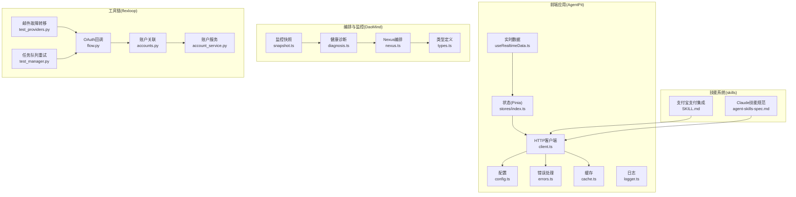
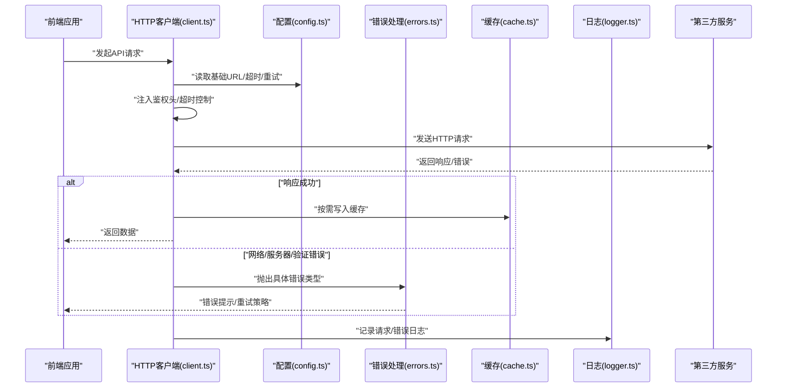
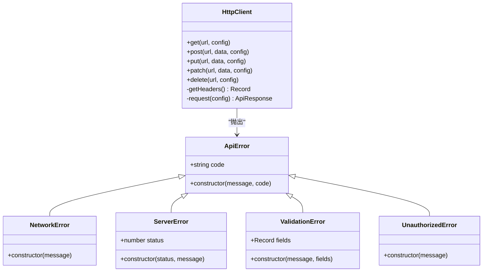
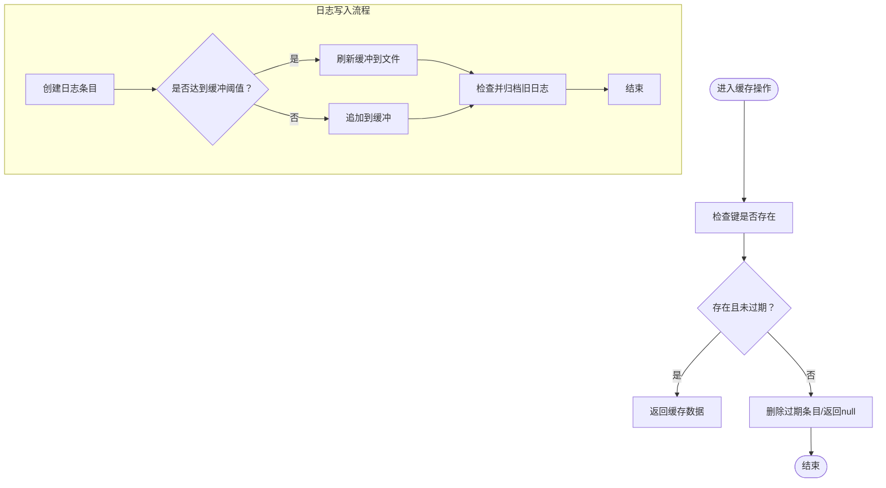
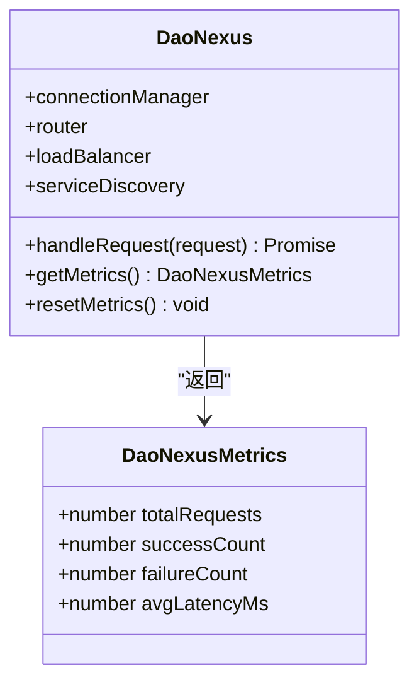
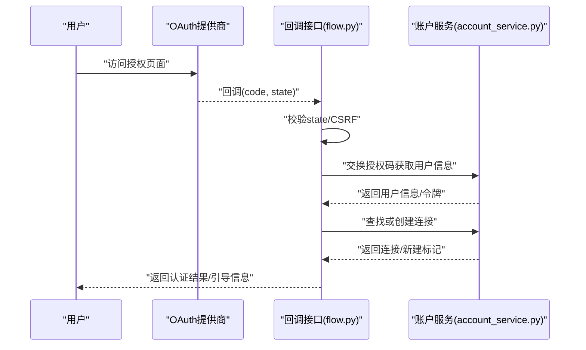
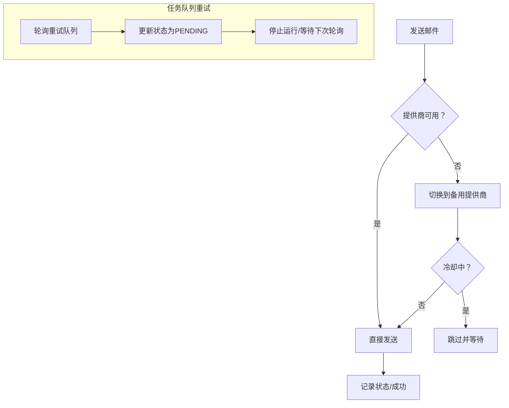
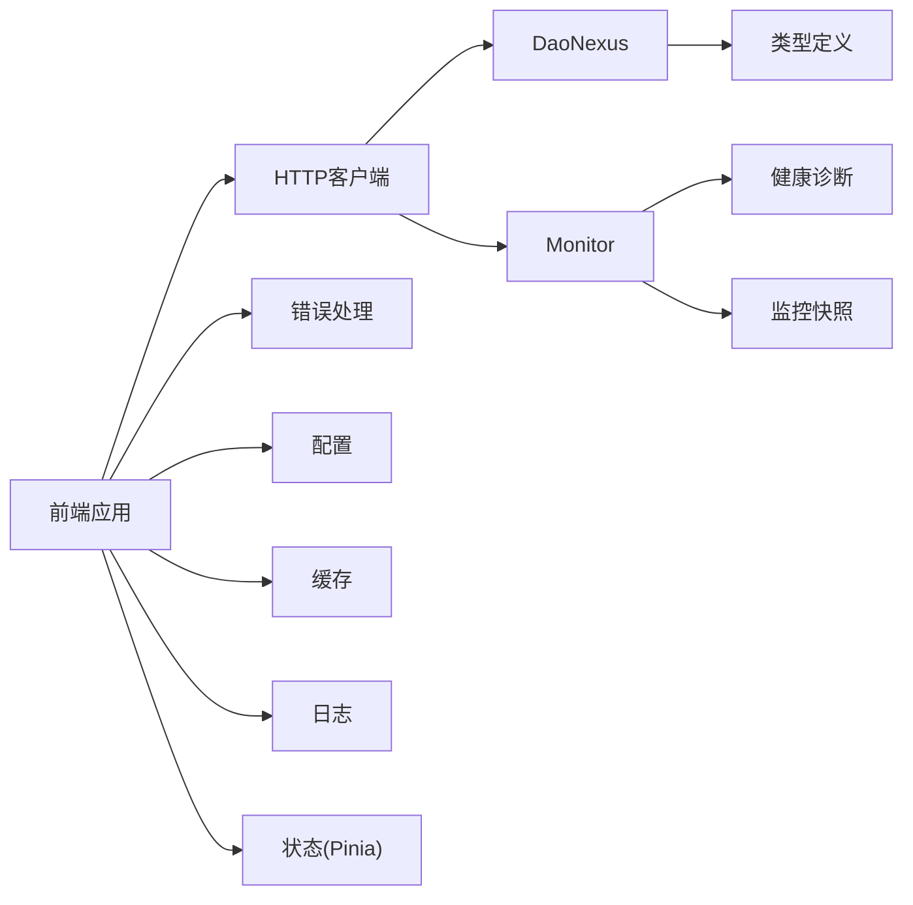
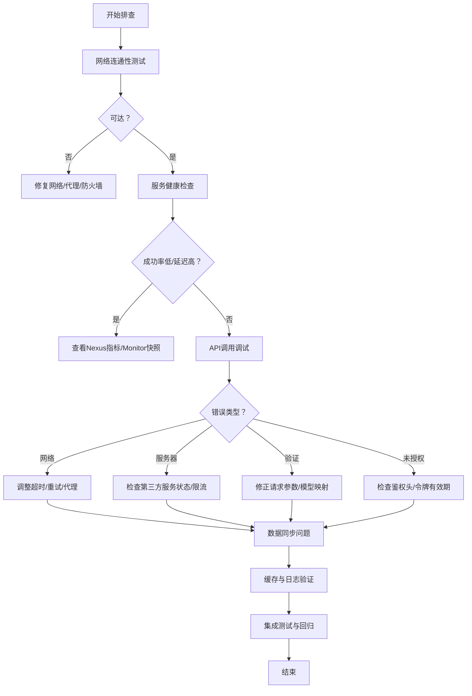

# 集成故障

<cite>
**本文引用的文件**   
- [apps/AgentPit/docs/API_INTEGRATION_PLAN.md](file://apps/AgentPit/docs/API_INTEGRATION_PLAN.md)
- [apps/AgentPit/src/services/api/client.ts](file://apps/AgentPit/src/services/api/client.ts)
- [apps/AgentPit/src/services/config.ts](file://apps/AgentPit/src/services/config.ts)
- [apps/AgentPit/src/services/errors.ts](file://apps/AgentPit/src/services/errors.ts)
- [apps/AgentPit/src/services/cache.ts](file://apps/AgentPit/src/services/cache.ts)
- [apps/AgentPit/src/stores/index.ts](file://apps/AgentPit/src/stores/index.ts)
- [apps/AgentPit/src/composables/useRealtimeData.ts](file://apps/AgentPit/src/composables/useRealtimeData.ts)
- [apps/AgentPit/src/utils/logger.ts](file://apps/AgentPit/src/utils/logger.ts)
- [apps/DaoMind/packages/daoNexus/src/nexus.ts](file://apps/DaoMind/packages/daoNexus/src/nexus.ts)
- [apps/DaoMind/packages/daoNexus/src/types.ts](file://apps/DaoMind/packages/daoNexus/src/types.ts)
- [apps/DaoMind/packages/daoNexus/src/__tests__/nexus.test.ts](file://apps/DaoMind/packages/daoNexus/src/__tests__/nexus.test.ts)
- [apps/DaoMind/packages/daoMonitor/src/diagnosis.ts](file://apps/DaoMind/packages/daoMonitor/src/diagnosis.ts)
- [apps/DaoMind/packages/daoMonitor/src/snapshot.ts](file://apps/DaoMind/packages/daoMonitor/src/snapshot.ts)
- [tools/flexloop/tests/testing/test_email_service/test_providers.py](file://tools/flexloop/tests/testing/test_email_service/test_providers.py)
- [tools/flexloop/tests/testing/test_task_queue/test_manager.py](file://tools/flexloop/tests/testing/test_task_queue/test_manager.py)
- [tools/flexloop/src/taolib/testing/oauth/server/api/flow.py](file://tools/flexloop/src/taolib/testing/oauth/server/api/flow.py)
- [tools/flexloop/src/taolib/testing/oauth/server/api/accounts.py](file://tools/flexloop/src/taolib/testing/oauth/server/api/accounts.py)
- [tools/flexloop/src/taolib/testing/oauth/services/account_service.py](file://tools/flexloop/src/taolib/testing/oauth/services/account_service.py)
- [apps/oauth-admin/src/pages/ProvidersPage.tsx](file://apps/oauth-admin/src/pages/ProvidersPage.tsx)
- [skills/daoSkilLs/skills/alipay-payment-integration/SKILL.md](file://skills/daoSkilLs/skills/alipay-payment-integration/SKILL.md)
- [skills/daoSkilLs/skills/anthropics-skills/spec/agent-skills-spec.md](file://skills/daoSkilLs/skills/anthropics-skills/spec/agent-skills-spec.md)
</cite>

## 目录
1. [简介](#简介)
2. [项目结构](#项目结构)
3. [核心组件](#核心组件)
4. [架构总览](#架构总览)
5. [详细组件分析](#详细组件分析)
6. [依赖关系分析](#依赖关系分析)
7. [性能考量](#性能考量)
8. [故障排查指南](#故障排查指南)
9. [结论](#结论)
10. [附录](#附录)

## 简介
本指南面向DAOApps项目的第三方服务集成，聚焦API连接失败、认证错误、数据格式不匹配、服务不可用等常见问题，提供针对支付网关、社交平台、云服务与技能系统的集成诊断方法，并配套网络连通性测试、服务健康检查、API调用调试与数据同步问题的解决方案。同时给出集成测试策略与故障恢复机制，帮助开发者快速定位与修复集成问题。

## 项目结构
DAOApps包含前端应用、监控与编排组件以及工具链中的集成测试与基准测试模块。与第三方服务集成相关的关键位置如下：
- 前端应用（AgentPit）：统一HTTP客户端、错误处理、缓存与日志；Pinia状态持久化；实时数据模拟与通知。
- 编排与监控（DaoMind）：服务编排（Nexus）、健康诊断与快照（Monitor）。
- 工具链（flexloop）：OAuth回调与账户关联流程、邮件服务故障转移、任务队列重试与恢复、负载均衡配置与断路器策略。
- 技能系统（skills/daoSkilLs）：支付、Claude技能等集成参考文档。

**图表来源**
- [apps/AgentPit/src/services/api/client.ts:1-200](file://apps/AgentPit/src/services/api/client.ts#L1-L200)
- [apps/AgentPit/src/services/config.ts:1-11](file://apps/AgentPit/src/services/config.ts#L1-L11)
- [apps/AgentPit/src/services/errors.ts:1-44](file://apps/AgentPit/src/services/errors.ts#L1-L44)
- [apps/AgentPit/src/services/cache.ts:1-50](file://apps/AgentPit/src/services/cache.ts#L1-L50)
- [apps/AgentPit/src/stores/index.ts:1-15](file://apps/AgentPit/src/stores/index.ts#L1-L15)
- [apps/AgentPit/src/composables/useRealtimeData.ts:1-117](file://apps/AgentPit/src/composables/useRealtimeData.ts#L1-L117)
- [apps/AgentPit/src/utils/logger.ts:1-412](file://apps/AgentPit/src/utils/logger.ts#L1-L412)
- [apps/DaoMind/packages/daoNexus/src/nexus.ts:74-102](file://apps/DaoMind/packages/daoNexus/src/nexus.ts#L74-L102)
- [apps/DaoMind/packages/daoNexus/src/types.ts:38-58](file://apps/DaoMind/packages/daoNexus/src/types.ts#L38-L58)
- [apps/DaoMind/packages/daoMonitor/src/diagnosis.ts:37-74](file://apps/DaoMind/packages/daoMonitor/src/diagnosis.ts#L37-L74)
- [apps/DaoMind/packages/daoMonitor/src/snapshot.ts:38-75](file://apps/DaoMind/packages/daoMonitor/src/snapshot.ts#L38-L75)
- [tools/flexloop/src/taolib/testing/oauth/server/api/flow.py:173-267](file://tools/flexloop/src/taolib/testing/oauth/server/api/flow.py#L173-L267)
- [tools/flexloop/src/taolib/testing/oauth/server/api/accounts.py:41-82](file://tools/flexloop/src/taolib/testing/oauth/server/api/accounts.py#L41-L82)
- [tools/flexloop/src/taolib/testing/oauth/services/account_service.py:106-145](file://tools/flexloop/src/taolib/testing/oauth/services/account_service.py#L106-L145)
- [tools/flexloop/tests/testing/test_email_service/test_providers.py:35-110](file://tools/flexloop/tests/testing/test_email_service/test_providers.py#L35-L110)
- [tools/flexloop/tests/testing/test_task_queue/test_manager.py:259-622](file://tools/flexloop/tests/testing/test_task_queue/test_manager.py#L259-L622)
- [skills/daoSkilLs/skills/alipay-payment-integration/SKILL.md:1-41](file://skills/daoSkilLs/skills/alipay-payment-integration/SKILL.md#L1-L41)
- [skills/daoSkilLs/skills/anthropics-skills/spec/agent-skills-spec.md:1-4](file://skills/daoSkilLs/skills/anthropics-skills/spec/agent-skills-spec.md#L1-L4)

**章节来源**
- [apps/AgentPit/docs/API_INTEGRATION_PLAN.md:1-431](file://apps/AgentPit/docs/API_INTEGRATION_PLAN.md#L1-L431)

## 核心组件
- HTTP客户端与统一错误处理：封装fetch请求、超时控制、鉴权头注入、错误分类与抛出，支撑各集成场景的API调用。
- 配置与环境变量：集中管理基础URL、超时、是否使用Mock、重试策略等。
- 缓存与日志：提供内存级缓存与文件落盘日志能力，辅助诊断与性能优化。
- 状态管理与实时数据：Pinia持久化与定时模拟数据更新，便于观察集成后的数据流变化。
- 编排与监控：Nexus服务编排与指标统计，Monitor健康诊断与快照生成，用于服务整体健康度评估。
- 工具链集成：OAuth回调、账户关联、邮件服务故障转移、任务队列重试与恢复，体现集成的健壮性与容错能力。

**章节来源**
- [apps/AgentPit/src/services/api/client.ts:1-200](file://apps/AgentPit/src/services/api/client.ts#L1-L200)
- [apps/AgentPit/src/services/config.ts:1-11](file://apps/AgentPit/src/services/config.ts#L1-L11)
- [apps/AgentPit/src/services/errors.ts:1-44](file://apps/AgentPit/src/services/errors.ts#L1-L44)
- [apps/AgentPit/src/services/cache.ts:1-50](file://apps/AgentPit/src/services/cache.ts#L1-L50)
- [apps/AgentPit/src/stores/index.ts:1-15](file://apps/AgentPit/src/stores/index.ts#L1-L15)
- [apps/AgentPit/src/composables/useRealtimeData.ts:1-117](file://apps/AgentPit/src/composables/useRealtimeData.ts#L1-L117)
- [apps/AgentPit/src/utils/logger.ts:1-412](file://apps/AgentPit/src/utils/logger.ts#L1-L412)
- [apps/DaoMind/packages/daoNexus/src/nexus.ts:74-102](file://apps/DaoMind/packages/daoNexus/src/nexus.ts#L74-L102)
- [apps/DaoMind/packages/daoMonitor/src/diagnosis.ts:37-74](file://apps/DaoMind/packages/daoMonitor/src/diagnosis.ts#L37-L74)
- [apps/DaoMind/packages/daoMonitor/src/snapshot.ts:38-75](file://apps/DaoMind/packages/daoMonitor/src/snapshot.ts#L38-L75)
- [tools/flexloop/src/taolib/testing/oauth/server/api/flow.py:173-267](file://tools/flexloop/src/taolib/testing/oauth/server/api/flow.py#L173-L267)
- [tools/flexloop/tests/testing/test_email_service/test_providers.py:35-110](file://tools/flexloop/tests/testing/test_email_service/test_providers.py#L35-L110)
- [tools/flexloop/tests/testing/test_task_queue/test_manager.py:259-622](file://tools/flexloop/tests/testing/test_task_queue/test_manager.py#L259-L622)

## 架构总览
下图展示典型第三方服务集成的调用链：前端通过HTTP客户端发起请求，经统一错误处理与缓存，最终到达后端服务；同时结合日志与监控进行可观测性保障。

**图表来源**
- [apps/AgentPit/src/services/api/client.ts:142-179](file://apps/AgentPit/src/services/api/client.ts#L142-L179)
- [apps/AgentPit/src/services/config.ts:1-11](file://apps/AgentPit/src/services/config.ts#L1-L11)
- [apps/AgentPit/src/services/errors.ts:1-44](file://apps/AgentPit/src/services/errors.ts#L1-L44)
- [apps/AgentPit/src/services/cache.ts:1-50](file://apps/AgentPit/src/services/cache.ts#L1-L50)
- [apps/AgentPit/src/utils/logger.ts:374-397](file://apps/AgentPit/src/utils/logger.ts#L374-L397)

## 详细组件分析

### HTTP客户端与错误处理
- 统一请求封装：支持GET/POST/PUT/PATCH/DELETE，自动注入Authorization头，超时控制，JSON序列化与响应解析。
- 错误分类：NetworkError（超时/网络失败）、ServerError（HTTP状态码）、ValidationError（字段级校验）、UnauthorizedError（未授权）。
- 与配置联动：读取基础URL、超时、是否使用Mock、重试策略，支持渐进式迁移。

**图表来源**
- [apps/AgentPit/src/services/api/client.ts:19-200](file://apps/AgentPit/src/services/api/client.ts#L19-L200)
- [apps/AgentPit/src/services/errors.ts:1-44](file://apps/AgentPit/src/services/errors.ts#L1-L44)

**章节来源**
- [apps/AgentPit/src/services/api/client.ts:1-200](file://apps/AgentPit/src/services/api/client.ts#L1-L200)
- [apps/AgentPit/src/services/errors.ts:1-44](file://apps/AgentPit/src/services/errors.ts#L1-L44)

### 缓存与日志
- 缓存：基于Map的内存缓存，支持TTL、批量清理与正则模式清理，适配前端轻量缓存需求。
- 日志：支持浏览器与Node环境，缓冲区写入、定时刷新、日志轮转与归档清理，便于集成问题定位。

**图表来源**
- [apps/AgentPit/src/services/cache.ts:11-46](file://apps/AgentPit/src/services/cache.ts#L11-L46)
- [apps/AgentPit/src/utils/logger.ts:148-209](file://apps/AgentPit/src/utils/logger.ts#L148-L209)

**章节来源**
- [apps/AgentPit/src/services/cache.ts:1-50](file://apps/AgentPit/src/services/cache.ts#L1-L50)
- [apps/AgentPit/src/utils/logger.ts:1-412](file://apps/AgentPit/src/utils/logger.ts#L1-L412)

### 编排与监控（DaoNexus与Monitor）
- DaoNexus：提供连接管理、路由、负载均衡与服务发现的聚合入口，支持指标统计与重置。
- Monitor：健康诊断与快照生成，支持节点状态、趋势与系统健康度计算。

**图表来源**
- [apps/DaoMind/packages/daoNexus/src/nexus.ts:74-102](file://apps/DaoMind/packages/daoNexus/src/nexus.ts#L74-L102)
- [apps/DaoMind/packages/daoNexus/src/types.ts:52-58](file://apps/DaoMind/packages/daoNexus/src/types.ts#L52-L58)

**章节来源**
- [apps/DaoMind/packages/daoNexus/src/nexus.ts:74-102](file://apps/DaoMind/packages/daoNexus/src/nexus.ts#L74-L102)
- [apps/DaoMind/packages/daoNexus/src/types.ts:38-58](file://apps/DaoMind/packages/daoNexus/src/types.ts#L38-L58)
- [apps/DaoMind/packages/daoMonitor/src/diagnosis.ts:37-74](file://apps/DaoMind/packages/daoMonitor/src/diagnosis.ts#L37-L74)
- [apps/DaoMind/packages/daoMonitor/src/snapshot.ts:38-75](file://apps/DaoMind/packages/daoMonitor/src/snapshot.ts#L38-L75)

### OAuth集成（社交平台）
- 回调流程：校验state（CSRF防护）、交换授权码获取用户信息、查找或创建连接、创建会话并返回Token。
- 账户关联：生成授权URL、完成关联流程，支持将新提供商关联到当前用户。

**图表来源**
- [tools/flexloop/src/taolib/testing/oauth/server/api/flow.py:236-267](file://tools/flexloop/src/taolib/testing/oauth/server/api/flow.py#L236-L267)
- [tools/flexloop/src/taolib/testing/oauth/server/api/accounts.py:41-82](file://tools/flexloop/src/taolib/testing/oauth/server/api/accounts.py#L41-L82)
- [tools/flexloop/src/taolib/testing/oauth/services/account_service.py:106-145](file://tools/flexloop/src/taolib/testing/oauth/services/account_service.py#L106-L145)

**章节来源**
- [tools/flexloop/src/taolib/testing/oauth/server/api/flow.py:173-267](file://tools/flexloop/src/taolib/testing/oauth/server/api/flow.py#L173-L267)
- [tools/flexloop/src/taolib/testing/oauth/server/api/accounts.py:41-82](file://tools/flexloop/src/taolib/testing/oauth/server/api/accounts.py#L41-L82)
- [tools/flexloop/src/taolib/testing/oauth/services/account_service.py:106-145](file://tools/flexloop/src/taolib/testing/oauth/services/account_service.py#L106-L145)

### 集成测试策略与故障恢复
- 邮件服务故障转移：提供者失败时自动切换、冷却策略与健康检查恢复。
- 任务队列重试：轮询重试队列、运行中任务恢复、失败冷却与状态重置。
- 负载均衡与断路器：最少连接策略、健康检查间隔、失败阈值与重试超时。

**图表来源**
- [tools/flexloop/tests/testing/test_email_service/test_providers.py:35-110](file://tools/flexloop/tests/testing/test_email_service/test_providers.py#L35-L110)
- [tools/flexloop/tests/testing/test_task_queue/test_manager.py:259-622](file://tools/flexloop/tests/testing/test_task_queue/test_manager.py#L259-L622)

**章节来源**
- [tools/flexloop/tests/testing/test_email_service/test_providers.py:35-110](file://tools/flexloop/tests/testing/test_email_service/test_providers.py#L35-L110)
- [tools/flexloop/tests/testing/test_task_queue/test_manager.py:259-622](file://tools/flexloop/tests/testing/test_task_queue/test_manager.py#L259-L622)

## 依赖关系分析
- 前端应用依赖HTTP客户端与错误处理，受配置驱动；状态持久化与实时数据用于观测集成效果。
- 编排与监控组件提供跨服务的健康度与指标，辅助集成问题的全局定位。
- 工具链中的OAuth、邮件与任务队列测试体现了集成的健壮性与容错策略。

**图表来源**
- [apps/AgentPit/src/services/api/client.ts:1-200](file://apps/AgentPit/src/services/api/client.ts#L1-L200)
- [apps/AgentPit/src/services/errors.ts:1-44](file://apps/AgentPit/src/services/errors.ts#L1-L44)
- [apps/AgentPit/src/services/config.ts:1-11](file://apps/AgentPit/src/services/config.ts#L1-L11)
- [apps/AgentPit/src/services/cache.ts:1-50](file://apps/AgentPit/src/services/cache.ts#L1-L50)
- [apps/AgentPit/src/utils/logger.ts:1-412](file://apps/AgentPit/src/utils/logger.ts#L1-L412)
- [apps/DaoMind/packages/daoNexus/src/nexus.ts:74-102](file://apps/DaoMind/packages/daoNexus/src/nexus.ts#L74-L102)
- [apps/DaoMind/packages/daoMonitor/src/diagnosis.ts:37-74](file://apps/DaoMind/packages/daoMonitor/src/diagnosis.ts#L37-L74)
- [apps/DaoMind/packages/daoMonitor/src/snapshot.ts:38-75](file://apps/DaoMind/packages/daoMonitor/src/snapshot.ts#L38-L75)

**章节来源**
- [apps/AgentPit/src/stores/index.ts:1-15](file://apps/AgentPit/src/stores/index.ts#L1-L15)
- [apps/DaoMind/packages/daoNexus/src/types.ts:38-58](file://apps/DaoMind/packages/daoNexus/src/types.ts#L38-L58)

## 性能考量
- 请求超时与重试：合理设置超时与重试次数，避免阻塞前端交互。
- 缓存策略：对高频读取的数据启用缓存，降低第三方服务压力。
- 日志落盘：生产环境使用文件日志与轮转，避免内存占用与I/O阻塞。
- 负载均衡与断路器：在工具链中已体现，集成时可借鉴其配置与策略。

**章节来源**
- [apps/AgentPit/src/services/config.ts:6-9](file://apps/AgentPit/src/services/config.ts#L6-L9)
- [apps/AgentPit/src/services/cache.ts:23-28](file://apps/AgentPit/src/services/cache.ts#L23-L28)
- [apps/AgentPit/src/utils/logger.ts:108-132](file://apps/AgentPit/src/utils/logger.ts#L108-L132)
- [tools/flexloop/tests/testing/test_multi_agent/test_load_balancer.py:216-228](file://tools/flexloop/tests/testing/test_multi_agent/test_load_balancer.py#L216-L228)

## 故障排查指南

### 通用排查步骤
- 网络连通性测试：确认基础URL可达、DNS解析正常、代理与防火墙放行。
- 服务健康检查：通过DaoNexus指标与Monitor快照查看服务请求总量、成功率、失败率与平均延迟。
- API调用调试：开启日志，捕获请求与响应详情；检查错误类型（网络/服务器/验证/未授权）。
- 数据同步问题：核对缓存键与TTL，检查前后端数据模型差异与字段映射。

**图表来源**
- [apps/AgentPit/src/services/api/client.ts:142-179](file://apps/AgentPit/src/services/api/client.ts#L142-L179)
- [apps/AgentPit/src/services/errors.ts:1-44](file://apps/AgentPit/src/services/errors.ts#L1-L44)
- [apps/AgentPit/src/utils/logger.ts:374-397](file://apps/AgentPit/src/utils/logger.ts#L374-L397)
- [apps/DaoMind/packages/daoNexus/src/nexus.ts:74-102](file://apps/DaoMind/packages/daoNexus/src/nexus.ts#L74-L102)
- [apps/DaoMind/packages/daoMonitor/src/snapshot.ts:38-75](file://apps/DaoMind/packages/daoMonitor/src/snapshot.ts#L38-L75)

### 支付网关集成（以支付宝为例）
- 场景确认：根据技能文档中的产品模块与集成流程，核对支付场景与路由表。
- 参数与签名：确保请求参数完整、签名算法正确、回调地址与沙箱配置一致。
- 错误码与重试：依据第三方错误码进行分类处理，必要时触发重试或降级。

**章节来源**
- [skills/daoSkilLs/skills/alipay-payment-integration/SKILL.md:1-41](file://skills/daoSkilLs/skills/alipay-payment-integration/SKILL.md#L1-L41)

### 社交平台集成（OAuth）
- 回调流程：校验state、交换授权码、获取用户信息、创建或关联连接。
- 状态与错误：关注400/404/502等状态码，结合日志与监控定位问题。
- 管理界面：在OAuth管理页面配置提供商参数，确保Client ID/Secret正确。

**章节来源**
- [tools/flexloop/src/taolib/testing/oauth/server/api/flow.py:173-267](file://tools/flexloop/src/taolib/testing/oauth/server/api/flow.py#L173-L267)
- [apps/oauth-admin/src/pages/ProvidersPage.tsx:220-242](file://apps/oauth-admin/src/pages/ProvidersPage.tsx#L220-L242)

### 云服务集成（对象存储/CDN）
- 预签名URL：检查对象存在性、生成预签名URL与过期时间。
- CDN签名：若使用CDN，确认签名URL生成与有效期参数。
- 错误处理：文件不存在、权限不足、签名失败等场景的错误提示与回退。

**章节来源**
- [tools/flexloop/tests/testing/test_file_storage/test_services.py:340-995](file://tools/flexloop/tests/testing/test_file_storage/test_services.py#L340-L995)

### 技能系统集成（Claude Skills）
- 规范与元数据：遵循技能规范文档，确保元数据、接入环境与安全规范符合要求。
- 产品模块：根据技能文档的模块划分，逐项验证接口与流程。

**章节来源**
- [skills/daoSkilLs/skills/anthropics-skills/spec/agent-skills-spec.md:1-4](file://skills/daoSkilLs/skills/anthropics-skills/spec/agent-skills-spec.md#L1-L4)

### 集成测试策略
- 单元测试：覆盖HTTP客户端、错误处理、缓存与日志的核心行为。
- 集成测试：模拟第三方服务响应，验证请求构造、错误分类与重试逻辑。
- 回归测试：在Mock与真实API之间切换，确保迁移过程的稳定性。

**章节来源**
- [apps/AgentPit/docs/API_INTEGRATION_PLAN.md:348-377](file://apps/AgentPit/docs/API_INTEGRATION_PLAN.md#L348-L377)

### 故障恢复机制
- 邮件服务故障转移：提供者失败时自动切换、冷却与健康检查恢复。
- 任务队列重试：轮询重试队列、运行中任务恢复、失败冷却与状态重置。
- 负载均衡与断路器：最少连接策略、健康检查与失败阈值，防止雪崩效应。

**章节来源**
- [tools/flexloop/tests/testing/test_email_service/test_providers.py:35-110](file://tools/flexloop/tests/testing/test_email_service/test_providers.py#L35-L110)
- [tools/flexloop/tests/testing/test_task_queue/test_manager.py:259-622](file://tools/flexloop/tests/testing/test_task_queue/test_manager.py#L259-L622)
- [tools/flexloop/tests/testing/test_multi_agent/test_load_balancer.py:216-228](file://tools/flexloop/tests/testing/test_multi_agent/test_load_balancer.py#L216-L228)

## 结论
通过统一的HTTP客户端、错误处理、缓存与日志，配合DaoNexus与Monitor的可观测性，DAOApps项目能够系统化地排查第三方服务集成问题。结合OAuth、支付、云服务与技能系统的专项流程与测试策略，可有效提升集成质量与稳定性，并在出现故障时快速恢复。

## 附录
- 环境变量与配置：确保基础URL、超时、Mock开关与重试策略正确设置。
- 实时数据与通知：利用实时数据模拟与通知机制，辅助观察集成后的数据流变化。
- 文档与规范：遵循技能系统与API集成方案文档，确保集成步骤与参数一致。

**章节来源**
- [apps/AgentPit/src/services/config.ts:1-11](file://apps/AgentPit/src/services/config.ts#L1-L11)
- [apps/AgentPit/src/composables/useRealtimeData.ts:74-102](file://apps/AgentPit/src/composables/useRealtimeData.ts#L74-L102)
- [apps/AgentPit/docs/API_INTEGRATION_PLAN.md:381-400](file://apps/AgentPit/docs/API_INTEGRATION_PLAN.md#L381-L400)