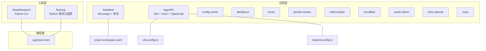
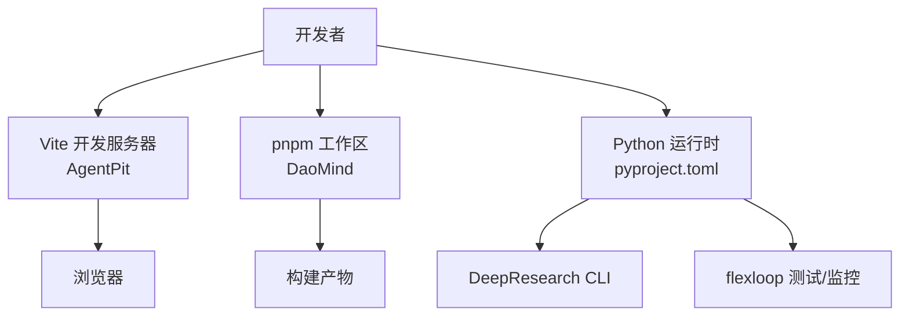
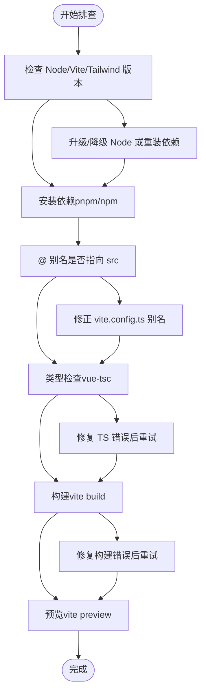
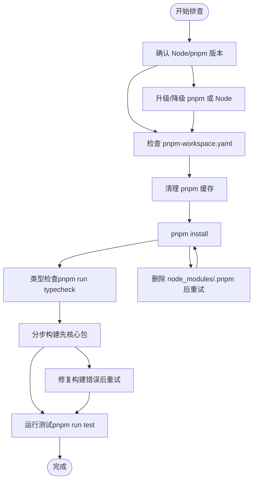
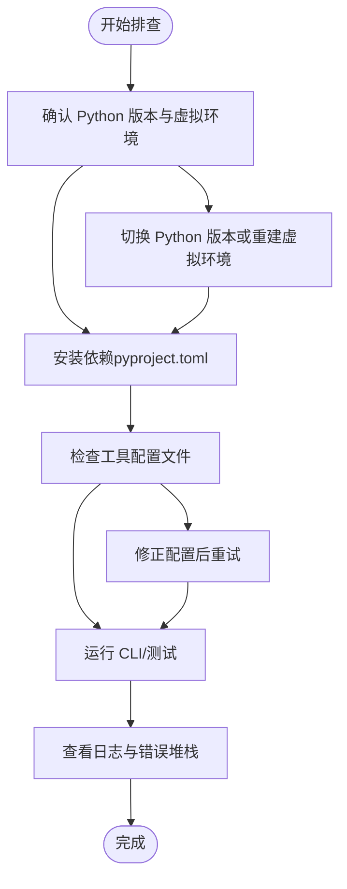

# 故障排除与常见问题

<cite>
**本文引用的文件**
- [apps/AgentPit/README.md](file://apps/AgentPit/README.md)
- [apps/AgentPit/package.json](file://apps/AgentPit/package.json)
- [apps/AgentPit/vite.config.ts](file://apps/AgentPit/vite.config.ts)
- [apps/AgentPit/tailwind.config.ts](file://apps/AgentPit/tailwind.config.ts)
- [apps/DaoMind/README.md](file://apps/DaoMind/README.md)
- [apps/DaoMind/pnpm-workspace.yaml](file://apps/DaoMind/pnpm-workspace.yaml)
- [apps/DaoMind/package.json](file://apps/DaoMind/package.json)
- [tools/DeepResearch/README.md](file://tools/DeepResearch/README.md)
- [tools/flexloop/README.md](file://tools/flexloop/README.md)
- [pyproject.toml](file://pyproject.toml)
</cite>

## 目录
1. [引言](#引言)
2. [项目结构](#项目结构)
3. [核心组件](#核心组件)
4. [架构总览](#架构总览)
5. [详细组件分析](#详细组件分析)
6. [依赖分析](#依赖分析)
7. [性能考虑](#性能考虑)
8. [故障排除指南](#故障排除指南)
9. [结论](#结论)
10. [附录](#附录)

## 引言
本指南面向 DAO Collective 项目使用者与贡献者，聚焦于常见问题的诊断与解决，覆盖环境配置、依赖安装、运行时错误、性能问题等主题。内容以“初学者友好、专家可用”为原则，提供可操作的排查步骤、日志与调试建议，并给出社区支持与版本兼容性参考。

## 项目结构
DAO Collective 采用多应用与多包混合的结构：
- 应用层（apps）：包含多个前端应用与工具页面，如 AgentPit、DaoMind、config-center、daoNexus、forum、growth-tracker、habit-tracker、moodflow、oauth-admin、time-capsule、xinyu 等。
- 工具层（tools）：包含 DeepResearch、flexloop 等 Python/CLI 工具与测试框架。
- 根级配置：pyproject.toml 提供 Python 工程与发布配置；各应用与包通过各自 package.json/vite.config.ts 等进行本地开发与构建。

图表来源
- [apps/AgentPit/vite.config.ts:1-15](file://apps/AgentPit/vite.config.ts#L1-L15)
- [apps/AgentPit/tailwind.config.ts:1-27](file://apps/AgentPit/tailwind.config.ts#L1-L27)
- [apps/DaoMind/pnpm-workspace.yaml:1-3](file://apps/DaoMind/pnpm-workspace.yaml#L1-L3)
- [pyproject.toml](file://pyproject.toml)

章节来源
- [apps/AgentPit/README.md:1-6](file://apps/AgentPit/README.md#L1-L6)
- [apps/DaoMind/README.md:1-552](file://apps/DaoMind/README.md#L1-L552)
- [apps/DaoMind/pnpm-workspace.yaml:1-3](file://apps/DaoMind/pnpm-workspace.yaml#L1-L3)
- [apps/AgentPit/package.json:1-73](file://apps/AgentPit/package.json#L1-L73)
- [apps/DaoMind/package.json:1-1](file://apps/DaoMind/package.json#L1-L1)

## 核心组件
- AgentPit（前端应用）
  - 技术栈：Vue 3 + TypeScript + Vite + TailwindCSS
  - 关键脚本：开发、构建、预览、类型检查、代码格式化、ESLint、单元测试
  - 路径别名：@ 指向 src
- DaoMind（Monorepo 核心）
  - 工作区：packages/*
  - 根脚本：统一构建、测试、代码质量检查
  - 支持 pnpm 作为包管理器
- 工具层
  - DeepResearch：Python CLI 与研究工具链
  - flexloop：Python 测试与监控基础设施

章节来源
- [apps/AgentPit/package.json:1-73](file://apps/AgentPit/package.json#L1-L73)
- [apps/AgentPit/vite.config.ts:1-15](file://apps/AgentPit/vite.config.ts#L1-L15)
- [apps/AgentPit/tailwind.config.ts:1-27](file://apps/AgentPit/tailwind.config.ts#L1-L27)
- [apps/DaoMind/pnpm-workspace.yaml:1-3](file://apps/DaoMind/pnpm-workspace.yaml#L1-L3)
- [apps/DaoMind/package.json:1-1](file://apps/DaoMind/package.json#L1-L1)
- [tools/DeepResearch/README.md](file://tools/DeepResearch/README.md)
- [tools/flexloop/README.md](file://tools/flexloop/README.md)

## 架构总览
从部署与运行视角，系统由“前端应用 + 工具层 + 根配置”构成。前端应用通过 Vite 开发服务器启动，DaoMind 通过 pnpm 工作区统一管理多包；工具层通过 Python 生态与 pyproject.toml 进行工程化管理。

图表来源
- [apps/AgentPit/vite.config.ts:1-15](file://apps/AgentPit/vite.config.ts#L1-L15)
- [apps/DaoMind/pnpm-workspace.yaml:1-3](file://apps/DaoMind/pnpm-workspace.yaml#L1-L3)
- [pyproject.toml](file://pyproject.toml)

## 详细组件分析

### AgentPit（前端应用）故障定位
- 症状与可能原因
  - 启动失败：端口被占用、Node 版本不满足、依赖未安装
  - 构建失败：TypeScript 类型错误、ESLint 报错、Tailwind 配置问题
  - 预览异常：静态资源路径或别名解析错误
- 排查步骤
  - 环境确认：检查 Node 版本、Vite 插件加载、Tailwind 配置扫描范围
  - 依赖安装：使用 pnpm（DaoMind 工作区）或 npm/pnpm 安装依赖
  - 路径别名：确认 @ 别名指向 src
  - 类型检查：先执行类型检查，修复后再构建
  - 日志与调试：查看终端输出、浏览器控制台、Vite 插件报错
- 常见场景与处理
  - 端口冲突：修改 Vite 端口或释放占用进程
  - Tailwind 未生效：确认 content 路径包含目标文件
  - ESLint/Prettier 冲突：按脚本顺序执行格式化与修复

图表来源
- [apps/AgentPit/package.json:1-73](file://apps/AgentPit/package.json#L1-L73)
- [apps/AgentPit/vite.config.ts:1-15](file://apps/AgentPit/vite.config.ts#L1-L15)
- [apps/AgentPit/tailwind.config.ts:1-27](file://apps/AgentPit/tailwind.config.ts#L1-L27)

章节来源
- [apps/AgentPit/README.md:1-6](file://apps/AgentPit/README.md#L1-L6)
- [apps/AgentPit/package.json:1-73](file://apps/AgentPit/package.json#L1-L73)
- [apps/AgentPit/vite.config.ts:1-15](file://apps/AgentPit/vite.config.ts#L1-L15)
- [apps/AgentPit/tailwind.config.ts:1-27](file://apps/AgentPit/tailwind.config.ts#L1-L27)

### DaoMind（Monorepo）故障定位
- 症状与可能原因
  - pnpm 安装失败：网络问题、缓存损坏、版本不匹配
  - 构建失败：子包未构建、类型检查失败、工作区链接异常
  - 测试失败：Jest 配置问题、测试环境变量缺失
- 排查步骤
  - 环境确认：Node 版本、pnpm 版本、工作区配置
  - 清理缓存：清理 pnpm store，重新安装
  - 分步构建：先构建核心包，再构建应用包
  - 类型检查：逐包执行类型检查，定位错误
  - 测试：单独进入子包运行测试，观察失败用例
- 常见场景与处理
  - 子包导入失败：确保已构建；检查 tsconfig 路径映射
  - 性能问题：运行基准测试，结合监控工具定位瓶颈

图表来源
- [apps/DaoMind/README.md:27-72](file://apps/DaoMind/README.md#L27-L72)
- [apps/DaoMind/pnpm-workspace.yaml:1-3](file://apps/DaoMind/pnpm-workspace.yaml#L1-L3)
- [apps/DaoMind/package.json:1-1](file://apps/DaoMind/package.json#L1-L1)

章节来源
- [apps/DaoMind/README.md:1-552](file://apps/DaoMind/README.md#L1-L552)
- [apps/DaoMind/pnpm-workspace.yaml:1-3](file://apps/DaoMind/pnpm-workspace.yaml#L1-L3)
- [apps/DaoMind/package.json:1-1](file://apps/DaoMind/package.json#L1-L1)

### 工具层（DeepResearch / flexloop）故障定位
- 症状与可能原因
  - Python 环境问题：解释器版本不匹配、虚拟环境未激活、依赖未安装
  - CLI 命令失败：缺少配置文件、权限不足、路径错误
  - 性能/稳定性问题：并发设置不当、外部服务超时
- 排查步骤
  - 环境确认：Python 版本、pip/pipenv/conda 状态
  - 依赖安装：根据 pyproject.toml 安装开发与运行依赖
  - 配置检查：读取工具配置文件（如 llms.toml、workflow.toml），确认路径与密钥
  - 日志与调试：开启详细日志，查看工具输出与错误堆栈
- 常见场景与处理
  - LLM/搜索服务不可用：检查网络与服务端点
  - 并发过高导致超时：降低并发或增加超时阈值

图表来源
- [tools/DeepResearch/README.md](file://tools/DeepResearch/README.md)
- [tools/flexloop/README.md](file://tools/flexloop/README.md)
- [pyproject.toml](file://pyproject.toml)

章节来源
- [tools/DeepResearch/README.md](file://tools/DeepResearch/README.md)
- [tools/flexloop/README.md](file://tools/flexloop/README.md)
- [pyproject.toml](file://pyproject.toml)

## 依赖分析
- 包管理器选择
  - 前端应用（AgentPit）：优先使用 pnpm（与 DaoMind 工作区一致），避免版本漂移
  - 工具层（Python）：遵循 pyproject.toml 的依赖声明
- 版本兼容性
  - Node：建议使用 18+（DaoMind 要求）
  - pnpm：6.0+
  - Python：遵循 pyproject.toml 中的 engines 字段
- 常见依赖问题
  - 同一依赖不同版本：锁定版本或使用 pnpm 的去重策略
  - 缓存污染：定期清理 pnpm store，重建 node_modules

章节来源
- [apps/DaoMind/README.md:27-41](file://apps/DaoMind/README.md#L27-L41)
- [apps/DaoMind/package.json:1-1](file://apps/DaoMind/package.json#L1-L1)
- [apps/AgentPit/package.json:1-73](file://apps/AgentPit/package.json#L1-L73)
- [pyproject.toml](file://pyproject.toml)

## 性能考虑
- 前端性能
  - 构建优化：启用生产模式、按需加载、Tree Shaking
  - 资源体积：分析包大小，移除未使用依赖
  - 运行时：减少不必要的响应式更新，合理拆分组件
- 工具层性能
  - 并发控制：合理设置并发度，避免外部服务过载
  - 超时与重试：为外部请求配置合理的超时与重试策略
  - 监控与采样：使用工具自带的日志与指标，持续观测关键路径

[本节为通用指导，无需列出章节来源]

## 故障排除指南

### 环境配置问题
- Node 版本不符
  - 现象：安装或运行时报错
  - 处理：升级/降级 Node 至 18+，清理缓存后重试
- pnpm 版本不符
  - 现象：安装失败或工作区异常
  - 处理：升级至 6.0+，清理 store 后重装
- Python 环境问题
  - 现象：CLI 不可用或导入失败
  - 处理：激活正确虚拟环境，安装 pyproject.toml 声明的依赖

章节来源
- [apps/DaoMind/README.md:27-41](file://apps/DaoMind/README.md#L27-L41)
- [apps/DaoMind/package.json:1-1](file://apps/DaoMind/package.json#L1-L1)
- [pyproject.toml](file://pyproject.toml)

### 依赖安装问题
- pnpm 安装失败
  - 现象：网络超时、缓存损坏
  - 处理：清理 pnpm store，更换镜像源，重试安装
- 子包导入失败
  - 现象：模块未找到
  - 处理：先构建根项目，检查 tsconfig 路径映射，确认别名配置
- Python 依赖缺失
  - 现象：ImportError 或命令不存在
  - 处理：根据 pyproject.toml 安装依赖，检查 PATH 与虚拟环境

章节来源
- [apps/DaoMind/README.md:400-435](file://apps/DaoMind/README.md#L400-L435)
- [apps/DaoMind/pnpm-workspace.yaml:1-3](file://apps/DaoMind/pnpm-workspace.yaml#L1-L3)
- [pyproject.toml](file://pyproject.toml)

### 运行时错误
- Vite 启动失败
  - 现象：端口占用、插件加载失败
  - 处理：修改端口、检查插件列表与版本、确认 content 路径
- 构建失败
  - 现象：TypeScript 错误、ESLint 报错
  - 处理：先修复类型错误，再执行 ESLint 修复，最后构建
- 测试失败
  - 现象：断言失败、异步未完成
  - 处理：检查测试环境、模拟数据与异步逻辑，逐步缩小范围

章节来源
- [apps/AgentPit/package.json:1-73](file://apps/AgentPit/package.json#L1-L73)
- [apps/AgentPit/vite.config.ts:1-15](file://apps/AgentPit/vite.config.ts#L1-L15)
- [apps/AgentPit/tailwind.config.ts:1-27](file://apps/AgentPit/tailwind.config.ts#L1-L27)
- [apps/DaoMind/README.md:418-426](file://apps/DaoMind/README.md#L418-L426)

### 性能问题
- 前端性能
  - 现象：首屏慢、内存占用高
  - 处理：分析包体积、拆分路由、启用懒加载、优化 Tailwind 使用
- 工具层性能
  - 现象：CLI 卡顿、外部服务超时
  - 处理：降低并发、增加超时、使用缓存与重试策略

章节来源
- [apps/DaoMind/README.md:436-444](file://apps/DaoMind/README.md#L436-L444)
- [tools/DeepResearch/README.md](file://tools/DeepResearch/README.md)
- [tools/flexloop/README.md](file://tools/flexloop/README.md)

### 调试与日志
- 前端调试
  - 使用浏览器开发者工具查看网络、控制台与性能面板
  - 在 Vite 中启用严格模式与详细日志
- 工具层调试
  - 开启工具日志级别，输出关键路径与耗时
  - 使用测试用例最小化复现问题

章节来源
- [apps/AgentPit/package.json:1-73](file://apps/AgentPit/package.json#L1-L73)
- [tools/DeepResearch/README.md](file://tools/DeepResearch/README.md)
- [tools/flexloop/README.md](file://tools/flexloop/README.md)

### 社区支持与问题反馈
- 参考文档与规范
  - DaoMind 项目文档与规范：README 中包含规范与任务清单链接
- 版本兼容性
  - 严格遵循各应用与工具的环境要求（Node、pnpm、Python）

章节来源
- [apps/DaoMind/README.md:541-549](file://apps/DaoMind/README.md#L541-L549)
- [apps/DaoMind/README.md:27-41](file://apps/DaoMind/README.md#L27-L41)
- [apps/DaoMind/package.json:1-1](file://apps/DaoMind/package.json#L1-L1)

## 结论
通过明确的环境要求、规范的依赖管理与系统化的排查流程，大多数问题可在短时间内定位并解决。建议在开发与集成阶段持续关注日志与性能指标，形成“发现问题—定位问题—修复验证”的闭环。

[本节为总结性内容，无需列出章节来源]

## 附录

### 快速检查清单
- 环境：Node/pnpm/Python 版本满足要求
- 依赖：pnpm 安装成功，Python 依赖完整
- 构建：类型检查通过，构建产物生成
- 运行：Vite 启动成功，浏览器可访问
- 测试：单测与集成测试通过
- 性能：关键指标在预期范围内

[本节为通用指导，无需列出章节来源]