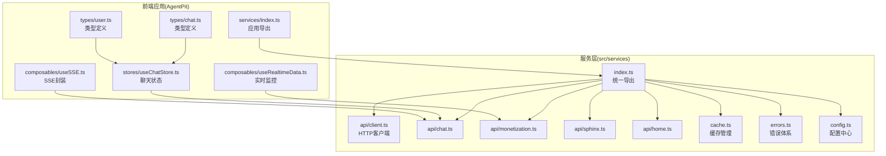
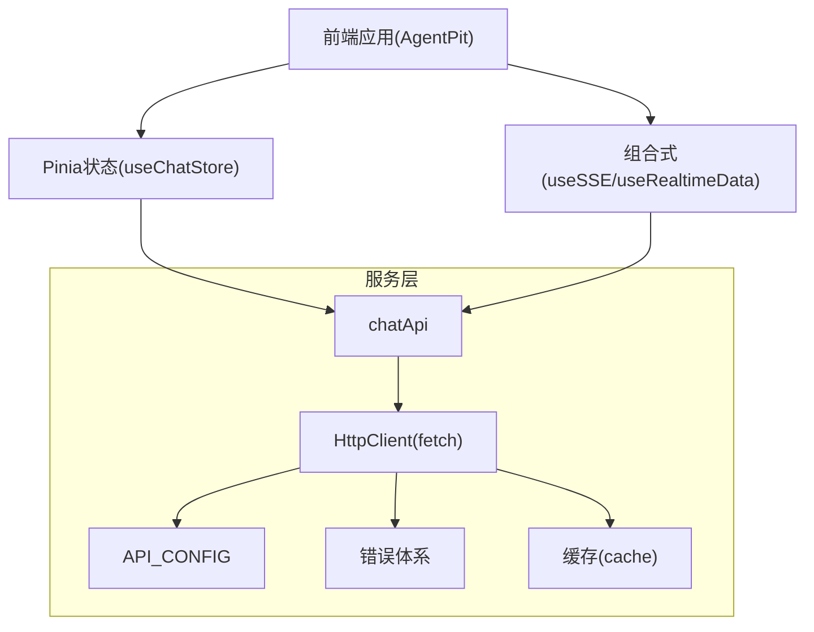
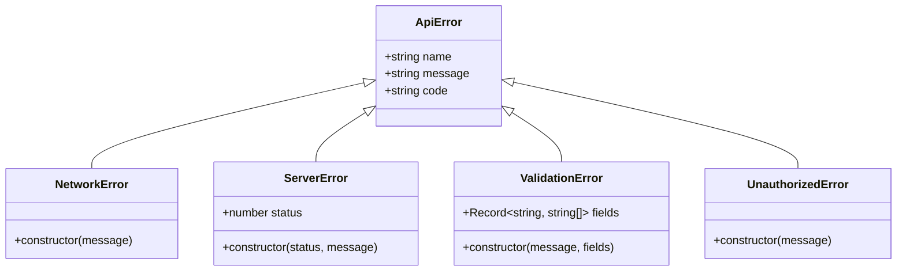
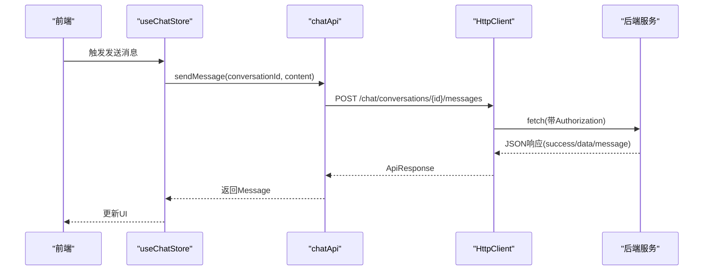
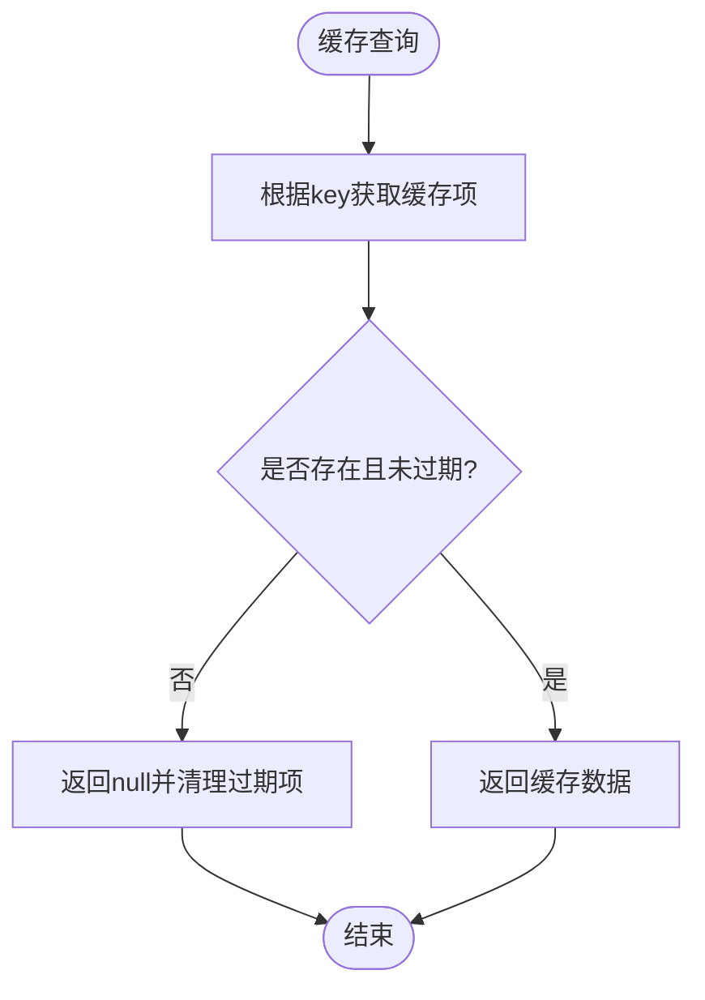
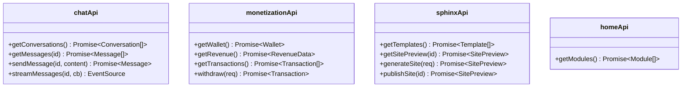
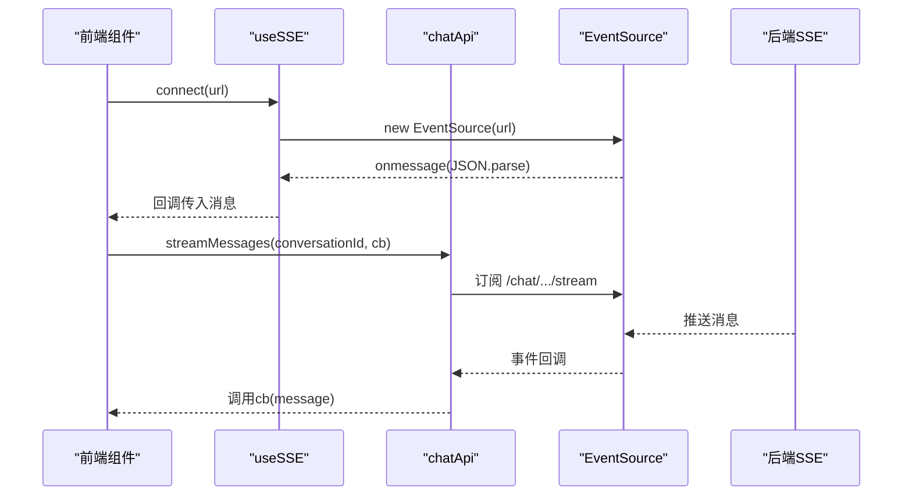
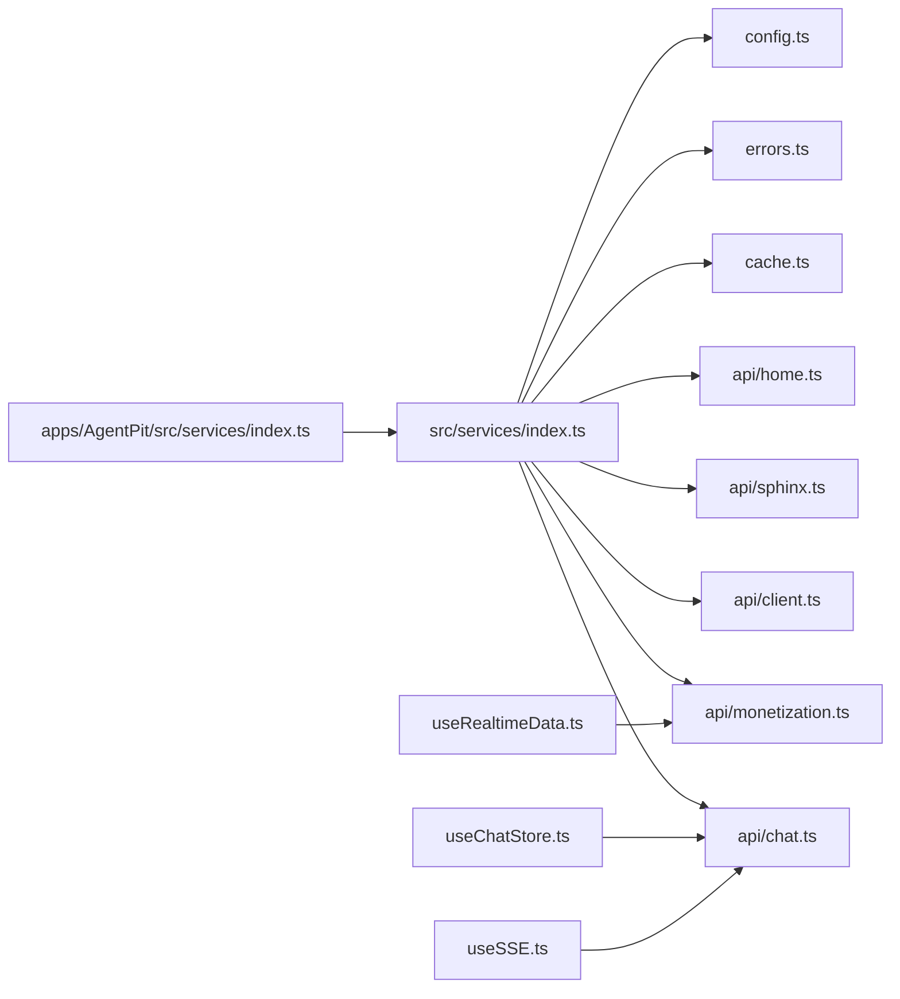

# 服务层架构

<cite>
**本文引用的文件**
- [src/services/index.ts](file://src/services/index.ts)
- [src/services/api/client.ts](file://src/services/api/client.ts)
- [src/services/cache.ts](file://src/services/cache.ts)
- [src/services/errors.ts](file://src/services/errors.ts)
- [src/services/config.ts](file://src/services/config.ts)
- [src/services/api/chat.ts](file://src/services/api/chat.ts)
- [src/services/api/monetization.ts](file://src/services/api/monetization.ts)
- [src/services/api/sphinx.ts](file://src/services/api/sphinx.ts)
- [src/services/api/home.ts](file://src/services/api/home.ts)
- [apps/AgentPit/src/services/index.ts](file://apps/AgentPit/src/services/index.ts)
- [apps/AgentPit/src/stores/useChatStore.ts](file://apps/AgentPit/src/stores/useChatStore.ts)
- [apps/AgentPit/src/composables/useRealtimeData.ts](file://apps/AgentPit/src/composables/useRealtimeData.ts)
- [apps/AgentPit/src/composables/useSSE.ts](file://apps/AgentPit/src/composables/useSSE.ts)
- [apps/AgentPit/src/types/chat.ts](file://apps/AgentPit/src/types/chat.ts)
- [apps/AgentPit/src/types/user.ts](file://apps/AgentPit/src/types/user.ts)
</cite>

## 目录
1. [引言](#引言)
2. [项目结构](#项目结构)
3. [核心组件](#核心组件)
4. [架构总览](#架构总览)
5. [详细组件分析](#详细组件分析)
6. [依赖关系分析](#依赖关系分析)
7. [性能考量](#性能考量)
8. [故障排查指南](#故障排查指南)
9. [结论](#结论)
10. [附录](#附录)

## 引言
本文件面向DAOApps服务层架构，聚焦于API服务设计、RESTful API规范与WebSocket/Server-Sent Events（SSE）实时通信实现，覆盖数据服务、认证授权、错误处理与缓存策略，并给出服务层与前端应用的集成方式、通信协议、性能优化、安全与监控建议，以及扩展与维护指导原则。

## 项目结构
服务层位于仓库根目录的 src/services 下，采用按功能域划分的API模块组织方式：chat、monetization、sphinx、home；同时提供统一导出入口与前端应用的导出入口，便于跨应用复用。

**图表来源**
- [src/services/index.ts:1-10](file://src/services/index.ts#L1-L10)
- [src/services/api/client.ts:1-105](file://src/services/api/client.ts#L1-L105)
- [src/services/api/chat.ts:1-87](file://src/services/api/chat.ts#L1-L87)
- [src/services/api/monetization.ts:1-77](file://src/services/api/monetization.ts#L1-L77)
- [src/services/api/sphinx.ts:1-69](file://src/services/api/sphinx.ts#L1-L69)
- [src/services/api/home.ts:1-30](file://src/services/api/home.ts#L1-L30)
- [src/services/cache.ts:1-50](file://src/services/cache.ts#L1-L50)
- [src/services/errors.ts:1-45](file://src/services/errors.ts#L1-L45)
- [src/services/config.ts:1-11](file://src/services/config.ts#L1-L11)
- [apps/AgentPit/src/services/index.ts:1-10](file://apps/AgentPit/src/services/index.ts#L1-L10)
- [apps/AgentPit/src/stores/useChatStore.ts:1-218](file://apps/AgentPit/src/stores/useChatStore.ts#L1-L218)
- [apps/AgentPit/src/composables/useSSE.ts:1-129](file://apps/AgentPit/src/composables/useSSE.ts#L1-L129)
- [apps/AgentPit/src/composables/useRealtimeData.ts:1-117](file://apps/AgentPit/src/composables/useRealtimeData.ts#L1-L117)
- [apps/AgentPit/src/types/chat.ts:1-151](file://apps/AgentPit/src/types/chat.ts#L1-L151)
- [apps/AgentPit/src/types/user.ts:1-200](file://apps/AgentPit/src/types/user.ts#L1-L200)

**章节来源**
- [src/services/index.ts:1-10](file://src/services/index.ts#L1-L10)
- [apps/AgentPit/src/services/index.ts:1-10](file://apps/AgentPit/src/services/index.ts#L1-L10)

## 核心组件
- 统一导出入口：服务层与前端应用均通过 index.ts 提供统一导出，便于按需引入与模块化管理。
- HTTP客户端：基于原生 fetch 的封装，内置超时控制、自动注入鉴权头、统一响应结构与错误转换。
- 错误体系：分层错误类型（网络、服务器、验证、未授权），便于前端进行差异化处理。
- 缓存管理：内存Map实现的键值缓存，支持TTL过期与按正则清理。
- 配置中心：集中管理基础URL、超时、Mock开关与重试策略。
- API模块：按业务域拆分，提供REST接口与SSE流式能力，支持Mock切换。
- 前端集成：Pinia状态管理、Vue组合式函数封装SSE与实时监控。

**章节来源**
- [src/services/api/client.ts:1-105](file://src/services/api/client.ts#L1-L105)
- [src/services/errors.ts:1-45](file://src/services/errors.ts#L1-L45)
- [src/services/cache.ts:1-50](file://src/services/cache.ts#L1-L50)
- [src/services/config.ts:1-11](file://src/services/config.ts#L1-L11)
- [src/services/api/chat.ts:1-87](file://src/services/api/chat.ts#L1-L87)
- [src/services/api/monetization.ts:1-77](file://src/services/api/monetization.ts#L1-L77)
- [src/services/api/sphinx.ts:1-69](file://src/services/api/sphinx.ts#L1-L69)
- [src/services/api/home.ts:1-30](file://src/services/api/home.ts#L1-L30)
- [apps/AgentPit/src/stores/useChatStore.ts:1-218](file://apps/AgentPit/src/stores/useChatStore.ts#L1-L218)
- [apps/AgentPit/src/composables/useSSE.ts:1-129](file://apps/AgentPit/src/composables/useSSE.ts#L1-L129)
- [apps/AgentPit/src/composables/useRealtimeData.ts:1-117](file://apps/AgentPit/src/composables/useRealtimeData.ts#L1-L117)

## 架构总览
服务层采用“配置-客户端-模块API-前端集成”的分层架构。配置中心提供运行时参数；HTTP客户端负责网络请求与错误转换；各业务API模块封装REST接口与SSE流；前端通过状态管理与组合式函数消费API与实时数据。

**图表来源**
- [src/services/config.ts:1-11](file://src/services/config.ts#L1-L11)
- [src/services/api/client.ts:1-105](file://src/services/api/client.ts#L1-L105)
- [src/services/errors.ts:1-45](file://src/services/errors.ts#L1-L45)
- [src/services/cache.ts:1-50](file://src/services/cache.ts#L1-L50)
- [src/services/api/chat.ts:1-87](file://src/services/api/chat.ts#L1-L87)
- [apps/AgentPit/src/stores/useChatStore.ts:1-218](file://apps/AgentPit/src/stores/useChatStore.ts#L1-L218)
- [apps/AgentPit/src/composables/useSSE.ts:1-129](file://apps/AgentPit/src/composables/useSSE.ts#L1-L129)
- [apps/AgentPit/src/composables/useRealtimeData.ts:1-117](file://apps/AgentPit/src/composables/useRealtimeData.ts#L1-L117)

## 详细组件分析

### HTTP客户端与错误处理
- 请求流程：自动注入Authorization头（若存在本地令牌）、支持自定义头部与超时；统一返回结构包含data、success与message；对非OK响应抛出服务器错误；对AbortError与未知错误分别抛出网络错误。
- 错误类型：ApiError基类，派生出NetworkError、ServerError、ValidationError、UnauthorizedError，便于前端分支处理与UI提示。
- 超时控制：AbortController配合setTimeout实现可配置超时，避免请求悬挂。
- Mock切换：API模块在配置开启时直接返回mock数据，便于开发与测试。

**图表来源**
- [src/services/errors.ts:1-45](file://src/services/errors.ts#L1-L45)

**图表来源**
- [apps/AgentPit/src/stores/useChatStore.ts:199-215](file://apps/AgentPit/src/stores/useChatStore.ts#L199-L215)
- [src/services/api/chat.ts:46-55](file://src/services/api/chat.ts#L46-L55)
- [src/services/api/client.ts:33-69](file://src/services/api/client.ts#L33-L69)

**章节来源**
- [src/services/api/client.ts:1-105](file://src/services/api/client.ts#L1-L105)
- [src/services/errors.ts:1-45](file://src/services/errors.ts#L1-L45)

### 缓存策略
- 存储结构：Map键值对，值包含data、timestamp与ttl。
- 查询逻辑：若过期则删除并返回空；否则返回缓存数据。
- 清理策略：支持按key删除、清空全部、按正则批量清理。
- 使用建议：对高频读取且变更不频繁的数据（如模板列表、模块列表）启用缓存；结合TTL与失效策略降低一致性风险。

**图表来源**
- [src/services/cache.ts:11-21](file://src/services/cache.ts#L11-L21)

**章节来源**
- [src/services/cache.ts:1-50](file://src/services/cache.ts#L1-L50)

### 配置中心
- 基础URL：优先使用VITE环境变量，否则回退至本地默认值。
- 超时：统一请求超时时间。
- Mock开关：可通过环境变量开启，使API模块直接返回mock数据。
- 重试策略：预留最大重试次数与延迟，便于后续在网络层或调用层扩展。

**章节来源**
- [src/services/config.ts:1-11](file://src/services/config.ts#L1-L11)

### API模块设计（REST）
- chat：会话列表、消息历史、发送消息；SSE流式接收消息。
- monetization：钱包余额、收益数据、交易历史、提现。
- sphinx：模板列表、站点预览、站点生成、站点发布。
- home：首页模块列表。

**图表来源**
- [src/services/api/chat.ts:26-86](file://src/services/api/chat.ts#L26-L86)
- [src/services/api/monetization.ts:40-76](file://src/services/api/monetization.ts#L40-L76)
- [src/services/api/sphinx.ts:32-68](file://src/services/api/sphinx.ts#L32-L68)
- [src/services/api/home.ts:20-29](file://src/services/api/home.ts#L20-L29)

**章节来源**
- [src/services/api/chat.ts:1-87](file://src/services/api/chat.ts#L1-L87)
- [src/services/api/monetization.ts:1-77](file://src/services/api/monetization.ts#L1-L77)
- [src/services/api/sphinx.ts:1-69](file://src/services/api/sphinx.ts#L1-L69)
- [src/services/api/home.ts:1-30](file://src/services/api/home.ts#L1-L30)

### 实时通信（SSE）与前端集成
- SSE封装：提供连接状态、消息队列、错误信息、连接与断开方法；在Mock模式下模拟流式输出。
- 聊天流式消息：chatApi.streamMessages通过EventSource订阅后端流，解析消息并回调给上层。
- 实时监控：useRealtimeData用于模拟实时余额变化与阈值告警，展示前端如何消费实时数据。

**图表来源**
- [apps/AgentPit/src/composables/useSSE.ts:18-39](file://apps/AgentPit/src/composables/useSSE.ts#L18-L39)
- [src/services/api/chat.ts:58-85](file://src/services/api/chat.ts#L58-L85)

**章节来源**
- [apps/AgentPit/src/composables/useSSE.ts:1-129](file://apps/AgentPit/src/composables/useSSE.ts#L1-L129)
- [src/services/api/chat.ts:58-85](file://src/services/api/chat.ts#L58-L85)

### 前端状态与类型
- Pinia状态：useChatStore管理会话、消息、智能体与流式状态，提供持久化与上下文提取。
- 类型定义：chat.ts与user.ts提供消息、会话、用户与主题等强类型支撑，确保前后端契约一致。

**章节来源**
- [apps/AgentPit/src/stores/useChatStore.ts:1-218](file://apps/AgentPit/src/stores/useChatStore.ts#L1-L218)
- [apps/AgentPit/src/types/chat.ts:1-151](file://apps/AgentPit/src/types/chat.ts#L1-L151)
- [apps/AgentPit/src/types/user.ts:1-200](file://apps/AgentPit/src/types/user.ts#L1-L200)

## 依赖关系分析
- 低耦合高内聚：API模块独立封装各自领域接口；HTTP客户端作为通用依赖被所有模块复用。
- 导出聚合：服务层与应用层均通过index.ts统一导出，便于按需引入与Tree-shaking。
- 前端依赖：Pinia与组合式函数依赖API模块；类型定义贯穿状态与组件层。

**图表来源**
- [src/services/index.ts:1-10](file://src/services/index.ts#L1-L10)
- [apps/AgentPit/src/services/index.ts:1-10](file://apps/AgentPit/src/services/index.ts#L1-L10)
- [apps/AgentPit/src/stores/useChatStore.ts:1-218](file://apps/AgentPit/src/stores/useChatStore.ts#L1-L218)
- [apps/AgentPit/src/composables/useSSE.ts:1-129](file://apps/AgentPit/src/composables/useSSE.ts#L1-L129)
- [apps/AgentPit/src/composables/useRealtimeData.ts:1-117](file://apps/AgentPit/src/composables/useRealtimeData.ts#L1-L117)

**章节来源**
- [src/services/index.ts:1-10](file://src/services/index.ts#L1-L10)
- [apps/AgentPit/src/services/index.ts:1-10](file://apps/AgentPit/src/services/index.ts#L1-L10)

## 性能考量
- 请求超时与中断：合理设置超时时间，避免长时间占用；对长任务使用SSE或WebSocket降低轮询成本。
- 缓存策略：对静态或低频变更数据启用TTL缓存；对热点数据增加命中率；定期清理过期键。
- Mock与灰度：通过配置开关快速切换Mock，便于压测与回归；逐步放开真实接口。
- 并发控制：对高频请求进行节流/去抖，避免重复渲染与网络拥塞。
- 前端渲染：Pinia状态按需更新，避免不必要的响应式追踪；组件层面做浅比较与懒加载。

## 故障排查指南
- 网络错误：检查超时配置与网络连通性；确认Authorization头是否正确注入。
- 服务器错误：根据状态码定位后端问题；关注错误响应中的message与fields字段。
- SSE连接：确认后端SSE端点可用；前端检查EventSource事件回调与JSON解析。
- 缓存问题：核对TTL与键空间；必要时执行clear或clearPattern清理。
- Mock异常：确认环境变量开关；检查mock数据结构与API返回格式一致性。

**章节来源**
- [src/services/api/client.ts:33-69](file://src/services/api/client.ts#L33-L69)
- [src/services/errors.ts:1-45](file://src/services/errors.ts#L1-L45)
- [src/services/cache.ts:1-50](file://src/services/cache.ts#L1-L50)
- [src/services/config.ts:1-11](file://src/services/config.ts#L1-L11)

## 结论
该服务层以清晰的分层与模块化设计实现了REST与SSE的统一接入，配合完善的错误体系与缓存策略，满足DAOApps多应用场景下的数据服务需求。通过Pinia与组合式函数的前端集成，实现了良好的开发体验与可维护性。建议在生产环境中进一步完善鉴权、限流与监控埋点，持续优化缓存与实时通道的稳定性。

## 附录
- 开发与调试
  - 使用Mock开关快速切换真实/模拟数据，加速迭代。
  - 在SSE封装中保留真实EventSource接入，逐步替换Mock。
- 安全与合规
  - 严格管理Authorization令牌生命周期与刷新策略。
  - 对敏感操作增加二次确认与审计日志。
- 监控与可观测性
  - 埋点请求耗时、错误率与SSE断线重连次数。
  - 建立告警阈值与自动化恢复机制。