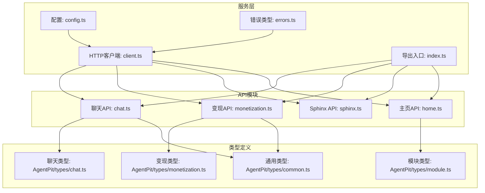
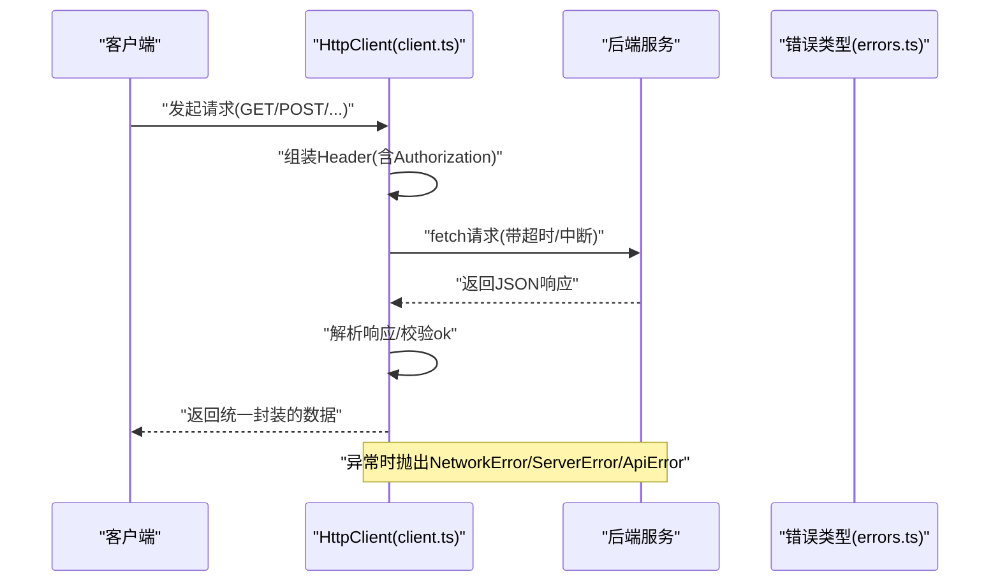
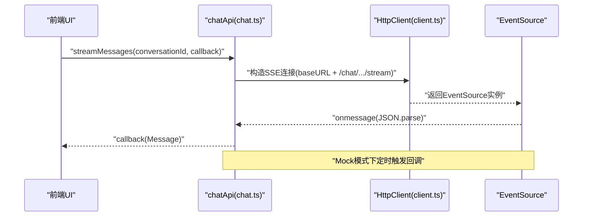
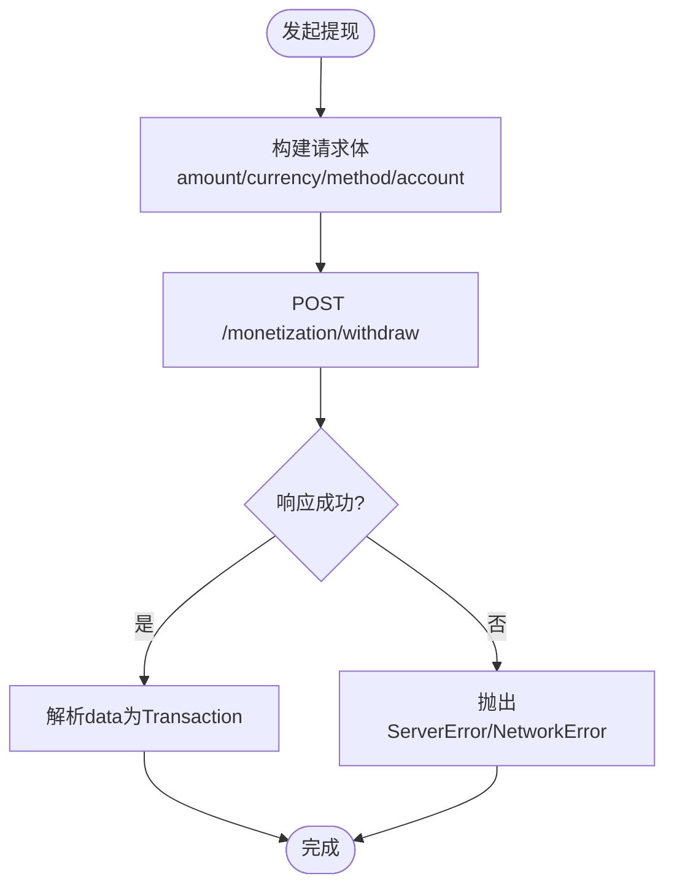
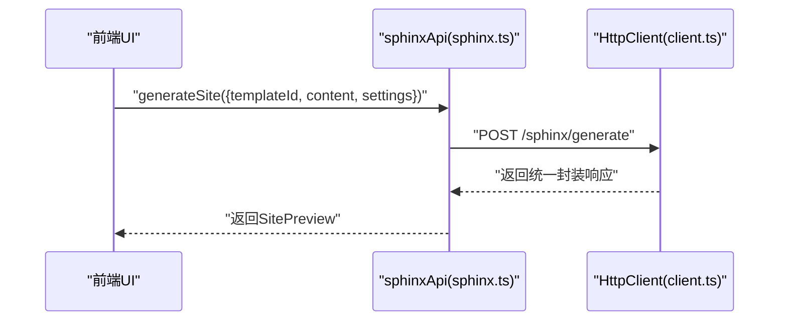
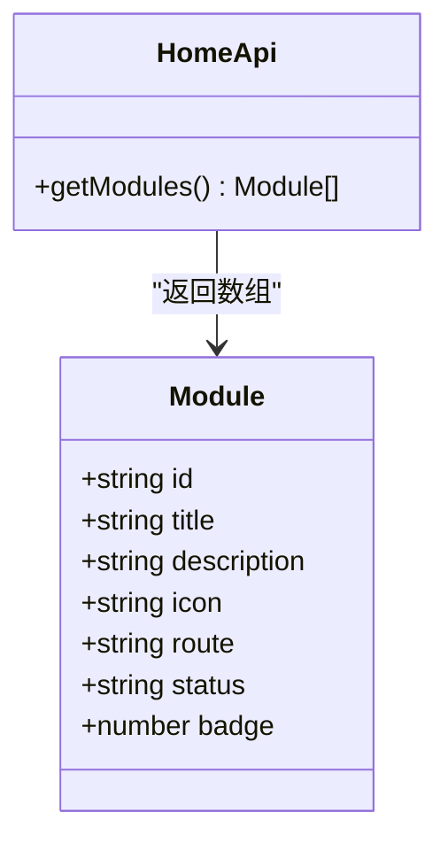
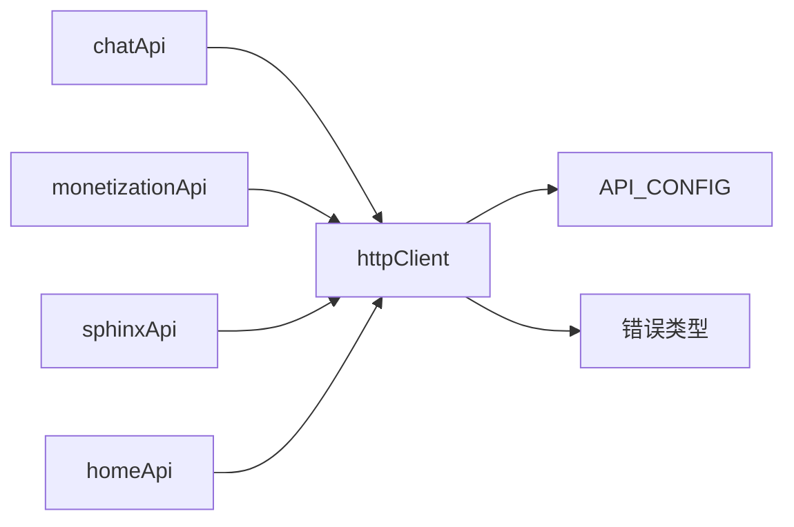

# API服务设计

<cite>
**本文引用的文件**
- [src/services/api/chat.ts](file://src/services/api/chat.ts)
- [src/services/api/monetization.ts](file://src/services/api/monetization.ts)
- [src/services/api/sphinx.ts](file://src/services/api/sphinx.ts)
- [src/services/api/home.ts](file://src/services/api/home.ts)
- [src/services/api/client.ts](file://src/services/api/client.ts)
- [src/services/config.ts](file://src/services/config.ts)
- [src/services/errors.ts](file://src/services/errors.ts)
- [src/services/index.ts](file://src/services/index.ts)
- [apps/AgentPit/src/types/chat.ts](file://apps/AgentPit/src/types/chat.ts)
- [apps/AgentPit/src/types/common.ts](file://apps/AgentPit/src/types/common.ts)
- [apps/AgentPit/src/types/monetization.ts](file://apps/AgentPit/src/types/monetization.ts)
- [apps/AgentPit/src/types/module.ts](file://apps/AgentPit/src/types/module.ts)
</cite>

## 目录
1. [简介](#简介)
2. [项目结构](#项目结构)
3. [核心组件](#核心组件)
4. [架构总览](#架构总览)
5. [详细组件分析](#详细组件分析)
6. [依赖关系分析](#依赖关系分析)
7. [性能考虑](#性能考虑)
8. [故障排查指南](#故障排查指南)
9. [结论](#结论)
10. [附录](#附录)

## 简介
本文件面向DAOApps API服务设计，系统化梳理RESTful API规范、HTTP方法映射与URL模式、各子服务接口实现、请求响应模式、参数校验、错误处理与状态码管理，并补充API版本控制策略、速率限制与安全防护建议。同时，结合现有代码实现，解释WebSocket与SSE实时通信机制及消息格式规范，提供API调用示例、客户端集成指南与性能优化建议。

## 项目结构
DAOApps前端采用多包/多应用组织，API层位于统一的服务目录中，通过独立的API模块分别对接聊天、变现、Sphinx建站与主页模块；公共配置、错误类型与HTTP客户端在统一服务层集中管理。

图表来源
- [src/services/config.ts:1-11](file://src/services/config.ts#L1-L11)
- [src/services/errors.ts:1-45](file://src/services/errors.ts#L1-L45)
- [src/services/api/client.ts:1-105](file://src/services/api/client.ts#L1-L105)
- [src/services/api/chat.ts:1-87](file://src/services/api/chat.ts#L1-L87)
- [src/services/api/monetization.ts:1-77](file://src/services/api/monetization.ts#L1-L77)
- [src/services/api/sphinx.ts:1-69](file://src/services/api/sphinx.ts#L1-L69)
- [src/services/api/home.ts:1-30](file://src/services/api/home.ts#L1-L30)
- [apps/AgentPit/src/types/chat.ts:1-151](file://apps/AgentPit/src/types/chat.ts#L1-L151)
- [apps/AgentPit/src/types/monetization.ts:1-135](file://apps/AgentPit/src/types/monetization.ts#L1-L135)
- [apps/AgentPit/src/types/common.ts:1-157](file://apps/AgentPit/src/types/common.ts#L1-L157)
- [apps/AgentPit/src/types/module.ts:1-143](file://apps/AgentPit/src/types/module.ts#L1-L143)

章节来源
- [src/services/index.ts:1-10](file://src/services/index.ts#L1-L10)
- [src/services/config.ts:1-11](file://src/services/config.ts#L1-L11)

## 核心组件
- HTTP客户端与请求封装
  - 统一请求方法：GET/POST/PUT/PATCH/DELETE
  - 自动注入Authorization头（若存在本地token）
  - 超时控制与中断机制
  - 统一响应包装与错误分类
- 配置中心
  - 基础URL、超时、Mock开关、重试策略
- 错误体系
  - ApiError基类与NetworkError、ServerError、ValidationError、UnauthorizedError细分
- API模块
  - 聊天：会话列表、消息历史、发送消息、SSE流式接收
  - 变现：钱包、收益、交易历史、提现
  - Sphinx：模板、站点预览、生成、发布
  - 主页：模块列表

章节来源
- [src/services/api/client.ts:19-102](file://src/services/api/client.ts#L19-L102)
- [src/services/config.ts:2-10](file://src/services/config.ts#L2-L10)
- [src/services/errors.ts:2-44](file://src/services/errors.ts#L2-L44)
- [src/services/api/chat.ts:26-85](file://src/services/api/chat.ts#L26-L85)
- [src/services/api/monetization.ts:40-75](file://src/services/api/monetization.ts#L40-L75)
- [src/services/api/sphinx.ts:32-67](file://src/services/api/sphinx.ts#L32-L67)
- [src/services/api/home.ts:20-28](file://src/services/api/home.ts#L20-L28)

## 架构总览
API层以HttpClient为核心，围绕各业务模块提供清晰的函数式接口；所有请求均走统一的错误处理与响应包装；支持Mock模式便于前端开发与测试。

图表来源
- [src/services/api/client.ts:33-69](file://src/services/api/client.ts#L33-L69)
- [src/services/errors.ts:2-44](file://src/services/errors.ts#L2-L44)

## 详细组件分析

### 聊天服务（chatApi）
- 接口职责
  - 获取会话列表
  - 获取指定会话的消息历史
  - 发送消息
  - SSE流式接收消息
- URL与方法映射
  - GET /chat/conversations
  - GET /chat/conversations/{conversationId}
  - POST /chat/conversations/{conversationId}/messages
  - GET /chat/conversations/{conversationId}/stream
- 请求/响应模式
  - 请求体：发送消息时传入content
  - 响应体：统一封装的data字段承载业务数据
- 参数与类型
  - 会话与消息类型定义参考聊天类型文件
- 错误处理
  - 服务器非2xx：抛出ServerError
  - 网络超时/断网：抛出NetworkError
  - SSE消息解析失败：控制台记录错误
- 实时通信
  - 使用EventSource监听/stream端点
  - Mock模式下模拟定时回调

图表来源
- [src/services/api/chat.ts:58-85](file://src/services/api/chat.ts#L58-L85)
- [src/services/api/client.ts:40-56](file://src/services/api/client.ts#L40-L56)

章节来源
- [src/services/api/chat.ts:26-85](file://src/services/api/chat.ts#L26-L85)
- [apps/AgentPit/src/types/chat.ts:38-76](file://apps/AgentPit/src/types/chat.ts#L38-L76)

### 变现服务（monetizationApi）
- 接口职责
  - 查询钱包余额
  - 查询收益数据
  - 查询交易历史
  - 发起提现
- URL与方法映射
  - GET /monetization/wallet
  - GET /monetization/revenue
  - GET /monetization/transactions
  - POST /monetization/withdraw
- 请求/响应模式
  - 提现请求体：金额、货币、方式、账户等
  - 响应体：统一封装的data字段承载业务数据
- 参数与类型
  - 钱包、收益、交易、提现请求类型定义参考变现类型文件
- 错误处理
  - 服务器非2xx：抛出ServerError
  - 网络异常：抛出NetworkError

图表来源
- [src/services/api/monetization.ts:68-75](file://src/services/api/monetization.ts#L68-L75)
- [src/services/api/client.ts:50-68](file://src/services/api/client.ts#L50-L68)

章节来源
- [src/services/api/monetization.ts:40-75](file://src/services/api/monetization.ts#L40-L75)
- [apps/AgentPit/src/types/monetization.ts:15-123](file://apps/AgentPit/src/types/monetization.ts#L15-L123)

### Sphinx服务（sphinxApi）
- 接口职责
  - 获取模板列表
  - 获取站点预览
  - 生成站点
  - 发布站点
- URL与方法映射
  - GET /sphinx/templates
  - GET /sphinx/preview/{siteId}
  - POST /sphinx/generate
  - POST /sphinx/publish/{siteId}
- 请求/响应模式
  - 生成请求体：templateId、content、settings
  - 响应体：统一封装的data字段承载业务数据
- 参数与类型
  - 模板、站点预览、生成请求类型定义参考Sphinx类型文件

图表来源
- [src/services/api/sphinx.ts:52-57](file://src/services/api/sphinx.ts#L52-L57)
- [src/services/api/client.ts:75-81](file://src/services/api/client.ts#L75-L81)

章节来源
- [src/services/api/sphinx.ts:32-67](file://src/services/api/sphinx.ts#L32-L67)

### 主页服务（homeApi）
- 接口职责
  - 获取模块列表
- URL与方法映射
  - GET /home/modules
- 请求/响应模式
  - 响应体：统一封装的data字段承载业务数据
- 参数与类型
  - 模块类型定义参考模块类型文件

图表来源
- [src/services/api/home.ts:20-28](file://src/services/api/home.ts#L20-L28)
- [apps/AgentPit/src/types/module.ts:22-36](file://apps/AgentPit/src/types/module.ts#L22-L36)

章节来源
- [src/services/api/home.ts:20-28](file://src/services/api/home.ts#L20-L28)
- [apps/AgentPit/src/types/module.ts:22-64](file://apps/AgentPit/src/types/module.ts#L22-L64)

## 依赖关系分析
- 模块内聚与耦合
  - 各API模块仅依赖统一的httpClient与配置，降低耦合
  - 错误类型集中定义，便于统一处理
- 导出入口
  - 通过index.ts统一导出各API模块，便于上层按需引入
- Mock与真实环境切换
  - 通过配置开关useMock控制是否走Mock逻辑

图表来源
- [src/services/index.ts:6-9](file://src/services/index.ts#L6-L9)
- [src/services/api/client.ts:3-4](file://src/services/api/client.ts#L3-L4)
- [src/services/config.ts:2-10](file://src/services/config.ts#L2-L10)
- [src/services/errors.ts:2-44](file://src/services/errors.ts#L2-L44)

章节来源
- [src/services/index.ts:1-10](file://src/services/index.ts#L1-L10)

## 性能考虑
- 请求缓存
  - 对于不频繁变化的列表接口（如模板、模块），可在调用层增加缓存策略，减少重复请求
- 超时与重试
  - 客户端已内置超时与中断；可结合配置进行重试策略（当前配置包含最大重试次数与延迟）
- 流式传输
  - SSE流式接收适合长文本生成场景；注意在UI层做好节流与渲染优化
- 并发控制
  - 对高并发场景建议引入队列或限流，避免瞬时大量请求导致后端压力过大
- 前端渲染优化
  - 大列表分页加载、虚拟滚动、懒加载图片与资源

## 故障排查指南
- 常见错误与定位
  - NetworkError：检查网络连通性、代理设置、超时阈值
  - ServerError：根据状态码定位后端问题，查看服务端日志
  - ValidationError：核对请求体字段与类型，关注fields中具体字段
  - UnauthorizedError：确认Authorization头是否正确携带
- 日志与监控
  - 在客户端捕获并上报错误，记录请求URL、方法、状态码与响应体摘要
- Mock模式调试
  - 开启useMock后，观察本地模拟数据是否符合预期，逐步替换为真实接口

章节来源
- [src/services/errors.ts:2-44](file://src/services/errors.ts#L2-L44)
- [src/services/api/client.ts:56-68](file://src/services/api/client.ts#L56-L68)

## 结论
DAOApps API层以统一的HttpClient与配置为中心，围绕聊天、变现、Sphinx与主页四大模块提供清晰的REST接口与错误处理机制。通过Mock支持与SSE流式通信，满足前端开发与实时交互需求。建议在生产环境中完善版本控制、速率限制与安全防护策略，并持续优化前端渲染与缓存策略以提升整体性能与用户体验。

## 附录

### RESTful API规范与URL模式
- 基础规则
  - 资源命名使用名词复数形式
  - 使用HTTP方法表达动作：GET/POST/PUT/PATCH/DELETE
  - 使用路径参数表示资源层级关系
  - 统一响应结构：success/data/message/code
- URL模式示例
  - 聊天：/chat/conversations, /chat/conversations/{id}, /chat/conversations/{id}/messages, /chat/conversations/{id}/stream
  - 变现：/monetization/wallet, /monetization/revenue, /monetization/transactions, /monetization/withdraw
  - Sphinx：/sphinx/templates, /sphinx/preview/{siteId}, /sphinx/generate, /sphinx/publish/{siteId}
  - 主页：/home/modules

章节来源
- [src/services/api/chat.ts:28-54](file://src/services/api/chat.ts#L28-L54)
- [src/services/api/monetization.ts:42-74](file://src/services/api/monetization.ts#L42-L74)
- [src/services/api/sphinx.ts:34-66](file://src/services/api/sphinx.ts#L34-L66)
- [src/services/api/home.ts:22-27](file://src/services/api/home.ts#L22-L27)

### 请求/响应模式与参数验证
- 统一响应
  - 成功：success=true，data为业务对象或数组
  - 失败：success=false，message与code描述错误
- 参数验证
  - 建议在后端对必填字段、类型与范围进行校验
  - 前端对关键字段做基础校验（长度、格式），并在提交时提示
- 错误码与状态码
  - 4xx：客户端错误（参数无效、未授权等）
  - 5xx：服务端错误
  - 自定义错误码：VALIDATION_ERROR、UNAUTHORIZED、SERVER_{status}

章节来源
- [apps/AgentPit/src/types/common.ts:62-72](file://apps/AgentPit/src/types/common.ts#L62-L72)
- [src/services/errors.ts:29-44](file://src/services/errors.ts#L29-L44)

### WebSocket与SSE实时通信
- SSE（Server-Sent Events）
  - 适用于单向推送（如流式生成）
  - 客户端通过EventSource监听消息，解析JSON数据
  - Mock模式下模拟定时回调
- WebSocket
  - 若未来需要双向实时通信，建议采用WebSocket协议
  - 建议定义消息帧格式（type + payload + meta），并实现心跳与重连机制
- 消息格式规范
  - SSE：每条消息为JSON字符串，客户端解析为对象
  - WebSocket：建议采用类似{type, payload, ts}结构

章节来源
- [src/services/api/chat.ts:58-85](file://src/services/api/chat.ts#L58-L85)

### API版本控制策略
- 建议方案
  - URL前缀版本化：/api/v1/...
  - 头部版本控制：Accept-Version: v1
  - 语义化版本：主版本大改、次版本新增兼容功能、修订版本修复
- 迁移与降级
  - 旧版本保留过渡期，提供迁移指引
  - 新版本发布后，逐步引导客户端升级

### 速率限制与安全防护
- 速率限制
  - 基于IP或Token维度进行QPS限制
  - 对高频接口（如SSE流）实施更严格的配额
- 安全防护
  - CORS白名单配置
  - Authorization头严格校验
  - 输入参数白名单与长度限制
  - HTTPS强制与HSTS

### 客户端集成指南
- 初始化
  - 设置VITE_API_BASE_URL与VITE_USE_MOCK_API
  - 在登录后持久化auth_token到localStorage
- 调用示例
  - 获取会话列表：调用chatApi.getConversations()
  - 发送消息：调用chatApi.sendMessage(conversationId, content)
  - 流式接收：调用chatApi.streamMessages(conversationId, callback)
  - 获取钱包：调用monetizationApi.getWallet()
  - 生成站点：调用sphinxApi.generateSite({templateId, content, settings})
  - 获取模块：调用homeApi.getModules()
- 错误处理
  - 捕获NetworkError/ServerError/ValidationError/UnauthorizedError
  - 对不同错误类型进行用户提示与重试策略

章节来源
- [src/services/config.ts:2-10](file://src/services/config.ts#L2-L10)
- [src/services/api/client.ts:20-31](file://src/services/api/client.ts#L20-L31)
- [src/services/index.ts:6-9](file://src/services/index.ts#L6-L9)