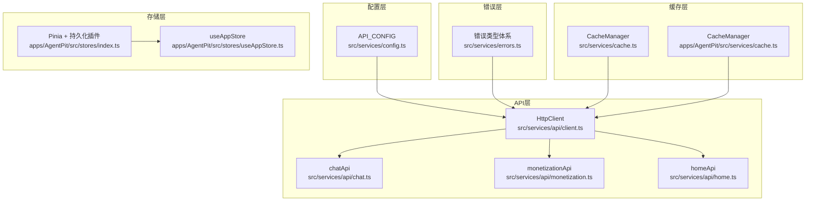
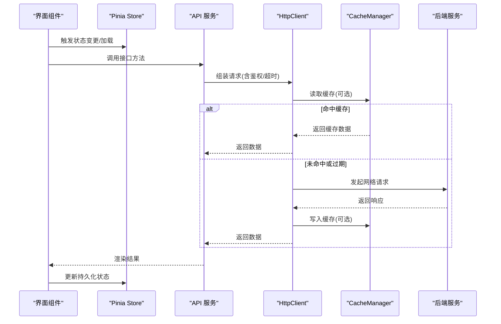
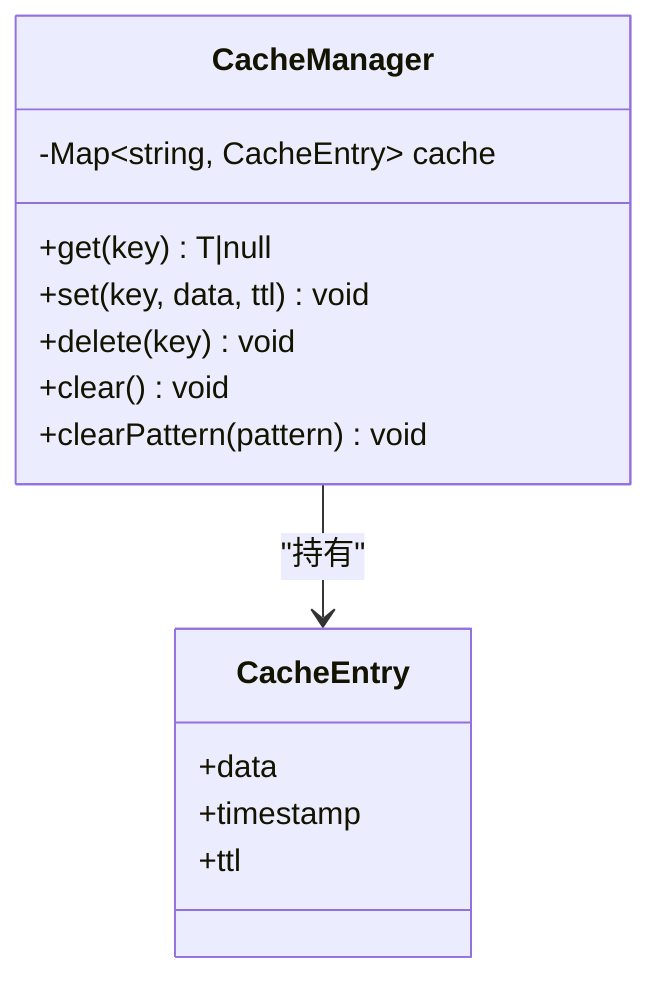
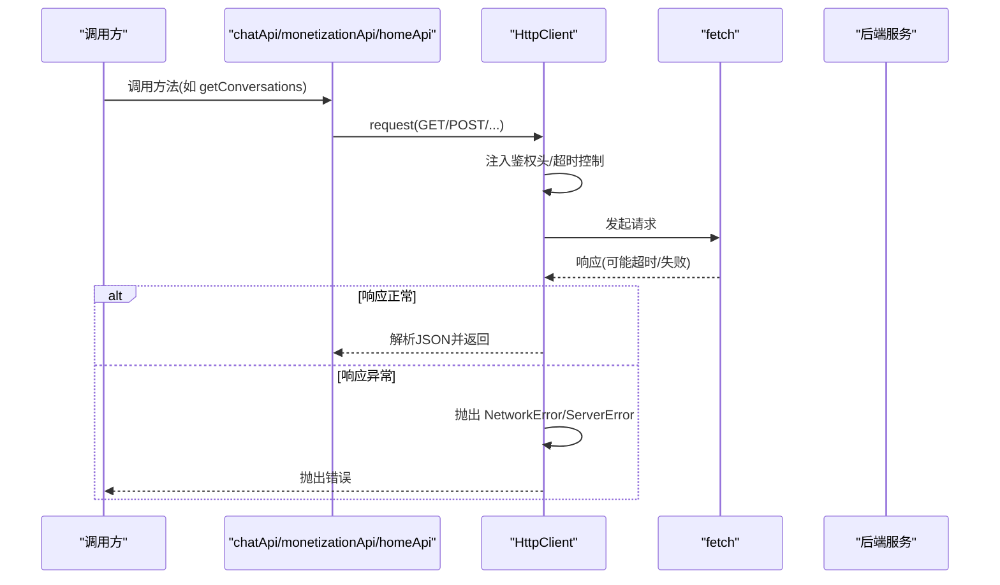
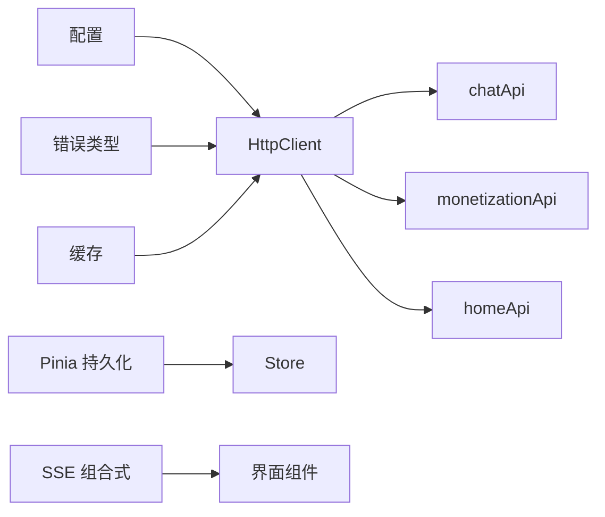

# 数据服务

<cite>
**本文引用的文件**
- [src/services/cache.ts](file://src/services/cache.ts)
- [src/services/config.ts](file://src/services/config.ts)
- [src/services/errors.ts](file://src/services/errors.ts)
- [src/services/index.ts](file://src/services/index.ts)
- [src/services/api/client.ts](file://src/services/api/client.ts)
- [src/services/api/chat.ts](file://src/services/api/chat.ts)
- [src/services/api/monetization.ts](file://src/services/api/monetization.ts)
- [src/services/api/home.ts](file://src/services/api/home.ts)
- [apps/AgentPit/src/services/cache.ts](file://apps/AgentPit/src/services/cache.ts)
- [apps/AgentPit/src/stores/index.ts](file://apps/AgentPit/src/stores/index.ts)
- [apps/AgentPit/src/stores/useAppStore.ts](file://apps/AgentPit/src/stores/useAppStore.ts)
- [apps/AgentPit/src/composables/useSSE.ts](file://apps/AgentPit/src/composables/useSSE.ts)
- [tools/flexloop/tests/testing/test_data_sync/test_validator.py](file://tools/flexloop/tests/testing/test_data_sync/test_validator.py)
- [tools/DeepResearch/src/deepresearch/llms/llm.py](file://tools/DeepResearch/src/deepresearch/llms/llm.py)
</cite>

## 目录
1. [引言](#引言)
2. [项目结构](#项目结构)
3. [核心组件](#核心组件)
4. [架构总览](#架构总览)
5. [详细组件分析](#详细组件分析)
6. [依赖关系分析](#依赖关系分析)
7. [性能考量](#性能考量)
8. [故障排查指南](#故障排查指南)
9. [结论](#结论)
10. [附录](#附录)

## 引言
本技术文档面向 DAOApps 数据服务，系统性阐述数据模型设计、缓存策略、数据同步机制、配置管理、错误处理、数据访问模式、持久化与离线处理、数据迁移策略、数据验证与完整性保障，以及性能优化与一致性保障措施。文档以代码为依据，结合可视化图示帮助读者快速理解并落地实施。

## 项目结构
DAOApps 数据服务主要由以下层次构成：
- 配置层：集中管理 API 基础地址、超时、重试等配置项
- 错误层：统一的错误类型体系，便于上层捕获与处理
- 缓存层：内存级缓存管理器，支持 TTL、正则清理等能力
- API 层：基于 HttpClient 的统一请求封装，提供聊天、货币化、首页等模块接口
- 存储层：Pinia Store 结合持久化插件，实现前端状态持久化
- 工具与测试：数据验证器、缓存统计与性能基准脚本等

图表来源
- [src/services/config.ts:1-11](file://src/services/config.ts#L1-L11)
- [src/services/errors.ts:1-45](file://src/services/errors.ts#L1-L45)
- [src/services/cache.ts:1-50](file://src/services/cache.ts#L1-L50)
- [apps/AgentPit/src/services/cache.ts:1-50](file://apps/AgentPit/src/services/cache.ts#L1-L50)
- [src/services/api/client.ts:1-105](file://src/services/api/client.ts#L1-L105)
- [src/services/api/chat.ts:1-87](file://src/services/api/chat.ts#L1-L87)
- [src/services/api/monetization.ts:1-77](file://src/services/api/monetization.ts#L1-L77)
- [src/services/api/home.ts:1-30](file://src/services/api/home.ts#L1-L30)
- [apps/AgentPit/src/stores/index.ts:1-15](file://apps/AgentPit/src/stores/index.ts#L1-L15)
- [apps/AgentPit/src/stores/useAppStore.ts:1-89](file://apps/AgentPit/src/stores/useAppStore.ts#L1-L89)

章节来源
- [src/services/config.ts:1-11](file://src/services/config.ts#L1-L11)
- [src/services/errors.ts:1-45](file://src/services/errors.ts#L1-L45)
- [src/services/cache.ts:1-50](file://src/services/cache.ts#L1-L50)
- [apps/AgentPit/src/services/cache.ts:1-50](file://apps/AgentPit/src/services/cache.ts#L1-L50)
- [src/services/api/client.ts:1-105](file://src/services/api/client.ts#L1-L105)
- [src/services/api/chat.ts:1-87](file://src/services/api/chat.ts#L1-L87)
- [src/services/api/monetization.ts:1-77](file://src/services/api/monetization.ts#L1-L77)
- [src/services/api/home.ts:1-30](file://src/services/api/home.ts#L1-L30)
- [apps/AgentPit/src/stores/index.ts:1-15](file://apps/AgentPit/src/stores/index.ts#L1-L15)
- [apps/AgentPit/src/stores/useAppStore.ts:1-89](file://apps/AgentPit/src/stores/useAppStore.ts#L1-L89)

## 核心组件
- 配置管理：集中管理 API 基础地址、超时、是否启用 Mock、重试次数与延迟
- 错误处理：统一的 ApiError、NetworkError、ServerError、ValidationError、UnauthorizedError
- 缓存策略：通用 CacheManager，支持 TTL 过期、按正则批量清理
- API 访问：HttpClient 统一封装请求、超时控制、鉴权头注入、错误映射
- 数据模型：聊天、货币化、首页等模块的接口类型定义
- 状态持久化：Pinia Store + 持久化插件，支持主题、侧边栏等状态本地化
- 实时数据：SSE 封装与 Mock 流式输出，便于演示与开发调试

章节来源
- [src/services/config.ts:1-11](file://src/services/config.ts#L1-L11)
- [src/services/errors.ts:1-45](file://src/services/errors.ts#L1-L45)
- [src/services/cache.ts:1-50](file://src/services/cache.ts#L1-L50)
- [src/services/api/client.ts:1-105](file://src/services/api/client.ts#L1-L105)
- [src/services/api/chat.ts:1-87](file://src/services/api/chat.ts#L1-L87)
- [src/services/api/monetization.ts:1-77](file://src/services/api/monetization.ts#L1-L77)
- [src/services/api/home.ts:1-30](file://src/services/api/home.ts#L1-L30)
- [apps/AgentPit/src/stores/index.ts:1-15](file://apps/AgentPit/src/stores/index.ts#L1-L15)
- [apps/AgentPit/src/stores/useAppStore.ts:1-89](file://apps/AgentPit/src/stores/useAppStore.ts#L1-L89)
- [apps/AgentPit/src/composables/useSSE.ts:1-85](file://apps/AgentPit/src/composables/useSSE.ts#L1-L85)

## 架构总览
下图展示数据服务在客户端的整体调用链路：配置与错误类型驱动 API 客户端，API 客户端通过统一的 HttpClient 发起请求；前端状态通过 Pinia Store 持久化；缓存层在请求前后进行读写；SSE 提供流式数据通道。

图表来源
- [src/services/api/client.ts:1-105](file://src/services/api/client.ts#L1-L105)
- [src/services/cache.ts:1-50](file://src/services/cache.ts#L1-L50)
- [apps/AgentPit/src/stores/index.ts:1-15](file://apps/AgentPit/src/stores/index.ts#L1-L15)
- [apps/AgentPit/src/stores/useAppStore.ts:1-89](file://apps/AgentPit/src/stores/useAppStore.ts#L1-L89)

## 详细组件分析

### 缓存策略与失效机制
- 设计要点
  - 采用内存 Map 存储键值对，每个条目包含数据、创建时间戳与 TTL
  - 读取时判断是否过期，过期自动删除并返回空
  - 支持按正则批量清理，便于按命名空间或服务维度清理
- 失效与更新
  - 自动过期：基于时间戳与 TTL 判断
  - 手动清理：delete/clear/clearPattern
  - 写入即更新：相同 key 的 set 会覆盖旧值并刷新时间戳

图表来源
- [src/services/cache.ts:1-50](file://src/services/cache.ts#L1-L50)
- [apps/AgentPit/src/services/cache.ts:1-50](file://apps/AgentPit/src/services/cache.ts#L1-L50)

章节来源
- [src/services/cache.ts:1-50](file://src/services/cache.ts#L1-L50)
- [apps/AgentPit/src/services/cache.ts:1-50](file://apps/AgentPit/src/services/cache.ts#L1-L50)

### 配置管理服务
- 关键点
  - 基础地址、超时、是否使用 Mock、重试参数集中配置
  - 通过环境变量注入，便于不同环境切换
- 使用方式
  - API 层各模块共享同一配置对象
  - 可在构建阶段或运行时动态调整

章节来源
- [src/services/config.ts:1-11](file://src/services/config.ts#L1-L11)
- [src/services/api/chat.ts:1-87](file://src/services/api/chat.ts#L1-L87)
- [src/services/api/monetization.ts:1-77](file://src/services/api/monetization.ts#L1-L77)
- [src/services/api/home.ts:1-30](file://src/services/api/home.ts#L1-L30)

### 错误处理服务
- 错误类型
  - ApiError：基础错误
  - NetworkError：网络异常
  - ServerError：HTTP 状态错误
  - ValidationError：字段校验错误
  - UnauthorizedError：未授权
- 作用
  - 统一错误语义，便于 UI 与日志系统识别
  - 与 HttpClient 协作，将网络异常映射为领域错误

章节来源
- [src/services/errors.ts:1-45](file://src/services/errors.ts#L1-L45)
- [src/services/api/client.ts:1-105](file://src/services/api/client.ts#L1-L105)

### 数据访问模式与 API 客户端
- HttpClient
  - 自动注入 Authorization 头（如存在）
  - 统一超时控制与 AbortController
  - 对非 OK 状态抛出 ServerError，对超时抛出 NetworkError
  - 对已知 ApiError 类型透传，其他异常转为 NetworkError
- API 模块
  - chatApi：对话列表、消息历史、发送消息、SSE 流式接收
  - monetizationApi：钱包、收益、交易、提现
  - homeApi：首页模块列表
- Mock 支持
  - 各模块支持通过配置开启 Mock 数据，便于开发与测试

图表来源
- [src/services/api/client.ts:1-105](file://src/services/api/client.ts#L1-L105)
- [src/services/api/chat.ts:1-87](file://src/services/api/chat.ts#L1-L87)
- [src/services/api/monetization.ts:1-77](file://src/services/api/monetization.ts#L1-L77)
- [src/services/api/home.ts:1-30](file://src/services/api/home.ts#L1-L30)

章节来源
- [src/services/api/client.ts:1-105](file://src/services/api/client.ts#L1-L105)
- [src/services/api/chat.ts:1-87](file://src/services/api/chat.ts#L1-L87)
- [src/services/api/monetization.ts:1-77](file://src/services/api/monetization.ts#L1-L77)
- [src/services/api/home.ts:1-30](file://src/services/api/home.ts#L1-L30)

### 数据模型设计
- 聊天模块
  - Conversation：对话信息
  - Message：消息内容与状态
- 货币化模块
  - Wallet：余额与货币
  - RevenueData：收益统计
  - Transaction：交易明细
  - WithdrawRequest：提现申请
- 首页模块
  - Module：功能模块元数据

章节来源
- [src/services/api/chat.ts:1-87](file://src/services/api/chat.ts#L1-L87)
- [src/services/api/monetization.ts:1-77](file://src/services/api/monetization.ts#L1-L77)
- [src/services/api/home.ts:1-30](file://src/services/api/home.ts#L1-L30)

### 状态持久化与离线处理
- Pinia 持久化
  - 通过插件将指定状态写入 localStorage
  - AgentPit 示例：主题、侧边栏开关等关键状态持久化
- 离线策略建议
  - 本地优先：优先读取持久化状态，再异步拉取远端数据
  - 双写一致：本地更新后发起网络同步，成功后再确认本地状态
  - 冲突解决：基于时间戳或版本号合并冲突

章节来源
- [apps/AgentPit/src/stores/index.ts:1-15](file://apps/AgentPit/src/stores/index.ts#L1-L15)
- [apps/AgentPit/src/stores/useAppStore.ts:1-89](file://apps/AgentPit/src/stores/useAppStore.ts#L1-L89)

### 实时数据与流式处理
- SSE 封装
  - useSSE：连接状态、消息队列、错误处理
  - Mock 模式：模拟分片推送，便于前端联调
- 应用场景
  - 聊天流式回复、实时通知、增量数据更新

章节来源
- [apps/AgentPit/src/composables/useSSE.ts:1-85](file://apps/AgentPit/src/composables/useSSE.ts#L1-L85)
- [src/services/api/chat.ts:1-87](file://src/services/api/chat.ts#L1-L87)

### 数据验证与完整性保障
- 验证器
  - 支持注册多个验证规则，返回通过与失败集合
  - 失败记录包含文档快照，便于定位问题
  - 规则异常不影响整体流程，确保健壮性
- 业务规则建议
  - 字段必填、格式校验、范围检查
  - 事务一致性：提交前先本地校验，再发起网络请求
  - 去重与幂等：基于唯一标识避免重复提交

章节来源
- [tools/flexloop/tests/testing/test_data_sync/test_validator.py:1-113](file://tools/flexloop/tests/testing/test_data_sync/test_validator.py#L1-L113)

### 数据同步机制
- 本地缓存与远程数据
  - 读路径：优先命中缓存；未命中或过期再请求远端，并回写缓存
  - 写路径：先更新本地状态/缓存，再异步同步远端；失败回滚或重试
- 缓存失效与更新
  - 主动失效：按命名空间正则清理
  - 被动失效：TTL 到期自动删除
- 一致性策略
  - 版本号/ETag：远端返回变更标记，本地仅在新版本时更新
  - 时间戳：比较最后修改时间，决定是否覆盖

章节来源
- [src/services/cache.ts:1-50](file://src/services/cache.ts#L1-L50)
- [apps/AgentPit/src/services/cache.ts:1-50](file://apps/AgentPit/src/services/cache.ts#L1-L50)
- [src/services/api/client.ts:1-105](file://src/services/api/client.ts#L1-L105)

### 数据迁移策略
- 版本演进
  - 通过配置或头部携带版本信息，兼容旧接口
  - 渐进式迁移：新增字段默认值、旧字段保留过渡期
- 数据转换
  - 在 API 层或 Store 中进行字段映射与类型转换
  - 迁移完成后清理旧字段与兼容逻辑

章节来源
- [src/services/api/chat.ts:1-87](file://src/services/api/chat.ts#L1-L87)
- [src/services/api/monetization.ts:1-77](file://src/services/api/monetization.ts#L1-L77)
- [src/services/api/home.ts:1-30](file://src/services/api/home.ts#L1-L30)

## 依赖关系分析
- 组件耦合
  - API 层依赖配置与错误类型，间接依赖缓存
  - Store 依赖持久化插件，不直接依赖网络层
  - SSE 作为独立组合式函数，可复用到多模块
- 外部依赖
  - fetch、EventSource、localStorage、Pinia 插件
- 循环依赖
  - 当前结构清晰，未见循环导入

图表来源
- [src/services/config.ts:1-11](file://src/services/config.ts#L1-L11)
- [src/services/errors.ts:1-45](file://src/services/errors.ts#L1-L45)
- [src/services/cache.ts:1-50](file://src/services/cache.ts#L1-L50)
- [src/services/api/client.ts:1-105](file://src/services/api/client.ts#L1-L105)
- [apps/AgentPit/src/stores/index.ts:1-15](file://apps/AgentPit/src/stores/index.ts#L1-L15)
- [apps/AgentPit/src/composables/useSSE.ts:1-85](file://apps/AgentPit/src/composables/useSSE.ts#L1-L85)

章节来源
- [src/services/index.ts:1-10](file://src/services/index.ts#L1-L10)
- [src/services/api/client.ts:1-105](file://src/services/api/client.ts#L1-L105)

## 性能考量
- 缓存命中率提升
  - 合理设置 TTL，避免频繁过期
  - 使用 clearPattern 按服务维度清理，减少碎片化
  - 对热点数据增加缓存层级（如 LRU）以降低淘汰
- 请求优化
  - 合并请求、批处理、去抖与节流
  - 优先使用 SSE 或长连接，减少轮询开销
- 内存与 CPU
  - 控制缓存容量上限，避免内存膨胀
  - 分片推送与增量渲染，降低单次渲染压力
- 工具参考
  - LRU 缓存实现与命中率统计，可用于评估与优化

章节来源
- [tools/DeepResearch/src/deepresearch/llms/llm.py:81-118](file://tools/DeepResearch/src/deepresearch/llms/llm.py#L81-L118)

## 故障排查指南
- 常见错误定位
  - NetworkError：检查超时、网络连通性、代理设置
  - ServerError：查看状态码与响应体，定位后端异常
  - ValidationError：根据字段映射修正输入
  - UnauthorizedError：检查鉴权头与登录态
- 缓存问题
  - TTL 是否过短导致频繁回源
  - 正则清理是否误删关键键
- API 调用
  - 确认 baseURL 与路由正确
  - 检查鉴权头是否注入成功
- 状态持久化
  - localStorage 是否被清空或满载
  - 插件配置是否正确 pick 需要的状态

章节来源
- [src/services/errors.ts:1-45](file://src/services/errors.ts#L1-L45)
- [src/services/api/client.ts:1-105](file://src/services/api/client.ts#L1-L105)
- [apps/AgentPit/src/stores/index.ts:1-15](file://apps/AgentPit/src/stores/index.ts#L1-L15)

## 结论
DAOApps 数据服务以“配置—错误—缓存—API—存储—实时”的分层架构实现，具备良好的可扩展性与可维护性。通过统一的错误类型、灵活的缓存策略、完善的 Mock 与持久化机制，能够有效支撑多模块的数据需求。建议在生产环境中进一步引入 LRU 缓存、版本化与幂等策略、以及更细粒度的缓存失效与一致性控制，持续提升性能与稳定性。

## 附录
- 快速索引
  - 配置：[src/services/config.ts:1-11](file://src/services/config.ts#L1-L11)
  - 错误类型：[src/services/errors.ts:1-45](file://src/services/errors.ts#L1-L45)
  - 缓存：[src/services/cache.ts:1-50](file://src/services/cache.ts#L1-L50)
  - API 客户端：[src/services/api/client.ts:1-105](file://src/services/api/client.ts#L1-L105)
  - 聊天 API：[src/services/api/chat.ts:1-87](file://src/services/api/chat.ts#L1-L87)
  - 货币化 API：[src/services/api/monetization.ts:1-77](file://src/services/api/monetization.ts#L1-L77)
  - 首页 API：[src/services/api/home.ts:1-30](file://src/services/api/home.ts#L1-L30)
  - Store 持久化：[apps/AgentPit/src/stores/index.ts:1-15](file://apps/AgentPit/src/stores/index.ts#L1-L15)
  - 应用状态：[apps/AgentPit/src/stores/useAppStore.ts:1-89](file://apps/AgentPit/src/stores/useAppStore.ts#L1-L89)
  - SSE：[apps/AgentPit/src/composables/useSSE.ts:1-85](file://apps/AgentPit/src/composables/useSSE.ts#L1-L85)
  - 数据验证：[tools/flexloop/tests/testing/test_data_sync/test_validator.py:1-113](file://tools/flexloop/tests/testing/test_data_sync/test_validator.py#L1-L113)
  - LRU 缓存统计：[tools/DeepResearch/src/deepresearch/llms/llm.py:81-118](file://tools/DeepResearch/src/deepresearch/llms/llm.py#L81-L118)