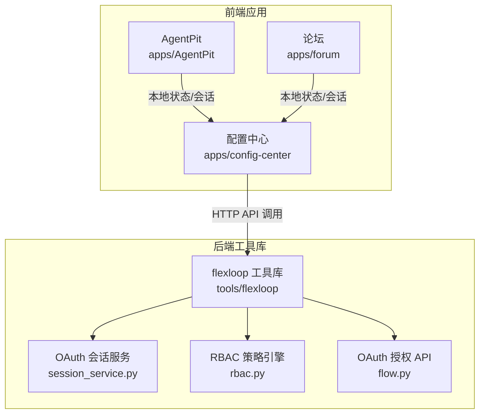
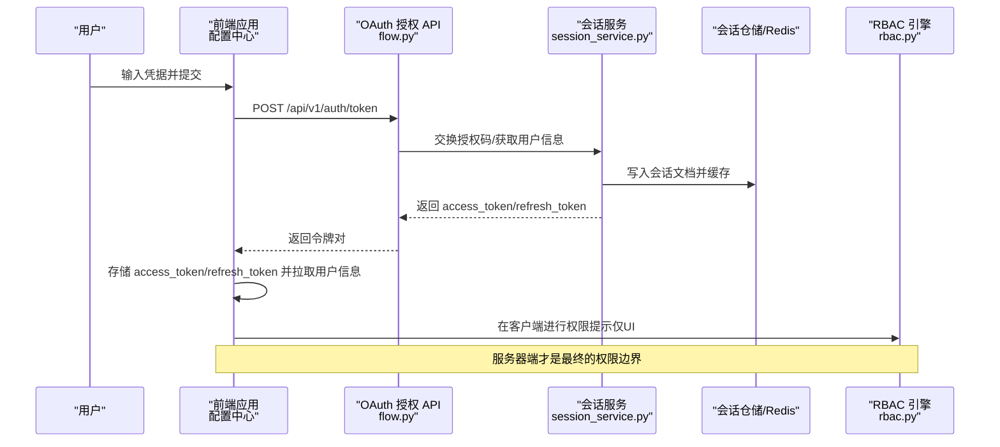
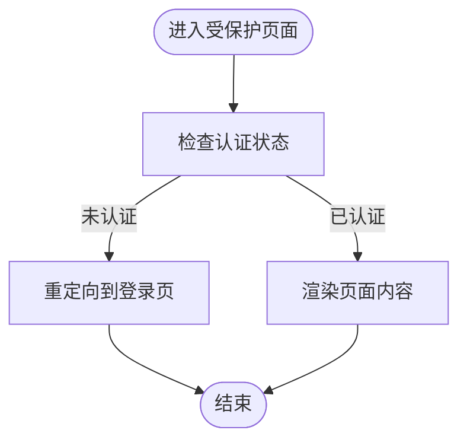
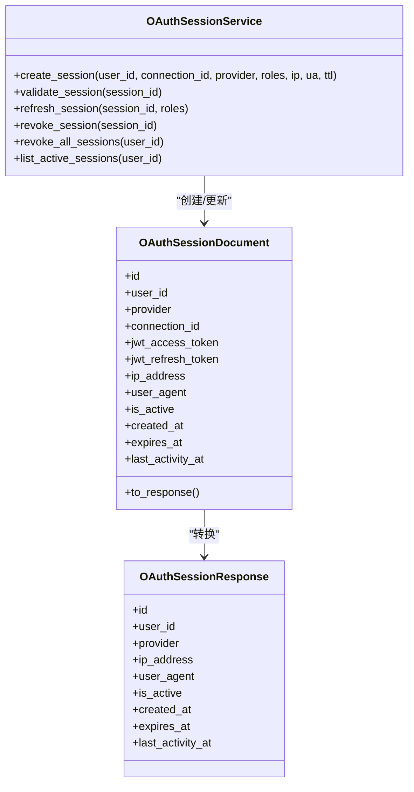
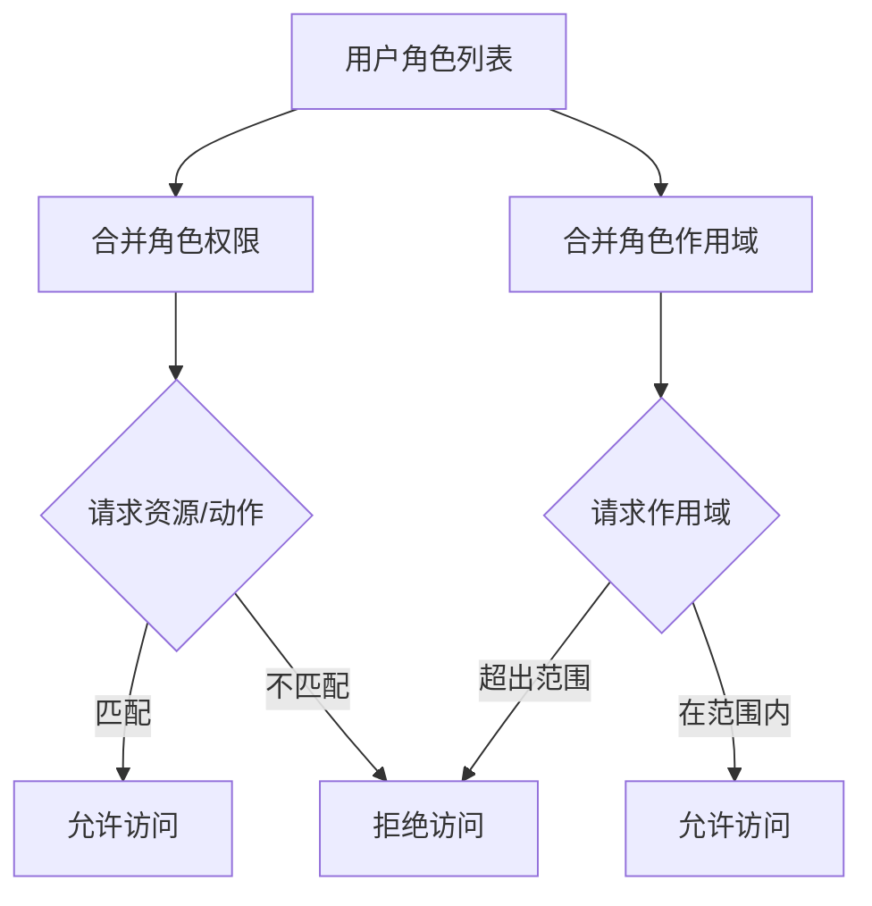
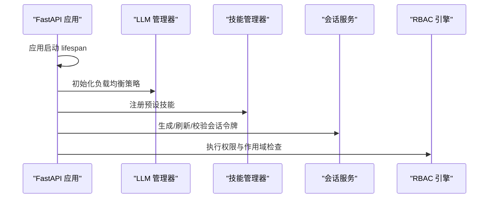
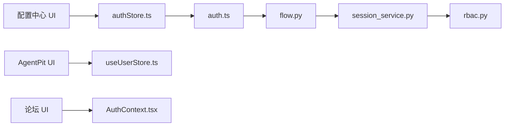

# 认证授权

<cite>
**本文引用的文件**
- [apps/config-center/src/api/auth.ts](file://apps/config-center/src/api/auth.ts)
- [apps/config-center/src/store/authStore.ts](file://apps/config-center/src/store/authStore.ts)
- [apps/config-center/src/pages/LoginPage.tsx](file://apps/config-center/src/pages/LoginPage.tsx)
- [apps/config-center/src/components/ProtectedRoute.tsx](file://apps/config-center/src/components/ProtectedRoute.tsx)
- [apps/config-center/src/types/index.ts](file://apps/config-center/src/types/index.ts)
- [apps/AgentPit/src/stores/useUserStore.ts](file://apps/AgentPit/src/stores/useUserStore.ts)
- [apps/AgentPit/src/__tests__/integration/state-management.spec.ts](file://apps/AgentPit/src/__tests__/integration/state-management.spec.ts)
- [apps/forum/src/context/AuthContext.tsx](file://apps/forum/src/context/AuthContext.tsx)
- [tools/flexloop/src/taolib/testing/oauth/services/session_service.py](file://tools/flexloop/src/taolib/testing/oauth/services/session_service.py)
- [tools/flexloop/src/taolib/testing/oauth/models/session.py](file://tools/flexloop/src/taolib/testing/oauth/models/session.py)
- [tools/flexloop/src/taolib/testing/oauth/server/api/flow.py](file://tools/flexloop/src/taolib/testing/oauth/server/api/flow.py)
- [tools/flexloop/src/taolib/testing/oauth/services/account_service.py](file://tools/flexloop/src/taolib/testing/oauth/services/account_service.py)
- [tools/flexloop/src/taolib/testing/auth/rbac.py](file://tools/flexloop/src/taolib/testing/auth/rbac.py)
- [tools/flexloop/tests/testing/test_auth/test_rbac.py](file://tools/flexloop/tests/testing/test_auth/test_rbac.py)
- [tools/flexloop/tests/testing/test_auth/test_dependencies.py](file://tools/flexloop/tests/testing/test_auth/test_dependencies.py)
- [apps/oauth-admin/src/pages/ProvidersPage.tsx](file://apps/oauth-admin/src/pages/ProvidersPage.tsx)
</cite>

## 目录
1. [简介](#简介)
2. [项目结构](#项目结构)
3. [核心组件](#核心组件)
4. [架构总览](#架构总览)
5. [详细组件分析](#详细组件分析)
6. [依赖分析](#依赖分析)
7. [性能考虑](#性能考虑)
8. [故障排除指南](#故障排除指南)
9. [结论](#结论)
10. [附录](#附录)

## 简介
本技术文档面向 DAOApps 认证授权系统，聚焦以下主题：
- JWT 令牌管理：令牌签发、刷新与校验策略
- OAuth2.0 集成：授权码流程、回调处理、账户关联与会话管理
- 权限控制：RBAC 权限模型、角色管理与访问控制
- 用户身份与会话：注册登录流程、密码安全策略、账户安全防护
- 多智能体系统认证：跨服务会话与令牌分发
- 安全最佳实践、漏洞防护与合规建议
- 认证集成示例与故障排除

## 项目结构
认证授权相关能力横跨前端应用与后端工具库两部分：
- 前端应用（配置中心、AgentPit、论坛等）负责用户态交互、状态持久化与路由保护
- 工具库（flexloop）提供 OAuth 会话服务、RBAC 策略引擎与 FastAPI 授权流程

**图表来源**
- [apps/config-center/src/store/authStore.ts:1-108](file://apps/config-center/src/store/authStore.ts#L1-108)
- [tools/flexloop/src/taolib/testing/oauth/services/session_service.py:15-238](file://tools/flexloop/src/taolib/testing/oauth/services/session_service.py#L15-L238)
- [tools/flexloop/src/taolib/testing/auth/rbac.py:41-159](file://tools/flexloop/src/taolib/testing/auth/rbac.py#L41-L159)
- [tools/flexloop/src/taolib/testing/oauth/server/api/flow.py:173-267](file://tools/flexloop/src/taolib/testing/oauth/server/api/flow.py#L173-L267)

**章节来源**
- [apps/config-center/src/store/authStore.ts:1-108](file://apps/config-center/src/store/authStore.ts#L1-108)
- [apps/AgentPit/src/stores/useUserStore.ts:1-72](file://apps/AgentPit/src/stores/useUserStore.ts#L1-72)
- [apps/forum/src/context/AuthContext.tsx:1-92](file://apps/forum/src/context/AuthContext.tsx#L1-L92)
- [tools/flexloop/src/taolib/testing/oauth/services/session_service.py:15-238](file://tools/flexloop/src/taolib/testing/oauth/services/session_service.py#L15-L238)
- [tools/flexloop/src/taolib/testing/auth/rbac.py:41-159](file://tools/flexloop/src/taolib/testing/auth/rbac.py#L41-L159)
- [tools/flexloop/src/taolib/testing/oauth/server/api/flow.py:173-267](file://tools/flexloop/src/taolib/testing/oauth/server/api/flow.py#L173-L267)

## 核心组件
- 前端认证状态与路由保护
  - 配置中心使用 zustand + persist 管理访问令牌、刷新令牌与用户信息，并提供登录、刷新、登出与权限查询方法；受保护路由通过鉴权状态拦截
  - AgentPit 使用 Pinia 管理用户态与主题设置，支持登录登出与资料更新
  - 论坛使用 React Context 管理本地用户态与登录/注册/登出逻辑
- OAuth 会话与令牌
  - 会话服务统一生成 JWT Access/Refresh Token，写入会话文档并缓存至 Redis，支持会话校验、刷新与撤销
  - OAuth 授权 API 实现标准授权码流程，回调中完成用户信息获取、连接建立与会话创建
- RBAC 权限模型
  - 基于角色的权限检查与作用域验证，支持多角色合并权限与作用域合并
  - 提供从字典构建策略的能力，兼容系统内置角色定义

**章节来源**
- [apps/config-center/src/store/authStore.ts:1-108](file://apps/config-center/src/store/authStore.ts#L1-108)
- [apps/config-center/src/components/ProtectedRoute.tsx:1-14](file://apps/config-center/src/components/ProtectedRoute.tsx#L1-L14)
- [apps/AgentPit/src/stores/useUserStore.ts:1-72](file://apps/AgentPit/src/stores/useUserStore.ts#L1-72)
- [apps/forum/src/context/AuthContext.tsx:1-92](file://apps/forum/src/context/AuthContext.tsx#L1-L92)
- [tools/flexloop/src/taolib/testing/oauth/services/session_service.py:15-238](file://tools/flexloop/src/taolib/testing/oauth/services/session_service.py#L15-L238)
- [tools/flexloop/src/taolib/testing/oauth/server/api/flow.py:173-267](file://tools/flexloop/src/taolib/testing/oauth/server/api/flow.py#L173-L267)
- [tools/flexloop/src/taolib/testing/auth/rbac.py:41-159](file://tools/flexloop/src/taolib/testing/auth/rbac.py#L41-L159)

## 架构总览
下图展示从用户登录到资源访问的关键路径，涵盖前端状态、后端 OAuth 会话与 RBAC 控制。

**图表来源**
- [apps/config-center/src/api/auth.ts:1-15](file://apps/config-center/src/api/auth.ts#L1-L15)
- [apps/config-center/src/store/authStore.ts:29-73](file://apps/config-center/src/store/authStore.ts#L29-L73)
- [tools/flexloop/src/taolib/testing/oauth/server/api/flow.py:173-267](file://tools/flexloop/src/taolib/testing/oauth/server/api/flow.py#L173-L267)
- [tools/flexloop/src/taolib/testing/oauth/services/session_service.py:72-138](file://tools/flexloop/src/taolib/testing/oauth/services/session_service.py#L72-L138)
- [tools/flexloop/src/taolib/testing/auth/rbac.py:41-159](file://tools/flexloop/src/taolib/testing/auth/rbac.py#L41-L159)

## 详细组件分析

### 组件一：前端认证状态与路由保护（配置中心）
- 状态管理
  - 使用 zustand + persist 持久化访问令牌、刷新令牌与用户信息，避免页面刷新丢失状态
  - 提供 login、refresh、logout、fetchUser 方法；hasPermission 用于 UI 展示提示
- 路由保护
  - 受保护路由组件在未认证时跳转至登录页，并保留来源地址
- API 调用
  - login 调用 /api/v1/auth/token 获取令牌对
  - refreshToken 调用 /api/v1/auth/refresh 使用刷新令牌换取新令牌
  - getMe 调用 /api/v1/auth/me 获取当前用户信息

**图表来源**
- [apps/config-center/src/components/ProtectedRoute.tsx:1-14](file://apps/config-center/src/components/ProtectedRoute.tsx#L1-L14)

**章节来源**
- [apps/config-center/src/store/authStore.ts:1-108](file://apps/config-center/src/store/authStore.ts#L1-L108)
- [apps/config-center/src/api/auth.ts:1-15](file://apps/config-center/src/api/auth.ts#L1-L15)
- [apps/config-center/src/components/ProtectedRoute.tsx:1-14](file://apps/config-center/src/components/ProtectedRoute.tsx#L1-L14)

### 组件二：OAuth 会话与令牌管理（flexloop）
- 会话服务
  - 生成 JWT Access/Refresh Token，写入会话文档并缓存至 Redis
  - 支持会话校验（优先 Redis，回退数据库）、刷新与撤销
- 会话模型
  - 定义会话响应模型与 MongoDB 文档模型，包含用户标识、提供商、IP/User-Agent、活跃状态与过期时间等字段
- 授权 API
  - 实现标准授权码流程，回调中完成用户信息获取、连接建立与会话创建，支持新用户引导与已注册用户直接认证

**图表来源**
- [tools/flexloop/src/taolib/testing/oauth/services/session_service.py:15-238](file://tools/flexloop/src/taolib/testing/oauth/services/session_service.py#L15-L238)
- [tools/flexloop/src/taolib/testing/oauth/models/session.py:14-67](file://tools/flexloop/src/taolib/testing/oauth/models/session.py#L14-L67)

**章节来源**
- [tools/flexloop/src/taolib/testing/oauth/services/session_service.py:15-238](file://tools/flexloop/src/taolib/testing/oauth/services/session_service.py#L15-L238)
- [tools/flexloop/src/taolib/testing/oauth/models/session.py:14-67](file://tools/flexloop/src/taolib/testing/oauth/models/session.py#L14-L67)
- [tools/flexloop/src/taolib/testing/oauth/server/api/flow.py:173-267](file://tools/flexloop/src/taolib/testing/oauth/server/api/flow.py#L173-L267)

### 组件三：RBAC 权限模型与访问控制
- 角色与权限
  - 角色定义包含权限集合与作用域映射；支持多角色合并权限与作用域合并
  - 提供从字典构建策略的能力，兼容系统内置角色
- 权限检查
  - has_permission 判断资源与动作组合是否被授予
  - has_scope 判断在特定作用域（如环境、服务）内是否允许
- 客户端与服务端
  - 客户端 hasPermission 仅用于 UI 提示；服务端才作为最终安全边界

**图表来源**
- [tools/flexloop/src/taolib/testing/auth/rbac.py:41-159](file://tools/flexloop/src/taolib/testing/auth/rbac.py#L41-L159)

**章节来源**
- [tools/flexloop/src/taolib/testing/auth/rbac.py:1-159](file://tools/flexloop/src/taolib/testing/auth/rbac.py#L1-L159)
- [tools/flexloop/tests/testing/test_auth/test_rbac.py:1-194](file://tools/flexloop/tests/testing/test_auth/test_rbac.py#L1-L194)
- [tools/flexloop/tests/testing/test_auth/test_dependencies.py:86-132](file://tools/flexloop/tests/testing/test_auth/test_dependencies.py#L86-L132)

### 组件四：多智能体系统认证与权限分配
- 多智能体 API 生命周期
  - 应用启动时初始化 LLM 管理器与技能管理器，注册预设技能
- 会话与令牌
  - 会话服务为多智能体场景提供统一的 JWT 令牌生成与会话管理，支持跨服务共享
- 权限控制
  - 通过 RBAC 引擎对资源与操作进行权限校验，结合作用域限制（如环境、服务）

**图表来源**
- [tools/flexloop/src/taolib/testing/multi_agent/api/main.py:1-54](file://tools/flexloop/src/taolib/testing/multi_agent/api/main.py#L1-L54)
- [tools/flexloop/src/taolib/testing/oauth/services/session_service.py:72-138](file://tools/flexloop/src/taolib/testing/oauth/services/session_service.py#L72-L138)
- [tools/flexloop/src/taolib/testing/auth/rbac.py:41-159](file://tools/flexloop/src/taolib/testing/auth/rbac.py#L41-L159)

**章节来源**
- [tools/flexloop/src/taolib/testing/multi_agent/api/main.py:1-54](file://tools/flexloop/src/taolib/testing/multi_agent/api/main.py#L1-L54)
- [tools/flexloop/src/taolib/testing/oauth/services/session_service.py:15-238](file://tools/flexloop/src/taolib/testing/oauth/services/session_service.py#L15-L238)
- [tools/flexloop/src/taolib/testing/auth/rbac.py:41-159](file://tools/flexloop/src/taolib/testing/auth/rbac.py#L41-L159)

### 组件五：用户注册登录流程与密码安全
- 配置中心登录
  - 前端表单收集用户名/密码，调用 /api/v1/auth/token 获取令牌对，随后拉取用户信息
  - 登录成功后跳转首页并提示成功
- 论坛本地态登录
  - 使用 React Context 管理用户态，本地校验用户名与密码，保存最近活跃时间
- 密码安全策略
  - 建议采用强口令规则、密码哈希存储、最小暴露面（不传输明文密码）、二次验证与账户锁定策略
  - 前端仅负责输入校验与用户体验，实际认证与安全策略由后端服务执行

**章节来源**
- [apps/config-center/src/pages/LoginPage.tsx:1-77](file://apps/config-center/src/pages/LoginPage.tsx#L1-L77)
- [apps/config-center/src/api/auth.ts:1-15](file://apps/config-center/src/api/auth.ts#L1-L15)
- [apps/forum/src/context/AuthContext.tsx:1-92](file://apps/forum/src/context/AuthContext.tsx#L1-L92)

## 依赖分析
- 前端依赖
  - 配置中心：zustand + persist 管理认证状态，React Router 保护路由
  - AgentPit：Pinia 管理用户态与主题设置
  - 论坛：React Context 管理用户态
- 后端依赖
  - OAuth 会话服务依赖仓储与 Redis 缓存，提供统一的 JWT 令牌生成与会话管理
  - RBAC 引擎独立于业务领域，提供权限与作用域检查
  - OAuth 授权 API 串联流程服务、账户服务与会话服务

**图表来源**
- [apps/config-center/src/store/authStore.ts:1-108](file://apps/config-center/src/store/authStore.ts#L1-L108)
- [apps/config-center/src/api/auth.ts:1-15](file://apps/config-center/src/api/auth.ts#L1-L15)
- [tools/flexloop/src/taolib/testing/oauth/server/api/flow.py:173-267](file://tools/flexloop/src/taolib/testing/oauth/server/api/flow.py#L173-L267)
- [tools/flexloop/src/taolib/testing/oauth/services/session_service.py:15-238](file://tools/flexloop/src/taolib/testing/oauth/services/session_service.py#L15-L238)
- [tools/flexloop/src/taolib/testing/auth/rbac.py:41-159](file://tools/flexloop/src/taolib/testing/auth/rbac.py#L41-L159)
- [apps/AgentPit/src/stores/useUserStore.ts:1-72](file://apps/AgentPit/src/stores/useUserStore.ts#L1-L72)
- [apps/forum/src/context/AuthContext.tsx:1-92](file://apps/forum/src/context/AuthContext.tsx#L1-L92)

**章节来源**
- [apps/config-center/src/store/authStore.ts:1-108](file://apps/config-center/src/store/authStore.ts#L1-L108)
- [apps/AgentPit/src/stores/useUserStore.ts:1-72](file://apps/AgentPit/src/stores/useUserStore.ts#L1-L72)
- [apps/forum/src/context/AuthContext.tsx:1-92](file://apps/forum/src/context/AuthContext.tsx#L1-L92)
- [tools/flexloop/src/taolib/testing/oauth/server/api/flow.py:173-267](file://tools/flexloop/src/taolib/testing/oauth/server/api/flow.py#L173-L267)
- [tools/flexloop/src/taolib/testing/oauth/services/session_service.py:15-238](file://tools/flexloop/src/taolib/testing/oauth/services/session_service.py#L15-L238)
- [tools/flexloop/src/taolib/testing/auth/rbac.py:41-159](file://tools/flexloop/src/taolib/testing/auth/rbac.py#L41-L159)

## 性能考虑
- 会话缓存
  - 会话校验优先读取 Redis 缓存，降低数据库压力；过期时间与活动时间维护确保资源回收
- 令牌生命周期
  - Access Token 短有效期（分钟级），Refresh Token 较长（天级），减少泄露风险与刷新频率
- 前端状态持久化
  - 使用持久化存储减少重复登录成本，但需注意敏感令牌的安全存放与传输
- RBAC 计算
  - 权限与作用域检查为内存计算，复杂度与角色/权限数量线性相关，建议合理拆分角色与权限

## 故障排除指南
- 登录失败
  - 检查用户名/密码是否为空，确认后端 /api/v1/auth/token 是否返回令牌对
  - 若刷新失败，确认刷新令牌是否存在且未被撤销
- 无法访问受保护资源
  - 确认前端已持有有效 access_token；若过期，使用刷新令牌重新获取
  - 检查 RBAC 权限与作用域是否满足资源访问条件
- OAuth 回调异常
  - 核对 state 参数是否一致，授权码是否正确交换
  - 检查提供商配置与回调地址是否匹配
- 会话失效
  - 确认会话未过期且处于活跃状态；必要时撤销会话并重新登录
- 多设备登录问题
  - 使用撤销所有会话功能，确保同一账户在各设备上的会话一致性

**章节来源**
- [apps/config-center/src/pages/LoginPage.tsx:1-77](file://apps/config-center/src/pages/LoginPage.tsx#L1-L77)
- [apps/config-center/src/store/authStore.ts:57-82](file://apps/config-center/src/store/authStore.ts#L57-L82)
- [tools/flexloop/src/taolib/testing/oauth/server/api/flow.py:173-267](file://tools/flexloop/src/taolib/testing/oauth/server/api/flow.py#L173-L267)
- [tools/flexloop/src/taolib/testing/oauth/services/session_service.py:140-207](file://tools/flexloop/src/taolib/testing/oauth/services/session_service.py#L140-L207)

## 结论
DAOApps 认证授权体系以“前端状态 + 后端 OAuth 会话 + RBAC 权限”为核心，实现了：
- 标准化的 JWT 令牌管理与刷新策略
- 完整的 OAuth2.0 授权码流程与账户关联
- 可扩展的 RBAC 权限模型与作用域控制
- 多智能体场景下的统一会话与权限分配
配合安全最佳实践与完善的故障排除流程，可为 DAOApps 生态提供稳定、安全、易用的认证授权能力。

## 附录
- OAuth 提供商配置示例（前端）
  - 在 OAuth 管理界面选择提供商、填写显示名称与 Client ID/Secret，完成配置后即可启用对应授权流程
- 前端集成要点
  - 登录成功后保存 access_token/refresh_token，刷新时优先使用刷新令牌
  - 受保护路由通过鉴权状态拦截，未认证跳转登录页
  - UI 中的权限提示仅作辅助，最终以服务端校验为准

**章节来源**
- [apps/oauth-admin/src/pages/ProvidersPage.tsx:220-242](file://apps/oauth-admin/src/pages/ProvidersPage.tsx#L220-L242)
- [apps/config-center/src/store/authStore.ts:1-108](file://apps/config-center/src/store/authStore.ts#L1-L108)
- [apps/config-center/src/components/ProtectedRoute.tsx:1-14](file://apps/config-center/src/components/ProtectedRoute.tsx#L1-L14)