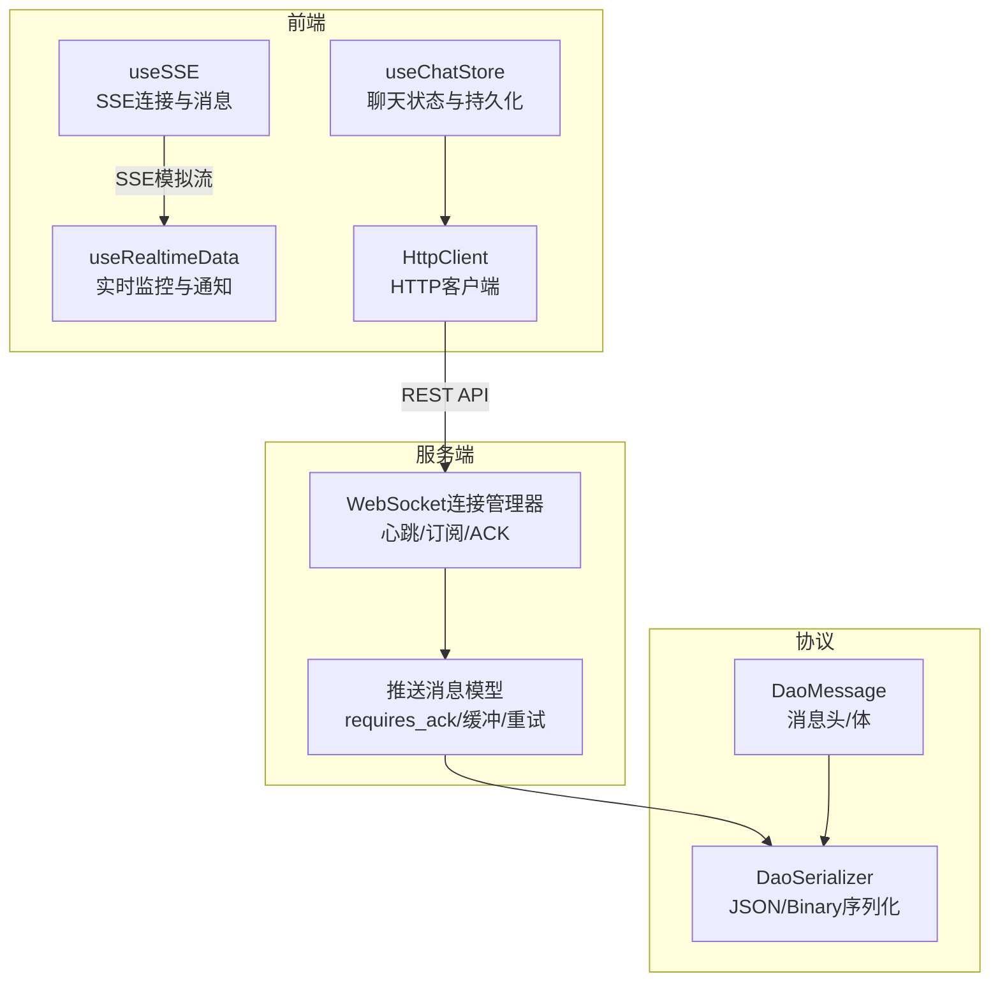
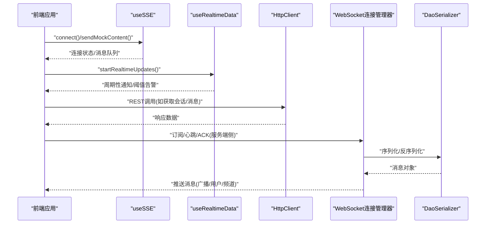
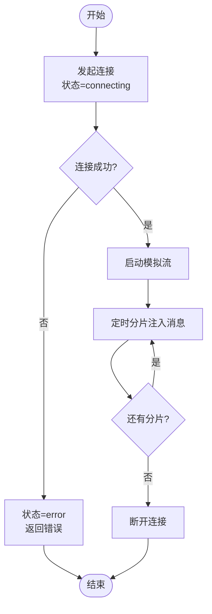
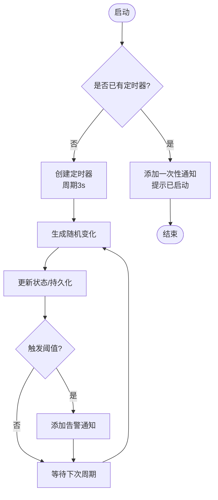
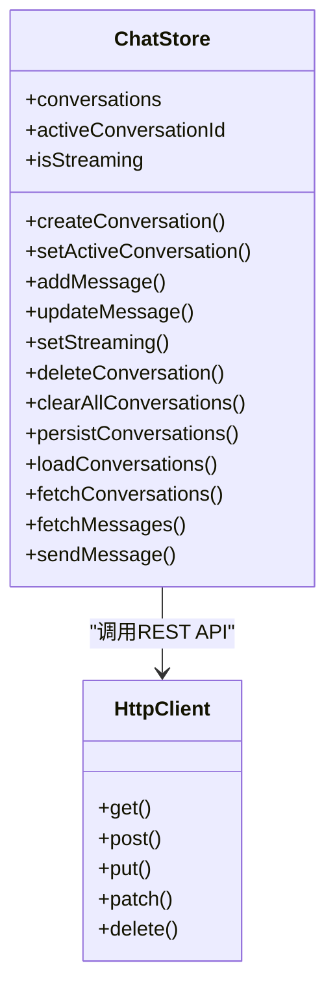
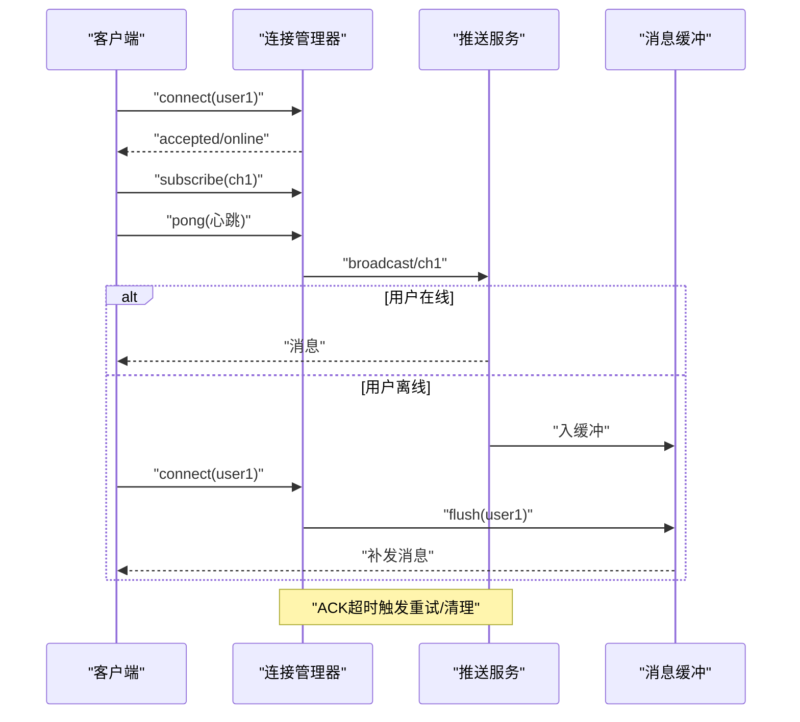
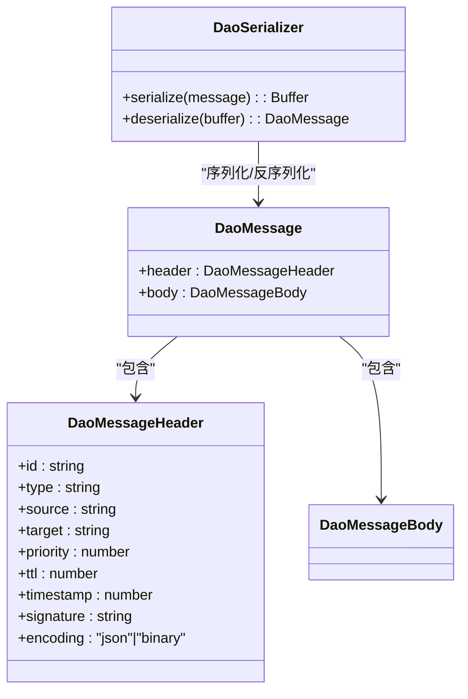
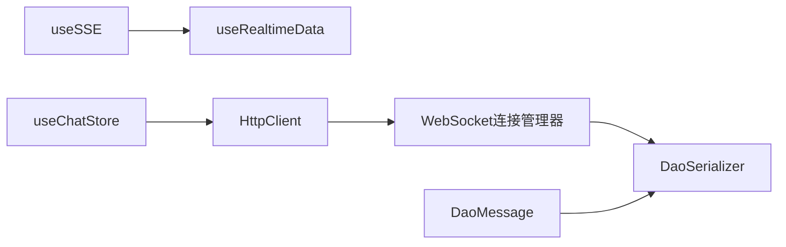

# 通信协议

<cite>
**本文引用的文件**   
- [useSSE.ts](file://apps/AgentPit/src/composables/useSSE.ts)
- [useRealtimeData.ts](file://apps/AgentPit/src/composables/useRealtimeData.ts)
- [useChatStore.ts](file://apps/AgentPit/src/stores/useChatStore.ts)
- [client.ts](file://apps/AgentPit/src/services/api/client.ts)
- [chat.ts](file://apps/AgentPit/src/services/api/chat.ts)
- [connection-manager.ts](file://apps/DaoMind/packages/daoNexus/src/connection-manager.ts)
- [serializer.ts](file://apps/DaoMind/packages/daoQi/src/codec/serializer.ts)
- [message.ts](file://apps/DaoMind/packages/daoQi/src/types/message.ts)
- [manager.py](file://tools/flexloop/src/taolib/testing/config_center/server/websocket/manager.py)
- [test_push_service.py](file://tools/flexloop/tests/testing/test_config_center/test_push_service.py)
</cite>

## 目录
1. [引言](#引言)
2. [项目结构](#项目结构)
3. [核心组件](#核心组件)
4. [架构总览](#架构总览)
5. [详细组件分析](#详细组件分析)
6. [依赖关系分析](#依赖关系分析)
7. [性能考虑](#性能考虑)
8. [故障排查指南](#故障排查指南)
9. [结论](#结论)
10. [附录](#附录)

## 引言
本文件面向DAOApps的通信协议与实时能力，系统性梳理并总结以下内容：
- WebSocket实时通信实现与连接管理
- Server-Sent Events (SSE) 的概念与模拟实现
- 长轮询机制的替代思路与边界
- 实时数据流处理、事件监听与消息推送
- 连接管理、重连与断线恢复策略
- 消息格式规范、事件类型定义与数据序列化方案
- 实时聊天、状态同步与通知系统
- 通信性能优化、带宽管理与延迟控制
- 客户端集成示例与调试工具使用指南

## 项目结构
围绕通信协议的关键模块分布如下：
- 前端实时能力与聊天存储
  - useSSE：SSE连接与消息管理（模拟实现）
  - useRealtimeData：实时状态监控与通知
  - useChatStore：聊天会话与消息持久化
  - HttpClient：统一HTTP客户端封装
- 服务端WebSocket与消息推送
  - WebSocket连接管理器（Python测试覆盖）
  - 推送消息与ACK、心跳、订阅管理（测试驱动）
- 协议与序列化
  - DaoMessage统一消息格式
  - DaoSerializer序列化/反序列化

**图表来源**
- [useSSE.ts:1-129](file://apps/AgentPit/src/composables/useSSE.ts#L1-L129)
- [useRealtimeData.ts:1-117](file://apps/AgentPit/src/composables/useRealtimeData.ts#L1-L117)
- [useChatStore.ts:1-218](file://apps/AgentPit/src/stores/useChatStore.ts#L1-L218)
- [client.ts:1-105](file://apps/AgentPit/src/services/api/client.ts#L1-L105)
- [manager.py:43-82](file://tools/flexloop/src/taolib/testing/config_center/server/websocket/manager.py#L43-L82)
- [serializer.ts:1-75](file://apps/DaoMind/packages/daoQi/src/codec/serializer.ts#L1-L75)
- [message.ts:1-40](file://apps/DaoMind/packages/daoQi/src/types/message.ts#L1-L40)

**章节来源**
- [useSSE.ts:1-129](file://apps/AgentPit/src/composables/useSSE.ts#L1-L129)
- [useRealtimeData.ts:1-117](file://apps/AgentPit/src/composables/useRealtimeData.ts#L1-L117)
- [useChatStore.ts:1-218](file://apps/AgentPit/src/stores/useChatStore.ts#L1-L218)
- [client.ts:1-105](file://apps/AgentPit/src/services/api/client.ts#L1-L105)
- [connection-manager.ts:1-140](file://apps/DaoMind/packages/daoNexus/src/connection-manager.ts#L1-L140)
- [serializer.ts:1-75](file://apps/DaoMind/packages/daoQi/src/codec/serializer.ts#L1-L75)
- [message.ts:1-40](file://apps/DaoMind/packages/daoQi/src/types/message.ts#L1-L40)
- [manager.py:43-82](file://tools/flexloop/src/taolib/testing/config_center/server/websocket/manager.py#L43-L82)
- [test_push_service.py:251-880](file://tools/flexloop/tests/testing/test_config_center/test_push_service.py#L251-L880)

## 核心组件
- SSE模拟与消息管理：提供连接状态、消息队列与错误处理，支持分片消息追加与清理
- 实时监控与通知：周期性生成随机变化，触发阈值告警与自动消失通知
- 聊天状态与持久化：会话列表、消息集合、最近上下文提取、本地持久化
- HTTP客户端：统一请求头、超时控制、错误分类与响应解析
- WebSocket连接管理器：连接生命周期、订阅管理、心跳、ACK与重试、离线缓冲
- 消息协议与序列化：统一消息头字段、JSON/Binary两种编码、二进制魔数识别

**章节来源**
- [useSSE.ts:1-129](file://apps/AgentPit/src/composables/useSSE.ts#L1-L129)
- [useRealtimeData.ts:1-117](file://apps/AgentPit/src/composables/useRealtimeData.ts#L1-L117)
- [useChatStore.ts:1-218](file://apps/AgentPit/src/stores/useChatStore.ts#L1-L218)
- [client.ts:1-105](file://apps/AgentPit/src/services/api/client.ts#L1-L105)
- [connection-manager.ts:1-140](file://apps/DaoMind/packages/daoNexus/src/connection-manager.ts#L1-L140)
- [serializer.ts:1-75](file://apps/DaoMind/packages/daoQi/src/codec/serializer.ts#L1-L75)
- [message.ts:1-40](file://apps/DaoMind/packages/daoQi/src/types/message.ts#L1-L40)
- [manager.py:43-82](file://tools/flexloop/src/taolib/testing/config_center/server/websocket/manager.py#L43-L82)

## 架构总览
DAOApps的通信路径可抽象为“前端实时能力 → HTTP/REST → 服务端WebSocket/消息中心 → 序列化/反序列化 → 客户端消费”。

**图表来源**
- [useSSE.ts:1-129](file://apps/AgentPit/src/composables/useSSE.ts#L1-L129)
- [useRealtimeData.ts:1-117](file://apps/AgentPit/src/composables/useRealtimeData.ts#L1-L117)
- [client.ts:1-105](file://apps/AgentPit/src/services/api/client.ts#L1-L105)
- [manager.py:43-82](file://tools/flexloop/src/taolib/testing/config_center/server/websocket/manager.py#L43-L82)
- [serializer.ts:1-75](file://apps/DaoMind/packages/daoQi/src/codec/serializer.ts#L1-L75)

## 详细组件分析

### SSE（Server-Sent Events）实现与模拟
- 功能要点
  - 连接状态机：connecting → connected → disconnected/error
  - 模拟SSE流：定时分片注入消息，支持清理与断开
  - 分片回调：逐段追加到消息队列，便于UI增量渲染
  - 生命周期：组件卸载时自动断开，避免内存泄漏
- 适用场景
  - 浏览器端实时文本流（如打字机效果）、事件回放（仅直播事件）
  - 与WebSocket互补：低开销、单向推送、自动重连友好

**图表来源**
- [useSSE.ts:18-61](file://apps/AgentPit/src/composables/useSSE.ts#L18-L61)

**章节来源**
- [useSSE.ts:1-129](file://apps/AgentPit/src/composables/useSSE.ts#L1-L129)

### 实时数据流与通知系统
- 功能要点
  - 周期性随机波动模拟余额变化
  - 阈值告警：异常增长/下降/负余额
  - 自动消失通知：统一时间戳与去重ID
  - 幂等启动/停止：避免重复定时器
- 与聊天/状态同步的关系
  - 作为“状态源”驱动UI刷新
  - 与聊天Store结合，形成“输入→发送→接收→渲染”的闭环

**图表来源**
- [useRealtimeData.ts:74-102](file://apps/AgentPit/src/composables/useRealtimeData.ts#L74-L102)

**章节来源**
- [useRealtimeData.ts:1-117](file://apps/AgentPit/src/composables/useRealtimeData.ts#L1-L117)

### 聊天状态与消息持久化
- 功能要点
  - 会话管理：创建/激活/删除/清空
  - 消息管理：新增、更新、按会话聚合
  - 上下文提取：最近N轮完整对话（user+assistant对）
  - 本地持久化：localStorage存取
  - API交互：通过HttpClient访问REST接口
- 与实时能力的协同
  - SSE用于增量文本流；Store负责结构化消息与上下文
  - 通知系统用于发送/接收异常提示

**图表来源**
- [useChatStore.ts:1-218](file://apps/AgentPit/src/stores/useChatStore.ts#L1-L218)
- [client.ts:1-105](file://apps/AgentPit/src/services/api/client.ts#L1-L105)

**章节来源**
- [useChatStore.ts:1-218](file://apps/AgentPit/src/stores/useChatStore.ts#L1-L218)
- [client.ts:1-105](file://apps/AgentPit/src/services/api/client.ts#L1-L105)
- [chat.ts:1-18](file://apps/AgentPit/src/services/api/chat.ts#L1-L18)

### WebSocket连接管理与消息推送
- 连接生命周期
  - connect/disconnect：建立/断开连接，维护在线状态
  - 多设备连接：同一用户多实例在线
  - 订阅/退订：频道维度的订阅管理
- 心跳与保活
  - 心跳间隔与超时配置，过期连接清理
- 消息可靠性
  - requires_ack：要求ACK确认
  - 重试上限与超时清理
  - 离线缓冲：用户离线时暂存消息，上线后flush
- 统计与可观测性
  - 活跃连接数、在线用户数、通道数统计

**图表来源**
- [manager.py:43-82](file://tools/flexloop/src/taolib/testing/config_center/server/websocket/manager.py#L43-L82)
- [test_push_service.py:251-880](file://tools/flexloop/tests/testing/test_config_center/test_push_service.py#L251-L880)

**章节来源**
- [connection-manager.ts:1-140](file://apps/DaoMind/packages/daoNexus/src/connection-manager.ts#L1-L140)
- [manager.py:43-82](file://tools/flexloop/src/taolib/testing/config_center/server/websocket/manager.py#L43-L82)
- [test_push_service.py:251-880](file://tools/flexloop/tests/testing/test_config_center/test_push_service.py#L251-L880)

### 消息格式规范与序列化方案
- 消息头字段
  - id、type、source、target、priority、ttl、timestamp、signature、encoding
- 编码方案
  - JSON编码：直接序列化为字符串
  - Binary编码：二进制帧（魔数+头长度+头+体），支持二进制体
- 序列化流程
  - 识别编码类型，选择对应序列化/反序列化路径
  - 二进制体采用Base64包装，JSON还原为ArrayBuffer

**图表来源**
- [message.ts:1-40](file://apps/DaoMind/packages/daoQi/src/types/message.ts#L1-L40)
- [serializer.ts:1-75](file://apps/DaoMind/packages/daoQi/src/codec/serializer.ts#L1-L75)

**章节来源**
- [message.ts:1-40](file://apps/DaoMind/packages/daoQi/src/types/message.ts#L1-L40)
- [serializer.ts:1-75](file://apps/DaoMind/packages/daoQi/src/codec/serializer.ts#L1-L75)

## 依赖关系分析
- 前端模块耦合
  - useSSE与useRealtimeData解耦，分别负责不同实时场景
  - useChatStore依赖HttpClient进行后端交互
- 服务端模块耦合
  - WebSocket连接管理器集中处理订阅、心跳、ACK与统计
  - 推送服务与消息缓冲配合，保证可靠性
- 协议层独立
  - DaoMessage与DaoSerializer与具体传输无关，便于扩展

**图表来源**
- [useSSE.ts:1-129](file://apps/AgentPit/src/composables/useSSE.ts#L1-L129)
- [useRealtimeData.ts:1-117](file://apps/AgentPit/src/composables/useRealtimeData.ts#L1-L117)
- [useChatStore.ts:1-218](file://apps/AgentPit/src/stores/useChatStore.ts#L1-L218)
- [client.ts:1-105](file://apps/AgentPit/src/services/api/client.ts#L1-L105)
- [manager.py:43-82](file://tools/flexloop/src/taolib/testing/config_center/server/websocket/manager.py#L43-L82)
- [serializer.ts:1-75](file://apps/DaoMind/packages/daoQi/src/codec/serializer.ts#L1-L75)
- [message.ts:1-40](file://apps/DaoMind/packages/daoQi/src/types/message.ts#L1-L40)

**章节来源**
- [useSSE.ts:1-129](file://apps/AgentPit/src/composables/useSSE.ts#L1-L129)
- [useRealtimeData.ts:1-117](file://apps/AgentPit/src/composables/useRealtimeData.ts#L1-L117)
- [useChatStore.ts:1-218](file://apps/AgentPit/src/stores/useChatStore.ts#L1-L218)
- [client.ts:1-105](file://apps/AgentPit/src/services/api/client.ts#L1-L105)
- [connection-manager.ts:1-140](file://apps/DaoMind/packages/daoNexus/src/connection-manager.ts#L1-L140)
- [serializer.ts:1-75](file://apps/DaoMind/packages/daoQi/src/codec/serializer.ts#L1-L75)
- [message.ts:1-40](file://apps/DaoMind/packages/daoQi/src/types/message.ts#L1-L40)
- [manager.py:43-82](file://tools/flexloop/src/taolib/testing/config_center/server/websocket/manager.py#L43-L82)
- [test_push_service.py:251-880](file://tools/flexloop/tests/testing/test_config_center/test_push_service.py#L251-L880)

## 性能考虑
- 带宽与延迟
  - SSE适合高频小包文本流；WebSocket适合双向、低延迟消息
  - 二进制编码降低JSON体积，适合大块数据或多媒体
- 资源占用
  - 合理的心跳间隔与超时，避免频繁扫描与无效连接
  - 清理闲置连接与过期ACK，防止内存泄漏
- 一致性与可靠性
  - requires_ack+重试+缓冲组合，确保关键事件不丢失
  - 订阅去重与批量清理，减少广播压力

[本节为通用指导，无需列出具体文件来源]

## 故障排查指南
- SSE连接问题
  - 检查连接状态是否停留在connecting或error
  - 确认模拟流是否被提前断开
- WebSocket推送问题
  - 关注订阅是否正确、心跳是否正常、ACK是否超时
  - 离线用户消息是否进入缓冲并成功flush
- 序列化异常
  - 核对消息头字段完整性与编码类型一致
  - 二进制体是否按Base64包装/还原

**章节来源**
- [useSSE.ts:1-129](file://apps/AgentPit/src/composables/useSSE.ts#L1-L129)
- [test_push_service.py:251-880](file://tools/flexloop/tests/testing/test_config_center/test_push_service.py#L251-L880)
- [serializer.ts:1-75](file://apps/DaoMind/packages/daoQi/src/codec/serializer.ts#L1-L75)

## 结论
DAOApps在前端提供了SSE模拟与实时通知能力，在服务端具备WebSocket连接管理与消息推送的测试完备实现，并以DaoMessage与DaoSerializer构建了统一的协议与序列化基础。建议在生产环境中：
- 使用真实EventSource与WebSocket，完善断线重连与指数退避
- 为关键业务启用requires_ack与缓冲策略
- 采用二进制编码优化大体量数据传输
- 建立完善的日志与指标，持续优化心跳与清理策略

[本节为总结性内容，无需列出具体文件来源]

## 附录

### 客户端集成示例（步骤指引）
- SSE集成
  - 初始化useSSE，调用connect(url)建立连接
  - 监听connectionState与messages，实现增量渲染
  - 在组件卸载时调用disconnect，释放资源
- 实时通知
  - 调用useRealtimeData.startRealtimeUpdates()启动周期更新
  - 订阅notifications数组，展示告警与提示
- 聊天交互
  - 通过useChatStore.createConversation/activeConversationId
  - 调用httpClient.post进行消息发送（REST）
- WebSocket推送
  - 建立WebSocket连接，发送subscribe消息加入频道
  - 处理心跳与pong，实现断线重连

**章节来源**
- [useSSE.ts:1-129](file://apps/AgentPit/src/composables/useSSE.ts#L1-L129)
- [useRealtimeData.ts:1-117](file://apps/AgentPit/src/composables/useRealtimeData.ts#L1-L117)
- [useChatStore.ts:1-218](file://apps/AgentPit/src/stores/useChatStore.ts#L1-L218)
- [client.ts:1-105](file://apps/AgentPit/src/services/api/client.ts#L1-L105)
- [manager.py:43-82](file://tools/flexloop/src/taolib/testing/config_center/server/websocket/manager.py#L43-L82)