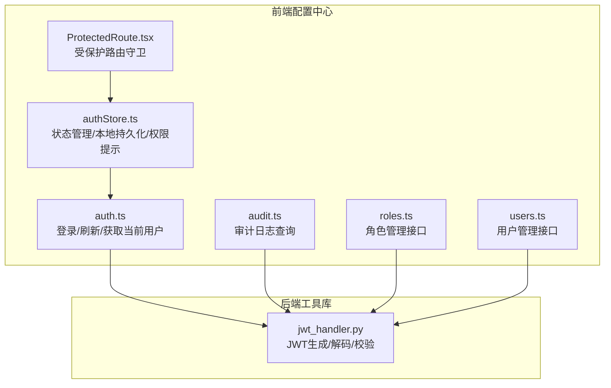
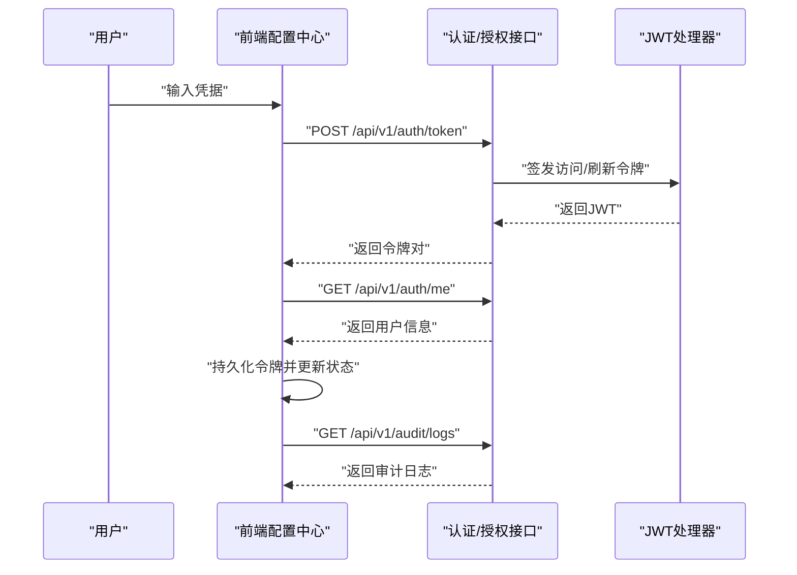
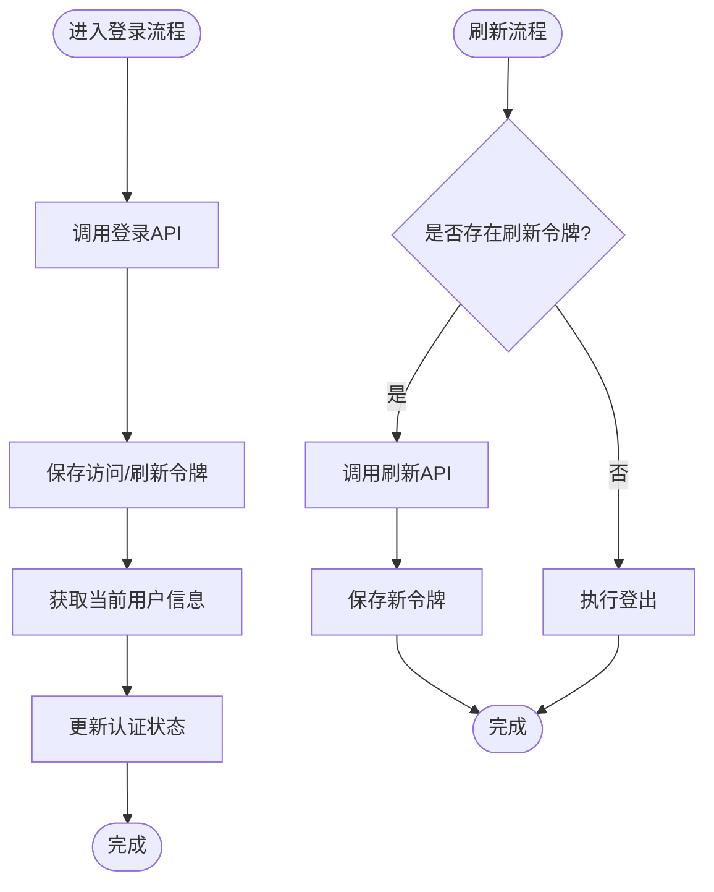
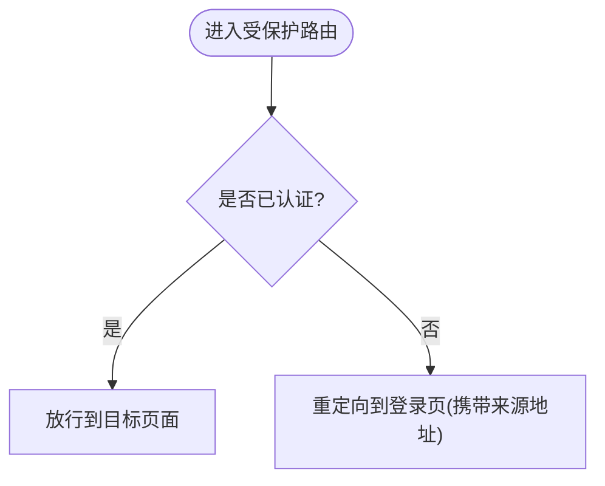
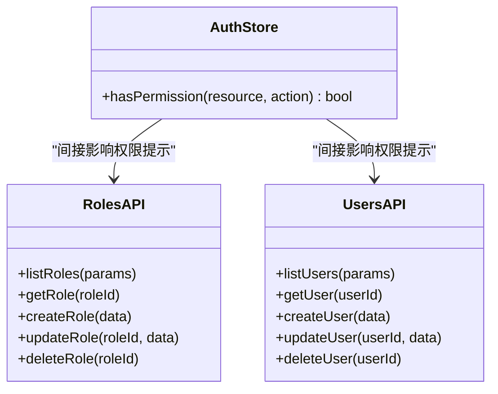
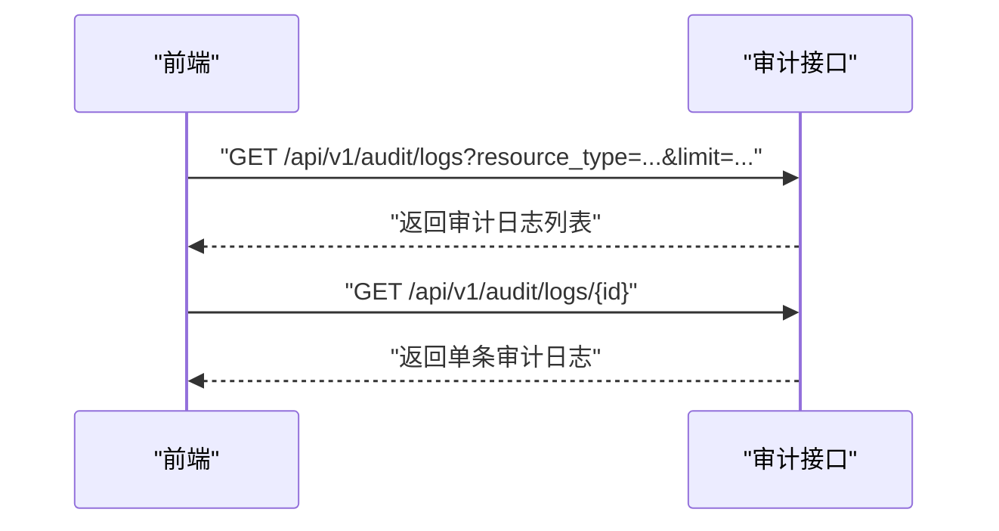
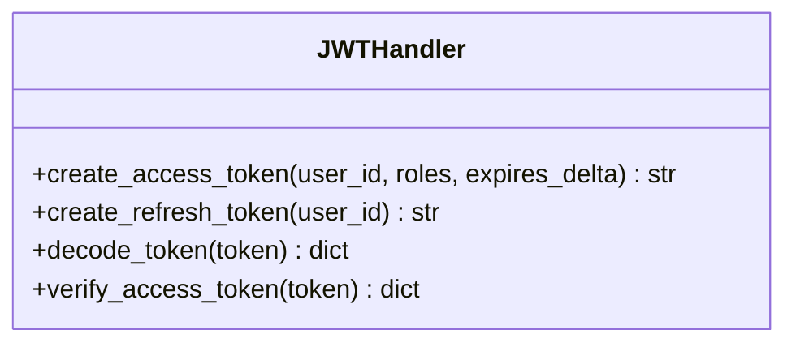
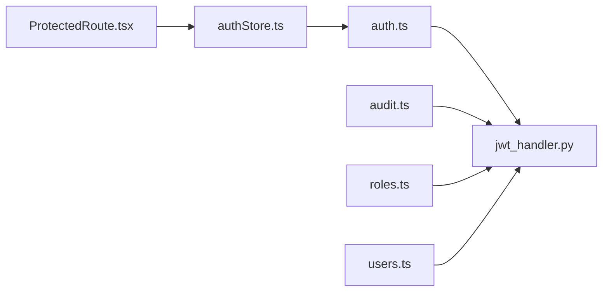

# 安全架构

<cite>
**本文引用的文件**
- [apps/config-center/src/api/auth.ts](file://apps/config-center/src/api/auth.ts)
- [apps/config-center/src/store/authStore.ts](file://apps/config-center/src/store/authStore.ts)
- [apps/config-center/src/components/ProtectedRoute.tsx](file://apps/config-center/src/components/ProtectedRoute.tsx)
- [apps/config-center/src/api/audit.ts](file://apps/config-center/src/api/audit.ts)
- [apps/config-center/src/api/roles.ts](file://apps/config-center/src/api/roles.ts)
- [apps/config-center/src/api/users.ts](file://apps/config-center/src/api/users.ts)
- [tools/flexloop/src/taolib/testing/config_center/server/auth/jwt_handler.py](file://tools/flexloop/src/taolib/testing/config_center/server/auth/jwt_handler.py)
</cite>

## 目录
1. [引言](#引言)
2. [项目结构](#项目结构)
3. [核心组件](#核心组件)
4. [架构总览](#架构总览)
5. [详细组件分析](#详细组件分析)
6. [依赖分析](#依赖分析)
7. [性能考虑](#性能考虑)
8. [故障排查指南](#故障排查指南)
9. [结论](#结论)
10. [附录](#附录)

## 引言
本文件面向 DAO Collective 项目，系统化梳理其安全架构与实现要点，覆盖认证（JWT）、授权（RBAC）、会话与令牌管理、审计与日志等维度。文档以代码为依据，结合流程图与类图，帮助技术与非技术读者理解当前实现与可演进方向。

## 项目结构
DAO Collective 采用多应用与工具库混合的组织方式。与安全相关的关键位置如下：
- 前端配置中心（React）：负责用户登录、令牌持久化、受保护路由与审计查询。
- 后端工具库（Python/FastAPI）：提供 JWT 编解码、令牌签发与校验等能力。

图表来源
- [apps/config-center/src/api/auth.ts:1-15](file://apps/config-center/src/api/auth.ts#L1-L15)
- [apps/config-center/src/store/authStore.ts:1-108](file://apps/config-center/src/store/authStore.ts#L1-L108)
- [apps/config-center/src/components/ProtectedRoute.tsx:1-14](file://apps/config-center/src/components/ProtectedRoute.tsx#L1-L14)
- [apps/config-center/src/api/audit.ts:1-18](file://apps/config-center/src/api/audit.ts#L1-L18)
- [apps/config-center/src/api/roles.ts:1-26](file://apps/config-center/src/api/roles.ts#L1-L26)
- [apps/config-center/src/api/users.ts:1-26](file://apps/config-center/src/api/users.ts#L1-L26)
- [tools/flexloop/src/taolib/testing/config_center/server/auth/jwt_handler.py:1-94](file://tools/flexloop/src/taolib/testing/config_center/server/auth/jwt_handler.py#L1-L94)

章节来源
- [apps/config-center/src/api/auth.ts:1-15](file://apps/config-center/src/api/auth.ts#L1-L15)
- [apps/config-center/src/store/authStore.ts:1-108](file://apps/config-center/src/store/authStore.ts#L1-L108)
- [apps/config-center/src/components/ProtectedRoute.tsx:1-14](file://apps/config-center/src/components/ProtectedRoute.tsx#L1-L14)
- [apps/config-center/src/api/audit.ts:1-18](file://apps/config-center/src/api/audit.ts#L1-L18)
- [apps/config-center/src/api/roles.ts:1-26](file://apps/config-center/src/api/roles.ts#L1-L26)
- [apps/config-center/src/api/users.ts:1-26](file://apps/config-center/src/api/users.ts#L1-L26)
- [tools/flexloop/src/taolib/testing/config_center/server/auth/jwt_handler.py:1-94](file://tools/flexloop/src/taolib/testing/config_center/server/auth/jwt_handler.py#L1-L94)

## 核心组件
- 认证与令牌管理（前端）
  - 登录、刷新、获取当前用户接口封装。
  - 使用持久化状态管理保存访问令牌、刷新令牌与用户信息。
  - 受保护路由守卫基于认证状态进行跳转控制。
- 授权与权限提示（前端）
  - 提供资源级权限判断的客户端提示逻辑；超级管理员拥有全部权限的提示。
  - 实际权限边界由服务端强制执行。
- 审计与日志（前端）
  - 提供审计日志查询接口，支持按资源类型、资源ID、操作者、动作等条件筛选。
- RBAC 管理（前端）
  - 角色与用户管理接口，支持增删改查。
- JWT 处理（后端）
  - 提供访问令牌与刷新令牌的生成、解码与类型校验。
  - 支持从配置读取密钥与算法，并设置过期时间。

章节来源
- [apps/config-center/src/api/auth.ts:1-15](file://apps/config-center/src/api/auth.ts#L1-L15)
- [apps/config-center/src/store/authStore.ts:1-108](file://apps/config-center/src/store/authStore.ts#L1-L108)
- [apps/config-center/src/components/ProtectedRoute.tsx:1-14](file://apps/config-center/src/components/ProtectedRoute.tsx#L1-L14)
- [apps/config-center/src/api/audit.ts:1-18](file://apps/config-center/src/api/audit.ts#L1-L18)
- [apps/config-center/src/api/roles.ts:1-26](file://apps/config-center/src/api/roles.ts#L1-L26)
- [apps/config-center/src/api/users.ts:1-26](file://apps/config-center/src/api/users.ts#L1-L26)
- [tools/flexloop/src/taolib/testing/config_center/server/auth/jwt_handler.py:1-94](file://tools/flexloop/src/taolib/testing/config_center/server/auth/jwt_handler.py#L1-L94)

## 架构总览
下图展示从前端到后端的典型认证与授权交互路径，以及审计查询的调用关系。

图表来源
- [apps/config-center/src/api/auth.ts:1-15](file://apps/config-center/src/api/auth.ts#L1-L15)
- [apps/config-center/src/store/authStore.ts:1-108](file://apps/config-center/src/store/authStore.ts#L1-L108)
- [apps/config-center/src/api/audit.ts:1-18](file://apps/config-center/src/api/audit.ts#L1-L18)
- [tools/flexloop/src/taolib/testing/config_center/server/auth/jwt_handler.py:1-94](file://tools/flexloop/src/taolib/testing/config_center/server/auth/jwt_handler.py#L1-L94)

## 详细组件分析

### 组件A：认证与令牌管理（前端）
- 职责
  - 封装登录、刷新与获取当前用户的API调用。
  - 使用持久化状态管理保存令牌与用户信息，避免页面刷新丢失。
  - 在刷新失败时自动登出，确保状态一致性。
- 关键点
  - 登录成功后立即拉取用户信息，保证状态完整。
  - 刷新令牌流程在无刷新令牌时回退至登出。
  - 客户端仅做UI层面的权限提示，不作为安全边界。

图表来源
- [apps/config-center/src/api/auth.ts:1-15](file://apps/config-center/src/api/auth.ts#L1-L15)
- [apps/config-center/src/store/authStore.ts:1-108](file://apps/config-center/src/store/authStore.ts#L1-L108)

章节来源
- [apps/config-center/src/api/auth.ts:1-15](file://apps/config-center/src/api/auth.ts#L1-L15)
- [apps/config-center/src/store/authStore.ts:1-108](file://apps/config-center/src/store/authStore.ts#L1-L108)

### 组件B：受保护路由（前端）
- 职责
  - 在导航到受保护页面前检查认证状态，未认证则重定向至登录页并保留来源地址。
- 关键点
  - 与认证状态管理联动，确保路由层面对未认证请求的拦截。

图表来源
- [apps/config-center/src/components/ProtectedRoute.tsx:1-14](file://apps/config-center/src/components/ProtectedRoute.tsx#L1-L14)
- [apps/config-center/src/store/authStore.ts:1-108](file://apps/config-center/src/store/authStore.ts#L1-L108)

章节来源
- [apps/config-center/src/components/ProtectedRoute.tsx:1-14](file://apps/config-center/src/components/ProtectedRoute.tsx#L1-L14)
- [apps/config-center/src/store/authStore.ts:1-108](file://apps/config-center/src/store/authStore.ts#L1-L108)

### 组件C：RBAC 权限控制（前端）
- 职责
  - 提供角色与用户管理接口，支持分页、查询、创建、更新与删除。
  - 客户端权限提示逻辑：超级管理员拥有全部权限，其他用户按服务端策略执行。
- 关键点
  - 客户端提示逻辑用于UI开关，不替代服务端授权。

图表来源
- [apps/config-center/src/api/roles.ts:1-26](file://apps/config-center/src/api/roles.ts#L1-L26)
- [apps/config-center/src/api/users.ts:1-26](file://apps/config-center/src/api/users.ts#L1-L26)
- [apps/config-center/src/store/authStore.ts:1-108](file://apps/config-center/src/store/authStore.ts#L1-L108)

章节来源
- [apps/config-center/src/api/roles.ts:1-26](file://apps/config-center/src/api/roles.ts#L1-L26)
- [apps/config-center/src/api/users.ts:1-26](file://apps/config-center/src/api/users.ts#L1-L26)
- [apps/config-center/src/store/authStore.ts:1-108](file://apps/config-center/src/store/authStore.ts#L1-L108)

### 组件D：审计与日志（前端）
- 职责
  - 提供审计日志查询接口，支持按资源类型、资源ID、操作者、动作等条件筛选。
- 关键点
  - 查询参数支持分页控制，便于大规模数据检索。

图表来源
- [apps/config-center/src/api/audit.ts:1-18](file://apps/config-center/src/api/audit.ts#L1-L18)

章节来源
- [apps/config-center/src/api/audit.ts:1-18](file://apps/config-center/src/api/audit.ts#L1-L18)

### 组件E：JWT 处理（后端）
- 职责
  - 生成访问令牌与刷新令牌，设置过期时间与类型标识。
  - 解码并校验令牌，区分访问令牌与刷新令牌类型。
- 关键点
  - 使用配置中的密钥与算法进行签名与验证。
  - 访问令牌与刷新令牌的过期时间由配置决定。

图表来源
- [tools/flexloop/src/taolib/testing/config_center/server/auth/jwt_handler.py:1-94](file://tools/flexloop/src/taolib/testing/config_center/server/auth/jwt_handler.py#L1-L94)

章节来源
- [tools/flexloop/src/taolib/testing/config_center/server/auth/jwt_handler.py:1-94](file://tools/flexloop/src/taolib/testing/config_center/server/auth/jwt_handler.py#L1-L94)

## 依赖分析
- 前端认证与后端 JWT 处理通过标准 REST 接口交互，令牌类型与过期策略由后端统一定义。
- 前端状态管理与持久化确保令牌在会话期间可用，刷新失败时自动清理。
- 审计查询与 RBAC 管理接口均依赖后端 JWT 验证与授权策略。

图表来源
- [apps/config-center/src/api/auth.ts:1-15](file://apps/config-center/src/api/auth.ts#L1-L15)
- [apps/config-center/src/store/authStore.ts:1-108](file://apps/config-center/src/store/authStore.ts#L1-L108)
- [apps/config-center/src/components/ProtectedRoute.tsx:1-14](file://apps/config-center/src/components/ProtectedRoute.tsx#L1-L14)
- [apps/config-center/src/api/audit.ts:1-18](file://apps/config-center/src/api/audit.ts#L1-L18)
- [apps/config-center/src/api/roles.ts:1-26](file://apps/config-center/src/api/roles.ts#L1-L26)
- [apps/config-center/src/api/users.ts:1-26](file://apps/config-center/src/api/users.ts#L1-L26)
- [tools/flexloop/src/taolib/testing/config_center/server/auth/jwt_handler.py:1-94](file://tools/flexloop/src/taolib/testing/config_center/server/auth/jwt_handler.py#L1-L94)

章节来源
- [apps/config-center/src/api/auth.ts:1-15](file://apps/config-center/src/api/auth.ts#L1-L15)
- [apps/config-center/src/store/authStore.ts:1-108](file://apps/config-center/src/store/authStore.ts#L1-L108)
- [apps/config-center/src/components/ProtectedRoute.tsx:1-14](file://apps/config-center/src/components/ProtectedRoute.tsx#L1-L14)
- [apps/config-center/src/api/audit.ts:1-18](file://apps/config-center/src/api/audit.ts#L1-L18)
- [apps/config-center/src/api/roles.ts:1-26](file://apps/config-center/src/api/roles.ts#L1-L26)
- [apps/config-center/src/api/users.ts:1-26](file://apps/config-center/src/api/users.ts#L1-L26)
- [tools/flexloop/src/taolib/testing/config_center/server/auth/jwt_handler.py:1-94](file://tools/flexloop/src/taolib/testing/config_center/server/auth/jwt_handler.py#L1-L94)

## 性能考虑
- 令牌刷新策略
  - 访问令牌短周期、刷新令牌长周期，减少频繁登录成本。
  - 刷新失败时快速登出，避免无效重试带来的资源消耗。
- 前端状态管理
  - 持久化令牌与用户信息，降低重复登录与查询开销。
- 审计查询
  - 分页参数限制返回量，避免一次性加载过多日志导致性能问题。

## 故障排查指南
- 登录失败
  - 检查网络与后端接口可达性。
  - 确认前端已正确保存访问/刷新令牌并调用“获取当前用户”接口。
- 刷新失败
  - 若无刷新令牌，前端会自动登出；确认刷新接口返回与状态清理逻辑。
  - 若刷新接口报错，检查后端 JWT 密钥与算法配置是否一致。
- 受保护路由无法访问
  - 确认认证状态已更新且未过期。
  - 检查路由守卫是否正确读取认证状态。
- 审计日志为空或分页异常
  - 检查查询参数与分页限制是否合理。
  - 确认后端审计服务正常运行。

章节来源
- [apps/config-center/src/store/authStore.ts:1-108](file://apps/config-center/src/store/authStore.ts#L1-L108)
- [apps/config-center/src/components/ProtectedRoute.tsx:1-14](file://apps/config-center/src/components/ProtectedRoute.tsx#L1-L14)
- [apps/config-center/src/api/audit.ts:1-18](file://apps/config-center/src/api/audit.ts#L1-L18)
- [tools/flexloop/src/taolib/testing/config_center/server/auth/jwt_handler.py:1-94](file://tools/flexloop/src/taolib/testing/config_center/server/auth/jwt_handler.py#L1-L94)

## 结论
DAO Collective 当前的安全架构以 JWT 为核心，结合前端状态管理与受保护路由实现基础认证与会话控制；RBAC 与审计能力通过前后端接口协同提供。建议后续补充服务端黑名单机制、令牌撤销与刷新链路的细粒度控制，以及更完善的审计事件与合规指标采集。

## 附录
- 安全配置建议
  - 严格管理 JWT 密钥与算法配置，定期轮换。
  - 设置合理的访问令牌与刷新令牌过期时间。
  - 在网关或中间件层实现统一的速率限制与跨域策略。
- 最佳实践
  - 所有敏感操作必须服务端强制授权校验。
  - 审计日志应包含时间戳、操作者、资源、动作与结果。
  - 对令牌存储启用安全的浏览器存储策略（如 HttpOnly、Secure、SameSite）。
- 应急响应
  - 发现密钥泄露：立即轮换密钥并通知所有客户端重新部署。
  - 大规模异常登录：启用账户锁定与二次验证，冻结可疑会话。
  - 审计缺口：增加关键操作的审计埋点，完善日志留存与告警。